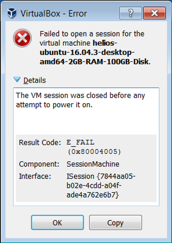
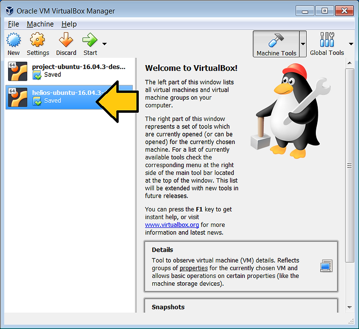
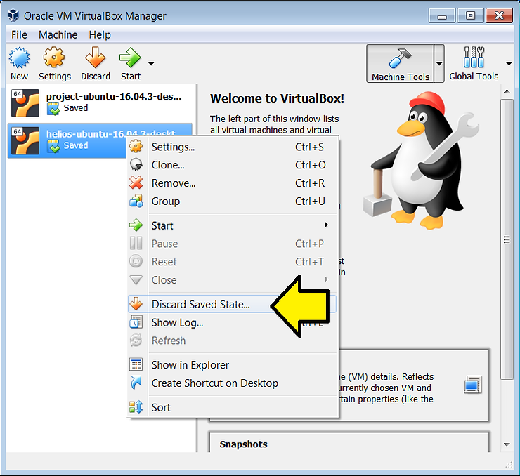
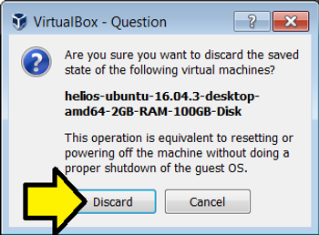

# Fix E_FAIL Virtual Machine **Launch**

**<u>Short</u>**

Right-click Discard Saved State... to fix E\_FAIL (0x80004005) on Version 5.2.12 r122591 (Qt5.6.2).

**<u>Step-by-Step</u>**

If you see this error:

Right click on the virtual machine you tried to start:

...and click **Discard Saved State...**

Click **Discard**

Then start the virtual machine.

**<u>Text of Error</u>**

VirtualBox - Error

Failed to open a session for the virtual machine **machine-name**.

The VM session was closed before any attempt to power it on.

Result Code:

E\_FAIL (0x80004005)

Component:

SessionMachine

Interface:

ISession {7844aa05-b02e-4cdd-a04f-ade4a762e6b7}

**<u>References</u>**

-   Answer to https://www.virtualbox.org/ticket/6930 by Democritus
    
-   VirtualBox logo from \[[link](https://linux.systeminside.net/como-instalar-y-configurar-virtualbox/)\]