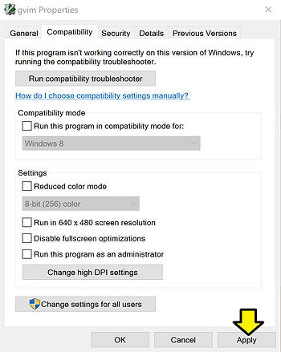

# Fix tiny gvim8.2 font on Windows 10

This short post was written to list a fix for "tiny text" when running gvim 8.2 on Windows 10.

With this "fix" gvim goes from:

...to

**<u>Steps</u>**

Step [#1](https://www.centennialsoftwaresolutions.com/blog/hashtags/1): Browse to C:\\Program Files (x86)\\Vim\\vim82

Step [#2](https://www.centennialsoftwaresolutions.com/blog/hashtags/2): (1) Right-click on **gvim** and (2) click **Properties**

Step [#3](https://www.centennialsoftwaresolutions.com/blog/hashtags/3): (1) Click the **Compatibility** tab and (2) click **Change high DPI settings**

Step [#4](https://www.centennialsoftwaresolutions.com/blog/hashtags/4): (1) Select the **Override high DPI scaling behavior. Scaling performed by:** and (2) select **System (Enhanced)**

Note: Selecting **System** also increases the font size. Selecting **Application** does not increase the font size.

Step [#5](https://www.centennialsoftwaresolutions.com/blog/hashtags/5): Click **Apply**

**<u>Bonus</u>**

The font will likely look bad you can add:

source C:/Users/Zach\\ Pfeffer/Google\\ Drive/config/\_vimrc

**if has('gui\_running')**

**set Courier\_New:h10:cANSI:qDRAFT**

**endif**

..to your \_vimrc

I've also included how I source a common \_vimrc I keep in a Google Drive (to share among other computers.

You'll put this \_vimrc in your user directory (like C:\\Users\\Zach Pfeffer)

**<u>References</u>**

-   Fix found in the thread entitled "Optimize HiDPI Screen on GVim Windows [#1059](https://www.centennialsoftwaresolutions.com/blog/hashtags/1059)" posted at \[[<u>link</u>](https://github.com/vim/vim/issues/1059)\]
    
-   The Vim logo is from \[[<u>link</u>](http://commons.wikimedia.org/wiki/File:Vimlogo.svg)\]
    
-   Bonus material on fonts found at \[[<u>link</u>](https://vim.fandom.com/wiki/Change_font)\]