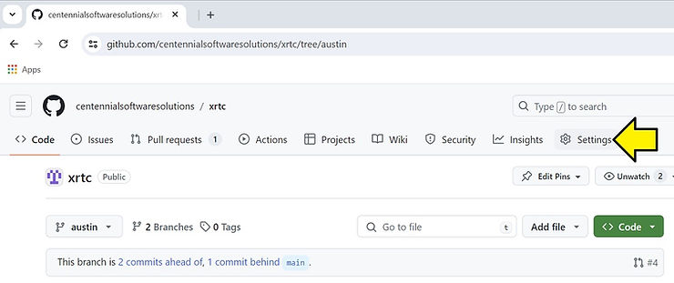
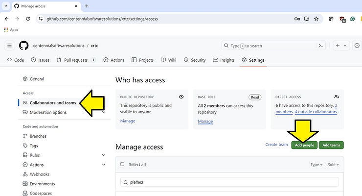
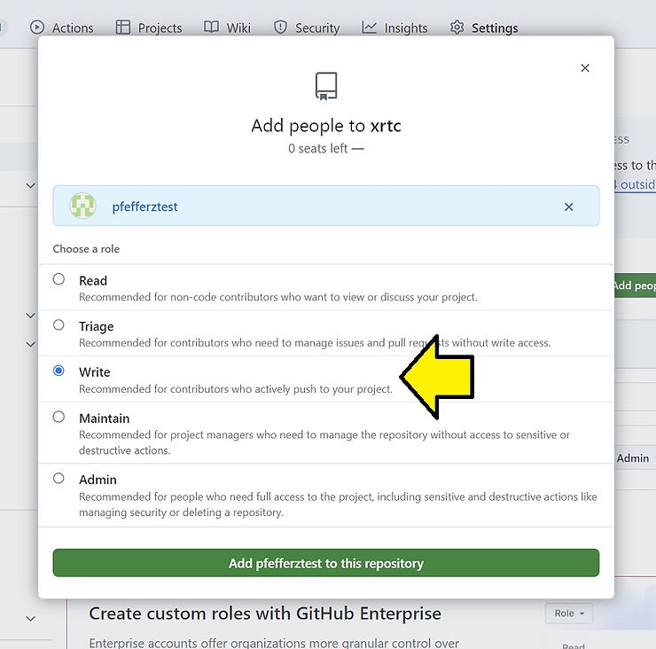
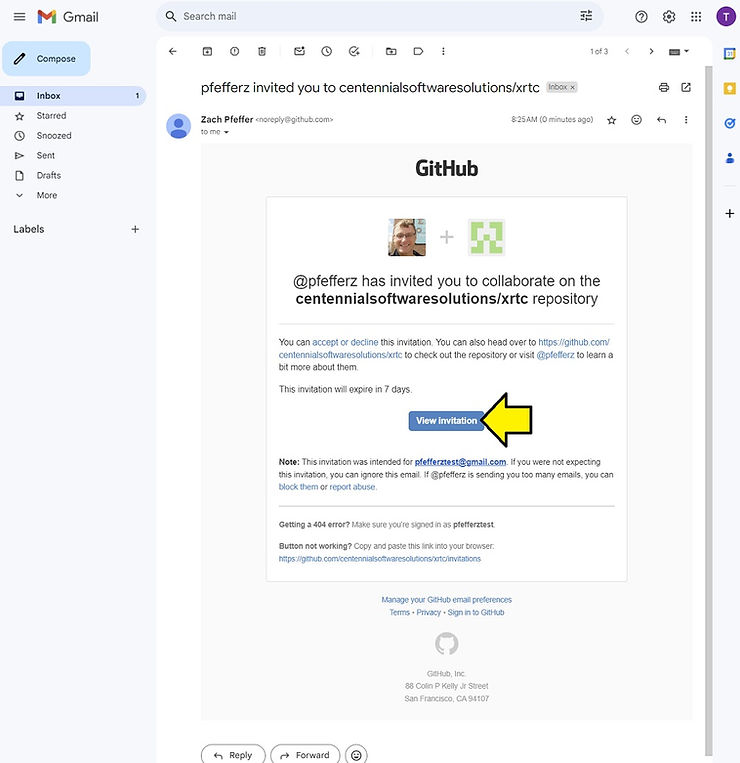
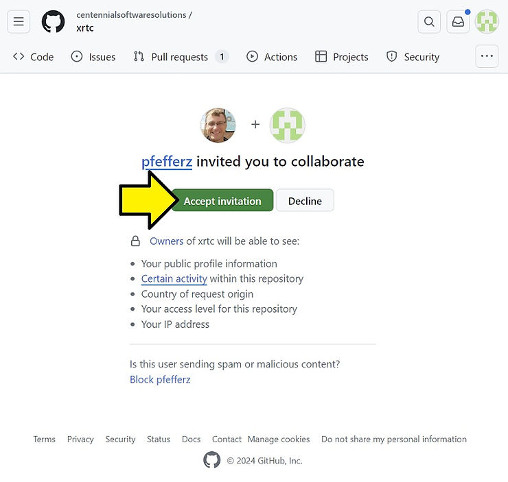
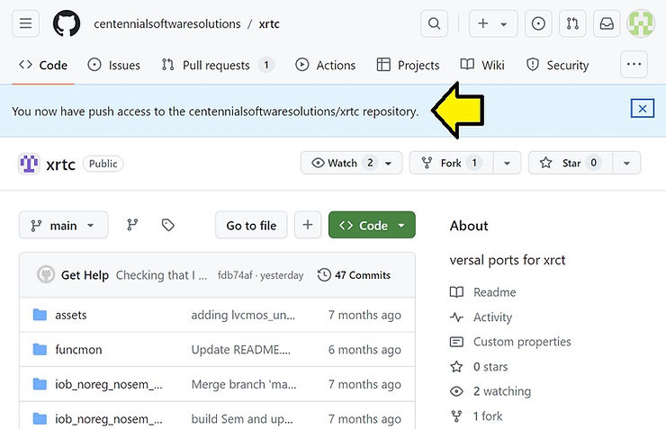
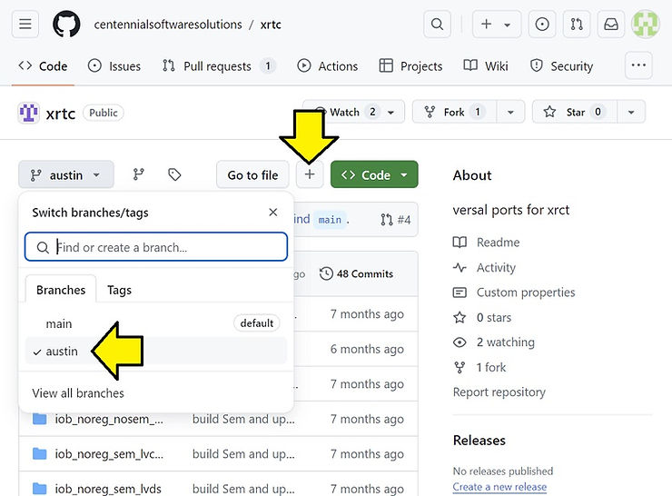
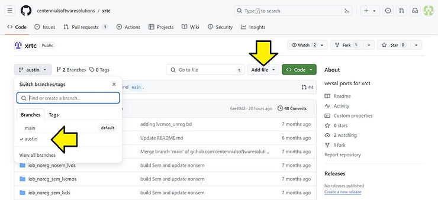
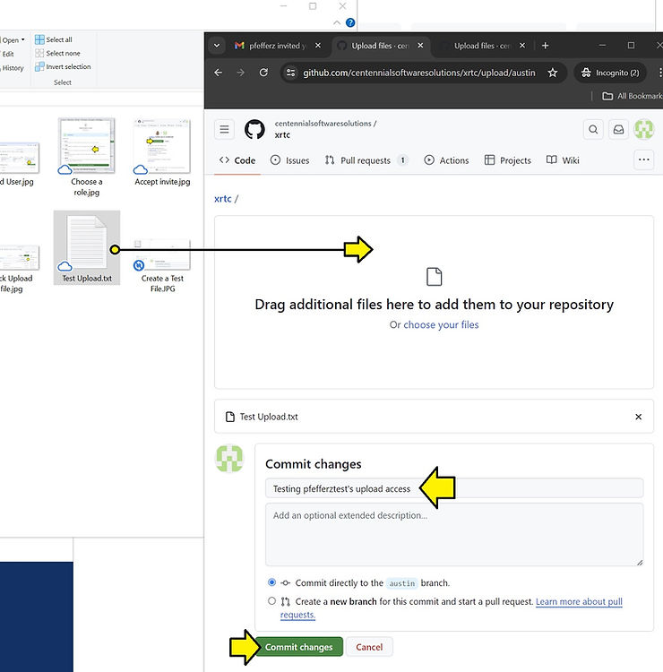
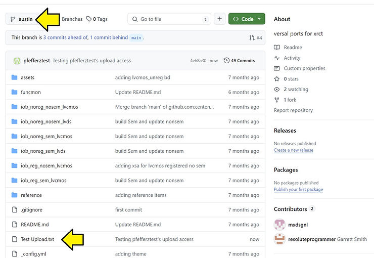

# Fix 'Uploads are disabled' GitHub Error

This post shows how to fix 'Uploads are disabled' in GitHub by enabling push access to a GitHub repository. This fixes the error: "Uploads are disabled. File uploads require push access to this repository."

## The Uploads are disabled Error

## Add the User to Your Repository

1\. Add the person as a collaborator to your repository if they aren't already.

a. Go to your repository on GitHub.

b. Click on Settings in the toolbar.

c. Click on 'Collaborators and teams' and 'Add people.'

d. Enter the GitHub username of the person you want to add, give them 'Write access,' and click Add person to this repository.

e. Have the invited person check their email, find the invite, and click on 'View invitation.'

f. Have them click 'Accept invitation'

g. They should see a page confirming that they have push access.

## Test from Web

a. On this page, have them select the branch and click the **+** or...

...click **Add file**

b. Click 'Upload files.'

c. Create a file, add it, create a commit message, and click 'Commit changes.'

d. Click on your branch and see your new file.

