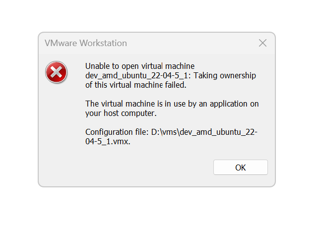
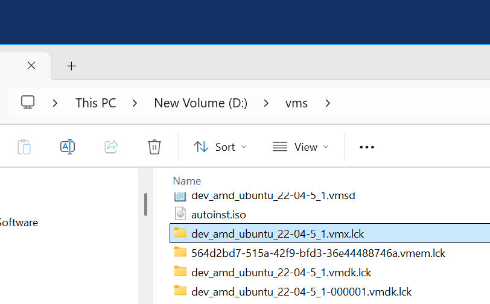

# Fix "VMware Unable to open virtual machine" on Windows

You might see this error if the computer running VMware was restarted.

These steps were verified on 8/14/2025 using VMware® Workstation 17 Pro 17.5.2 build-23775571.

**Steps**:

1. Note the `.vmx` file's folder.

2. Locate the `.vmx.lck folder`.

3. Delete it.

