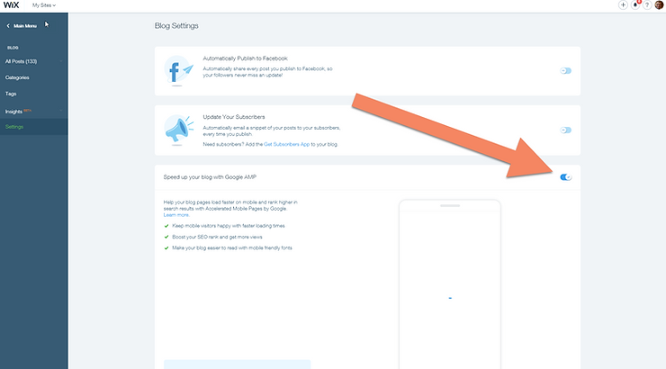

# "Fixed" HTML tags not showing up on mobile devices


This post list why the contents of my embedded HTML tags failed to show up on mobile devices.

**Summary**

After turning off Google AMP, I am able to see embedded HTML tags

**Test It!**

If you're on mobile can you see what this says:

```
I'm visible now!
```

**Support Email to Wix**

HTML Elements with tags are not showing up

On my blog: www.zachpfeffer.com, I list technical howtos. I use the embed HTML with the <pre></pre> tag a lot. However, I have reports that people are unable to see these boxes on their Android devices in Chrome. Most of my pages have this element. For example the page at: [http://www.zachpfeffer.com/single-post/Change-the-title-of-a-terminal-on-Ubuntu-1604](http://www.zachpfeffer.com/single-post/Change-the-title-of-a-terminal-on-Ubuntu-1604) which was posted on reddit got the following feedback:

Anyhow. Would you please take a look?

\-Zach

**Reply**


Dear Zach,

Thank you for contacting Wix.

When I checked your blog settings, I noticed that you currently have Google AMP activated as can be seen here:



Google AMP (Accelerated Mobile Pages) helps to:

-   Keep your mobile visitors happy with faster loading times.
    
-   Boost your SEO rank and get you more views.
    
-   Make your blog easier to read with mobile friendly fonts.
    

Once you turn on Google AMP, visitors using a mobile device are directed to the Google AMP optimized page when accessing your blog posts through Google Search or a shared link (e.g. on Facebook, Whatsapp etc.).

Visitors who access your site directly (by entering the site URL) and select a post blog, do not see the optimized page. Click here to learn more about the AMP project.

The Google AMP optimized page displays your blog post content and images only. It does not display any other elements (e.g. Recent Posts, Featured Posts, font formatting, HTML embedded elements, etc.) placed on the Single Post page.

As a work around, you may instead want to use images of the code you are currently displaying through HTML is simply illustrative, you may instead want to take screenshots and display them as images in your blog in order to avoid this issue with the AMP version of your blog pages.

Please let us know if you need any further assistance.

Kind regards, Daniel 

Wix Customer Solutions Expert

## _Great support Wix! Thank you!_

**References**

Wix logo from \[[link](http://www.wix.com/stories/press-releases/wix-com-returns-to-super-bowl-for-the-third-year-in-a-row/)\]