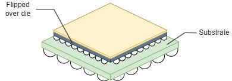

# Flip-Chip (1.0 mm)?

This post answers **flip-chip (1.0 mm)?** In other words, what does "flip-chip" mean, and why is 1.0 mm important? It also provides links to additional flip-chip resources.

## Flip-Chip (1.0 mm)?

Flip-chip technology is a method used in the manufacturing of integrated circuits (ICs) and electronic devices. The term "flip-chip" refers to the process of mounting semiconductor chips directly onto a substrate or another chip, with their active surface facing downwards. This is in contrast to the traditional method of mounting chips with their active surface facing upwards.

The "1.0 mm" designation in "Flip-Chip (1.0 mm)" refers to the "pitch," the distance between the center of one bump or solder ball and the center of the adjacent one. A pitch of 1.0 mm means the bumps or solder balls on the flip-chip package are spaced 1.0 mm apart.

## Flip-Chip Package Technology Advantages

Flip-chip technology offers several advantages over conventional packaging methods, including:

**Improved electrical performance**: Because the electrical connections are shorter and more direct, flip-chip configurations can offer better electrical performance compared to wire-bonded packages.

**Enhanced thermal performance**: The direct attachment of the chip to the substrate or another chip allows for better heat dissipation, which is crucial for high-performance applications where heat management is critical.

**Higher packing density**: Flip-chip configurations typically allow for a higher density of interconnects compared to wire-bonded packages, enabling more functionality to be packed into a smaller footprint.

**Reduced inductance**: The shorter interconnect lengths in flip-chip configurations result in lower inductance, which can be advantageous for high-speed and high-frequency applications.

Flip-chip technology has become increasingly popular in the semiconductor industry due to these and other benefits for a wide range of applications, from consumer electronics to high-performance computing.

## Flip-Chip Package Technology Drawbacks

**Cost**: Flip-chip packaging can be more expensive than traditional packaging methods, primarily due to the additional manufacturing steps involved, such as the deposition of under-bump metallization (UBM) layers and the need for more precise alignment during assembly.

**Complexity**: The design and manufacturing process for flip-chip packages can be more complex than traditional packaging methods, requiring specialized equipment and expertise. This complexity can result in longer development times and higher initial costs.

**Reliability concerns**: Flip-chip packages are more susceptible to certain reliability issues, such as solder joint fatigue and cracking, especially in applications with thermal cycling or mechanical stress. Careful design and material selection are necessary to mitigate these reliability concerns.

**Testing challenges**: Testing flip-chip packages can be more challenging compared to traditional packages, as access to the chip's active surface may be limited once it is mounted. Specialized testing methods and equipment may be required to ensure the quality and functionality of flip-chip devices.

**Thermal management**: While flip-chip configurations offer improved thermal performance compared to wire-bonded packages, proper thermal management is still crucial, especially for high-power applications. Inadequate heat dissipation can lead to thermal issues such as overheating and reduced reliability.

Despite these drawbacks, flip-chip technology is widely used in the semiconductor industry, where its benefits outweigh the drawbacks. Ongoing advancements in materials, design techniques, and manufacturing processes aim to mitigate drawbacks and further improve the performance and reliability of flip-chip packages.

## More Info

-   Wikipedia Flip-Chip \[ [<u>live</u>](https://en.wikipedia.org/wiki/Flip_chip) \] \[ [<u>cached</u>](https://drive.google.com/file/d/1qSs66Vc-RU3ayCsgtHuUJc1eFyuXB5kD/view?usp=sharing) \]
    
-   Versal Adaptive SoC Packaging and Pinouts Architecture Manual (AM013) \[ [<u>live</u>](https://docs.amd.com/r/en-US/am013-versal-pkg-pinout/Flip-Chip-Packages) \] \[ [<u>cached</u>](https://drive.google.com/file/d/1qSgxB-LJ4JgkDUpYxu5YvKOgyjMntKkW/view?usp=sharing) \]
    
-   Xilinx Advanced Packaging \[ [<u>live</u>](https://www.xilinx.com/publications/prod_mktg/pn0010951.pdf) \] \[ [<u>cached</u>](https://drive.google.com/file/d/1qMLyucxYK74qBknsyGowPOtpNBT9qXgc/view?usp=sharing) \]
    

Note: All docs cached on 2024-05-03