# FreeRTOS Hello, World! on Xilinx's ZCU102 Zynq UltraScale+ MPSoC's R5 Using the 2019.1 SDK

This post shows how to build and run a FreeRTOS Hello, World! on the Xilinx ZCU102 Zynq UltraScale+ MPSoC's R5 Using the 2019.1 SDK. The post also shows how to configure and receive UART output from the R5. It also lists steps to install Vivado 2019.1 and the SDK and create a PS design to run Hello, World! on.

**<u>Steps</u>**

Step [#1](https://www.centennialsoftwaresolutions.com/blog/hashtags/1): Install Vivado 2019.1 (with the SDK option)

Click \[[<u>link</u>](https://www.centennialsoftwaresolutions.com/post/install-the-2019-1-vivado-hl-design-edition-and-xilinx-sdk)\] for steps.

Step [#2](https://www.centennialsoftwaresolutions.com/blog/hashtags/2): Create a PS design, export the hardware and launch the SDK

Click \[[<u>link</u>](https://www.centennialsoftwaresolutions.com/post/create-a-zcu102-ps-in-vivado-2019-1)\] for steps (skip the install Vivado 2019.1 steps)

After Step [#2](https://www.centennialsoftwaresolutions.com/blog/hashtags/2) you should see the SDK in this state:

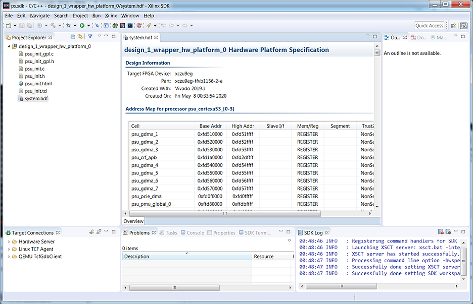

Step [#3](https://www.centennialsoftwaresolutions.com/blog/hashtags/3): 

A) Click **File**

B) Click **New**

C) Click **Application Project**

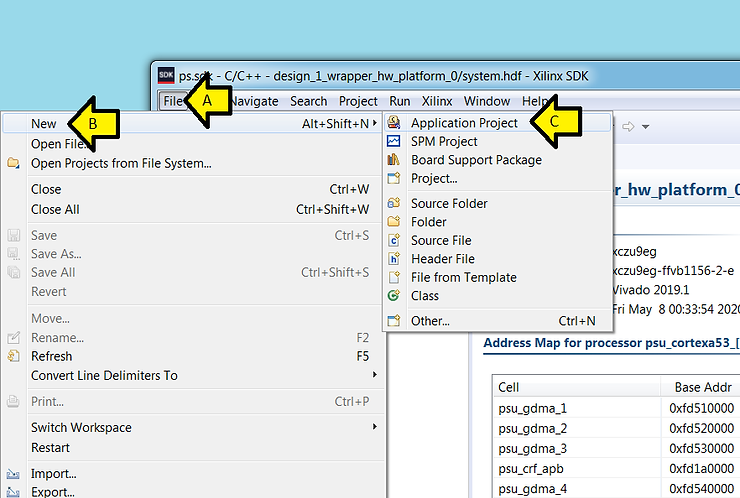

Step [#4](https://www.centennialsoftwaresolutions.com/blog/hashtags/4):

A) Set **Project name** to **r5\_freertos\_helloworld**

B) Leave default **Use default location** checked

C) Click to select

D) Select freertos10\_xilinx

E) Leave default: **design\_1\_wrapper\_hw\_platform\_0** selected

F) Click to select

G) Select **psu\_cortexr5\_0**

H) Leave default: **r5\_freertos\_helloworld\_bsp**

I) Click **Next >**

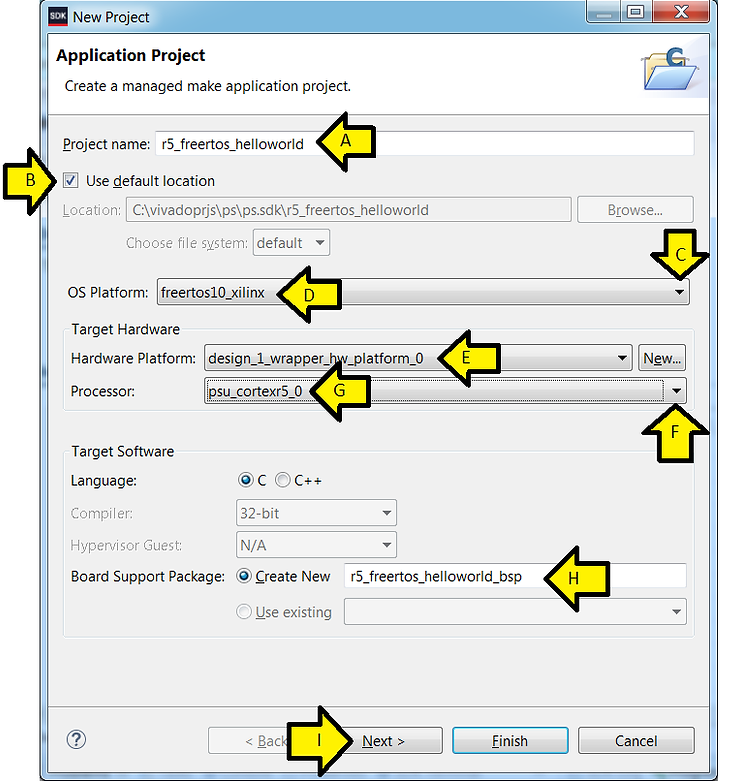

Step [#5](https://www.centennialsoftwaresolutions.com/blog/hashtags/5):

A) Leave default: **FreeRTOS Hello World** selected

B) Click **Finish**

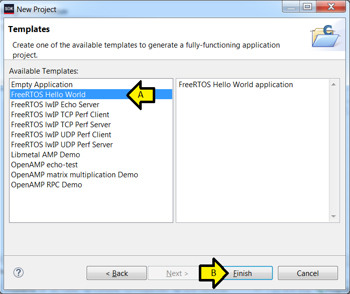

Step [#6](https://www.centennialsoftwaresolutions.com/blog/hashtags/6): Wait for the build to complete. It took about a minute on my computer \[[<u>link</u>](https://www.zachpfeffer.com/single-post/2017/01/28/New-T460-System-Information)\] (+16 GB of RAM).

Step [#7](https://www.centennialsoftwaresolutions.com/blog/hashtags/7): Plug in the cables

A) Plug in the power

B) Plug a USB A-Male to Micro B cable from the computer into the USB-to-JTAG port (J2)

C) Plug a USB A-Male to Micro B cable from the computer into the USB-to-serial port (J83)

D) Turn on the ZCU102

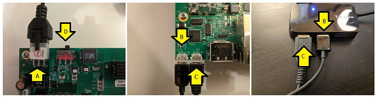

A) Right-click **r5\_freertos\_helloworld**

B) Click **Debug As**

C) Click **Launch on Hardware (System Debugger)**

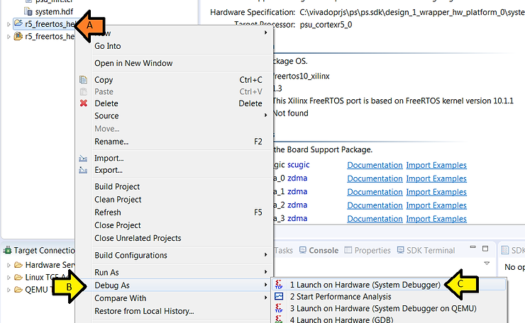

D) Click **Yes**

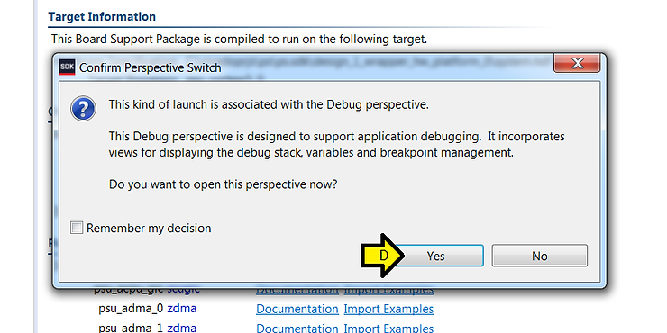

Step [#9](https://www.centennialsoftwaresolutions.com/blog/hashtags/9): Connect to the R5's serial port

A) Click SDK Terminal

B) Click the +

C) Click the pull-down

D) Select the 2nd COM

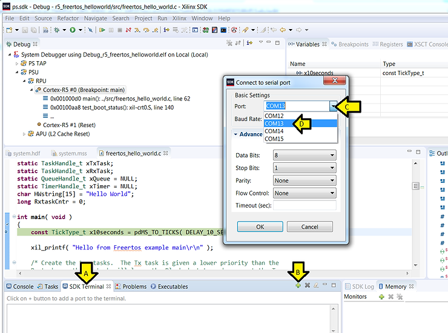

E) Leave default Baud Rate: **115200**

F) Leave default Data Bits: **8**

G) Leave default Stop Bits: **1**

H) Leave default Parity: **None**

I) Leave default Flow Control: **None**

J) Leave default Timeout (sec): **blank**

K) Click **OK**

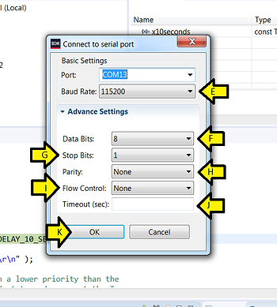

You should see:

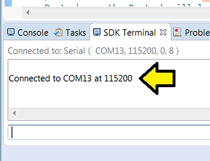

Step [#10](https://www.centennialsoftwaresolutions.com/blog/hashtags/10):

A) Click **Step Over** twice

B) You should see **Hello from Freertos example main**

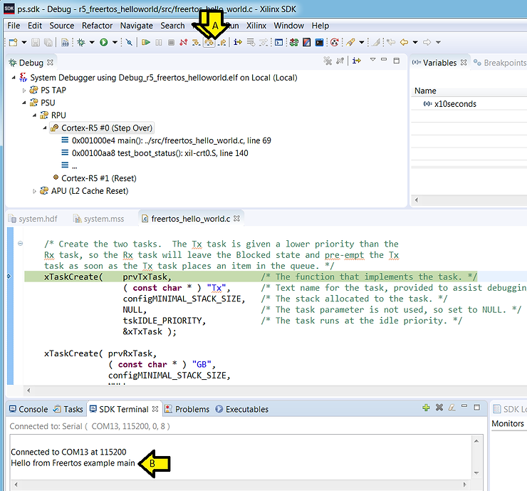

Step [#11](https://www.centennialsoftwaresolutions.com/blog/hashtags/11):

A) Click **Resume**

B) After a bit of time, you should see **FreeRTOS Hello World Example PASSED**

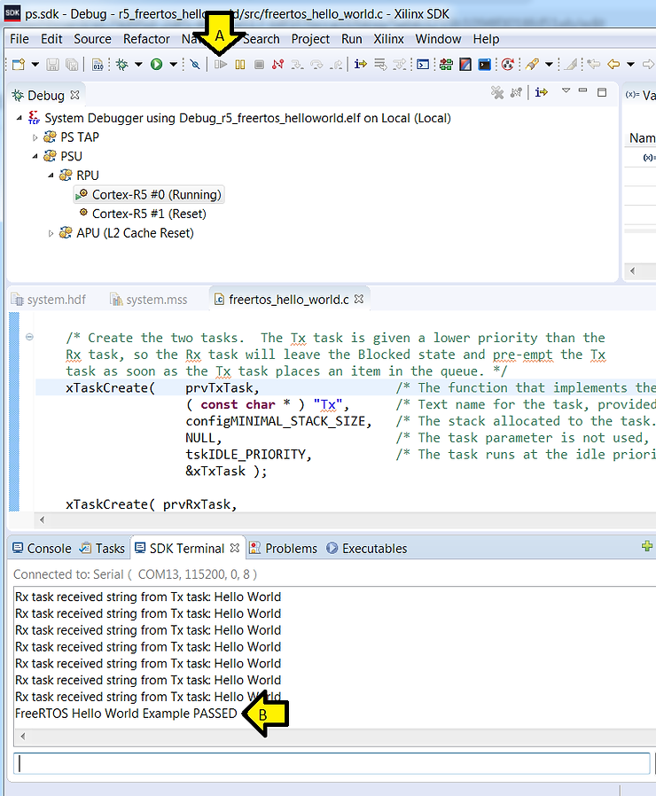

**<u>References</u>**

-   Xilinx Wiki / 3rd Party Operating Systems / FreeRTOS @ \[[link](https://xilinx-wiki.atlassian.net/wiki/spaces/A/pages/18842141/FreeRTOS)\]
    
-   Xilinx logo found via \[[link](https://twitter.com/xilinxinc)\]