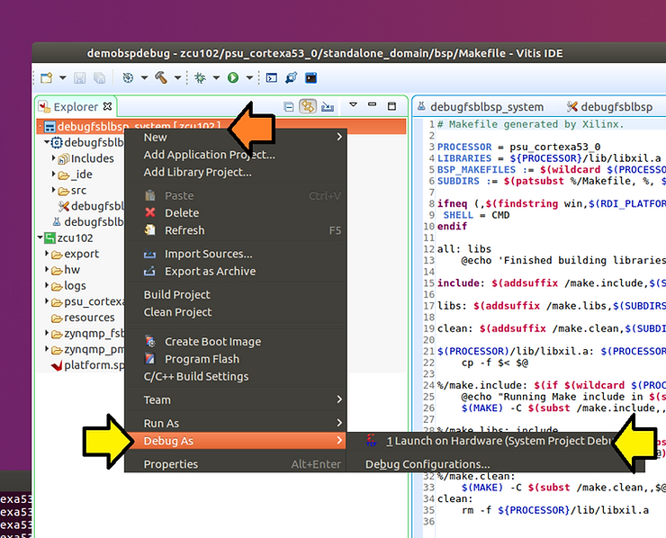

# FSBL Creation and Source Debug in Xilinx Vitis 2019.2


This post demonstrates how to create and debug a ZCU102 FSBL and FSBL BSP using Xilinx's 2019.2 Vitis, previously known as the Xilinx SDK.

**<u><span>Create an FSBL</span></u>**

[#1](https://www.centennialsoftwaresolutions.com/blog/hashtags/1) Run Vitis IDE 2019.2

[#2](https://www.centennialsoftwaresolutions.com/blog/hashtags/2) Set **Workspace:** to **/home/demo/demobspdebug** and click **Launch**

[#3](https://www.centennialsoftwaresolutions.com/blog/hashtags/3) Click the x to close the Welcome screen:


[#4](https://www.centennialsoftwaresolutions.com/blog/hashtags/4) Create an **Application Project…**


[#5](https://www.centennialsoftwaresolutions.com/blog/hashtags/5) Use **debugfsblbsp** for **Project name:** , accept defaults, and click **Next >**


[#6](https://www.centennialsoftwaresolutions.com/blog/hashtags/6) Click on the **Create a new platform from hardware (XSA)**, select **zcu102**, click **Next >**


[#7](https://www.centennialsoftwaresolutions.com/blog/hashtags/7) Click **Next >**


[#8](https://www.centennialsoftwaresolutions.com/blog/hashtags/8) Select **Zynq MP FSBL** and click **Finish**


Note: we have two FSBLs:

What we're working on:

**/home/demo/demobspdebug/debugfsblbsp/src**

Part of the "platform" which we don't use:

**/home/demo/demobspdebug/zcu102/zynqmp\_fsbl**

[#9](https://www.centennialsoftwaresolutions.com/blog/hashtags/9) Build the FSBL "app" and BSP. Click on **debugfsblbsp\_system \[zcu102\]** and click the **hammer icon** to build


Note: High-level progress is listed in the bottom left corner of the GUI:


Note 2:

You can switch between consoles here:


CDT Global Build Console

Contains all the build output

Output from this post: https://drive.google.com/file/d/1WnPVOeIhAaxuCrj3brqT8edOs-mjoedL/view?usp=sharing 

Platform Tcl Console

Contains the TCL commands used to create the platform(s)

Output from this post: https://drive.google.com/file/d/1WqDV2ScxiYO3Xl6wfav4vJCh1ni3LBQ9/view?usp=sharing 

Build Console [debugfsblbsp_system, Debug]

Contains "system" level commands, in this case the command that creates a BOOT.BIN using a BIF

Output from this post: https://drive.google.com/file/d/1WqOUhMh3pG2m1p0hdJJ5rUBMFNqZZZJz/view?usp=sharing 

Build Console [debugfsblbsp, Debug]

Contains the build output from the FSBL we're building (not the one under zcu102)

Output from this post: https://drive.google.com/file/d/1WsBNmWF0FhChRt_xszzC6VxOKyfriwk4/view?usp=sharing 

Build Console [zcu102]

Contains the build output from the BSP build.

Output from the post: https://drive.google.com/file/d/1X-qXkF3p3iY45H90CGmLKs-3avCMHXrB/view?usp=sharing 

**<u><span>Debug the Created FSBL</span></u>**

[#1](https://www.centennialsoftwaresolutions.com/blog/hashtags/1) Test. Right-click on **debugfsblbsp**, hover over **Debug As**, and **click Launch on Hardware (System Project Debug)**



You should see:


[#2](https://www.centennialsoftwaresolutions.com/blog/hashtags/2) Update the debug configuration to point to the FSBL we're working on. Click the down arrow by the bug icon and select **Debug Configurations…**


[#3](https://www.centennialsoftwaresolutions.com/blog/hashtags/3) Expand **System Project Debug**, click on **SystemDebugger\_debugfsblbsp\_system**, click on **Target Setup**, deselect **Run psu\_init**, and deselect **Use FSBL flow for initialization**.


[#4](https://www.centennialsoftwaresolutions.com/blog/hashtags/4) Click **Apply** and click **Debug**


Note: changing the Target Setup is needed because running the FSBL twice, runs the psu\_init twice, which causes problems. psu\_init is a bunch of generated code that actually "connects" the Vivado output to the embedded platform output.

You should see the FSBL we're debugging downloaded:


[#5](https://www.centennialsoftwaresolutions.com/blog/hashtags/5) Look at the console output. Type:

```
screen /dev/ttyUSB0 115200
```

Note:

Ctrl-a d to detach screen -r to reattach:

You should see:

```
Xilinx Zynq MP First Stage Boot Loader
Release 2019.2   Dec  3 2021  - 15:41:27
PMU-FW is not running, certain applications may not be supported.
```

[#6](https://www.centennialsoftwaresolutions.com/blog/hashtags/6) 

(A) Click **Design**, (B) click **xfsbl\_main.c**, (C) Add a "My" to the string, (D) click **build**, and (E) click **debug**


You should see the following on your terminal:

```
My Xilinx Zynq MP First Stage Boot Loader 
Release 2019.2   Dec  3 2021  - 16:46:24
PMU-FW is not running, certain applications may not be supported.
```

**<u><span>Enable FSBL Debug Symbols (and Fix Error)</span></u>**

[#1](https://www.centennialsoftwaresolutions.com/blog/hashtags/1) Enable debug symbols in the FSBL.

(A) Click **Design**, (B) right-click on **debugfsblbsp \[standalone on psu\_cortexa53\_0\]**, (C) click **C/C++ Build Settings**


[#2](https://www.centennialsoftwaresolutions.com/blog/hashtags/2) Click **C/C++ Build > Settings** and click **Miscellaneous**


[#3](https://www.centennialsoftwaresolutions.com/blog/hashtags/3) Change:

**\-Os -flto -ffat-lto-objects**

to

**\-O1**

…and click Apply

…and click Apply and Close


You'll see errors:


Console output from this post: https://drive.google.com/file/d/1XAjRiuaPisCuMg9tSzaRu66mgRulBLzj/view?usp=sharing

[#4](https://www.centennialsoftwaresolutions.com/blog/hashtags/4) Fix errors. (A) Open **xfsbl\_config.h** and...


(B) set all of these from:

```
#define FSBL_NAND_EXCLUDE_VAL                             (0U)
#define FSBL_QSPI_EXCLUDE_VAL                             (0U)
#define FSBL_SD_EXCLUDE_VAL                               (0U)
#define FSBL_SECURE_EXCLUDE_VAL                           (0U)
#define FSBL_BS_EXCLUDE_VAL                               (0U)
#define FSBL_EARLY_HANDOFF_EXCLUDE_VAL                    (1U)
#define FSBL_WDT_EXCLUDE_VAL                              (0U)
#define FSBL_PERF_EXCLUDE_VAL                             (1U)
#define FSBL_A53_TCM_ECC_EXCLUDE_VAL                      (1U)
#define FSBL_PL_CLEAR_EXCLUDE_VAL                         (1U)
#define FSBL_USB_EXCLUDE_VAL                              (1U)
#define FSBL_PROT_BYPASS_EXCLUDE_VAL                      (1U)
#define FSBL_PARTITION_LOAD_EXCLUDE_VAL                   (0U)
#define FSBL_FORCE_ENC_EXCLUDE_VAL                        (0U)
#define FSBL_DDR_SR_EXCLUDE_VAL                           (1U)
```

…to (all 1U):

```
#define FSBL_NAND_EXCLUDE_VAL                             (1U)
#define FSBL_QSPI_EXCLUDE_VAL                             (1U)
#define FSBL_SD_EXCLUDE_VAL                               (1U)
#define FSBL_SECURE_EXCLUDE_VAL                           (1U)
#define FSBL_BS_EXCLUDE_VAL                               (1U)
#define FSBL_EARLY_HANDOFF_EXCLUDE_VAL                    (1U)
#define FSBL_WDT_EXCLUDE_VAL                              (1U)
#define FSBL_PERF_EXCLUDE_VAL                             (1U)
#define FSBL_A53_TCM_ECC_EXCLUDE_VAL                      (1U)
#define FSBL_PL_CLEAR_EXCLUDE_VAL                         (1U)
#define FSBL_USB_EXCLUDE_VAL                              (1U)
#define FSBL_PROT_BYPASS_EXCLUDE_VAL                      (1U)
#define FSBL_PARTITION_LOAD_EXCLUDE_VAL                   (1U)
#define FSBL_FORCE_ENC_EXCLUDE_VAL                        (1U)
#define FSBL_DDR_SR_EXCLUDE_VAL                           (1U)
```

[#5](https://www.centennialsoftwaresolutions.com/blog/hashtags/5) Click **Save All** and click **Build**


You should see:


[#6](https://www.centennialsoftwaresolutions.com/blog/hashtags/6) Click **Debug**


You should see source-level debug working:


**<u><span>Enable Debug Symbols in the FSBL's BSP</span></u>**

[#1](https://www.centennialsoftwaresolutions.com/blog/hashtags/1) Enable symbols in the BSP

(A) Click **Design**

(B) Find and double-click the BSP's Makefile

(C) Scroll over the editor

(D) Find:

```
-Os -flto -ffat-lto-objects
```


[#2](https://www.centennialsoftwaresolutions.com/blog/hashtags/2) 

(A) Change:

```
-Os -flto -ffat-lto-objects 
```

…to

```
-O1
```

(B) Click **Save All**

(C) Click **Build**


You should see the correct flags in the BSP Build Console


Console output from this post: https://drive.google.com/file/d/1XGBCsNNTmT9hi8VAV9sA-sOwiWbUWvDT/view?usp=sharing 

[#3](https://www.centennialsoftwaresolutions.com/blog/hashtags/3) Rebuild the FSBL

(A) Click **debugfsblbsp \[standalone on psu\_cortexa53\_0\]**

(B) Click **Build**


You should see:


Console output from this post: https://drive.google.com/file/d/1XI7fGFNiOQ6WR4WNfO1Ys-uLe94lYIX1/view?usp=sharing 

(A) Open xfsbl\_ddr\_init.c

(B) Go to 6627:

ConfigIic = XIicPs\_LookupConfig(XPAR\_PSU\_I2C\_1\_DEVICE\_ID);

(C) Double-click to set a breakpoint

(D) Click debug

(E) When it hits:

```
               while (FsblStage<=XFSBL_STAGE_DEFAULT) {
```

…click **Resume**


(F) When it hits:

```
               Status = XFsbl_IicReadSpdEeprom(SpdData);
```

…click **Step Into**


You should see the source code inside the BSP:


**<u><span>References</span></u>**

-   Vitis 2019.2 - Embedded Software Development - Design Hub [<u><span>https://www.xilinx.com/support/documentation-navigation/design-hubs/2019-2/dh0089-vitis-embedded.html</span></u>](https://www.xilinx.com/support/documentation-navigation/design-hubs/2019-2/dh0089-vitis-embedded.html)
    
-   Zynq UltraScale+ FSBL Wiki [<u><span>https://xilinx-wiki.atlassian.net/wiki/spaces/A/pages/18842019/Zynq+UltraScale+FSBL</span></u>](https://xilinx-wiki.atlassian.net/wiki/spaces/A/pages/18842019/Zynq+UltraScale+FSBL)
    
-   Vitis Unified Software Platform Documentation Embedded Software Development UG1400 (v2019.2) March 18, 2020 [<u><span>https://www.xilinx.com/support/documentation/sw_manuals/xilinx2019_2/ug1400-vitis-embedded.pdf</span></u>](https://www.xilinx.com/support/documentation/sw_manuals/xilinx2019_2/ug1400-vitis-embedded.pdf)
    
-   Vitis Unified Software Platform Documentation Application Acceleration Development UG1393 (v2019.2) February 28, 2020 [<u><span>https://www.xilinx.com/support/documentation/sw_manuals/xilinx2019_2/ug1393-vitis-application-acceleration.pdf</span></u>](https://www.xilinx.com/support/documentation/sw_manuals/xilinx2019_2/ug1393-vitis-application-acceleration.pdf)
    
-   Xilinx logo clipped from [<u><span>xilinx.com</span></u>](http://xilinx.com/)