# Get and Install the 64-bit Arduino 1.8.7 IDE on Ubuntu 16.04.3

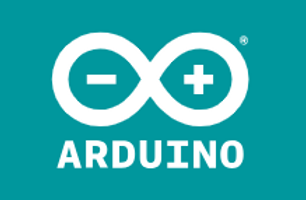

This post lists verified step-by-step instructions for getting, installing and running the 64-bit Arduino 1.8.7 IDE on Ubuntu 16.04.3.

Note: I've uploaded the arduino-1.8.7-linux64.tar.xz to \[[link](https://drive.google.com/file/d/1ukT8R9lG8_Go1CryYh-Q228LOXmnnjAg/view?usp=sharing)\]. The archive is 113 MB.

**<u>Prerequisite</u>**

You'll need around 700 MB for the archive and the extracted files.

**<u>Steps</u>**

1\. Go to \[[link](https://www.arduino.cc/en/Main/Software)\] and click **Linux 64 bits**

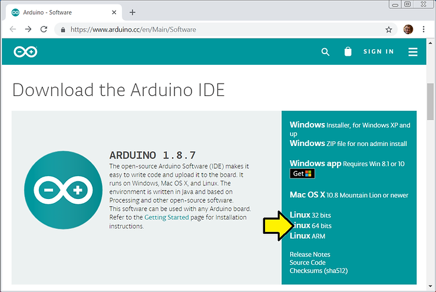

2\. Click **JUST DOWNLOAD**

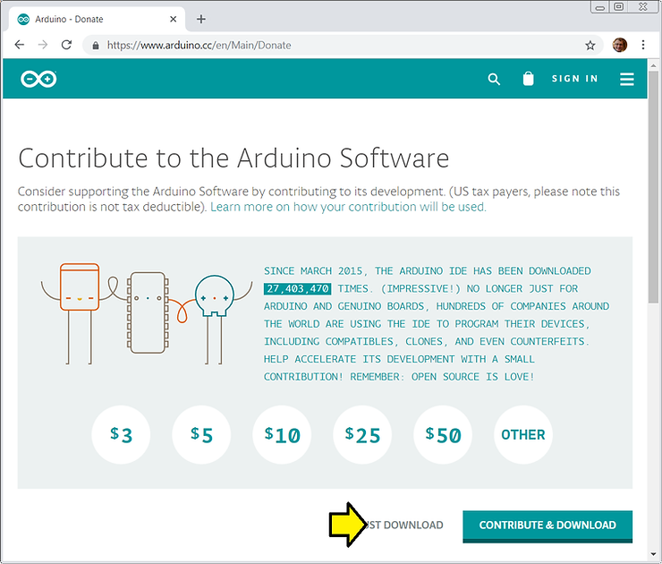

3\. (A) Click on your home directory, (B) click the **New Folder** button, (C) name it **arduinopkgs** and (D) click the **Create** button

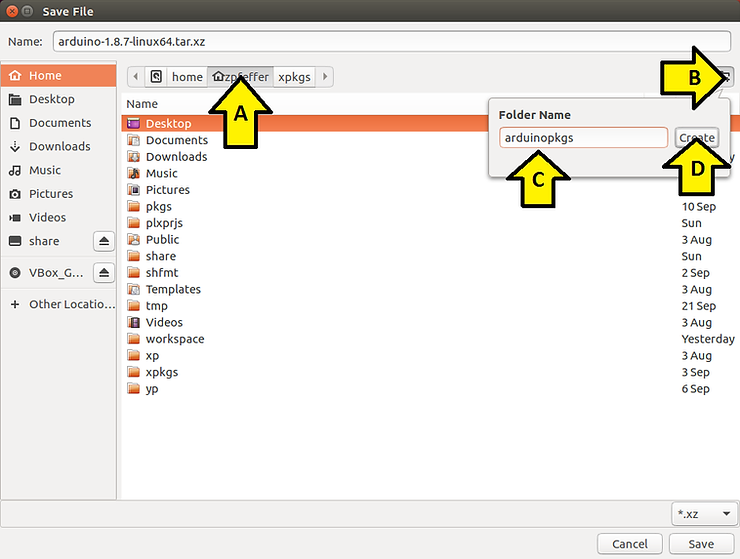

4\. Click **Save**

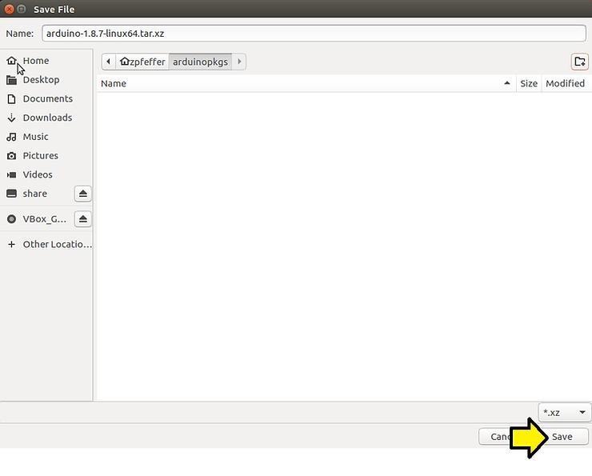

5\. Open a terminal

6\. Type **md5sum ~/arduinopkgs/arduino-1.8.7-linux64.tar.xz**

You should see:

efd7e010dcd621af5b0d4b693de7c4f2 /home/zpfeffer/arduinopkgs/arduino-1.8.7-linux64.tar.xz

Which matches:

6ad71c6e6afb877ed67c164cad885192 arduino-1.8.7-linux32.tar.xz

**efd7e010dcd621af5b0d4b693de7c4f2 arduino-1.8.7-linux64.tar.xz**

bcc237cd2e6519456562b8becef6753d arduino-1.8.7-r1-linuxarm.tar.xz

c45a8b283a3a61ad6ea45e1d7580a6d4 arduino-1.8.7-macosx.zip

3115138b8b82537dee3656586196644e arduino-1.8.7-windows.exe

15f64c4ddc1894ead5e56c48932daa14 arduino-1.8.7-windows.zip

These lines are listed at \[[link](https://downloads.arduino.cc/arduino-1.8.7.md5sum.txt)\].

7\. Type **cd ~/arduinopkgs**

8\. Type **file arduino-1.8.7-linux64.tar.xz**

You should see:

arduino-1.8.7-linux64.tar.xz: XZ compressed data

See \[[link](https://en.wikipedia.org/wiki/Xz)\] for what XZ compression means.

9\. Type **tar --lzma -xvf arduino-1.8.7-linux64.tar.xz** to extract the archive.

Notes

This command verbosely extracts the xz compressed archive in the file **arduino-1.8.7-linux64.tar.xz**

Type **tar --help | grep -C3 xz** to see:

\--lzma filter the archive through xz

Type **tar --help | grep -C3 "\\-x"** to see:

\-x, --extract, --get extract files from an archive

Type **tar --help | grep -C3 "\\-v"** to see:

\-v, --verbose verbosely list files processed

Type **tar --help | grep -C3 "\\-f"** to see:

\-f, --file=ARCHIVE use archive file or device ARCHIVE

To recreate the archive type **tar --lzma -cvf test.tar.xz arduino-1.8.7**. This won't create a binary exact archive replica, but the extracted data will be exactly the same.

Type to to check that the recreated archive is the same as the original

Note: compression takes 10x longer than extraction.

Type **du -hs arduino-1.8.7** to see that the directory is 511M:

511M arduino-1.8.7

10\. Type **cd ~/arduinopkgs/arduino-1.8.7**

11\. Type **./install.sh**

You should see:

Adding desktop shortcut, menu item and file associations for Arduino IDE... done!

...and

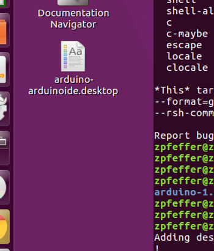

If you click on this you'll see:

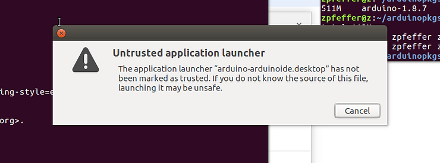

Click **Cancel**

You need to (A) **right click** on the icon and (B) click **Properties**:

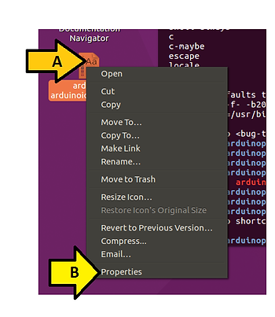

(A) Click the **Permissions** tab, (B) click **Allow executing file as program** until you see a **check mark** and (C) see the icon change.

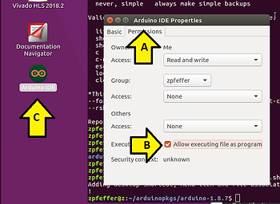

12\. Double-click on the Arduino IDE icon to run it

You should see:

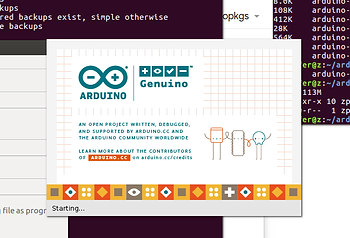

Followed by:

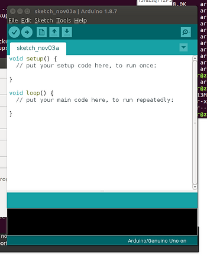

**<u>Reference</u>**

Arduino icon clipped from \[[link](https://www.arduino.cc/)\]

Quick start Arduino IDE install guide for Linux \[[link](https://www.arduino.cc/en/Guide/Linux)\]