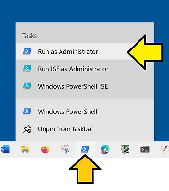

# "get wsl" Enable and Disable Microsoft-Windows-Subsystem-Linux in PowerShell

This post covers enabling and disabling Microsoft-Windows-Subsystem-Linux in PowerShell with "get wsl".

## Before You Start

Save all your work. You will reboot twice.

## Enable Steps - get wsl

\# Run Windows PowerShell as an Administrator: right-click on PowerShell and click **Run as Administrator**



\# Run:

```
Dism /Online /Enable-Feature /FeatureName:Microsoft-Windows-Subsystem-Linux /all
```

You will see something like this:

```

Deployment Image Servicing and Management tool
Version: 10.0.19041.844

Image Version: 10.0.19045.2965

Enabling feature(s)
[==========================100.0%==========================]
The operation completed successfully.
Restart Windows to complete this operation.
Do you want to restart the computer now? (Y/N)
```

\# Type: N

\# Save all your work

\# Run:

```
Restart-Computer
```

\# Wait for the computer to reboot.

\# Run Windows PowerShell

\# Test. Run:

```
wsl --list --online
```

You should see something like:

```
The following is a list of valid distributions that can be installed.
Install using 'wsl.exe --install <Distro>'.

NAME                                   FRIENDLY NAME
Ubuntu                                 Ubuntu
Debian                                 Debian GNU/Linux
kali-linux                             Kali Linux Rolling
Ubuntu-18.04                           Ubuntu 18.04 LTS
Ubuntu-20.04                           Ubuntu 20.04 LTS
Ubuntu-22.04                           Ubuntu 22.04 LTS
OracleLinux_7_9                        Oracle Linux 7.9
OracleLinux_8_7                        Oracle Linux 8.7
OracleLinux_9_1                        Oracle Linux 9.1
SUSE-Linux-Enterprise-Server-15-SP4    SUSE Linux Enterprise Server 15 SP4
openSUSE-Leap-15.4                     openSUSE Leap 15.4
openSUSE-Tumbleweed                    openSUSE Tumbleweed
```

## Disable Steps

\# Run Windows PowerShell as an Administrator

\# Run:

```
Dism /Online /Disable-Feature /FeatureName:Microsoft-Windows-Subsystem-Linux
```

You will see something like this:

```
Deployment Image Servicing and Management tool
Version: 10.0.19041.844

Image Version: 10.0.19045.2965

Disabling feature(s)
[==========================100.0%==========================]
The operation completed successfully.
Restart Windows to complete this operation.
Do you want to restart the computer now? (Y/N)
```

\# Type: N

\# Save all your work

\# Run:

```
Restart-Computer
```

\# Run Windows PowerShell

\# Test. Run:

```
wsl
```

You should see something like:

```
This application requires the Windows Subsystem for Linux Optional Component.
The system may need to be restarted so the changes can take effect.
Error code: Wsl/WSL_E_WSL_OPTIONAL_COMPONENT_REQUIRED
```

## Environment

Using this command from [ https://stackoverflow.com/questions/7330187/how-to-find-the-windows-version-from-the-powershell-command-line ]:

```
systeminfo /fo csv | ConvertFrom-Csv | select OS*, System*, Hotfix* | Format-List
```

Output:

```
OS Name             : Microsoft Windows 10 Pro
OS Version          : 10.0.19045 N/A Build 19045
OS Manufacturer     : Microsoft Corporation
OS Configuration    : Standalone Workstation
OS Build Type       : Multiprocessor Free
System Boot Time    : 5/11/2023, 12:59:23 PM
System Manufacturer : LENOVO
System Model        : 20MAS87F00
System Type         : x64-based PC
System Directory    : C:\WINDOWS\system32
System Locale       : en-us;English (United States)
Hotfix(s)           : 22 Hotfix(s) Installed.,[01]: KB5022502,[02]: KB4562830,[03]: KB4580325,[04]: KB5000736,[05]: KB5012170,[06]: KB5015684,[07]: KB5026361,[08]:
                      KB5006753,[09]: KB5007273,[10]: KB5011352,[11]: KB5011651,[12]: KB5014032,[13]: KB5014035,[14]: KB5014671,[15]: KB5015895,[16]: KB5016705,[17]:
                      KB5018506,[18]: KB5020372,[19]: KB5022924,[20]: KB5023794,[21]: KB5025315,[22]: KB5005699
```

## References

Windows Subsystem for Linux Documentation

https://learn.microsoft.com/pdf?url=https%3A%2F%2Flearn.microsoft.com%2Fen-us%2Fwindows%2Fwsl%2Ftoc.json 

Windows 10 Logo

[https://commons.wikimedia.org/wiki/File:Windows_logo_-_2012_%28dark_blue%29.svg](https://commons.wikimedia.org/wiki/File:Windows_logo_-_2012_(dark_blue).svg) 

Tux Logo

Tux (mascot). (2023, April 10). In *Wikipedia*. https://en.wikipedia.org/wiki/Tux_(mascot) 

[https://en.wikipedia.org/wiki/Tux_%28mascot%29#/media/File:Tux.png](https://en.wikipedia.org/wiki/Tux_(mascot)#/media/File:Tux.png) 

