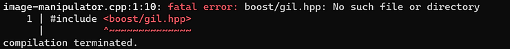
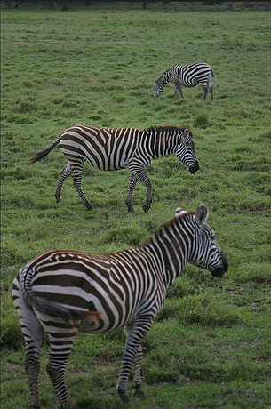
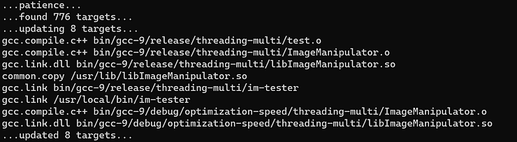
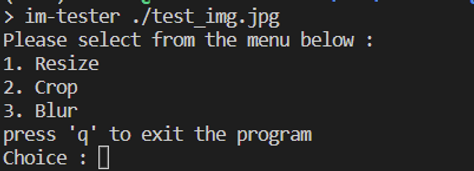
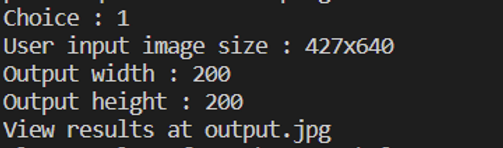
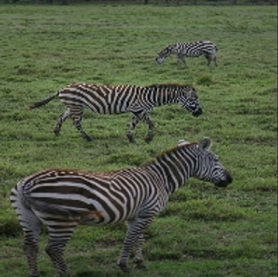

# Getting Started with BOOST and Jamfiles


Boost is a library built for efficient computations in C++. In this tutorial, we will be building a lightweight image processing tool using a boost library called GIL (Generic Image Processing)

The finished product of this tutorial is on Github and can be cloned from [<u><span>here</span></u>](https://github.com/centennialsoftwaresolutions/BoostImageManipulator.git). If you have suggestions or feature adds, please file a PR

## Requirements

-   Ubuntu 20.04
    

## Download Dependencies

-   Download required packages
    

```
sudo apt update
sudo apt -y install g++ libjpeg-dev xdg-utils gedit wget libboost1.71-tools-dev
```

-   Download boost library
    

```
wget https://boostorg.jfrog.io/artifactory/main/release/1.79.0/source/boost_1_79_0.tar.bz2
```

-   Unzip the library and install its components
    

```
cd ~
tar --bzip2 -xf ./boost_1_79_0.tar.bz2
cd boost_1_79_0/
./bootstrap.sh && ./b2 && ./b2 headers
```

## Start Building the Application

-   Make a project directory
    

```
cd ~
mkdir BoostImageManipulator
cd BoostImageManipulator
```

-   Create a file called image-manipulator.cpp and import the boost generic image library
    

```
gedit ImageManipulator.cpp
```

-   Enter the following code into the file
    

```
#include <boost/gil.hpp>
#include <boost/gil/extension/io/jpeg.hpp>
#include <iostream>

int main(int argc, char *argv[])
{
    using namespace std;
    namespace bg = boost::gil;
    if (argc < 2)
    {
        cout << "Please input path to image" << endl;
        return -1;
    }

    bg::rgb8_image_t user_input_img;
    bg::read_image(argv[1], user_input_img, bg::jpeg_tag{});
    bg::write_view("output.jpg", bg::const_view(user_input_img), bg::jpeg_tag{});

    return 0;
}
```

-   Try to compile using this command

```
g++ ImageManipulator.cpp
```

-   An error will appear like this:




-   This is because the boost library has not been linked to this compilation - try the compilation again with the boost library and the libjpeg library added
    

```
g++ -I $HOME/boost_1_79_0 ImageManipulator.cpp -o image-manipulator /usr/lib/x86_64-linux-gnu/libjpeg.a
```

-   Now run the application with any jpeg file as the first argument (feel free to use the image I'm using from here: [<u><span>https://github.com/centennialsoftwaresolutions/BoostImageManipulator/blob/master/test_img.jpg)</span></u>](https://github.com/centennialsoftwaresolutions/BoostImageManipulator/blob/master/test_img.jpg)
    

```
./image-manipulator ./test_img.jpg
```

-   Check your current directory and there should be a file with the name output.jpg that looks exactly the same as your input jpg

```
xdg-open ./output.jpg
```

-   If using the image referenced above, you should see some zebras:




## Making a BOOST Image Processing Class

Now let's make this into a BOOST-powered tool

-   Start by making a file called ImageManipulator.h and enter the following code:

```
gedit ImageManipulator.h
```

```
#include <boost/gil.hpp>
#include <boost/gil/extension/io/jpeg.hpp>
#include <boost/gil/extension/numeric/sampler.hpp>
#include <boost/gil/extension/numeric/resample.hpp>
#include <string>
#include <iostream>
#include <ios>
#include <stdexcept>

namespace bg = boost::gil;

class ImageManipulator {
    public:
      std::string image_fpath;

      ImageManipulator(std::string image_fpath);
      bg::rgb8_image_t resize_image(int height, int width);
      void crop_image(int bottom, int left, int height, int width);
      void blur_image();
      long int get_usr_input_img_width();
      long int get_usr_input_img_height();
    private:
      bg::rgb8_image_t usr_input_img;
      long int img_height;
      long int img_width;
};
```

-   And then clear the file and define the member functions in ImageManipulator.cpp
    

```
rm ImageManipulator.cpp -v
gedit ImageManipulator.cpp
```

-   Create the class constructor (loads the image from the filepath)
    

```
#include "ImageManipulator.h"

ImageManipulator::ImageManipulator(std::string image_fpath)
{
    this->image_fpath = image_fpath;
    bg::read_image(this->image_fpath, this->usr_input_img, bg::jpeg_tag{});
    this->img_height = this->usr_input_img.height();
    this->img_width = this->usr_input_img.width();
}
```

-   Boost.Gil can work with hundreds of different image input types
    
-   In this case a jpeg image is being read, but other tags and custom read tags can be used and created per [<u><span>this documentation</span></u>](https://www.boost.org/doc/libs/1_68_0/libs/gil/doc/html/io.html)
    
-   Add some manipulation functions - start with resizing
    

```
bg::rgb8_image_t ImageManipulator::resize_image(int width, int height)
{
    bg::rgb8_image_t resize_square(width, height);
    bg::resize_view(bg::const_view(usr_input_img), bg::view(resize_square), bg::bilinear_sampler());
    bg::write_view("output.jpg", bg::const_view(resize_square), bg::jpeg_tag{});
    return resize_square;
}
```

-   The boost GIL library uses "views" as a generic way of interacting with the hundreds of different formats for images. Casting to views is simple (in this case, bg::const\_view method)
    
-   Cropping
    

```
void ImageManipulator::crop_image(int top, int left, int width, int height)
{
    bg::rgb8c_view_t cropped_img;
    bg::point_t top_left_point(top, left);
    bg::point_t dimensions(width, height);
    cropped_img = bg::subimage_view(bg::const_view(this->usr_input_img), top_left_point, dimensions);
    bg::write_view("output.jpg", cropped_img, bg::jpeg_tag{});
}
```

-   Cropping is done by using "subimage\_view" boost GIL function which simply takes in two number pairs, the top left point and the desired dimensions of what should remain from that point
    
-   Blurring
    

```
void ImageManipulator::blur_image()
{
    bg::rgb8_image_t orig_image = this->usr_input_img;
    auto small_square = resize_image(this->img_width/5, this->img_height/5);
    this->usr_input_img = small_square;
    resize_image(orig_image.width(), orig_image.height());
    this->usr_input_img = orig_image;
}
```

-   Blurring the image can be done many ways, but one simple way to do it is to downsize using bilinear interpolation and then to resize the photo back to its original size
    
-   And last, a couple "getters"
    

```
long int ImageManipulator::get_usr_input_img_height()
{
    return this->img_height;
}


long int ImageManipulator::get_usr_input_img_width()
{
    return this->img_width;
}
```

-   Now compile the class as a library
    

```
g++ -fPIC -I $HOME/boost_1_79_0 -I ./ -c ImageManipulator.cpp
```

## Testing the Class with a Jamfile

Now for testing and cleaning up the build process

### The Test Code

-   Make a file called "test.cpp" in the image-manipulator folder and fill it with the following contents:

```
gedit test.cpp 
```

```
#include <ImageManipulator.h>

auto make_user_input_int(std::string input, int& output) {
    try{
        output = std::stoi(input.c_str());
    } catch (std::invalid_argument &) {
        return false;
    }
    return true;
}


template <typename T>
void get_user_info(std::string message, T*t)
{
    char user_input_line[255];
    printf("%s", message.c_str());
    std::cin.getline(user_input_line, 255);
    while (!make_user_input_int(user_input_line, *t))
    {
        std::cin.getline(user_input_line, 255);
    }
}


/* Test the class */
int main(int argc, char *argv[])
{

    std::string user_input_line;

    if (argc < 2)
    {
        printf("Please run this executable with a file path to the image you would like to manipulate as the first argument\n");
        return -1;
    }

    /* Instantiate the image tool with the path to the input file for this session */
    ImageManipulator imgManip((std::string)argv[1]);

    char op = 0;
    while (op != 'q')
    {
        printf("Please select from the menu below : \n");
        printf("1. Resize\n");
        printf("2. Crop\n");
        printf("3. Blur\n");
        printf("press 'q' to exit the program\n");
        printf("Choice : ");
        op = getchar();
        switch (op)
        {
            case '1':
            {
                int height, width;
                printf("User input image size : %ldx%ld\n", imgManip.get_usr_input_img_width(), imgManip.get_usr_input_img_height());
                get_user_info<int>("Output width : ", &width);
                get_user_info<int>("Output height : ", &height);
                imgManip.resize_image(width, height);
                printf("View results at output.jpg\n");
                break;
            }
            case '2':
            {
                int height, width, left, top;
                printf("User input image size : %ldx%ld\n", imgManip.get_usr_input_img_width(), imgManip.get_usr_input_img_height());
                get_user_info<int>("Leftmost pixel : ", &left);
                get_user_info<int>("Topmost pixel : ", &top);
                get_user_info<int>("Output width : ", &width);
                get_user_info<int>("Output height : ", &height);
                imgManip.crop_image(top, left, width, height);
                printf("View results at output.jpg\n");
                break;
            }
            case '3':
            {
                imgManip.blur_image();
                printf("View results at output.jpg\n");
                break;
            }
            case 'q':
            {
                break;
            }
            default:
            {
                printf("Invalid option, please choose again");
                break;
            }
        }
    }

    printf("Program finished...\n");
    return 0;
}
```

-   This test program simply takes in a file path to an image as the first argument, and then enters a case loop allowing the user to input parameters for resizing, cropping, and blurring the photo
    

### The Jamfile

Jamfiles are the build infrastructure supported by boost. They use calls from the Boost.Build library to support various types of multithreading, optimization, and platforms in a single build package. For a comprehensive overview of Boost.Build and Jamfiles, read more [<u><span>here</span></u>](https://www.boost.org/doc/libs/1_58_0/tools/build/tutorial.html)

```
gedit Jamfile
```

-   Begin by setting up the toolset and requirements

```
using gcc ;
```

-   "using gcc" sets the desired toolset


```
project
    : requirements <include>. <include>../boost_1_79_0/ <threading>multi
    : default-build release
    ;
```

-   The "project" command sets requirements for all targets in the project (ultimately they will be ImageManipulator and test in this example)
    
    -   "<include>." sets a path to any required header files
        
    -   "<threading>multi" turns on multithreaded builds
        
    -   "default-build release" sets the type of build that will be chosen if not given at compile-time on the command line
        

-   Then setup the library builds/linking
    

```
lib jpeg : : <name>jpeg <search>/usr/lib/x86_64-linux-gnu ;

lib ImageManipulator : ImageManipulator.cpp
                     : <optimization>speed
                     : <optimization>off
    ;
```

-   The "lib" command can either find an existing library or build one from source
    
    -   "lib jpeg" above shows how to find a library
        
        -   The "<name>jpeg" indicates the name of the library binary without the prefix "lib" and the suffix ".a" or ".so". In this case, the name of the jpeg library is libjpeg.a, so the name is "jpeg"
            
        -   "<search>/usr/lib/x86\_64-linux-gnu" indicates the parent directory of the target library
        
    -   "lib ImageManipulator" builds the library that we have made in the last few steps from source
        
        -   "ImageManipulator.cpp" is the source file
            
        -   "<optimization>speed" and "<optimization>off" instruct the build system to create two versions of the ImageManipulator library, one with each configuration option
            

-   Setup the executable build
    

```
exe im-tester : test.cpp ImageManipulator jpeg ;
```

-   Create the install rules
    

```
install install-lib : ImageManipulator : <target-os>linux:<location>/usr/lib ;  
install install-bin : im-tester : <target-os>linux:<location>/usr/local/bin 
```

## Build, Install, and Run

Finally, it is time to build the application, install it and the libraries, and run the tester

-   From the same directory as the Jamfile

```
sudo b2 -a
```



-   Run the program from anywhere on your system

```
im-tester ./test_img.jpg
```



-   Use any of the options that you would like
    



-   And view the output at output.jpg

```
xdg-open output.jpg
```

