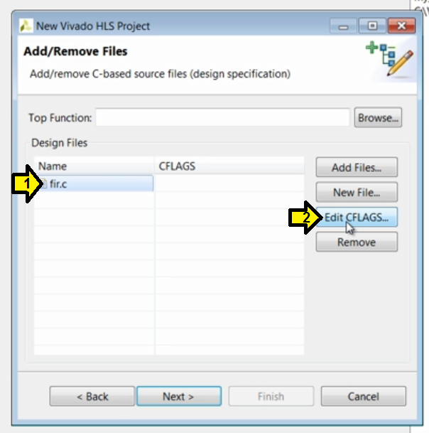

# Getting Started with Vivado High-Level Synthesis Transcript

This is a transcript of the Xilinx Quick Take video Getting Started with Vivado High-Level Synthesis at \[[<u>link</u>](https://www.xilinx.com/video/hardware/getting-started-vivado-high-level-synthesis.html)\].

**<u>Transcript</u>**

Hello and welcome to this quick take video on getting started with the Vivado high level synthesis.

In this short video, we will explain the basic features and functions of Vivado HLS. We will start with an overview of Vivado HLS and explain how it is used in an FPGA design flow. We will then review the basic features showing how you can easily create a new synthesis project or get started using one of the many example projects, validate the function of your C design, synthesize your C design into an RTL implementation and verify the RTL. Finally, we'll show how the output from Vivado HLS can be packaged for use with other Xilinx tools to implement your FPGA design.

Vivado HLS allows functions written in C, C++, SystemC and OpenCL kernels to be synthesized into an RTL implementation. Vivado HLS provides a number of optional C libraries to enable higher productivity and high performance RTL design. These include arbitrary precision libraries allowing operations to be performed at any arbitrary precision, for example: 10 bit, 25 bit or 42 bits rather than just the standard 8, 16, 32 and 64 bit provided in the C language. Video libraries allowing you to easily implement many of the most popular OpenCV video functions on math, linear algebra and DSP libraries providing high quality RTL implementations of sine, cos, Cholesky and Viterbi decoders among others. The output from Vivado HLS is a high quality RTL implementation in both verilog and VHDL. This RTL can be added into the Vivado IP catalog and used within IP integrator on Vivado or used in system generator for DSP.

Vivado HLS invokes showing the welcome screen. Here we can see the options for managing projects. We can create a new project, open an existing project, open an example project or select from a list of recent projects.

**<u>Manage Projects</u>**

Open an existing project,

Open an example project or

Select a recent project

In the example projects a number of examples are provided to help get you started.

**<u>Open an Example Project</u>**

Design examples include the **FIR** and **FFT** designs, **DSP** designs such as **QAM modulators** and **demodulators**, typical linear **algebra functions** as well as examples of using floating and fixed point types.

**<u>Design Examples</u>**

**FFT & FIR**

**QAM Modulation and Demodulation**

The coding examples of typically smaller designs which highlight how certain C constructs are synthesized offer a good starting point for anyone who wishes to understand high level synthesis. As the designs are small enough that all aspects of the RTL can be analyzed in depth.

**<u>Coding Style Examples</u>**

Finally, here we can directly access the Vivado HLS documentation and tutorials. Many of the features reviewed in this quick video are covered in more detail using step-by-step design examples in the **Vivado HLS tutorial**.

**<u>Documentation and Tutorials</u>**

We'll start by creating a new project.

**<u>Create a New Project Based on an Example (FIR)</u>**

**Step 1**: Click Create New Project

The new project wizard opens and we can see that the first field in which to enter data is the project name. Here we'll enter the name start\_prj. This will also be the name of the project directory on the disk. Then we can specify where this project will be located. Pressing next allows us to specify the function to be synthesized and any associated files.

**Step 2**:

1\. Enter **Project name**

2\. Enter **Location**

3\. Click **Next**

This example is a FIR design and the function to be synthesized resides in file fir.c.

**Step 3**: Click **Add Files...** to add FIR files

This function also uses a header file fir.h but since it resides in the same directory it will be automatically included.

**Step 4**:

1\. Select **fir.c**

2\. Click **Open**

If we needed to specify a different search path for the header file we could use the edit C flags button to add another search path using standards C compiler command line options.

**<u>Demo: Specify a Header File Path Different from the Path of the Corresponding C File</u>**

**Step D1**:

1\. Click **fir.c**

2\. Click **Edit CFLAGS...**

**Step D2**:

1\. Enter a path

2\. Click **Okay**

We can then directly specify the name of the function to be synthesized or use the browse button to specify this. Here we can see this file only contains one function fir.

**Step 5**: Specify the Top Function

Type it into the **Top Function** field or

Click **Browse...**

...then:

1\. Click **fir (fir.c)**

2\. Click **OK**

Pressing next allows us to specify the test-bench files. In this example, the test-bench is called fir\_test. This test-bench reads data from the file out.gold.dat and this file must also be included in the project. Holding down the shift key allows us to add this file to the selection.

**Step 6**: Add the test-bench files

Click **Add Files...**

**Step 6.1**:

1\. Click **fir\_test.c**

2\. Press **SHIFT**

3\. Click **out.gold.dat**

4\. Click **Open**

Pressing next takes us to the final screen of the project wizard, which allows us to specify the technical details of the initial **solution**.

**Step 7**:

Click **Next**

We'll leave the first solution name as the default solution1. The clock uncertainty is used to model net delays, which are unknown at this point in the design flow. As shown in this figure from the Vivado HLS user guide, the clock uncertainty is subtracted from the clock period to create an effective clock period. High level synthesis will create a design in which the nor logic paths which exceed this effect of plot PD it. This leaves some margin for net delays. If we leave this blank, it will default to 12.5% of the clock period.

Next, we can select the specific device.

**Step 8**: Select the part

Click **...**

For this example we'll simply select the first 7 series Kintex device.

**Step 8.1**: Select the product Family

1\. Click **drop down**

2\. Click family (kintex7 in this case)

**Step 8.2**: Select the **Part**

1\. Click the part

2\. Click **OK**

Pressing finish opens a new Vivado HLS project.

**Step 9**: Click **Finish**

The Vivado HLS graphical user interface or GUI consists of four panes: (1) the **project explorer** pane, (2) the **console** pane, (3) the **information** pane and (4) the **auxiliary** pane. We'll start to explain these as we use them and we can begin with the project explorer pane. Here we see the objects which are associated with this project, the source code, we also have the test batch files and the initial solution, which at this point only contains some constraint files. We'll discuss these later. If we double-click on the source code it opens in the **information pane**. Notice as soon as we open something in the information pain, the auxiliary pane provides more details on the file. Since this is a C source file, the outline tab shows the objects in this file. A quick review of this code shows we have an internal array called shiftreg, we iterate through a loop counting down. If we're not at zero, we shift values up the shift register and multiply the current value with a coefficient. If we're at 0, we add the latest input to the shift register and multiply it with the coefficient. Finally, we output the accumulated multiplications; a standard FIR filter.

We can see that this is a fully functional C development environment. For example, if we hovered the mouse over N we can see that it has a macro and its size is 11, so this design reads one sample: x and then iterates over 11 coefficients from an external array or memory to compute the output.

If we hold down the control key, we can jump to whatever this is defined.

**<u>Find Where a Macro is Defined</u>**

Step 1. Hold down the CONTROL key

Step 2. Click the macro (N in this case)

And here we can see it as defined in the header file fir.h.

We could make edits to any of these C files and resave them from within the Vivado HLS environment. But let's start by verifying the C function - is defined in the header fir.h. We could make edits to any of these C files and resave them from within the Vivado HLS environment, but let's start by verifying the C function.

For easy access, all the steps in the Vivado HLS design flow are provided in the toolbar. The steps are ordered left to right: (1) run the C simulation, (2) synthesize the design, (3) verify the RTL, and (4) export the final design as an IP block.

**<u>Vivado HLS Design Flow Steps:</u>**

1\. Run the C simulation

2\. Synthesize the design

3\. Verify the RTL

4\. Export the design as an IP block

The functions which are not ready to be performed are greyed out. The same steps and also provided in the menus or directly from the navigation pane.

**<u>Steps Available in the Solution Menu</u>**

**<u>Steps Available in the Navigation Pane</u>**

The first step, which should always be performed in any project is to validate the C design has the correct functionality. In other words, let's simulate the C code. This opens the C simulation dialogue window. More details on these options are provided in the Vivado HLS user guide \[[<u>link to 2018.3 version</u>](https://www.xilinx.com/support/documentation/sw_manuals/xilinx2018_3/ug902-vivado-high-level-synthesis.pdf)\] and in the Quick Take video **Verifying your Vivado HLS Design** \[[<u>YouTube</u>](https://www.youtube.com/watch?v=Dn5omH3aiag)\]. There was also a complete chapter on C validation and using the C debugger in the Vivado HLS tutorial. For now we'll simply use the default settings. Pressing okay compiles and executes the C code...

Simulate the C Code

**Step 1**: Click **Simulation** button

**Step 2**: Click **OK** (default settings are okay)

...and here in the console window we can see the C simulation completes showing the results are correct.

**<u>Output Showing the Simulation is Correct</u>**

Now that we've validated the C function and confirmed it is correct, we can proceed to synthesis. Pressing the synthesis toolbar button starts the synthesis process.

**<u>Start Synthesis</u>**

When synthesis completes the report for the top level function opens automatically in the information pane.

**<u>Report for Synthesis</u>**

Notice in the explorer pane the solution now contains a sim directory where the results of synthesis are stored. Within this folder are the reports and the RTL files in verilog and VHDL. Since the information pain is now showing a report file the auxiliary pane now shows an outline of that file. Here we can select to review the performance where we can see...

**<u>Sim Directory with (1) Reports and (2) RTL + Aux Pane (Pops Up when Reports are Selected)</u>**

**<u>Steps to Pop-Up Aux Pane</u>**

1\. Click Performance Estimates

2\. Synthesis(solutions1) pops up

...the estimated maximum clock frequency, the design latency, the number of clock cycles it takes to generate all outputs and the initiation interval, the number of clock cycles before the next set of input data can be processed.

We can also review the area. Here we can see the number of BRAM, DSP48s, flip-flops and LUTs in the RTL design.

At the end of the report we can review the ports in this RTL design.

**<u>Review the Ports in the Design</u>**

**Step 1**: Click **Interface**

**Step 2**: Look at **port report**

Here we can see a clock and reset have been added to the design. An optional block level I/O protocol is added to the design and the data ports having implemented as an output with data and valid ports, a RAM interface to access the coefficients and a simple data port for the input data.

We can also review the results using the analysis perspective. Here in the module hierarchy we can see a summary of the design. This is the same information we just saw on the text report. For this design, we can see in the performance profile, the latency is all due to the loop. It takes 77 clock cycles to execute the logic created by the loop. It has a latency of 7 or takes 7 cycles to complete and there are 11 iterations of this loop. In the performance view we can expand this loop. Here we see the operations in each clock cycle. Here we have a 2 cycle read operation.

**<u>Analyze the Design</u>**

1\. Click **Analysis**

2\. Look at **Iteration Latency**

3\. Expand **Shift Accum Loop**

4\. See 2 cycle read operation

If we right click on this operation, we can view this in the code and here we can see this is the shift register because it's an array it is by default mapped to a BRAM, it's therefore for a two cycle operation: one cycle to generate the address and one cycle to read the data.

**<u>View Cycles in the Code</u>**

**Step 1**: Right-click on cycle

Step 2: See code line contributing 2 cycles

We can see the writeback into the shift register.

**<u>See the Writeback into the Shift Register</u>**

**Step 1**: With the source window still open, click the the **write**

**Step 2**: Look at line

**<u>Pop-Up Info</u>**

We see the reads of the coefficient also an array and a BRAM.

This time a BRAM interface since it's (c\[i\]) external.

And here we can see the multiplication takes three clock cycles for this speed and this technology. This is a 32 bit multiplication.

**<u>Investigate the Multiplication</u>**

**Step 1**: Click multiplication

**Step 2**: View line of code

And finally the addition.

**<u>Investigate the Addition</u>**

**Step 1**: Click addition

**Step 2**: View line of code

More details on using the analysis perspective are provided in the **Vivado HLS tutorial: Design Analysis** \[[<u>link to 2018.3</u>](https://www.xilinx.com/support/documentation/sw_manuals/xilinx2018_3/ug871-vivado-high-level-synthesis-tutorial.pdf) (see chap 6 for Design Analysis)\] and in the Quick Take Video **Analyzing your Vivado HLS Design** \[[<u>link to page taken down</u>](https://www.origin.xilinx.com/csi/training/vivado/analyzing-your-vivado-hls-design.htm)\].

Now that we have some results, let's confirm they are correct. First, let's return to the synthesis perspective.

**<u>Return to Synthesis Perspective</u>**

The next step is to verify the RTL is functionally correct. If we select the run C RTL co-simulation toolbar button.

**<u>Run RTL Co-Simulation</u>**

This opens the co-simulation dialogue window. For now we'll accept the default, which is to use the Xilinx RTL simulator and Verilog. Pressing okay starts the RTL simulation.

**<u>Start the C/RTL Co-Simulation (Allows Exported Vivado Projects to Simulate the Project as Well)</u>**

Note: this is called C/RTL co-simulation because it uses the C testbench to generate the input stimuli and perform the results checking. You require a C testbench to perform RTL simulation. More importantly, it is the result checking in the C testbench which confirms the RTL simulation is accurate. Without result checking in the C testbench the RTL simulation only confirmed that the simulation completed. It does not check the results are correct. Refer to the **Quick Take Video Verifying your Vivado HLS Design** \[[<u>link</u>](https://www.xilinx.com/video/hardware/verifying-your-vivado-hls-design.html)\] for more details on checking the results.

The RTL simulation completes showing the results are the same.

Alternatively, if we wish to perform further analysis, we could select the dump trace option.

**<u>Dump Trace to View RTL Waveforms</u>**

Step 1: Click the **Dump Trace** drop down

Step 2: Click **all**

Step 3: Click **OK**

Now when RTL simulation completes the open wave view or toolbar button becomes active and we can view the RTL waveforms.

**<u>View the Waveforms</u>**

Step: Click the **View Waveforms** button

The final step is to export the RTL design as an IP block. If we select the export RTL toolbar button, this opens the export RTL dialogue window.

**<u>Export the RTL</u>**

Step: Click the **Export RTL** button

Here we can see the options for packaging this IP. We can package this for the Vivado IP catalog for use in system generator for DSP or as a Vivado synthesized checkpoint. More details on these options are provided in the Vivado HLS user guide and in the **Quick Take Video Generating and Using Vivado HLS IP** (I think the presenter means **Generating Vivado HLS block for use in System Generator for DSP** at a dead link \[[<u>link</u>](https://www.xilinx.com/csi/training/vivado/generating-vivado-hls-block-for-use-in-system-generator-for-dsp.htm)\]).

**<u>Export RTL Options</u>**

Here, we'll package this for the Vivado IP catalog.

**<u>Package for IP Catalog</u>**

**Step 1**: Select **IP Catalog**

**Step 2**: Click **OK**

When this process completes here in the navigation pane, we can see a new folder named impl. Within this we have the IP packaged as we selected for the Vivado IP catalog. This zip file can be loaded into the Vivado IP catalog.

**<u>The ZIP File that Can Be Loaded into the IP Catalog</u>**

Also we have Verilog and VHDL directory. Both contain the RTL design captured in a Vivado project. These projects are provided only for analysis purposes. To use this design in a larger project the packaged IP should be used.

**<u>The Resulting Vivado Project (to Check, Use the IP Instead)</u>**

**<u>If the RTL co-simulation has been run these projects will also allow the RTL to be simulated inside the Vivado integrated design environment.</u>**

And this completes this introduction into using Vivado HLS.

The latest information on using Vivado HLS can always be found in the Xilinx document navigator.

Simply open document navigator. Select the design helps tab and select high level synthesis. This provides quick and easy access to the latest information on using Vivado HLS.

**<u>Find Vivado HLS Docs in Document Navigator</u>**

**Step 1**: Click Design Hub View

**Step 2**: Click High-Level Synthesis (C based)

And thank you for your time.

**<u>References and Tools Used</u>**

-   The audio was captured using Audacity \[[<u>link</u>](https://www.audacityteam.org/download/)\]
    
-   Temi @ \[[<u>link</u>](https://www.temi.com/)\] was used to transcribe the audio
    
-   Xilinx logo found via [<u>https://twitter.com/xilinxinc</u>](https://twitter.com/xilinxinc) at \[[<u>link</u>](https://pbs.twimg.com/profile_images/535545777020338176/pEWdIYq__400x400.png)\]