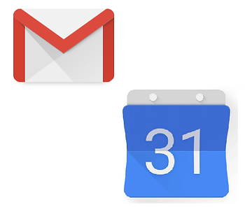
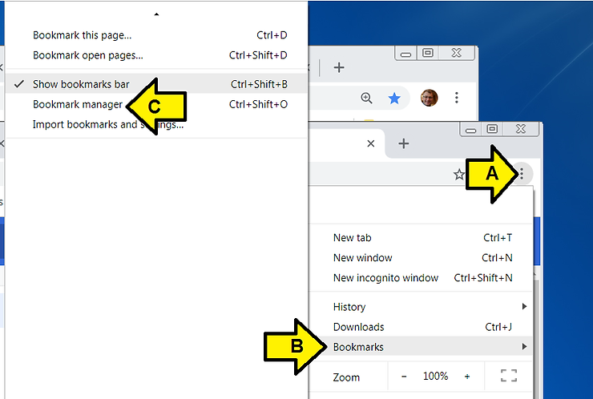
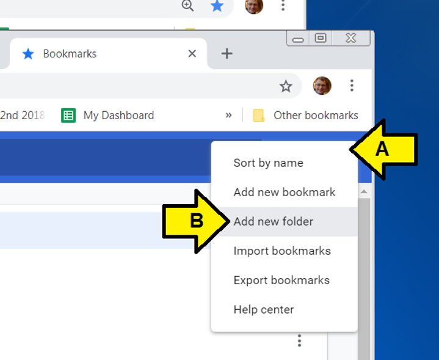
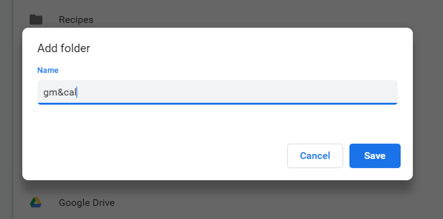
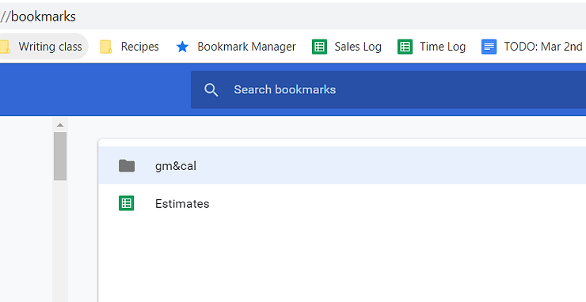
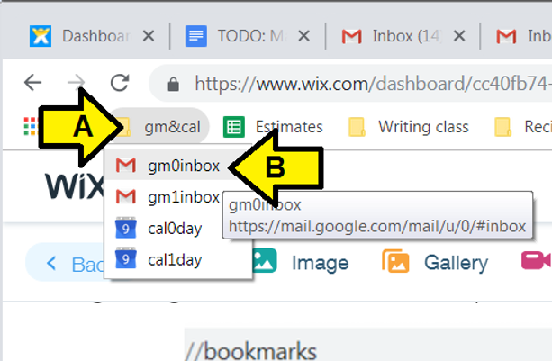

# Gmail and Calendar Quickswitch with Bookmarks

This post show you how to quickly switch between Gmail and Calendar for multiple Google accounts using bookmarks. This method is faster than logging then visiting your gmail and then selecting the account you're interested in.

**Gmail**

You can easily switch between your Gmail accounts by changing this number in the URL:  

[https://mail.google.com/mail/u/](http://mail.google.com/mail/u/0/#inbox)[**0**](http://mail.google.com/mail/u/0/#inbox)[/#inbox](http://mail.google.com/mail/u/0/#inbox)

[https://mail.google.com/mail/u/](http://mail.google.com/mail/u/1/#inbox)[**1**](http://mail.google.com/mail/u/1/#inbox)[/#inbox](http://mail.google.com/mail/u/1/#inbox)

[https://mail.google.com/mail/u/](http://mail.google.com/mail/u/2/#inbox)[**2**](http://mail.google.com/mail/u/2/#inbox)[/#inbox](http://mail.google.com/mail/u/2/#inbox)

**0** is the (default) which is the Gmail account your first logged into. **1** is the second account you logged into, and so on...

**Calendar**

This works for calendar as well.

For a weekly view:

[https://calendar.google.com/calendar/b/](http://calendar.google.com/calendar/b/0/r/week)[**0**](http://calendar.google.com/calendar/b/0/r/week)[/r/week](http://calendar.google.com/calendar/b/0/r/week)

[https://calendar.google.com/calendar/b/](http://calendar.google.com/calendar/b/1/r/week)[**1**](http://calendar.google.com/calendar/b/1/r/week)[/r/week](http://calendar.google.com/calendar/b/1/r/week)

[https://calendar.google.com/calendar/b/](http://calendar.google.com/calendar/b/2/r/week)[**2**](http://calendar.google.com/calendar/b/2/r/week)[/r/week](http://calendar.google.com/calendar/b/2/r/week)

...or month:

[https://calendar.google.com/calendar/b/](http://calendar.google.com/calendar/b/0/r/month)[**0**](http://calendar.google.com/calendar/b/0/r/month)[/r/](http://calendar.google.com/calendar/b/0/r/month)[**month**](http://calendar.google.com/calendar/b/0/r/month)

[https://calendar.google.com/calendar/b/](http://calendar.google.com/calendar/b/1/r/month)[**1**](http://calendar.google.com/calendar/b/1/r/month)[/r/](http://calendar.google.com/calendar/b/1/r/month)[**month**](http://calendar.google.com/calendar/b/1/r/month)

[https://calendar.google.com/calendar/b/](http://calendar.google.com/calendar/b/2/r/month)[**2**](http://calendar.google.com/calendar/b/2/r/month)[/r/](http://calendar.google.com/calendar/b/2/r/month)[**month**](http://calendar.google.com/calendar/b/2/r/month)

...or today:

[https://calendar.google.com/calendar/b/](http://calendar.google.com/calendar/b/0/r/day)[**0**](http://calendar.google.com/calendar/b/0/r/day)[/r/](http://calendar.google.com/calendar/b/0/r/day)[**day**](http://calendar.google.com/calendar/b/0/r/day)

[https://calendar.google.com/calendar/b/](http://calendar.google.com/calendar/b/1/r/day)[**1**](http://calendar.google.com/calendar/b/1/r/day)[/r/](http://calendar.google.com/calendar/b/1/r/day)[**day**](http://calendar.google.com/calendar/b/1/r/day)

[https://calendar.google.com/calendar/b/](http://calendar.google.com/calendar/b/2/r/day)[**2**](http://calendar.google.com/calendar/b/2/r/day)[/r/](http://calendar.google.com/calendar/b/2/r/day)[**day**](http://calendar.google.com/calendar/b/2/r/day)

**Steps to Create Gmail and Calendar Bookmarks**

1\. Login to each account you'd like to check, noting the order

2\. Create a Gmail bookmark folder

3\. Visit each Gmail account and click bookmark, I name mine: gm0inbox, gm1inbox, cal0day, cal1day

4\. Open the Bookmark manager by (A) clicking the **circle with 3 vertical dots**, (B) clicking **Bookmarks** and (C) clicking **Bookmark manager**.

5\. Create a folder named **gm&cal**

6\. Move the **gm0inbox**, **gm1inbox**, **cal0day**, **cal1day** bookmarks into the folder named gm&cal

7\. Drag the gm&cal folder to the top of the list of bookmarks

8\. Repeat for Calendar

9\. Quickly access different accounts by (A) clicking **gm&cal** and (B) any of the bookmarks:

**References**

-   Gmail icon clipped from \[[link](http://goo.gl/images/wqEeKs)\]
    
-   Google Calendar icon clipped from \[[link](http://goo.gl/images/Ed7Nuw)\]