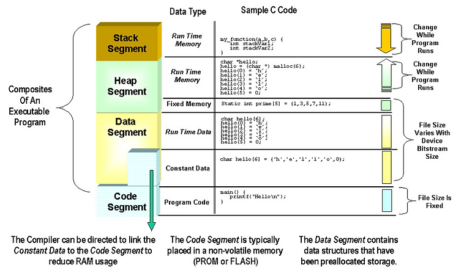

# Good Visualization of Stack, Heap, etc..

This post contains a picture from p.44 of Lattice's January 2017 Programming Tools User Guide \[[<u>link</u>](http://www.latticesemi.com/view_document?document_id=52659)\] does a good job showing the spatial and runtime properties of many programs written in C/C++ that run on embedded systems:

There are many other great diagrams showing how the code that these diagrams are describing works. I highly recommend taking a look. The code is available by downloading and installing Lattice Diamond from \[[<u>link</u>](http://www.latticesemi.com/view_document?document_id=52192)\] and should be a good resource for learning how programs for embedded systems work.

**<u>References</u>**

-   Lattice logo from \[[<u>link</u>](https://www.linkedin.com/company/lattice-semiconductor/)\]