# 2017.4 vs 2018.1 PetaLinux Tools Reference Guide Diff

This post presents the differences of substance between the 2017.4 release of the PetaLinux Tools Reference Guide and the 2018.1 release.

**<u>Commentary</u>**

If you've been waiting for better PetaLinux Tools documentation before you learn how to use PetaLinux Tools, you should find something you can now use. You should use 2018.2.

**Note**: The differences between 2018.1 and 2018.2 are presented at \[[<u>link</u>](https://www.centennialsoftwaresolutions.com/blog/are-hdf-files-going-away)\].

**<u>Differences</u>**

[#1](https://www.centennialsoftwaresolutions.com/blog/hashtags/1) - The reference to **meta-linaro-toolchain** removed.

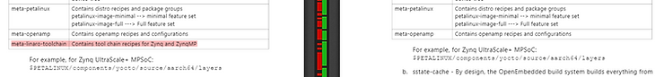

[#2](https://www.centennialsoftwaresolutions.com/blog/hashtags/2) - The MicroBlaze toolchain is from Yocto.

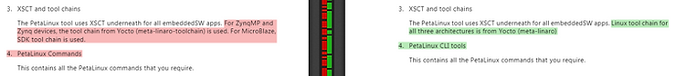

[#3](https://www.centennialsoftwaresolutions.com/blog/hashtags/3) - RHEL 7.4 and CentOS 7.4 were added to the supported OSs list and the version of Ubuntu that is supported was changed from 16.04.1 to 16.04.3.

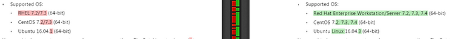

[#4](https://www.centennialsoftwaresolutions.com/blog/hashtags/4) - Packages and Linux Workstation Table Updates

<u>Summary</u>

Dropped:

-   python for all OSs
    
-   detoolset-2 from the table
    

Added:

-   gcc: **gcc-4.8.5-11.el7.x86\_64** for CentOS and RHEL
    
-   g++: **gcc-c++-4.8.5-11.el7.x86\_64** for CentOS and RHEL
    
-   32-bit glibc: **libc-2.17-157.el7\_3.4.i686** and **glibc-2.17-157.el7\_3.4.x86\_64** for CentOS and RHEL
    
-   libstdc++: **libstdc++-4.8.5-11.el7.x86\_64** and **libstdc++-4.8.5-11.el7.i686** for CentOS and RHEL
    

<u>Data</u>

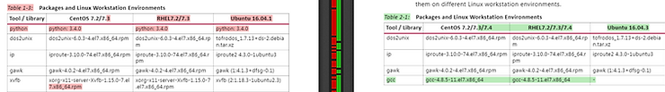

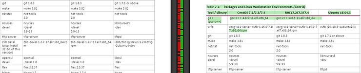

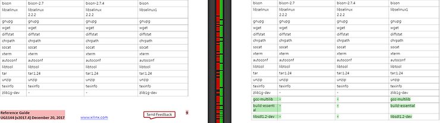

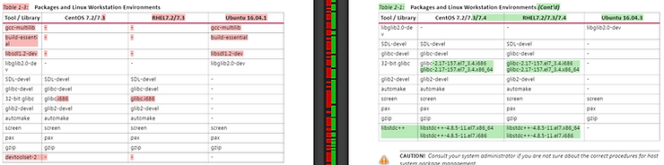

[#5](https://www.centennialsoftwaresolutions.com/blog/hashtags/5) - A new Design Flow Overview table was added.

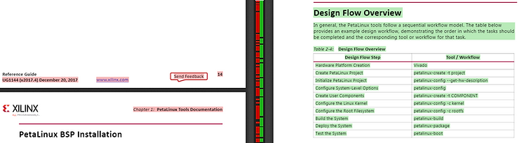

[#6](https://www.centennialsoftwaresolutions.com/blog/hashtags/6) - A clarification regarding PetaLinux BSP usage and installation: PetaLinux BSPs can be used to create your own BSPs: you don't need to create your own from scratch.

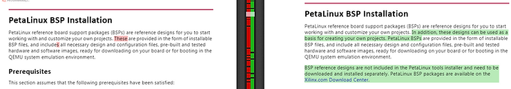

[#7](https://www.centennialsoftwaresolutions.com/blog/hashtags/7) - A clarification regarding NFS mounted.

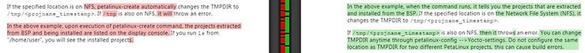

[#8](https://www.centennialsoftwaresolutions.com/blog/hashtags/8) - References to Rev-B, Rev-C and Rev-D silicon have been removed.

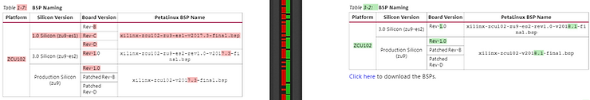

[#9](https://www.centennialsoftwaresolutions.com/blog/hashtags/9) - A note that can be disregarded that HDF files are being depreciated. It can be disregarded because the note is removed in the 2018.2 release of the doc.

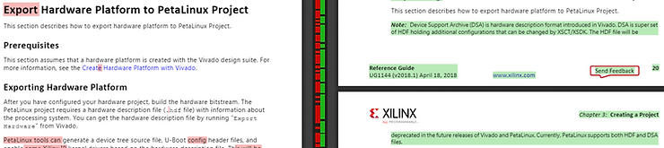

[#10](https://www.centennialsoftwaresolutions.com/blog/hashtags/10) - A note that the **Structure of PetaLinux Projects** is now listed in Appendix B, a note that says that how to compile PMUFW and ATF for the A53 is in Appendix C and a note that lists a doc that lists a doc that describes how to compile the FSBL to run on the R5.

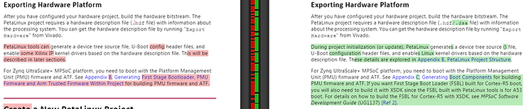

[#11](https://www.centennialsoftwaresolutions.com/blog/hashtags/11) - A note was added that says you can't have select MicroBlaze if you're using Zynq or Zynq UltraScale+ (note: this should read: Zynq-7000 or Zynq UltraScale+ MPSoC).

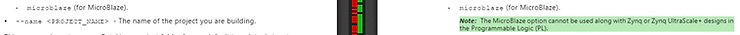

[#12](https://www.centennialsoftwaresolutions.com/blog/hashtags/12) - zcu-reva and zcu104-revc have been added.

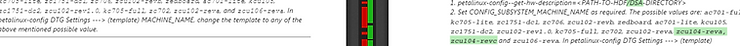

[#13](https://www.centennialsoftwaresolutions.com/blog/hashtags/13) - More HDF warnings that can be ignored.

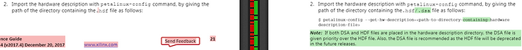

[#14](https://www.centennialsoftwaresolutions.com/blog/hashtags/14) - Auto Config Settings documentation has been moved to Setting from Appendix C.

[#15](https://www.centennialsoftwaresolutions.com/blog/hashtags/15) - A clarification on what petalinux-build does.

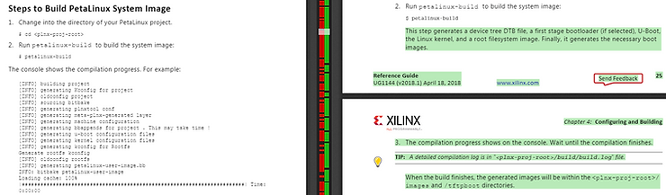

[#16](https://www.centennialsoftwaresolutions.com/blog/hashtags/16) - A clarification on where the Linux binary images are stored.

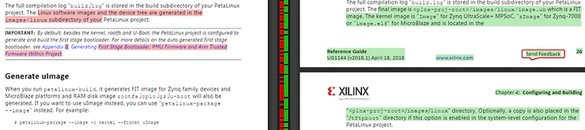

[#17](https://www.centennialsoftwaresolutions.com/blog/hashtags/17) - **Troubleshooting** has been removed.

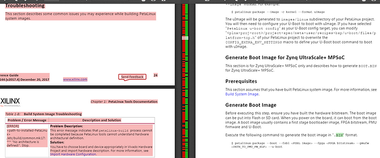

[#18](https://www.centennialsoftwaresolutions.com/blog/hashtags/18) - A **Build Optimizations** section has been added. See the doc for the full section. Only a snippet is given here.

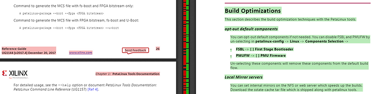

[#19](https://www.centennialsoftwaresolutions.com/blog/hashtags/19) - A clarification on what --prebuilt 3 means (and what else you can pass: 1 and 2).

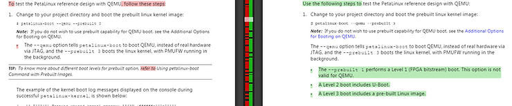

[#20](https://www.centennialsoftwaresolutions.com/blog/hashtags/20) - An additional note in the QEMU section that you build the system image with petalinux-build.

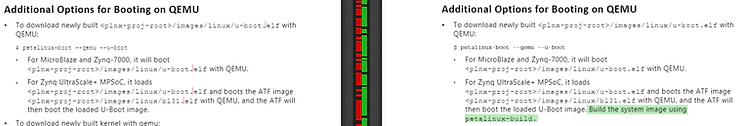

[#21](https://www.centennialsoftwaresolutions.com/blog/hashtags/21) - An example of a QEMU start up log has been added.

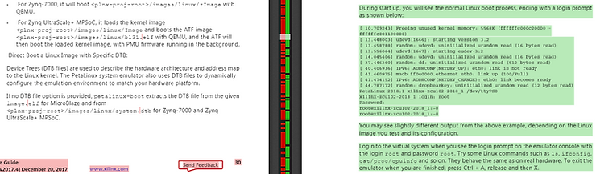

[#22](https://www.centennialsoftwaresolutions.com/blog/hashtags/22) - A way to boot a specific Linux image when booting with QEMU has been added.

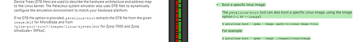

[#23](https://www.centennialsoftwaresolutions.com/blog/hashtags/23) - A way to pass a dtb when booting QEMU has been added.

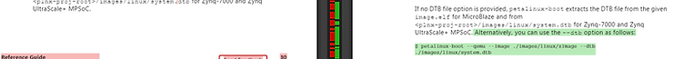

[#24](https://www.centennialsoftwaresolutions.com/blog/hashtags/24) - A clarification that in INITRAMFS mode the rootfw is included in kernel images.

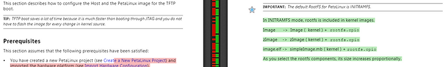

[#25](https://www.centennialsoftwaresolutions.com/blog/hashtags/25) - The number of sub-steps listed in step 3 of **Copying Image Files** has been reduced.

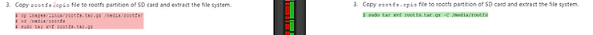

[#26](https://www.centennialsoftwaresolutions.com/blog/hashtags/26) - A note about Zynq UltraScale+ MPSoC has been removed. Both instances are listed here.

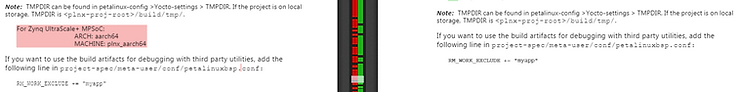

[#27](https://www.centennialsoftwaresolutions.com/blog/hashtags/27) - A section on adding a Yocto layer has been added.

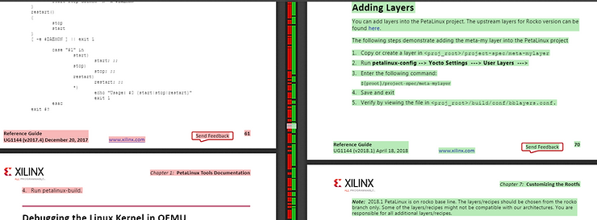

[#28](https://www.centennialsoftwaresolutions.com/blog/hashtags/28) - A section on adding an existing recipe into the rootfs has been added.

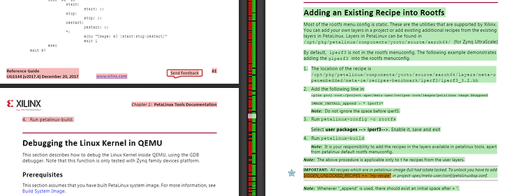

[#29](https://www.centennialsoftwaresolutions.com/blog/hashtags/29) - A section on adding a package group has also been added.

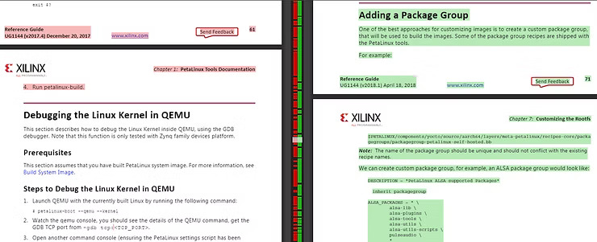

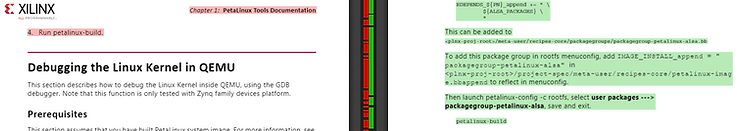

[#30](https://www.centennialsoftwaresolutions.com/blog/hashtags/30) - A whole section has been added describing the PetaLinux Menuconfig System, Settings and hardware/Linux interaction. A snippet is shown here.

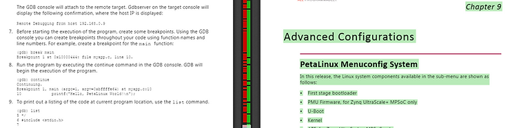

[#31](https://www.centennialsoftwaresolutions.com/blog/hashtags/31) - A section on Configuring Project Components was added. A snippet is shown here.

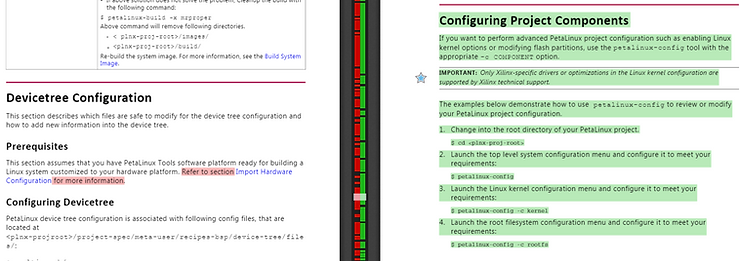

[#32](https://www.centennialsoftwaresolutions.com/blog/hashtags/32) - The example that shows you how to add your own DTS entries has been updated. A snippet is shown here.

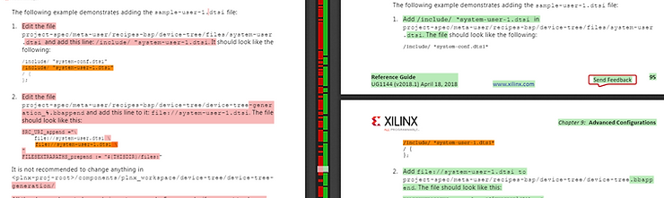

[#33](https://www.centennialsoftwaresolutions.com/blog/hashtags/33) - A write up on SDK Generation has been added. A snippet is shown here.

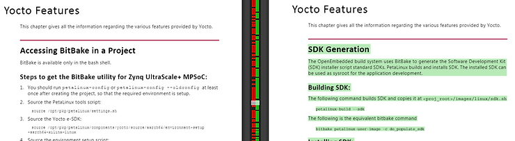

[#34](https://www.centennialsoftwaresolutions.com/blog/hashtags/34) - The write up for adding a e-SDK recipe has been removed. The original snippet is shown here.

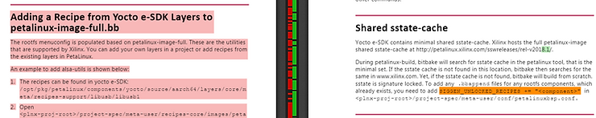

[#35](https://www.centennialsoftwaresolutions.com/blog/hashtags/35) - Adding package groups was moved. The original snippet is shown here.

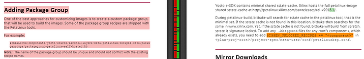

[#36](https://www.centennialsoftwaresolutions.com/blog/hashtags/36) - Additional sections for **Machine Support**, **SoC** (Its listed as SOC which is wrong) **Variant Support**, **Image Features** and **Migration** have been added. Snippets given.

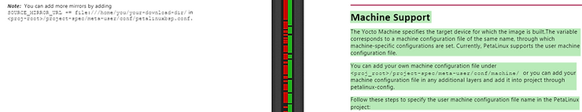

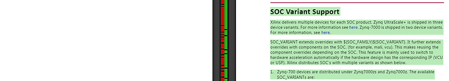

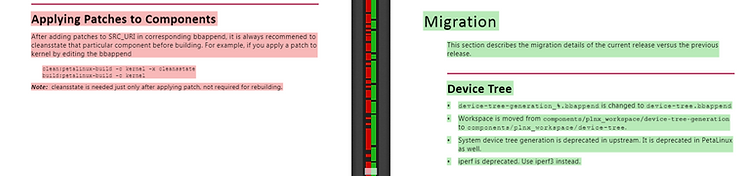

[#37](https://www.centennialsoftwaresolutions.com/blog/hashtags/37) - Adding support for initramfs's larger than 2 GB and **Applying Patches to Components** has been removed.

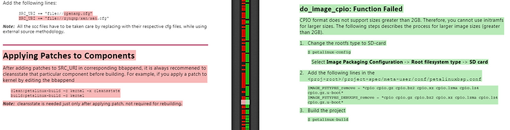

**<u>References</u>**

-   The 2017.4 \[[<u>link</u>](https://www.xilinx.com/support/documentation/sw_manuals/xilinx2017_4/ug1144-petalinux-tools-reference-guide.pdf)\] and 2018.1 \[[<u>link</u>](https://www.xilinx.com/support/documentation/sw_manuals/xilinx2018_1/ug1144-petalinux-tools-reference-guide.pdf)\] versions of ug1144-petalinux-tools-refence-guide.pdf were compared using [<u>https://draftable.com</u>](https://draftable.com/)
    
-   Full diff at \[[<u>link</u>](https://draftable.com/compare/GaQUUoORQYIK)\]
    
-   Xilinx logo found via [<u>https://twitter.com/xilinxinc</u>](https://twitter.com/xilinxinc) at \[[<u>link</u>](https://pbs.twimg.com/profile_images/535545777020338176/pEWdIYq__400x400.png)\]