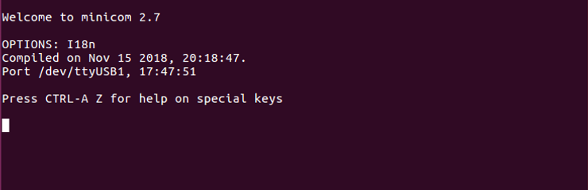

# 2018.2.2 Xilinx Linux Dev for the ZC706 on Win7 SP1 via VirtualBox 6.0.10

These instructions help you install all the components to do Linux development for the ZC706 (containing a XC7Z045 FFG900 – 2 SoC, Zynq-7000) on Windows via VirtualBox running Ubuntu 2016.04.3 using Xilinx's 2018.2 development environment.

## **Overview**

## <u>What You'll Download and Install</u>

You'll need to download over 30 GBs of data including:

-   VirtualBox 6.0.10 (30 MB)
    
-   ubuntu-16.04.5-desktop-amd64.iso (1.47 G)
    
-   VirtualBox Extension Pack for 6.0.10 (23 MB)
    
-   Vivado 2018.2 (includes SDK) (17.10 GB)
    
-   Vivado 2018.2.2 Update (5.88 GB)
    
-   PetaLinux 2018.2 (6.14 GB)
    
-   ZC706 BSP for PetaLinux 2018.2 (106 MB)
    

Note: sizes are rounded

## <u>You will Need a Vivado License</u>

The ZC706 utilizes a XC7Z045 FFG900 – 2 SoC Zynq-7000. This part is not included in the free Vivado Design Suite WebPACK™ tool (see \[[<u>link</u>](https://www.xilinx.com/products/design-tools/vivado/vivado-webpack.html#architecture)\] for the supported architectures). The ZC706 includs a **Zynq-7000 AP SoC ZC706 Evaluation Kit, Device Locked, Node Locked** license good for 1 year.

This also means that during installation you will select the **Vivado HL Design Edition** (see \[[<u>link</u>](https://www.xilinx.com/products/design-tools/vivado/vivado-webpack.html#webpack)\] for the differences).

## **Steps**

## <u>Download Ubuntu, PetaLinux, Vivado &amp; SDK, and ZC706</u>

Note: You must login to Xilinx to use some of these links.

Step 1: Create **C:\\downloads**

Step 2: Download 64-bit Ubuntu 16.04.5 from \[[<u>link</u>](http://old-releases.ubuntu.com/releases/16.04.5/ubuntu-16.04.5-desktop-amd64.iso)\] to **C:\\downloads**

Step 3: Download PetaLinux Tools 2018.2 from \[[<u>link</u>](https://www.xilinx.com/member/forms/download/xef.html?filename=petalinux-v2018.2-final-installer.run)\] (login required) to **C:\\downloads**

Step 4: Download ZC706 PetaLinux Tools BSP from \[[<u>link</u>](https://www.xilinx.com/member/forms/download/xef.html?filename=xilinx-zc706-v2018.2-final.bsp)\] (login required) to **C:\\downloads**

Step 5: Download 2018.2 Vivado & SDK full install from \[[<u>link</u>](https://www.xilinx.com/member/forms/download/xef-vivado.html?filename=Xilinx_Vivado_SDK_2018.2_0614_1954.tar.gz)\] (login required) to **C:\\downloads**

Step 6: Download 2018.2.2 update from \[link\] to **C:\\downloads**

## <u>Download and Install VirtualBox and the VirtualBox Extension Pack on Win 7</u>

Note: These steps will work if you're installing or upgrading.

Step 1: Download VirtualBox 6.0.10 from \[[<u>link</u>](https://download.virtualbox.org/virtualbox/6.0.10/VirtualBox-6.0.10-132072-Win.exe)\] (30 MB) and install it to **C:\\Program Files\\Oracle\\VirtualBox\\**

Note: During installation, on the **Customer Setup** page, click on the drop-down box next to **VirtualBox Application** and select **Entire feature will be installed on local hard drive**

Note 2: "Click-through the installer," use defaults and say yes to install the extra drivers

Step 2: Download the **Oracle VM VirtualBox Extension Pack** for 6.0.10 from \[[<u>link</u>](https://download.virtualbox.org/virtualbox/6.0.10/Oracle_VM_VirtualBox_Extension_Pack-6.0.10.vbox-extpack)\] (23 MB) and install it

Note: The pack contains USB 2.0 and USB 3.0 Host Controller, Host Webcam, VirtualBox RDP, PXE ROM, Disk Encryption, NVMe

## <u>Create a VM</u>

Step 1: Open VirtualBox and select **New**

Step 2: Set:

A. **Name** to **ubuntu-16.04.5-desktop-amd64-8GB-RAM-120GB-Disk**

B. Leave default for **Machine Folder**

C. **Type** to **Linux**

D. **Version** to **Ubuntu (64-bit)**

E. Click **Next**

Step 3: Set **Memory size** to **8192 MB** and click **Next**

Step 4: leave the **Create a virtual hard disk now** radio-button selected and click **Create**

Step 5: Leave the **VDI (VirtualBox Disk Image)** radio-button selected and click **Next**

Step 6: Leave the **Dynamically allocated** radio-button selected and click **Next**

Step 7: Set the **size** of the Virtual Hard Disk file to 120.00 GB and click **Create**

## <u>Install 16.04.5</u>

Step 1: Select the VM you just created (**ubuntu-16.04.5-desktop-amd64-8GB-RAM-120GB-Disk**) in the **Oracle VM VirtualBox Manager**

Step 2: Click on **\[Optical Drive\] Empty**

Step 3: Select **Choose disk image...**

Step 4: Select the **64-bit Ubuntu 16.04.5** ISO you downloaded above to **c:\\downloads**

Step 5: Click **Start** in the **Oracle VM VirtualBox Manager** and let Ubuntu boot to the **Try Ubuntu** / **Install Ubuntu** screen

Step 6: Click **Install Ubuntu**

Step 7: Check the **Download updates while installing Ubuntu** and **Install third-party software for graphics and Wi-Fi hardware, Flash, MP3 and other media** check-boxes and click **Continue**

Step 8: Leave the **Erase disk and install Ubuntu** radio-button selected and click **Install Now**

Step 8.1: Click continue on the **Write the changes to disks?** pop-up

Step 9: List where your timezone is and click **Continue**

Step 10: Select your keyboard and click **Continue**

Step 11: Enter:

A. **Your name**

B. **Your computer's name**

C. **Pick a username**

D. **Choose a password**

E. **Confirm your password**

F. Leave the **Log in automatically** radio button unselected

G. Leave the **Require my password to log in** selected

H. Leave **Encrypt my home folder** unselected

I. Click **Continue**

Ubuntu will start to install

Step 12: Click **Restart Now**

Step 13: Press ENTER at the **Please remove the installation medium, then press ENTER:** screen

Ubuntu will reboot into the Log In screen

Note: as you run Ubuntu may ask if you'd like to upgrade to 18.04.2 LTS. Click **Don't Upgrade** then click **OK.**

## <u>Install VirtualBox Guest Additions</u>

Step 1: Install the correct Linux headers

Note: this doesn't need to be done, it will already be done

A. Right-click in the Ubuntu guest and select **Open Terminal**

B. Type **sudo apt-get install linux-headers-$(uname -r)**

Note: You should see a message saying that they are already installed:

Step 2: Type **sudo apt-get install build-essential kernel-package**

Step 2.1: Type **Y** to download and install 1,345 MB

Step 3: You'll see a **Package configuration** pop-up window:

Select **install the package maintainer's version** and select **Ok**

Step 4: Power off the virtual machine

Step 5: In the Oracle VM VirtualBox Manager select click on \[Optical Drive\] Empty and select **Choose disk image...** Select C:\\Program Files\\Oracle\\VirtualBox\\VBoxGuestAdditions.iso

Step 6: Start the virtual machine

Step 7: After it boots, right-click on the desktop and select **Open Terminal**

Step 8: Type **cd /media/$USER/VBox\_GAs\_6.0.10/**

Step 9: Type **sudo sh ./VBoxLinuxAdditions.run**

You should see:

Step 10: Power off the virtual machine

Step 11: Click **\[Optical Drive\] VBoxGuestAdditions.iso (73.59 MB)** and select **Remove disk from virtual drive**

Step 12: Start the virtual machine

Step 13: Test the install by resizing the window containing the VM, you should see the desktop resize

## <u>Enable Copy/Paste</u>

In the VirtualBox virtual machine window, click **Devices** \> **Shared Clipboard** > **Bidirectional**

Test by opening a terminal, copying the text and pasting it into a Notepad. Then type something in Notepad copy it and paste it into the terminal.

## <u>Mount C:\downloads in the Guest</u>

Step 1: In the VirtualBox virtual machine window, click **Devices** \> **Shared Folders** > **Shared Folders Settings...**

Step 2: Click the folder with the plus sign:

Step 3: Fill in the **Shared Folder** fields:

A. Set **Folder Path** to **C:\\downloads** (The Folder Name field will auto populate)

B. Check the **Auto-mount** checkbox

C. Click **OK** (you'll be sent back to the **Shared Folder** screen)

D. Click **OK** again on the **Shared Folder**

Test it by opening a terminal and typing: **sudo ls /media/sf\_downloads/**

Note: you can now copy/paste this command into the terminal now because you've enabled that :)

Step 4: Change permissions so that you don't need to sudo

Type: **sudo usermod -G vboxsf -a $USER**

Step 5: Log off, log in and open a terminal

Test by typing **ls /media/sf\_downloads**

## <u>Prepare a Vivado Install Directory</u>

Step 1: In the terminal type **sudo mkdir -p /opt/Xilinx**

Step 2: In the terminal type **sudo chmod -R a+rwX /opt/Xilinx**

**Note:** the steps prepare a directory that all users can read, write and execute. See \[[<u>link</u>](https://www.g-loaded.eu/2005/11/08/the-use-of-the-uppercase-x-in-chmod/)\] for what the capital **X** means.

## <u>Install Vivado 2018.2 on Ubuntu</u>

Step 1: Open a terminal and type **cd /media/sf\_downloads**

Step 2: Extract the archive

Type: **tar -zxvf Xilinx\_Vivado\_SDK\_2018.2\_0614\_1954.tar.gz**

Step 3: Type **cd Xilinx\_Vivado\_SDK\_2018.2\_0614\_1954/**

Step 4: Type **./xsetup**

You should see:

Step 5: Click the Continue button on the "A Newer Version Is Available" pop-up

Step 6: Click **Next >** on the **Welcome** screen

Step 7: Accept the 3 agreements on the **Accept License Agreements** screen and click **Next >**

Step 8: Click the **Vivado HL Design Edition** radio button and click **Next >**

Step 9: Accept the defaults on the Vivado HL Design Edition **customization page** and click **Next >**. The default install will use cost **37.06 GB**.

or to save some install space and install time...

...you can delete components you don't need and get the install size disk needed down to **24.8 GB**, a savings of over 12 GB, using the following options:

Step 10: Click **Next >** at the **Select Destination Directory** screen (will install Vivado into /opt/Xilinx)

Step 11: Click **Install** at the **Installation Summary** screen

Step 12: At the Vivado License Manager 2018.2 screen enter your license details

Step 13: Close Vivado

## <u>Install the Vivado 2018.2.2 Update</u>

Step 1: Open a terminal and type **cd /media/sf\_downloads**

Step 2: Extract the archive

Type: **tar -zxvf Xilinx\_Vivado\_SDx\_Update\_2018.2.2\_1001\_1805.tar.gz**

Step 3: Type **cd Xilinx\_Vivado\_SDx\_Update\_2018.2.2\_1001\_1805/**

Step 4: Type **./xsetup**

You should see a Vivado splash screen followed by a **Welcome screen**

Step 5: Click the **Next >** button at the **Welcome screen**

Step 6: Check that the install directory is correct and click the **Install** button at the **Update Summary** screen

Step 7: Click the **Continue** button if you have Vivado running and see a **Close Xilinx applications** pop-up

Note: it took my set up (VirtualBox on Windows 7 SP1 on a ThinkPad 460 4 min)

Step 8: Click the **OK** button on the **Update completed successfully** pop-up

## <u>Configure the Virtual Machine for Vivado Cable Drivers</u>

Step 1: If Ubuntu is running in a virtual machine, power off Ubuntu.

Step 2: In the **VirtualBox Manager**, ensure the virtual machine configuration is selected and click **Settings**

Step 3:

A. Click **USB** in the left handed frame and then

B. Click the **USB 3.0 (xHCI) Controller** radio button

C. Click **OK**

Step 4: Start the virtual machine and let Ubuntu completely boot

## <u>Install the Vivado Cable Drivers</u>

Step 1: Open a new terminal

Step 2: Type:

**cd /opt/Xilinx/Vivado/2018.2**

**cd ./data/xicom/cable\_drivers/lin64/install\_script/install\_drivers**

**sudo ./install\_drivers**

You should see:

Step 3:

A. Set the ZC706 to boot from JTAG

B. Plug the power supply into the ZC706

C. Plug the the Micro-USB B connector into the JTAG-to-USB port and the USB A-Type connector into your computer or a USB hub connected to your computer

D. Plug the USB Mini-b (5-pin) connector into the USB UART port and the USB A-Type connector into your computer or a USB hub connected to your computer

E. Power on the ZC706 using the switch SW1

Step 4:

A. Click **Devices**

B. Click **USB**

C. Click **USB Settings...**

Step 5:

A. Click the **USB connector+** icon

B. Click **USB to UART Bridge Controller**

C. Click the **USB connector+** icon

D. Click **Digilent USB Device**

E. Click **OK**

Step 6: Unplug both devices

Step 7: Plug them back in and wait for a bit. If sound is enabled you will hear a tone.

Step 8: Check that the devices are enabled in the virtual machine

A. Click **Devices**

B. Click **USB**

C. Check that the 2 devices are checked

## <u>Install PetaLinux Tools</u>

Step 1: Open another terminal

Step 2: Run the following commands

**sudo apt-get update**

**sudo apt-get install python3 dos2unix iproute2 gawk xvfb git make net-tools libncurses5-dev tftpd lib32z1 libssl-dev flex bison libselinux1 gnupg wget diffstat chrpath socat xterm autoconf libtool tar unzip texinfo zlib1g-dev gcc-multilib build-essential libsdl1.2-dev libglib2.0-dev libsdl-dev build-essential gcc-multilib glib2.0 automake screen pax gzip libtool-bin zlib1g:i386**

At the end of all the output, you should see:

Step 3: Run the following commands to create a place to install PetaLinux Tools and start the installer:

**cd /media/sf\_downloads**

**sudo mkdir -p /opt/pkg/petalinux-v2018.2**

**sudo chmod -R a+rwX /opt/pkg/petalinux-v2018.2**

**sudo chown -R $USER:$USER /opt/pkg/petalinux-v2018.2**

**chmod +x petalinux-v2018.2-final-installer.run**

**./petalinux-v2018.2-final-installer.run /opt/pkg/petalinux-v2018.2**

Note: this will take a few minutes

Note 2: using a -v2018.2 suffix will allow you to easily distinguish multiple versions of PetaLinux Tools

Step 4: Follow the prompts, accept the license agreements, etc...

Step 5: Let the installer run

Note: you'll see **WARNING: No tftp server found**. For JTAG based development this can be disregarded.

You should see:

## <u>Switch your Shell to Bash</u>

Step 1: Open a new terminal and type **chsh -s /bin/bash**

Step 2: Type:

**sudo rm /bin/sh**

**sudo ln -s /bin/bash /bin/sh**

Step 3: Log out and log back in

## <u>Create a Project Based on the ZC706 BSP and Build it</u>

Step 1: Open a new terminal

Step 2: Type:

**mkdir ~/plxprjs**

**cd ~/plxprjs/**

Step 3: Type:

**source /opt/pkg/petalinux-v2018.2/settings.sh**

**petalinux-create -t project -s /media/sf\_downloads/xilinx-zc706-v2018.2-final.bsp**

You should see:

Step 4: Type:

**cd ~/plxprjs/xilinx-zc706-2018.2/**

**petalinux-build**

Note: this will take some time and it may appear to hang.

You should see:

## <u>Start the Hardware Server</u>

Step 1: Ensure that the Digilent JTAG chain is selected by checking that SW4 looks like:

Step 2: Click **Vivado 2018.2**

Step 3: Click **Flow** \> **Open Hardware Manager**

Step 4: Click **Open target** > **Auto Connect**

You should see:

## <u>Setup minicom</u>

Step 1: Plug your USB-to-Serial cable in

Step 2: Find the USB #

A. Type **ls -l /dev/ttyUSB\***

B. Note what the /dev/ttyUSB it is, something like:

crw-rw---- 1 root dialout 188, 1 Aug 15 17:47 **/dev/ttyUSB1**

Step 3: Install minicom

A. Type **sudo apt-get install minicom**

B. Follow prompts to install

Step 4: Ensure you can run minicom without sudo

A. Type **sudo usermod -a -G dialout $USER**

B. Log out and log in

C. Check that you're in the dialout group, type **groups $USER**

Step 5: Type **sudo minicom -s**

Note: You need to run this step with sudo so that you can **Save setup as dfl** later

Step 6: Press the down arrow twice to **Serial port setup** and press **Enter**

Step 7:

A. Press **A**, and set the serial device to **/dev/ttyUSB0** and press **Enter**

B. Press **E** and set the **Bps/Par/Bits** to **115200 8N1** and press **Enter**

C. Press **F** until **Hardware Flow Control** in **No**

D. Press **G** until **Software Flow Control** is **No**

E. Press **Enter**

Step 8: Press the **down arrow** 3 times to **Save setup as dfl** and press **Enter**

Step 9: Press the **down arrow** 3 times to **Exit from Minicom** and press **Enter**

You should see:

Minicom is now configured

## <u>Run minicom</u>

Type **minicom**

You should see:

## <u>Exit minicom</u>

Type **Control-a x** and press **Enter**

## <u>Boot the Linux Kernel</u>

Note: You will need to have a hardware server running. You'll see this if you don't have a hardware server running:

See above for instructions on starting a hardware server.

Step 1: Open a two new terminals

Step 2: Run **minicom** in one terminal

Step 3: In the other terminal, run these commands:

**source /opt/pkg/petalinux-v2018.2/settings.sh**

**cd ~/plxprjs/**

**cd xilinx-zc706-2018.2/**

**petalinux-boot --jtag --fpga --kernel --hw\_server-url TCP:localhost:3121**

Step 3.1: Log in with **root** and the username and **root** as the password

Step 4: Boot U-Boot

A. Power off the ZC706 and power it on

B. Type **petalinux-boot --jtag --fpga --u-boot --hw\_server-url TCP:localhost:3121**

You should see:

## **Other Info**

## <u>Disable Auto Logout on Ubuntu</u>

Step 1: In Ubuntu, click **Settings** \> **Brightness & Lock**

Step 2: Set the **Turn screen off when inactive** drop-down box to **Never**

## <u>Note on Supported Linux Distros</u>

We'll be using Ubuntu 2016.04.5.

The 2018.2 **PetaLinux Tools Reference Guide** \[[<u>link</u>](https://www.xilinx.com/support/documentation/sw_manuals/xilinx2018_2/ug1144-petalinux-tools-reference-guide.pdf)\] and the **Vivado Release Notes** \[[<u>link</u>](https://www.xilinx.com/support/documentation/sw_manuals/xilinx2018_2/ug973-vivado-release-notes-install-license.pdf)\] state that Ubuntu 2016.04.3 is supported. The SDK doc \[[<u>link</u>](https://www.xilinx.com/html_docs/xilinx2018_2/SDK_Doc/index.html)\] states that Ubuntu 16.04.2 is supported, however, we'll use Ubuntu 2016.04.5 and see if there are any issues.

TODO: report any issues with Vivado, PetaLinux Tools and/or SDK 2018.2 when using Ubuntu 2016.04.5.

There's a breakdown of all the versions supported on 2018.2 Vivado, PetaLinux Tools and the SDK \[[<u>here</u>](https://docs.google.com/spreadsheets/d/1gtnR7nxEkrRH7VpldlWUNkT1cO3af499U6gymuKoeAM/edit?usp=sharing)\].

## **References**

-   [<u>zachpfeffer.com</u>](https://www.zachpfeffer.com/): Installing 2017.4 Vivado and SDK on Linux at \[[<u>link</u>](https://www.zachpfeffer.com/single-post/Installing-20174-Vivado-and-SDK-on-Linux)\]
    
-   [<u>zachpfeffer.com</u>](https://www.zachpfeffer.com/): Download and Install Xilinx's 2017.4 PetaLinux Tools at \[[<u>link</u>](https://www.zachpfeffer.com/single-post/Download-and-Install-Xilinxs-20174-PetaLinux-Tools)\]
    
-   [<u>zachpfeffer.com</u>](https://www.zachpfeffer.com/): Configure minicom for a USB-to-Serial Converter at \[[<u>link</u>](https://www.centennialsoftwaresolutions.com/post/configure-minicom-for-a-usb-to-serial-converter)\]
    
-   [<u>zachpfeffer.com</u>](https://www.zachpfeffer.com/): Xilinx 2018.2 Software Tool Installation Overview and Assessment at \[[<u>link</u>](https://www.zachpfeffer.com/single-post/Xilinx-20182-Software-Tool-Installation-Overview-and-Assessment)\]
    
-   The 4.2.2.1. Installing the Linux Guest Additions chapter of Oracle® VM VirtualBox® User Manual at \[[<u>link</u>](https://www.virtualbox.org/manual/ch04.html#guestadd-intro)\]
    
-   Ask Ubuntu: How to access shared folders in Ubuntu VM(Oracle Virtualbox) and link them to the home folder at \[[<u>link</u>](https://askubuntu.com/questions/323392/how-to-access-shared-folders-in-ubuntu-vmoracle-virtualbox-and-link-them-to-th)\]
    
-   [<u>xilinx.com</u>](https://www.xilinx.com/): AR# 71547 2018.2.2 Vivado - Vivado 2018.2 Update 2 (2018.2.2) Release Notes and Known Issues at \[[<u>link</u>](https://www.xilinx.com/support/answers/71547.html)\]
    
-   [<u>xilinx.com</u>](https://www.xilinx.com/): Xilinx Zynq-7000 SoC ZC706 Evaluation Kit at \[[<u>link</u>](https://www.xilinx.com/products/boards-and-kits/ek-z7-zc706-g.html)\]
    
-   [<u>xilinx.com</u>](https://www.xilinx.com/): Vivado Design Suite User Guide, Release Notes, Installation, and Licensing UG973 (v2018.2) July 23, 2018 at \[[<u>link</u>](https://www.xilinx.com/support/documentation/sw_manuals/xilinx2018_2/ug973-vivado-release-notes-install-license.pdf)\]
    
-   [<u>xilinx.com</u>](https://www.xilinx.com/): ZC706 Evaluation Board for the Zynq-7000 XC7Z045 SoC User Guide UG954 (v1.7) July 1, 2018 at \[[<u>link</u>](https://www.xilinx.com/support/documentation/boards_and_kits/zc706/ug954-zc706-eval-board-xc7z045-ap-soc.pdf)\]
    
-   [<u>forums.xilinx.com</u>](http://forums.xilinx.com/): Petalinux settings.sh problem at \[[<u>link</u>](https://forums.xilinx.com/t5/Embedded-Linux/Petalinux-settings-sh-problem/td-p/567202)\]
    
-   Xilinx logo found via [<u>https://twitter.com/xilinxinc</u>](https://twitter.com/xilinxinc) at \[[<u>link</u>](https://pbs.twimg.com/profile_images/535545777020338176/pEWdIYq__400x400.png)\]