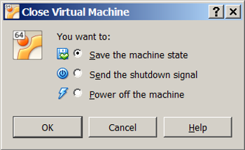

# A fix for a USB drive (or any USB device) not working in VirtualBox

### Overview

This post describes how to enable VirtualBox to work with USB devices if you're getting the error seen above when you click on USB device in VirtualBox. You may see this if you've installed USBPcap as part of a Wireshark installation on Windows.

### Detail

If you can't see your USB drive in VirtualBox and you see the error posted above when you click on the USB drive (text reproduced here):

USB device 'SanDisk Cruzer Glide' with UUID {e3304ddc-b8c7-43c8-aba8-6f81e66d5c8d} is busy with a previous request. Please try again later.

Result Code:

E\_INVALIDARG (0x80070057)

Component:

HostUSBDeviceWrap

Interface:

IHostUSBDevice {c19073dd-cc7b-431b-98b2-951fda8eab89}

Callee:

IConsole {872da645-4a9b-1727-bee2-5585105b9eed}

...you may want to try uninstalling USBPcap.

USBPcap records USB traffic. It is installed during a Wireshark installation. USBPcap is not compatible with VirtualBox.

### Steps

1\. Remove USBPcap

1.a. Open the **Control Panel**

1.b. Click **Uninstall a program**

1.c. Select **Wireshark** then click **Uninstall**

1.d. Click **Next >**

1.e. Click **Next >** again

1.f. Just select the **USBPcap** check box and click **Uninstall**

1.g. Click the **Uninstall** button in the confirmation popup window

1.h. Click **Close**

1.i. Ignore the popup that says the the program was unable to remove c:\\Program Files\\Wireshark. Just click **OK**.

1.j. You should see the following output in the Uninstall window. Click **Next >**.

1.k. Click **Finish**

2\. Try again

Things that Don't Work

-   It doesn't work to just unplug the USB key then plug it back in
    
-   It also doesn't work to unplug the USB key, restart VirtualBox and plug it back in
    

A process that does work

2.a. Close your running **Virtual Machine**.

2.b. You **don't** have to power off the Virtual Machine. You can save its state.

2.c. Exit VirtualBox

2.d. Restart Windows

2.e. Open VirtualBox

2.f. Restart the Virtual Machine

2.e. Plug the USB drive in

2.f. Select the USB drive

2.g. If it worked you should see a pop up

Note: You can give the USB drive back to Windows by clicking on the USB key again

### Specific configuration

T460 running Windows 7 Professional SP1 ([more detail](http://www.zachpfeffer.com/single-post/2017/01/28/New-T460-System-Information))

Wireshark 2.2.7 (64-bit)

WinPcap 4.1.3

USBPcap 1.1.0.0-g794bf26-5

VirtualBox 5.1.30 r118389 (Qt5.6.2)

Virtual Machine with 8 GB RAM and 64 GB Disk running Ubuntu 14.04.5 Desktop

### References

-   VirtualBox tickets
    
-   [USB not working at all (all devices are busy)](http://www.virtualbox.org/ticket/11251)
    
-   [VirtualBox not compatible with USBPcap and similar](http://www.virtualbox.org/ticket/16032)