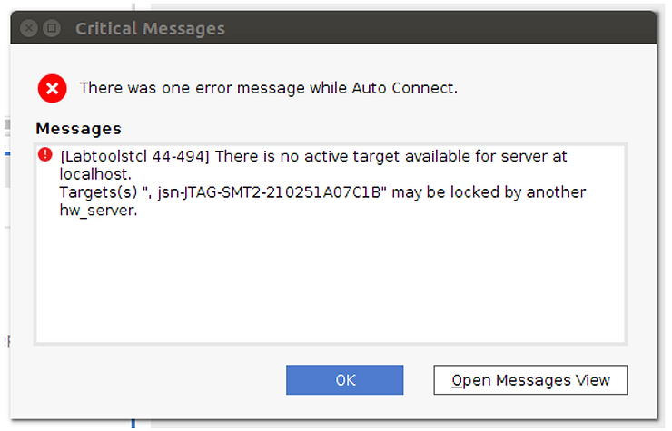

# A Fix for "ERROR: [Labtoolstcl 44-494] There is no active target available for server at localhost."

This post shows you a fix for **ERROR: \[Labtoolstcl 44-494\] There is no active target available for server at localhost. Targets(s) ", jsn-JTAG-SMT2-210251A07C1B" may be locked by another hw\_server**

When I tried to **Auto Connect** to a target using the 2019.1 Vivado Hardware Manager running on **Ubuntu 16.04.5** running inside a **VirtualBox 6.0.10** or a **VMWare Workstation 15 Payer** I got:

I got this because I had failed to specify that the USB Controller should be USB 3.0. Once I set the VMs configuration to use USB 3.0 everything worked.

**<u>Reference</u>**
    
-   From [<u>https://fpga.incomeself.com</u>](https://fpga.incomeself.com/) **Fix Xilinx Tools Can’t Connect to the Download Cable in Virtual Machine** at \[[<u>link</u>](https://fpga.incomeself.com/fix-xilinx-tools-cant-connect-to-the-download-cable-in-virtual-machine/#more-282)\]
