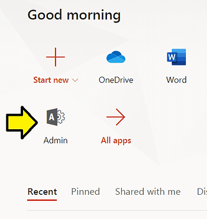
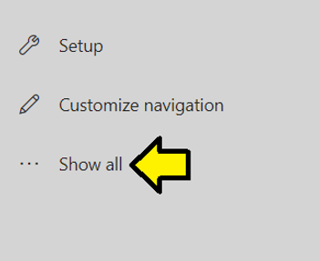
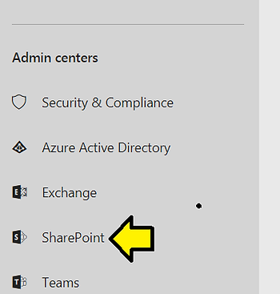
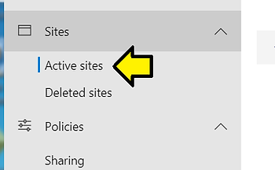
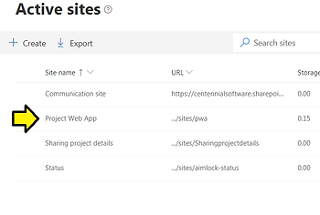
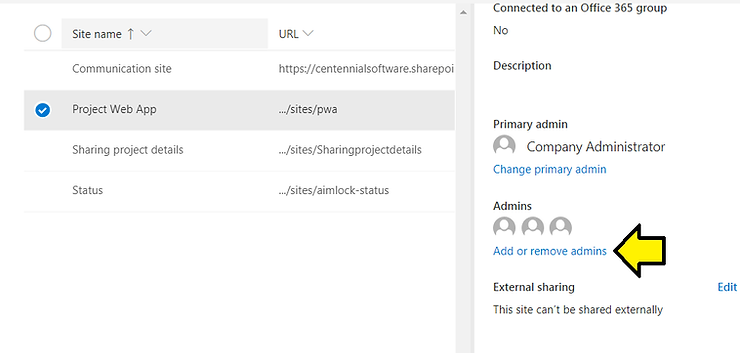
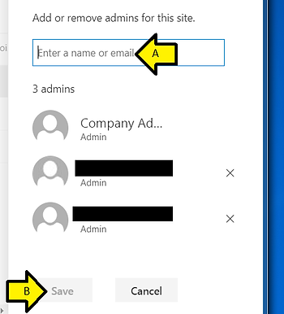

# A Fix for "You don't have permission to create items on this site: https://yoursite.sharepo

This post provides a solution to errors like:

"You don't have permission to create items on this site: https://centennialsoftware.sharepoint.com/sites/pwa. Change your default PWA site or request permission to this site."

Steps

Step [#1](https://www.centennialsoftwaresolutions.com/blog/hashtags/1): Go to [https://www.office.com/ ](http://www.office.com/)

Step [#2](https://www.centennialsoftwaresolutions.com/blog/hashtags/2): Sign in

Step [#3](https://www.centennialsoftwaresolutions.com/blog/hashtags/3): Click **Admin**

Step [#4](https://www.centennialsoftwaresolutions.com/blog/hashtags/4): Click **Show all**

Step [#5](https://www.centennialsoftwaresolutions.com/blog/hashtags/5): Click **SharePoint**

Step [#6](https://www.centennialsoftwaresolutions.com/blog/hashtags/6): Click **Active sites**

Step [#7](https://www.centennialsoftwaresolutions.com/blog/hashtags/7): Click **Project Web App**

Step [#8](https://www.centennialsoftwaresolutions.com/blog/hashtags/8): Click **Add or remove admins**

Step [#9](https://www.centennialsoftwaresolutions.com/blog/hashtags/9): Add or remove admins for this site

A) Enter the name of the person getting the error

B) Click **Save**

Reference

Microsoft Project Web App icon from \[[link](http://images.app.goo.gl/B3MvVvo9stPShS5e6)\]