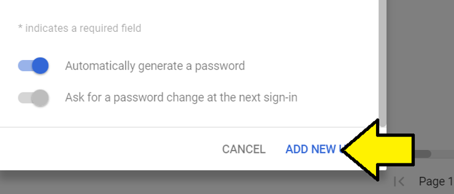

# Add a Google G Suite User

This post shows how to add a user to your Google G Suite.

**Steps**

1\. Sign-in to [https://admin.google.com/](http://admin.google.com/)

2\. Click **Users**

3\. Put your mouse over the **circle** with a **+**

**Note:** depending on the size of your window, the '+' will be in the upper left corner or lower right corner.

You should see:

4\. **Click** on the '**+'**

You should see the **Add new user screen**:

5\. Fill in the new user's details and click **ADD NEW USER**

6\. Click **DONE**

**References**

-   **Options for adding users support topic at \[**[**link**](http://support.google.com/a/answer/179832?hl=en)**\]**
    
-   **Add users individually support topic at \[**[**link**](http://support.google.com/a/answer/33310)**\]**