# Add a Yocto Layer to a PetaLinux Project and Build a Recipe in the Layer with PetaLinux Tools


This post shows how to add a new Yocto layer to your PetaLinux project and build a recipe in the Yocto layer with PetaLinux Tools 2017.4.

This post uses the "meta-example" from DynamicDevices.

*Looking for help build software for Xilinx SoCs? Email* [*inquiries@centennialsoftwaresolutions.com*](mailto:inquiries@centennialsoftwaresolutions.com?subject=I'm+looking+for+a+30-min+consult+on+building+software+for+Xilinx+SoCs+for+$99.00) *today to schedule a 30-min consult for $99.00*

**Prerequisites**

Download and Install Xilinx's 2017.4 PetaLinux Tools at [link](http://www.zachpfeffer.com/single-post/Download-and-Install-Xilinxs-20174-PetaLinux-Tools)

**Post Updates**

May 4th 2018

These instructions don't cover creating a layer, they cover pulling in an existing layer.

April 25th 2018

Updated the example to use **${PROOT}** instead of an absolute path when entering the user layer into the config field. Using **${PROOT}** in the user layer path allows you to support running **petalinux-build** immediately after unpacking a PetaLinux project. Without **${PROOT}**, the user is required to run **petalinux-config** after unpacking a PetaLinux project.

**Motivation**

In Yocto new layers are added to BBLAYERS listed in conf/bblayers.conf. PetaLinux Tools 2017.4 creates this file and says not to edit it:

```
# WARNING: this configuration has been automatically generated and in
# most cases should not be edited. If you need more flexibility than
# this configuration provides, it is strongly suggested that you set
# up a proper instance of the full build system and use that instead.
```

It doesn't work to disregard the warning, edit this file and run petalinux-config to pick up the layer because PetaLinux Tools will regenerate it during petalinux-config.

This write up shows the correct way to add a layer to **BBLAYERS** in **conf/bblayers.conf** using PetaLinux Tools 2017.4.

**Check Out the Layer and Put it in the Right Spot**

1\. cd into your PetaLinux project

2\. make and cd into components/ext\_source

```
mkdir -p components/ext_source
cd components/ext_source
```

You should put your external source here according to Table A-1 on p89 of the PetaLinux Tools reference guide.

3\. Get source with:

```
git clone https://github.com/DynamicDevices/meta-example
```

**Add a layer to BBLAYERS in conf/bblayers.conf**

1\. cd into your PetaLinux project

2\. Type:

```
petalinux-config
```

After a few seconds the misc/config System Configuration menu will appear:

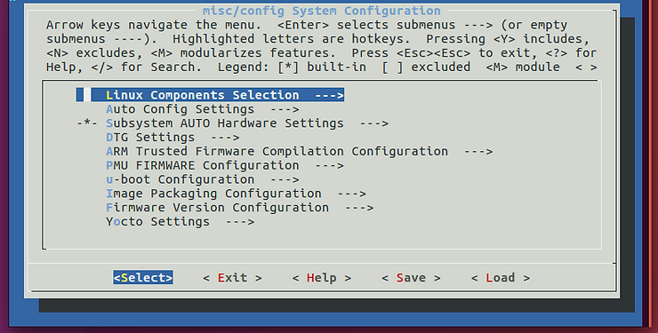

3\. Press down until the cursor is on Yocto Settings ---> and hit Enter.

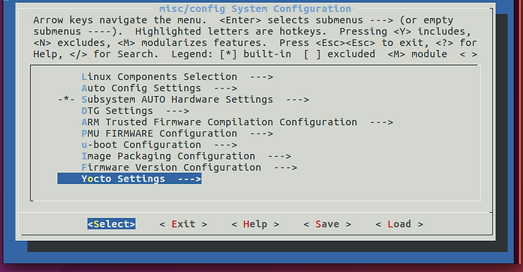

After hitting Enter you should see:

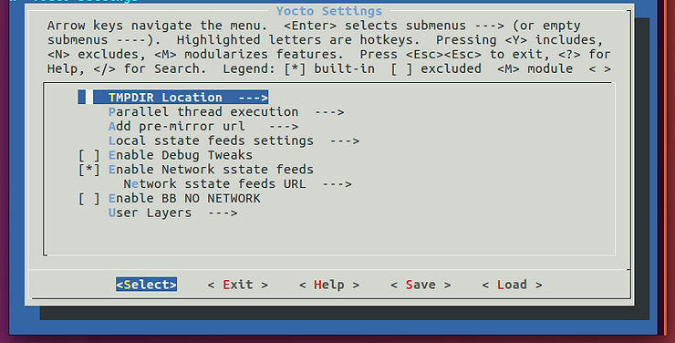

4\. Press down until the cursor is on User Layers ---> and hit Enter.

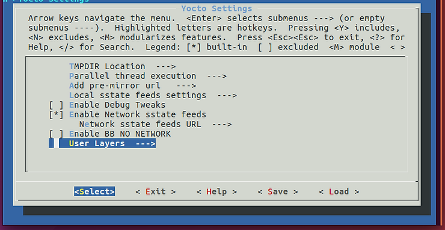

After hitting Enter you will see:

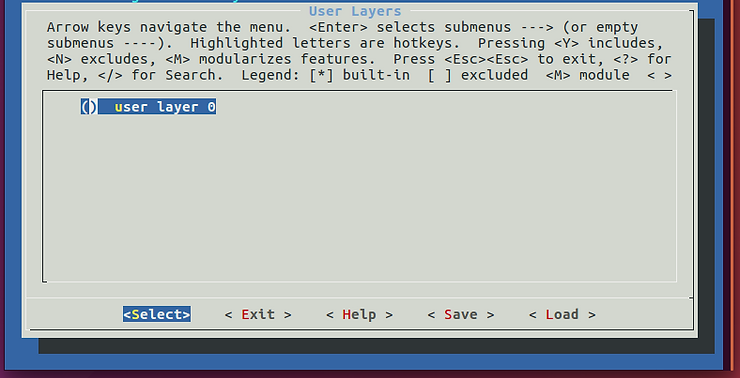

5\. Press Enter.

You should see the following:

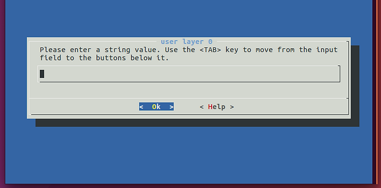

6\. Enter the full path to meta-example:

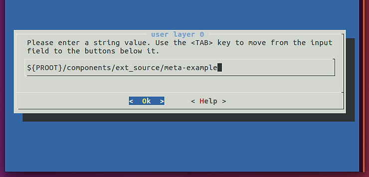

Note: you should use **${PROOT}**. **${PROOT}** is also used in TMPDIR (**${PROOT}/build/tmp**).

...and hit Enter to Ok

You should see:

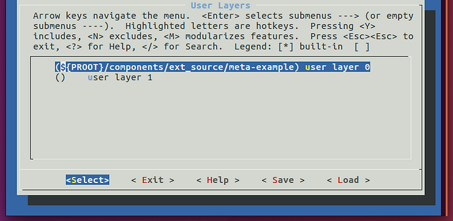

If you want to enter in another layer scroll down to user layer 1, hit enter, enter the path...etc.

You can enter up-to 10 user layers.

7\. Select Exit:

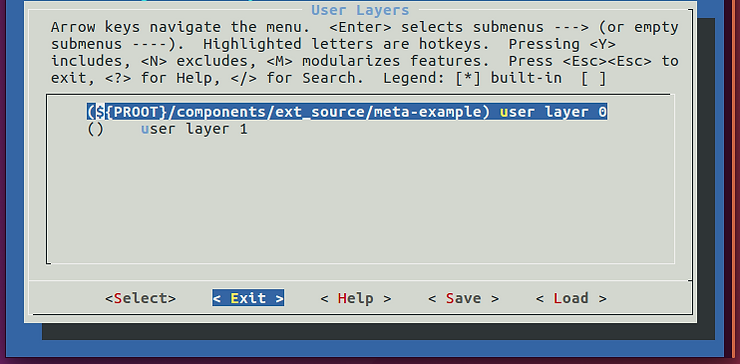

...Exit:

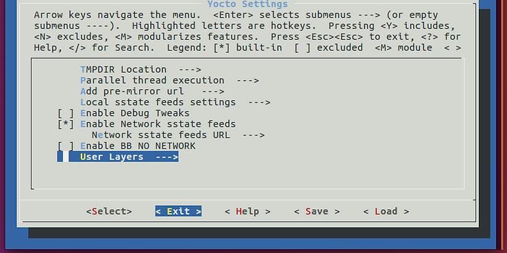

...Exit:

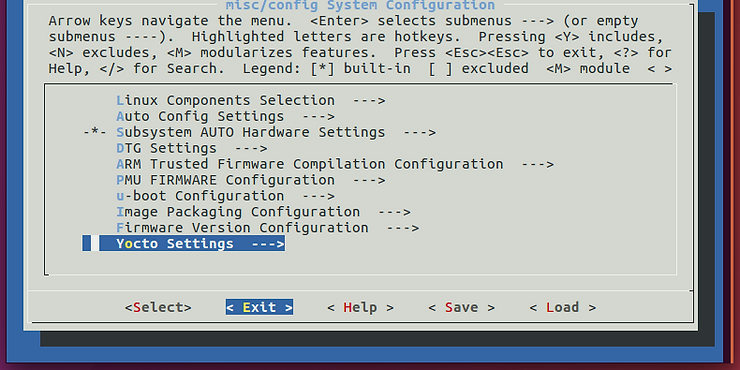

...and <Yes> to save the configuration:

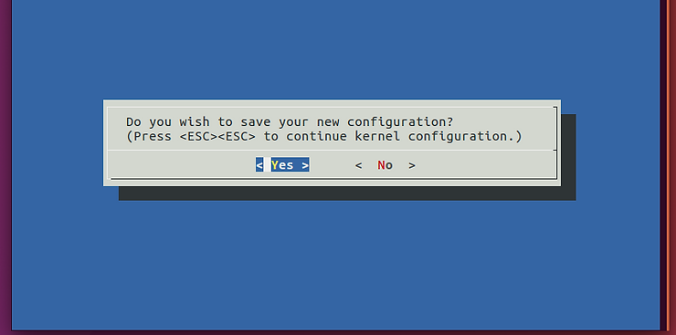

After these steps the following update gets made to the project (that are not .gitignored):

```
diff --git a/project-spec/configs/config b/project-spec/configs/config
index 0914524..fdc4d1f 100644
--- a/project-spec/configs/config
+++ b/project-spec/configs/config
@@ -255,5 +255,6 @@ CONFIG_YOCTO_NETWORK_SSTATE_FEEDS_URL="http://petalinux.xilinx.com/sswreleases/r
 #
 # User Layers
 #
-CONFIG_USER_LAYER_0=""
+CONFIG_USER_LAYER_0="/home/pfefferz/plprjs4/mtd_board/components/ext_source/meta-example"
+CONFIG_USER_LAYER_1=""
 CONFIG_SUBSYSTEM_BOOTARGS_GENERATED="earlycon clk_ignore_unused"
```

In addition conf/bblayers.conf now contains meta-example:

```
pfefferz@plc2:~/plprjs4/mtd_board$ cat build/conf/bblayers.conf 
# WARNING: this configuration has been automatically generated and in
# most cases should not be edited. If you need more flexibility than
# this configuration provides, it is strongly suggested that you set
# up a proper instance of the full build system and use that instead.

LCONF_VERSION = "7"

BBPATH = "${TOPDIR}"
SDKBASEMETAPATH = "/home/pfefferz/tools/opt/pkg/petalinux/components/yocto/source/aarch64"
BBLAYERS := " \
  ${SDKBASEMETAPATH}/layers/core/meta \
  ${SDKBASEMETAPATH}/layers/core/meta-poky \
  ${SDKBASEMETAPATH}/layers/meta-perl \
  ${SDKBASEMETAPATH}/layers/meta-systemd \
  ${SDKBASEMETAPATH}/layers/meta-gpe \
  ${SDKBASEMETAPATH}/layers/meta-python \
  ${SDKBASEMETAPATH}/layers/meta-efl \
  ${SDKBASEMETAPATH}/layers/meta-ruby \
  ${SDKBASEMETAPATH}/layers/meta-filesystems \
  ${SDKBASEMETAPATH}/layers/meta-gnome \
  ${SDKBASEMETAPATH}/layers/meta-multimedia \
  ${SDKBASEMETAPATH}/layers/meta-networking \
  ${SDKBASEMETAPATH}/layers/meta-webserver \
  ${SDKBASEMETAPATH}/layers/meta-xfce \
  ${SDKBASEMETAPATH}/layers/meta-initramfs \
  ${SDKBASEMETAPATH}/layers/meta-oe \
  ${SDKBASEMETAPATH}/layers/meta-linaro-toolchain \
  ${SDKBASEMETAPATH}/layers/meta-qt5 \
  ${SDKBASEMETAPATH}/layers/meta-xilinx \
  ${SDKBASEMETAPATH}/layers/meta-xilinx-tools \
  ${SDKBASEMETAPATH}/layers/meta-petalinux \
  ${SDKBASEMETAPATH}/layers/meta-virtualization \
  ${SDKBASEMETAPATH}/layers/meta-openamp \
  ${SDKBASEMETAPATH}/workspace \
  /home/pfefferz/plprjs4/mtd_board/project-spec/meta-plnx-generated \
  /home/pfefferz/plprjs4/mtd_board/project-spec/meta-user \
  /home/pfefferz/plprjs4/mtd_board/components/ext_source/meta-example \
```

Note: **${PROOT}** gets turned into **/home/pfefferz/plprjs4/mtd\_board** in this case.

**Build a Recipe from meta-example with PetaLinux Tools**

1\. Open **project-spec/meta-user/recipes-core/images/petalinux-image.bbappend** and add **IMAGE\_INSTALL\_append = " bbexample"**

The space between " and bbexample" this is required.

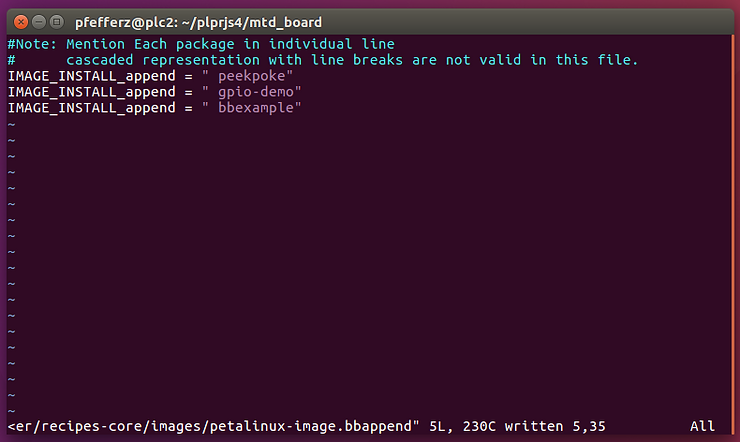

Note: there is a very brief section in the PetaLinux Tools reference guide called **Adding a Recipe from Yocto e-SDK Layers topetalinux-image-full.bb** on page 81 that gives the location of the file (**project-spec/meta-user/recipes-core/images/petalinux-image.bbappend)** that has to be edited.

2\. Run:

```
petalinux-config -c rootfs
```

You should see:

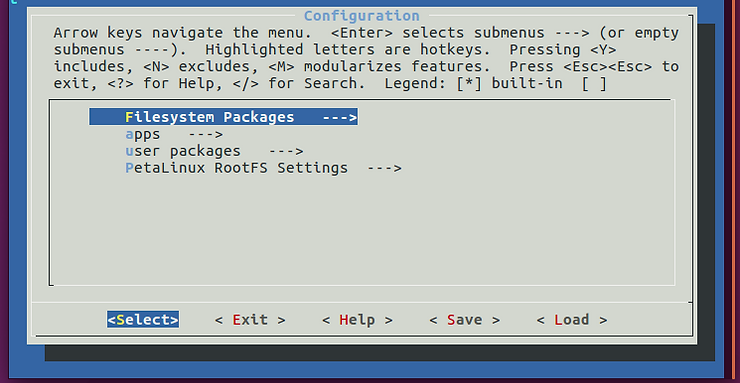

3\. Arrow down to **user packages --->**:

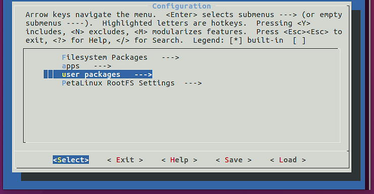

...and hit Enter. You should see:

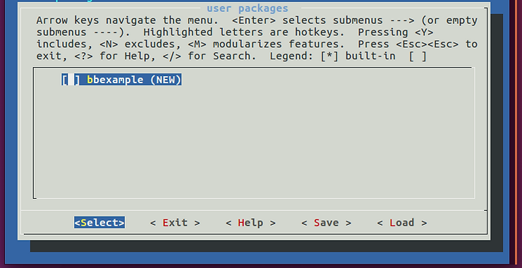

4\. Type 'Y'. You'll see:

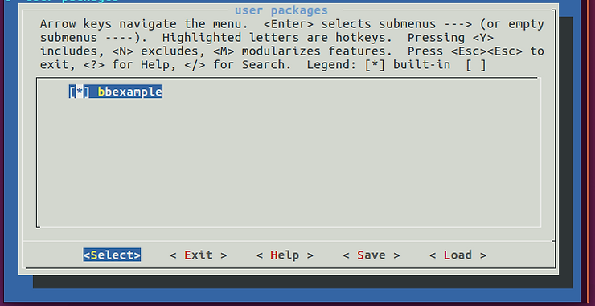

5\. Hit Exit, Exit then Yes to save.

You'll see the following difference in **project-spec/configs/rootfs\_config**

```
--- a/project-spec/configs/rootfs_config
+++ b/project-spec/configs/rootfs_config
@@ -4379,6 +4379,7 @@ CONFIG_bridge-utils=y
 #
 # user packages 
 #
+CONFIG_bbexample=y
```

In addition **./project-spec/meta-plnx-generated/recipes-core/images/petalinux-user-image.bb** gets generated:

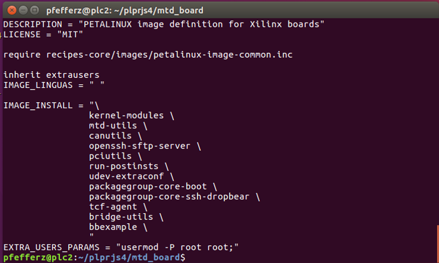

6\. Now type:

```
petalinux-build
```

You should see:

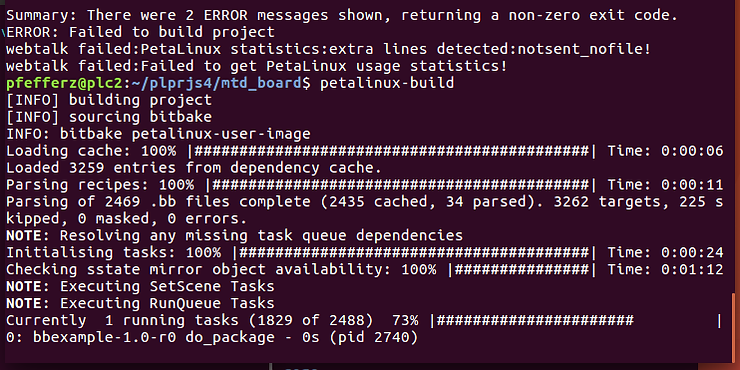

...and something like the following if everything built okay:

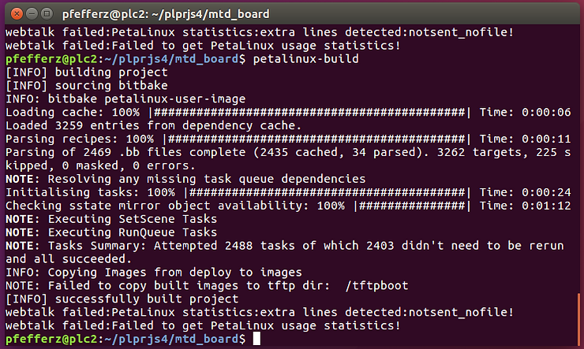

```
root@mtd_board:~# bbexample 
Hello Yocto World...
Hello World (from a shared library!)
```

6\. After booting your target, run bbexample:

Find where its located:

```
root@mtd_board:~# which bbexample
/usr/bin/bbexample
```

Also find the lib:

```
root@mtd_board:~# LD_DEBUG=libs bbexample
      2131:     find library=libbbexample.so.1 [0]; searching
      2131:      search cache=/etc/ld.so.cache
      2131:       trying file=/usr/lib/libbbexample.so.1
      2131:
      2131:     find library=libc.so.6 [0]; searching
      2131:      search cache=/etc/ld.so.cache
      2131:       trying file=/lib/libc.so.6
      2131:
      2131:
      2131:     calling init: /lib/libc.so.6
      2131:
      2131:
      2131:     calling init: /usr/lib/libbbexample.so.1
      2131:
      2131:
      2131:     initialize program: bbexample
      2131:
      2131:
      2131:     transferring control: bbexample
      2131:
Hello Yocto World...
Hello World (from a shared library!)
      2131:
      2131:     calling fini: bbexample [0]
      2131:
      2131:
      2131:     calling fini: /usr/lib/libbbexample.so.1 [0]
      2131:
root@mtd_board:~# 
```

**Note on the Yocto Version used in PetaLinux Tools 2017.4**

PetaLinux Tools 2017.4 is based on the 2.2.3 "Morty" release of the Yocto Project. See the release notes @ [link](http://www.xilinx.com/support/answers/70277.html) for details.

If you check out Morty and diff it with the release you will see 928 lines added from the morty branch and 1494 lines removed.

Here are the commands to run through the calc:

```
git clone git://git.yoctoproject.org/poky
pushd poky
git checkout morty
popd
diff -ur poky ~/tools/opt/pkg/petalinux/components/yocto/source/aarch64/layers/core | grep -E "^\+" | wc -l
diff -ur poky ~/tools/opt/pkg/petalinux/components/yocto/source/aarch64/layers/core | grep -E "^-" | wc -l
```

**References**

-   [meta\_example](http://github.com/DynamicDevices/meta-example)
    
-   Yocto
    
-   Yocto [docs](http://www.yoctoproject.org/docs/)
    
-   Yocto Project Mega-Manual Morty 2.2.3 PDF @ [link](http://drive.google.com/open?id=1IrOQriK_gXNKqyF_AqzqOS-yfo0Hoaeq)
    
-   See **5.1 Understanding and Creating Layers** for a discussion about layers (p37/400)
    
-   Yocto Project Mega-Manual Rocko 2.4.2 PDF @ [link](http://drive.google.com/open?id=1c6r0gJJohVZt8ZHvyYk5MM0_6RZoDxzH)
    
-   Yocto Source Repositories @ [link](http://git.yoctoproject.org/cgit.cgi)
    
-   Building your own recipes from first principles @ [link](http://wiki.yoctoproject.org/wiki/Building_your_own_recipes_from_first_principles)
    
-   Xilinx
    
-   PetaLinux Tools 2017.4 Reference Guide UG1144 (v2017.4) December 20, 2017 @ [link](http://www.xilinx.com/support/documentation/sw_manuals/xilinx2017_4/ug1144-petalinux-tools-reference-guide.pdf)