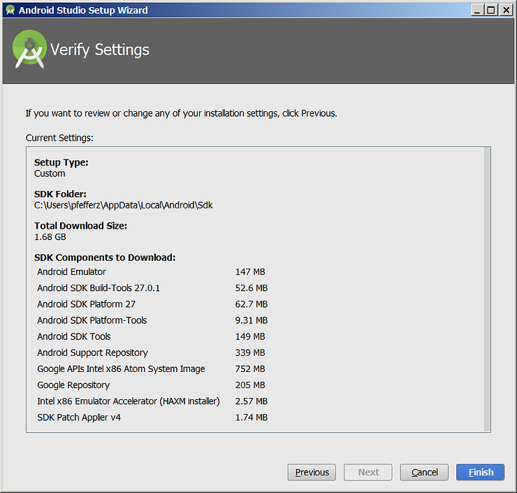

# Android Studio Setup Wizard Verify Settings Screen

**Installed**

11/29/2017 @ 8:31 PM MST

**Screen**

**In Text**

**Setup Type:**

Custom

**SDK Folder:**

C:\\Users\\pfefferz\\AppData\\Local\\Android\\Sdk

**Total Download Size:**

1.68 GB

**SDK Components to Download:**

Android Emulator ---------------------------------------- 147 MB

Android SDK Build-Tools 27.0.1 ---------------------- 52.6 MB

Android SDK Platform 27 ------------------------------ 62.7 MB

Android Platform-Tools --------------------------------- 9.31 MB

Android SDK Tools --------------------------------------- 149 MB

Android Support Repository --------------------------- 339 MB

Google APIs Intel x86 Atom System Image -------- 752 MB

Google Repository --------------------------------------- 205 MB

Intel x86 Emulator Accelerator (HAXM installer) -- 2.57 MB

SDK Patch Applier v4 ------------------------------------ 1.74 MB

**Full Install Log**

[link](http://drive.google.com/file/d/1btgMQaUdSqJZ1WICAchqfU_RkSM3A6Q-/view?usp=sharing)