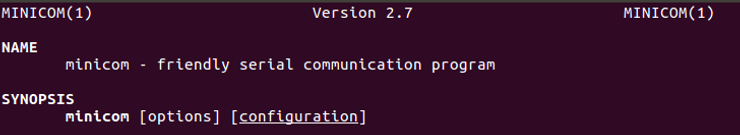
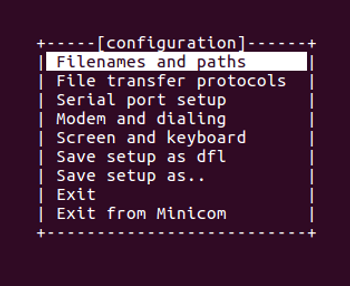
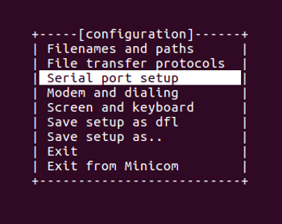
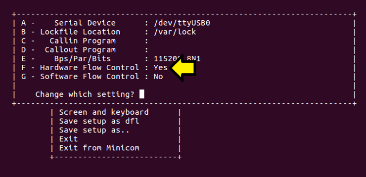
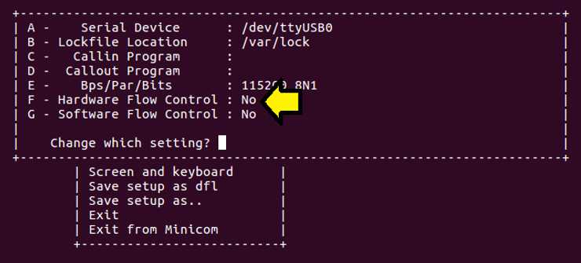
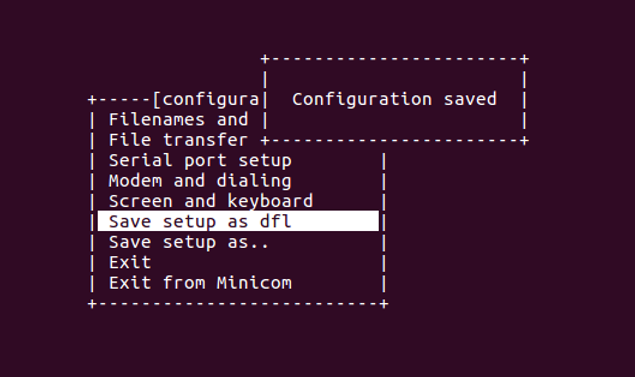
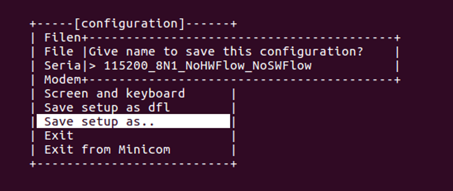

# Arg! Nothing I type shows up in the Minicom console!

This post lists something to try if what you type is not showing up in the console. It also lists how to save and load the configuration.

If nothing shows up on the screen when you type try **turning off hardware flow control**.

You can turn it off with these steps:

**Steps**

**1\.** Type:

**sudo minicom -s**

You'll see:

**2\.** Press: DOWN ARROW, DOWN ARROW

**3\.** Press ENTER. If Hardware Flow Control is on you'll see:

**4\.** Press F if Hardware Flow Control says Yes. Now you should see

**5\.** Press ESC. Press the DOWN ARROW till you get to Save setup as dfl. Hit ENTER. This will save the setup as the default (/etc/mini- com/minirc.dfl) and you'll see:

**6\.** If you select Save setup as.. then enter a name, like 115200\_8N1\_NoHWFlow\_NoSWFlow:

**7\.** Press ENTER than Exit or Exit Minicom

**8\.** Launch it

If you existed Minicom you can now use the following to launch Minicom with the default config:

**minicom -o -w -C Apr-5th-2018.log**

Or if you saved a config:

**minicom -o -w -C Apr-5th-2018.log 115200\_8N1\_NoHWFlow\_NoSWFlow**

**Note**

You can exit Minicom by pressing Control-a then x.