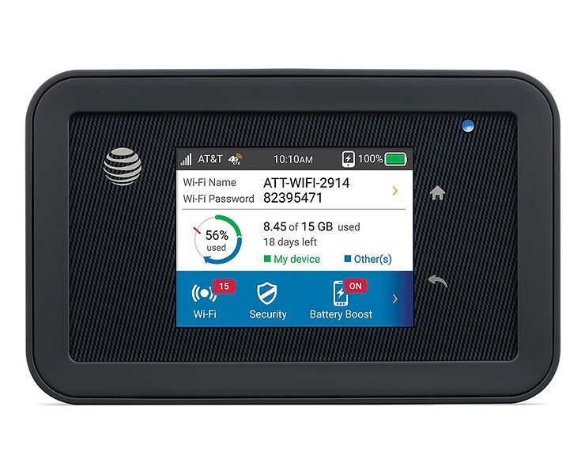

# AT&T Unite Explore (Hotspot) Open-Source Components

Image from: [https://www.att.com/devices/att/unite-explore.html#sku=sku7870787](http://www.att.com/devices/att/unite-explore.html#sku=sku7870787) 

## Retrieve the List

Go to: http://attwifimanager/ > Settings > About > View Credits & Licenses or http://attwifimanager/licenses.html

## The List

-   alsa-intf
    
-   alx
    
-   aspell
    
-   atk
    
-   attr
    
-   base-files
    
-   base-passwd
    
-   binutils-cross
    
-   busybox
    
-   bzip2
    
-   cairo
    
-   conntrack-tools
    
-   curl
    
-   data-ipa-cfg-mgr
    
-   data-oss
    
-   depmodwrapper-cross
    
-   dhcpcd
    
-   directfb
    
-   dnsmasq
    
-   e2fsprogs
    
-   ebtables
    
-   eglibc
    
-   eglibc-initial
    
-   elfutils
    
-   enchant
    
-   ethtool
    
-   expat
    
-   fontconfig
    
-   freetype
    
-   gcc-cross
    
-   gcc-cross-initial
    
-   gcc-runtime
    
-   gdk-pixbuf
    
-   gettext
    
-   glib-2.0
    
-   gnutls
    
-   gstreamer
    
-   gtk+
    
-   harfbuzz
    
-   hostap-daemon-qcacld
    
-   icu
    
-   init-ifupdown
    
-   init-mss
    
-   initscripts
    
-   iproute2
    
-   iptables
    
-   iw
    
-   jpeg
    
-   kbd
    
-   keymaps
    
-   libcap
    
-   liberation-fonts
    
-   libffi
    
-   libgcc
    
-   libgcrypt
    
-   libgpg-error
    
-   libhardware
    
-   libidn
    
-   libnetfilter-conntrack
    
-   libnfnetlink
    
-   libnl
    
-   libpcap
    
-   libpng
    
-   libproxy
    
-   libsoup-2.4
    
-   libtasn1
    
-   libtool
    
-   libtool-cross
    
-   libxml2
    
-   libxslt
    
-   linux-libc-headers
    
-   linux-quic
    
-   lk
    
-   loc-api
    
-   lzo
    
-   miniupnpd
    
-   modutils-initscripts
    
-   mtd-utils
    
-   ncurses
    
-   netbase
    
-   ocf-linux
    
-   openssl
    
-   opkg
    
-   opkg-config-base
    
-   pango
    
-   pimd
    
-   pixman
    
-   pkgconfig
    
-   pointercal
    
-   popt
    
-   powerapp
    
-   pugixml
    
-   qcacld-ll
    
-   qcacld-tools
    
-   qemuwrapper-cross
    
-   qrngd
    
-   readline
    
-   reboot-daemon
    
-   rtsp-alg
    
-   run-postinsts
    
-   shared-mime-info
    
-   sqlite3
    
-   start-scripts-find-partitions
    
-   start-scripts-firmware-links
    
-   sysfsutils
    
-   system-conf
    
-   system-core
    
-   sysvinit
    
-   sysvinit-inittab
    
-   tcpdump
    
-   tslib
    
-   update-rc.d
    
-   util-linux
    
-   util-macros
    
-   wbxml2
    
-   webkit-gtk
    
-   wireless-tools
    
-   wpa-supplicant-qcacld
    
-   zlib
    
-   WebUI