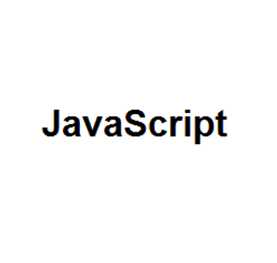
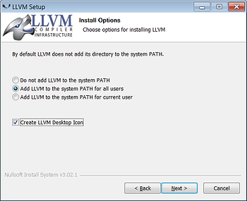

# Format JavaScript in Vim on Windows per Google's Style Guide



This post lists how to use **clang-format** in Vim on Windows while writing JavaScript code as suggested in Googles JavaScript style guide.

**Versions Used**

-   Windows 7 SP1
    
-   VIM - Vi IMproved 8.1 (2018 May 18, compiled Dec 16 2018 23:02:07) available at \[[link](http://github.com/vim/vim-win32-installer/releases/download/v8.1.0606/gvim_8.1.0606_x64.zip)\]
    
-   LLVM 8.0.0 @ SVN r347735 (29 November 2018) at \[[link](http://prereleases.llvm.org/win-snapshots/LLVM-8.0.0-r347735-win64.exe)\] posted at \[[link](http://llvm.org/builds/)\]
    
-   Python 3.7.1 at \[[link](http://www.python.org/downloads/release/python-371/)\]
    

**Steps**

**1**. Download Python 3.7.1 at \[[link](http://www.python.org/downloads/release/python-371/)\].

Install it using defaults for all options.

**2**. Download gvim\_8.1.0606\_x64-mui2.exe at \[[link](http://github.com/vim/vim-win32-installer/releases/download/v8.1.0606/gvim_8.1.0606_x64-mui2.exe)\].

Install it using defaults for all options.

It will be installed to **c:\\Program Files\\vim**.

**3**. Download the Windows installer (64-bit) LLVM-8.0.0-r347735 at \[[link](http://prereleases.llvm.org/win-snapshots/LLVM-8.0.0-r347735-win64.exe)\]

Use the following settings when installing LLVM:

During installation: select **Add LLVM to the system PATH for all users** and select the **Create LLVM Desktop Icon checkbox**



...and accept the default Destination Folder **C:\\Program Files\\LLVM**

Install it.

**4**. Open your \_vimrc by typing **:vi ~\\\_vimrc**

Add the following to your \_vimrc file:

```
map <C-K> :pyf C:/Program\ Files/LLVM/share/clang/clang-format.py<cr>
imap <C-K> <c-o>:pyf C:/Program\ Files/LLVM/share/clang/clang-format.py<cr>

function! Formatonsave()
	let l:formatdiff = 1
	pyf C:/Program\ Files/LLVM/share/clang/clang-format.py
endfunction
autocmd BufWritePre *.js call Formatonsave()
```

This allows the user to visually select code and press **control-k** to format it according to Google JavaScript coding guidelines.

It also auto formats the code when the file is saved.

**5**. Type **:source ~\\\_vimrc** to read the file into the currently running session.

**6**. Type :vi ~/test.js and paste this in:

```
var parse_url =
/^(?:([A-Za-z]+):)?(\/{0,3})([0-9.\-A-Za-z]+)(?::(\d+))?(?:\/([^?#]*))?(?:\?([^#]*))?(?:#(.*))?$/;

var url = "http://www.ora.com:80/goodparts?q#fragment";
var result = parse_url.exec(url);
var names =
[ 'url', 'scheme', 'slash', 'host', 'port', 'path', 'query', 'hash' ];
var blanks = ' ';
var i;
for (i = 0; i < names.length; i += 1) {
document.writeln(names[i] + ':' + blanks.substring(names[i].length),
result[i]);
}
```

**7**. Type **:w**

If everything is working you'll see:

```
var parse_url =
    /^(?:([A-Za-z]+):)?(\/{0,3})([0-9.\-A-Za-z]+)(?::(\d+))?(?:\/([^?#]*))?(?:\?([^#]*))?(?:#(.*))?$/;

var url = "http://www.ora.com:80/goodparts?q#fragment";
var result = parse_url.exec(url);
var names =
    [ 'url', 'scheme', 'slash', 'host', 'port', 'path', 'query', 'hash' ];
var blanks = ' ';
var i;
for (i = 0; i < names.length; i += 1) {
  document.writeln(names[i] + ':' + blanks.substring(names[i].length),
                   result[i]);
}
```

**8**. To test, open another Vim window and type **:vi ~\\program.html**

Paste this:

```
<html><body><pre><script src="test.js">
</script></pre></body></html>
```

**9**. Open c:\\Users\\pfefferz\\program.html

(replace pfefferz with your username)

You should see:

```
url:http://www.ora.com:80/goodparts?q#fragment
scheme:http
slash://
host:www.ora.com
port:80
path:goodparts
query:q
hash:fragment
```

**References**

-   Clang Vim Integration instructions at \[[link](http://clang.llvm.org/docs/ClangFormat.html)\]
    
-   Google JavaScript style guide at \[[link](http://google.github.io/styleguide/jsguide.html)\]
    
-   vimrc help at \[[link](http://vim.wikia.com/wiki/Open_vimrc_file)\]
    
-   Download gvim at \[[link](http://www.vim.org/download.php#pc)\]
    
-   JavaScript example from p.66 (HTML test on p.4) of **JavaScript. The Good Parts. First Edition.**