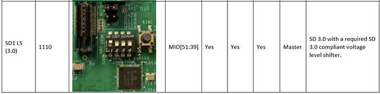

# Boot Linux from an SD Card on ZCU102 - Fix: 0x3B - Reading failed from the selected boot device


This post lists the commands to erase, and W95 FAT32 (LBA) format an SD card so you can boot Linux from it on a **ZCU102, ZC702, or other embedded system**. These instructions will fix the boot process failing as indicated by red PS\_ERROR\_OUT and INIT\_B LEDs and the BootROM failing with the error, "**0x3B - Reading failed from the selected boot device**." The SD card boot switches for a **ZCU102** are also listed below. To ensure you're successful.

Note: these steps will erase all the data on the SD card you use.

<u><span><span>Step </span><a href="https://www.centennialsoftwaresolutions.com/blog/hashtags/1" target="__blank"><span>#1</span></a></span></u>: Plugin your SD card

<u><span><span>Step </span><a href="https://www.centennialsoftwaresolutions.com/blog/hashtags/2" target="__blank"><span>#2</span></a></span></u>: Type dmesg to find the device name:

```
dmesg
```

At the end of the output you should see something like:

```
[4631534.438306] sd 33:0:0:1: [sdc] 31116288 512-byte logical blocks: (15.9 GB/14.8 GiB)
[4631534.452427]  sdc: sdc1
[4631534.973011] FAT-fs (sdc1): Volume was not properly unmounted. Some data may be corrupt. Please run fsck.
```

<u><span><span>Step </span><a href="https://www.centennialsoftwaresolutions.com/blog/hashtags/3" target="__blank"><span>#3</span></a></span></u>: Zero the SD card

This is optional

Type:

```
sudo dd status=progress if=/dev/zero of=/dev/sdc bs=4096
```

Note: this will take a little bit

Note 2: without bs=4096 I got 6.3 MB/s, with it I got 50-100 MB/s

I saw this once my invocation completed:

```
15927132160 bytes (16 GB, 15 GiB) copied, 1248 s, 12.8 MB/s    
dd: error writing '/dev/sdc': No space left on device
3889537+0 records in
3889536+0 records out
15931539456 bytes (16 GB, 15 GiB) copied, 1248.48 s, 12.8 MB/s
```

<u><span><span>Step </span><a href="https://www.centennialsoftwaresolutions.com/blog/hashtags/4" target="__blank"><span>#4</span></a></span></u>: Add a partition table. Type:

```
sudo fdisk /dev/sdc
```

<u><span><span>Step </span><a href="https://www.centennialsoftwaresolutions.com/blog/hashtags/5" target="__blank"><span>#5</span></a></span></u>: Use the responses in **bold**

```
Welcome to fdisk (util-linux 2.27.1).
Changes will remain in memory only, until you decide to write them.
Be careful before using the write command.

Device does not contain a recognized partition table.
Created a new DOS disklabel with disk identifier 0x7c06933e.

Command (m for help): m

Help:

  DOS (MBR)
   a   toggle a bootable flag
   b   edit nested BSD disklabel
   c   toggle the dos compatibility flag

  Generic
   d   delete a partition
   F   list free unpartitioned space
   l   list known partition types
   n   add a new partition
   p   print the partition table
   t   change a partition type
   v   verify the partition table
   i   print information about a partition

  Misc
   m   print this menu
   u   change display/entry units
   x   extra functionality (experts only)

  Script
   I   load disk layout from sfdisk script file
   O   dump disk layout to sfdisk script file

  Save & Exit
   w   write table to disk and exit
   q   quit without saving changes

  Create a new label
   g   create a new empty GPT partition table
   G   create a new empty SGI (IRIX) partition table
   o   create a new empty DOS partition table
   s   create a new empty Sun partition table


Command (m for help): o
Created a new DOS disklabel with disk identifier 0x138cb35c.

Command (m for help): n
Partition type
   p   primary (0 primary, 0 extended, 4 free)
   e   extended (container for logical partitions)
Select (default p): <Enter>
Partition number (1-4, default 1): <Enter> 
First sector (1-2047, default 1): <Enter>
Last sector, +sectors or +size{K,M,G,T,P} (1-2047, default 2047): <Enter>

Created a new partition 1 of type 'Linux' and of size 1023.5 KiB.

Command (m for help): t
Selected partition 1
Partition type (type L to list all types): L

 0  Empty           24  NEC DOS         81  Minix / old Lin bf  Solaris        
 1  FAT12           27  Hidden NTFS Win 82  Linux swap / So c1  DRDOS/sec (FAT-
 2  XENIX root      39  Plan 9          83  Linux           c4  DRDOS/sec (FAT-
 3  XENIX usr       3c  PartitionMagic  84  OS/2 hidden or  c6  DRDOS/sec (FAT-
 4  FAT16 <32M      40  Venix 80286     85  Linux extended  c7  Syrinx         
 5  Extended        41  PPC PReP Boot   86  NTFS volume set da  Non-FS data    
 6  FAT16           42  SFS             87  NTFS volume set db  CP/M / CTOS / .
 7  HPFS/NTFS/exFAT 4d  QNX4.x          88  Linux plaintext de  Dell Utility   
 8  AIX             4e  QNX4.x 2nd part 8e  Linux LVM       df  BootIt         
 9  AIX bootable    4f  QNX4.x 3rd part 93  Amoeba          e1  DOS access     
 a  OS/2 Boot Manag 50  OnTrack DM      94  Amoeba BBT      e3  DOS R/O        
 b  W95 FAT32       51  OnTrack DM6 Aux 9f  BSD/OS          e4  SpeedStor      
 c  W95 FAT32 (LBA) 52  CP/M            a0  IBM Thinkpad hi ea  Rufus alignment
 e  W95 FAT16 (LBA) 53  OnTrack DM6 Aux a5  FreeBSD         eb  BeOS fs        
 f  W95 Ext'd (LBA) 54  OnTrackDM6      a6  OpenBSD         ee  GPT            
10  OPUS            55  EZ-Drive        a7  NeXTSTEP        ef  EFI (FAT-12/16/
11  Hidden FAT12    56  Golden Bow      a8  Darwin UFS      f0  Linux/PA-RISC b
12  Compaq diagnost 5c  Priam Edisk     a9  NetBSD          f1  SpeedStor      
14  Hidden FAT16 <3 61  SpeedStor       ab  Darwin boot     f4  SpeedStor      
16  Hidden FAT16    63  GNU HURD or Sys af  HFS / HFS+      f2  DOS secondary  
17  Hidden HPFS/NTF 64  Novell Netware  b7  BSDI fs         fb  VMware VMFS    
18  AST SmartSleep  65  Novell Netware  b8  BSDI swap       fc  VMware VMKCORE 
1b  Hidden W95 FAT3 70  DiskSecure Mult bb  Boot Wizard hid fd  Linux raid auto
1c  Hidden W95 FAT3 75  PC/IX           bc  Acronis FAT32 L fe  LANstep        
1e  Hidden W95 FAT1 80  Old Minix       be  Solaris boot    ff  BBT            
Partition type (type L to list all types): c 
Changed type of partition 'Linux' to 'W95 FAT32 (LBA)'.

Command (m for help): w
The partition table has been altered.
Syncing disks.
```

<u><span>Possible Error</span></u>

If you see:

```
Re-reading the partition table failed.: Device or resource busy

The kernel still uses the old table. The new table will be used at the next reboot or after you run partprobe(8) or kpartx(8).
```

Type:

```
umount /dev/sdc1
```

…and try fdisk again

<u><span>Note</span></u>

You can also type in a script:

```
(echo o; echo n; echo; echo; echo; echo; echo t; echo c; echo w) | sudo fdisk /dev/sdc
```

or

```
(echo -e 'o\nn\n\n\n\n\nt\nc\nw\n') | sudo fdisk /dev/sdc
```

<u><span><span>Step </span><a href="https://www.centennialsoftwaresolutions.com/blog/hashtags/6" target="__blank"><span>#6</span></a></span></u>: Type:

```
sudo mkfs.vfat /dev/sdc1
```

You should see something like:

```
mkfs.fat 3.0.28 (2015-05-16)
```

<u><span><span>Step </span><a href="https://www.centennialsoftwaresolutions.com/blog/hashtags/7" target="__blank"><span>#7</span></a></span></u>: Type:

```
mkdir sdcard_part1
sudo mount -t vfat /dev/sdc1 sdcard_part1 -o rw,uid=$(id -u),gid=$(id -g)
cd sdcard_part1
echo "Hello, World!" > test.txt
cd ..
sudo umount sdcard_part1
rm -rf sdcard_part1
```

To boot from an SD card on a ZCU102, set SW6 to SD1 LS:



**<u><span>References</span></u>**

-   Good dd usage links \[[<u><span>link</span></u>](https://linuxconfig.org/learning-linux-commands-dd)<u><span>]</span></u>
    
-   Create a FAT file system image on Linux <u><span>[</span></u>[<u><span>link</span></u>](http://fejlesztek.hu/create-a-fat-file-system-image-on-linux/)\]
    
-   Re-reading the partition table failed with error 16: Device or resource busy <u><span>[</span></u>[<u><span>link</span></u>](https://unix.stackexchange.com/questions/264056/re-reading-the-partition-table-failed-with-error-16-device-or-resource-busy)\]
    
-   How to create and format a partition using a bash script? <u><span>[</span></u>[<u><span>link</span></u>](https://superuser.com/questions/332252/how-to-create-and-format-a-partition-using-a-bash-script)\]
    
-   Pictures of SW6 for every ZCU102 Zynq UltraScale+ MPSoC Boot Mode \[[<u><span>link</span></u>](https://www.centennialsoftwaresolutions.com/post/pictures-of-sw6-for-every-zcu102-zynq-ultrascale-mpsoc-boot-mode)\]
    
-   Xilinx logo from \[[<u><span>link</span></u>](https://twitter.com/xilinxinc)\]