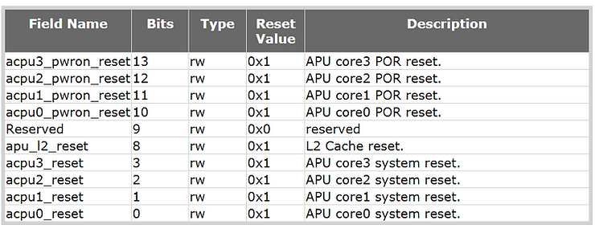
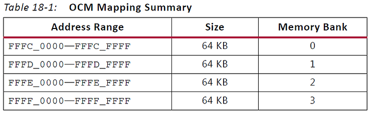
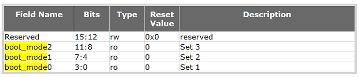
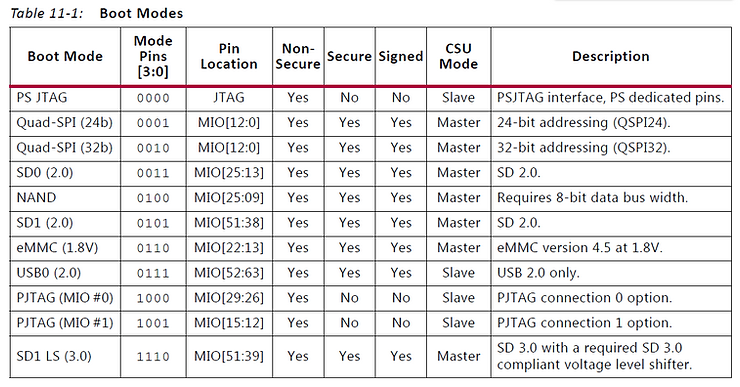
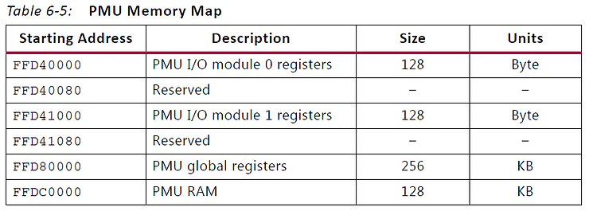
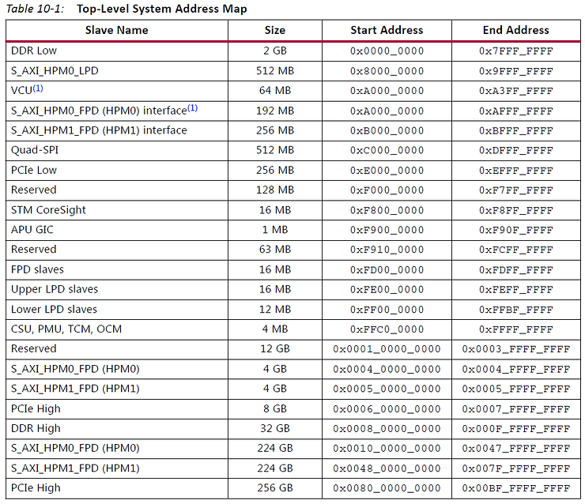
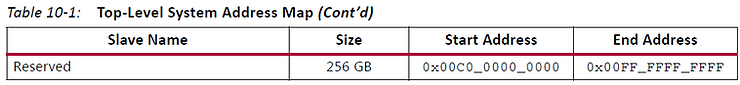
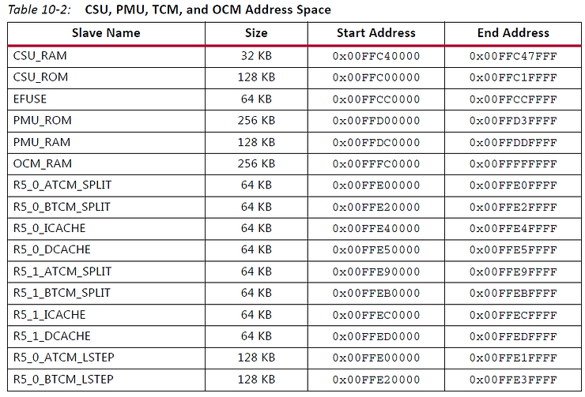
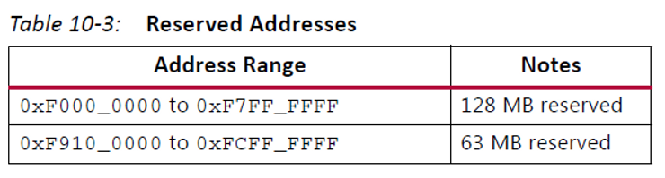

# Boot Linux on the Zynq UltraScale+ MPSoC over JTAG using PetaLinux Tools


This post describes how to boot Linux on the Zynq UltraScale+ MPSoC with XSCT 2017.4 over JTAG. It presents a script that has been modified from the default script that PetaLinux Tools 2017.4 uses. I modified the default script because I could not use the default script more than once, i.e. it worked the first time, but when I ran the default script again, it caused the system to hang.

The post overlays the write up on boot from the PS Boot and Device Configuration section of the Zynq UltraScale+ MPSoC Data Sheet @ [link](http://www.xilinx.com/support/documentation/data_sheets/ds891-zynq-ultrascale-plus-overview.pdf) with the XSCT instructions used to help set the context of the instructions.

These instructions worked with PetaLinux Tools 2017.4 and XSCT 2017.4.


**Boot Info**

Zynq UltraScale+ MPSoCs use a multi-stage boot process that supports both a non-secure and a secure boot.

The **PS** is the master of the boot and configuration process.

For a secure boot,

the AES-GCM, SHA-3/384 decrypts and authenticates the images

while the 4096-bit RSA block authenticates the image.

**Boot Flow (steps from doc are bolded)**

**1\. Upon reset, the device mode pins are read to determine the primary boot device to be used: NAND, Quad-SPI, SD, eMMC, or JTAG.**

**JTAG can only be used as a non-secure boot source and is intended for debugging purposes.**

Script

The script forces a reset and disables JTAG security with:


```
puts -nonewline "Reseting"

targets -set -nocase -filter {name =~ "*PSU*"}
stop
rst -system
after 2000

targets -set -nocase -filter {name =~ "*PMU*"}
stop
rst -system
after 2000

targets -set -nocase -filter {name =~ "*PSU*"}
stop
rst -system
after 2000

mwr 0xFFCA0038 0x1ff

targets -set -nocase -filter {name =~ "*MicroBlaze PMU*"}
dow "pmufw.elf"
after 2000
con
```

Script Explanation

The "**targets**" line selects the PSU or PMU.

"**stop**" suspends execution of the active target.

"**rst**" resets the active "**system**."

Note: I don't know and cannot find the exact definitions of what happens when you "stop" and "rst -system." This sequence was figured out by experiment.

**mwr 0xFFCA0038 0x1ff**

This ^^^ disables the PMU MDM, PLTAP and ARM DAP security gates. It allows:

-   the PS TAP to connect to the PMU,
    
-   the PSTAP to connect to the PL for bitstream loading and boundary scan operations and
    
-   the PS TAP or PJTAG to connect to the DAP
    

Acronyms

-   **PMU MDM stands for the Platform Management Unit Microprocessor Debug Module**
    
-   **PLTAP stands for the Programmable Logic Test Access Point**
    
-   **ARM DAP stands for the ARM Debug Access Port which provides access to ARM CoreSight™ components.**
    
-   **PS TAP stands for the Processor Subsystem Test Access Point**
    
-   **PJTAG stands for Processor JTAG**
    
-   **Note on PSJTAG and PJTAG From the Technical Reference Manual:**
    
-   **There are two JTAG port interfaces: PSJTAG and PJTAG**
    
-   **The PSJTAG port can reach all TAP controllers on the chain.**
    
-   **The PJTAG interface port provides exclusive access to the ARM DAP controller.**
    

After resetting the PSU and PMU, we select the PMU and download PMUFW. Because dow doesn't take any info, I assume that it reads the ELF. Here's an example:

```
p:$ ./build/tmp/sysroots/x86_64-linux/usr/bin/aarch64-xilinx-linux/aarch64-xilinx-linux-readelf -l ~/build/out/pmufw.elf 

Elf file type is EXEC (Executable file)
Entry point 0xffdc8abc
There are 2 program headers, starting at offset 52

Program Headers:
  Type           Offset   VirtAddr   PhysAddr   FileSiz MemSiz  Flg Align
  LOAD           0x000080 0xffdc0000 0xffdc0000 0x110bc 0x145f8 RWE 0x10
  LOAD           0x01113c 0xffddf6e0 0xffddf6e0 0x00400 0x00400 RW  0x4

 Section to Segment mapping:
  Segment Sections...
   00     .vectors.reset .vectors.sw_exception .vectors.interrupt .vectors.hw_exception .text .rodata .data .sdata2 .bss .stack 
   01     .xpbr_serv_ext_tbl
```

**dow** will load the PMUFW to 0xffdc0000 and set the PC to 0xffdc8abc. The **con** will release the PMU at 0xffdc8abc.

0xffdc0000 is the starting address the 128 KB PMU RAM (FFDC\_0000 + 1\_FFFF = FFDD\_FFFF last address)

**2\. The CSU executes code out of on-chip ROM and copies the first stage boot loader (FSBL) from the boot device to the OCM.**

**3\. After copying the FSBL to OCM, one of the processors, either the Cortex-A53 or Cortex-R5, executes the FSBL.**

**Xilinx supplies example FSBLs or users can create their own.**

Script

```
targets -set -nocase -filter {name =~ "*APU*"}
mwr 0xffff0000 0x14000000
mwr 0xFD1A0104 0x501
after 2000
mwr 0xFD1A0104 0x0
after 2000
targets -set -nocase -filter {name =~ "*A53*#0"}

source "psu_init.tcl"

dow "zynqmp_fsbl.elf"
after 2000
con

after 4000; stop; catch {stop}; psu_ps_pl_isolation_removal; psu_ps_pl_reset_config
```

Script Explanation

Select the APU.

Write 0x14000000 to 0xFFFF0000. 0xFFFF0000 is the start of the 3rd OCM memory bank. 0x14000000 is \_need to figure this out\_

Write 0x501 to 0xFD1A0104. 0xFD1A0104 is the **Software Controlled APU MPCore Resets (RST\_FPD\_APU)**. The bits are defined as:



0x501 sets APU core0 into system reset (bit 0), APU L2 into reset (bit 8) and APU core0 POR reset. (I don't know why the other bits are not set).

Wait 2 seconds, then **remove** the core0 reset, the L2 reset and the POR reset reset.

Select core 0 of the APU.

Source psu\_init.tcl. The psu\_init.tcl is automatically generated from your hardware design. It does around 500 writes to various addresses based on your configuration. Here's a list of the high-level settings that psu\_init.tcl does:

set psu_pll_init_data {

set psu_clock_init_data {

set psu_ddr_init_data {

set psu_mio_init_data {

set psu_peripherals_init_data {

set psu_post_config_data {

set psu_peripherals_powerdwn_data {

set psu_lpd_xppu_data {

set psu_ddr_xmpu0_data {

set psu_ddr_xmpu1_data {

set psu_ddr_xmpu2_data {

set psu_ddr_xmpu3_data {

set psu_ddr_xmpu4_data {

set psu_ddr_xmpu5_data {

set psu_ocm_xmpu_data {

set psu_fpd_xmpu_data {

set psu_protection_lock_data {

set psu_apply_master_tz {

set psu_serdes_init_data {

set psu_resetout_init_data {

set psu_resetin_init_data {

set psu_ps_pl_isolation_removal_data {

set psu_afi_config {

set psu_ps_pl_reset_config_data {

After psu\_init the fsbl is loaded to 0xFFFC\_0000 (OCM Memory Bank 0) and PC is set to 0xfffc0000:

```
p$ ./build/tmp/sysroots/x86_64-linux/usr/bin/aarch64-xilinx-linux/aarch64-xilinx-linux-readelf -l ~/build/out/zynqmp_fsbl.elf 

Elf file type is EXEC (Executable file)
Entry point 0xfffc0000
There are 4 program headers, starting at offset 64

Program Headers:
  Type           Offset             VirtAddr           PhysAddr
                 FileSiz            MemSiz              Flags  Align
  LOAD           0x0000000000000200 0x00000000fffc0000 0x00000000fffc0000
                 0x0000000000017308 0x000000000001c640  RWE    100
  LOAD           0x0000000000017508 0x00000000fffe9e00 0x00000000fffe9e00
                 0x0000000000000000 0x0000000000000088  RW     8
  LOAD           0x0000000000017540 0x00000000ffff0040 0x00000000ffff0040
                 0x0000000000000000 0x000000000000fc00  RW     40
  NOTE           0x000000000000dcf4 0x00000000fffcdaf4 0x00000000fffcdaf4
                 0x0000000000000024 0x0000000000000024  R      4

 Section to Segment mapping:
  Segment Sections...
   00     .text .init .fini .note.gnu.build-id .rodata .sys_cfg_data .eh_frame .mmu_tbl0 .mmu_tbl1 .mmu_tbl2 .data .init_array .fini_array .sbss .bss .heap .stack .dup_data 
   01     .handoff_params 
   02     .bitstream_buffer 
   03     .note.gnu.build-id 
```



FSBL executes for 2 seconds (-time to download). After the download

**psu\_ps\_pl\_isolation\_removal** is called (from psu\_init.tcl)

This function just sends a PL power up request to the PMU in the script that was generated in my design.

and

**psu\_ps\_pl\_reset\_config** is called (from psu\_init.tcl)

This function doesn't look like it does anything in the script that was generated in my design.

At the end of this stage the FSBL is running on core 0 of the A53 out of OCM. In addition the DDR has been set up.

**4\. The FSBL initiates the boot of the PS and can load and configure the PL, or configuration of the PL can be deferred to a later stage.**

**The FSBL typically loads either a user application or an optional second stage boot loader (SSBL), such as U-Boot.**

**Users obtain example SSBL from Xilinx or a third party, or they can create their own SSBL.**

**5\. The SSBL continues the boot process by loading code from any of the primary boot devices or from other sources such as USB, Ethernet, etc.**

**If the FSBL did not configure the PL, the SSBL can do so, or again, the configuration can be deferred to a later stage.**

**The static memory interface controller (NAND, eMMC, or Quad-SPI) is configured using default settings.**

**To improve device configuration speed, these settings can be modified by information provided in the boot image header.**

**The ROM boot image is not user readable or callable after boot.**

Script

```
targets -set -nocase -filter {name =~ "*A53*#0"}
dow -data "Image" 0x00080000
after 2000

targets -set -nocase -filter {name =~ "*A53*#0"}
dow -data "system.dtb" 0x1407f000
after 2000

targets -set -nocase -filter {name =~ "*A53*#0"}
puts stderr "INFO: Downloading ELF file to the target."
dow "linux-boot.elf"
after 2000

targets -set -nocase -filter {name =~ "*A53*#0"}
puts stderr "INFO: Downloading ELF file to the target."
dow "bl31.elf"
after 2000
con
```

Script Explanation

Recall that the FSBL is running on core 0 of the A53.

The Linux kernel binary "Image" is loaded at 0x0008000.

Then the device tree binary is loaded to 0x1407f000.

After this a little "mini" boot loader called linux-boot.elf gets loaded @ 0x80000000:

```
p:~/plprjs5/mtd_board$ ./build/tmp/sysroots/x86_64-linux/usr/bin/aarch64-xilinx-linux/aarch64-xilinx-linux-readelf -l ~/build/out/linux-boot.elf 

Elf file type is EXEC (Executable file)
Entry point 0x8000000
There are 1 program headers, starting at offset 64

Program Headers:
  Type           Offset             VirtAddr           PhysAddr
                 FileSiz            MemSiz              Flags  Align
  LOAD           0x0000000000010000 0x0000000008000000 0x0000000008000000
                 0x0000000000000028 0x0000000000000028  R E    10000

 Section to Segment mapping:
  Segment Sections...
   00     .text 
```

```
p:~/plprjs5/mtd_board$ ./build/tmp/sysroots/x86_64-linux/usr/bin/aarch64-xilinx-linux/aarch64-xilinx-linux-objdump -D ~/build/out/linux-boot.elf 

/home/pfefferz/build/out/linux-boot.elf:     file format elf64-littleaarch64


Disassembly of section .text:

0000000008000000 <_start>:
 8000000:	580000d1 	ldr	x17, 8000018 <kernel_start>
 8000004:	580000e0 	ldr	x0, 8000020 <kernel_dts>
 8000008:	aa1f03e1 	mov	x1, xzr
 800000c:	aa1f03e2 	mov	x2, xzr
 8000010:	aa1f03e3 	mov	x3, xzr
 8000014:	d63f0220 	blr	x17

0000000008000018 <kernel_start>:
 8000018:	00080000 	.word	0x00080000
 800001c:	00000000 	.word	0x00000000

0000000008000020 <kernel_dts>:
 8000020:	1407f000 	.word	0x1407f000
 8000024:	00000000 	.word	0x00000000
```

This little stub jumps to the Image load address after storing the address of the device tree blob into 0x1407f000.

Finally, Arm Trusted Firmware (bl31) is loaded at 0xfffe0000 and the A53 core 0 PC is set to 0xfffea000. This is memory bank 2 of the OCM. Core 0 of the A53 is then continued. This executes Arm Trusted Firmware which starts the kernel loaded at 0x8000000.

**References**

-   Zynq UltraScale+ MPSoC **Data Sheet**: Overview, Advanced Product Specification, DS891 (v1.5) July 12, 2017 @ [link](http://www.xilinx.com/support/documentation/data_sheets/ds891-zynq-ultrascale-plus-overview.pdf)
    
-   Zynq UltraScale+ Device **Technical Reference Manual**, UG1085 (v1.7) December 22, 2017 @ [link](http://www.xilinx.com/support/documentation/user_guides/ug1085-zynq-ultrascale-trm.pdf)
    
-   Zynq UltraScale+ MPSoC **Register Reference**, UG1087 (v1.5) December 21, 2017 @ [link](http://www.xilinx.com/html_docs/registers/ug1087/ug1087-zynq-ultrascale-registers.html)
    
-   Zynq UltraScale+ Device **Packaging and Pinouts**, Product Specification User Guide, UG1075 (v1.5) April 10, 2018
    
-   Xilinx Software Command-Line Tool **(XSCT) Reference Guid**e UG1208 (v2017.3) October 4, 2017 @ [link](http://www.xilinx.com/support/documentation/sw_manuals/xilinx2017_4/ug1208-xsct-reference-guide.pdf)
    
-   Note this is the one used for 2017.4.
    
-   Escaped text for HTML @ [link](http://www.freeformatter.com/html-escape.html)
    
-   Arm Trusted Firmware documented @ [link](http://chromium.googlesource.com/external/github.com/ARM-software/arm-trusted-firmware/+/v0.4-rc1/docs/porting-guide.md)
    
-   Logo via [https://twitter.com/xilinxinc](http://twitter.com/xilinxinc) at [link](http://pbs.twimg.com/profile_images/535545777020338176/pEWdIYq__400x400.png)
    

**Additional Definitions and Text**

**PS\_POR\_B** from page 20 of Zynq UltraScale+ **Packaging and Pinouts**:

_Dedicated, Input. Power on reset. PS\_POR\_B must be held at 0 until all PS power supplies meet voltage requirements and the PS\_CLK reference is within specification. When deasserted the_ **_PS begins the boot process_**_._

**PS\_MODE** from page 40, Table 2-2 of the Zynq UltraScale+ Device T**echnical Reference Manual**:

Input. 4-bit boot mode pins sampled on POR deassertion.

**PS\_MODE** from page 19 of Zynq UltraScale+ **Packaging and Pinouts**:

Dedicated, Input/Output. PS MIO mode selection pins.

Note: There's a discrepancy here. The TRM says PS\_MODE is just an input, Package and Pinouts says its an Input/Output.

**BOOT\_MODE\_POR** from Zynq UltraScale+ MPSoC **Register Reference**:

Register Name  BOOT_MODE_POR

Relative Address  0x00000204

Absolute Address  0xFF5E0204 (CRL_APB)

Width  16

Type  mixed

Reset Value  0x00000000

Description  Hardware controlled BOOT MODE register.

Bit field values are loaded after a POR (internal or PS_POR_B) and cannot change until another POR. The bit fields are triplicated for security. For each field: Captured value of BOOT MODE pins after a POR reset. Since the initial value is defined from the pins, the reset value is listed as 'X.'Register is reset only by a POR reset.

BOOT_MODE_POR (CRL_APB) Register Bit-Field Summary



**Boot Modes** from Table 11-1 on page 238 of the Zynq UltraScale+ Device **Technical Reference Manual:**



**PS Boot and Device Configuration** from page 39 of the **Zynq UltraScale+ MPSoC Data Sheet**:

_Zynq UltraScale+ MPSoCs use a multi-stage boot process that supports both a non-secure and a secure boot. The PS is the master of the boot and configuration process. For a secure boot, the AES-GCM, SHA-3/384 decrypts and authenticates the images while the 4096-bit RSA block authenticates the image._

_Upon reset, the device mode pins are read to determine the primary boot device to be used: NAND, Quad-SPI, SD, eMMC, or JTAG. JTAG can only be used as a non-secure boot source and is intended for debugging purposes. The CSU executes code out of on-chip ROM and copies the first stage boot loader (FSBL) from the boot device to the OCM._

_After copying the FSBL to OCM, one of the processors, either the Cortex-A53 or Cortex-R5, executes the FSBL. Xilinx supplies example FSBLs or users can create their own. The FSBL initiates the boot of the PS and can load and configure the PL, or configuration of the PL can be deferred to a later stage. The FSBL typically loads either a user application or an optional second stage boot loader (SSBL), such as U-Boot. Users obtain example SSBL from Xilinx or a third party, or they can create their own SSBL. The SSBL continues the boot process by loading code from any of the primary boot devices or from other sources such as USB, Ethernet, etc. If the FSBL did not configure the PL, the SSBL can do so, or again, the configuration can be deferred to a later stage._

_The static memory interface controller (NAND, eMMC, or Quad-SPI) is configured using default settings. To improve device configuration speed, these settings can be modified by information provided in the boot image header. The ROM boot image is not user readable or callable after boot._

**Default Script**

Here's the default script. For me I was only able to use this script once. When I ran it again, the target hung.

The script was produced by PetaLinux Tools after running this command:

```
petalinux-boot --jtag --kernel --tcl kernel.tcl
```

Script (kernel.tcl)

```
connect
targets -set -nocase -filter {name =~ "*PSU*"}
mask_write 0xFFCA0038 0x1C0 0x1C0
targets -set -nocase -filter {name =~ "*MicroBlaze PMU*"}
puts stderr "INFO: Downloading ELF file to the target."
dow "/home/pfefferz/plprjs5/mtd_board/images/linux/pmufw.elf"
after 2000
con
targets -set -nocase -filter {name =~ "*APU*"}
mwr 0xffff0000 0x14000000
mask_write 0xFD1A0104 0x501 0x0
targets -set -nocase -filter {name =~ "*A53*#0"}

source /home/pfefferz/plprjs5/mtd_board/project-spec/hw-description/psu_init.tcl
puts stderr "INFO: Downloading ELF file to the target."
dow "/home/pfefferz/plprjs5/mtd_board/images/linux/zynqmp_fsbl.elf"
after 2000
con
after 4000; stop; catch {stop}; psu_ps_pl_isolation_removal; psu_ps_pl_reset_config
targets -set -nocase -filter {name =~ "*A53*#0"}
dow -data "/home/pfefferz/plprjs5/mtd_board/images/linux/Image" 0x00080000
after 2000
targets -set -nocase -filter {name =~ "*A53*#0"}
dow -data "/home/pfefferz/plprjs5/mtd_board/images/linux/system.dtb" 0x1407f000
after 2000
targets -set -nocase -filter {name =~ "*A53*#0"}
puts stderr "INFO: Downloading ELF file to the target."
dow "/home/pfefferz/plprjs5/mtd_board/build/misc/linux-boot/linux-boot.elf"
after 2000
targets -set -nocase -filter {name =~ "*A53*#0"}
puts stderr "INFO: Downloading ELF file to the target."
dow "/home/pfefferz/plprjs5/mtd_board/images/linux/bl31.elf"
after 2000
con
exit
```

**PMU I/O Block Registers** from page 131 of the Zynq UltraScale+ Device **Technical Reference Manual:**

_PMU I/O Block Registers_

_The PMU I/O block registers include all the registers associated with the interrupts,_ _GPI/GPO, and the programmable interval timers (PITs). There are two PMU processor I/O_ _modules. The first module includes the interrupt controller, GPI/GPO \[0-3\], and PIT0-PIT3._ _The second I/O module includes a GPO2 interface (only). The base address for the I/O_ _modules \[0\] and \[1\] are shown in Table 6-5._



_PMU Global Registers_

_The global register file includes registers that are used as a means of communication_ _between the PMU and other blocks to synchronize activities regarding power/system_ _management and reset._ _The PMU global register file is mapped at address FFD8 0000—FFDB FFFF. For a bit-level_ _description, refer to the PMU\_GLOBAL section in the Zynq UltraScale+ MPSoC Register_ _Reference (UG1087) \[Ref 4\]._

_PMU GPIs and GPOs_

_The PMU processor includes four local (only accessible by the PMU processor) GPI banks_ _and four GPO banks. GPI0 and GPO0 are reserved for the dedicated PMU processor_ _subsystem features (see PMU Processor), while GPI3 and GPO3 are reserved for_ _communication with the PL. GPI1, GPI2, GPO1, and GPO2 are used for communication_ _between the PS hardware features and the PMU._ _The PMU’s general-purpose I/O features include miscellaneous wake, errors, and_ _handshaking signals. The usage of the GPIs and GPOs can be summarized as follows with all_ _signals being active-High unless otherwise specified._ _• GPI0 is used internally by the PMU processor. GPI0\[31:0\] shows the value of the_ _fault-tolerance status register._ _• GPI1 monitors wake-up requests. Table 6-6 describes the various GPI1 bit(s)._

_• GPI2 monitors power control requests. Table 6-7 describes the various GPI2 bit(s)._

_• GPI3 monitors the GPIs from the PL._

_• GPO0 is dedicated to the PMU features. Table 6-8 describes the various GPO0 bit(s)._

_• GPO1 is dedicated to the GPOs assigned to the MIO for signaling and power-supply management. Table 6-9 describes the various GPO1 bit(s)._

_• GPO2 is dedicated to the PMU-generated requests and acknowledges. Table 6-10_ _describes the various GPO2 bit(s)._

_• GPO3 is dedicated to the GPOs to the PL._

**Top-Level System Address Map** on pages 229-331 in the **Zynq UltraScale+ Device Technical Reference Manual**:







