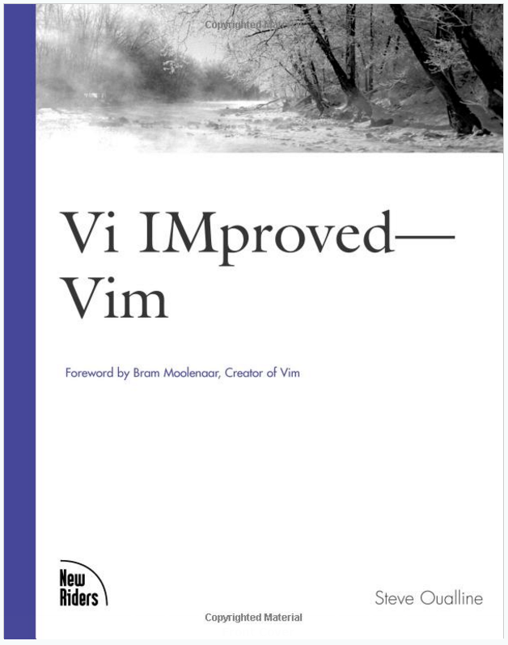

# Bug on page 134 of Vi IMproved—Vim by Steve Oualline

There is a bug on page 134 of **Vi IMproved—Vim** by Steve Oualline ([ISBN 0-7357-1001-5](http://www.amazon.com/Vi-iMproved-VIM-Steve-Oualline/dp/0735710015/ref=sr_1_1?ie=UTF8&qid=1489959577&sr=8-1&keywords=0735710015)) when the instructions listed are tried on VIM - Vi IMproved 7.4 installed from the Vim package version 2:7.4.1689-3ubuntu1.2.

## The Bug

The DateInsert() autocommand doesn't get called when you do a

:write

## The Fix

To get the autocommand to execute you must execute a partial write with:

:1 write!

## Alternative Fix

Define the autocommand with:

:autocmd FileWritePre,BufWritePre * :call DateInsert()

DateInsert() is defined as:

:function DateInsert()

:  $read !date

:endfunction

## Details

From [9]:

FileWritePre

Before writing to a file, **when not writing the whole buffer**. Use the '[ and '] marks for the range of lines.

BufWrite or BufWritePre

Before **writing the whole buffer** to a file.

Because of this, the only way to get FileWritePre to fire is to use the range form of write:

:[range]w[rite][!] [++opt]

​      Write the specified lines to the current file. This

​      is unusual, because the file will not contain all

​      lines in the buffer.

## Debugging

In the autocmd doc it suggests setting verbose to 9 [7]:

While testing autocommands, you might find the 'verbose' option to be useful:

  :set verbose=9

This setting makes Vim echo the autocommands as it executes them.

A verbose level of 9 enables:

'verbose' 'vbs'    number  (default 0)

​      global

​      {not in Vi, although some versions have a boolean

​      verbose option}

  When bigger than zero, Vim will give messages about what it is doing.

  Currently, these messages are given:

  \>= 1  When the viminfo file is read or written.

  \>= 2  When a file is ":source"'ed.

  \>= 5  Every searched tags file and include file.

  \>= 8  Files for which a group of autocommands is executed.

 **>= 9  Every executed autocommand.**

  \>= 12  Every executed function.

  \>= 13  When an exception is thrown, caught, finished, or discarded.

  \>= 14  Anything pending in a ":finally" clause.

  \>= 15  Every executed Ex command (truncated at 200 characters).

  This option can also be set with the **"-V" argument.** See |-V|.

  This option is also set by the |:verbose| command.

  When the 'verbosefile' option is set then the verbose messages are not

  displayed.

The -V argument is defined as:

 -V[N][fname]    Be verbose [level N] [log messages to fname]

Here's an example of calling vim with the -V argument:

vim -V9myVim.log

level [N] is 9

[fname] is myVim.log

## References

1.[ Is there a “vim runtime log”?](http://stackoverflow.com/questions/3025615/is-there-a-vim-runtime-log)

2.[ Debugging Vim Scripts](http://web.archive.org/web/20090323034339/http)

3.[ Event-driven scripting and automation](http://www.ibm.com/developerworks/library/l-vim-script-5/)

4.[ Vi iMproved (VIM) by Steve Oualline](http://www.amazon.com/Vi-iMproved-VIM-Steve-Oualline/dp/0735710015)

5.[ FileWritePre](http://vimdoc.sourceforge.net/htmldoc/autocmd.html#FileWritePre)

6.[ Vi IMproved—Vim Errata](http://ptgmedia.pearsoncmg.com/images/0735710015/errata/0735710015.pdf)

7.[ autocmd documentation](http://vimdoc.sourceforge.net/htmldoc/autocmd.html#:autocmd)

8.[ verbose documentation](http://vimdoc.sourceforge.net/htmldoc/options.html#'verbose')

9.[ FileWritePre and BufWritePre documentation](http://vimdoc.sourceforge.net/htmldoc/autocmd.html#FileWritePre)

10.[ write documentation](http://vimdoc.sourceforge.net/htmldoc/editing.html#:write)