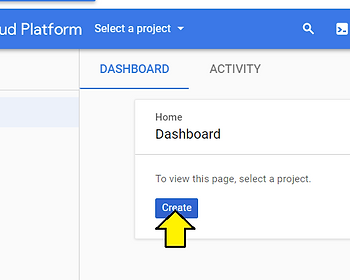
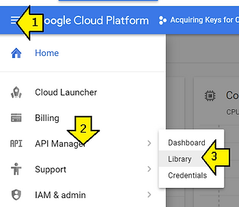

# Build Chromium OS for BOARD=arm-generic

This post lists the steps to get the Chromium OS source code, build it and try it out. It is being provided as-is; there are a few issues: programming the image on the USB key and updating the build's keys. My initial debug suggests the USB key programming issue is related to using a VM. If the user tries the instructions on a box running Linux directly this issue may not exist.

This work was done on a [ThinkPad T460 model 20FNCTO1WW](http://www.zachpfeffer.com/single-post/2017/01/28/New-T460-System-Information) running Window's 7 Pro SP1. The source code was downloaded and built using Ubuntu 14.04.5 running in Oracle VM VirtualBox Version 5.1.30 r118389 (Qt5.6.2).

A Samsung XE303C12 was used to boot the custom image. Model Code: XE303C12-A01US from Oct. 2012. It may be Model "Samsung Chromebook" listed at [link](http://www.chromium.org/chromium-os/developer-information-for-chrome-os-devices). Release: October 14, 2012. Developer info for this Chromebook is located here: [link](http://www.chromium.org/a/chromium.org/dev/chromium-os/developer-information-for-chrome-os-devices/samsung-arm-chromebook).

For this model enter Recovery Mode by holding down ESC and Refresh (F3) and poke the Power button.

The official guide is at: [https://www.chromium.org/chromium-os/developer-guide](http://www.chromium.org/chromium-os/developer-guide). These steps and commands are the steps and commands I used while following the official guide.

1\. Download http://releases.ubuntu.com/14.04/ubuntu-14.04.5-desktop-amd64.iso.

2\. Create a Virtual Machine with 8 GB RAM and 64 GB diskspace and install the ISO you downloaded. Step-by-step instructions can be found [here](http://www.zachpfeffer.com/single-post/2017/02/17/Installing-the-64-bit-PC-AMD64-desktop-image-of-Ubuntu-16042-LTS-Xenial-Xerus-in-Oracle-VM-VirtualBox-5114-running-in-Windows-7-Professional-Service-Pack-1-CurrentBuild-7601-on-a-ThinkPad-T460-model-20FNCTO1WW-with-an-IntelR-CoreTM-i7-6600U-CPU) (use the 14.04 file downloaded in the previous step instead of the Ubuntu 16.04.2 LTS listed in the instructions). I named mine: ubuntu-14.04.5-desktop-amd64-8GB\_RAM-64GB\_Disk.

3\. Enable copy and paste from the Window's box to the VM. Follow these instructions (or these [instructions](http://www.zachpfeffer.com/single-post/2017/02/18/Enabling-copying-and-pasting-text-between-an-Ubuntu-16042-guest-running-in-Oracle-VM-VirtualBox-5114-running-on-Windows-7-and-the-Windows-7-host) if you'd like screen shots):

3.a. In the Virtual Machine's window click Devices > Insert Guest Additions CD image..., click Run and enter your password

3.b. Reboot the Virtual Machine: click the gear in the upper right corner of the Ubuntu desktop, select Shut Down..., Click Restart.

3.c. When Ubuntu boots back up, in the Virtual Machine's window click Devices > Shared Clipboard > Bidirectional.

4\. Log into the Virtual Machine and run Terminal.

5\. Install git and curl by typing this into the terminal you started:

```
sudo apt-get install git-core gitk git-gui curl lvm2 thin-provisioning-tools python-pkg-resources python-virtualenv
```

6\. Install depot\_tools by typing this into the terminal you started:

```
cd $HOME
mkdir tools
cd tools
git clone https://chromium.googlesource.com/chromium/tools/depot_tools.git
```

The full instructions to install depot\_tools can be found [here](http://commondatastorage.googleapis.com/chrome-infra-docs/flat/depot_tools/docs/html/depot_tools_tutorial.html#_setting_up).

7\. Update the PATH variable run:

```
pico ~/.bashrc 
```

7.a. Add this to the end of the file and then type control-X to exit and Y to save

```
PATH=$PATH:$HOME/tools/depot_tools
```

7.b. Open a new terminal and type the following command:

```
PATH=$PATH:$HOME/tools/depot_tools
```

If you see the following, you've updated the path correctly.

```
/home/your_user_name/tools/depot_tools/repo
```

8\. "Tweak your sudoers configuration"

8.a. Open the file where 'sudo' options can be set:

```
sudo EDITOR=pico visudo -f /etc/sudoers.d/relax_requirements
```

```
Defaults !tty_tickets
Defaults timestamp_timeout=180
```

If you see:

```
What now?
```

try again by pressing 'e' or press 'x' to exit.

The full instructions to "tweak your sudoers configuration" can be found [here](http://www.chromium.org/chromium-os/tips-and-tricks-for-chromium-os-developers#TOC-Making-sudo-a-little-more-permissive).

More Info on what tty\_tickets and timestamp\_timeout do:

-   **!tty\_tickets turns off the tty\_tickets option. Turning the tty\_tickets option off allows you to run sudo commands without a password when you open a new Terminal (official doc is** [**here**](http://www.sudo.ws/man/sudoers.man.html#SUDOERS_OPTIONS)**).**
    
-   **timestamp\_timeout is the number of minutes before sudo will ask for a password again (again the official doc is** [**here**](http://www.sudo.ws/man/sudoers.man.html#SUDOERS_OPTIONS)**).**
    

9\. Configure git

```
git config --global user.email "you@example.com"
git config --global user.name "Your Name"
```

10\. Double-check that you are running a 64-bit architecture by typing:

```
uname -m
```

You should see x86\_64 (passing -m or --machine to uname prints the machine hardware name).

11\. Make sources world readable

11.a. Update umask in ~/.bashrc, run:

```
pico ~/.bashrc 
```

11.b. Add this to the end of the file and then type control-X to exit and Y to save

```
umask 022
```

11.c. To test it, open a new terminal and type:

```
touch ~/foo
ls -la ~/foo
rm ~/foo
```

If you see something like this, with -rw-r--r-- you have ensured that sources will be word readable.

```
-rw-r--r-- 1 user group 0 2012-08-30 23:09 /home/user/foo
```

Passing 022 ensures that files can be created world readable. The 022 gets expanded into 000 010 010. The first 000 says that files created by the users can be created with **rwx** permissions. The second and third values of 010 say that people in the same group and people in other groups (global) can create files that have **r** and **x** permissions, but not **w** permissions. The 1 masks the **w** permission. The 0's allow the **r** and **x** permissions.

12\. Get the Source Code

12.b. Type the following to create a directory for the source code

```
mkdir -p ${HOME}/chromiumos
```

12.c. Use repo to get the source code. The sync -j4 command actually gets the source code. It can take a long time depending on how fast your network connection is.

```
cd ${HOME}/chromiumos
repo init -u https://chromium.googlesource.com/chromiumos/manifest.git --repo-url https://chromium.googlesource.com/external/repo.git
repo sync -j4
```

13\. Add Google API Keys

This step is required if you need access to: signing in, translating web pages, geolocation, etc.

The original instructions are [here](http://www.chromium.org/developers/how-tos/api-keys). On the site it lists:

_If you build Chromium and Chromium OS yourself setting up API keys is mandatory so that it will allow user login on Chromebooks!_

13.a. Subscribe to chromium-dev at this link. Click on **Join group to post**. Decide if you want to get emails and how frequently, then click **Join this group**.


13.b. While logged in with the account you joined chromium-dev with, go to: [https://cloud.google.com/console](http://cloud.google.com/console).

13.c. Create a project by clicking **Home**.


13.d. Then click **Create**. Name you project: **Acquiring Keys for Chromium** and click **Create** again.




13.e. Open the API Manager > Library



13.f. Search for each of these on "Enable API" button at the top, read and agree to the Terms of Service that is shown, check the "I have read and agree to <API name> Terms of Service" checkbox and click Accept. A ✔ means I was able to enable it or it was enabled when I when to enable it. An ✘ means I could not enable it.

-   Calendar API ✔
    
-   Contacts API ✔
    
-   Drive API (Optional, enable this for Files.app on Chrome OS and SyncFileSystem API) ✔
    
-   Chrome Remote Desktop API ✔
    
-   Chrome Spelling API ✔
    
-   Chrome Suggest API ✔
    
-   Chrome Sync API ✔
    
-   Chrome Translate Element ✔
    
-   Chrome Web Store API ✔
    
-   Chrome OS Hardware ID API ✘
    
-   Optional, Chrome OS
    
-   Can't find
    
-   Device Registration API ✘
    
-   Optional, Chrome OS
    
-   **Can't find**
    
-   Google Cloud DNS API ✔
    
-   This exists but requires a billing account. Click **CREATE BILLING ACCOUNT** on the popup, accept the Terms and conditions (as of 1/3/2017 Google was offering $300.00 in credit). After clicking through it will return you back to the Enable screen so you can click **Enable**. Every time I click the back arrow by API Library I was returned to the Google Cloud DNS API screen and had to click APIs & services to get back to the search screen. See picture below.
    
-   Google Cloud Storage ✔
    
-   **Had already been Enabled**
    
-   Google Cloud Storage JSON API ✔
    
-   **Had already been Enabled**
    
-   Google Maps Geolocation API ✔
    
-   Also requires enabling billing but is free to use; you can skip this one, in which case geolocation features of Chrome will not work)
    
-   Google Maps Time Zone API ✔
    
-   Google Now For Chrome API ✔
    
-   Optional, enabled to show Google Now cards
    
-   Google+ API ✔
    
-   Nearby Messages API ✔
    
-   Safe Browsing API ✔
    
-   Also enabled Legacy version ✔
    
-   Speech API ✔
    
-   See the "Speech API" box at the top of the page)
    
-   Also enabled Google Cloud Speech API. I'm not sure if this was required. ✔
    

This list might be out of date; try searching for APIs starting with "Chrome" or having "for Chrome" in the name if you're working through this HOWTO after Jan 3.

13.f.i. Searching "Chrome" on Jan 3rd 2018 listed these 7 which were already included above:

-   Google Now For Chrome API ✔
    
-   Chrome Web Store API ✔
    
-   Chrome Sync API ✔
    
-   Chrome Remote Desktop API ✔
    
-   Chrome Spelling API ✔
    
-   Chrome Suggest API ✔
    
-   Chrome Translate Element ✔
    

13.f.ii. Searching "for Chrome" on Jan 3rd 2018 listed this result which is already included above:

-   Google Now For Chrome API ✔
    

13.f.iii. The text from this instructions has largely been used verbatum from the original instructions.

13.f.iv. Google Cloud DNS Bug


13.g. Go to the **Credentials** sub tab under the **API Manager**.

13.h. Click the "**Create credentials**" button then click on the **OAuth client ID** item in the drop-down list.


13.h.i. Click on the "Configure consent screen" button. Fill in the "Product name" (name it anything you want) and other details if you have available then click on "Save" at the bottom.

13.h.ii. Return to the Credentials tab (this may have popped up, if so click **Create credentials** then **OAuth client ID**) and click the "Add credentials" button again, then select "OAuth 2.0 client ID" from the drop-down list.


13.h.iii. In the "Application type" section check the "Other" option and give it a name in the "Name" text box, then click "Create." I used the name "Custom Chromium". Save the client ID and client secret on your private dev box.


13.h.iv. Click the "Create credentials" button again on the same page.

-   In the pop-over window that shows up click the "API key" button.
    
-   A pop-over should show up giving you the API key. Copy and paste it in a text file to save it, although you can access it later as well.
    
-   Click OK to dismiss this.
    


Your use these keys later in the process.

14\. Build Chromium OS

14.a. Download and install the chroot

```
cd ~/chromiumos
cros_sdk
```

You may see a pop up:


You'll know it was successful if your dropped into the chroot terminal like this:\

```
(cr) ((2f76e29...)) pfefferz@z ~/trunk/src/scripts $ 
```

You're investment in vim will be rewarded - its the only editor that works \_in\_ the chroot.

14.b. Select a board

Type this into the chroot:

```
export BOARD=arm-generic
```

Type this into the chroot:

```
./setup_board --board=${BOARD}
```

14.d. Set the chronos user password. The script does not ask for confirmation.

Type this into the chroot:

```
./set_shared_user_password.sh
```

This password allows you to log into Chromium OS using username: chronos

14.e. Build the packages for your board, i.e. make all

Type this into the chroot:

```
./build_packages --board=${BOARD}
```

This command took 46 minutes on my machine.

15\. Build the disk image for Chrome OS

Type this into the chroot:

```
./build_image --board=${BOARD} --noenable_rootfs_verification base
```

This builds a image that is close to the normal Chrome OS image. **\--noenable\_rootfs\_verification** turns off verified boot. This allows the root filesystem to be modified.

Note: a reader of the blog suggested:

```
./build_image --board=arm-generic dev test base --adjust_part='STATE:+3G' --noenable_rootfs_verification
```

In his words, "The +3G expands the stateful partition by an additional 3 GB. The default is 2 GB so this will take it to 5 GB. You can of course expand this larger if you have a larger disk/eMMC. I just find that 2GB is really not enough for most users"

Replace **base** with **test** to build a test image. The password for chronos will be test0000. The test image accepts incoming ssh connections.

Replace **base** with **dev** to build a developer image. The developer image has additional developer packages.

This command took about 20 min.

16\. Add the keys to the build. Specify the keys in the args.gn file by running (this wasn't working):

```
gn args out/your_out_dir_here
```

```
google_api_key = "your_api_key"
google_default_client_id = "your_client_id"
google_default_client_secret = "your_client_secret"
```

17\. Copy the image to a USB key

17.a. Insert a USB key

17.b. Select the USB key in VirtualBox


If you see an error and you're running Windows and you have installed USBPcap as part of a Wireshark installation, uninstall USBPcap, reboot Windows and the virtual machine and try again. If you need additional info about this change take a look at: [https://www.zachpfeffer.com/single-post/A-fix-for-a-USB-drive-or-any-USB-device-not-working-in-VirtualBox](http://www.zachpfeffer.com/single-post/A-fix-for-a-USB-drive-or-any-USB-device-not-working-in-VirtualBox).  

17.c. Copy the image to a USB key (still debugging this)

After building the image, the build\_image script lists how to write it to a USB key


Type this (or the line build\_image listed) into the chroot and press return:

```
cros flash usb:// ../build/images/arm-generic/R65-10273.0.2018_01_04_0923-a1/chromiumos_base_image.bin
```

If you see this error your USB drive may still work. I'm investigating it.

```
796917760 bytes (797 MB, 760 MiB) copied, 139.487 s, 5.7 MB/s
dd: error writing '/dev/sdb': Input/output error
191+0 records in
190+0 records out
796917760 bytes (797 MB, 760 MiB) copied, 241.595 s, 3.3 MB/s
191+0 records in
190+0 records out
796917760 bytes (797 MB, 760 MiB) copied, 241.595 s, 3.3 MB/s


14:09:00: ERROR: Oops. Something went wrong.
14:09:00: ERROR: cros flash failed before completing.
14:09:00: ERROR: : return code: 1; command: sudo 'CROS_CACHEDIR=/mnt/host/source/.cache' -- dd 'if=../build/images/arm-generic/R65-10273.0.2018_01_04_0923-a1/chromiumos_base_image.bin' 'of=/dev/sdb' 'bs=4M' 'iflag=fullblock' 'oflag=sync'
cmd=['sudo', 'CROS_CACHEDIR=/mnt/host/source/.cache', '--', 'dd', 'if=../build/images/arm-generic/R65-10273.0.2018_01_04_0923-a1/chromiumos_base_image.bin', 'of=/dev/sdb', 'bs=4M', 'iflag=fullblock', 'oflag=sync']
Traceback (most recent call last):
  File "/mnt/host/source/chromite/lib/parallel.py", line 603, in TaskRunner
    task(*x, **task_kwargs)
  File "/mnt/host/source/chromite/lib/operation.py", line 176, in CaptureOutputInBackground
    func(*args, **kwargs)
  File "/mnt/host/source/chromite/lib/cros_build_lib.py", line 329, in SudoRunCommand
    return RunCommand(sudo_cmd, **kwargs)
  File "/mnt/host/source/chromite/lib/cros_build_lib.py", line 654, in RunCommand
    raise RunCommandError(msg, cmd_result)
RunCommandError: return code: 1; command: sudo 'CROS_CACHEDIR=/mnt/host/source/.cache' -- dd 'if=../build/images/arm-generic/R65-10273.0.2018_01_04_0923-a1/chromiumos_base_image.bin' 'of=/dev/sdb' 'bs=4M' 'iflag=fullblock' 'oflag=sync'
cmd=['sudo', 'CROS_CACHEDIR=/mnt/host/source/.cache', '--', 'dd', 'if=../build/images/arm-generic/R65-10273.0.2018_01_04_0923-a1/chromiumos_base_image.bin', 'of=/dev/sdb', 'bs=4M', 'iflag=fullblock', 'oflag=sync']
```

And when you type dmesg in the chroot you see:

```
[179567.845001] usb 1-1: USB disconnect, device number 3
[179568.426716] usb 1-1: new full-speed USB device number 4 using ohci-pci
[179568.680345] usb 1-1: New USB device found, idVendor=80ee, idProduct=0021
[179568.680348] usb 1-1: New USB device strings: Mfr=1, Product=3, SerialNumber=0
[179568.680350] usb 1-1: Product: USB Tablet
[179568.680351] usb 1-1: Manufacturer: VirtualBox
[179568.695298] input: VirtualBox USB Tablet as /devices/pci0000:00/0000:00:06.0/usb1/1-1/1-1:1.0/0003:80EE:0021.0003/input/input9
[179568.808250] hid-generic 0003:80EE:0021.0003: input,hidraw0: USB HID v1.10 Mouse [VirtualBox USB Tablet] on usb-0000:00:06.0-1/input0
[179568.854927] e1000: eth0 NIC Link is Down
[179572.863574] e1000: eth0 NIC Link is Up 1000 Mbps Full Duplex, Flow Control: RX
[179595.378716] usb 1-2: new full-speed USB device number 5 using ohci-pci
[179595.857603] usb 1-2: New USB device found, idVendor=0781, idProduct=5575
[179595.857607] usb 1-2: New USB device strings: Mfr=1, Product=2, SerialNumber=3
[179595.857609] usb 1-2: Product: Cruzer Glide
[179595.857610] usb 1-2: Manufacturer: SanDisk
[179595.857611] usb 1-2: SerialNumber: 4C531001480916100193
[179595.908167] usb-storage 1-2:1.0: USB Mass Storage device detected
[179595.910679] scsi host3: usb-storage 1-2:1.0
[179595.910745] usbcore: registered new interface driver usb-storage
[179595.913213] usbcore: registered new interface driver uas
[179596.933367] scsi 3:0:0:0: Direct-Access     SanDisk  Cruzer Glide     1.00 PQ: 0 ANSI: 6
[179596.936611] sd 3:0:0:0: Attached scsi generic sg2 type 0
[179596.951234] sd 3:0:0:0: [sdb] 30629376 512-byte logical blocks: (15.7 GB/14.6 GiB)
[179596.966896] sd 3:0:0:0: [sdb] Write Protect is off
[179596.966899] sd 3:0:0:0: [sdb] Mode Sense: 43 00 00 00
[179596.982474] sd 3:0:0:0: [sdb] Write cache: disabled, read cache: enabled, doesn't support DPO or FUA
[179597.064609]  sdb: sdb1
[179597.129182] sd 3:0:0:0: [sdb] Attached SCSI removable disk
[179599.279093] systemd-hostnamed[22645]: Warning: nss-myhostname is not installed. Changing the local hostname might make it unresolveable. Please install nss-myhostname!
[179617.171031] usb 1-2: USB disconnect, device number 5
[179617.201682] FAT-fs (sdb1): unable to read boot sector to mark fs as dirty
[180288.379458] usb 1-2: new full-speed USB device number 6 using ohci-pci
[180288.863904] usb 1-2: New USB device found, idVendor=0781, idProduct=5575
[180288.863907] usb 1-2: New USB device strings: Mfr=1, Product=2, SerialNumber=3
[180288.863909] usb 1-2: Product: Cruzer Glide
[180288.863910] usb 1-2: Manufacturer: SanDisk
[180288.863911] usb 1-2: SerialNumber: 4C531001480916100193
[180288.897377] usb-storage 1-2:1.0: USB Mass Storage device detected
[180288.897444] scsi host4: usb-storage 1-2:1.0
[180289.919444] scsi 4:0:0:0: Direct-Access     SanDisk  Cruzer Glide     1.00 PQ: 0 ANSI: 6
[180289.922450] sd 4:0:0:0: Attached scsi generic sg2 type 0
[180289.937407] sd 4:0:0:0: [sdb] 30629376 512-byte logical blocks: (15.7 GB/14.6 GiB)
[180289.952786] sd 4:0:0:0: [sdb] Write Protect is off
[180289.952789] sd 4:0:0:0: [sdb] Mode Sense: 43 00 00 00
[180289.968249] sd 4:0:0:0: [sdb] Write cache: disabled, read cache: enabled, doesn't support DPO or FUA
[180290.051975]  sdb: sdb1
[180290.118940] sd 4:0:0:0: [sdb] Attached SCSI removable disk
[180291.993587] FAT-fs (sdb1): Volume was not properly unmounted. Some data may be corrupt. Please run fsck.
[180292.101349] systemd-hostnamed[22685]: Warning: nss-myhostname is not installed. Changing the local hostname might make it unresolveable. Please install nss-myhostname!
[180530.409816] usb 1-2: USB disconnect, device number 6
[180629.264433] usb 1-2: new full-speed USB device number 7 using ohci-pci
[180629.752987] usb 1-2: New USB device found, idVendor=0781, idProduct=5575
[180629.753007] usb 1-2: New USB device strings: Mfr=1, Product=2, SerialNumber=3
[180629.753009] usb 1-2: Product: Cruzer Glide
[180629.753023] usb 1-2: Manufacturer: SanDisk
[180629.753024] usb 1-2: SerialNumber: 4C531001480916100193
[180629.786613] usb-storage 1-2:1.0: USB Mass Storage device detected
[180629.786671] scsi host5: usb-storage 1-2:1.0
[180630.808172] scsi 5:0:0:0: Direct-Access     SanDisk  Cruzer Glide     1.00 PQ: 0 ANSI: 6
[180630.811305] sd 5:0:0:0: Attached scsi generic sg2 type 0
[180630.823088] sd 5:0:0:0: [sdb] 30629376 512-byte logical blocks: (15.7 GB/14.6 GiB)
[180630.838865] sd 5:0:0:0: [sdb] Write Protect is off
[180630.838869] sd 5:0:0:0: [sdb] Mode Sense: 43 00 00 00
[180630.853936] sd 5:0:0:0: [sdb] Write cache: disabled, read cache: enabled, doesn't support DPO or FUA
[180630.936410]  sdb: sdb1
[180631.000942] sd 5:0:0:0: [sdb] Attached SCSI removable disk
[180844.509236] usb 1-3: new full-speed USB device number 8 using ohci-pci
[180844.978803] usb 1-3: New USB device found, idVendor=04f2, idProduct=b52c
[180844.978809] usb 1-3: New USB device strings: Mfr=3, Product=1, SerialNumber=2
[180844.978812] usb 1-3: Product: Integrated Camera
[180844.978814] usb 1-3: Manufacturer: Chicony Electronics Co.,Ltd.
[180844.978816] usb 1-3: SerialNumber: 0001
[180845.058036] media: Linux media interface: v0.10
[180845.076793] Linux video capture interface: v2.00
[180845.138218] uvcvideo: Found UVC 1.00 device Integrated Camera (04f2:b52c)
[180845.158307] uvcvideo: Failed to register entity for entity 6
[180845.158309] uvcvideo: Failed to register entites (-22).
[180845.158361] input: Integrated Camera as /devices/pci0000:00/0000:00:06.0/usb1/1-3/1-3:1.0/input/input10
[180845.158623] usbcore: registered new interface driver uvcvideo
[180845.158624] USB Video Class driver (1.1.1)
[181110.967745] usb 1-3: USB disconnect, device number 8
[183410.770115] usb 1-2: reset full-speed USB device number 7 using ohci-pci
[183441.718860] usb 1-2: reset full-speed USB device number 7 using ohci-pci
[183452.601018] usb 1-2: reset full-speed USB device number 7 using ohci-pci
[183469.516653] usb 1-2: reset full-speed USB device number 7 using ohci-pci
[183470.464577] usb 1-2: reset full-speed USB device number 7 using ohci-pci
[183481.363411] usb 1-2: reset full-speed USB device number 7 using ohci-pci
[183481.859337] sd 5:0:0:0: Device offlined - not ready after error recovery
[183481.859348] sd 5:0:0:0: [sdb] tag#0 FAILED Result: hostbyte=DID_ABORT driverbyte=DRIVER_OK
[183481.859351] sd 5:0:0:0: [sdb] tag#0 CDB: Write(10) 2a 00 00 17 d8 60 00 00 f0 00
[183481.859354] blk_update_request: I/O error, dev sdb, sector 1562720
[183481.859357] Buffer I/O error on dev sdb, logical block 195340, lost async page write
[183481.859366] Buffer I/O error on dev sdb, logical block 195341, lost async page write
[183481.859368] Buffer I/O error on dev sdb, logical block 195342, lost async page write
[183481.859370] Buffer I/O error on dev sdb, logical block 195343, lost async page write
[183481.859372] Buffer I/O error on dev sdb, logical block 195344, lost async page write
[183481.859374] Buffer I/O error on dev sdb, logical block 195345, lost async page write
[183481.859375] Buffer I/O error on dev sdb, logical block 195346, lost async page write
[183481.859377] Buffer I/O error on dev sdb, logical block 195347, lost async page write
[183481.859379] Buffer I/O error on dev sdb, logical block 195348, lost async page write
[183481.859380] Buffer I/O error on dev sdb, logical block 195349, lost async page write
[183481.859402] sd 5:0:0:0: rejecting I/O to offline device
[183481.859404] sd 5:0:0:0: killing request
[183481.859406] sd 5:0:0:0: rejecting I/O to offline device
[183481.859408] sd 5:0:0:0: [sdb] killing request
[183481.859410] sd 5:0:0:0: rejecting I/O to offline device
[183481.859432] sd 5:0:0:0: rejecting I/O to offline device
[183481.859450] sd 5:0:0:0: rejecting I/O to offline device
[183481.859467] sd 5:0:0:0: rejecting I/O to offline device
[183481.859485] sd 5:0:0:0: rejecting I/O to offline device
[183481.859502] sd 5:0:0:0: rejecting I/O to offline device
[183481.859516] sd 5:0:0:0: rejecting I/O to offline device
[183481.859538] sd 5:0:0:0: [sdb] FAILED Result: hostbyte=DID_NO_CONNECT driverbyte=DRIVER_OK
[183481.859541] sd 5:0:0:0: [sdb] CDB: Write(10) 2a 00 00 17 d9 50 00 00 f0 00
[183481.859542] blk_update_request: I/O error, dev sdb, sector 1562960
```

18\. Look at the disk image (this wasn't working)

Type this into the chroot:

```
./mount_gpt_image.sh --board=${BOARD} --safe -f $(./get_latest_image.sh --board=${BOARD})
```

Then type this:

```
./mount_gpt_image.sh --board=${BOARD} -u 
```

19\. Try out the build.

19.a. Enter recovery mode

Hold down ESC and Refresh (F3, the circle with a arrow) and poke the Power. Follow the steps listed at: