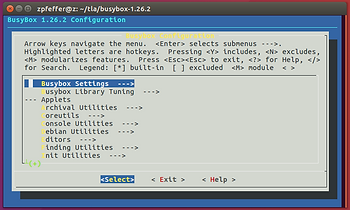
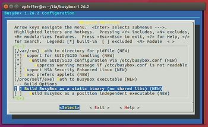
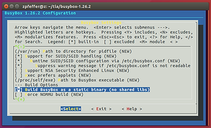
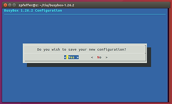

# Build the Linux Kernel and Busybox for ARM and run them on QEMU


This post is a condensed version of Mitchel Humphery's excellent post @ [link](http://mgalgs.github.io/2015/05/16/how-to-build-a-custom-linux-kernel-for-qemu-2015-edition.html) for ARM. Like Mitchel's post, this post gives step-by-step instructions for building a minimal custom Linux kernel, creating a busybox based userland and booting it on an emulator ([QEMU)](https://www.qemu.org/). This post builds the versatile\_defconfig.

**<u><span>Environment</span></u>**

-   [T460](http://www.zachpfeffer.com/single-post/2017/01/28/New-T460-System-Information)
    
-   Oracle VM VirtualBox Version 5.1.30 r118389 (Qt5.6.2) running on Windows 7 SP1
    
-   VM's configured with 4 GB of RAM and a 64 GB disk running Ubuntu 16.04.2.
    

If you need help setting up this environment click [here](http://www.zachpfeffer.com/single-post/2017/02/15/Installing-the-64-bit-PC-AMD64-desktop-image-of-Ubuntu-16041-LTS-Xenial-Xerus-in-Oracle-VM-VirtualBox-5114-running-in-Windows-7-Professional-Service-Pack-1-CurrentBuild-7601-on-a-ThinkPad-T460-model-20FNCTO1WW-with-an-IntelR-CoreTM-i7-6600U-CPU) (just install 16.04.02 instead of 16.04.01).

**<u><span>Steps</span></u>**

1\. Open a terminal

2\. Retrieve new lists of packages

```
sudo apt-get update
```

You'll see something like:

```
Ign:1 http://dl.google.com/linux/chrome/deb stable InRelease
Get:2 http://security.ubuntu.com/ubuntu xenial-security InRelease [107 kB]
Hit:3 http://us.archive.ubuntu.com/ubuntu xenial InRelease                    
Get:4 http://us.archive.ubuntu.com/ubuntu xenial-updates InRelease [109 kB]    
Hit:5 http://dl.google.com/linux/chrome/deb stable Release                     
Get:7 http://us.archive.ubuntu.com/ubuntu xenial-backports InRelease [107 kB]  
Get:8 http://security.ubuntu.com/ubuntu xenial-security/main amd64 DEP-11 Metadata [67.7 kB]
Get:9 http://security.ubuntu.com/ubuntu xenial-security/main DEP-11 64x64 Icons [68.0 kB]
Get:10 http://us.archive.ubuntu.com/ubuntu xenial-updates/main amd64 DEP-11 Metadata [320 kB]
Get:11 http://security.ubuntu.com/ubuntu xenial-security/universe amd64 DEP-11 Metadata [109 kB]
Get:12 http://security.ubuntu.com/ubuntu xenial-security/universe DEP-11 64x64 Icons [158 kB]
Get:13 http://us.archive.ubuntu.com/ubuntu xenial-updates/main DEP-11 64x64 Icons [227 kB]
Get:14 http://us.archive.ubuntu.com/ubuntu xenial-updates/universe amd64 DEP-11 Metadata [248 kB]
Get:15 http://us.archive.ubuntu.com/ubuntu xenial-updates/universe DEP-11 64x64 Icons [341 kB]
Get:16 http://us.archive.ubuntu.com/ubuntu xenial-updates/multiverse amd64 DEP-11 Metadata [5,960 B]
Get:17 http://us.archive.ubuntu.com/ubuntu xenial-updates/multiverse DEP-11 64x64 Icons [14.3 kB]
Get:18 http://us.archive.ubuntu.com/ubuntu xenial-backports/main amd64 DEP-11 Metadata [3,324 B]
Get:19 http://us.archive.ubuntu.com/ubuntu xenial-backports/universe amd64 DEP-11 Metadata [5,104 B]
Fetched 1,892 kB in 2s (942 kB/s)                                             
AppStream cache update completed, but some metadata was ignored due to errors.
Reading package lists... Done
```

3\. Get the required packages:

```
sudo apt-get install curl libncurses5-dev qemu-system-arm gcc-arm-linux-gnueabi
```

You'll see something like:

```
Reading package lists... Done
Building dependency tree       
Reading state information... Done
libncurses5-dev is already the newest version (6.0+20160213-1ubuntu1).
curl is already the newest version (7.47.0-1ubuntu2.11).
Suggested packages:
  samba vde2
The following NEW packages will be installed:
  qemu-system-arm
0 upgraded, 1 newly installed, 0 to remove and 125 not upgraded.
Need to get 4,116 kB of archives.
After this operation, 17.7 MB of additional disk space will be used.
Do you want to continue? [Y/n] Y
Get:1 http://us.archive.ubuntu.com/ubuntu xenial-updates/main amd64 qemu-system-arm amd64 1:2.5+dfsg-5ubuntu10.33 [4,116 kB]
Fetched 4,116 kB in 5s (814 kB/s)            
Selecting previously unselected package qemu-system-arm.
(Reading database ... 195551 files and directories currently installed.)
Preparing to unpack .../qemu-system-arm_1%3a2.5+dfsg-5ubuntu10.33_amd64.deb ...
Unpacking qemu-system-arm (1:2.5+dfsg-5ubuntu10.33) ...
Processing triggers for man-db (2.7.5-1) ...
Setting up qemu-system-arm (1:2.5+dfsg-5ubuntu10.33) ...
```

...or:

```
Reading package lists... Done
Building dependency tree       
Reading state information... Done
libncurses5-dev is already the newest version (6.0+20160213-1ubuntu1).
curl is already the newest version (7.47.0-1ubuntu2.11).
qemu-system-arm is already the newest version (1:2.5+dfsg-5ubuntu10.33).
The following additional packages will be installed:
  binutils binutils-arm-linux-gnueabi cpp-5-arm-linux-gnueabi
  cpp-arm-linux-gnueabi gcc-5-arm-linux-gnueabi gcc-5-arm-linux-gnueabi-base
  gcc-5-cross-base libasan2-armel-cross libatomic1-armel-cross
  libc6-armel-cross libc6-dev-armel-cross libgcc-5-dev-armel-cross
  libgcc1-armel-cross libgomp1-armel-cross libstdc++6-armel-cross
  libubsan0-armel-cross linux-libc-dev-armel-cross
Suggested packages:
  binutils-doc gcc-5-locales cpp-doc gcc-5-multilib-arm-linux-gnueabi
  gcc-5-doc libgcc1-dbg-armel-cross libgomp1-dbg-armel-cross
  libitm1-dbg-armel-cross libatomic1-dbg-armel-cross libasan2-dbg-armel-cross
  liblsan0-dbg-armel-cross libtsan0-dbg-armel-cross libubsan0-dbg-armel-cross
  libcilkrts5-dbg-armel-cross libmpx0-dbg-armel-cross
  libquadmath0-dbg-armel-cross gdb-arm-linux-gnueabi gcc-doc
The following packages will be REMOVED:
  gcc-multilib
The following NEW packages will be installed:
  binutils-arm-linux-gnueabi cpp-5-arm-linux-gnueabi cpp-arm-linux-gnueabi
  gcc-5-arm-linux-gnueabi gcc-5-arm-linux-gnueabi-base gcc-5-cross-base
  gcc-arm-linux-gnueabi libasan2-armel-cross libatomic1-armel-cross
  libc6-armel-cross libc6-dev-armel-cross libgcc-5-dev-armel-cross
  libgcc1-armel-cross libgomp1-armel-cross libstdc++6-armel-cross
  libubsan0-armel-cross linux-libc-dev-armel-cross
The following packages will be upgraded:
  binutils
1 upgraded, 17 newly installed, 1 to remove and 124 not upgraded.
Need to get 21.5 MB of archives.
After this operation, 62.0 MB of additional disk space will be used.
Do you want to continue? [Y/n] 
Get:1 http://us.archive.ubuntu.com/ubuntu xenial-updates/main amd64 binutils amd64 2.26.1-1ubuntu1~16.04.7 [2,309 kB]
Get:2 http://us.archive.ubuntu.com/ubuntu xenial-updates/universe amd64 gcc-5-arm-linux-gnueabi-base amd64 5.4.0-6ubuntu1~16.04.9cross1 [24.9 kB]
Get:3 http://us.archive.ubuntu.com/ubuntu xenial-updates/universe amd64 cpp-5-arm-linux-gnueabi amd64 5.4.0-6ubuntu1~16.04.9cross1 [5,572 kB]
Get:4 http://us.archive.ubuntu.com/ubuntu xenial/universe amd64 cpp-arm-linux-gnueabi amd64 4:5.3.1-1ubuntu1 [3,436 B]
Get:5 http://us.archive.ubuntu.com/ubuntu xenial-updates/universe amd64 binutils-arm-linux-gnueabi amd64 2.26.1-1ubuntu1~16.04.7 [2,592 kB]
Get:6 http://us.archive.ubuntu.com/ubuntu xenial-updates/main amd64 gcc-5-cross-base all 5.4.0-6ubuntu1~16.04.9cross1 [17.7 kB]
Get:7 http://us.archive.ubuntu.com/ubuntu xenial/universe amd64 libc6-armel-cross all 2.23-0ubuntu3cross1 [980 kB]
Get:8 http://us.archive.ubuntu.com/ubuntu xenial-updates/universe amd64 libgcc1-armel-cross all 1:5.4.0-6ubuntu1~16.04.9cross1 [36.3 kB]
Get:9 http://us.archive.ubuntu.com/ubuntu xenial-updates/universe amd64 libgomp1-armel-cross all 5.4.0-6ubuntu1~16.04.9cross1 [50.0 kB]
Get:10 http://us.archive.ubuntu.com/ubuntu xenial-updates/universe amd64 libatomic1-armel-cross all 5.4.0-6ubuntu1~16.04.9cross1 [6,590 B]
Get:11 http://us.archive.ubuntu.com/ubuntu xenial-updates/universe amd64 libasan2-armel-cross all 5.4.0-6ubuntu1~16.04.9cross1 [224 kB]
Get:12 http://us.archive.ubuntu.com/ubuntu xenial-updates/universe amd64 libstdc++6-armel-cross all 5.4.0-6ubuntu1~16.04.9cross1 [294 kB]
Get:13 http://us.archive.ubuntu.com/ubuntu xenial-updates/universe amd64 libubsan0-armel-cross all 5.4.0-6ubuntu1~16.04.9cross1 [83.3 kB]
Get:14 http://us.archive.ubuntu.com/ubuntu xenial-updates/universe amd64 libgcc-5-dev-armel-cross all 5.4.0-6ubuntu1~16.04.9cross1 [465 kB]
Get:15 http://us.archive.ubuntu.com/ubuntu xenial-updates/universe amd64 gcc-5-arm-linux-gnueabi amd64 5.4.0-6ubuntu1~16.04.9cross1 [6,462 kB]
Get:16 http://us.archive.ubuntu.com/ubuntu xenial/universe amd64 gcc-arm-linux-gnueabi amd64 4:5.3.1-1ubuntu1 [1,280 B]
Get:17 http://us.archive.ubuntu.com/ubuntu xenial/universe amd64 linux-libc-dev-armel-cross all 4.4.0-18.34cross1 [733 kB]
Get:18 http://us.archive.ubuntu.com/ubuntu xenial/universe amd64 libc6-dev-armel-cross all 2.23-0ubuntu3cross1 [1,674 kB]
Fetched 21.5 MB in 23s (917 kB/s)                                              
(Reading database ... 195558 files and directories currently installed.)
Removing gcc-multilib (4:5.3.1-1ubuntu1) ...
(Reading database ... 195557 files and directories currently installed.)
Preparing to unpack .../binutils_2.26.1-1ubuntu1~16.04.7_amd64.deb ...
Unpacking binutils (2.26.1-1ubuntu1~16.04.7) over (2.26.1-1ubuntu1~16.04.6) ...
Selecting previously unselected package gcc-5-arm-linux-gnueabi-base:amd64.
Preparing to unpack .../gcc-5-arm-linux-gnueabi-base_5.4.0-6ubuntu1~16.04.9cross1_amd64.deb ...
Unpacking gcc-5-arm-linux-gnueabi-base:amd64 (5.4.0-6ubuntu1~16.04.9cross1) ...
Selecting previously unselected package cpp-5-arm-linux-gnueabi.
Preparing to unpack .../cpp-5-arm-linux-gnueabi_5.4.0-6ubuntu1~16.04.9cross1_amd64.deb ...
Unpacking cpp-5-arm-linux-gnueabi (5.4.0-6ubuntu1~16.04.9cross1) ...
Selecting previously unselected package cpp-arm-linux-gnueabi.
Preparing to unpack .../cpp-arm-linux-gnueabi_4%3a5.3.1-1ubuntu1_amd64.deb ...
Unpacking cpp-arm-linux-gnueabi (4:5.3.1-1ubuntu1) ...
Selecting previously unselected package binutils-arm-linux-gnueabi.
Preparing to unpack .../binutils-arm-linux-gnueabi_2.26.1-1ubuntu1~16.04.7_amd64.deb ...
Unpacking binutils-arm-linux-gnueabi (2.26.1-1ubuntu1~16.04.7) ...
Selecting previously unselected package gcc-5-cross-base.
Preparing to unpack .../gcc-5-cross-base_5.4.0-6ubuntu1~16.04.9cross1_all.deb ...
Unpacking gcc-5-cross-base (5.4.0-6ubuntu1~16.04.9cross1) ...
Selecting previously unselected package libc6-armel-cross.
Preparing to unpack .../libc6-armel-cross_2.23-0ubuntu3cross1_all.deb ...
Unpacking libc6-armel-cross (2.23-0ubuntu3cross1) ...
Selecting previously unselected package libgcc1-armel-cross.
Preparing to unpack .../libgcc1-armel-cross_1%3a5.4.0-6ubuntu1~16.04.9cross1_all.deb ...
Unpacking libgcc1-armel-cross (1:5.4.0-6ubuntu1~16.04.9cross1) ...
Selecting previously unselected package libgomp1-armel-cross.
Preparing to unpack .../libgomp1-armel-cross_5.4.0-6ubuntu1~16.04.9cross1_all.deb ...
Unpacking libgomp1-armel-cross (5.4.0-6ubuntu1~16.04.9cross1) ...
Selecting previously unselected package libatomic1-armel-cross.
Preparing to unpack .../libatomic1-armel-cross_5.4.0-6ubuntu1~16.04.9cross1_all.deb ...
Unpacking libatomic1-armel-cross (5.4.0-6ubuntu1~16.04.9cross1) ...
Selecting previously unselected package libasan2-armel-cross.
Preparing to unpack .../libasan2-armel-cross_5.4.0-6ubuntu1~16.04.9cross1_all.deb ...
Unpacking libasan2-armel-cross (5.4.0-6ubuntu1~16.04.9cross1) ...
Selecting previously unselected package libstdc++6-armel-cross.
Preparing to unpack .../libstdc++6-armel-cross_5.4.0-6ubuntu1~16.04.9cross1_all.deb ...
Unpacking libstdc++6-armel-cross (5.4.0-6ubuntu1~16.04.9cross1) ...
Selecting previously unselected package libubsan0-armel-cross.
Preparing to unpack .../libubsan0-armel-cross_5.4.0-6ubuntu1~16.04.9cross1_all.deb ...
Unpacking libubsan0-armel-cross (5.4.0-6ubuntu1~16.04.9cross1) ...
Selecting previously unselected package libgcc-5-dev-armel-cross.
Preparing to unpack .../libgcc-5-dev-armel-cross_5.4.0-6ubuntu1~16.04.9cross1_all.deb ...
Unpacking libgcc-5-dev-armel-cross (5.4.0-6ubuntu1~16.04.9cross1) ...
Selecting previously unselected package gcc-5-arm-linux-gnueabi.
Preparing to unpack .../gcc-5-arm-linux-gnueabi_5.4.0-6ubuntu1~16.04.9cross1_amd64.deb ...
Unpacking gcc-5-arm-linux-gnueabi (5.4.0-6ubuntu1~16.04.9cross1) ...
Selecting previously unselected package gcc-arm-linux-gnueabi.
Preparing to unpack .../gcc-arm-linux-gnueabi_4%3a5.3.1-1ubuntu1_amd64.deb ...
Unpacking gcc-arm-linux-gnueabi (4:5.3.1-1ubuntu1) ...
Selecting previously unselected package linux-libc-dev-armel-cross.
Preparing to unpack .../linux-libc-dev-armel-cross_4.4.0-18.34cross1_all.deb ...
Unpacking linux-libc-dev-armel-cross (4.4.0-18.34cross1) ...
Selecting previously unselected package libc6-dev-armel-cross.
Preparing to unpack .../libc6-dev-armel-cross_2.23-0ubuntu3cross1_all.deb ...
Unpacking libc6-dev-armel-cross (2.23-0ubuntu3cross1) ...
Processing triggers for libc-bin (2.23-0ubuntu10) ...
Processing triggers for man-db (2.7.5-1) ...
Setting up binutils (2.26.1-1ubuntu1~16.04.7) ...
Setting up gcc-5-arm-linux-gnueabi-base:amd64 (5.4.0-6ubuntu1~16.04.9cross1) ...
Setting up cpp-5-arm-linux-gnueabi (5.4.0-6ubuntu1~16.04.9cross1) ...
Setting up cpp-arm-linux-gnueabi (4:5.3.1-1ubuntu1) ...
Setting up binutils-arm-linux-gnueabi (2.26.1-1ubuntu1~16.04.7) ...
Setting up gcc-5-cross-base (5.4.0-6ubuntu1~16.04.9cross1) ...
Setting up libc6-armel-cross (2.23-0ubuntu3cross1) ...
Setting up libgcc1-armel-cross (1:5.4.0-6ubuntu1~16.04.9cross1) ...
Setting up libgomp1-armel-cross (5.4.0-6ubuntu1~16.04.9cross1) ...
Setting up libatomic1-armel-cross (5.4.0-6ubuntu1~16.04.9cross1) ...
Setting up libasan2-armel-cross (5.4.0-6ubuntu1~16.04.9cross1) ...
Setting up libstdc++6-armel-cross (5.4.0-6ubuntu1~16.04.9cross1) ...
Setting up libubsan0-armel-cross (5.4.0-6ubuntu1~16.04.9cross1) ...
Setting up libgcc-5-dev-armel-cross (5.4.0-6ubuntu1~16.04.9cross1) ...
Setting up gcc-5-arm-linux-gnueabi (5.4.0-6ubuntu1~16.04.9cross1) ...
Setting up gcc-arm-linux-gnueabi (4:5.3.1-1ubuntu1) ...
Setting up linux-libc-dev-armel-cross (4.4.0-18.34cross1) ...
Setting up libc6-dev-armel-cross (2.23-0ubuntu3cross1) ...
Processing triggers for libc-bin (2.23-0ubuntu10) ...
```

4\. Create a workspace:

```
STAGE=~/tla
TOP=$STAGE/teeny-linux
mkdir -p $STAGE
```

5\. Download and extract the Linux kernel and BusyBox

```
cd $STAGE
curl https://cdn.kernel.org/pub/linux/kernel/v4.x/linux-4.10.6.tar.xz | tar xJf -
curl https://busybox.net/downloads/busybox-1.26.2.tar.bz2 | tar xjf -
```

You'll see something like:

```
zpfeffer@z:~/tla$ curl https://cdn.kernel.org/pub/linux/kernel/v4.x/linux-4.10.6.tar.xz | tar xJf -
  % Total    % Received % Xferd  Average Speed   Time    Time     Time  Current
                                 Dload  Upload   Total   Spent    Left  Speed
100 89.8M  100 89.8M    0     0  2955k      0  0:00:31  0:00:31 --:--:-- 3394k
zpfeffer@z:~/tla$ curl https://busybox.net/downloads/busybox-1.26.2.tar.bz2 | tar xjf -
  % Total    % Received % Xferd  Average Speed   Time    Time     Time  Current
                                 Dload  Upload   Total   Spent    Left  Speed
100 2071k  100 2071k    0     0  1465k      0  0:00:01  0:00:01 --:--:-- 1465k
```

6\. Create a minimal userland with Busybox

```
cd $STAGE/busybox-1.26.2
mkdir -pv $TOP/obj/busybox-arm
make O=$TOP/obj/busybox-arm  ARCH=arm CROSS_COMPILE=arm-linux-gnueabi- defconfig
```

You'll see something like:

```
  HOSTCC  scripts/basic/fixdep
  HOSTCC  scripts/basic/split-include
/home/zpfeffer/tla/busybox-1.26.2/scripts/basic/split-include.c: In function ‘main’:
/home/zpfeffer/tla/busybox-1.26.2/scripts/basic/split-include.c:134:6: warning: ignoring return value of ‘fgets’, declared with attribute warn_unused_result [-Wunused-result]
      fgets(old_line, buffer_size, fp_target);
      ^
  HOSTCC  scripts/basic/docproc
  GEN     /home/zpfeffer/tla/teeny-linux/obj/busybox-arm/Makefile
  GEN     include/applets.h
  GEN     include/usage.h
  GEN     miscutils/Kbuild
  GEN     miscutils/Config.in
  GEN     libbb/Kbuild
  GEN     libbb/Config.in
  GEN     printutils/Kbuild
  GEN     printutils/Config.in
  GEN     editors/Kbuild
  GEN     editors/Config.in
  GEN     runit/Kbuild
  GEN     runit/Config.in
  GEN     debianutils/Kbuild
  GEN     debianutils/Config.in
  GEN     init/Kbuild
  GEN     init/Config.in
  GEN     sysklogd/Kbuild
  GEN     sysklogd/Config.in
  GEN     archival/Kbuild
  GEN     archival/Config.in
  GEN     archival/libarchive/Kbuild
  GEN     mailutils/Kbuild
  GEN     mailutils/Config.in
  GEN     e2fsprogs/Kbuild
  GEN     e2fsprogs/Config.in
  GEN     coreutils/Kbuild
  GEN     coreutils/Config.in
  GEN     coreutils/libcoreutils/Kbuild
  GEN     procps/Kbuild
  GEN     procps/Config.in
  GEN     console-tools/Kbuild
  GEN     console-tools/Config.in
  GEN     modutils/Kbuild
  GEN     modutils/Config.in
  GEN     shell/Kbuild
  GEN     shell/Config.in
  GEN     libpwdgrp/Kbuild
  GEN     scripts/Kbuild
  GEN     applets/Kbuild
  GEN     util-linux/Kbuild
  GEN     util-linux/Config.in
  GEN     util-linux/volume_id/Kbuild
  GEN     util-linux/volume_id/Config.in
  GEN     selinux/Kbuild
  GEN     selinux/Config.in
  GEN     networking/Kbuild
  GEN     networking/Config.in
  GEN     networking/udhcp/Kbuild
  GEN     networking/udhcp/Config.in
  GEN     networking/libiproute/Kbuild
  GEN     loginutils/Kbuild
  GEN     loginutils/Config.in
  GEN     findutils/Kbuild
  GEN     findutils/Config.in
  HOSTCC  scripts/kconfig/conf.o
/home/zpfeffer/tla/busybox-1.26.2/scripts/kconfig/conf.c: In function ‘conf_askvalue’:
/home/zpfeffer/tla/busybox-1.26.2/scripts/kconfig/conf.c:106:3: warning: ignoring return value of ‘fgets’, declared with attribute warn_unused_result [-Wunused-result]
   fgets(line, 128, stdin);
   ^
/home/zpfeffer/tla/busybox-1.26.2/scripts/kconfig/conf.c: In function ‘conf_choice’:
/home/zpfeffer/tla/busybox-1.26.2/scripts/kconfig/conf.c:354:4: warning: ignoring return value of ‘fgets’, declared with attribute warn_unused_result [-Wunused-result]
    fgets(line, 128, stdin);
    ^
  HOSTCC  scripts/kconfig/kxgettext.o
  HOSTCC  scripts/kconfig/mconf.o
/home/zpfeffer/tla/busybox-1.26.2/scripts/kconfig/mconf.c: In function ‘show_textbox’:
/home/zpfeffer/tla/busybox-1.26.2/scripts/kconfig/mconf.c:847:2: warning: ignoring return value of ‘write’, declared with attribute warn_unused_result [-Wunused-result]
  write(fd, text, strlen(text));
  ^
/home/zpfeffer/tla/busybox-1.26.2/scripts/kconfig/mconf.c: In function ‘exec_conf’:
/home/zpfeffer/tla/busybox-1.26.2/scripts/kconfig/mconf.c:481:2: warning: ignoring return value of ‘pipe’, declared with attribute warn_unused_result [-Wunused-result]
  pipe(pipefd);
  ^
  SHIPPED scripts/kconfig/zconf.tab.c
  SHIPPED scripts/kconfig/lex.zconf.c
  SHIPPED scripts/kconfig/zconf.hash.c
  HOSTCC  scripts/kconfig/zconf.tab.o
  HOSTLD  scripts/kconfig/conf
scripts/kconfig/conf -d Config.in
*
* Busybox Configuration
*
*
* Busybox Settings
*
Enable options for full-blown desktop systems (DESKTOP) [Y/n/?] (NEW) y
Provide compatible behavior for rare corner cases (bigger code) (EXTRA_COMPAT) [N/y/?] (NEW) n
Enable obsolete features removed before SUSv3 (INCLUDE_SUSv2) [Y/n/?] (NEW) y
Avoid using GCC-specific code constructs (USE_PORTABLE_CODE) [N/y/?] (NEW) n
Enable Linux-specific applets and features (PLATFORM_LINUX) [Y/?] (NEW) y
Show applet usage messages (SHOW_USAGE) [Y/n/?] (NEW) y
  Show verbose applet usage messages (FEATURE_VERBOSE_USAGE) [Y/n/?] (NEW) y
  Store applet usage messages in compressed form (FEATURE_COMPRESS_USAGE) [Y/n/?] (NEW) y
Include busybox applet (BUSYBOX) [Y/n/?] (NEW) y
  Support --install [-s] to install applet links at runtime (FEATURE_INSTALLER) [Y/n/?] (NEW) y
Don't use /usr (INSTALL_NO_USR) [N/y/?] (NEW) n
Support for PAM (Pluggable Authentication Modules) (PAM) [N/y/?] (NEW) n
Support for --long-options (LONG_OPTS) [Y/n/?] (NEW) y
Use the devpts filesystem for Unix98 PTYs (FEATURE_DEVPTS) [Y/n/?] (NEW) y
Clean up all memory before exiting (usually not needed) (FEATURE_CLEAN_UP) [N/y/?] (NEW) n
Support utmp file (FEATURE_UTMP) [Y/n/?] (NEW) y
  Support wtmp file (FEATURE_WTMP) [Y/n/?] (NEW) y
Support writing pidfiles (FEATURE_PIDFILE) [Y/n/?] (NEW) y
  Path to directory for pidfile (PID_FILE_PATH) [/var/run] (NEW) /var/run
Support for SUID/SGID handling (FEATURE_SUID) [Y/n/?] (NEW) y
  Runtime SUID/SGID configuration via /etc/busybox.conf (FEATURE_SUID_CONFIG) [Y/n/?] (NEW) y
    Suppress warning message if /etc/busybox.conf is not readable (FEATURE_SUID_CONFIG_QUIET) [Y/n/?] (NEW) y
Support NSA Security Enhanced Linux (SELINUX) [N/y/?] (NEW) n
exec prefers applets (FEATURE_PREFER_APPLETS) [N/y/?] (NEW) n
Path to BusyBox executable (BUSYBOX_EXEC_PATH) [/proc/self/exe] (NEW) /proc/self/exe
*
* Build Options
*
Build BusyBox as a static binary (no shared libs) (STATIC) [N/y/?] (NEW) n
  Build BusyBox as a position independent executable (PIE) [N/y/?] (NEW) n
Force NOMMU build (NOMMU) [N/y/?] (NEW) n
Build shared libbusybox (BUILD_LIBBUSYBOX) [N/y/?] (NEW) n
Build with Large File Support (for accessing files > 2 GB) (LFS) [Y/n/?] (NEW) y
Cross Compiler prefix (CROSS_COMPILER_PREFIX) [] (NEW) 
Path to sysroot (SYSROOT) [] (NEW) 
Additional CFLAGS (EXTRA_CFLAGS) [] (NEW) 
Additional LDFLAGS (EXTRA_LDFLAGS) [] (NEW) 
Additional LDLIBS (EXTRA_LDLIBS) [] (NEW) 
*
* Installation Options ("make install" behavior)
*
What kind of applet links to install
> 1. as soft-links (INSTALL_APPLET_SYMLINKS) (NEW)
  2. as hard-links (INSTALL_APPLET_HARDLINKS) (NEW)
  3. as script wrappers (INSTALL_APPLET_SCRIPT_WRAPPERS) (NEW)
  4. not installed (INSTALL_APPLET_DONT) (NEW)
choice[1-4?]: 1
BusyBox installation prefix (PREFIX) [./_install] (NEW) ./_install
*
* Debugging Options
*
Build BusyBox with extra Debugging symbols (DEBUG) [N/y/?] (NEW) n
Enable runtime sanitizers (ASAN/LSAN/USAN/etc...) (DEBUG_SANITIZE) [N/y/?] (NEW) n
Build unit tests (UNIT_TEST) [N/y/?] (NEW) n
Abort compilation on any warning (WERROR) [N/y/?] (NEW) n
Additional debugging library
> 1. None (NO_DEBUG_LIB) (NEW)
  2. Dmalloc (DMALLOC) (NEW)
  3. Electric-fence (EFENCE) (NEW)
choice[1-3?]: 1
*
* Busybox Library Tuning
*
Use the end of BSS page (FEATURE_USE_BSS_TAIL) [N/y/?] (NEW) n
Support RTMIN[+n] and RTMAX[-n] signal names (FEATURE_RTMINMAX) [Y/n/?] (NEW) y
Buffer allocation policy
> 1. Allocate with Malloc (FEATURE_BUFFERS_USE_MALLOC) (NEW)
  2. Allocate on the Stack (FEATURE_BUFFERS_GO_ON_STACK) (NEW)
  3. Allocate in the .bss section (FEATURE_BUFFERS_GO_IN_BSS) (NEW)
choice[1-3?]: 1
Minimum password length (PASSWORD_MINLEN) [6] (NEW) 6
MD5: Trade bytes for speed (0:fast, 3:slow) (MD5_SMALL) [1] (NEW) 1
SHA3: Trade bytes for speed (0:fast, 1:slow) (SHA3_SMALL) [1] (NEW) 1
Faster /proc scanning code (+100 bytes) (FEATURE_FAST_TOP) [N/y/?] (NEW) n
Support for /etc/networks (FEATURE_ETC_NETWORKS) [N/y/?] (NEW) n
Use termios to manipulate the screen (FEATURE_USE_TERMIOS) [Y/n/?] (NEW) y
Command line editing (FEATURE_EDITING) [Y/n/?] (NEW) y
  Maximum length of input (FEATURE_EDITING_MAX_LEN) [1024] (NEW) 1024
  vi-style line editing commands (FEATURE_EDITING_VI) [N/y/?] (NEW) n
  History size (FEATURE_EDITING_HISTORY) [255] (NEW) 255
  History saving (FEATURE_EDITING_SAVEHISTORY) [Y/n/?] (NEW) y
    Save history on shell exit, not after every command (FEATURE_EDITING_SAVE_ON_EXIT) [N/y/?] (NEW) n
  Reverse history search (FEATURE_REVERSE_SEARCH) [Y/n/?] (NEW) y
  Tab completion (FEATURE_TAB_COMPLETION) [Y/n/?] (NEW) y
    Username completion (FEATURE_USERNAME_COMPLETION) [Y/n/?] (NEW) y
  Fancy shell prompts (FEATURE_EDITING_FANCY_PROMPT) [Y/n/?] (NEW) y
  Query cursor position from terminal (FEATURE_EDITING_ASK_TERMINAL) [N/y/?] (NEW) n
Enable locale support (system needs locale for this to work) (LOCALE_SUPPORT) [N/y/?] (NEW) n
Support Unicode (UNICODE_SUPPORT) [Y/n/?] (NEW) y
  Check $LC_ALL, $LC_CTYPE and $LANG environment variables (FEATURE_CHECK_UNICODE_IN_ENV) [N/y/?] (NEW) n
  Character code to substitute unprintable characters with (SUBST_WCHAR) [63] (NEW) 63
  Range of supported Unicode characters (LAST_SUPPORTED_WCHAR) [767] (NEW) 767
  Allow zero-width Unicode characters on output (UNICODE_COMBINING_WCHARS) [N/y/?] (NEW) n
  Allow wide Unicode characters on output (UNICODE_WIDE_WCHARS) [N/y/?] (NEW) n
  Bidirectional character-aware line input (UNICODE_BIDI_SUPPORT) [N/y/?] (NEW) n
  Make it possible to enter sequences of chars which are not Unicode (UNICODE_PRESERVE_BROKEN) [N/y/?] (NEW) n
Non-POSIX, but safer, copying to special nodes (FEATURE_NON_POSIX_CP) [Y/n/?] (NEW) y
Give more precise messages when copy fails (cp, mv etc) (FEATURE_VERBOSE_CP_MESSAGE) [N/y/?] (NEW) n
Use sendfile system call (FEATURE_USE_SENDFILE) [Y/n/?] (NEW) y
Copy buffer size, in kilobytes (FEATURE_COPYBUF_KB) [4] (NEW) 4
Skip rootfs in mount table (FEATURE_SKIP_ROOTFS) [Y/n/?] (NEW) y
Use clock_gettime(CLOCK_MONOTONIC) syscall (MONOTONIC_SYSCALL) [Y/n/?] (NEW) y
Use ioctl names rather than hex values in error messages (IOCTL_HEX2STR_ERROR) [Y/n/?] (NEW) y
Support infiniband HW (FEATURE_HWIB) [Y/n/?] (NEW) y
*
* Applets
*
*
* Archival Utilities
*
Make tar, rpm, modprobe etc understand .xz data (FEATURE_SEAMLESS_XZ) [Y/n/?] (NEW) y
Make tar, rpm, modprobe etc understand .lzma data (FEATURE_SEAMLESS_LZMA) [Y/n/?] (NEW) y
Make tar, rpm, modprobe etc understand .bz2 data (FEATURE_SEAMLESS_BZ2) [Y/n/?] (NEW) y
Make tar, rpm, modprobe etc understand .gz data (FEATURE_SEAMLESS_GZ) [Y/?] (NEW) y
Make tar, rpm, modprobe etc understand .Z data (FEATURE_SEAMLESS_Z) [N/y/?] (NEW) n
ar (AR) [N/y/?] (NEW) n
uncompress (UNCOMPRESS) [N/y/?] (NEW) n
gunzip (GUNZIP) [Y/n/?] (NEW) y
zcat (ZCAT) [Y/n/?] (NEW) y
  Enable long options (FEATURE_GUNZIP_LONG_OPTIONS) [Y/n/?] (NEW) y
bunzip2 (BUNZIP2) [Y/n/?] (NEW) y
bzcat (BZCAT) [Y/n/?] (NEW) y
unlzma (UNLZMA) [Y/n/?] (NEW) y
lzcat (LZCAT) [Y/n/?] (NEW) y
lzma -d (LZMA) [Y/n/?] (NEW) y
  Optimize unlzma for speed (FEATURE_LZMA_FAST) [N/y/?] (NEW) n
unxz (UNXZ) [Y/n/?] (NEW) y
xzcat (XZCAT) [Y/n/?] (NEW) y
xz -d (XZ) [Y/n/?] (NEW) y
bzip2 (BZIP2) [Y/n/?] (NEW) y
cpio (CPIO) [Y/n/?] (NEW) y
  Support for archive creation (FEATURE_CPIO_O) [Y/n/?] (NEW) y
    Support for passthrough mode (FEATURE_CPIO_P) [Y/n/?] (NEW) y
dpkg (DPKG) [Y/n/?] (NEW) y
dpkg_deb (DPKG_DEB) [Y/n/?] (NEW) y
gzip (GZIP) [Y/n/?] (NEW) y
  Enable long options (FEATURE_GZIP_LONG_OPTIONS) [Y/n/?] (NEW) y
  Trade memory for gzip speed (0:small,slow - 2:fast,big) (GZIP_FAST) [0] (NEW) 0
  Enable compression levels (FEATURE_GZIP_LEVELS) [N/y/?] (NEW) n
lzop (LZOP) [Y/n/?] (NEW) y
unlzop (UNLZOP) [Y/n/?] (NEW) y
lzopcat (LZOPCAT) [Y/n/?] (NEW) y
  lzop compression levels 7,8,9 (not very useful) (LZOP_COMPR_HIGH) [N/y/?] (NEW) n
rpm2cpio (RPM2CPIO) [Y/n/?] (NEW) y
rpm (RPM) [Y/n/?] (NEW) y
tar (TAR) [Y/n/?] (NEW) y
  Enable archive creation (FEATURE_TAR_CREATE) [Y/n/?] (NEW) y
  Autodetect compressed tarballs (FEATURE_TAR_AUTODETECT) [Y/n/?] (NEW) y
  Enable -X (exclude from) and -T (include from) options) (FEATURE_TAR_FROM) [Y/n/?] (NEW) y
  Support for old tar header format (FEATURE_TAR_OLDGNU_COMPATIBILITY) [Y/n/?] (NEW) y
  Enable untarring of tarballs with checksums produced by buggy Sun tar (FEATURE_TAR_OLDSUN_COMPATIBILITY) [Y/n/?] (NEW) y
  Support for GNU tar extensions (long filenames) (FEATURE_TAR_GNU_EXTENSIONS) [Y/n/?] (NEW) y
  Enable long options (FEATURE_TAR_LONG_OPTIONS) [Y/n/?] (NEW) y
    Support for writing to an external program (FEATURE_TAR_TO_COMMAND) [Y/n/?] (NEW) y
  Enable use of user and group names (FEATURE_TAR_UNAME_GNAME) [Y/n/?] (NEW) y
  Enable -m (do not preserve time) option (FEATURE_TAR_NOPRESERVE_TIME) [Y/n/?] (NEW) y
unzip (UNZIP) [Y/n/?] (NEW) y
*
* Coreutils
*
basename (BASENAME) [Y/n/?] (NEW) y
cal (CAL) [Y/n/?] (NEW) y
cat (CAT) [Y/n/?] (NEW) y
catv (CATV) [Y/n/?] (NEW) y
chgrp (CHGRP) [Y/n/?] (NEW) y
chmod (CHMOD) [Y/n/?] (NEW) y
chown (CHOWN) [Y/n/?] (NEW) y
  Enable long options (FEATURE_CHOWN_LONG_OPTIONS) [Y/n/?] (NEW) y
chroot (CHROOT) [Y/n/?] (NEW) y
cksum (CKSUM) [Y/n/?] (NEW) y
comm (COMM) [Y/n/?] (NEW) y
cp (CP) [Y/n/?] (NEW) y
  Enable long options for cp (FEATURE_CP_LONG_OPTIONS) [Y/n/?] (NEW) y
cut (CUT) [Y/n/?] (NEW) y
date (DATE) [Y/n/?] (NEW) y
  Enable ISO date format output (-I) (FEATURE_DATE_ISOFMT) [Y/n/?] (NEW) y
  Support %[num]N nanosecond format specifier (FEATURE_DATE_NANO) [N/y/?] (NEW) n
  Support weird 'date MMDDhhmm[[YY]YY][.ss]' format (FEATURE_DATE_COMPAT) [Y/n/?] (NEW) y
dd (DD) [Y/n/?] (NEW) y
  Enable signal handling for status reporting (FEATURE_DD_SIGNAL_HANDLING) [Y/n/?] (NEW) y
    Enable the third status line upon signal (FEATURE_DD_THIRD_STATUS_LINE) [Y/n/?] (NEW) y
  Enable ibs, obs and conv options (FEATURE_DD_IBS_OBS) [Y/n/?] (NEW) y
  Enable status display options (FEATURE_DD_STATUS) [Y/n/?] (NEW) y
df (DF) [Y/n/?] (NEW) y
  Enable -a, -i, -B (FEATURE_DF_FANCY) [Y/n/?] (NEW) y
dirname (DIRNAME) [Y/n/?] (NEW) y
dos2unix (DOS2UNIX) [Y/n/?] (NEW) y
unix2dos (UNIX2DOS) [Y/n/?] (NEW) y
du (default blocksize of 512 bytes) (DU) [Y/n/?] (NEW) y
  Use a default blocksize of 1024 bytes (1K) (FEATURE_DU_DEFAULT_BLOCKSIZE_1K) [Y/n/?] (NEW) y
echo (basic SuSv3 version taking no options) (ECHO) [Y/n/?] (NEW) y
  Enable echo options (-n and -e) (FEATURE_FANCY_ECHO) [Y/n/?] (NEW) y
env (ENV) [Y/n/?] (NEW) y
  Enable long options (FEATURE_ENV_LONG_OPTIONS) [Y/n/?] (NEW) y
expand (EXPAND) [Y/n/?] (NEW) y
  Enable long options (FEATURE_EXPAND_LONG_OPTIONS) [Y/n/?] (NEW) y
unexpand (UNEXPAND) [Y/n/?] (NEW) y
  Enable long options (FEATURE_UNEXPAND_LONG_OPTIONS) [Y/n/?] (NEW) y
expr (EXPR) [Y/n/?] (NEW) y
  Extend Posix numbers support to 64 bit (EXPR_MATH_SUPPORT_64) [Y/n/?] (NEW) y
false (FALSE) [Y/n/?] (NEW) y
fold (FOLD) [Y/n/?] (NEW) y
fsync (FSYNC) [Y/n/?] (NEW) y
head (HEAD) [Y/n/?] (NEW) y
  Enable head options (-c, -q, and -v) (FEATURE_FANCY_HEAD) [Y/n/?] (NEW) y
hostid (HOSTID) [Y/n/?] (NEW) y
id (ID) [Y/n/?] (NEW) y
groups (GROUPS) [Y/n/?] (NEW) y
install (INSTALL) [Y/n/?] (NEW) y
  Enable long options (FEATURE_INSTALL_LONG_OPTIONS) [Y/n/?] (NEW) y
ln (LN) [Y/n/?] (NEW) y
logname (LOGNAME) [Y/n/?] (NEW) y
ls (LS) [Y/n/?] (NEW) y
  Enable filetyping options (-p and -F) (FEATURE_LS_FILETYPES) [Y/n/?] (NEW) y
  Enable symlinks dereferencing (-L) (FEATURE_LS_FOLLOWLINKS) [Y/n/?] (NEW) y
  Enable recursion (-R) (FEATURE_LS_RECURSIVE) [Y/n/?] (NEW) y
  Sort the file names (FEATURE_LS_SORTFILES) [Y/n/?] (NEW) y
  Show file timestamps (FEATURE_LS_TIMESTAMPS) [Y/n/?] (NEW) y
  Show username/groupnames (FEATURE_LS_USERNAME) [Y/n/?] (NEW) y
  Allow use of color to identify file types (FEATURE_LS_COLOR) [Y/n/?] (NEW) y
    Produce colored ls output by default (FEATURE_LS_COLOR_IS_DEFAULT) [Y/n/?] (NEW) y
md5sum (MD5SUM) [Y/n/?] (NEW) y
sha1sum (SHA1SUM) [Y/n/?] (NEW) y
sha256sum (SHA256SUM) [Y/n/?] (NEW) y
sha512sum (SHA512SUM) [Y/n/?] (NEW) y
sha3sum (SHA3SUM) [Y/n/?] (NEW) y
  *
  * Common options for md5sum, sha1sum, sha256sum, sha512sum, sha3sum
  *
  Enable -c, -s and -w options (FEATURE_MD5_SHA1_SUM_CHECK) [Y/n/?] (NEW) y
mkdir (MKDIR) [Y/n/?] (NEW) y
  Enable long options (FEATURE_MKDIR_LONG_OPTIONS) [Y/n/?] (NEW) y
mkfifo (MKFIFO) [Y/n/?] (NEW) y
mknod (MKNOD) [Y/n/?] (NEW) y
mv (MV) [Y/n/?] (NEW) y
  Enable long options (FEATURE_MV_LONG_OPTIONS) [Y/n/?] (NEW) y
nice (NICE) [Y/n/?] (NEW) y
nohup (NOHUP) [Y/n/?] (NEW) y
od (OD) [Y/n/?] (NEW) y
printenv (PRINTENV) [Y/n/?] (NEW) y
printf (PRINTF) [Y/n/?] (NEW) y
pwd (PWD) [Y/n/?] (NEW) y
readlink (READLINK) [Y/n/?] (NEW) y
  Enable canonicalization by following all symlinks (-f) (FEATURE_READLINK_FOLLOW) [Y/n/?] (NEW) y
realpath (REALPATH) [Y/n/?] (NEW) y
rm (RM) [Y/n/?] (NEW) y
rmdir (RMDIR) [Y/n/?] (NEW) y
  Enable long options (FEATURE_RMDIR_LONG_OPTIONS) [Y/n/?] (NEW) y
seq (SEQ) [Y/n/?] (NEW) y
shuf (SHUF) [Y/n/?] (NEW) y
sleep (SLEEP) [Y/n/?] (NEW) y
  Enable multiple arguments and s/m/h/d suffixes (FEATURE_FANCY_SLEEP) [Y/n/?] (NEW) y
    Enable fractional arguments (FEATURE_FLOAT_SLEEP) [Y/n/?] (NEW) y
sort (SORT) [Y/n/?] (NEW) y
  Full SuSv3 compliant sort (support -ktcsbdfiozgM) (FEATURE_SORT_BIG) [Y/n/?] (NEW) y
split (SPLIT) [Y/n/?] (NEW) y
  Fancy extensions (FEATURE_SPLIT_FANCY) [Y/n/?] (NEW) y
stat (STAT) [Y/n/?] (NEW) y
  Enable custom formats (-c) (FEATURE_STAT_FORMAT) [Y/n/?] (NEW) y
  Enable display of filesystem status (-f) (FEATURE_STAT_FILESYSTEM) [Y/n/?] (NEW) y
stty (STTY) [Y/n/?] (NEW) y
sum (SUM) [Y/n/?] (NEW) y
sync (SYNC) [Y/n/?] (NEW) y
  Enable -d and -f flags (requires syncfs(2) in libc) (FEATURE_SYNC_FANCY) [Y/n/?] (NEW) y
tac (TAC) [Y/n/?] (NEW) y
tail (TAIL) [Y/n/?] (NEW) y
  Enable extra tail options (-q, -s, -v, and -F) (FEATURE_FANCY_TAIL) [Y/n/?] (NEW) y
tee (TEE) [Y/n/?] (NEW) y
  Enable block I/O (larger/faster) instead of byte I/O (FEATURE_TEE_USE_BLOCK_IO) [Y/n/?] (NEW) y
test (TEST) [Y/n/?] (NEW) y
test as [ (TEST1) [Y/n/?] (NEW) y
test as [[ (TEST2) [Y/n/?] (NEW) y
  Extend test to 64 bit (FEATURE_TEST_64) [Y/n/?] (NEW) y
touch (TOUCH) [Y/n/?] (NEW) y
  Add support for -h (FEATURE_TOUCH_NODEREF) [Y/n/?] (NEW) y
  Add support for SUSV3 features (-d -t -r) (FEATURE_TOUCH_SUSV3) [Y/n/?] (NEW) y
tr (TR) [Y/n/?] (NEW) y
  Enable character classes (such as [:upper:]) (FEATURE_TR_CLASSES) [Y/n/?] (NEW) y
  Enable equivalence classes (FEATURE_TR_EQUIV) [Y/n/?] (NEW) y
true (TRUE) [Y/n/?] (NEW) y
truncate (TRUNCATE) [Y/n/?] (NEW) y
tty (TTY) [Y/n/?] (NEW) y
uname (UNAME) [Y/n/?] (NEW) y
  Operating system name (UNAME_OSNAME) [GNU/Linux] (NEW) GNU/Linux
uniq (UNIQ) [Y/n/?] (NEW) y
unlink (UNLINK) [Y/n/?] (NEW) y
usleep (USLEEP) [Y/n/?] (NEW) y
uudecode (UUDECODE) [Y/n/?] (NEW) y
base64 (BASE64) [Y/n/?] (NEW) y
uuencode (UUENCODE) [Y/n/?] (NEW) y
wc (WC) [Y/n/?] (NEW) y
  Support very large files in wc (FEATURE_WC_LARGE) [Y/n/?] (NEW) y
whoami (WHOAMI) [Y/n/?] (NEW) y
who (WHO) [Y/n/?] (NEW) y
users (USERS) [Y/n/?] (NEW) y
yes (YES) [Y/n/?] (NEW) y
*
* Common options
*
Support verbose options (usually -v) for various applets (FEATURE_VERBOSE) [Y/n/?] (NEW) y
*
* Common options for cp and mv
*
Preserve hard links (FEATURE_PRESERVE_HARDLINKS) [Y/n/?] (NEW) y
*
* Common options for ls, more and telnet
*
Calculate terminal & column widths (FEATURE_AUTOWIDTH) [Y/n/?] (NEW) y
*
* Common options for df, du, ls
*
Support for human readable output (example 13k, 23M, 235G) (FEATURE_HUMAN_READABLE) [Y/n/?] (NEW) y
*
* Console Utilities
*
chvt (CHVT) [Y/n/?] (NEW) y
clear (CLEAR) [Y/n/?] (NEW) y
deallocvt (DEALLOCVT) [Y/n/?] (NEW) y
dumpkmap (DUMPKMAP) [Y/n/?] (NEW) y
fgconsole (FGCONSOLE) [Y/n/?] (NEW) y
kbd_mode (KBD_MODE) [Y/n/?] (NEW) y
loadfont (LOADFONT) [Y/n/?] (NEW) y
setfont (SETFONT) [Y/n/?] (NEW) y
  Support reading textual screen maps (FEATURE_SETFONT_TEXTUAL_MAP) [Y/n/?] (NEW) y
  Default directory for console-tools files (DEFAULT_SETFONT_DIR) [] (NEW) 
  *
  * Common options for loadfont and setfont
  *
  Support for PSF2 console fonts (FEATURE_LOADFONT_PSF2) [Y/n/?] (NEW) y
  Support for old (raw) console fonts (FEATURE_LOADFONT_RAW) [Y/n/?] (NEW) y
loadkmap (LOADKMAP) [Y/n/?] (NEW) y
openvt (OPENVT) [Y/n/?] (NEW) y
reset (RESET) [Y/n/?] (NEW) y
resize (RESIZE) [Y/n/?] (NEW) y
  Print environment variables (FEATURE_RESIZE_PRINT) [Y/n/?] (NEW) y
setconsole (SETCONSOLE) [Y/n/?] (NEW) y
  Enable long options (FEATURE_SETCONSOLE_LONG_OPTIONS) [Y/n/?] (NEW) y
setkeycodes (SETKEYCODES) [Y/n/?] (NEW) y
setlogcons (SETLOGCONS) [Y/n/?] (NEW) y
showkey (SHOWKEY) [Y/n/?] (NEW) y
*
* Debian Utilities
*
mktemp (MKTEMP) [Y/n/?] (NEW) y
pipe_progress (PIPE_PROGRESS) [Y/n/?] (NEW) y
run-parts (RUN_PARTS) [Y/n/?] (NEW) y
  Enable long options (FEATURE_RUN_PARTS_LONG_OPTIONS) [Y/n/?] (NEW) y
  Support additional arguments (FEATURE_RUN_PARTS_FANCY) [Y/n/?] (NEW) y
start-stop-daemon (START_STOP_DAEMON) [Y/n/?] (NEW) y
  Support additional arguments (FEATURE_START_STOP_DAEMON_FANCY) [Y/n/?] (NEW) y
  Enable long options (FEATURE_START_STOP_DAEMON_LONG_OPTIONS) [Y/n/?] (NEW) y
which (WHICH) [Y/n/?] (NEW) y
*
* Editors
*
awk (AWK) [Y/n/?] (NEW) y
  Enable math functions (requires libm) (FEATURE_AWK_LIBM) [Y/n/?] (NEW) y
  Enable a few GNU extensions (FEATURE_AWK_GNU_EXTENSIONS) [Y/n/?] (NEW) y
cmp (CMP) [Y/n/?] (NEW) y
diff (DIFF) [Y/n/?] (NEW) y
  Enable long options (FEATURE_DIFF_LONG_OPTIONS) [Y/n/?] (NEW) y
  Enable directory support (FEATURE_DIFF_DIR) [Y/n/?] (NEW) y
ed (ED) [Y/n/?] (NEW) y
patch (PATCH) [Y/n/?] (NEW) y
sed (SED) [Y/n/?] (NEW) y
vi (VI) [Y/n/?] (NEW) y
  Maximum screen width in vi (FEATURE_VI_MAX_LEN) [4096] (NEW) 4096
  Allow vi to display 8-bit chars (otherwise shows dots) (FEATURE_VI_8BIT) [N/y/?] (NEW) n
  Enable ":" colon commands (no "ex" mode) (FEATURE_VI_COLON) [Y/n/?] (NEW) y
  Enable yank/put commands and mark cmds (FEATURE_VI_YANKMARK) [Y/n/?] (NEW) y
  Enable search and replace cmds (FEATURE_VI_SEARCH) [Y/n/?] (NEW) y
    Enable regex in search and replace (FEATURE_VI_REGEX_SEARCH) [N/y/?] (NEW) n
  Catch signals (FEATURE_VI_USE_SIGNALS) [Y/n/?] (NEW) y
  Remember previous cmd and "." cmd (FEATURE_VI_DOT_CMD) [Y/n/?] (NEW) y
  Enable -R option and "view" mode (FEATURE_VI_READONLY) [Y/n/?] (NEW) y
  Enable set-able options, ai ic showmatch (FEATURE_VI_SETOPTS) [Y/n/?] (NEW) y
  Support for :set (FEATURE_VI_SET) [Y/n/?] (NEW) y
  Handle window resize (FEATURE_VI_WIN_RESIZE) [Y/n/?] (NEW) y
  Use 'tell me cursor position' ESC sequence to measure window (FEATURE_VI_ASK_TERMINAL) [Y/n/?] (NEW) y
  Support undo command 'u' (FEATURE_VI_UNDO) [Y/n/?] (NEW) y
    Enable undo operation queuing (FEATURE_VI_UNDO_QUEUE) [Y/n/?] (NEW) y
      Maximum undo character queue size (FEATURE_VI_UNDO_QUEUE_MAX) [256] (NEW) 256
  Allow vi and awk to execute shell commands (FEATURE_ALLOW_EXEC) [Y/n/?] (NEW) y
*
* Finding Utilities
*
find (FIND) [Y/n/?] (NEW) y
  Enable -print0: NUL-terminated output (FEATURE_FIND_PRINT0) [Y/n/?] (NEW) y
  Enable -mtime: modified time matching (FEATURE_FIND_MTIME) [Y/n/?] (NEW) y
  Enable -mmin: modified time matching by minutes (FEATURE_FIND_MMIN) [Y/n/?] (NEW) y
  Enable -perm: permissions matching (FEATURE_FIND_PERM) [Y/n/?] (NEW) y
  Enable -type: file type matching (file/dir/link/...) (FEATURE_FIND_TYPE) [Y/n/?] (NEW) y
  Enable -xdev: 'stay in filesystem' (FEATURE_FIND_XDEV) [Y/n/?] (NEW) y
  Enable -mindepth N and -maxdepth N (FEATURE_FIND_MAXDEPTH) [Y/n/?] (NEW) y
  Enable -newer: compare file modification times (FEATURE_FIND_NEWER) [Y/n/?] (NEW) y
  Enable -inum: inode number matching (FEATURE_FIND_INUM) [Y/n/?] (NEW) y
  Enable -exec: execute commands (FEATURE_FIND_EXEC) [Y/n/?] (NEW) y
    Enable -exec ... {} + (FEATURE_FIND_EXEC_PLUS) [Y/n/?] (NEW) y
  Enable -user: username/uid matching (FEATURE_FIND_USER) [Y/n/?] (NEW) y
  Enable -group: group/gid matching (FEATURE_FIND_GROUP) [Y/n/?] (NEW) y
  Enable the 'not' (!) operator (FEATURE_FIND_NOT) [Y/n/?] (NEW) y
  Enable -depth (FEATURE_FIND_DEPTH) [Y/n/?] (NEW) y
  Enable parens in options (FEATURE_FIND_PAREN) [Y/n/?] (NEW) y
  Enable -size: file size matching (FEATURE_FIND_SIZE) [Y/n/?] (NEW) y
  Enable -prune: exclude subdirectories (FEATURE_FIND_PRUNE) [Y/n/?] (NEW) y
  Enable -delete: delete files/dirs (FEATURE_FIND_DELETE) [Y/n/?] (NEW) y
  Enable -path: match pathname with shell pattern (FEATURE_FIND_PATH) [Y/n/?] (NEW) y
  Enable -regex: match pathname with regex (FEATURE_FIND_REGEX) [Y/n/?] (NEW) y
  Enable -links: link count matching (FEATURE_FIND_LINKS) [Y/n/?] (NEW) y
grep (GREP) [Y/n/?] (NEW) y
egrep (EGREP) [Y/n/?] (NEW) y
fgrep (FGREP) [Y/n/?] (NEW) y
Enable before and after context flags (-A, -B and -C) (FEATURE_GREP_CONTEXT) [Y/n/?] (NEW) y
xargs (XARGS) [Y/n/?] (NEW) y
  Enable -p: prompt and confirmation (FEATURE_XARGS_SUPPORT_CONFIRMATION) [Y/n/?] (NEW) y
  Enable single and double quotes and backslash (FEATURE_XARGS_SUPPORT_QUOTES) [Y/n/?] (NEW) y
  Enable -x: exit if -s or -n is exceeded (FEATURE_XARGS_SUPPORT_TERMOPT) [Y/n/?] (NEW) y
  Enable -0: NUL-terminated input (FEATURE_XARGS_SUPPORT_ZERO_TERM) [Y/n/?] (NEW) y
  Enable -I STR: string to replace (FEATURE_XARGS_SUPPORT_REPL_STR) [Y/n/?] (NEW) y
*
* Init Utilities
*
bootchartd (BOOTCHARTD) [Y/n/?] (NEW) y
  Compatible, bloated header (FEATURE_BOOTCHARTD_BLOATED_HEADER) [Y/n/?] (NEW) y
  Support bootchartd.conf (FEATURE_BOOTCHARTD_CONFIG_FILE) [Y/n/?] (NEW) y
halt (HALT) [Y/n/?] (NEW) y
poweroff (POWEROFF) [Y/n/?] (NEW) y
reboot (REBOOT) [Y/n/?] (NEW) y
init (INIT) [Y/n/?] (NEW) y
Support running init from within an initrd (not initramfs) (LINUXRC) [Y/n/?] (NEW) y
  Support reading an inittab file (FEATURE_USE_INITTAB) [Y/n/?] (NEW) y
    Support killing processes that have been removed from inittab (FEATURE_KILL_REMOVED) [N/y/?] (NEW) n
  Run commands with leading dash with controlling tty (FEATURE_INIT_SCTTY) [Y/n/?] (NEW) y
  Enable init to write to syslog (FEATURE_INIT_SYSLOG) [Y/n] (NEW) y
  Be _extra_ quiet on boot (FEATURE_EXTRA_QUIET) [Y/n/?] (NEW) y
  Support dumping core for child processes (debugging only) (FEATURE_INIT_COREDUMPS) [N/y/?] (NEW) n
  Initial terminal type (INIT_TERMINAL_TYPE) [linux] (NEW) linux
  Modify the command-line to "init" (FEATURE_INIT_MODIFY_CMDLINE) [Y/n/?] (NEW) y
mesg (MESG) [Y/n/?] (NEW) y
  Enable writing to tty only by group, not by everybody (FEATURE_MESG_ENABLE_ONLY_GROUP) [Y/n/?] (NEW) y
*
* Login/Password Management Utilities
*
Support for shadow passwords (FEATURE_SHADOWPASSWDS) [Y/n/?] (NEW) y
Use internal password and group functions rather than system functions (USE_BB_PWD_GRP) [Y/n/?] (NEW) y
  Use internal shadow password functions (USE_BB_SHADOW) [Y/n/?] (NEW) y
Use internal crypt functions (USE_BB_CRYPT) [Y/n/?] (NEW) y
  Enable SHA256/512 crypt functions (USE_BB_CRYPT_SHA) [Y/n/?] (NEW) y
addgroup (ADDGROUP) [Y/n/?] (NEW) y
  Enable long options (FEATURE_ADDGROUP_LONG_OPTIONS) [Y/n/?] (NEW) y
  Support for adding users to groups (FEATURE_ADDUSER_TO_GROUP) [Y/n/?] (NEW) y
add-shell (ADD_SHELL) [Y/n/?] (NEW) y
remove-shell (REMOVE_SHELL) [Y/n/?] (NEW) y
adduser (ADDUSER) [Y/n/?] (NEW) y
  Enable long options (FEATURE_ADDUSER_LONG_OPTIONS) [Y/n/?] (NEW) y
  Enable sanity check on user/group names in adduser and addgroup (FEATURE_CHECK_NAMES) [N/y/?] (NEW) n
  Last valid uid or gid for adduser and addgroup (LAST_ID) [60000] (NEW) 60000
  First valid system uid or gid for adduser and addgroup (FIRST_SYSTEM_ID) [100] (NEW) 100
  Last valid system uid or gid for adduser and addgroup (LAST_SYSTEM_ID) [999] (NEW) 999
chpasswd (CHPASSWD) [Y/n/?] (NEW) y
Default password encryption method (passwd -a, cryptpw -m parameter) (FEATURE_DEFAULT_PASSWD_ALGO) [des] (NEW) des
cryptpw (CRYPTPW) [Y/n/?] (NEW) y
mkpasswd (MKPASSWD) [Y/n/?] (NEW) y
deluser (DELUSER) [Y/n/?] (NEW) y
delgroup (DELGROUP) [Y/n/?] (NEW) y
  Support for removing users from groups (FEATURE_DEL_USER_FROM_GROUP) [Y/n/?] (NEW) y
getty (GETTY) [Y/n/?] (NEW) y
login (LOGIN) [Y/n/?] (NEW) y
  Run logged in session in a child process (LOGIN_SESSION_AS_CHILD) [N/y/?] (NEW) n
  Support for login scripts (LOGIN_SCRIPTS) [Y/n/?] (NEW) y
  Support for /etc/nologin (FEATURE_NOLOGIN) [Y/n/?] (NEW) y
  Support for /etc/securetty (FEATURE_SECURETTY) [Y/n/?] (NEW) y
passwd (PASSWD) [Y/n/?] (NEW) y
  Check new passwords for weakness (FEATURE_PASSWD_WEAK_CHECK) [Y/n/?] (NEW) y
su (SU) [Y/n/?] (NEW) y
  Enable su to write to syslog (FEATURE_SU_SYSLOG) [Y/n] (NEW) y
  Enable su to check user's shell to be listed in /etc/shells (FEATURE_SU_CHECKS_SHELLS) [Y/n] (NEW) y
sulogin (SULOGIN) [Y/n/?] (NEW) y
vlock (VLOCK) [Y/n/?] (NEW) y
*
* Linux Ext2 FS Progs
*
chattr (CHATTR) [Y/n/?] (NEW) y
fsck (FSCK) [Y/n/?] (NEW) y
lsattr (LSATTR) [Y/n/?] (NEW) y
tune2fs (TUNE2FS) [N/y/?] (NEW) n
*
* Linux Module Utilities
*
Simplified modutils (MODPROBE_SMALL) [Y/n/?] (NEW) y
depmod (DEPMOD) [Y/n/?] (NEW) y
insmod (INSMOD) [Y/n/?] (NEW) y
lsmod (LSMOD) [Y/n/?] (NEW) y
modinfo (MODINFO) [Y/n/?] (NEW) y
modprobe (MODPROBE) [Y/n/?] (NEW) y
Accept module options on modprobe command line (FEATURE_MODPROBE_SMALL_OPTIONS_ON_CMDLINE) [Y/n/?] (NEW) y
Skip loading of already loaded modules (FEATURE_MODPROBE_SMALL_CHECK_ALREADY_LOADED) [Y/n/?] (NEW) y
rmmod (RMMOD) [Y/n/?] (NEW) y
*
* Options common to multiple modutils
*
Support version 2.2/2.4 Linux kernels (FEATURE_2_4_MODULES) [N/y/?] (NEW) n
Try to load module from a mmap'ed area (FEATURE_INSMOD_TRY_MMAP) [N/y/?] (NEW) n
Support for module.aliases file (FEATURE_MODUTILS_ALIAS) [Y/n/?] (NEW) y
Support for module.symbols file (FEATURE_MODUTILS_SYMBOLS) [Y/n/?] (NEW) y
Default directory containing modules (DEFAULT_MODULES_DIR) [/lib/modules] (NEW) /lib/modules
Default name of modules.dep (DEFAULT_DEPMOD_FILE) [modules.dep] (NEW) modules.dep
*
* Linux System Utilities
*
acpid (ACPID) [Y/n/?] (NEW) y
  Accept and ignore redundant options (FEATURE_ACPID_COMPAT) [Y/n/?] (NEW) y
blkdiscard (BLKDISCARD) [Y/n/?] (NEW) y
blkid (BLKID) [Y/n/?] (NEW) y
  Print filesystem type (FEATURE_BLKID_TYPE) [N/y/?] (NEW) n
blockdev (BLOCKDEV) [Y/n/?] (NEW) y
dmesg (DMESG) [Y/n/?] (NEW) y
  Pretty dmesg output (FEATURE_DMESG_PRETTY) [Y/n/?] (NEW) y
fatattr (FATATTR) [Y/n/?] (NEW) y
fbset (FBSET) [Y/n/?] (NEW) y
  Turn on extra fbset options (FEATURE_FBSET_FANCY) [Y/n/?] (NEW) y
  Turn on fbset readmode support (FEATURE_FBSET_READMODE) [Y/n/?] (NEW) y
fdformat (FDFORMAT) [Y/n/?] (NEW) y
fdisk (FDISK) [Y/n/?] (NEW) y
  Write support (FEATURE_FDISK_WRITABLE) [Y/n/?] (NEW) y
    Support AIX disklabels (FEATURE_AIX_LABEL) [N/y/?] (NEW) n
    Support SGI disklabels (FEATURE_SGI_LABEL) [N/y/?] (NEW) n
    Support SUN disklabels (FEATURE_SUN_LABEL) [N/y/?] (NEW) n
    Support BSD disklabels (FEATURE_OSF_LABEL) [N/y/?] (NEW) n
    Support GPT disklabels (FEATURE_GPT_LABEL) [N/y/?] (NEW) n
    Support expert mode (FEATURE_FDISK_ADVANCED) [Y/n/?] (NEW) y
findfs (FINDFS) [Y/n/?] (NEW) y
flock (FLOCK) [Y/n/?] (NEW) y
fdflush (FDFLUSH) [Y/n/?] (NEW) y
freeramdisk (FREERAMDISK) [Y/n/?] (NEW) y
fsck_minix (FSCK_MINIX) [Y/n/?] (NEW) y
fstrim (FSTRIM) [Y/n/?] (NEW) y
getopt (GETOPT) [Y/n/?] (NEW) y
  Support option -l (FEATURE_GETOPT_LONG) [Y/n/?] (NEW) y
hexdump (HEXDUMP) [Y/n/?] (NEW) y
  Support -R, reverse of 'hexdump -Cv' (FEATURE_HEXDUMP_REVERSE) [Y/n/?] (NEW) y
hd (HD) [Y/n/?] (NEW) y
hwclock (HWCLOCK) [Y/n/?] (NEW) y
  Support long options (--hctosys,...) (FEATURE_HWCLOCK_LONG_OPTIONS) [Y/n/?] (NEW) y
  Use FHS /var/lib/hwclock/adjtime (FEATURE_HWCLOCK_ADJTIME_FHS) [N/y/?] (NEW) n
ipcrm (IPCRM) [Y/n/?] (NEW) y
ipcs (IPCS) [Y/n/?] (NEW) y
losetup (LOSETUP) [Y/n/?] (NEW) y
lspci (LSPCI) [Y/n/?] (NEW) y
lsusb (LSUSB) [Y/n/?] (NEW) y
mdev (MDEV) [Y/n/?] (NEW) y
  Support /etc/mdev.conf (FEATURE_MDEV_CONF) [Y/n/?] (NEW) y
    Support subdirs/symlinks (FEATURE_MDEV_RENAME) [Y/n/?] (NEW) y
      Support regular expressions substitutions when renaming device (FEATURE_MDEV_RENAME_REGEXP) [Y/n/?] (NEW) y
    Support command execution at device addition/removal (FEATURE_MDEV_EXEC) [Y/n/?] (NEW) y
  Support loading of firmwares (FEATURE_MDEV_LOAD_FIRMWARE) [Y/n/?] (NEW) y
mke2fs (MKE2FS) [Y/n/?] (NEW) y
mkfs.ext2 (MKFS_EXT2) [Y/n/?] (NEW) y
mkfs_minix (MKFS_MINIX) [Y/n/?] (NEW) y
  Support Minix fs v2 (fsck_minix/mkfs_minix) (FEATURE_MINIX2) [Y/n/?] (NEW) y
mkfs_reiser (MKFS_REISER) [N/y/?] (NEW) n
mkdosfs (MKDOSFS) [Y/n/?] (NEW) y
mkfs.vfat (MKFS_VFAT) [Y/n/?] (NEW) y
mkswap (MKSWAP) [Y/n/?] (NEW) y
  UUID support (FEATURE_MKSWAP_UUID) [Y/n/?] (NEW) y
more (MORE) [Y/n/?] (NEW) y
mount (MOUNT) [Y/n/?] (NEW) y
  Support option -f (FEATURE_MOUNT_FAKE) [Y/n/?] (NEW) y
  Support option -v (FEATURE_MOUNT_VERBOSE) [Y/n/?] (NEW) y
  Support mount helpers (FEATURE_MOUNT_HELPERS) [N/y/?] (NEW) n
  Support specifying devices by label or UUID (FEATURE_MOUNT_LABEL) [Y/n/?] (NEW) y
  Support mounting NFS file systems on Linux < 2.6.23 (FEATURE_MOUNT_NFS) [N/y/?] (NEW) n
  Support mounting CIFS/SMB file systems (FEATURE_MOUNT_CIFS) [Y/n/?] (NEW) y
  Support lots of -o flags in mount (FEATURE_MOUNT_FLAGS) [Y/n/?] (NEW) y
  Support /etc/fstab and -a (FEATURE_MOUNT_FSTAB) [Y/n/?] (NEW) y
    Support -T  (FEATURE_MOUNT_OTHERTAB) [Y/n/?] (NEW) y
nsenter (NSENTER) [Y/n/?] (NEW) y
  Enable long options (FEATURE_NSENTER_LONG_OPTS) [Y/n/?] (NEW) y
pivot_root (PIVOT_ROOT) [Y/n/?] (NEW) y
rdate (RDATE) [Y/n/?] (NEW) y
rdev (RDEV) [Y/n/?] (NEW) y
readprofile (READPROFILE) [Y/n/?] (NEW) y
rev (REV) [Y/n/?] (NEW) y
rtcwake (RTCWAKE) [Y/n/?] (NEW) y
script (SCRIPT) [Y/n/?] (NEW) y
scriptreplay (SCRIPTREPLAY) [Y/n/?] (NEW) y
setarch (SETARCH) [Y/n/?] (NEW) y
linux32 (LINUX32) [Y/n/?] (NEW) y
linux64 (LINUX64) [Y/n/?] (NEW) y
swapon (SWAPON) [Y/n/?] (NEW) y
  Support discard option -d (FEATURE_SWAPON_DISCARD) [Y/n/?] (NEW) y
  Support priority option -p (FEATURE_SWAPON_PRI) [Y/n/?] (NEW) y
swapoff (SWAPOFF) [Y/n/?] (NEW) y
switch_root (SWITCH_ROOT) [Y/n/?] (NEW) y
uevent (UEVENT) [Y/n/?] (NEW) y
umount (UMOUNT) [Y/n/?] (NEW) y
  Support option -a (FEATURE_UMOUNT_ALL) [Y/n/?] (NEW) y
unshare (UNSHARE) [Y/n/?] (NEW) y
*
* Common options for mount/umount
*
Support loopback mounts (FEATURE_MOUNT_LOOP) [Y/n/?] (NEW) y
  Create new loopback devices if needed (FEATURE_MOUNT_LOOP_CREATE) [Y/n/?] (NEW) y
Support for the old /etc/mtab file (FEATURE_MTAB_SUPPORT) [N/y/?] (NEW) n
*
* Filesystem/Volume identification
*
bcache filesystem (FEATURE_VOLUMEID_BCACHE) [Y/n/?] (NEW) y
btrfs filesystem (FEATURE_VOLUMEID_BTRFS) [Y/n/?] (NEW) y
cramfs filesystem (FEATURE_VOLUMEID_CRAMFS) [Y/n/?] (NEW) y
exFAT filesystem (FEATURE_VOLUMEID_EXFAT) [Y/n/?] (NEW) y
Ext filesystem (FEATURE_VOLUMEID_EXT) [Y/n/?] (NEW) y
f2fs filesystem (FEATURE_VOLUMEID_F2FS) [Y/n/?] (NEW) y
fat filesystem (FEATURE_VOLUMEID_FAT) [Y/n/?] (NEW) y
hfs filesystem (FEATURE_VOLUMEID_HFS) [Y/n/?] (NEW) y
iso9660 filesystem (FEATURE_VOLUMEID_ISO9660) [Y/n/?] (NEW) y
jfs filesystem (FEATURE_VOLUMEID_JFS) [Y/n/?] (NEW) y
linuxraid (FEATURE_VOLUMEID_LINUXRAID) [Y/n/?] (NEW) y
linux swap filesystem (FEATURE_VOLUMEID_LINUXSWAP) [Y/n/?] (NEW) y
luks filesystem (FEATURE_VOLUMEID_LUKS) [Y/n/?] (NEW) y
nilfs filesystem (FEATURE_VOLUMEID_NILFS) [Y/n/?] (NEW) y
ntfs filesystem (FEATURE_VOLUMEID_NTFS) [Y/n/?] (NEW) y
ocfs2 filesystem (FEATURE_VOLUMEID_OCFS2) [Y/n/?] (NEW) y
Reiser filesystem (FEATURE_VOLUMEID_REISERFS) [Y/n/?] (NEW) y
romfs filesystem (FEATURE_VOLUMEID_ROMFS) [Y/n/?] (NEW) y
sysv filesystem (FEATURE_VOLUMEID_SYSV) [Y/n/?] (NEW) y
UBIFS filesystem (FEATURE_VOLUMEID_UBIFS) [Y/n/?] (NEW) y
udf filesystem (FEATURE_VOLUMEID_UDF) [Y/n/?] (NEW) y
xfs filesystem (FEATURE_VOLUMEID_XFS) [Y/n/?] (NEW) y
*
* Miscellaneous Utilities
*
adjtimex (ADJTIMEX) [Y/n/?] (NEW) y
bbconfig (BBCONFIG) [N/y/?] (NEW) n
beep (BEEP) [Y/n/?] (NEW) y
  default frequency (FEATURE_BEEP_FREQ) [4000] (NEW) 4000
  default length (FEATURE_BEEP_LENGTH_MS) [30] (NEW) 30
chat (CHAT) [Y/n/?] (NEW) y
  Enable NOFAIL expect strings (FEATURE_CHAT_NOFAIL) [Y/n/?] (NEW) y
  Force STDIN to be a TTY (FEATURE_CHAT_TTY_HIFI) [N/y/?] (NEW) n
  Enable implicit Carriage Return (FEATURE_CHAT_IMPLICIT_CR) [Y/n/?] (NEW) y
  Swallow options (FEATURE_CHAT_SWALLOW_OPTS) [Y/n/?] (NEW) y
  Support weird SEND escapes (FEATURE_CHAT_SEND_ESCAPES) [Y/n/?] (NEW) y
  Support variable-length ABORT conditions (FEATURE_CHAT_VAR_ABORT_LEN) [Y/n/?] (NEW) y
  Support revoking of ABORT conditions (FEATURE_CHAT_CLR_ABORT) [Y/n/?] (NEW) y
chrt (CHRT) [Y/n/?] (NEW) y
conspy (CONSPY) [Y/n/?] (NEW) y
crond (CROND) [Y/n/?] (NEW) y
  Support option -d to redirect output to stderr (FEATURE_CROND_D) [Y/n/?] (NEW) y
  Report command output via email (using sendmail) (FEATURE_CROND_CALL_SENDMAIL) [Y/n/?] (NEW) y
  crond spool directory (FEATURE_CROND_DIR) [/var/spool/cron] (NEW) /var/spool/cron
crontab (CRONTAB) [Y/n/?] (NEW) y
dc (DC) [Y/n/?] (NEW) y
  Enable power and exp functions (requires libm) (FEATURE_DC_LIBM) [Y/n/?] (NEW) y
devfsd (obsolete) (DEVFSD) [N/y/?] (NEW) n
Use devfs names for all devices (obsolete) (FEATURE_DEVFS) [N/y/?] (NEW) n
devmem (DEVMEM) [Y/n/?] (NEW) y
eject (EJECT) [Y/n/?] (NEW) y
  SCSI support (FEATURE_EJECT_SCSI) [Y/n/?] (NEW) y
fbsplash (FBSPLASH) [Y/n/?] (NEW) y
flashcp (FLASHCP) [N/y/?] (NEW) n
flash_eraseall (FLASH_ERASEALL) [N/y/?] (NEW) n
flash_lock (FLASH_LOCK) [N/y/?] (NEW) n
flash_unlock (FLASH_UNLOCK) [N/y/?] (NEW) n
hdparm (HDPARM) [Y/n/?] (NEW) y
  Support obtaining detailed information directly from drives (FEATURE_HDPARM_GET_IDENTITY) [Y/n/?] (NEW) y
  Register an IDE interface (DANGEROUS) (FEATURE_HDPARM_HDIO_SCAN_HWIF) [Y/n/?] (NEW) y
  Un-register an IDE interface (DANGEROUS) (FEATURE_HDPARM_HDIO_UNREGISTER_HWIF) [Y/n/?] (NEW) y
  Perform device reset (DANGEROUS) (FEATURE_HDPARM_HDIO_DRIVE_RESET) [Y/n/?] (NEW) y
  Tristate device for hotswap (DANGEROUS) (FEATURE_HDPARM_HDIO_TRISTATE_HWIF) [Y/n/?] (NEW) y
  Get/set using_dma flag (FEATURE_HDPARM_HDIO_GETSET_DMA) [Y/n/?] (NEW) y
i2cget (I2CGET) [Y/n/?] (NEW) y
i2cset (I2CSET) [Y/n/?] (NEW) y
i2cdump (I2CDUMP) [Y/n/?] (NEW) y
i2cdetect (I2CDETECT) [Y/n/?] (NEW) y
inotifyd (INOTIFYD) [N/y/?] (NEW) n
ionice (IONICE) [Y/n/?] (NEW) y
last (LAST) [Y/n/?] (NEW) y
  Turn on output of extra information (FEATURE_LAST_FANCY) [Y/n/?] (NEW) y
less (LESS) [Y/n/?] (NEW) y
  Max number of input lines less will try to eat (FEATURE_LESS_MAXLINES) [9999999] (NEW) 9999999
  Enable bracket searching (FEATURE_LESS_BRACKETS) [Y/n/?] (NEW) y
  Enable -m/-M (FEATURE_LESS_FLAGS) [Y/n/?] (NEW) y
  Enable -S (FEATURE_LESS_TRUNCATE) [Y/n/?] (NEW) y
  Enable marks (FEATURE_LESS_MARKS) [Y/n/?] (NEW) y
  Enable regular expressions (FEATURE_LESS_REGEXP) [Y/n/?] (NEW) y
  Enable automatic resizing on window size changes (FEATURE_LESS_WINCH) [Y/n/?] (NEW) y
    Use 'tell me cursor position' ESC sequence to measure window (FEATURE_LESS_ASK_TERMINAL) [Y/n/?] (NEW) y
  Enable flag changes ('-' command) (FEATURE_LESS_DASHCMD) [Y/n/?] (NEW) y
    Enable dynamic switching of line numbers (FEATURE_LESS_LINENUMS) [Y/n/?] (NEW) y
makedevs (MAKEDEVS) [Y/n/?] (NEW) y
  Choose makedevs behaviour
    1. leaf (FEATURE_MAKEDEVS_LEAF) (NEW)
  > 2. table (FEATURE_MAKEDEVS_TABLE) (NEW)
  choice[1-2]: 2
man (MAN) [Y/n/?] (NEW) y
microcom (MICROCOM) [Y/n/?] (NEW) y
mountpoint (MOUNTPOINT) [Y/n/?] (NEW) y
mt (MT) [Y/n/?] (NEW) y
nandwrite (NANDWRITE) [Y/n/?] (NEW) y
nanddump (NANDDUMP) [Y/n/?] (NEW) y
raidautorun (RAIDAUTORUN) [Y/n/?] (NEW) y
readahead (READAHEAD) [Y/n/?] (NEW) y
rfkill (RFKILL) [N/y/?] (NEW) n
runlevel (RUNLEVEL) [Y/n/?] (NEW) y
rx (RX) [Y/n/?] (NEW) y
setserial (SETSERIAL) [Y/n/?] (NEW) y
setsid (SETSID) [Y/n/?] (NEW) y
strings (STRINGS) [Y/n/?] (NEW) y
taskset (TASKSET) [N/y/?] (NEW) n
time (TIME) [Y/n/?] (NEW) y
timeout (TIMEOUT) [Y/n/?] (NEW) y
ttysize (TTYSIZE) [Y/n/?] (NEW) y
ubirename (UBIRENAME) [Y/n/?] (NEW) y
ubiattach (UBIATTACH) [Y/n/?] (NEW) y
ubidetach (UBIDETACH) [Y/n/?] (NEW) y
ubimkvol (UBIMKVOL) [Y/n/?] (NEW) y
ubirmvol (UBIRMVOL) [Y/n/?] (NEW) y
ubirsvol (UBIRSVOL) [Y/n/?] (NEW) y
ubiupdatevol (UBIUPDATEVOL) [Y/n/?] (NEW) y
volname (VOLNAME) [Y/n/?] (NEW) y
wall (WALL) [Y/n/?] (NEW) y
watchdog (WATCHDOG) [Y/n/?] (NEW) y
*
* Networking Utilities
*
Enable IPv6 support (FEATURE_IPV6) [Y/n/?] (NEW) y
Enable Unix domain socket support (usually not needed) (FEATURE_UNIX_LOCAL) [N/y/?] (NEW) n
Prefer IPv4 addresses from DNS queries (FEATURE_PREFER_IPV4_ADDRESS) [Y/n/?] (NEW) y
Verbose resolution errors (VERBOSE_RESOLUTION_ERRORS) [N/y/?] (NEW) n
arp (ARP) [Y/n/?] (NEW) y
arping (ARPING) [Y/n/?] (NEW) y
brctl (BRCTL) [Y/n/?] (NEW) y
  Fancy options (FEATURE_BRCTL_FANCY) [Y/n/?] (NEW) y
    Support show (FEATURE_BRCTL_SHOW) [Y/n/?] (NEW) y
dnsd (DNSD) [Y/n/?] (NEW) y
ether-wake (ETHER_WAKE) [Y/n/?] (NEW) y
ftpd (FTPD) [Y/n/?] (NEW) y
  Enable upload commands (FEATURE_FTPD_WRITE) [Y/n/?] (NEW) y
  Enable workaround for RFC-violating clients (FEATURE_FTPD_ACCEPT_BROKEN_LIST) [Y/n/?] (NEW) y
  Enable authentication (FEATURE_FTPD_AUTHENTICATION) [Y/n/?] (NEW) y
ftpget (FTPGET) [Y/n/?] (NEW) y
ftpput (FTPPUT) [Y/n/?] (NEW) y
  Enable long options in ftpget/ftpput (FEATURE_FTPGETPUT_LONG_OPTIONS) [Y/n/?] (NEW) y
hostname (HOSTNAME) [Y/n/?] (NEW) y
dnsdomainname (DNSDOMAINNAME) [Y/n/?] (NEW) y
httpd (HTTPD) [Y/n/?] (NEW) y
  Support 'Ranges:' header (FEATURE_HTTPD_RANGES) [Y/n/?] (NEW) y
  Enable -u  option (FEATURE_HTTPD_SETUID) [Y/n/?] (NEW) y
  Enable Basic http Authentication (FEATURE_HTTPD_BASIC_AUTH) [Y/n/?] (NEW) y
    Support MD5 crypted passwords for http Authentication (FEATURE_HTTPD_AUTH_MD5) [Y/n/?] (NEW) y
  Support Common Gateway Interface (CGI) (FEATURE_HTTPD_CGI) [Y/n/?] (NEW) y
    Support for running scripts through an interpreter (FEATURE_HTTPD_CONFIG_WITH_SCRIPT_INTERPR) [Y/n/?] (NEW) y
    Set REMOTE_PORT environment variable for CGI (FEATURE_HTTPD_SET_REMOTE_PORT_TO_ENV) [Y/n/?] (NEW) y
  Enable -e option (useful for CGIs written as shell scripts) (FEATURE_HTTPD_ENCODE_URL_STR) [Y/n/?] (NEW) y
  Support for custom error pages (FEATURE_HTTPD_ERROR_PAGES) [Y/n/?] (NEW) y
  Support for reverse proxy (FEATURE_HTTPD_PROXY) [Y/n/?] (NEW) y
  Support for GZIP content encoding (FEATURE_HTTPD_GZIP) [Y/n/?] (NEW) y
ifconfig (IFCONFIG) [Y/n/?] (NEW) y
  Enable status reporting output (+7k) (FEATURE_IFCONFIG_STATUS) [Y/n/?] (NEW) y
  Enable slip-specific options "keepalive" and "outfill" (FEATURE_IFCONFIG_SLIP) [Y/n/?] (NEW) y
  Enable options "mem_start", "io_addr", and "irq" (FEATURE_IFCONFIG_MEMSTART_IOADDR_IRQ) [Y/n/?] (NEW) y
  Enable option "hw" (ether only) (FEATURE_IFCONFIG_HW) [Y/n/?] (NEW) y
  Set the broadcast automatically (FEATURE_IFCONFIG_BROADCAST_PLUS) [Y/n/?] (NEW) y
ifenslave (IFENSLAVE) [Y/n/?] (NEW) y
ifplugd (IFPLUGD) [Y/n/?] (NEW) y
ifup (IFUP) [Y/n/?] (NEW) y
ifdown (IFDOWN) [Y/n/?] (NEW) y
  Absolute path to ifstate file (IFUPDOWN_IFSTATE_PATH) [/var/run/ifstate] (NEW) /var/run/ifstate
  Use ip tool (else ifconfig/route is used) (FEATURE_IFUPDOWN_IP) [Y/n/?] (NEW) y
  Support for IPv4 (FEATURE_IFUPDOWN_IPV4) [Y/n/?] (NEW) y
  Support for IPv6 (FEATURE_IFUPDOWN_IPV6) [Y/n/?] (NEW) y
  Enable mapping support (FEATURE_IFUPDOWN_MAPPING) [Y/n/?] (NEW) y
  Support for external dhcp clients (FEATURE_IFUPDOWN_EXTERNAL_DHCP) [N/y/?] (NEW) n
inetd (INETD) [Y/n/?] (NEW) y
  Support echo service (FEATURE_INETD_SUPPORT_BUILTIN_ECHO) [Y/n/?] (NEW) y
  Support discard service (FEATURE_INETD_SUPPORT_BUILTIN_DISCARD) [Y/n/?] (NEW) y
  Support time service (FEATURE_INETD_SUPPORT_BUILTIN_TIME) [Y/n/?] (NEW) y
  Support daytime service (FEATURE_INETD_SUPPORT_BUILTIN_DAYTIME) [Y/n/?] (NEW) y
  Support chargen service (FEATURE_INETD_SUPPORT_BUILTIN_CHARGEN) [Y/n/?] (NEW) y
  Support RPC services (FEATURE_INETD_RPC) [N/y/?] (NEW) n
ip (IP) [Y/n/?] (NEW) y
ipaddr (IPADDR) [Y/n/?] (NEW) y
iplink (IPLINK) [Y/n/?] (NEW) y
iproute (IPROUTE) [Y/n/?] (NEW) y
iptunnel (IPTUNNEL) [Y/n/?] (NEW) y
iprule (IPRULE) [Y/n/?] (NEW) y
ipneigh (IPNEIGH) [Y/n/?] (NEW) y
ip address (FEATURE_IP_ADDRESS) [Y/?] (NEW) y
ip link (FEATURE_IP_LINK) [Y/?] (NEW) y
ip route (FEATURE_IP_ROUTE) [Y/?] (NEW) y
  ip route configuration directory (FEATURE_IP_ROUTE_DIR) [/etc/iproute2] (NEW) /etc/iproute2
ip tunnel (FEATURE_IP_TUNNEL) [Y/?] (NEW) y
ip rule (FEATURE_IP_RULE) [Y/?] (NEW) y
ip neighbor (FEATURE_IP_NEIGH) [Y/?] (NEW) y
Support displaying rarely used link types (FEATURE_IP_RARE_PROTOCOLS) [N/y/?] (NEW) n
ipcalc (IPCALC) [Y/n/?] (NEW) y
  Fancy IPCALC, more options, adds 1 kbyte (FEATURE_IPCALC_FANCY) [Y/n/?] (NEW) y
  Enable long options (FEATURE_IPCALC_LONG_OPTIONS) [Y/n/?] (NEW) y
fakeidentd (FAKEIDENTD) [Y/n/?] (NEW) y
nameif (NAMEIF) [Y/n/?] (NEW) y
  Extended nameif (FEATURE_NAMEIF_EXTENDED) [Y/n/?] (NEW) y
nbd-client (NBDCLIENT) [Y/n/?] (NEW) y
nc (NC) [Y/n/?] (NEW) y
  Netcat server options (-l) (NC_SERVER) [Y/n/?] (NEW) y
  Netcat extensions (-eiw and -f FILE) (NC_EXTRA) [Y/n/?] (NEW) y
  Netcat 1.10 compatibility (+2.5k) (NC_110_COMPAT) [N/y/?] (NEW) n
netstat (NETSTAT) [Y/n/?] (NEW) y
  Enable wide netstat output (FEATURE_NETSTAT_WIDE) [Y/n/?] (NEW) y
  Enable PID/Program name output (FEATURE_NETSTAT_PRG) [Y/n/?] (NEW) y
nslookup (NSLOOKUP) [Y/n/?] (NEW) y
ntpd (NTPD) [Y/n/?] (NEW) y
  Make ntpd usable as a NTP server (FEATURE_NTPD_SERVER) [Y/n/?] (NEW) y
  Make ntpd understand /etc/ntp.conf (FEATURE_NTPD_CONF) [Y/n/?] (NEW) y
ping (PING) [Y/n/?] (NEW) y
ping6 (PING6) [Y/n/?] (NEW) y
Enable fancy ping output (FEATURE_FANCY_PING) [Y/n/?] (NEW) y
pscan (PSCAN) [Y/n/?] (NEW) y
route (ROUTE) [Y/n/?] (NEW) y
slattach (SLATTACH) [Y/n/?] (NEW) y
tcpsvd (TCPSVD) [Y/n/?] (NEW) y
udpsvd (UDPSVD) [Y/n/?] (NEW) y
telnet (TELNET) [Y/n/?] (NEW) y
  Pass TERM type to remote host (FEATURE_TELNET_TTYPE) [Y/n/?] (NEW) y
  Pass USER type to remote host (FEATURE_TELNET_AUTOLOGIN) [Y/n/?] (NEW) y
telnetd (TELNETD) [Y/n/?] (NEW) y
  Support standalone telnetd (not inetd only) (FEATURE_TELNETD_STANDALONE) [Y/n/?] (NEW) y
    Support -w SEC option (inetd wait mode) (FEATURE_TELNETD_INETD_WAIT) [Y/n/?] (NEW) y
tftp (TFTP) [Y/n/?] (NEW) y
tftpd (TFTPD) [Y/n/?] (NEW) y
  *
  * Common options for tftp/tftpd
  *
  Enable 'tftp get' and/or tftpd upload code (FEATURE_TFTP_GET) [Y/n/?] (NEW) y
  Enable 'tftp put' and/or tftpd download code (FEATURE_TFTP_PUT) [Y/n/?] (NEW) y
  Enable 'blksize' and 'tsize' protocol options (FEATURE_TFTP_BLOCKSIZE) [Y/n/?] (NEW) y
    Enable tftp progress meter (FEATURE_TFTP_PROGRESS_BAR) [Y/n/?] (NEW) y
  Enable debug (TFTP_DEBUG) [N/y/?] (NEW) n
traceroute (TRACEROUTE) [Y/n/?] (NEW) y
traceroute6 (TRACEROUTE6) [Y/n/?] (NEW) y
Enable verbose output (FEATURE_TRACEROUTE_VERBOSE) [Y/n/?] (NEW) y
Enable -I option (use ICMP instead of UDP) (FEATURE_TRACEROUTE_USE_ICMP) [Y/n/?] (NEW) y
tunctl (TUNCTL) [Y/n/?] (NEW) y
  Support owner:group assignment (FEATURE_TUNCTL_UG) [Y/n/?] (NEW) y
vconfig (VCONFIG) [Y/n/?] (NEW) y
wget (WGET) [Y/n/?] (NEW) y
  Enable a nifty process meter (+2k) (FEATURE_WGET_STATUSBAR) [Y/n/?] (NEW) y
  Enable HTTP authentication (FEATURE_WGET_AUTHENTICATION) [Y/n/?] (NEW) y
  Enable long options (FEATURE_WGET_LONG_OPTIONS) [Y/n/?] (NEW) y
  Enable timeout option -T SEC (FEATURE_WGET_TIMEOUT) [Y/n/?] (NEW) y
  Try to connect to HTTPS using openssl (FEATURE_WGET_OPENSSL) [Y/n/?] (NEW) y
  Try to connect to HTTPS using ssl_helper (FEATURE_WGET_SSL_HELPER) [Y/n/?] (NEW) y
whois (WHOIS) [Y/n/?] (NEW) y
zcip (ZCIP) [Y/n/?] (NEW) y
udhcp client for DHCPv6 (udhcpc6) (UDHCPC6) [N/y/?] (NEW) n
udhcp server (udhcpd) (UDHCPD) [Y/n/?] (NEW) y
dhcprelay (DHCPRELAY) [Y/n/?] (NEW) y
Lease display utility (dumpleases) (DUMPLEASES) [Y/n/?] (NEW) y
Rewrite the lease file at every new acknowledge (FEATURE_UDHCPD_WRITE_LEASES_EARLY) [Y/n/?] (NEW) y
Select IP address based on client MAC (FEATURE_UDHCPD_BASE_IP_ON_MAC) [N/y/?] (NEW) n
Absolute path to lease file (DHCPD_LEASES_FILE) [/var/lib/misc/udhcpd.leases] (NEW) /var/lib/misc/udhcpd.leases
udhcp client (udhcpc) (UDHCPC) [Y/n/?] (NEW) y
  Verify that the offered address is free, using ARP ping (FEATURE_UDHCPC_ARPING) [Y/n/?] (NEW) y
  Do not pass malformed host and domain names (FEATURE_UDHCPC_SANITIZEOPT) [Y/n/?] (NEW) y
  Enable '-P port' option for udhcpd and udhcpc (FEATURE_UDHCP_PORT) [N/y/?] (NEW) n
  Maximum verbosity level for udhcp applets (0..9) (UDHCP_DEBUG) [9] (NEW) 9
  Support for RFC3397 domain search (experimental) (FEATURE_UDHCP_RFC3397) [Y/n/?] (NEW) y
  Support for 802.1Q VLAN parameters (FEATURE_UDHCP_8021Q) [Y/n/?] (NEW) y
  Absolute path to config script (UDHCPC_DEFAULT_SCRIPT) [/usr/share/udhcpc/default.script] (NEW) /usr/share/udhcpc/default.script
  DHCP options slack buffer size (UDHCPC_SLACK_FOR_BUGGY_SERVERS) [80] (NEW) 80
ifup udhcpc command line options (IFUPDOWN_UDHCPC_CMD_OPTIONS) [-R -n] (NEW) -R -n
*
* Print Utilities
*
lpd (LPD) [Y/n/?] (NEW) y
lpr (LPR) [Y/n/?] (NEW) y
lpq (LPQ) [Y/n/?] (NEW) y
*
* Mail Utilities
*
makemime (MAKEMIME) [Y/n/?] (NEW) y
popmaildir (POPMAILDIR) [Y/n/?] (NEW) y
  Allow message filters and custom delivery program (FEATURE_POPMAILDIR_DELIVERY) [Y/n/?] (NEW) y
reformime (REFORMIME) [Y/n/?] (NEW) y
  Accept and ignore options other than -x and -X (FEATURE_REFORMIME_COMPAT) [Y/n/?] (NEW) y
sendmail (SENDMAIL) [Y/n/?] (NEW) y
  Default charset (FEATURE_MIME_CHARSET) [us-ascii] (NEW) us-ascii
*
* Process Utilities
*
free (FREE) [Y/n/?] (NEW) y
fuser (FUSER) [Y/n/?] (NEW) y
iostat (IOSTAT) [Y/n/?] (NEW) y
kill (KILL) [Y/n/?] (NEW) y
killall (KILLALL) [Y/n/?] (NEW) y
killall5 (KILLALL5) [Y/n/?] (NEW) y
lsof (LSOF) [Y/n/?] (NEW) y
mpstat (MPSTAT) [Y/n/?] (NEW) y
nmeter (NMETER) [Y/n/?] (NEW) y
pgrep (PGREP) [Y/n/?] (NEW) y
pkill (PKILL) [Y/n/?] (NEW) y
pidof (PIDOF) [Y/n/?] (NEW) y
  Enable argument for single shot (-s) (FEATURE_PIDOF_SINGLE) [Y/n/?] (NEW) y
  Enable argument for omitting pids (-o) (FEATURE_PIDOF_OMIT) [Y/n/?] (NEW) y
pmap (PMAP) [Y/n/?] (NEW) y
powertop (POWERTOP) [Y/n/?] (NEW) y
ps (PS) [Y/n/?] (NEW) y
  Enable time and elapsed time output (FEATURE_PS_TIME) [Y/n/?] (NEW) y
  Enable additional ps columns (FEATURE_PS_ADDITIONAL_COLUMNS) [Y/n/?] (NEW) y
Support Linux prior to 2.4.0 and non-ELF systems (FEATURE_PS_UNUSUAL_SYSTEMS) [N/y/?] (NEW) n
pstree (PSTREE) [Y/n/?] (NEW) y
pwdx (PWDX) [Y/n/?] (NEW) y
renice (RENICE) [Y/n/?] (NEW) y
smemcap (SMEMCAP) [Y/n/?] (NEW) y
sysctl (BB_SYSCTL) [Y/n/?] (NEW) y
top (TOP) [Y/n/?] (NEW) y
  Show CPU per-process usage percentage (FEATURE_TOP_CPU_USAGE_PERCENTAGE) [Y/n/?] (NEW) y
    Show CPU global usage percentage (FEATURE_TOP_CPU_GLOBAL_PERCENTS) [Y/n/?] (NEW) y
      SMP CPU usage display ('c' key) (FEATURE_TOP_SMP_CPU) [Y/n/?] (NEW) y
    Show 1/10th of a percent in CPU/mem statistics (FEATURE_TOP_DECIMALS) [Y/n/?] (NEW) y
  Show CPU process runs on ('j' field) (FEATURE_TOP_SMP_PROCESS) [Y/n/?] (NEW) y
  Topmem command ('s' key) (FEATURE_TOPMEM) [Y/n/?] (NEW) y
uptime (UPTIME) [Y/n/?] (NEW) y
  Support for showing the number of users (FEATURE_UPTIME_UTMP_SUPPORT) [Y/n/?] (NEW) y
watch (WATCH) [Y/n/?] (NEW) y
Support for showing threads in ps/pstree/top (FEATURE_SHOW_THREADS) [Y/n/?] (NEW) y
*
* Runit Utilities
*
chpst (CHPST) [Y/n/?] (NEW) y
setuidgid (SETUIDGID) [Y/n/?] (NEW) y
envuidgid (ENVUIDGID) [Y/n/?] (NEW) y
envdir (ENVDIR) [Y/n/?] (NEW) y
softlimit (SOFTLIMIT) [Y/n/?] (NEW) y
runsv (RUNSV) [Y/n/?] (NEW) y
runsvdir (RUNSVDIR) [Y/n/?] (NEW) y
  Enable scrolling argument log (FEATURE_RUNSVDIR_LOG) [N/y/?] (NEW) n
sv (SV) [Y/n/?] (NEW) y
  Default directory for services (SV_DEFAULT_SERVICE_DIR) [/var/service] (NEW) /var/service
svc (SVC) [Y/n/?] (NEW) y
svlogd (SVLOGD) [Y/n/?] (NEW) y
*
* Shells
*
Choose which shell is aliased to 'sh' name
> 1. ash (SH_IS_ASH) (NEW)
  2. hush (SH_IS_HUSH) (NEW)
  3. none (SH_IS_NONE) (NEW)
choice[1-3?]: 1
Choose which shell is aliased to 'bash' name
  1. ash (BASH_IS_ASH) (NEW)
  2. hush (BASH_IS_HUSH) (NEW)
> 3. none (BASH_IS_NONE) (NEW)
choice[1-3?]: 3
ash (ASH) [Y/n/?] (NEW) y
Optimize for size instead of speed (ASH_OPTIMIZE_FOR_SIZE) [Y/n/?] (NEW) y
Use internal glob() implementation (ASH_INTERNAL_GLOB) [Y/n/?] (NEW) y
Pseudorandom generator and $RANDOM variable (ASH_RANDOM_SUPPORT) [Y/n/?] (NEW) y
Expand prompt string (ASH_EXPAND_PRMT) [Y/n/?] (NEW) y
bash-compatible extensions (ASH_BASH_COMPAT) [Y/n/?] (NEW) y
Idle timeout variable (ASH_IDLE_TIMEOUT) [N/y/?] (NEW) n
Job control (ASH_JOB_CONTROL) [Y/n/?] (NEW) y
Alias support (ASH_ALIAS) [Y/n/?] (NEW) y
Builtin getopt to parse positional parameters (ASH_GETOPTS) [Y/n/?] (NEW) y
Builtin version of 'echo' (ASH_BUILTIN_ECHO) [Y/n/?] (NEW) y
Builtin version of 'printf' (ASH_BUILTIN_PRINTF) [Y/n/?] (NEW) y
Builtin version of 'test' (ASH_BUILTIN_TEST) [Y/n/?] (NEW) y
help builtin (ASH_HELP) [Y/n/?] (NEW) y
'command' command to override shell builtins (ASH_CMDCMD) [Y/n/?] (NEW) y
Check for new mail on interactive shells (ASH_MAIL) [Y/n/?] (NEW) y
cttyhack (CTTYHACK) [Y/n/?] (NEW) y
hush (HUSH) [Y/n/?] (NEW) y
  bash-compatible extensions (HUSH_BASH_COMPAT) [Y/n/?] (NEW) y
    Brace expansion (HUSH_BRACE_EXPANSION) [Y/n/?] (NEW) y
  help builtin (HUSH_HELP) [Y/n/?] (NEW) y
  Interactive mode (HUSH_INTERACTIVE) [Y/n/?] (NEW) y
    Save command history to .hush_history (HUSH_SAVEHISTORY) [Y/n/?] (NEW) y
    Job control (HUSH_JOB) [Y/n/?] (NEW) y
  Process substitution (HUSH_TICK) [Y/n/?] (NEW) y
  Support if/then/elif/else/fi (HUSH_IF) [Y/n/?] (NEW) y
  Support for, while and until loops (HUSH_LOOPS) [Y/n/?] (NEW) y
  Support case ... esac statement (HUSH_CASE) [Y/n/?] (NEW) y
  Support funcname() { commands; } syntax (HUSH_FUNCTIONS) [Y/n/?] (NEW) y
    Support local builtin (HUSH_LOCAL) [Y/n/?] (NEW) y
  Pseudorandom generator and $RANDOM variable (HUSH_RANDOM_SUPPORT) [Y/n/?] (NEW) y
  Support 'export -n' option (HUSH_EXPORT_N) [Y/n/?] (NEW) y
  Support 'hush -x' option and 'set -x' command (HUSH_MODE_X) [Y/n/?] (NEW) y
msh (deprecated: aliased to hush) (MSH) [N/y/?] (NEW) n
POSIX math support (FEATURE_SH_MATH) [Y/n/?] (NEW) y
  Extend POSIX math support to 64 bit (FEATURE_SH_MATH_64) [Y/n/?] (NEW) y
Hide message on interactive shell startup (FEATURE_SH_EXTRA_QUIET) [Y/n/?] (NEW) y
Standalone shell (FEATURE_SH_STANDALONE) [N/y/?] (NEW) n
Run 'nofork' applets directly (FEATURE_SH_NOFORK) [N/y/?] (NEW) n
Use $HISTFILESIZE (FEATURE_SH_HISTFILESIZE) [Y/n/?] (NEW) y
*
* System Logging Utilities
*
klogd (KLOGD) [Y/n/?] (NEW) y
  *
  * klogd should not be used together with syslog to kernel printk buffer
  *
  Use the klogctl() interface (FEATURE_KLOGD_KLOGCTL) [Y/n/?] (NEW) y
logger (LOGGER) [Y/n/?] (NEW) y
logread (LOGREAD) [Y/n/?] (NEW) y
  Double buffering (FEATURE_LOGREAD_REDUCED_LOCKING) [Y/n/?] (NEW) y
syslogd (SYSLOGD) [Y/n/?] (NEW) y
  Rotate message files (FEATURE_ROTATE_LOGFILE) [Y/n/?] (NEW) y
  Remote Log support (FEATURE_REMOTE_LOG) [Y/n/?] (NEW) y
  Support -D (drop dups) option (FEATURE_SYSLOGD_DUP) [Y/n/?] (NEW) y
  Support syslog.conf (FEATURE_SYSLOGD_CFG) [Y/n/?] (NEW) y
  Read buffer size in bytes (FEATURE_SYSLOGD_READ_BUFFER_SIZE) [256] (NEW) 256
  Circular Buffer support (FEATURE_IPC_SYSLOG) [Y/n/?] (NEW) y
    Circular buffer size in Kbytes (minimum 4KB) (FEATURE_IPC_SYSLOG_BUFFER_SIZE) [16] (NEW) 16
  Linux kernel printk buffer support (FEATURE_KMSG_SYSLOG) [Y/n/?] (NEW) y
```

7\. Enable static linking in Busybox

```
make O=$TOP/obj/busybox-arm ARCH=arm CROSS_COMPILE=arm-linux-gnueabi- menuconfig
```

7.1. Press enter on **Busybox Settings --->**



7.2. Press the down arrow 26 times until you hit **\[ \] Build BusyBox as a static binary (no shared libs)**



7.3 Press **Y**

You should see:



7.4 Select **Exit** and press **Enter** twice

7.5 while the cursor is on **<Yes>**, press **Enter** to save



You should see:

```
  HOSTCC  scripts/basic/fixdep
  HOSTCC  scripts/basic/split-include
scripts/basic/split-include.c: In function ‘main’:
scripts/basic/split-include.c:134:6: warning: ignoring return value of ‘fgets’, declared with attribute warn_unused_result [-Wunused-result]
      fgets(old_line, buffer_size, fp_target);
      ^
  HOSTCC  scripts/basic/docproc
  GEN     include/applets.h
  GEN     include/usage.h
  GEN     miscutils/Kbuild
  GEN     miscutils/Config.in
  GEN     libbb/Kbuild
  GEN     libbb/Config.in
  GEN     printutils/Kbuild
  GEN     printutils/Config.in
  GEN     editors/Kbuild
  GEN     editors/Config.in
  GEN     runit/Kbuild
  GEN     runit/Config.in
  GEN     debianutils/Kbuild
  GEN     debianutils/Config.in
  GEN     init/Kbuild
  GEN     init/Config.in
  GEN     sysklogd/Kbuild
  GEN     sysklogd/Config.in
  GEN     archival/Kbuild
  GEN     archival/Config.in
  GEN     archival/libarchive/Kbuild
  GEN     mailutils/Kbuild
  GEN     mailutils/Config.in
  GEN     e2fsprogs/Kbuild
  GEN     e2fsprogs/Config.in
  GEN     coreutils/Kbuild
  GEN     coreutils/Config.in
  GEN     coreutils/libcoreutils/Kbuild
  GEN     procps/Kbuild
  GEN     procps/Config.in
  GEN     console-tools/Kbuild
  GEN     console-tools/Config.in
  GEN     modutils/Kbuild
  GEN     modutils/Config.in
  GEN     shell/Kbuild
  GEN     shell/Config.in
  GEN     libpwdgrp/Kbuild
  GEN     scripts/Kbuild
  GEN     applets/Kbuild
  GEN     util-linux/Kbuild
  GEN     util-linux/Config.in
  GEN     util-linux/volume_id/Kbuild
  GEN     util-linux/volume_id/Config.in
  GEN     selinux/Kbuild
  GEN     selinux/Config.in
  GEN     networking/Kbuild
  GEN     networking/Config.in
  GEN     networking/udhcp/Kbuild
  GEN     networking/udhcp/Config.in
  GEN     networking/libiproute/Kbuild
  GEN     loginutils/Kbuild
  GEN     loginutils/Config.in
  GEN     findutils/Kbuild
  GEN     findutils/Config.in
  HOSTCC  scripts/kconfig/conf.o
scripts/kconfig/conf.c: In function ‘conf_askvalue’:
scripts/kconfig/conf.c:106:3: warning: ignoring return value of ‘fgets’, declared with attribute warn_unused_result [-Wunused-result]
   fgets(line, 128, stdin);
   ^
scripts/kconfig/conf.c: In function ‘conf_choice’:
scripts/kconfig/conf.c:354:4: warning: ignoring return value of ‘fgets’, declared with attribute warn_unused_result [-Wunused-result]
    fgets(line, 128, stdin);
    ^
  HOSTCC  scripts/kconfig/kxgettext.o
  HOSTCC  scripts/kconfig/mconf.o
scripts/kconfig/mconf.c: In function ‘show_textbox’:
scripts/kconfig/mconf.c:847:2: warning: ignoring return value of ‘write’, declared with attribute warn_unused_result [-Wunused-result]
  write(fd, text, strlen(text));
  ^
scripts/kconfig/mconf.c: In function ‘exec_conf’:
scripts/kconfig/mconf.c:481:2: warning: ignoring return value of ‘pipe’, declared with attribute warn_unused_result [-Wunused-result]
  pipe(pipefd);
  ^
  SHIPPED scripts/kconfig/zconf.tab.c
  SHIPPED scripts/kconfig/lex.zconf.c
  SHIPPED scripts/kconfig/zconf.hash.c
  HOSTCC  scripts/kconfig/zconf.tab.o
  HOSTLD  scripts/kconfig/mconf
  HOSTCC  scripts/kconfig/lxdialog/checklist.o
  HOSTCC  scripts/kconfig/lxdialog/inputbox.o
  HOSTCC  scripts/kconfig/lxdialog/lxdialog.o
scripts/kconfig/lxdialog/lxdialog.c: In function ‘j_inputbox’:
scripts/kconfig/lxdialog/lxdialog.c:192:19: warning: format not a string literal and no format arguments [-Wformat-security]
   fprintf(stderr, dialog_input_result);
                   ^
  HOSTCC  scripts/kconfig/lxdialog/menubox.o
  HOSTCC  scripts/kconfig/lxdialog/msgbox.o
  HOSTCC  scripts/kconfig/lxdialog/textbox.o
  HOSTCC  scripts/kconfig/lxdialog/util.o
  HOSTCC  scripts/kconfig/lxdialog/yesno.o
  HOSTLD  scripts/kconfig/lxdialog/lxdialog
scripts/kconfig/mconf Config.in
#
# using defaults found in /dev/null
#


*** End of configuration.
*** Execute 'make' to build the project or try 'make help'.
```

8\. Build Busybox

```
cd $TOP/obj/busybox-arm
make -j2 ARCH=arm CROSS_COMPILE=arm-linux-gnueabi-
make ARCH=arm CROSS_COMPILE=arm-linux-gnueabi- install
```

You should see something like:

```
zpfeffer@z:~/tla/teeny-linux/obj/busybox-arm$ make -j2 ARCH=arm CROSS_COMPILE=arm-linux-gnueabi-
make -C /home/zpfeffer/tla/busybox-1.26.2 O=/home/zpfeffer/tla/teeny-linux/obj/busybox-arm
  GEN     /home/zpfeffer/tla/teeny-linux/obj/busybox-arm/Makefile
  Using /home/zpfeffer/tla/busybox-1.26.2 as source for busybox
  SPLIT   include/autoconf.h -> include/config/*
  HOSTCC  applets/usage
  GEN     include/bbconfigopts.h
  GEN     include/common_bufsiz.h
/home/zpfeffer/tla/busybox-1.26.2/applets/usage.c: In function ‘main’:
/home/zpfeffer/tla/busybox-1.26.2/applets/usage.c:52:3: warning: ignoring return value of ‘write’, declared with attribute warn_unused_result [-Wunused-result]
   write(STDOUT_FILENO, usage_array[i].usage, strlen(usage_array[i].usage) + 1);
   ^
  HOSTCC  applets/applet_tables
  GEN     include/usage_compressed.h
  GEN     include/applet_tables.h include/NUM_APPLETS.h
  GEN     include/applet_tables.h include/NUM_APPLETS.h
  HOSTCC  applets/usage_pod
/home/zpfeffer/tla/busybox-1.26.2/applets/usage_pod.c: In function ‘main’:
/home/zpfeffer/tla/busybox-1.26.2/applets/usage_pod.c:74:3: warning: format not a string literal and no format arguments [-Wformat-security]
   printf(usage_array[i].aname);
   ^
  CC      applets/applets.o
  LD      applets/built-in.o
  DOC     busybox.pod
  DOC     BusyBox.txt
  DOC     busybox.1
  LD      archival/built-in.o
  CC      archival/bbunzip.o
  LD      archival/libarchive/built-in.o
  CC      archival/libarchive/common.o
  CC      archival/bzip2.o
  CC      archival/libarchive/data_align.o
  CC      archival/libarchive/data_extract_all.o
/home/zpfeffer/tla/busybox-1.26.2/archival/libarchive/data_extract_all.c: In function ‘data_extract_all’:
/home/zpfeffer/tla/busybox-1.26.2/archival/libarchive/data_extract_all.c:223:4: warning: ignoring return value of ‘chown’, declared with attribute warn_unused_result [-Wunused-result]
    chown(dst_name, uid, gid);
    ^
  CC      archival/libarchive/data_extract_to_command.o
  CC      archival/libarchive/data_extract_to_stdout.o
  CC      archival/libarchive/data_skip.o
  CC      archival/cpio.o
  CC      archival/libarchive/decompress_bunzip2.o
  CC      archival/dpkg.o
  CC      archival/libarchive/decompress_gunzip.o
  CC      archival/libarchive/decompress_unlzma.o
  CC      archival/dpkg_deb.o
  CC      archival/libarchive/decompress_unxz.o
  CC      archival/gzip.o
  CC      archival/libarchive/filter_accept_all.o
  CC      archival/lzop.o
  CC      archival/libarchive/filter_accept_list.o
  CC      archival/libarchive/filter_accept_list_reassign.o
  CC      archival/libarchive/filter_accept_reject_list.o
  CC      archival/rpm.o
/home/zpfeffer/tla/busybox-1.26.2/archival/rpm.c: In function ‘fileaction_setowngrp’:
/home/zpfeffer/tla/busybox-1.26.2/archival/rpm.c:261:2: warning: ignoring return value of ‘chown’, declared with attribute warn_unused_result [-Wunused-result]
  chown(filename, uid, gid);
  ^
  CC      archival/libarchive/find_list_entry.o
  CC      archival/libarchive/get_header_ar.o
  CC      archival/rpm2cpio.o
  CC      archival/tar.o
  CC      archival/libarchive/get_header_cpio.o
  CC      archival/libarchive/get_header_tar.o
  CC      archival/unzip.o
  CC      archival/libarchive/get_header_tar_bz2.o
  CC      archival/libarchive/get_header_tar_gz.o
  AR      archival/lib.a
  LD      console-tools/built-in.o
  CC      console-tools/chvt.o
  CC      archival/libarchive/get_header_tar_lzma.o
  CC      console-tools/clear.o
  CC      archival/libarchive/get_header_tar_xz.o
  CC      console-tools/deallocvt.o
  CC      archival/libarchive/header_list.o
  CC      console-tools/dumpkmap.o
  CC      archival/libarchive/header_skip.o
/home/zpfeffer/tla/busybox-1.26.2/console-tools/dumpkmap.c: In function ‘dumpkmap_main’:
/home/zpfeffer/tla/busybox-1.26.2/console-tools/dumpkmap.c:81:2: warning: ignoring return value of ‘write’, declared with attribute warn_unused_result [-Wunused-result]
  write(STDOUT_FILENO, flags, 7 + MAX_NR_KEYMAPS);
  ^
/home/zpfeffer/tla/busybox-1.26.2/console-tools/dumpkmap.c:94:6: warning: ignoring return value of ‘write’, declared with attribute warn_unused_result [-Wunused-result]
      write(STDOUT_FILENO, &ke.kb_value, 2);
      ^
  CC      console-tools/fgconsole.o
  CC      archival/libarchive/header_verbose_list.o
  CC      console-tools/kbd_mode.o
  CC      archival/libarchive/init_handle.o
  CC      console-tools/loadfont.o
  CC      archival/libarchive/lzo1x_1.o
/home/zpfeffer/tla/busybox-1.26.2/console-tools/loadfont.c: In function ‘setfont_main’:
/home/zpfeffer/tla/busybox-1.26.2/console-tools/loadfont.c:457:4: warning: ignoring return value of ‘chdir’, declared with attribute warn_unused_result [-Wunused-result]
    chdir(CONFIG_DEFAULT_SETFONT_DIR "/consolefonts");
    ^
/home/zpfeffer/tla/busybox-1.26.2/console-tools/loadfont.c:475:5: warning: ignoring return value of ‘chdir’, declared with attribute warn_unused_result [-Wunused-result]
     chdir(CONFIG_DEFAULT_SETFONT_DIR "/consoletrans");
     ^
  CC      console-tools/loadkmap.o
  CC      archival/libarchive/lzo1x_1o.o
  CC      console-tools/openvt.o
  CC      archival/libarchive/lzo1x_d.o
  CC      console-tools/reset.o
  CC      archival/libarchive/open_transformer.o
  CC      console-tools/resize.o
/home/zpfeffer/tla/busybox-1.26.2/console-tools/resize.c: In function ‘resize_main’:
/home/zpfeffer/tla/busybox-1.26.2/console-tools/resize.c:86:2: warning: ignoring return value of ‘scanf’, declared with attribute warn_unused_result [-Wunused-result]
  scanf(ESC"[%hu;%huR", &w.ws_row, &w.ws_col);
  ^
  CC      console-tools/setconsole.o
  CC      archival/libarchive/seek_by_jump.o
  CC      console-tools/setkeycodes.o
  CC      archival/libarchive/seek_by_read.o
  CC      console-tools/setlogcons.o
  CC      archival/libarchive/unpack_ar_archive.o
  CC      console-tools/showkey.o
  CC      archival/libarchive/unsafe_prefix.o
  AR      archival/libarchive/lib.a
  AR      console-tools/lib.a
  LD      coreutils/built-in.o
  CC      coreutils/basename.o
  LD      coreutils/libcoreutils/built-in.o
  CC      coreutils/libcoreutils/cp_mv_stat.o
  CC      coreutils/cal.o
  CC      coreutils/libcoreutils/getopt_mk_fifo_nod.o
  AR      coreutils/libcoreutils/lib.a
  LD      debianutils/built-in.o
  CC      debianutils/mktemp.o
  CC      coreutils/cat.o
  CC      debianutils/pipe_progress.o
  CC      coreutils/catv.o
  CC      debianutils/run_parts.o
  CC      coreutils/chgrp.o
  CC      coreutils/chmod.o
  CC      debianutils/start_stop_daemon.o
  CC      coreutils/chown.o
  CC      debianutils/which.o
  CC      coreutils/chroot.o
  AR      debianutils/lib.a
  CC      coreutils/cksum.o
  LD      e2fsprogs/built-in.o
  CC      e2fsprogs/chattr.o
  CC      coreutils/comm.o
  CC      e2fsprogs/e2fs_lib.o
  CC      coreutils/cp.o
  CC      e2fsprogs/fsck.o
  CC      coreutils/cut.o
  CC      coreutils/date.o
  CC      e2fsprogs/lsattr.o
  CC      coreutils/dd.o
  AR      e2fsprogs/lib.a
  LD      editors/built-in.o
  CC      editors/awk.o
  CC      coreutils/df.o
  CC      coreutils/dirname.o
  CC      coreutils/dos2unix.o
/home/zpfeffer/tla/busybox-1.26.2/coreutils/dos2unix.c: In function ‘convert’:
/home/zpfeffer/tla/busybox-1.26.2/coreutils/dos2unix.c:83:3: warning: ignoring return value of ‘fchown’, declared with attribute warn_unused_result [-Wunused-result]
   fchown(fd, st.st_uid, st.st_gid);
   ^
  CC      coreutils/du.o
  CC      coreutils/echo.o
  CC      coreutils/env.o
  CC      editors/cmp.o
  CC      coreutils/expand.o
  CC      editors/diff.o
  CC      coreutils/expr.o
  CC      coreutils/false.o
  CC      coreutils/fold.o
  CC      editors/ed.o
/home/zpfeffer/tla/busybox-1.26.2/editors/ed.c: In function ‘printLines’:
/home/zpfeffer/tla/busybox-1.26.2/editors/ed.c:835:4: warning: ignoring return value of ‘write’, declared with attribute warn_unused_result [-Wunused-result]
    write(STDOUT_FILENO, lp->data, lp->len);
    ^
  CC      coreutils/fsync.o
  CC      coreutils/head.o
  CC      editors/patch.o
  CC      coreutils/hostid.o
  CC      coreutils/id.o
  CC      editors/sed.o
  CC      coreutils/install.o
/home/zpfeffer/tla/busybox-1.26.2/editors/sed.c: In function ‘sed_main’:
/home/zpfeffer/tla/busybox-1.26.2/editors/sed.c:1597:4: warning: ignoring return value of ‘fchown’, declared with attribute warn_unused_result [-Wunused-result]
    fchown(nonstdoutfd, statbuf.st_uid, statbuf.st_gid);
    ^
  CC      coreutils/ln.o
  CC      coreutils/logname.o
  CC      coreutils/ls.o
  CC      editors/vi.o
/home/zpfeffer/tla/busybox-1.26.2/editors/vi.c: In function ‘file_write’:
/home/zpfeffer/tla/busybox-1.26.2/editors/vi.c:2978:2: warning: ignoring return value of ‘ftruncate’, declared with attribute warn_unused_result [-Wunused-result]
  ftruncate(fd, charcnt);
  ^
  CC      coreutils/md5_sha1_sum.o
  CC      coreutils/mkdir.o
  CC      coreutils/mkfifo.o
  CC      coreutils/mknod.o
  CC      coreutils/mv.o
  CC      coreutils/nice.o
  CC      coreutils/nohup.o
  AR      editors/lib.a
  LD      findutils/built-in.o
  CC      findutils/find.o
  CC      coreutils/od.o
  CC      findutils/grep.o
  CC      coreutils/printenv.o
  CC      coreutils/printf.o
  CC      findutils/xargs.o
  AR      findutils/lib.a
  LD      init/built-in.o
  CC      init/bootchartd.o
  CC      coreutils/pwd.o
/home/zpfeffer/tla/busybox-1.26.2/init/bootchartd.c: In function ‘finalize’:
/home/zpfeffer/tla/busybox-1.26.2/init/bootchartd.c:317:2: warning: ignoring return value of ‘system’, declared with attribute warn_unused_result [-Wunused-result]
  system(xasprintf("tar -zcf /var/log/bootlog.tgz header %s *.log", process_accounting ? "kernel_pacct" : ""));
  ^
  CC      coreutils/readlink.o
  CC      init/halt.o
  CC      coreutils/realpath.o
  CC      init/init.o
  CC      coreutils/rm.o
  CC      coreutils/rmdir.o
  CC      coreutils/seq.o
  CC      init/mesg.o
  AR      init/lib.a
  CC      coreutils/shuf.o
  LD      libbb/built-in.o
  CC      libbb/appletlib.o
  CC      coreutils/sleep.o
  CC      coreutils/sort.o
  CC      libbb/ask_confirmation.o
  CC      libbb/auto_string.o
  CC      coreutils/split.o
  CC      libbb/bb_askpass.o
  CC      coreutils/stat.o
  CC      libbb/bb_bswap_64.o
  CC      libbb/bb_do_delay.o
  CC      coreutils/stty.o
  CC      libbb/bb_pwd.o
  CC      libbb/bb_qsort.o
  CC      coreutils/sum.o
  CC      libbb/bb_strtonum.o
  CC      coreutils/sync.o
  CC      libbb/change_identity.o
  CC      coreutils/tac.o
  CC      libbb/chomp.o
  CC      coreutils/tail.o
  CC      libbb/common_bufsiz.o
  CC      libbb/compare_string_array.o
  CC      coreutils/tee.o
  CC      libbb/concat_path_file.o
  CC      coreutils/test.o
  CC      libbb/concat_subpath_file.o
  CC      libbb/copy_file.o
  CC      coreutils/test_ptr_hack.o
  CC      coreutils/touch.o
  CC      libbb/copyfd.o
  CC      coreutils/tr.o
  CC      libbb/correct_password.o
  CC      coreutils/true.o
  CC      libbb/crc32.o
  CC      coreutils/truncate.o
  CC      libbb/default_error_retval.o
  CC      coreutils/tty.o
  CC      libbb/device_open.o
  CC      coreutils/uname.o
  CC      libbb/dump.o
  CC      coreutils/uniq.o
  CC      coreutils/unlink.o
  CC      libbb/endofname.o
  CC      coreutils/usleep.o
  CC      libbb/executable.o
  CC      coreutils/uudecode.o
  CC      libbb/fclose_nonstdin.o
  CC      coreutils/uuencode.o
  CC      libbb/fflush_stdout_and_exit.o
  CC      coreutils/wc.o
  CC      libbb/fgets_str.o
  CC      coreutils/who.o
  CC      libbb/find_mount_point.o
  CC      coreutils/whoami.o
  CC      libbb/find_pid_by_name.o
  CC      coreutils/yes.o
  CC      libbb/find_root_device.o
  AR      coreutils/lib.a
  LD      libpwdgrp/built-in.o
  CC      libpwdgrp/pwd_grp.o
  CC      libbb/full_write.o
  CC      libbb/get_console.o
  CC      libpwdgrp/uidgid_get.o
  CC      libbb/get_cpu_count.o
  AR      libpwdgrp/lib.a
  CC      libbb/get_last_path_component.o
  LD      loginutils/built-in.o
  CC      loginutils/add-remove-shell.o
  CC      libbb/get_line_from_file.o
  CC      loginutils/addgroup.o
  CC      libbb/get_shell_name.o
  CC      loginutils/adduser.o
  CC      libbb/get_volsize.o
  CC      loginutils/chpasswd.o
  CC      libbb/getopt32.o
  CC      loginutils/cryptpw.o
  CC      loginutils/deluser.o
  CC      libbb/getpty.o
  CC      loginutils/getty.o
  CC      libbb/hash_md5_sha.o
/home/zpfeffer/tla/busybox-1.26.2/loginutils/getty.c: In function ‘open_tty’:
/home/zpfeffer/tla/busybox-1.26.2/loginutils/getty.c:225:3: warning: ignoring return value of ‘fchown’, declared with attribute warn_unused_result [-Wunused-result]
   fchown(0, 0, 0);        /* 0:0 */
   ^
  CC      loginutils/login.o
/home/zpfeffer/tla/busybox-1.26.2/loginutils/login.c: In function ‘login_main’:
/home/zpfeffer/tla/busybox-1.26.2/loginutils/login.c:564:2: warning: ignoring return value of ‘fchown’, declared with attribute warn_unused_result [-Wunused-result]
  fchown(0, pw->pw_uid, pw->pw_gid);
  ^
  CC      libbb/herror_msg.o
  CC      loginutils/passwd.o
  CC      libbb/human_readable.o
  CC      loginutils/su.o
  CC      libbb/in_ether.o
  CC      loginutils/sulogin.o
  CC      libbb/inet_cksum.o
/home/zpfeffer/tla/busybox-1.26.2/loginutils/sulogin.c: In function ‘sulogin_main’:
/home/zpfeffer/tla/busybox-1.26.2/loginutils/sulogin.c:52:3: warning: ignoring return value of ‘dup’, declared with attribute warn_unused_result [-Wunused-result]
   dup(xopen(argv[0], O_RDWR));
   ^
/home/zpfeffer/tla/busybox-1.26.2/loginutils/sulogin.c:54:3: warning: ignoring return value of ‘dup’, declared with attribute warn_unused_result [-Wunused-result]
   dup(0);
   ^
  CC      loginutils/vlock.o
  CC      libbb/inet_common.o
  AR      loginutils/lib.a
  LD      mailutils/built-in.o
  CC      libbb/inode_hash.o
  CC      mailutils/mail.o
  CC      libbb/isdirectory.o
  CC      mailutils/makemime.o
/home/zpfeffer/tla/busybox-1.26.2/mailutils/makemime.c: In function ‘makemime_main’:
/home/zpfeffer/tla/busybox-1.26.2/mailutils/makemime.c:203:3: warning: ignoring return value of ‘freopen’, declared with attribute warn_unused_result [-Wunused-result]
   freopen(opt_output, "w", stdout);
   ^
  CC      libbb/kernel_version.o
  CC      mailutils/popmaildir.o
  CC      libbb/last_char_is.o
  CC      mailutils/reformime.o
  CC      libbb/lineedit.o
  CC      mailutils/sendmail.o
  AR      mailutils/lib.a
  LD      miscutils/built-in.o
  CC      miscutils/adjtimex.o
  CC      miscutils/beep.o
  CC      libbb/lineedit_ptr_hack.o
  CC      libbb/llist.o
  CC      miscutils/chat.o
  CC      libbb/logenv.o
  CC      miscutils/chrt.o
  CC      libbb/login.o
  CC      miscutils/conspy.o
  CC      libbb/loop.o
  CC      libbb/make_directory.o
  CC      miscutils/crond.o
  CC      libbb/makedev.o
  CC      libbb/match_fstype.o
  CC      libbb/messages.o
  CC      miscutils/crontab.o
  CC      libbb/missing_syscalls.o
/home/zpfeffer/tla/busybox-1.26.2/miscutils/crontab.c: In function ‘crontab_main’:
/home/zpfeffer/tla/busybox-1.26.2/miscutils/crontab.c:160:3: warning: ignoring return value of ‘fchown’, declared with attribute warn_unused_result [-Wunused-result]
   fchown(src_fd, pas->pw_uid, pas->pw_gid);
   ^
  CC      miscutils/dc.o
  CC      libbb/mode_string.o
  CC      libbb/nuke_str.o
  CC      miscutils/devmem.o
  CC      libbb/obscure.o
  CC      miscutils/eject.o
  CC      libbb/parse_config.o
  CC      miscutils/fbsplash.o
  CC      libbb/parse_mode.o
  CC      miscutils/hdparm.o
  CC      libbb/percent_decode.o
  CC      libbb/perror_msg.o
  CC      libbb/perror_nomsg.o
  CC      libbb/perror_nomsg_and_die.o
  CC      libbb/pidfile.o
  CC      libbb/platform.o
  CC      libbb/print_flags.o
  CC      miscutils/i2c_tools.o
  CC      libbb/printable.o
  CC      libbb/printable_string.o
  CC      libbb/process_escape_sequence.o
  CC      miscutils/ionice.o
  CC      libbb/procps.o
  CC      miscutils/last_fancy.o
  CC      libbb/progress.o
  CC      miscutils/less.o
  CC      libbb/ptr_to_globals.o
  CC      libbb/pw_encrypt.o
  CC      libbb/read.o
  CC      miscutils/makedevs.o
  CC      libbb/read_key.o
  CC      miscutils/man.o
/home/zpfeffer/tla/busybox-1.26.2/miscutils/man.c: In function ‘run_pipe’:
/home/zpfeffer/tla/busybox-1.26.2/miscutils/man.c:160:2: warning: ignoring return value of ‘system’, declared with attribute warn_unused_result [-Wunused-result]
  system(cmd);
  ^
  CC      libbb/read_printf.o
  CC      miscutils/microcom.o
  CC      libbb/recursive_action.o
/home/zpfeffer/tla/busybox-1.26.2/miscutils/microcom.c: In function ‘microcom_main’:
/home/zpfeffer/tla/busybox-1.26.2/miscutils/microcom.c:161:4: warning: ignoring return value of ‘write’, declared with attribute warn_unused_result [-Wunused-result]
    write(sfd, &c, 1);
    ^
  CC      miscutils/mountpoint.o
  CC      libbb/remove_file.o
  CC      miscutils/mt.o
  CC      libbb/replace.o
  CC      miscutils/nandwrite.o
  CC      libbb/rtc.o
  CC      libbb/run_shell.o
  CC      miscutils/raidautorun.o
  CC      libbb/safe_gethostname.o
  CC      miscutils/readahead.o
  CC      libbb/safe_poll.o
  CC      miscutils/runlevel.o
  CC      libbb/safe_strncpy.o
  CC      miscutils/rx.o
  CC      libbb/safe_write.o
  CC      miscutils/setserial.o
  CC      libbb/setup_environment.o
  CC      libbb/signals.o
  CC      miscutils/setsid.o
  CC      miscutils/strings.o
  CC      libbb/simplify_path.o
  CC      miscutils/time.o
  CC      libbb/single_argv.o
  CC      libbb/skip_whitespace.o
  CC      miscutils/timeout.o
  CC      libbb/speed_table.o
  CC      miscutils/ttysize.o
  CC      libbb/str_tolower.o
  CC      miscutils/ubi_tools.o
  CC      libbb/strrstr.o
  CC      miscutils/ubirename.o
  CC      libbb/sysconf.o
  CC      miscutils/volname.o
  CC      libbb/time.o
  CC      miscutils/wall.o
  CC      libbb/trim.o
  CC      miscutils/watchdog.o
/home/zpfeffer/tla/busybox-1.26.2/miscutils/watchdog.c: In function ‘watchdog_main’:
/home/zpfeffer/tla/busybox-1.26.2/miscutils/watchdog.c:121:3: warning: ignoring return value of ‘write’, declared with attribute warn_unused_result [-Wunused-result]
   write(3, "", 1); /* write zero byte */
   ^
/home/zpfeffer/tla/busybox-1.26.2/miscutils/watchdog.c: In function ‘watchdog_shutdown’:
/home/zpfeffer/tla/busybox-1.26.2/miscutils/watchdog.c:50:2: warning: ignoring return value of ‘write’, declared with attribute warn_unused_result [-Wunused-result]
  write(3, &V, 1);  /* Magic, see watchdog-api.txt in kernel */
  ^
  CC      libbb/u_signal_names.o
  AR      miscutils/lib.a
  LD      modutils/built-in.o
  CC      modutils/modinfo.o
  CC      libbb/ubi.o
  CC      modutils/modprobe-small.o
  CC      libbb/udp_io.o
  CC      libbb/unicode.o
  CC      modutils/modutils.o
  CC      libbb/update_passwd.o
/home/zpfeffer/tla/busybox-1.26.2/libbb/update_passwd.c: In function ‘update_passwd’:
/home/zpfeffer/tla/busybox-1.26.2/libbb/update_passwd.c:150:3: warning: ignoring return value of ‘fchown’, declared with attribute warn_unused_result [-Wunused-result]
   fchown(new_fd, sb.st_uid, sb.st_gid);
   ^
  AR      modutils/lib.a
  CC      libbb/utmp.o
  LD      networking/built-in.o
  CC      networking/arp.o
In file included from /home/zpfeffer/tla/busybox-1.26.2/networking/arp.c:44:0:
/home/zpfeffer/tla/busybox-1.26.2/networking/arp.c: In function ‘arp_show’:
/home/zpfeffer/tla/busybox-1.26.2/include/libbb.h:201:28: warning: ignoring return value of ‘fgets_unlocked’, declared with attribute warn_unused_result [-Wunused-result]
 # define fgets(s,n,stream) fgets_unlocked(s,n,stream)
                            ^
/home/zpfeffer/tla/busybox-1.26.2/networking/arp.c:431:2: note: in expansion of macro ‘fgets’
  fgets(line, sizeof(line), fp);
  ^
  CC      libbb/uuencode.o
  CC      networking/arping.o
  CC      libbb/vdprintf.o
  CC      libbb/verror_msg.o
  CC      networking/brctl.o
  CC      libbb/vfork_daemon_rexec.o
  CC      networking/dnsd.o
  CC      libbb/warn_ignoring_args.o
  CC      libbb/wfopen.o
  CC      networking/ether-wake.o
  CC      libbb/wfopen_input.o
  CC      networking/ftpd.o
  CC      libbb/write.o
/home/zpfeffer/tla/busybox-1.26.2/networking/ftpd.c: In function ‘popen_ls’:
/home/zpfeffer/tla/busybox-1.26.2/networking/ftpd.c:695:3: warning: ignoring return value of ‘dup’, declared with attribute warn_unused_result [-Wunused-result]
   dup(STDOUT_FILENO); /* copy will become STDIN_FILENO */
   ^
  CC      libbb/xatonum.o
  CC      libbb/xconnect.o
  CC      networking/ftpgetput.o
  CC      networking/hostname.o
  CC      libbb/xfunc_die.o
  CC      libbb/xfuncs.o
  CC      networking/httpd.o
/home/zpfeffer/tla/busybox-1.26.2/networking/httpd.c: In function ‘handle_incoming_and_exit’:
/home/zpfeffer/tla/busybox-1.26.2/networking/httpd.c:2417:3: warning: ignoring return value of ‘write’, declared with attribute warn_unused_result [-Wunused-result]
   write(proxy_fd, header_buf, header_ptr - header_buf);
   ^
  CC      libbb/xfuncs_printf.o
/home/zpfeffer/tla/busybox-1.26.2/libbb/xfuncs_printf.c: In function ‘generate_uuid’:
/home/zpfeffer/tla/busybox-1.26.2/libbb/xfuncs_printf.c:637:3: warning: ignoring return value of ‘read’, declared with attribute warn_unused_result [-Wunused-result]
   read(i, buf, 16);
   ^
  CC      libbb/xgetcwd.o
  CC      networking/ifconfig.o
  CC      libbb/xgethostbyname.o
  CC      libbb/xreadlink.o
  CC      networking/ifenslave.o
  CC      libbb/xrealloc_vector.o
  CC      networking/ifplugd.o
  CC      libbb/xregcomp.o
  AR      libbb/lib.a
  LD      networking/libiproute/built-in.o
  CC      networking/libiproute/ip_parse_common_args.o
  CC      networking/ifupdown.o
  CC      networking/libiproute/ipaddress.o
  CC      networking/inetd.o
  CC      networking/libiproute/iplink.o
  CC      networking/libiproute/ipneigh.o
  CC      networking/libiproute/iproute.o
  CC      networking/interface.o
In file included from /home/zpfeffer/tla/busybox-1.26.2/networking/interface.c:34:0:
/home/zpfeffer/tla/busybox-1.26.2/networking/interface.c: In function ‘if_readlist_proc’:
/home/zpfeffer/tla/busybox-1.26.2/include/libbb.h:201:28: warning: ignoring return value of ‘fgets_unlocked’, declared with attribute warn_unused_result [-Wunused-result]
 # define fgets(s,n,stream) fgets_unlocked(s,n,stream)
                            ^
/home/zpfeffer/tla/busybox-1.26.2/networking/interface.c:562:2: note: in expansion of macro ‘fgets’
  fgets(buf, sizeof buf, fh); /* eat line */
  ^
/home/zpfeffer/tla/busybox-1.26.2/include/libbb.h:201:28: warning: ignoring return value of ‘fgets_unlocked’, declared with attribute warn_unused_result [-Wunused-result]
 # define fgets(s,n,stream) fgets_unlocked(s,n,stream)
                            ^
/home/zpfeffer/tla/busybox-1.26.2/networking/interface.c:563:2: note: in expansion of macro ‘fgets’
  fgets(buf, sizeof buf, fh);
  ^
  CC      networking/ip.o
  CC      networking/libiproute/iprule.o
  CC      networking/ipcalc.o
  CC      networking/libiproute/iptunnel.o
  CC      networking/isrv.o
In file included from /home/zpfeffer/tla/busybox-1.26.2/networking/libiproute/ip_common.h:5:0,
                 from /home/zpfeffer/tla/busybox-1.26.2/networking/libiproute/iptunnel.c:65:
/home/zpfeffer/tla/busybox-1.26.2/networking/libiproute/iptunnel.c: In function ‘do_tunnels_list’:
/home/zpfeffer/tla/busybox-1.26.2/include/libbb.h:201:28: warning: ignoring return value of ‘fgets_unlocked’, declared with attribute warn_unused_result [-Wunused-result]
 # define fgets(s,n,stream) fgets_unlocked(s,n,stream)
                            ^
/home/zpfeffer/tla/busybox-1.26.2/networking/libiproute/iptunnel.c:478:2: note: in expansion of macro ‘fgets’
  fgets(buf, sizeof(buf), fp);
  ^
/home/zpfeffer/tla/busybox-1.26.2/include/libbb.h:201:28: warning: ignoring return value of ‘fgets_unlocked’, declared with attribute warn_unused_result [-Wunused-result]
 # define fgets(s,n,stream) fgets_unlocked(s,n,stream)
                            ^
/home/zpfeffer/tla/busybox-1.26.2/networking/libiproute/iptunnel.c:479:2: note: in expansion of macro ‘fgets’
  fgets(buf, sizeof(buf), fp);
  ^
  CC      networking/isrv_identd.o
  CC      networking/libiproute/libnetlink.o
  CC      networking/nameif.o
  CC      networking/libiproute/ll_addr.o
  CC      networking/nbd-client.o
  CC      networking/libiproute/ll_map.o
/home/zpfeffer/tla/busybox-1.26.2/networking/nbd-client.c: In function ‘nbdclient_main’:
/home/zpfeffer/tla/busybox-1.26.2/networking/nbd-client.c:132:4: warning: ignoring return value of ‘daemon’, declared with attribute warn_unused_result [-Wunused-result]
    daemon(0, 0);
    ^
  CC      networking/nc.o
  CC      networking/libiproute/ll_proto.o
  CC      networking/netstat.o
  CC      networking/libiproute/ll_types.o
  CC      networking/libiproute/rt_names.o
  CC      networking/nslookup.o
  CC      networking/libiproute/rtm_map.o
  CC      networking/ntpd.o
  CC      networking/libiproute/utils.o
  AR      networking/libiproute/lib.a
  LD      networking/udhcp/built-in.o
  CC      networking/udhcp/arpping.o
  CC      networking/udhcp/common.o
  CC      networking/ping.o
  CC      networking/udhcp/dhcpc.o
  CC      networking/pscan.o
  CC      networking/route.o
  CC      networking/udhcp/dhcpd.o
  CC      networking/slattach.o
/home/zpfeffer/tla/busybox-1.26.2/networking/slattach.c: In function ‘slattach_main’:
/home/zpfeffer/tla/busybox-1.26.2/networking/slattach.c:266:3: warning: ignoring return value of ‘system’, declared with attribute warn_unused_result [-Wunused-result]
   system(extcmd);
   ^
  CC      networking/tcpudp.o
  CC      networking/tcpudp_perhost.o
  CC      networking/udhcp/dhcprelay.o
  CC      networking/telnet.o
  CC      networking/udhcp/domain_codec.o
  CC      networking/udhcp/dumpleases.o
  CC      networking/telnetd.o
  CC      networking/udhcp/packet.o
  CC      networking/tftp.o
  CC      networking/udhcp/signalpipe.o
  CC      networking/udhcp/socket.o
  CC      networking/traceroute.o
  AR      networking/udhcp/lib.a
  LD      printutils/built-in.o
  CC      printutils/lpd.o
  CC      printutils/lpr.o
/home/zpfeffer/tla/busybox-1.26.2/printutils/lpr.c: In function ‘lpqr_main’:
/home/zpfeffer/tla/busybox-1.26.2/printutils/lpr.c:271:3: warning: ignoring return value of ‘write’, declared with attribute warn_unused_result [-Wunused-result]
   write(fd, "", 1); // send ACK
   ^
  CC      networking/tunctl.o
  AR      printutils/lib.a
  LD      procps/built-in.o
  CC      procps/free.o
  CC      networking/vconfig.o
  CC      procps/fuser.o
  CC      networking/wget.o
/home/zpfeffer/tla/busybox-1.26.2/networking/wget.c: In function ‘retrieve_file_data’:
/home/zpfeffer/tla/busybox-1.26.2/networking/wget.c:908:4: warning: ignoring return value of ‘ftruncate’, declared with attribute warn_unused_result [-Wunused-result]
    ftruncate(G.output_fd, pos);
    ^
  CC      procps/iostat.o
  CC      networking/whois.o
  CC      procps/kill.o
  CC      networking/zcip.o
  CC      procps/lsof.o
  CC      procps/mpstat.o
  AR      networking/lib.a
  LD      runit/built-in.o
  CC      runit/chpst.o
  CC      runit/runsv.o
/home/zpfeffer/tla/busybox-1.26.2/runit/runsv.c: In function ‘s_term’:
/home/zpfeffer/tla/busybox-1.26.2/runit/runsv.c:150:2: warning: ignoring return value of ‘write’, declared with attribute warn_unused_result [-Wunused-result]
  write(selfpipe.wr, "", 1); /* XXX */
  ^
/home/zpfeffer/tla/busybox-1.26.2/runit/runsv.c: In function ‘s_child’:
/home/zpfeffer/tla/busybox-1.26.2/runit/runsv.c:144:2: warning: ignoring return value of ‘write’, declared with attribute warn_unused_result [-Wunused-result]
  write(selfpipe.wr, "", 1);
  ^
/home/zpfeffer/tla/busybox-1.26.2/runit/runsv.c: In function ‘update_status’:
/home/zpfeffer/tla/busybox-1.26.2/runit/runsv.c:177:4: warning: ignoring return value of ‘write’, declared with attribute warn_unused_result [-Wunused-result]
    write(fd, spid, size);
    ^
/home/zpfeffer/tla/busybox-1.26.2/runit/runsv.c:219:3: warning: ignoring return value of ‘write’, declared with attribute warn_unused_result [-Wunused-result]
   write(fd, stat_buf, p - stat_buf);
   ^
  CC      procps/nmeter.o
  CC      runit/runsvdir.o
  CC      procps/pgrep.o
  CC      runit/sv.o
  CC      procps/pidof.o
  CC      procps/pmap.o
  CC      runit/svlogd.o
  CC      procps/powertop.o
  CC      procps/ps.o
  AR      runit/lib.a
  LD      selinux/built-in.o
  AR      selinux/lib.a
  LD      shell/built-in.o
  CC      shell/ash.o
  CC      procps/pstree.o
/home/zpfeffer/tla/busybox-1.26.2/shell/ash.c: In function ‘preadfd’:
/home/zpfeffer/tla/busybox-1.26.2/shell/ash.c:9907:4: warning: ignoring return value of ‘write’, declared with attribute warn_unused_result [-Wunused-result]
    write(STDOUT_FILENO, "^C", 2);
    ^
  CC      procps/pwdx.o
  CC      procps/renice.o
  CC      procps/smemcap.o
  CC      procps/sysctl.o
  CC      procps/top.o
/home/zpfeffer/tla/busybox-1.26.2/procps/top.c: In function ‘mult_lvl_cmp’:
/home/zpfeffer/tla/busybox-1.26.2/procps/top.c:190:21: warning: dereferencing type-punned pointer will break strict-aliasing rules [-Wstrict-aliasing]
 #define G (*(struct globals*)bb_common_bufsiz1)
                     ^
/home/zpfeffer/tla/busybox-1.26.2/procps/top.c:197:27: note: in expansion of macro ‘G’
 #define sort_function    (G.sort_function     )
                           ^
/home/zpfeffer/tla/busybox-1.26.2/procps/top.c:261:15: note: in expansion of macro ‘sort_function’
   cmp_val = (*sort_function[i])(a, b);
               ^
/home/zpfeffer/tla/busybox-1.26.2/procps/top.c:190:21: warning: dereferencing type-punned pointer will break strict-aliasing rules [-Wstrict-aliasing]
 #define G (*(struct globals*)bb_common_bufsiz1)
                     ^
/home/zpfeffer/tla/busybox-1.26.2/procps/top.c:194:27: note: in expansion of macro ‘G’
 #define inverted         (G.inverted          )
                           ^
/home/zpfeffer/tla/busybox-1.26.2/procps/top.c:265:9: note: in expansion of macro ‘inverted’
  return inverted ? -cmp_val : cmp_val;
         ^
In file included from /home/zpfeffer/tla/busybox-1.26.2/procps/top.c:110:0:
/home/zpfeffer/tla/busybox-1.26.2/procps/top.c: In function ‘read_cpu_jiffy’:
/home/zpfeffer/tla/busybox-1.26.2/procps/top.c:190:21: warning: dereferencing type-punned pointer will break strict-aliasing rules [-Wstrict-aliasing]
 #define G (*(struct globals*)bb_common_bufsiz1)
                     ^
/home/zpfeffer/tla/busybox-1.26.2/include/libbb.h:201:43: note: in definition of macro ‘fgets’
 # define fgets(s,n,stream) fgets_unlocked(s,n,stream)
                                           ^
/home/zpfeffer/tla/busybox-1.26.2/procps/top.c:206:27: note: in expansion of macro ‘G’
 #define line_buf         (G.line_buf          )
                           ^
/home/zpfeffer/tla/busybox-1.26.2/procps/top.c:277:13: note: in expansion of macro ‘line_buf’
  if (!fgets(line_buf, LINE_BUF_SIZE, fp) || line_buf[0] != 'c' /* not "cpu" */)
             ^
/home/zpfeffer/tla/busybox-1.26.2/procps/top.c:190:21: warning: dereferencing type-punned pointer will break strict-aliasing rules [-Wstrict-aliasing]
 #define G (*(struct globals*)bb_common_bufsiz1)
                     ^
/home/zpfeffer/tla/busybox-1.26.2/procps/top.c:206:27: note: in expansion of macro ‘G’
 #define line_buf         (G.line_buf          )
                           ^
/home/zpfeffer/tla/busybox-1.26.2/procps/top.c:277:45: note: in expansion of macro ‘line_buf’
  if (!fgets(line_buf, LINE_BUF_SIZE, fp) || line_buf[0] != 'c' /* not "cpu" */)
                                             ^
/home/zpfeffer/tla/busybox-1.26.2/procps/top.c:190:21: warning: dereferencing type-punned pointer will break strict-aliasing rules [-Wstrict-aliasing]
 #define G (*(struct globals*)bb_common_bufsiz1)
                     ^
/home/zpfeffer/tla/busybox-1.26.2/procps/top.c:206:27: note: in expansion of macro ‘G’
 #define line_buf         (G.line_buf          )
                           ^
/home/zpfeffer/tla/busybox-1.26.2/procps/top.c:279:15: note: in expansion of macro ‘line_buf’
  ret = sscanf(line_buf, fmt,
               ^
/home/zpfeffer/tla/busybox-1.26.2/procps/top.c: In function ‘get_jiffy_counts’:
/home/zpfeffer/tla/busybox-1.26.2/procps/top.c:190:21: warning: dereferencing type-punned pointer will break strict-aliasing rules [-Wstrict-aliasing]
 #define G (*(struct globals*)bb_common_bufsiz1)
                     ^
/home/zpfeffer/tla/busybox-1.26.2/procps/top.c:201:27: note: in expansion of macro ‘G’
 #define prev_jif         (G.prev_jif          )
                           ^
/home/zpfeffer/tla/busybox-1.26.2/procps/top.c:299:2: note: in expansion of macro ‘prev_jif’
  prev_jif = cur_jif;
  ^
/home/zpfeffer/tla/busybox-1.26.2/procps/top.c:190:21: warning: dereferencing type-punned pointer will break strict-aliasing rules [-Wstrict-aliasing]
 #define G (*(struct globals*)bb_common_bufsiz1)
                     ^
/home/zpfeffer/tla/busybox-1.26.2/procps/top.c:200:27: note: in expansion of macro ‘G’
 #define cur_jif          (G.cur_jif           )
                           ^
/home/zpfeffer/tla/busybox-1.26.2/procps/top.c:299:13: note: in expansion of macro ‘cur_jif’
  prev_jif = cur_jif;
             ^
/home/zpfeffer/tla/busybox-1.26.2/procps/top.c:190:21: warning: dereferencing type-punned pointer will break strict-aliasing rules [-Wstrict-aliasing]
 #define G (*(struct globals*)bb_common_bufsiz1)
                     ^
/home/zpfeffer/tla/busybox-1.26.2/procps/top.c:200:27: note: in expansion of macro ‘G’
 #define cur_jif          (G.cur_jif           )
                           ^
/home/zpfeffer/tla/busybox-1.26.2/procps/top.c:300:26: note: in expansion of macro ‘cur_jif’
  if (read_cpu_jiffy(fp, &cur_jif) < 4)
                          ^
/home/zpfeffer/tla/busybox-1.26.2/procps/top.c:190:21: warning: dereferencing type-punned pointer will break strict-aliasing rules [-Wstrict-aliasing]
 #define G (*(struct globals*)bb_common_bufsiz1)
                     ^
/home/zpfeffer/tla/busybox-1.26.2/procps/top.c:195:27: note: in expansion of macro ‘G’
 #define smp_cpu_info     (G.smp_cpu_info      )
                           ^
/home/zpfeffer/tla/busybox-1.26.2/procps/top.c:307:7: note: in expansion of macro ‘smp_cpu_info’
  if (!smp_cpu_info) {
       ^
/home/zpfeffer/tla/busybox-1.26.2/procps/top.c:190:21: warning: dereferencing type-punned pointer will break strict-aliasing rules [-Wstrict-aliasing]
 #define G (*(struct globals*)bb_common_bufsiz1)
                     ^
/home/zpfeffer/tla/busybox-1.26.2/procps/top.c:204:27: note: in expansion of macro ‘G’
 #define num_cpus         (G.num_cpus          )
                           ^
/home/zpfeffer/tla/busybox-1.26.2/procps/top.c:312:7: note: in expansion of macro ‘num_cpus’
  if (!num_cpus) {
       ^
/home/zpfeffer/tla/busybox-1.26.2/procps/top.c:190:21: warning: dereferencing type-punned pointer will break strict-aliasing rules [-Wstrict-aliasing]
 #define G (*(struct globals*)bb_common_bufsiz1)
                     ^
/home/zpfeffer/tla/busybox-1.26.2/procps/top.c:202:27: note: in expansion of macro ‘G’
 #define cpu_jif          (G.cpu_jif           )
                           ^
/home/zpfeffer/tla/busybox-1.26.2/procps/top.c:317:4: note: in expansion of macro ‘cpu_jif’
    cpu_jif = xrealloc_vector(cpu_jif, 1, num_cpus);
    ^
In file included from /home/zpfeffer/tla/busybox-1.26.2/procps/top.c:110:0:
/home/zpfeffer/tla/busybox-1.26.2/procps/top.c:190:21: warning: dereferencing type-punned pointer will break strict-aliasing rules [-Wstrict-aliasing]
 #define G (*(struct globals*)bb_common_bufsiz1)
                     ^
/home/zpfeffer/tla/busybox-1.26.2/include/libbb.h:770:26: note: in definition of macro ‘xrealloc_vector’
  xrealloc_vector_helper((vector), (sizeof((vector)[0]) << 8) + (shift), (idx))
                          ^
/home/zpfeffer/tla/busybox-1.26.2/procps/top.c:202:27: note: in expansion of macro ‘G’
 #define cpu_jif          (G.cpu_jif           )
                           ^
/home/zpfeffer/tla/busybox-1.26.2/procps/top.c:317:30: note: in expansion of macro ‘cpu_jif’
    cpu_jif = xrealloc_vector(cpu_jif, 1, num_cpus);
                              ^
/home/zpfeffer/tla/busybox-1.26.2/procps/top.c:190:21: warning: dereferencing type-punned pointer will break strict-aliasing rules [-Wstrict-aliasing]
 #define G (*(struct globals*)bb_common_bufsiz1)
                     ^
/home/zpfeffer/tla/busybox-1.26.2/include/libbb.h:770:44: note: in definition of macro ‘xrealloc_vector’
  xrealloc_vector_helper((vector), (sizeof((vector)[0]) << 8) + (shift), (idx))
                                            ^
/home/zpfeffer/tla/busybox-1.26.2/procps/top.c:202:27: note: in expansion of macro ‘G’
 #define cpu_jif          (G.cpu_jif           )
                           ^
/home/zpfeffer/tla/busybox-1.26.2/procps/top.c:317:30: note: in expansion of macro ‘cpu_jif’
    cpu_jif = xrealloc_vector(cpu_jif, 1, num_cpus);
                              ^
/home/zpfeffer/tla/busybox-1.26.2/procps/top.c:190:21: warning: dereferencing type-punned pointer will break strict-aliasing rules [-Wstrict-aliasing]
 #define G (*(struct globals*)bb_common_bufsiz1)
                     ^
/home/zpfeffer/tla/busybox-1.26.2/include/libbb.h:770:74: note: in definition of macro ‘xrealloc_vector’
  xrealloc_vector_helper((vector), (sizeof((vector)[0]) << 8) + (shift), (idx))
                                                                          ^
/home/zpfeffer/tla/busybox-1.26.2/procps/top.c:204:27: note: in expansion of macro ‘G’
 #define num_cpus         (G.num_cpus          )
                           ^
/home/zpfeffer/tla/busybox-1.26.2/procps/top.c:317:42: note: in expansion of macro ‘num_cpus’
    cpu_jif = xrealloc_vector(cpu_jif, 1, num_cpus);
                                          ^
/home/zpfeffer/tla/busybox-1.26.2/procps/top.c:190:21: warning: dereferencing type-punned pointer will break strict-aliasing rules [-Wstrict-aliasing]
 #define G (*(struct globals*)bb_common_bufsiz1)
                     ^
/home/zpfeffer/tla/busybox-1.26.2/procps/top.c:202:27: note: in expansion of macro ‘G’
 #define cpu_jif          (G.cpu_jif           )
                           ^
/home/zpfeffer/tla/busybox-1.26.2/procps/top.c:318:28: note: in expansion of macro ‘cpu_jif’
    if (read_cpu_jiffy(fp, &cpu_jif[num_cpus]) <= 4)
                            ^
/home/zpfeffer/tla/busybox-1.26.2/procps/top.c:190:21: warning: dereferencing type-punned pointer will break strict-aliasing rules [-Wstrict-aliasing]
 #define G (*(struct globals*)bb_common_bufsiz1)
                     ^
/home/zpfeffer/tla/busybox-1.26.2/procps/top.c:204:27: note: in expansion of macro ‘G’
 #define num_cpus         (G.num_cpus          )
                           ^
/home/zpfeffer/tla/busybox-1.26.2/procps/top.c:318:36: note: in expansion of macro ‘num_cpus’
    if (read_cpu_jiffy(fp, &cpu_jif[num_cpus]) <= 4)
                                    ^
/home/zpfeffer/tla/busybox-1.26.2/procps/top.c:190:21: warning: dereferencing type-punned pointer will break strict-aliasing rules [-Wstrict-aliasing]
 #define G (*(struct globals*)bb_common_bufsiz1)
                     ^
/home/zpfeffer/tla/busybox-1.26.2/procps/top.c:204:27: note: in expansion of macro ‘G’
 #define num_cpus         (G.num_cpus          )
                           ^
/home/zpfeffer/tla/busybox-1.26.2/procps/top.c:320:4: note: in expansion of macro ‘num_cpus’
    num_cpus++;
    ^
/home/zpfeffer/tla/busybox-1.26.2/procps/top.c:190:21: warning: dereferencing type-punned pointer will break strict-aliasing rules [-Wstrict-aliasing]
 #define G (*(struct globals*)bb_common_bufsiz1)
                     ^
/home/zpfeffer/tla/busybox-1.26.2/procps/top.c:204:27: note: in expansion of macro ‘G’
 #define num_cpus         (G.num_cpus          )
                           ^
/home/zpfeffer/tla/busybox-1.26.2/procps/top.c:322:7: note: in expansion of macro ‘num_cpus’
   if (num_cpus == 0) /* /proc/stat with only "cpu ..." line?! */
       ^
/home/zpfeffer/tla/busybox-1.26.2/procps/top.c:190:21: warning: dereferencing type-punned pointer will break strict-aliasing rules [-Wstrict-aliasing]
 #define G (*(struct globals*)bb_common_bufsiz1)
                     ^
/home/zpfeffer/tla/busybox-1.26.2/procps/top.c:195:27: note: in expansion of macro ‘G’
 #define smp_cpu_info     (G.smp_cpu_info      )
                           ^
/home/zpfeffer/tla/busybox-1.26.2/procps/top.c:323:4: note: in expansion of macro ‘smp_cpu_info’
    smp_cpu_info = 0;
    ^
/home/zpfeffer/tla/busybox-1.26.2/procps/top.c:190:21: warning: dereferencing type-punned pointer will break strict-aliasing rules [-Wstrict-aliasing]
 #define G (*(struct globals*)bb_common_bufsiz1)
                     ^
/home/zpfeffer/tla/busybox-1.26.2/procps/top.c:203:27: note: in expansion of macro ‘G’
 #define cpu_prev_jif     (G.cpu_prev_jif      )
                           ^
/home/zpfeffer/tla/busybox-1.26.2/procps/top.c:325:3: note: in expansion of macro ‘cpu_prev_jif’
   cpu_prev_jif = xzalloc(sizeof(cpu_prev_jif[0]) * num_cpus);
   ^
/home/zpfeffer/tla/busybox-1.26.2/procps/top.c:190:21: warning: dereferencing type-punned pointer will break strict-aliasing rules [-Wstrict-aliasing]
 #define G (*(struct globals*)bb_common_bufsiz1)
                     ^
/home/zpfeffer/tla/busybox-1.26.2/procps/top.c:203:27: note: in expansion of macro ‘G’
 #define cpu_prev_jif     (G.cpu_prev_jif      )
                           ^
/home/zpfeffer/tla/busybox-1.26.2/procps/top.c:325:33: note: in expansion of macro ‘cpu_prev_jif’
   cpu_prev_jif = xzalloc(sizeof(cpu_prev_jif[0]) * num_cpus);
                                 ^
/home/zpfeffer/tla/busybox-1.26.2/procps/top.c:190:21: warning: dereferencing type-punned pointer will break strict-aliasing rules [-Wstrict-aliasing]
 #define G (*(struct globals*)bb_common_bufsiz1)
                     ^
/home/zpfeffer/tla/busybox-1.26.2/procps/top.c:204:27: note: in expansion of macro ‘G’
 #define num_cpus         (G.num_cpus          )
                           ^
/home/zpfeffer/tla/busybox-1.26.2/procps/top.c:325:52: note: in expansion of macro ‘num_cpus’
   cpu_prev_jif = xzalloc(sizeof(cpu_prev_jif[0]) * num_cpus);
                                                    ^
/home/zpfeffer/tla/busybox-1.26.2/procps/top.c:190:21: warning: dereferencing type-punned pointer will break strict-aliasing rules [-Wstrict-aliasing]
 #define G (*(struct globals*)bb_common_bufsiz1)
                     ^
/home/zpfeffer/tla/busybox-1.26.2/procps/top.c:203:27: note: in expansion of macro ‘G’
 #define cpu_prev_jif     (G.cpu_prev_jif      )
                           ^
/home/zpfeffer/tla/busybox-1.26.2/procps/top.c:334:9: note: in expansion of macro ‘cpu_prev_jif’
   tmp = cpu_prev_jif;
         ^
/home/zpfeffer/tla/busybox-1.26.2/procps/top.c:190:21: warning: dereferencing type-punned pointer will break strict-aliasing rules [-Wstrict-aliasing]
 #define G (*(struct globals*)bb_common_bufsiz1)
                     ^
/home/zpfeffer/tla/busybox-1.26.2/procps/top.c:203:27: note: in expansion of macro ‘G’
 #define cpu_prev_jif     (G.cpu_prev_jif      )
                           ^
/home/zpfeffer/tla/busybox-1.26.2/procps/top.c:335:3: note: in expansion of macro ‘cpu_prev_jif’
   cpu_prev_jif = cpu_jif;
   ^
/home/zpfeffer/tla/busybox-1.26.2/procps/top.c:190:21: warning: dereferencing type-punned pointer will break strict-aliasing rules [-Wstrict-aliasing]
 #define G (*(struct globals*)bb_common_bufsiz1)
                     ^
/home/zpfeffer/tla/busybox-1.26.2/procps/top.c:202:27: note: in expansion of macro ‘G’
 #define cpu_jif          (G.cpu_jif           )
                           ^
/home/zpfeffer/tla/busybox-1.26.2/procps/top.c:335:18: note: in expansion of macro ‘cpu_jif’
   cpu_prev_jif = cpu_jif;
                  ^
/home/zpfeffer/tla/busybox-1.26.2/procps/top.c:190:21: warning: dereferencing type-punned pointer will break strict-aliasing rules [-Wstrict-aliasing]
 #define G (*(struct globals*)bb_common_bufsiz1)
                     ^
/home/zpfeffer/tla/busybox-1.26.2/procps/top.c:202:27: note: in expansion of macro ‘G’
 #define cpu_jif          (G.cpu_jif           )
                           ^
/home/zpfeffer/tla/busybox-1.26.2/procps/top.c:336:3: note: in expansion of macro ‘cpu_jif’
   cpu_jif = tmp;
   ^
/home/zpfeffer/tla/busybox-1.26.2/procps/top.c:190:21: warning: dereferencing type-punned pointer will break strict-aliasing rules [-Wstrict-aliasing]
 #define G (*(struct globals*)bb_common_bufsiz1)
                     ^
/home/zpfeffer/tla/busybox-1.26.2/procps/top.c:204:27: note: in expansion of macro ‘G’
 #define num_cpus         (G.num_cpus          )
                           ^
/home/zpfeffer/tla/busybox-1.26.2/procps/top.c:339:19: note: in expansion of macro ‘num_cpus’
   for (i = 0; i < num_cpus; i++)
                   ^
/home/zpfeffer/tla/busybox-1.26.2/procps/top.c:190:21: warning: dereferencing type-punned pointer will break strict-aliasing rules [-Wstrict-aliasing]
 #define G (*(struct globals*)bb_common_bufsiz1)
                     ^
/home/zpfeffer/tla/busybox-1.26.2/procps/top.c:202:27: note: in expansion of macro ‘G’
 #define cpu_jif          (G.cpu_jif           )
                           ^
/home/zpfeffer/tla/busybox-1.26.2/procps/top.c:340:24: note: in expansion of macro ‘cpu_jif’
    read_cpu_jiffy(fp, &cpu_jif[i]);
                        ^
/home/zpfeffer/tla/busybox-1.26.2/procps/top.c: In function ‘do_stats’:
/home/zpfeffer/tla/busybox-1.26.2/procps/top.c:190:21: warning: dereferencing type-punned pointer will break strict-aliasing rules [-Wstrict-aliasing]
 #define G (*(struct globals*)bb_common_bufsiz1)
                     ^
/home/zpfeffer/tla/busybox-1.26.2/procps/top.c:205:27: note: in expansion of macro ‘G’
 #define total_pcpu       (G.total_pcpu        )
                           ^
/home/zpfeffer/tla/busybox-1.26.2/procps/top.c:354:2: note: in expansion of macro ‘total_pcpu’
  total_pcpu = 0;
  ^
/home/zpfeffer/tla/busybox-1.26.2/procps/top.c:190:21: warning: dereferencing type-punned pointer will break strict-aliasing rules [-Wstrict-aliasing]
 #define G (*(struct globals*)bb_common_bufsiz1)
                     ^
/home/zpfeffer/tla/busybox-1.26.2/procps/top.c:192:27: note: in expansion of macro ‘G’
 #define ntop             (G.ntop              )
                           ^
/home/zpfeffer/tla/busybox-1.26.2/procps/top.c:356:43: note: in expansion of macro ‘ntop’
  new_hist = xmalloc(sizeof(new_hist[0]) * ntop);
                                           ^
/home/zpfeffer/tla/busybox-1.26.2/procps/top.c:190:21: warning: dereferencing type-punned pointer will break strict-aliasing rules [-Wstrict-aliasing]
 #define G (*(struct globals*)bb_common_bufsiz1)
                     ^
/home/zpfeffer/tla/busybox-1.26.2/procps/top.c:192:27: note: in expansion of macro ‘G’
 #define ntop             (G.ntop              )
                           ^
/home/zpfeffer/tla/busybox-1.26.2/procps/top.c:362:18: note: in expansion of macro ‘ntop’
  for (n = 0; n < ntop; n++) {
                  ^
/home/zpfeffer/tla/busybox-1.26.2/procps/top.c:190:21: warning: dereferencing type-punned pointer will break strict-aliasing rules [-Wstrict-aliasing]
 #define G (*(struct globals*)bb_common_bufsiz1)
                     ^
/home/zpfeffer/tla/busybox-1.26.2/procps/top.c:191:27: note: in expansion of macro ‘G’
 #define top              (G.top               )
                           ^
/home/zpfeffer/tla/busybox-1.26.2/procps/top.c:363:9: note: in expansion of macro ‘top’
   cur = top + n;
         ^
/home/zpfeffer/tla/busybox-1.26.2/procps/top.c:190:21: warning: dereferencing type-punned pointer will break strict-aliasing rules [-Wstrict-aliasing]
 #define G (*(struct globals*)bb_common_bufsiz1)
                     ^
/home/zpfeffer/tla/busybox-1.26.2/procps/top.c:199:27: note: in expansion of macro ‘G’
 #define prev_hist_count  (G.prev_hist_count   )
                           ^
/home/zpfeffer/tla/busybox-1.26.2/procps/top.c:378:7: note: in expansion of macro ‘prev_hist_count’
   if (prev_hist_count) do {
       ^
/home/zpfeffer/tla/busybox-1.26.2/procps/top.c:190:21: warning: dereferencing type-punned pointer will break strict-aliasing rules [-Wstrict-aliasing]
 #define G (*(struct globals*)bb_common_bufsiz1)
                     ^
/home/zpfeffer/tla/busybox-1.26.2/procps/top.c:198:27: note: in expansion of macro ‘G’
 #define prev_hist        (G.prev_hist         )
                           ^
/home/zpfeffer/tla/busybox-1.26.2/procps/top.c:379:8: note: in expansion of macro ‘prev_hist’
    if (prev_hist[i].pid == pid) {
        ^
/home/zpfeffer/tla/busybox-1.26.2/procps/top.c:190:21: warning: dereferencing type-punned pointer will break strict-aliasing rules [-Wstrict-aliasing]
 #define G (*(struct globals*)bb_common_bufsiz1)
                     ^
/home/zpfeffer/tla/busybox-1.26.2/procps/top.c:198:27: note: in expansion of macro ‘G’
 #define prev_hist        (G.prev_hist         )
                           ^
/home/zpfeffer/tla/busybox-1.26.2/procps/top.c:380:30: note: in expansion of macro ‘prev_hist’
     cur->pcpu = cur->ticks - prev_hist[i].ticks;
                              ^
/home/zpfeffer/tla/busybox-1.26.2/procps/top.c:190:21: warning: dereferencing type-punned pointer will break strict-aliasing rules [-Wstrict-aliasing]
 #define G (*(struct globals*)bb_common_bufsiz1)
                     ^
/home/zpfeffer/tla/busybox-1.26.2/procps/top.c:205:27: note: in expansion of macro ‘G’
 #define total_pcpu       (G.total_pcpu        )
                           ^
/home/zpfeffer/tla/busybox-1.26.2/procps/top.c:381:5: note: in expansion of macro ‘total_pcpu’
     total_pcpu += cur->pcpu;
     ^
/home/zpfeffer/tla/busybox-1.26.2/procps/top.c:190:21: warning: dereferencing type-punned pointer will break strict-aliasing rules [-Wstrict-aliasing]
 #define G (*(struct globals*)bb_common_bufsiz1)
                     ^
/home/zpfeffer/tla/busybox-1.26.2/procps/top.c:199:27: note: in expansion of macro ‘G’
 #define prev_hist_count  (G.prev_hist_count   )
                           ^
/home/zpfeffer/tla/busybox-1.26.2/procps/top.c:384:16: note: in expansion of macro ‘prev_hist_count’
    i = (i+1) % prev_hist_count;
                ^
/home/zpfeffer/tla/busybox-1.26.2/procps/top.c:190:21: warning: dereferencing type-punned pointer will break strict-aliasing rules [-Wstrict-aliasing]
 #define G (*(struct globals*)bb_common_bufsiz1)
                     ^
/home/zpfeffer/tla/busybox-1.26.2/procps/top.c:198:27: note: in expansion of macro ‘G’
 #define prev_hist        (G.prev_hist         )
                           ^
/home/zpfeffer/tla/busybox-1.26.2/procps/top.c:393:7: note: in expansion of macro ‘prev_hist’
  free(prev_hist);
       ^
/home/zpfeffer/tla/busybox-1.26.2/procps/top.c:190:21: warning: dereferencing type-punned pointer will break strict-aliasing rules [-Wstrict-aliasing]
 #define G (*(struct globals*)bb_common_bufsiz1)
                     ^
/home/zpfeffer/tla/busybox-1.26.2/procps/top.c:198:27: note: in expansion of macro ‘G’
 #define prev_hist        (G.prev_hist         )
                           ^
/home/zpfeffer/tla/busybox-1.26.2/procps/top.c:394:2: note: in expansion of macro ‘prev_hist’
  prev_hist = new_hist;
  ^
/home/zpfeffer/tla/busybox-1.26.2/procps/top.c:190:21: warning: dereferencing type-punned pointer will break strict-aliasing rules [-Wstrict-aliasing]
 #define G (*(struct globals*)bb_common_bufsiz1)
                     ^
/home/zpfeffer/tla/busybox-1.26.2/procps/top.c:199:27: note: in expansion of macro ‘G’
 #define prev_hist_count  (G.prev_hist_count   )
                           ^
/home/zpfeffer/tla/busybox-1.26.2/procps/top.c:395:2: note: in expansion of macro ‘prev_hist_count’
  prev_hist_count = ntop;
  ^
/home/zpfeffer/tla/busybox-1.26.2/procps/top.c:190:21: warning: dereferencing type-punned pointer will break strict-aliasing rules [-Wstrict-aliasing]
 #define G (*(struct globals*)bb_common_bufsiz1)
                     ^
/home/zpfeffer/tla/busybox-1.26.2/procps/top.c:192:27: note: in expansion of macro ‘G’
 #define ntop             (G.ntop              )
                           ^
/home/zpfeffer/tla/busybox-1.26.2/procps/top.c:395:20: note: in expansion of macro ‘ntop’
  prev_hist_count = ntop;
                    ^
/home/zpfeffer/tla/busybox-1.26.2/procps/top.c: In function ‘display_cpus’:
/home/zpfeffer/tla/busybox-1.26.2/procps/top.c:190:21: warning: dereferencing type-punned pointer will break strict-aliasing rules [-Wstrict-aliasing]
 #define G (*(struct globals*)bb_common_bufsiz1)
                     ^
/home/zpfeffer/tla/busybox-1.26.2/procps/top.c:195:27: note: in expansion of macro ‘G’
 #define smp_cpu_info     (G.smp_cpu_info      )
                           ^
/home/zpfeffer/tla/busybox-1.26.2/procps/top.c:461:16: note: in expansion of macro ‘smp_cpu_info’
  n_cpu_lines = smp_cpu_info ? num_cpus : 1;
                ^
/home/zpfeffer/tla/busybox-1.26.2/procps/top.c:190:21: warning: dereferencing type-punned pointer will break strict-aliasing rules [-Wstrict-aliasing]
 #define G (*(struct globals*)bb_common_bufsiz1)
                     ^
/home/zpfeffer/tla/busybox-1.26.2/procps/top.c:204:27: note: in expansion of macro ‘G’
 #define num_cpus         (G.num_cpus          )
                           ^
/home/zpfeffer/tla/busybox-1.26.2/procps/top.c:461:31: note: in expansion of macro ‘num_cpus’
  n_cpu_lines = smp_cpu_info ? num_cpus : 1;
                               ^
/home/zpfeffer/tla/busybox-1.26.2/procps/top.c:190:21: warning: dereferencing type-punned pointer will break strict-aliasing rules [-Wstrict-aliasing]
 #define G (*(struct globals*)bb_common_bufsiz1)
                     ^
/home/zpfeffer/tla/busybox-1.26.2/procps/top.c:202:27: note: in expansion of macro ‘G’
 #define cpu_jif          (G.cpu_jif           )
                           ^
/home/zpfeffer/tla/busybox-1.26.2/procps/top.c:466:12: note: in expansion of macro ‘cpu_jif’
   p_jif = &cpu_jif[i];
            ^
/home/zpfeffer/tla/busybox-1.26.2/procps/top.c:190:21: warning: dereferencing type-punned pointer will break strict-aliasing rules [-Wstrict-aliasing]
 #define G (*(struct globals*)bb_common_bufsiz1)
                     ^
/home/zpfeffer/tla/busybox-1.26.2/procps/top.c:203:27: note: in expansion of macro ‘G’
 #define cpu_prev_jif     (G.cpu_prev_jif      )
                           ^
/home/zpfeffer/tla/busybox-1.26.2/procps/top.c:467:17: note: in expansion of macro ‘cpu_prev_jif’
   p_prev_jif = &cpu_prev_jif[i];
                 ^
/home/zpfeffer/tla/busybox-1.26.2/procps/top.c:190:21: warning: dereferencing type-punned pointer will break strict-aliasing rules [-Wstrict-aliasing]
 #define G (*(struct globals*)bb_common_bufsiz1)
                     ^
/home/zpfeffer/tla/busybox-1.26.2/procps/top.c:195:27: note: in expansion of macro ‘G’
 #define smp_cpu_info     (G.smp_cpu_info      )
                           ^
/home/zpfeffer/tla/busybox-1.26.2/procps/top.c:485:6: note: in expansion of macro ‘smp_cpu_info’
     (smp_cpu_info ? utoa(i) : ""),
      ^
/home/zpfeffer/tla/busybox-1.26.2/procps/top.c: In function ‘display_process_list’:
/home/zpfeffer/tla/busybox-1.26.2/procps/top.c:190:21: warning: dereferencing type-punned pointer will break strict-aliasing rules [-Wstrict-aliasing]
 #define G (*(struct globals*)bb_common_bufsiz1)
                     ^
/home/zpfeffer/tla/busybox-1.26.2/procps/top.c:200:27: note: in expansion of macro ‘G’
 #define cur_jif          (G.cur_jif           )
                           ^
/home/zpfeffer/tla/busybox-1.26.2/procps/top.c:644:14: note: in expansion of macro ‘cur_jif’
  busy_jifs = cur_jif.busy - prev_jif.busy;
              ^
/home/zpfeffer/tla/busybox-1.26.2/procps/top.c:190:21: warning: dereferencing type-punned pointer will break strict-aliasing rules [-Wstrict-aliasing]
 #define G (*(struct globals*)bb_common_bufsiz1)
                     ^
/home/zpfeffer/tla/busybox-1.26.2/procps/top.c:201:27: note: in expansion of macro ‘G’
 #define prev_jif         (G.prev_jif          )
                           ^
/home/zpfeffer/tla/busybox-1.26.2/procps/top.c:644:29: note: in expansion of macro ‘prev_jif’
  busy_jifs = cur_jif.busy - prev_jif.busy;
                             ^
/home/zpfeffer/tla/busybox-1.26.2/procps/top.c:190:21: warning: dereferencing type-punned pointer will break strict-aliasing rules [-Wstrict-aliasing]
 #define G (*(struct globals*)bb_common_bufsiz1)
                     ^
/home/zpfeffer/tla/busybox-1.26.2/procps/top.c:205:27: note: in expansion of macro ‘G’
 #define total_pcpu       (G.total_pcpu        )
                           ^
/home/zpfeffer/tla/busybox-1.26.2/procps/top.c:647:6: note: in expansion of macro ‘total_pcpu’
  if (total_pcpu < busy_jifs) total_pcpu = busy_jifs;
      ^
/home/zpfeffer/tla/busybox-1.26.2/procps/top.c:190:21: warning: dereferencing type-punned pointer will break strict-aliasing rules [-Wstrict-aliasing]
 #define G (*(struct globals*)bb_common_bufsiz1)
                     ^
/home/zpfeffer/tla/busybox-1.26.2/procps/top.c:205:27: note: in expansion of macro ‘G’
 #define total_pcpu       (G.total_pcpu        )
                           ^
/home/zpfeffer/tla/busybox-1.26.2/procps/top.c:647:30: note: in expansion of macro ‘total_pcpu’
  if (total_pcpu < busy_jifs) total_pcpu = busy_jifs;
                              ^
/home/zpfeffer/tla/busybox-1.26.2/procps/top.c:190:21: warning: dereferencing type-punned pointer will break strict-aliasing rules [-Wstrict-aliasing]
 #define G (*(struct globals*)bb_common_bufsiz1)
                     ^
/home/zpfeffer/tla/busybox-1.26.2/procps/top.c:200:27: note: in expansion of macro ‘G’
 #define cur_jif          (G.cur_jif           )
                           ^
/home/zpfeffer/tla/busybox-1.26.2/procps/top.c:665:28: note: in expansion of macro ‘cur_jif’
  tmp_unsigned = (uint16_t)(cur_jif.total - prev_jif.total) * total_pcpu;
                            ^
/home/zpfeffer/tla/busybox-1.26.2/procps/top.c:190:21: warning: dereferencing type-punned pointer will break strict-aliasing rules [-Wstrict-aliasing]
 #define G (*(struct globals*)bb_common_bufsiz1)
                     ^
/home/zpfeffer/tla/busybox-1.26.2/procps/top.c:201:27: note: in expansion of macro ‘G’
 #define prev_jif         (G.prev_jif          )
                           ^
/home/zpfeffer/tla/busybox-1.26.2/procps/top.c:665:44: note: in expansion of macro ‘prev_jif’
  tmp_unsigned = (uint16_t)(cur_jif.total - prev_jif.total) * total_pcpu;
                                            ^
/home/zpfeffer/tla/busybox-1.26.2/procps/top.c:190:21: warning: dereferencing type-punned pointer will break strict-aliasing rules [-Wstrict-aliasing]
 #define G (*(struct globals*)bb_common_bufsiz1)
                     ^
/home/zpfeffer/tla/busybox-1.26.2/procps/top.c:205:27: note: in expansion of macro ‘G’
 #define total_pcpu       (G.total_pcpu        )
                           ^
/home/zpfeffer/tla/busybox-1.26.2/procps/top.c:665:62: note: in expansion of macro ‘total_pcpu’
  tmp_unsigned = (uint16_t)(cur_jif.total - prev_jif.total) * total_pcpu;
                                                              ^
/home/zpfeffer/tla/busybox-1.26.2/procps/top.c:190:21: warning: dereferencing type-punned pointer will break strict-aliasing rules [-Wstrict-aliasing]
 #define G (*(struct globals*)bb_common_bufsiz1)
                     ^
/home/zpfeffer/tla/busybox-1.26.2/procps/top.c:192:27: note: in expansion of macro ‘G’
 #define ntop             (G.ntop              )
                           ^
/home/zpfeffer/tla/busybox-1.26.2/procps/top.c:679:18: note: in expansion of macro ‘ntop’
  if (lines_rem > ntop - G_scroll_ofs)
                  ^
/home/zpfeffer/tla/busybox-1.26.2/procps/top.c:190:21: warning: dereferencing type-punned pointer will break strict-aliasing rules [-Wstrict-aliasing]
 #define G (*(struct globals*)bb_common_bufsiz1)
                     ^
/home/zpfeffer/tla/busybox-1.26.2/procps/top.c:164:22: note: in expansion of macro ‘G’
 #define G_scroll_ofs G.scroll_ofs
                      ^
/home/zpfeffer/tla/busybox-1.26.2/procps/top.c:679:25: note: in expansion of macro ‘G_scroll_ofs’
  if (lines_rem > ntop - G_scroll_ofs)
                         ^
/home/zpfeffer/tla/busybox-1.26.2/procps/top.c:190:21: warning: dereferencing type-punned pointer will break strict-aliasing rules [-Wstrict-aliasing]
 #define G (*(struct globals*)bb_common_bufsiz1)
                     ^
/home/zpfeffer/tla/busybox-1.26.2/procps/top.c:192:27: note: in expansion of macro ‘G’
 #define ntop             (G.ntop              )
                           ^
/home/zpfeffer/tla/busybox-1.26.2/procps/top.c:680:15: note: in expansion of macro ‘ntop’
   lines_rem = ntop - G_scroll_ofs;
               ^
/home/zpfeffer/tla/busybox-1.26.2/procps/top.c:190:21: warning: dereferencing type-punned pointer will break strict-aliasing rules [-Wstrict-aliasing]
 #define G (*(struct globals*)bb_common_bufsiz1)
                     ^
/home/zpfeffer/tla/busybox-1.26.2/procps/top.c:164:22: note: in expansion of macro ‘G’
 #define G_scroll_ofs G.scroll_ofs
                      ^
/home/zpfeffer/tla/busybox-1.26.2/procps/top.c:680:22: note: in expansion of macro ‘G_scroll_ofs’
   lines_rem = ntop - G_scroll_ofs;
                      ^
/home/zpfeffer/tla/busybox-1.26.2/procps/top.c:190:21: warning: dereferencing type-punned pointer will break strict-aliasing rules [-Wstrict-aliasing]
 #define G (*(struct globals*)bb_common_bufsiz1)
                     ^
/home/zpfeffer/tla/busybox-1.26.2/procps/top.c:191:27: note: in expansion of macro ‘G’
 #define top              (G.top               )
                           ^
/home/zpfeffer/tla/busybox-1.26.2/procps/top.c:681:6: note: in expansion of macro ‘top’
  s = top + G_scroll_ofs;
      ^
/home/zpfeffer/tla/busybox-1.26.2/procps/top.c:190:21: warning: dereferencing type-punned pointer will break strict-aliasing rules [-Wstrict-aliasing]
 #define G (*(struct globals*)bb_common_bufsiz1)
                     ^
/home/zpfeffer/tla/busybox-1.26.2/procps/top.c:164:22: note: in expansion of macro ‘G’
 #define G_scroll_ofs G.scroll_ofs
                      ^
/home/zpfeffer/tla/busybox-1.26.2/procps/top.c:681:12: note: in expansion of macro ‘G_scroll_ofs’
  s = top + G_scroll_ofs;
            ^
/home/zpfeffer/tla/busybox-1.26.2/procps/top.c:190:21: warning: dereferencing type-punned pointer will break strict-aliasing rules [-Wstrict-aliasing]
 #define G (*(struct globals*)bb_common_bufsiz1)
                     ^
/home/zpfeffer/tla/busybox-1.26.2/procps/top.c:206:27: note: in expansion of macro ‘G’
 #define line_buf         (G.line_buf          )
                           ^
/home/zpfeffer/tla/busybox-1.26.2/procps/top.c:694:18: note: in expansion of macro ‘line_buf’
   col = snprintf(line_buf, scr_width,
                  ^
/home/zpfeffer/tla/busybox-1.26.2/procps/top.c:190:21: warning: dereferencing type-punned pointer will break strict-aliasing rules [-Wstrict-aliasing]
 #define G (*(struct globals*)bb_common_bufsiz1)
                     ^
/home/zpfeffer/tla/busybox-1.26.2/procps/top.c:206:27: note: in expansion of macro ‘G’
 #define line_buf         (G.line_buf          )
                           ^
/home/zpfeffer/tla/busybox-1.26.2/procps/top.c:706:17: note: in expansion of macro ‘line_buf’
    read_cmdline(line_buf + col, scr_width - col, s->pid, s->comm);
                 ^
In file included from /home/zpfeffer/tla/busybox-1.26.2/procps/top.c:110:0:
/home/zpfeffer/tla/busybox-1.26.2/procps/top.c:190:21: warning: dereferencing type-punned pointer will break strict-aliasing rules [-Wstrict-aliasing]
 #define G (*(struct globals*)bb_common_bufsiz1)
                     ^
/home/zpfeffer/tla/busybox-1.26.2/include/libbb.h:203:41: note: in definition of macro ‘fputs’
 # define fputs(s,stream) fputs_unlocked(s,stream)
                                         ^
/home/zpfeffer/tla/busybox-1.26.2/procps/top.c:206:27: note: in expansion of macro ‘G’
 #define line_buf         (G.line_buf          )
                           ^
/home/zpfeffer/tla/busybox-1.26.2/procps/top.c:707:9: note: in expansion of macro ‘line_buf’
   fputs(line_buf, stdout);
         ^
/home/zpfeffer/tla/busybox-1.26.2/procps/top.c: In function ‘clearmems’:
/home/zpfeffer/tla/busybox-1.26.2/procps/top.c:190:21: warning: dereferencing type-punned pointer will break strict-aliasing rules [-Wstrict-aliasing]
 #define G (*(struct globals*)bb_common_bufsiz1)
                     ^
/home/zpfeffer/tla/busybox-1.26.2/procps/top.c:191:27: note: in expansion of macro ‘G’
 #define top              (G.top               )
                           ^
/home/zpfeffer/tla/busybox-1.26.2/procps/top.c:724:7: note: in expansion of macro ‘top’
  free(top);
       ^
/home/zpfeffer/tla/busybox-1.26.2/procps/top.c:190:21: warning: dereferencing type-punned pointer will break strict-aliasing rules [-Wstrict-aliasing]
 #define G (*(struct globals*)bb_common_bufsiz1)
                     ^
/home/zpfeffer/tla/busybox-1.26.2/procps/top.c:191:27: note: in expansion of macro ‘G’
 #define top              (G.top               )
                           ^
/home/zpfeffer/tla/busybox-1.26.2/procps/top.c:725:2: note: in expansion of macro ‘top’
  top = NULL;
  ^
/home/zpfeffer/tla/busybox-1.26.2/procps/top.c: In function ‘reset_term’:
/home/zpfeffer/tla/busybox-1.26.2/procps/top.c:190:21: warning: dereferencing type-punned pointer will break strict-aliasing rules [-Wstrict-aliasing]
 #define G (*(struct globals*)bb_common_bufsiz1)
                     ^
/home/zpfeffer/tla/busybox-1.26.2/procps/top.c:196:27: note: in expansion of macro ‘G’
 #define initial_settings (G.initial_settings  )
                           ^
/home/zpfeffer/tla/busybox-1.26.2/procps/top.c:733:28: note: in expansion of macro ‘initial_settings’
   tcsetattr_stdin_TCSANOW(&initial_settings);
                            ^
/home/zpfeffer/tla/busybox-1.26.2/procps/top.c: In function ‘topmem_sort’:
/home/zpfeffer/tla/busybox-1.26.2/procps/top.c:190:21: warning: dereferencing type-punned pointer will break strict-aliasing rules [-Wstrict-aliasing]
 #define G (*(struct globals*)bb_common_bufsiz1)
                     ^
/home/zpfeffer/tla/busybox-1.26.2/procps/top.c:193:27: note: in expansion of macro ‘G’
 #define sort_field       (G.sort_field        )
                           ^
/home/zpfeffer/tla/busybox-1.26.2/procps/top.c:774:40: note: in expansion of macro ‘sort_field’
  n = offsetof(topmem_status_t, vsz) + (sort_field * sizeof(mem_t));
                                        ^
/home/zpfeffer/tla/busybox-1.26.2/procps/top.c:190:21: warning: dereferencing type-punned pointer will break strict-aliasing rules [-Wstrict-aliasing]
 #define G (*(struct globals*)bb_common_bufsiz1)
                     ^
/home/zpfeffer/tla/busybox-1.26.2/procps/top.c:194:27: note: in expansion of macro ‘G’
 #define inverted         (G.inverted          )
                           ^
/home/zpfeffer/tla/busybox-1.26.2/procps/top.c:784:9: note: in expansion of macro ‘inverted’
  return inverted ? -n : n;
         ^
/home/zpfeffer/tla/busybox-1.26.2/procps/top.c: In function ‘display_topmem_header’:
/home/zpfeffer/tla/busybox-1.26.2/procps/top.c:190:21: warning: dereferencing type-punned pointer will break strict-aliasing rules [-Wstrict-aliasing]
 #define G (*(struct globals*)bb_common_bufsiz1)
                     ^
/home/zpfeffer/tla/busybox-1.26.2/procps/top.c:206:27: note: in expansion of macro ‘G’
 #define line_buf         (G.line_buf          )
                           ^
/home/zpfeffer/tla/busybox-1.26.2/procps/top.c:794:11: note: in expansion of macro ‘line_buf’
  snprintf(line_buf, LINE_BUF_SIZE,
           ^
/home/zpfeffer/tla/busybox-1.26.2/procps/top.c:190:21: warning: dereferencing type-punned pointer will break strict-aliasing rules [-Wstrict-aliasing]
 #define G (*(struct globals*)bb_common_bufsiz1)
                     ^
/home/zpfeffer/tla/busybox-1.26.2/procps/top.c:206:27: note: in expansion of macro ‘G’
 #define line_buf         (G.line_buf          )
                           ^
/home/zpfeffer/tla/busybox-1.26.2/procps/top.c:800:70: note: in expansion of macro ‘line_buf’
  printf(OPT_BATCH_MODE ? "%.*s\n" : "\033[H\033[J%.*s\n", scr_width, line_buf);
                                                                      ^
/home/zpfeffer/tla/busybox-1.26.2/procps/top.c:190:21: warning: dereferencing type-punned pointer will break strict-aliasing rules [-Wstrict-aliasing]
 #define G (*(struct globals*)bb_common_bufsiz1)
                     ^
/home/zpfeffer/tla/busybox-1.26.2/procps/top.c:206:27: note: in expansion of macro ‘G’
 #define line_buf         (G.line_buf          )
                           ^
/home/zpfeffer/tla/busybox-1.26.2/procps/top.c:802:11: note: in expansion of macro ‘line_buf’
  snprintf(line_buf, LINE_BUF_SIZE,
           ^
/home/zpfeffer/tla/busybox-1.26.2/procps/top.c:190:21: warning: dereferencing type-punned pointer will break strict-aliasing rules [-Wstrict-aliasing]
 #define G (*(struct globals*)bb_common_bufsiz1)
                     ^
/home/zpfeffer/tla/busybox-1.26.2/procps/top.c:206:27: note: in expansion of macro ‘G’
 #define line_buf         (G.line_buf          )
                           ^
/home/zpfeffer/tla/busybox-1.26.2/procps/top.c:809:30: note: in expansion of macro ‘line_buf’
  printf("%.*s\n", scr_width, line_buf);
                              ^
/home/zpfeffer/tla/busybox-1.26.2/procps/top.c:190:21: warning: dereferencing type-punned pointer will break strict-aliasing rules [-Wstrict-aliasing]
 #define G (*(struct globals*)bb_common_bufsiz1)
                     ^
/home/zpfeffer/tla/busybox-1.26.2/procps/top.c:206:27: note: in expansion of macro ‘G’
 #define line_buf         (G.line_buf          )
                           ^
/home/zpfeffer/tla/busybox-1.26.2/procps/top.c:811:11: note: in expansion of macro ‘line_buf’
  snprintf(line_buf, LINE_BUF_SIZE,
           ^
/home/zpfeffer/tla/busybox-1.26.2/procps/top.c:190:21: warning: dereferencing type-punned pointer will break strict-aliasing rules [-Wstrict-aliasing]
 #define G (*(struct globals*)bb_common_bufsiz1)
                     ^
/home/zpfeffer/tla/busybox-1.26.2/procps/top.c:206:27: note: in expansion of macro ‘G’
 #define line_buf         (G.line_buf          )
                           ^
/home/zpfeffer/tla/busybox-1.26.2/procps/top.c:815:30: note: in expansion of macro ‘line_buf’
  printf("%.*s\n", scr_width, line_buf);
                              ^
/home/zpfeffer/tla/busybox-1.26.2/procps/top.c: In function ‘display_topmem_process_list’:
/home/zpfeffer/tla/busybox-1.26.2/procps/top.c:190:21: warning: dereferencing type-punned pointer will break strict-aliasing rules [-Wstrict-aliasing]
 #define G (*(struct globals*)bb_common_bufsiz1)
                     ^
/home/zpfeffer/tla/busybox-1.26.2/procps/top.c:191:27: note: in expansion of macro ‘G’
 #define top              (G.top               )
                           ^
/home/zpfeffer/tla/busybox-1.26.2/procps/top.c:765:35: note: in expansion of macro ‘top’
 #define topmem ((topmem_status_t*)top)
                                   ^
/home/zpfeffer/tla/busybox-1.26.2/procps/top.c:830:29: note: in expansion of macro ‘topmem’
  const topmem_status_t *s = topmem + G_scroll_ofs;
                             ^
/home/zpfeffer/tla/busybox-1.26.2/procps/top.c:190:21: warning: dereferencing type-punned pointer will break strict-aliasing rules [-Wstrict-aliasing]
 #define G (*(struct globals*)bb_common_bufsiz1)
                     ^
/home/zpfeffer/tla/busybox-1.26.2/procps/top.c:164:22: note: in expansion of macro ‘G’
 #define G_scroll_ofs G.scroll_ofs
                      ^
/home/zpfeffer/tla/busybox-1.26.2/procps/top.c:830:38: note: in expansion of macro ‘G_scroll_ofs’
  const topmem_status_t *s = topmem + G_scroll_ofs;
                                      ^
/home/zpfeffer/tla/busybox-1.26.2/procps/top.c:190:21: warning: dereferencing type-punned pointer will break strict-aliasing rules [-Wstrict-aliasing]
 #define G (*(struct globals*)bb_common_bufsiz1)
                     ^
/home/zpfeffer/tla/busybox-1.26.2/procps/top.c:206:27: note: in expansion of macro ‘G’
 #define line_buf         (G.line_buf          )
                           ^
/home/zpfeffer/tla/busybox-1.26.2/procps/top.c:835:9: note: in expansion of macro ‘line_buf’
  strcpy(line_buf, HDR_STR " COMMAND");
         ^
/home/zpfeffer/tla/busybox-1.26.2/procps/top.c:190:21: warning: dereferencing type-punned pointer will break strict-aliasing rules [-Wstrict-aliasing]
 #define G (*(struct globals*)bb_common_bufsiz1)
                     ^
/home/zpfeffer/tla/busybox-1.26.2/procps/top.c:206:27: note: in expansion of macro ‘G’
 #define line_buf         (G.line_buf          )
                           ^
/home/zpfeffer/tla/busybox-1.26.2/procps/top.c:837:8: note: in expansion of macro ‘line_buf’
  cp = &line_buf[5 + sort_field * 6];
        ^
/home/zpfeffer/tla/busybox-1.26.2/procps/top.c:190:21: warning: dereferencing type-punned pointer will break strict-aliasing rules [-Wstrict-aliasing]
 #define G (*(struct globals*)bb_common_bufsiz1)
                     ^
/home/zpfeffer/tla/busybox-1.26.2/procps/top.c:193:27: note: in expansion of macro ‘G’
 #define sort_field       (G.sort_field        )
                           ^
/home/zpfeffer/tla/busybox-1.26.2/procps/top.c:837:21: note: in expansion of macro ‘sort_field’
  cp = &line_buf[5 + sort_field * 6];
                     ^
/home/zpfeffer/tla/busybox-1.26.2/procps/top.c:190:21: warning: dereferencing type-punned pointer will break strict-aliasing rules [-Wstrict-aliasing]
 #define G (*(struct globals*)bb_common_bufsiz1)
                     ^
/home/zpfeffer/tla/busybox-1.26.2/procps/top.c:194:27: note: in expansion of macro ‘G’
 #define inverted         (G.inverted          )
                           ^
/home/zpfeffer/tla/busybox-1.26.2/procps/top.c:838:12: note: in expansion of macro ‘inverted’
  ch = "^_"[inverted];
            ^
/home/zpfeffer/tla/busybox-1.26.2/procps/top.c:190:21: warning: dereferencing type-punned pointer will break strict-aliasing rules [-Wstrict-aliasing]
 #define G (*(struct globals*)bb_common_bufsiz1)
                     ^
/home/zpfeffer/tla/busybox-1.26.2/procps/top.c:206:27: note: in expansion of macro ‘G’
 #define line_buf         (G.line_buf          )
                           ^
/home/zpfeffer/tla/busybox-1.26.2/procps/top.c:842:64: note: in expansion of macro ‘line_buf’
  printf(OPT_BATCH_MODE ? "%.*s" : "\e[7m%.*s\e[0m", scr_width, line_buf);
                                                                ^
/home/zpfeffer/tla/busybox-1.26.2/procps/top.c:190:21: warning: dereferencing type-punned pointer will break strict-aliasing rules [-Wstrict-aliasing]
 #define G (*(struct globals*)bb_common_bufsiz1)
                     ^
/home/zpfeffer/tla/busybox-1.26.2/procps/top.c:192:27: note: in expansion of macro ‘G’
 #define ntop             (G.ntop              )
                           ^
/home/zpfeffer/tla/busybox-1.26.2/procps/top.c:845:18: note: in expansion of macro ‘ntop’
  if (lines_rem > ntop - G_scroll_ofs)
                  ^
/home/zpfeffer/tla/busybox-1.26.2/procps/top.c:190:21: warning: dereferencing type-punned pointer will break strict-aliasing rules [-Wstrict-aliasing]
 #define G (*(struct globals*)bb_common_bufsiz1)
                     ^
/home/zpfeffer/tla/busybox-1.26.2/procps/top.c:164:22: note: in expansion of macro ‘G’
 #define G_scroll_ofs G.scroll_ofs
                      ^
/home/zpfeffer/tla/busybox-1.26.2/procps/top.c:845:25: note: in expansion of macro ‘G_scroll_ofs’
  if (lines_rem > ntop - G_scroll_ofs)
                         ^
/home/zpfeffer/tla/busybox-1.26.2/procps/top.c:190:21: warning: dereferencing type-punned pointer will break strict-aliasing rules [-Wstrict-aliasing]
 #define G (*(struct globals*)bb_common_bufsiz1)
                     ^
/home/zpfeffer/tla/busybox-1.26.2/procps/top.c:192:27: note: in expansion of macro ‘G’
 #define ntop             (G.ntop              )
                           ^
/home/zpfeffer/tla/busybox-1.26.2/procps/top.c:846:15: note: in expansion of macro ‘ntop’
   lines_rem = ntop - G_scroll_ofs;
               ^
/home/zpfeffer/tla/busybox-1.26.2/procps/top.c:190:21: warning: dereferencing type-punned pointer will break strict-aliasing rules [-Wstrict-aliasing]
 #define G (*(struct globals*)bb_common_bufsiz1)
                     ^
/home/zpfeffer/tla/busybox-1.26.2/procps/top.c:164:22: note: in expansion of macro ‘G’
 #define G_scroll_ofs G.scroll_ofs
                      ^
/home/zpfeffer/tla/busybox-1.26.2/procps/top.c:846:22: note: in expansion of macro ‘G_scroll_ofs’
   lines_rem = ntop - G_scroll_ofs;
                      ^
/home/zpfeffer/tla/busybox-1.26.2/procps/top.c:190:21: warning: dereferencing type-punned pointer will break strict-aliasing rules [-Wstrict-aliasing]
 #define G (*(struct globals*)bb_common_bufsiz1)
                     ^
/home/zpfeffer/tla/busybox-1.26.2/procps/top.c:206:27: note: in expansion of macro ‘G’
 #define line_buf         (G.line_buf          )
                           ^
/home/zpfeffer/tla/busybox-1.26.2/procps/top.c:849:35: note: in expansion of macro ‘line_buf’
   ulltoa6_and_space(s->pid     , &line_buf[0*6]);
                                   ^
/home/zpfeffer/tla/busybox-1.26.2/procps/top.c:190:21: warning: dereferencing type-punned pointer will break strict-aliasing rules [-Wstrict-aliasing]
 #define G (*(struct globals*)bb_common_bufsiz1)
                     ^
/home/zpfeffer/tla/busybox-1.26.2/procps/top.c:206:27: note: in expansion of macro ‘G’
 #define line_buf         (G.line_buf          )
                           ^
/home/zpfeffer/tla/busybox-1.26.2/procps/top.c:850:35: note: in expansion of macro ‘line_buf’
   ulltoa6_and_space(s->vsz     , &line_buf[1*6]);
                                   ^
/home/zpfeffer/tla/busybox-1.26.2/procps/top.c:190:21: warning: dereferencing type-punned pointer will break strict-aliasing rules [-Wstrict-aliasing]
 #define G (*(struct globals*)bb_common_bufsiz1)
                     ^
/home/zpfeffer/tla/busybox-1.26.2/procps/top.c:206:27: note: in expansion of macro ‘G’
 #define line_buf         (G.line_buf          )
                           ^
/home/zpfeffer/tla/busybox-1.26.2/procps/top.c:851:35: note: in expansion of macro ‘line_buf’
   ulltoa6_and_space(s->vszrw   , &line_buf[2*6]);
                                   ^
/home/zpfeffer/tla/busybox-1.26.2/procps/top.c:190:21: warning: dereferencing type-punned pointer will break strict-aliasing rules [-Wstrict-aliasing]
 #define G (*(struct globals*)bb_common_bufsiz1)
                     ^
/home/zpfeffer/tla/busybox-1.26.2/procps/top.c:206:27: note: in expansion of macro ‘G’
 #define line_buf         (G.line_buf          )
                           ^
/home/zpfeffer/tla/busybox-1.26.2/procps/top.c:852:35: note: in expansion of macro ‘line_buf’
   ulltoa6_and_space(s->rss     , &line_buf[3*6]);
                                   ^
/home/zpfeffer/tla/busybox-1.26.2/procps/top.c:190:21: warning: dereferencing type-punned pointer will break strict-aliasing rules [-Wstrict-aliasing]
 #define G (*(struct globals*)bb_common_bufsiz1)
                     ^
/home/zpfeffer/tla/busybox-1.26.2/procps/top.c:206:27: note: in expansion of macro ‘G’
 #define line_buf         (G.line_buf          )
                           ^
/home/zpfeffer/tla/busybox-1.26.2/procps/top.c:853:35: note: in expansion of macro ‘line_buf’
   ulltoa6_and_space(s->rss_sh  , &line_buf[4*6]);
                                   ^
/home/zpfeffer/tla/busybox-1.26.2/procps/top.c:190:21: warning: dereferencing type-punned pointer will break strict-aliasing rules [-Wstrict-aliasing]
 #define G (*(struct globals*)bb_common_bufsiz1)
                     ^
/home/zpfeffer/tla/busybox-1.26.2/procps/top.c:206:27: note: in expansion of macro ‘G’
 #define line_buf         (G.line_buf          )
                           ^
/home/zpfeffer/tla/busybox-1.26.2/procps/top.c:854:35: note: in expansion of macro ‘line_buf’
   ulltoa6_and_space(s->dirty   , &line_buf[5*6]);
                                   ^
/home/zpfeffer/tla/busybox-1.26.2/procps/top.c:190:21: warning: dereferencing type-punned pointer will break strict-aliasing rules [-Wstrict-aliasing]
 #define G (*(struct globals*)bb_common_bufsiz1)
                     ^
/home/zpfeffer/tla/busybox-1.26.2/procps/top.c:206:27: note: in expansion of macro ‘G’
 #define line_buf         (G.line_buf          )
                           ^
/home/zpfeffer/tla/busybox-1.26.2/procps/top.c:855:35: note: in expansion of macro ‘line_buf’
   ulltoa6_and_space(s->dirty_sh, &line_buf[6*6]);
                                   ^
/home/zpfeffer/tla/busybox-1.26.2/procps/top.c:190:21: warning: dereferencing type-punned pointer will break strict-aliasing rules [-Wstrict-aliasing]
 #define G (*(struct globals*)bb_common_bufsiz1)
                     ^
/home/zpfeffer/tla/busybox-1.26.2/procps/top.c:206:27: note: in expansion of macro ‘G’
 #define line_buf         (G.line_buf          )
                           ^
/home/zpfeffer/tla/busybox-1.26.2/procps/top.c:856:35: note: in expansion of macro ‘line_buf’
   ulltoa6_and_space(s->stack   , &line_buf[7*6]);
                                   ^
/home/zpfeffer/tla/busybox-1.26.2/procps/top.c:190:21: warning: dereferencing type-punned pointer will break strict-aliasing rules [-Wstrict-aliasing]
 #define G (*(struct globals*)bb_common_bufsiz1)
                     ^
/home/zpfeffer/tla/busybox-1.26.2/procps/top.c:206:27: note: in expansion of macro ‘G’
 #define line_buf         (G.line_buf          )
                           ^
/home/zpfeffer/tla/busybox-1.26.2/procps/top.c:857:3: note: in expansion of macro ‘line_buf’
   line_buf[8*6] = '\0';
   ^
/home/zpfeffer/tla/busybox-1.26.2/procps/top.c:190:21: warning: dereferencing type-punned pointer will break strict-aliasing rules [-Wstrict-aliasing]
 #define G (*(struct globals*)bb_common_bufsiz1)
                     ^
/home/zpfeffer/tla/busybox-1.26.2/procps/top.c:206:27: note: in expansion of macro ‘G’
 #define line_buf         (G.line_buf          )
                           ^
/home/zpfeffer/tla/busybox-1.26.2/procps/top.c:859:18: note: in expansion of macro ‘line_buf’
    read_cmdline(&line_buf[8*6], scr_width - MIN_WIDTH, s->pid, s->comm);
                  ^
/home/zpfeffer/tla/busybox-1.26.2/procps/top.c:190:21: warning: dereferencing type-punned pointer will break strict-aliasing rules [-Wstrict-aliasing]
 #define G (*(struct globals*)bb_common_bufsiz1)
                     ^
/home/zpfeffer/tla/busybox-1.26.2/procps/top.c:206:27: note: in expansion of macro ‘G’
 #define line_buf         (G.line_buf          )
                           ^
/home/zpfeffer/tla/busybox-1.26.2/procps/top.c:861:33: note: in expansion of macro ‘line_buf’
   printf("\n""%.*s", scr_width, line_buf);
                                 ^
/home/zpfeffer/tla/busybox-1.26.2/procps/top.c: In function ‘handle_input’:
/home/zpfeffer/tla/busybox-1.26.2/procps/top.c:190:21: warning: dereferencing type-punned pointer will break strict-aliasing rules [-Wstrict-aliasing]
 #define G (*(struct globals*)bb_common_bufsiz1)
                     ^
/home/zpfeffer/tla/busybox-1.26.2/procps/top.c:909:30: note: in expansion of macro ‘G’
   c = read_key(STDIN_FILENO, G.kbd_input, interval * 1000);
                              ^
/home/zpfeffer/tla/busybox-1.26.2/procps/top.c:190:21: warning: dereferencing type-punned pointer will break strict-aliasing rules [-Wstrict-aliasing]
 #define G (*(struct globals*)bb_common_bufsiz1)
                     ^
/home/zpfeffer/tla/busybox-1.26.2/procps/top.c:196:27: note: in expansion of macro ‘G’
 #define initial_settings (G.initial_settings  )
                           ^
/home/zpfeffer/tla/busybox-1.26.2/procps/top.c:917:12: note: in expansion of macro ‘initial_settings’
   if (c == initial_settings.c_cc[VINTR])
            ^
/home/zpfeffer/tla/busybox-1.26.2/procps/top.c:190:21: warning: dereferencing type-punned pointer will break strict-aliasing rules [-Wstrict-aliasing]
 #define G (*(struct globals*)bb_common_bufsiz1)
                     ^
/home/zpfeffer/tla/busybox-1.26.2/procps/top.c:196:27: note: in expansion of macro ‘G’
 #define initial_settings (G.initial_settings  )
                           ^
/home/zpfeffer/tla/busybox-1.26.2/procps/top.c:919:12: note: in expansion of macro ‘initial_settings’
   if (c == initial_settings.c_cc[VEOF])
            ^
/home/zpfeffer/tla/busybox-1.26.2/procps/top.c:190:21: warning: dereferencing type-punned pointer will break strict-aliasing rules [-Wstrict-aliasing]
 #define G (*(struct globals*)bb_common_bufsiz1)
                     ^
/home/zpfeffer/tla/busybox-1.26.2/procps/top.c:164:22: note: in expansion of macro ‘G’
 #define G_scroll_ofs G.scroll_ofs
                      ^
/home/zpfeffer/tla/busybox-1.26.2/procps/top.c:923:4: note: in expansion of macro ‘G_scroll_ofs’
    G_scroll_ofs--;
    ^
/home/zpfeffer/tla/busybox-1.26.2/procps/top.c:190:21: warning: dereferencing type-punned pointer will break strict-aliasing rules [-Wstrict-aliasing]
 #define G (*(struct globals*)bb_common_bufsiz1)
                     ^
/home/zpfeffer/tla/busybox-1.26.2/procps/top.c:164:22: note: in expansion of macro ‘G’
 #define G_scroll_ofs G.scroll_ofs
                      ^
/home/zpfeffer/tla/busybox-1.26.2/procps/top.c:927:4: note: in expansion of macro ‘G_scroll_ofs’
    G_scroll_ofs++;
    ^
/home/zpfeffer/tla/busybox-1.26.2/procps/top.c:190:21: warning: dereferencing type-punned pointer will break strict-aliasing rules [-Wstrict-aliasing]
 #define G (*(struct globals*)bb_common_bufsiz1)
                     ^
/home/zpfeffer/tla/busybox-1.26.2/procps/top.c:164:22: note: in expansion of macro ‘G’
 #define G_scroll_ofs G.scroll_ofs
                      ^
/home/zpfeffer/tla/busybox-1.26.2/procps/top.c:931:4: note: in expansion of macro ‘G_scroll_ofs’
    G_scroll_ofs = 0;
    ^
/home/zpfeffer/tla/busybox-1.26.2/procps/top.c:190:21: warning: dereferencing type-punned pointer will break strict-aliasing rules [-Wstrict-aliasing]
 #define G (*(struct globals*)bb_common_bufsiz1)
                     ^
/home/zpfeffer/tla/busybox-1.26.2/procps/top.c:164:22: note: in expansion of macro ‘G’
 #define G_scroll_ofs G.scroll_ofs
                      ^
/home/zpfeffer/tla/busybox-1.26.2/procps/top.c:935:4: note: in expansion of macro ‘G_scroll_ofs’
    G_scroll_ofs = ntop - G.lines / 2;
    ^
/home/zpfeffer/tla/busybox-1.26.2/procps/top.c:190:21: warning: dereferencing type-punned pointer will break strict-aliasing rules [-Wstrict-aliasing]
 #define G (*(struct globals*)bb_common_bufsiz1)
                     ^
/home/zpfeffer/tla/busybox-1.26.2/procps/top.c:192:27: note: in expansion of macro ‘G’
 #define ntop             (G.ntop              )
                           ^
/home/zpfeffer/tla/busybox-1.26.2/procps/top.c:935:19: note: in expansion of macro ‘ntop’
    G_scroll_ofs = ntop - G.lines / 2;
                   ^
/home/zpfeffer/tla/busybox-1.26.2/procps/top.c:190:21: warning: dereferencing type-punned pointer will break strict-aliasing rules [-Wstrict-aliasing]
 #define G (*(struct globals*)bb_common_bufsiz1)
                     ^
/home/zpfeffer/tla/busybox-1.26.2/procps/top.c:935:26: note: in expansion of macro ‘G’
    G_scroll_ofs = ntop - G.lines / 2;
                          ^
/home/zpfeffer/tla/busybox-1.26.2/procps/top.c:190:21: warning: dereferencing type-punned pointer will break strict-aliasing rules [-Wstrict-aliasing]
 #define G (*(struct globals*)bb_common_bufsiz1)
                     ^
/home/zpfeffer/tla/busybox-1.26.2/procps/top.c:164:22: note: in expansion of macro ‘G’
 #define G_scroll_ofs G.scroll_ofs
                      ^
/home/zpfeffer/tla/busybox-1.26.2/procps/top.c:939:4: note: in expansion of macro ‘G_scroll_ofs’
    G_scroll_ofs -= G.lines / 2;
    ^
/home/zpfeffer/tla/busybox-1.26.2/procps/top.c:190:21: warning: dereferencing type-punned pointer will break strict-aliasing rules [-Wstrict-aliasing]
 #define G (*(struct globals*)bb_common_bufsiz1)
                     ^
/home/zpfeffer/tla/busybox-1.26.2/procps/top.c:939:20: note: in expansion of macro ‘G’
    G_scroll_ofs -= G.lines / 2;
                    ^
/home/zpfeffer/tla/busybox-1.26.2/procps/top.c:190:21: warning: dereferencing type-punned pointer will break strict-aliasing rules [-Wstrict-aliasing]
 #define G (*(struct globals*)bb_common_bufsiz1)
                     ^
/home/zpfeffer/tla/busybox-1.26.2/procps/top.c:164:22: note: in expansion of macro ‘G’
 #define G_scroll_ofs G.scroll_ofs
                      ^
/home/zpfeffer/tla/busybox-1.26.2/procps/top.c:943:4: note: in expansion of macro ‘G_scroll_ofs’
    G_scroll_ofs += G.lines / 2;
    ^
/home/zpfeffer/tla/busybox-1.26.2/procps/top.c:190:21: warning: dereferencing type-punned pointer will break strict-aliasing rules [-Wstrict-aliasing]
 #define G (*(struct globals*)bb_common_bufsiz1)
                     ^
/home/zpfeffer/tla/busybox-1.26.2/procps/top.c:943:20: note: in expansion of macro ‘G’
    G_scroll_ofs += G.lines / 2;
                    ^
/home/zpfeffer/tla/busybox-1.26.2/procps/top.c:190:21: warning: dereferencing type-punned pointer will break strict-aliasing rules [-Wstrict-aliasing]
 #define G (*(struct globals*)bb_common_bufsiz1)
                     ^
/home/zpfeffer/tla/busybox-1.26.2/procps/top.c:164:22: note: in expansion of macro ‘G’
 #define G_scroll_ofs G.scroll_ofs
                      ^
/home/zpfeffer/tla/busybox-1.26.2/procps/top.c:945:8: note: in expansion of macro ‘G_scroll_ofs’
    if (G_scroll_ofs >= ntop)
        ^
/home/zpfeffer/tla/busybox-1.26.2/procps/top.c:190:21: warning: dereferencing type-punned pointer will break strict-aliasing rules [-Wstrict-aliasing]
 #define G (*(struct globals*)bb_common_bufsiz1)
                     ^
/home/zpfeffer/tla/busybox-1.26.2/procps/top.c:192:27: note: in expansion of macro ‘G’
 #define ntop             (G.ntop              )
                           ^
/home/zpfeffer/tla/busybox-1.26.2/procps/top.c:945:24: note: in expansion of macro ‘ntop’
    if (G_scroll_ofs >= ntop)
                        ^
/home/zpfeffer/tla/busybox-1.26.2/procps/top.c:190:21: warning: dereferencing type-punned pointer will break strict-aliasing rules [-Wstrict-aliasing]
 #define G (*(struct globals*)bb_common_bufsiz1)
                     ^
/home/zpfeffer/tla/busybox-1.26.2/procps/top.c:164:22: note: in expansion of macro ‘G’
 #define G_scroll_ofs G.scroll_ofs
                      ^
/home/zpfeffer/tla/busybox-1.26.2/procps/top.c:946:5: note: in expansion of macro ‘G_scroll_ofs’
     G_scroll_ofs = ntop - 1;
     ^
/home/zpfeffer/tla/busybox-1.26.2/procps/top.c:190:21: warning: dereferencing type-punned pointer will break strict-aliasing rules [-Wstrict-aliasing]
 #define G (*(struct globals*)bb_common_bufsiz1)
                     ^
/home/zpfeffer/tla/busybox-1.26.2/procps/top.c:192:27: note: in expansion of macro ‘G’
 #define ntop             (G.ntop              )
                           ^
/home/zpfeffer/tla/busybox-1.26.2/procps/top.c:946:20: note: in expansion of macro ‘ntop’
     G_scroll_ofs = ntop - 1;
                    ^
/home/zpfeffer/tla/busybox-1.26.2/procps/top.c:190:21: warning: dereferencing type-punned pointer will break strict-aliasing rules [-Wstrict-aliasing]
 #define G (*(struct globals*)bb_common_bufsiz1)
                     ^
/home/zpfeffer/tla/busybox-1.26.2/procps/top.c:164:22: note: in expansion of macro ‘G’
 #define G_scroll_ofs G.scroll_ofs
                      ^
/home/zpfeffer/tla/busybox-1.26.2/procps/top.c:947:8: note: in expansion of macro ‘G_scroll_ofs’
    if (G_scroll_ofs < 0)
        ^
/home/zpfeffer/tla/busybox-1.26.2/procps/top.c:190:21: warning: dereferencing type-punned pointer will break strict-aliasing rules [-Wstrict-aliasing]
 #define G (*(struct globals*)bb_common_bufsiz1)
                     ^
/home/zpfeffer/tla/busybox-1.26.2/procps/top.c:164:22: note: in expansion of macro ‘G’
 #define G_scroll_ofs G.scroll_ofs
                      ^
/home/zpfeffer/tla/busybox-1.26.2/procps/top.c:948:5: note: in expansion of macro ‘G_scroll_ofs’
     G_scroll_ofs = 0;
     ^
/home/zpfeffer/tla/busybox-1.26.2/procps/top.c:190:21: warning: dereferencing type-punned pointer will break strict-aliasing rules [-Wstrict-aliasing]
 #define G (*(struct globals*)bb_common_bufsiz1)
                     ^
/home/zpfeffer/tla/busybox-1.26.2/procps/top.c:197:27: note: in expansion of macro ‘G’
 #define sort_function    (G.sort_function     )
                           ^
/home/zpfeffer/tla/busybox-1.26.2/procps/top.c:958:4: note: in expansion of macro ‘sort_function’
    sort_function[0] = pid_sort;
    ^
/home/zpfeffer/tla/busybox-1.26.2/procps/top.c:190:21: warning: dereferencing type-punned pointer will break strict-aliasing rules [-Wstrict-aliasing]
 #define G (*(struct globals*)bb_common_bufsiz1)
                     ^
/home/zpfeffer/tla/busybox-1.26.2/procps/top.c:197:27: note: in expansion of macro ‘G’
 #define sort_function    (G.sort_function     )
                           ^
/home/zpfeffer/tla/busybox-1.26.2/procps/top.c:963:4: note: in expansion of macro ‘sort_function’
    sort_function[0] = mem_sort;
    ^
/home/zpfeffer/tla/busybox-1.26.2/procps/top.c:190:21: warning: dereferencing type-punned pointer will break strict-aliasing rules [-Wstrict-aliasing]
 #define G (*(struct globals*)bb_common_bufsiz1)
                     ^
/home/zpfeffer/tla/busybox-1.26.2/procps/top.c:197:27: note: in expansion of macro ‘G’
 #define sort_function    (G.sort_function     )
                           ^
/home/zpfeffer/tla/busybox-1.26.2/procps/top.c:965:4: note: in expansion of macro ‘sort_function’
    sort_function[1] = pcpu_sort;
    ^
/home/zpfeffer/tla/busybox-1.26.2/procps/top.c:190:21: warning: dereferencing type-punned pointer will break strict-aliasing rules [-Wstrict-aliasing]
 #define G (*(struct globals*)bb_common_bufsiz1)
                     ^
/home/zpfeffer/tla/busybox-1.26.2/procps/top.c:197:27: note: in expansion of macro ‘G’
 #define sort_function    (G.sort_function     )
                           ^
/home/zpfeffer/tla/busybox-1.26.2/procps/top.c:966:4: note: in expansion of macro ‘sort_function’
    sort_function[2] = time_sort;
    ^
/home/zpfeffer/tla/busybox-1.26.2/procps/top.c:190:21: warning: dereferencing type-punned pointer will break strict-aliasing rules [-Wstrict-aliasing]
 #define G (*(struct globals*)bb_common_bufsiz1)
                     ^
/home/zpfeffer/tla/busybox-1.26.2/procps/top.c:197:27: note: in expansion of macro ‘G’
 #define sort_function    (G.sort_function     )
                           ^
/home/zpfeffer/tla/busybox-1.26.2/procps/top.c:981:4: note: in expansion of macro ‘sort_function’
    sort_function[0] = pcpu_sort;
    ^
/home/zpfeffer/tla/busybox-1.26.2/procps/top.c:190:21: warning: dereferencing type-punned pointer will break strict-aliasing rules [-Wstrict-aliasing]
 #define G (*(struct globals*)bb_common_bufsiz1)
                     ^
/home/zpfeffer/tla/busybox-1.26.2/procps/top.c:197:27: note: in expansion of macro ‘G’
 #define sort_function    (G.sort_function     )
                           ^
/home/zpfeffer/tla/busybox-1.26.2/procps/top.c:982:4: note: in expansion of macro ‘sort_function’
    sort_function[1] = mem_sort;
    ^
/home/zpfeffer/tla/busybox-1.26.2/procps/top.c:190:21: warning: dereferencing type-punned pointer will break strict-aliasing rules [-Wstrict-aliasing]
 #define G (*(struct globals*)bb_common_bufsiz1)
                     ^
/home/zpfeffer/tla/busybox-1.26.2/procps/top.c:197:27: note: in expansion of macro ‘G’
 #define sort_function    (G.sort_function     )
                           ^
/home/zpfeffer/tla/busybox-1.26.2/procps/top.c:983:4: note: in expansion of macro ‘sort_function’
    sort_function[2] = time_sort;
    ^
/home/zpfeffer/tla/busybox-1.26.2/procps/top.c:190:21: warning: dereferencing type-punned pointer will break strict-aliasing rules [-Wstrict-aliasing]
 #define G (*(struct globals*)bb_common_bufsiz1)
                     ^
/home/zpfeffer/tla/busybox-1.26.2/procps/top.c:197:27: note: in expansion of macro ‘G’
 #define sort_function    (G.sort_function     )
                           ^
/home/zpfeffer/tla/busybox-1.26.2/procps/top.c:988:4: note: in expansion of macro ‘sort_function’
    sort_function[0] = time_sort;
    ^
/home/zpfeffer/tla/busybox-1.26.2/procps/top.c:190:21: warning: dereferencing type-punned pointer will break strict-aliasing rules [-Wstrict-aliasing]
 #define G (*(struct globals*)bb_common_bufsiz1)
                     ^
/home/zpfeffer/tla/busybox-1.26.2/procps/top.c:197:27: note: in expansion of macro ‘G’
 #define sort_function    (G.sort_function     )
                           ^
/home/zpfeffer/tla/busybox-1.26.2/procps/top.c:989:4: note: in expansion of macro ‘sort_function’
    sort_function[1] = mem_sort;
    ^
/home/zpfeffer/tla/busybox-1.26.2/procps/top.c:190:21: warning: dereferencing type-punned pointer will break strict-aliasing rules [-Wstrict-aliasing]
 #define G (*(struct globals*)bb_common_bufsiz1)
                     ^
/home/zpfeffer/tla/busybox-1.26.2/procps/top.c:197:27: note: in expansion of macro ‘G’
 #define sort_function    (G.sort_function     )
                           ^
/home/zpfeffer/tla/busybox-1.26.2/procps/top.c:990:4: note: in expansion of macro ‘sort_function’
    sort_function[2] = pcpu_sort;
    ^
/home/zpfeffer/tla/busybox-1.26.2/procps/top.c:190:21: warning: dereferencing type-punned pointer will break strict-aliasing rules [-Wstrict-aliasing]
 #define G (*(struct globals*)bb_common_bufsiz1)
                     ^
/home/zpfeffer/tla/busybox-1.26.2/procps/top.c:198:27: note: in expansion of macro ‘G’
 #define prev_hist        (G.prev_hist         )
                           ^
/home/zpfeffer/tla/busybox-1.26.2/procps/top.c:996:9: note: in expansion of macro ‘prev_hist’
    free(prev_hist);
         ^
/home/zpfeffer/tla/busybox-1.26.2/procps/top.c:190:21: warning: dereferencing type-punned pointer will break strict-aliasing rules [-Wstrict-aliasing]
 #define G (*(struct globals*)bb_common_bufsiz1)
                     ^
/home/zpfeffer/tla/busybox-1.26.2/procps/top.c:198:27: note: in expansion of macro ‘G’
 #define prev_hist        (G.prev_hist         )
                           ^
/home/zpfeffer/tla/busybox-1.26.2/procps/top.c:997:4: note: in expansion of macro ‘prev_hist’
    prev_hist = NULL;
    ^
/home/zpfeffer/tla/busybox-1.26.2/procps/top.c:190:21: warning: dereferencing type-punned pointer will break strict-aliasing rules [-Wstrict-aliasing]
 #define G (*(struct globals*)bb_common_bufsiz1)
                     ^
/home/zpfeffer/tla/busybox-1.26.2/procps/top.c:199:27: note: in expansion of macro ‘G’
 #define prev_hist_count  (G.prev_hist_count   )
                           ^
/home/zpfeffer/tla/busybox-1.26.2/procps/top.c:998:4: note: in expansion of macro ‘prev_hist_count’
    prev_hist_count = 0;
    ^
/home/zpfeffer/tla/busybox-1.26.2/procps/top.c:190:21: warning: dereferencing type-punned pointer will break strict-aliasing rules [-Wstrict-aliasing]
 #define G (*(struct globals*)bb_common_bufsiz1)
                     ^
/home/zpfeffer/tla/busybox-1.26.2/procps/top.c:193:27: note: in expansion of macro ‘G’
 #define sort_field       (G.sort_field        )
                           ^
/home/zpfeffer/tla/busybox-1.26.2/procps/top.c:999:4: note: in expansion of macro ‘sort_field’
    sort_field = (sort_field + 1) % NUM_SORT_FIELD;
    ^
/home/zpfeffer/tla/busybox-1.26.2/procps/top.c:190:21: warning: dereferencing type-punned pointer will break strict-aliasing rules [-Wstrict-aliasing]
 #define G (*(struct globals*)bb_common_bufsiz1)
                     ^
/home/zpfeffer/tla/busybox-1.26.2/procps/top.c:193:27: note: in expansion of macro ‘G’
 #define sort_field       (G.sort_field        )
                           ^
/home/zpfeffer/tla/busybox-1.26.2/procps/top.c:999:18: note: in expansion of macro ‘sort_field’
    sort_field = (sort_field + 1) % NUM_SORT_FIELD;
                  ^
/home/zpfeffer/tla/busybox-1.26.2/procps/top.c:190:21: warning: dereferencing type-punned pointer will break strict-aliasing rules [-Wstrict-aliasing]
 #define G (*(struct globals*)bb_common_bufsiz1)
                     ^
/home/zpfeffer/tla/busybox-1.26.2/procps/top.c:194:27: note: in expansion of macro ‘G’
 #define inverted         (G.inverted          )
                           ^
/home/zpfeffer/tla/busybox-1.26.2/procps/top.c:1004:4: note: in expansion of macro ‘inverted’
    inverted ^= 1;
    ^
/home/zpfeffer/tla/busybox-1.26.2/procps/top.c:190:21: warning: dereferencing type-punned pointer will break strict-aliasing rules [-Wstrict-aliasing]
 #define G (*(struct globals*)bb_common_bufsiz1)
                     ^
/home/zpfeffer/tla/busybox-1.26.2/procps/top.c:195:27: note: in expansion of macro ‘G’
 #define smp_cpu_info     (G.smp_cpu_info      )
                           ^
/home/zpfeffer/tla/busybox-1.26.2/procps/top.c:1011:8: note: in expansion of macro ‘smp_cpu_info’
    if (smp_cpu_info) {
        ^
/home/zpfeffer/tla/busybox-1.26.2/procps/top.c:190:21: warning: dereferencing type-punned pointer will break strict-aliasing rules [-Wstrict-aliasing]
 #define G (*(struct globals*)bb_common_bufsiz1)
                     ^
/home/zpfeffer/tla/busybox-1.26.2/procps/top.c:203:27: note: in expansion of macro ‘G’
 #define cpu_prev_jif     (G.cpu_prev_jif      )
                           ^
/home/zpfeffer/tla/busybox-1.26.2/procps/top.c:1012:10: note: in expansion of macro ‘cpu_prev_jif’
     free(cpu_prev_jif);
          ^
/home/zpfeffer/tla/busybox-1.26.2/procps/top.c:190:21: warning: dereferencing type-punned pointer will break strict-aliasing rules [-Wstrict-aliasing]
 #define G (*(struct globals*)bb_common_bufsiz1)
                     ^
/home/zpfeffer/tla/busybox-1.26.2/procps/top.c:202:27: note: in expansion of macro ‘G’
 #define cpu_jif          (G.cpu_jif           )
                           ^
/home/zpfeffer/tla/busybox-1.26.2/procps/top.c:1013:10: note: in expansion of macro ‘cpu_jif’
     free(cpu_jif);
          ^
/home/zpfeffer/tla/busybox-1.26.2/procps/top.c:190:21: warning: dereferencing type-punned pointer will break strict-aliasing rules [-Wstrict-aliasing]
 #define G (*(struct globals*)bb_common_bufsiz1)
                     ^
/home/zpfeffer/tla/busybox-1.26.2/procps/top.c:202:27: note: in expansion of macro ‘G’
 #define cpu_jif          (G.cpu_jif           )
                           ^
/home/zpfeffer/tla/busybox-1.26.2/procps/top.c:1014:5: note: in expansion of macro ‘cpu_jif’
     cpu_jif = &cur_jif;
     ^
/home/zpfeffer/tla/busybox-1.26.2/procps/top.c:190:21: warning: dereferencing type-punned pointer will break strict-aliasing rules [-Wstrict-aliasing]
 #define G (*(struct globals*)bb_common_bufsiz1)
                     ^
/home/zpfeffer/tla/busybox-1.26.2/procps/top.c:200:27: note: in expansion of macro ‘G’
 #define cur_jif          (G.cur_jif           )
                           ^
/home/zpfeffer/tla/busybox-1.26.2/procps/top.c:1014:16: note: in expansion of macro ‘cur_jif’
     cpu_jif = &cur_jif;
                ^
/home/zpfeffer/tla/busybox-1.26.2/procps/top.c:190:21: warning: dereferencing type-punned pointer will break strict-aliasing rules [-Wstrict-aliasing]
 #define G (*(struct globals*)bb_common_bufsiz1)
                     ^
/home/zpfeffer/tla/busybox-1.26.2/procps/top.c:203:27: note: in expansion of macro ‘G’
 #define cpu_prev_jif     (G.cpu_prev_jif      )
                           ^
/home/zpfeffer/tla/busybox-1.26.2/procps/top.c:1015:5: note: in expansion of macro ‘cpu_prev_jif’
     cpu_prev_jif = &prev_jif;
     ^
/home/zpfeffer/tla/busybox-1.26.2/procps/top.c:190:21: warning: dereferencing type-punned pointer will break strict-aliasing rules [-Wstrict-aliasing]
 #define G (*(struct globals*)bb_common_bufsiz1)
                     ^
/home/zpfeffer/tla/busybox-1.26.2/procps/top.c:201:27: note: in expansion of macro ‘G’
 #define prev_jif         (G.prev_jif          )
                           ^
/home/zpfeffer/tla/busybox-1.26.2/procps/top.c:1015:21: note: in expansion of macro ‘prev_jif’
     cpu_prev_jif = &prev_jif;
                     ^
/home/zpfeffer/tla/busybox-1.26.2/procps/top.c:190:21: warning: dereferencing type-punned pointer will break strict-aliasing rules [-Wstrict-aliasing]
 #define G (*(struct globals*)bb_common_bufsiz1)
                     ^
/home/zpfeffer/tla/busybox-1.26.2/procps/top.c:202:27: note: in expansion of macro ‘G’
 #define cpu_jif          (G.cpu_jif           )
                           ^
/home/zpfeffer/tla/busybox-1.26.2/procps/top.c:1018:5: note: in expansion of macro ‘cpu_jif’
     cpu_jif = cpu_prev_jif = NULL;
     ^
/home/zpfeffer/tla/busybox-1.26.2/procps/top.c:190:21: warning: dereferencing type-punned pointer will break strict-aliasing rules [-Wstrict-aliasing]
 #define G (*(struct globals*)bb_common_bufsiz1)
                     ^
/home/zpfeffer/tla/busybox-1.26.2/procps/top.c:203:27: note: in expansion of macro ‘G’
 #define cpu_prev_jif     (G.cpu_prev_jif      )
                           ^
/home/zpfeffer/tla/busybox-1.26.2/procps/top.c:1018:15: note: in expansion of macro ‘cpu_prev_jif’
     cpu_jif = cpu_prev_jif = NULL;
               ^
/home/zpfeffer/tla/busybox-1.26.2/procps/top.c:190:21: warning: dereferencing type-punned pointer will break strict-aliasing rules [-Wstrict-aliasing]
 #define G (*(struct globals*)bb_common_bufsiz1)
                     ^
/home/zpfeffer/tla/busybox-1.26.2/procps/top.c:204:27: note: in expansion of macro ‘G’
 #define num_cpus         (G.num_cpus          )
                           ^
/home/zpfeffer/tla/busybox-1.26.2/procps/top.c:1020:4: note: in expansion of macro ‘num_cpus’
    num_cpus = 0;
    ^
/home/zpfeffer/tla/busybox-1.26.2/procps/top.c:190:21: warning: dereferencing type-punned pointer will break strict-aliasing rules [-Wstrict-aliasing]
 #define G (*(struct globals*)bb_common_bufsiz1)
                     ^
/home/zpfeffer/tla/busybox-1.26.2/procps/top.c:195:27: note: in expansion of macro ‘G’
 #define smp_cpu_info     (G.smp_cpu_info      )
                           ^
/home/zpfeffer/tla/busybox-1.26.2/procps/top.c:1021:4: note: in expansion of macro ‘smp_cpu_info’
    smp_cpu_info = !smp_cpu_info;
    ^
/home/zpfeffer/tla/busybox-1.26.2/procps/top.c:190:21: warning: dereferencing type-punned pointer will break strict-aliasing rules [-Wstrict-aliasing]
 #define G (*(struct globals*)bb_common_bufsiz1)
                     ^
/home/zpfeffer/tla/busybox-1.26.2/procps/top.c:195:27: note: in expansion of macro ‘G’
 #define smp_cpu_info     (G.smp_cpu_info      )
                           ^
/home/zpfeffer/tla/busybox-1.26.2/procps/top.c:1021:20: note: in expansion of macro ‘smp_cpu_info’
    smp_cpu_info = !smp_cpu_info;
                    ^
In file included from /home/zpfeffer/tla/busybox-1.26.2/procps/top.c:110:0:
/home/zpfeffer/tla/busybox-1.26.2/procps/top.c: In function ‘top_main’:
/home/zpfeffer/tla/busybox-1.26.2/procps/top.c:190:21: warning: dereferencing type-punned pointer will break strict-aliasing rules [-Wstrict-aliasing]
 #define G (*(struct globals*)bb_common_bufsiz1)
                     ^
/home/zpfeffer/tla/busybox-1.26.2/include/libbb.h:1935:61: note: in definition of macro ‘BUILD_BUG_ON’
 #define BUILD_BUG_ON(condition) ((void)sizeof(char[1 - 2*!!(condition)]))
                                                             ^
/home/zpfeffer/tla/busybox-1.26.2/procps/top.c:209:22: note: in expansion of macro ‘G’
  BUILD_BUG_ON(sizeof(G) > COMMON_BUFSIZE); \
                      ^
/home/zpfeffer/tla/busybox-1.26.2/procps/top.c:1098:2: note: in expansion of macro ‘INIT_G’
  INIT_G();
  ^
/home/zpfeffer/tla/busybox-1.26.2/procps/top.c:190:21: warning: dereferencing type-punned pointer will break strict-aliasing rules [-Wstrict-aliasing]
 #define G (*(struct globals*)bb_common_bufsiz1)
                     ^
/home/zpfeffer/tla/busybox-1.26.2/procps/top.c:202:27: note: in expansion of macro ‘G’
 #define cpu_jif          (G.cpu_jif           )
                           ^
/home/zpfeffer/tla/busybox-1.26.2/procps/top.c:1105:2: note: in expansion of macro ‘cpu_jif’
  cpu_jif = &cur_jif;
  ^
/home/zpfeffer/tla/busybox-1.26.2/procps/top.c:190:21: warning: dereferencing type-punned pointer will break strict-aliasing rules [-Wstrict-aliasing]
 #define G (*(struct globals*)bb_common_bufsiz1)
                     ^
/home/zpfeffer/tla/busybox-1.26.2/procps/top.c:200:27: note: in expansion of macro ‘G’
 #define cur_jif          (G.cur_jif           )
                           ^
/home/zpfeffer/tla/busybox-1.26.2/procps/top.c:1105:13: note: in expansion of macro ‘cur_jif’
  cpu_jif = &cur_jif;
             ^
/home/zpfeffer/tla/busybox-1.26.2/procps/top.c:190:21: warning: dereferencing type-punned pointer will break strict-aliasing rules [-Wstrict-aliasing]
 #define G (*(struct globals*)bb_common_bufsiz1)
                     ^
/home/zpfeffer/tla/busybox-1.26.2/procps/top.c:203:27: note: in expansion of macro ‘G’
 #define cpu_prev_jif     (G.cpu_prev_jif      )
                           ^
/home/zpfeffer/tla/busybox-1.26.2/procps/top.c:1106:2: note: in expansion of macro ‘cpu_prev_jif’
  cpu_prev_jif = &prev_jif;
  ^
/home/zpfeffer/tla/busybox-1.26.2/procps/top.c:190:21: warning: dereferencing type-punned pointer will break strict-aliasing rules [-Wstrict-aliasing]
 #define G (*(struct globals*)bb_common_bufsiz1)
                     ^
/home/zpfeffer/tla/busybox-1.26.2/procps/top.c:201:27: note: in expansion of macro ‘G’
 #define prev_jif         (G.prev_jif          )
                           ^
/home/zpfeffer/tla/busybox-1.26.2/procps/top.c:1106:18: note: in expansion of macro ‘prev_jif’
  cpu_prev_jif = &prev_jif;
                  ^
/home/zpfeffer/tla/busybox-1.26.2/procps/top.c:190:21: warning: dereferencing type-punned pointer will break strict-aliasing rules [-Wstrict-aliasing]
 #define G (*(struct globals*)bb_common_bufsiz1)
                     ^
/home/zpfeffer/tla/busybox-1.26.2/procps/top.c:197:27: note: in expansion of macro ‘G’
 #define sort_function    (G.sort_function     )
                           ^
/home/zpfeffer/tla/busybox-1.26.2/procps/top.c:1134:2: note: in expansion of macro ‘sort_function’
  sort_function[0] = pcpu_sort;
  ^
/home/zpfeffer/tla/busybox-1.26.2/procps/top.c:190:21: warning: dereferencing type-punned pointer will break strict-aliasing rules [-Wstrict-aliasing]
 #define G (*(struct globals*)bb_common_bufsiz1)
                     ^
/home/zpfeffer/tla/busybox-1.26.2/procps/top.c:197:27: note: in expansion of macro ‘G’
 #define sort_function    (G.sort_function     )
                           ^
/home/zpfeffer/tla/busybox-1.26.2/procps/top.c:1135:2: note: in expansion of macro ‘sort_function’
  sort_function[1] = mem_sort;
  ^
/home/zpfeffer/tla/busybox-1.26.2/procps/top.c:190:21: warning: dereferencing type-punned pointer will break strict-aliasing rules [-Wstrict-aliasing]
 #define G (*(struct globals*)bb_common_bufsiz1)
                     ^
/home/zpfeffer/tla/busybox-1.26.2/procps/top.c:197:27: note: in expansion of macro ‘G’
 #define sort_function    (G.sort_function     )
                           ^
/home/zpfeffer/tla/busybox-1.26.2/procps/top.c:1136:2: note: in expansion of macro ‘sort_function’
  sort_function[2] = time_sort;
  ^
/home/zpfeffer/tla/busybox-1.26.2/procps/top.c:190:21: warning: dereferencing type-punned pointer will break strict-aliasing rules [-Wstrict-aliasing]
 #define G (*(struct globals*)bb_common_bufsiz1)
                     ^
/home/zpfeffer/tla/busybox-1.26.2/procps/top.c:196:27: note: in expansion of macro ‘G’
 #define initial_settings (G.initial_settings  )
                           ^
/home/zpfeffer/tla/busybox-1.26.2/procps/top.c:1146:26: note: in expansion of macro ‘initial_settings’
   tcgetattr(0, (void *) &initial_settings);
                          ^
/home/zpfeffer/tla/busybox-1.26.2/procps/top.c:190:21: warning: dereferencing type-punned pointer will break strict-aliasing rules [-Wstrict-aliasing]
 #define G (*(struct globals*)bb_common_bufsiz1)
                     ^
/home/zpfeffer/tla/busybox-1.26.2/procps/top.c:196:27: note: in expansion of macro ‘G’
 #define initial_settings (G.initial_settings  )
                           ^
/home/zpfeffer/tla/busybox-1.26.2/procps/top.c:1147:26: note: in expansion of macro ‘initial_settings’
   memcpy(&new_settings, &initial_settings, sizeof(new_settings));
                          ^
/home/zpfeffer/tla/busybox-1.26.2/procps/top.c:190:21: warning: dereferencing type-punned pointer will break strict-aliasing rules [-Wstrict-aliasing]
 #define G (*(struct globals*)bb_common_bufsiz1)
                     ^
/home/zpfeffer/tla/busybox-1.26.2/procps/top.c:1163:4: note: in expansion of macro ‘G’
    G.lines = INT_MAX;
    ^
/home/zpfeffer/tla/busybox-1.26.2/procps/top.c:190:21: warning: dereferencing type-punned pointer will break strict-aliasing rules [-Wstrict-aliasing]
 #define G (*(struct globals*)bb_common_bufsiz1)
                     ^
/home/zpfeffer/tla/busybox-1.26.2/procps/top.c:1166:4: note: in expansion of macro ‘G’
    G.lines = 24; /* default */
    ^
/home/zpfeffer/tla/busybox-1.26.2/procps/top.c:190:21: warning: dereferencing type-punned pointer will break strict-aliasing rules [-Wstrict-aliasing]
 #define G (*(struct globals*)bb_common_bufsiz1)
                     ^
/home/zpfeffer/tla/busybox-1.26.2/procps/top.c:1170:52: note: in expansion of macro ‘G’
    get_terminal_width_height(STDOUT_FILENO, &col, &G.lines);
                                                    ^
/home/zpfeffer/tla/busybox-1.26.2/procps/top.c:190:21: warning: dereferencing type-punned pointer will break strict-aliasing rules [-Wstrict-aliasing]
 #define G (*(struct globals*)bb_common_bufsiz1)
                     ^
/home/zpfeffer/tla/busybox-1.26.2/procps/top.c:1171:8: note: in expansion of macro ‘G’
    if (G.lines < 5 || col < 10) {
        ^
/home/zpfeffer/tla/busybox-1.26.2/procps/top.c:190:21: warning: dereferencing type-punned pointer will break strict-aliasing rules [-Wstrict-aliasing]
 #define G (*(struct globals*)bb_common_bufsiz1)
                     ^
/home/zpfeffer/tla/busybox-1.26.2/procps/top.c:192:27: note: in expansion of macro ‘G’
 #define ntop             (G.ntop              )
                           ^
/home/zpfeffer/tla/busybox-1.26.2/procps/top.c:1181:3: note: in expansion of macro ‘ntop’
   ntop = 0;
   ^
/home/zpfeffer/tla/busybox-1.26.2/procps/top.c:190:21: warning: dereferencing type-punned pointer will break strict-aliasing rules [-Wstrict-aliasing]
 #define G (*(struct globals*)bb_common_bufsiz1)
                     ^
/home/zpfeffer/tla/busybox-1.26.2/procps/top.c:192:27: note: in expansion of macro ‘G’
 #define ntop             (G.ntop              )
                           ^
/home/zpfeffer/tla/busybox-1.26.2/procps/top.c:1186:9: note: in expansion of macro ‘ntop’
     n = ntop;
         ^
/home/zpfeffer/tla/busybox-1.26.2/procps/top.c:190:21: warning: dereferencing type-punned pointer will break strict-aliasing rules [-Wstrict-aliasing]
 #define G (*(struct globals*)bb_common_bufsiz1)
                     ^
/home/zpfeffer/tla/busybox-1.26.2/procps/top.c:191:27: note: in expansion of macro ‘G’
 #define top              (G.top               )
                           ^
/home/zpfeffer/tla/busybox-1.26.2/procps/top.c:1187:5: note: in expansion of macro ‘top’
     top = xrealloc_vector(top, 6, ntop++);
     ^
In file included from /home/zpfeffer/tla/busybox-1.26.2/procps/top.c:110:0:
/home/zpfeffer/tla/busybox-1.26.2/procps/top.c:190:21: warning: dereferencing type-punned pointer will break strict-aliasing rules [-Wstrict-aliasing]
 #define G (*(struct globals*)bb_common_bufsiz1)
                     ^
/home/zpfeffer/tla/busybox-1.26.2/include/libbb.h:770:26: note: in definition of macro ‘xrealloc_vector’
  xrealloc_vector_helper((vector), (sizeof((vector)[0]) << 8) + (shift), (idx))
                          ^
/home/zpfeffer/tla/busybox-1.26.2/procps/top.c:191:27: note: in expansion of macro ‘G’
 #define top              (G.top               )
                           ^
/home/zpfeffer/tla/busybox-1.26.2/procps/top.c:1187:27: note: in expansion of macro ‘top’
     top = xrealloc_vector(top, 6, ntop++);
                           ^
/home/zpfeffer/tla/busybox-1.26.2/procps/top.c:190:21: warning: dereferencing type-punned pointer will break strict-aliasing rules [-Wstrict-aliasing]
 #define G (*(struct globals*)bb_common_bufsiz1)
                     ^
/home/zpfeffer/tla/busybox-1.26.2/include/libbb.h:770:44: note: in definition of macro ‘xrealloc_vector’
  xrealloc_vector_helper((vector), (sizeof((vector)[0]) << 8) + (shift), (idx))
                                            ^
/home/zpfeffer/tla/busybox-1.26.2/procps/top.c:191:27: note: in expansion of macro ‘G’
 #define top              (G.top               )
                           ^
/home/zpfeffer/tla/busybox-1.26.2/procps/top.c:1187:27: note: in expansion of macro ‘top’
     top = xrealloc_vector(top, 6, ntop++);
                           ^
/home/zpfeffer/tla/busybox-1.26.2/procps/top.c:190:21: warning: dereferencing type-punned pointer will break strict-aliasing rules [-Wstrict-aliasing]
 #define G (*(struct globals*)bb_common_bufsiz1)
                     ^
/home/zpfeffer/tla/busybox-1.26.2/include/libbb.h:770:74: note: in definition of macro ‘xrealloc_vector’
  xrealloc_vector_helper((vector), (sizeof((vector)[0]) << 8) + (shift), (idx))
                                                                          ^
/home/zpfeffer/tla/busybox-1.26.2/procps/top.c:192:27: note: in expansion of macro ‘G’
 #define ntop             (G.ntop              )
                           ^
/home/zpfeffer/tla/busybox-1.26.2/procps/top.c:1187:35: note: in expansion of macro ‘ntop’
     top = xrealloc_vector(top, 6, ntop++);
                                   ^
/home/zpfeffer/tla/busybox-1.26.2/procps/top.c:190:21: warning: dereferencing type-punned pointer will break strict-aliasing rules [-Wstrict-aliasing]
 #define G (*(struct globals*)bb_common_bufsiz1)
                     ^
/home/zpfeffer/tla/busybox-1.26.2/procps/top.c:191:27: note: in expansion of macro ‘G’
 #define top              (G.top               )
                           ^
/home/zpfeffer/tla/busybox-1.26.2/procps/top.c:1188:5: note: in expansion of macro ‘top’
     top[n].pid = p->pid;
     ^
/home/zpfeffer/tla/busybox-1.26.2/procps/top.c:190:21: warning: dereferencing type-punned pointer will break strict-aliasing rules [-Wstrict-aliasing]
 #define G (*(struct globals*)bb_common_bufsiz1)
                     ^
/home/zpfeffer/tla/busybox-1.26.2/procps/top.c:191:27: note: in expansion of macro ‘G’
 #define top              (G.top               )
                           ^
/home/zpfeffer/tla/busybox-1.26.2/procps/top.c:1189:5: note: in expansion of macro ‘top’
     top[n].ppid = p->ppid;
     ^
/home/zpfeffer/tla/busybox-1.26.2/procps/top.c:190:21: warning: dereferencing type-punned pointer will break strict-aliasing rules [-Wstrict-aliasing]
 #define G (*(struct globals*)bb_common_bufsiz1)
                     ^
/home/zpfeffer/tla/busybox-1.26.2/procps/top.c:191:27: note: in expansion of macro ‘G’
 #define top              (G.top               )
                           ^
/home/zpfeffer/tla/busybox-1.26.2/procps/top.c:1190:5: note: in expansion of macro ‘top’
     top[n].vsz = p->vsz;
     ^
/home/zpfeffer/tla/busybox-1.26.2/procps/top.c:190:21: warning: dereferencing type-punned pointer will break strict-aliasing rules [-Wstrict-aliasing]
 #define G (*(struct globals*)bb_common_bufsiz1)
                     ^
/home/zpfeffer/tla/busybox-1.26.2/procps/top.c:191:27: note: in expansion of macro ‘G’
 #define top              (G.top               )
                           ^
/home/zpfeffer/tla/busybox-1.26.2/procps/top.c:1192:5: note: in expansion of macro ‘top’
     top[n].ticks = p->stime + p->utime;
     ^
/home/zpfeffer/tla/busybox-1.26.2/procps/top.c:190:21: warning: dereferencing type-punned pointer will break strict-aliasing rules [-Wstrict-aliasing]
 #define G (*(struct globals*)bb_common_bufsiz1)
                     ^
/home/zpfeffer/tla/busybox-1.26.2/procps/top.c:191:27: note: in expansion of macro ‘G’
 #define top              (G.top               )
                           ^
/home/zpfeffer/tla/busybox-1.26.2/procps/top.c:1194:5: note: in expansion of macro ‘top’
     top[n].uid = p->uid;
     ^
/home/zpfeffer/tla/busybox-1.26.2/procps/top.c:190:21: warning: dereferencing type-punned pointer will break strict-aliasing rules [-Wstrict-aliasing]
 #define G (*(struct globals*)bb_common_bufsiz1)
                     ^
/home/zpfeffer/tla/busybox-1.26.2/procps/top.c:191:27: note: in expansion of macro ‘G’
 #define top              (G.top               )
                           ^
/home/zpfeffer/tla/busybox-1.26.2/procps/top.c:1195:12: note: in expansion of macro ‘top’
     strcpy(top[n].state, p->state);
            ^
/home/zpfeffer/tla/busybox-1.26.2/procps/top.c:190:21: warning: dereferencing type-punned pointer will break strict-aliasing rules [-Wstrict-aliasing]
 #define G (*(struct globals*)bb_common_bufsiz1)
                     ^
/home/zpfeffer/tla/busybox-1.26.2/procps/top.c:191:27: note: in expansion of macro ‘G’
 #define top              (G.top               )
                           ^
/home/zpfeffer/tla/busybox-1.26.2/procps/top.c:1196:12: note: in expansion of macro ‘top’
     strcpy(top[n].comm, p->comm);
            ^
/home/zpfeffer/tla/busybox-1.26.2/procps/top.c:190:21: warning: dereferencing type-punned pointer will break strict-aliasing rules [-Wstrict-aliasing]
 #define G (*(struct globals*)bb_common_bufsiz1)
                     ^
/home/zpfeffer/tla/busybox-1.26.2/procps/top.c:191:27: note: in expansion of macro ‘G’
 #define top              (G.top               )
                           ^
/home/zpfeffer/tla/busybox-1.26.2/procps/top.c:1198:5: note: in expansion of macro ‘top’
     top[n].last_seen_on_cpu = p->last_seen_on_cpu;
     ^
/home/zpfeffer/tla/busybox-1.26.2/procps/top.c:190:21: warning: dereferencing type-punned pointer will break strict-aliasing rules [-Wstrict-aliasing]
 #define G (*(struct globals*)bb_common_bufsiz1)
                     ^
/home/zpfeffer/tla/busybox-1.26.2/procps/top.c:192:27: note: in expansion of macro ‘G’
 #define ntop             (G.ntop              )
                           ^
/home/zpfeffer/tla/busybox-1.26.2/procps/top.c:1205:9: note: in expansion of macro ‘ntop’
     n = ntop;
         ^
/home/zpfeffer/tla/busybox-1.26.2/procps/top.c:190:21: warning: dereferencing type-punned pointer will break strict-aliasing rules [-Wstrict-aliasing]
 #define G (*(struct globals*)bb_common_bufsiz1)
                     ^
/home/zpfeffer/tla/busybox-1.26.2/procps/top.c:191:27: note: in expansion of macro ‘G’
 #define top              (G.top               )
                           ^
/home/zpfeffer/tla/busybox-1.26.2/procps/top.c:1207:5: note: in expansion of macro ‘top’
     top = xrealloc_vector(topmem, 6, ntop++);
     ^
In file included from /home/zpfeffer/tla/busybox-1.26.2/procps/top.c:110:0:
/home/zpfeffer/tla/busybox-1.26.2/procps/top.c:190:21: warning: dereferencing type-punned pointer will break strict-aliasing rules [-Wstrict-aliasing]
 #define G (*(struct globals*)bb_common_bufsiz1)
                     ^
/home/zpfeffer/tla/busybox-1.26.2/include/libbb.h:770:26: note: in definition of macro ‘xrealloc_vector’
  xrealloc_vector_helper((vector), (sizeof((vector)[0]) << 8) + (shift), (idx))
                          ^
/home/zpfeffer/tla/busybox-1.26.2/procps/top.c:191:27: note: in expansion of macro ‘G’
 #define top              (G.top               )
                           ^
/home/zpfeffer/tla/busybox-1.26.2/procps/top.c:765:35: note: in expansion of macro ‘top’
 #define topmem ((topmem_status_t*)top)
                                   ^
/home/zpfeffer/tla/busybox-1.26.2/procps/top.c:1207:27: note: in expansion of macro ‘topmem’
     top = xrealloc_vector(topmem, 6, ntop++);
                           ^
/home/zpfeffer/tla/busybox-1.26.2/procps/top.c:190:21: warning: dereferencing type-punned pointer will break strict-aliasing rules [-Wstrict-aliasing]
 #define G (*(struct globals*)bb_common_bufsiz1)
                     ^
/home/zpfeffer/tla/busybox-1.26.2/include/libbb.h:770:44: note: in definition of macro ‘xrealloc_vector’
  xrealloc_vector_helper((vector), (sizeof((vector)[0]) << 8) + (shift), (idx))
                                            ^
/home/zpfeffer/tla/busybox-1.26.2/procps/top.c:191:27: note: in expansion of macro ‘G’
 #define top              (G.top               )
                           ^
/home/zpfeffer/tla/busybox-1.26.2/procps/top.c:765:35: note: in expansion of macro ‘top’
 #define topmem ((topmem_status_t*)top)
                                   ^
/home/zpfeffer/tla/busybox-1.26.2/procps/top.c:1207:27: note: in expansion of macro ‘topmem’
     top = xrealloc_vector(topmem, 6, ntop++);
                           ^
/home/zpfeffer/tla/busybox-1.26.2/procps/top.c:190:21: warning: dereferencing type-punned pointer will break strict-aliasing rules [-Wstrict-aliasing]
 #define G (*(struct globals*)bb_common_bufsiz1)
                     ^
/home/zpfeffer/tla/busybox-1.26.2/include/libbb.h:770:74: note: in definition of macro ‘xrealloc_vector’
  xrealloc_vector_helper((vector), (sizeof((vector)[0]) << 8) + (shift), (idx))
                                                                          ^
/home/zpfeffer/tla/busybox-1.26.2/procps/top.c:192:27: note: in expansion of macro ‘G’
 #define ntop             (G.ntop              )
                           ^
/home/zpfeffer/tla/busybox-1.26.2/procps/top.c:1207:38: note: in expansion of macro ‘ntop’
     top = xrealloc_vector(topmem, 6, ntop++);
                                      ^
/home/zpfeffer/tla/busybox-1.26.2/procps/top.c:190:21: warning: dereferencing type-punned pointer will break strict-aliasing rules [-Wstrict-aliasing]
 #define G (*(struct globals*)bb_common_bufsiz1)
                     ^
/home/zpfeffer/tla/busybox-1.26.2/procps/top.c:191:27: note: in expansion of macro ‘G’
 #define top              (G.top               )
                           ^
/home/zpfeffer/tla/busybox-1.26.2/procps/top.c:765:35: note: in expansion of macro ‘top’
 #define topmem ((topmem_status_t*)top)
                                   ^
/home/zpfeffer/tla/busybox-1.26.2/procps/top.c:1208:12: note: in expansion of macro ‘topmem’
     strcpy(topmem[n].comm, p->comm);
            ^
/home/zpfeffer/tla/busybox-1.26.2/procps/top.c:190:21: warning: dereferencing type-punned pointer will break strict-aliasing rules [-Wstrict-aliasing]
 #define G (*(struct globals*)bb_common_bufsiz1)
                     ^
/home/zpfeffer/tla/busybox-1.26.2/procps/top.c:191:27: note: in expansion of macro ‘G’
 #define top              (G.top               )
                           ^
/home/zpfeffer/tla/busybox-1.26.2/procps/top.c:765:35: note: in expansion of macro ‘top’
 #define topmem ((topmem_status_t*)top)
                                   ^
/home/zpfeffer/tla/busybox-1.26.2/procps/top.c:1209:5: note: in expansion of macro ‘topmem’
     topmem[n].pid      = p->pid;
     ^
/home/zpfeffer/tla/busybox-1.26.2/procps/top.c:190:21: warning: dereferencing type-punned pointer will break strict-aliasing rules [-Wstrict-aliasing]
 #define G (*(struct globals*)bb_common_bufsiz1)
                     ^
/home/zpfeffer/tla/busybox-1.26.2/procps/top.c:191:27: note: in expansion of macro ‘G’
 #define top              (G.top               )
                           ^
/home/zpfeffer/tla/busybox-1.26.2/procps/top.c:765:35: note: in expansion of macro ‘top’
 #define topmem ((topmem_status_t*)top)
                                   ^
/home/zpfeffer/tla/busybox-1.26.2/procps/top.c:1210:5: note: in expansion of macro ‘topmem’
     topmem[n].vsz      = p->smaps.mapped_rw + p->smaps.mapped_ro;
     ^
/home/zpfeffer/tla/busybox-1.26.2/procps/top.c:190:21: warning: dereferencing type-punned pointer will break strict-aliasing rules [-Wstrict-aliasing]
 #define G (*(struct globals*)bb_common_bufsiz1)
                     ^
/home/zpfeffer/tla/busybox-1.26.2/procps/top.c:191:27: note: in expansion of macro ‘G’
 #define top              (G.top               )
                           ^
/home/zpfeffer/tla/busybox-1.26.2/procps/top.c:765:35: note: in expansion of macro ‘top’
 #define topmem ((topmem_status_t*)top)
                                   ^
/home/zpfeffer/tla/busybox-1.26.2/procps/top.c:1211:5: note: in expansion of macro ‘topmem’
     topmem[n].vszrw    = p->smaps.mapped_rw;
     ^
/home/zpfeffer/tla/busybox-1.26.2/procps/top.c:190:21: warning: dereferencing type-punned pointer will break strict-aliasing rules [-Wstrict-aliasing]
 #define G (*(struct globals*)bb_common_bufsiz1)
                     ^
/home/zpfeffer/tla/busybox-1.26.2/procps/top.c:191:27: note: in expansion of macro ‘G’
 #define top              (G.top               )
                           ^
/home/zpfeffer/tla/busybox-1.26.2/procps/top.c:765:35: note: in expansion of macro ‘top’
 #define topmem ((topmem_status_t*)top)
                                   ^
/home/zpfeffer/tla/busybox-1.26.2/procps/top.c:1212:5: note: in expansion of macro ‘topmem’
     topmem[n].rss_sh   = p->smaps.shared_clean + p->smaps.shared_dirty;
     ^
/home/zpfeffer/tla/busybox-1.26.2/procps/top.c:190:21: warning: dereferencing type-punned pointer will break strict-aliasing rules [-Wstrict-aliasing]
 #define G (*(struct globals*)bb_common_bufsiz1)
                     ^
/home/zpfeffer/tla/busybox-1.26.2/procps/top.c:191:27: note: in expansion of macro ‘G’
 #define top              (G.top               )
                           ^
/home/zpfeffer/tla/busybox-1.26.2/procps/top.c:765:35: note: in expansion of macro ‘top’
 #define topmem ((topmem_status_t*)top)
                                   ^
/home/zpfeffer/tla/busybox-1.26.2/procps/top.c:1213:5: note: in expansion of macro ‘topmem’
     topmem[n].rss      = p->smaps.private_clean + p->smaps.private_dirty + topmem[n].rss_sh;
     ^
/home/zpfeffer/tla/busybox-1.26.2/procps/top.c:190:21: warning: dereferencing type-punned pointer will break strict-aliasing rules [-Wstrict-aliasing]
 #define G (*(struct globals*)bb_common_bufsiz1)
                     ^
/home/zpfeffer/tla/busybox-1.26.2/procps/top.c:191:27: note: in expansion of macro ‘G’
 #define top              (G.top               )
                           ^
/home/zpfeffer/tla/busybox-1.26.2/procps/top.c:765:35: note: in expansion of macro ‘top’
 #define topmem ((topmem_status_t*)top)
                                   ^
/home/zpfeffer/tla/busybox-1.26.2/procps/top.c:1213:76: note: in expansion of macro ‘topmem’
     topmem[n].rss      = p->smaps.private_clean + p->smaps.private_dirty + topmem[n].rss_sh;
                                                                            ^
/home/zpfeffer/tla/busybox-1.26.2/procps/top.c:190:21: warning: dereferencing type-punned pointer will break strict-aliasing rules [-Wstrict-aliasing]
 #define G (*(struct globals*)bb_common_bufsiz1)
                     ^
/home/zpfeffer/tla/busybox-1.26.2/procps/top.c:191:27: note: in expansion of macro ‘G’
 #define top              (G.top               )
                           ^
/home/zpfeffer/tla/busybox-1.26.2/procps/top.c:765:35: note: in expansion of macro ‘top’
 #define topmem ((topmem_status_t*)top)
                                   ^
/home/zpfeffer/tla/busybox-1.26.2/procps/top.c:1214:5: note: in expansion of macro ‘topmem’
     topmem[n].dirty    = p->smaps.private_dirty + p->smaps.shared_dirty;
     ^
/home/zpfeffer/tla/busybox-1.26.2/procps/top.c:190:21: warning: dereferencing type-punned pointer will break strict-aliasing rules [-Wstrict-aliasing]
 #define G (*(struct globals*)bb_common_bufsiz1)
                     ^
/home/zpfeffer/tla/busybox-1.26.2/procps/top.c:191:27: note: in expansion of macro ‘G’
 #define top              (G.top               )
                           ^
/home/zpfeffer/tla/busybox-1.26.2/procps/top.c:765:35: note: in expansion of macro ‘top’
 #define topmem ((topmem_status_t*)top)
                                   ^
/home/zpfeffer/tla/busybox-1.26.2/procps/top.c:1215:5: note: in expansion of macro ‘topmem’
     topmem[n].dirty_sh = p->smaps.shared_dirty;
     ^
/home/zpfeffer/tla/busybox-1.26.2/procps/top.c:190:21: warning: dereferencing type-punned pointer will break strict-aliasing rules [-Wstrict-aliasing]
 #define G (*(struct globals*)bb_common_bufsiz1)
                     ^
/home/zpfeffer/tla/busybox-1.26.2/procps/top.c:191:27: note: in expansion of macro ‘G’
 #define top              (G.top               )
                           ^
/home/zpfeffer/tla/busybox-1.26.2/procps/top.c:765:35: note: in expansion of macro ‘top’
 #define topmem ((topmem_status_t*)top)
                                   ^
/home/zpfeffer/tla/busybox-1.26.2/procps/top.c:1216:5: note: in expansion of macro ‘topmem’
     topmem[n].stack    = p->smaps.stack;
     ^
/home/zpfeffer/tla/busybox-1.26.2/procps/top.c:190:21: warning: dereferencing type-punned pointer will break strict-aliasing rules [-Wstrict-aliasing]
 #define G (*(struct globals*)bb_common_bufsiz1)
                     ^
/home/zpfeffer/tla/busybox-1.26.2/procps/top.c:192:27: note: in expansion of macro ‘G’
 #define ntop             (G.ntop              )
                           ^
/home/zpfeffer/tla/busybox-1.26.2/procps/top.c:1220:7: note: in expansion of macro ‘ntop’
   if (ntop == 0) {
       ^
/home/zpfeffer/tla/busybox-1.26.2/procps/top.c:190:21: warning: dereferencing type-punned pointer will break strict-aliasing rules [-Wstrict-aliasing]
 #define G (*(struct globals*)bb_common_bufsiz1)
                     ^
/home/zpfeffer/tla/busybox-1.26.2/procps/top.c:199:27: note: in expansion of macro ‘G’
 #define prev_hist_count  (G.prev_hist_count   )
                           ^
/home/zpfeffer/tla/busybox-1.26.2/procps/top.c:1227:9: note: in expansion of macro ‘prev_hist_count’
    if (!prev_hist_count) {
         ^
/home/zpfeffer/tla/busybox-1.26.2/procps/top.c:190:21: warning: dereferencing type-punned pointer will break strict-aliasing rules [-Wstrict-aliasing]
 #define G (*(struct globals*)bb_common_bufsiz1)
                     ^
/home/zpfeffer/tla/busybox-1.26.2/procps/top.c:191:27: note: in expansion of macro ‘G’
 #define top              (G.top               )
                           ^
/home/zpfeffer/tla/busybox-1.26.2/procps/top.c:1235:10: note: in expansion of macro ‘top’
    qsort(top, ntop, sizeof(top_status_t), (void*)mult_lvl_cmp);
          ^
/home/zpfeffer/tla/busybox-1.26.2/procps/top.c:190:21: warning: dereferencing type-punned pointer will break strict-aliasing rules [-Wstrict-aliasing]
 #define G (*(struct globals*)bb_common_bufsiz1)
                     ^
/home/zpfeffer/tla/busybox-1.26.2/procps/top.c:192:27: note: in expansion of macro ‘G’
 #define ntop             (G.ntop              )
                           ^
/home/zpfeffer/tla/busybox-1.26.2/procps/top.c:1235:15: note: in expansion of macro ‘ntop’
    qsort(top, ntop, sizeof(top_status_t), (void*)mult_lvl_cmp);
               ^
/home/zpfeffer/tla/busybox-1.26.2/procps/top.c:190:21: warning: dereferencing type-punned pointer will break strict-aliasing rules [-Wstrict-aliasing]
 #define G (*(struct globals*)bb_common_bufsiz1)
                     ^
/home/zpfeffer/tla/busybox-1.26.2/procps/top.c:1239:25: note: in expansion of macro ‘G’
    display_process_list(G.lines, col);
                         ^
/home/zpfeffer/tla/busybox-1.26.2/procps/top.c:190:21: warning: dereferencing type-punned pointer will break strict-aliasing rules [-Wstrict-aliasing]
 #define G (*(struct globals*)bb_common_bufsiz1)
                     ^
/home/zpfeffer/tla/busybox-1.26.2/procps/top.c:191:27: note: in expansion of macro ‘G’
 #define top              (G.top               )
                           ^
/home/zpfeffer/tla/busybox-1.26.2/procps/top.c:765:35: note: in expansion of macro ‘top’
 #define topmem ((topmem_status_t*)top)
                                   ^
/home/zpfeffer/tla/busybox-1.26.2/procps/top.c:1243:10: note: in expansion of macro ‘topmem’
    qsort(topmem, ntop, sizeof(topmem_status_t), (void*)topmem_sort);
          ^
/home/zpfeffer/tla/busybox-1.26.2/procps/top.c:190:21: warning: dereferencing type-punned pointer will break strict-aliasing rules [-Wstrict-aliasing]
 #define G (*(struct globals*)bb_common_bufsiz1)
                     ^
/home/zpfeffer/tla/busybox-1.26.2/procps/top.c:192:27: note: in expansion of macro ‘G’
 #define ntop             (G.ntop              )
                           ^
/home/zpfeffer/tla/busybox-1.26.2/procps/top.c:1243:18: note: in expansion of macro ‘ntop’
    qsort(topmem, ntop, sizeof(topmem_status_t), (void*)topmem_sort);
                  ^
/home/zpfeffer/tla/busybox-1.26.2/procps/top.c:190:21: warning: dereferencing type-punned pointer will break strict-aliasing rules [-Wstrict-aliasing]
 #define G (*(struct globals*)bb_common_bufsiz1)
                     ^
/home/zpfeffer/tla/busybox-1.26.2/procps/top.c:1244:32: note: in expansion of macro ‘G’
    display_topmem_process_list(G.lines, col);
                                ^
/home/zpfeffer/tla/busybox-1.26.2/procps/top.c:190:21: warning: dereferencing type-punned pointer will break strict-aliasing rules [-Wstrict-aliasing]
 #define G (*(struct globals*)bb_common_bufsiz1)
                     ^
/home/zpfeffer/tla/busybox-1.26.2/procps/top.c:198:27: note: in expansion of macro ‘G’
 #define prev_hist        (G.prev_hist         )
                           ^
/home/zpfeffer/tla/busybox-1.26.2/procps/top.c:1264:8: note: in expansion of macro ‘prev_hist’
   free(prev_hist);
        ^
  CC      procps/uptime.o
  CC      procps/watch.o
/home/zpfeffer/tla/busybox-1.26.2/procps/watch.c: In function ‘watch_main’:
/home/zpfeffer/tla/busybox-1.26.2/procps/watch.c:107:3: warning: ignoring return value of ‘system’, declared with attribute warn_unused_result [-Wunused-result]
   system(cmd);
   ^
  AR      procps/lib.a
  LD      sysklogd/built-in.o
  CC      sysklogd/klogd.o
  CC      sysklogd/logread.o
  CC      sysklogd/syslogd_and_logger.o
  AR      sysklogd/lib.a
  LD      util-linux/built-in.o
  CC      util-linux/acpid.o
  CC      util-linux/blkdiscard.o
  CC      util-linux/blkid.o
  CC      shell/ash_ptr_hack.o
  CC      shell/cttyhack.o
  CC      util-linux/blockdev.o
  CC      shell/hush.o
  CC      util-linux/dmesg.o
/home/zpfeffer/tla/busybox-1.26.2/shell/hush.c: In function ‘get_user_input’:
/home/zpfeffer/tla/busybox-1.26.2/shell/hush.c:2201:4: warning: ignoring return value of ‘write’, declared with attribute warn_unused_result [-Wunused-result]
    write(STDOUT_FILENO, "^C", 2);
    ^
  CC      util-linux/fatattr.o
  CC      util-linux/fbset.o
  CC      util-linux/fdformat.o
  CC      util-linux/fdisk.o
  CC      util-linux/findfs.o
  CC      util-linux/flock.o
  CC      shell/match.o
  CC      util-linux/freeramdisk.o
  CC      shell/math.o
  CC      util-linux/fsck_minix.o
/home/zpfeffer/tla/busybox-1.26.2/util-linux/fsck_minix.c: In function ‘check_zone_nr2’:
/home/zpfeffer/tla/busybox-1.26.2/util-linux/fsck_minix.c:250:25: warning: dereferencing type-punned pointer will break strict-aliasing rules [-Wstrict-aliasing]
 #define Super (*(struct minix_superblock *)(superblock_buffer))
                         ^
/home/zpfeffer/tla/busybox-1.26.2/util-linux/fsck_minix.c:260:30: note: in expansion of macro ‘Super’
 #define FIRSTZONE ((unsigned)Super.s_firstdatazone)
                              ^
/home/zpfeffer/tla/busybox-1.26.2/util-linux/fsck_minix.c:439:12: note: in expansion of macro ‘FIRSTZONE’
  if (*nr < FIRSTZONE)
            ^
/home/zpfeffer/tla/busybox-1.26.2/util-linux/fsck_minix.c:250:25: warning: dereferencing type-punned pointer will break strict-aliasing rules [-Wstrict-aliasing]
 #define Super (*(struct minix_superblock *)(superblock_buffer))
                         ^
/home/zpfeffer/tla/busybox-1.26.2/util-linux/fsck_minix.c:253:42: note: in expansion of macro ‘Super’
 # define ZONES    ((unsigned)(version2 ? Super.s_zones : Super.s_nzones))
                                          ^
/home/zpfeffer/tla/busybox-1.26.2/util-linux/fsck_minix.c:441:18: note: in expansion of macro ‘ZONES’
  else if (*nr >= ZONES)
                  ^
/home/zpfeffer/tla/busybox-1.26.2/util-linux/fsck_minix.c:250:25: warning: dereferencing type-punned pointer will break strict-aliasing rules [-Wstrict-aliasing]
 #define Super (*(struct minix_superblock *)(superblock_buffer))
                         ^
/home/zpfeffer/tla/busybox-1.26.2/util-linux/fsck_minix.c:253:58: note: in expansion of macro ‘Super’
 # define ZONES    ((unsigned)(version2 ? Super.s_zones : Super.s_nzones))
                                                          ^
/home/zpfeffer/tla/busybox-1.26.2/util-linux/fsck_minix.c:441:18: note: in expansion of macro ‘ZONES’
  else if (*nr >= ZONES)
                  ^
/home/zpfeffer/tla/busybox-1.26.2/util-linux/fsck_minix.c: In function ‘write_block’:
/home/zpfeffer/tla/busybox-1.26.2/util-linux/fsck_minix.c:250:25: warning: dereferencing type-punned pointer will break strict-aliasing rules [-Wstrict-aliasing]
 #define Super (*(struct minix_superblock *)(superblock_buffer))
                         ^
/home/zpfeffer/tla/busybox-1.26.2/util-linux/fsck_minix.c:260:30: note: in expansion of macro ‘Super’
 #define FIRSTZONE ((unsigned)Super.s_firstdatazone)
                              ^
/home/zpfeffer/tla/busybox-1.26.2/util-linux/fsck_minix.c:486:11: note: in expansion of macro ‘FIRSTZONE’
  if (nr < FIRSTZONE || nr >= ZONES) {
           ^
/home/zpfeffer/tla/busybox-1.26.2/util-linux/fsck_minix.c:250:25: warning: dereferencing type-punned pointer will break strict-aliasing rules [-Wstrict-aliasing]
 #define Super (*(struct minix_superblock *)(superblock_buffer))
                         ^
/home/zpfeffer/tla/busybox-1.26.2/util-linux/fsck_minix.c:253:42: note: in expansion of macro ‘Super’
 # define ZONES    ((unsigned)(version2 ? Super.s_zones : Super.s_nzones))
                                          ^
/home/zpfeffer/tla/busybox-1.26.2/util-linux/fsck_minix.c:486:30: note: in expansion of macro ‘ZONES’
  if (nr < FIRSTZONE || nr >= ZONES) {
                              ^
/home/zpfeffer/tla/busybox-1.26.2/util-linux/fsck_minix.c:250:25: warning: dereferencing type-punned pointer will break strict-aliasing rules [-Wstrict-aliasing]
 #define Super (*(struct minix_superblock *)(superblock_buffer))
                         ^
/home/zpfeffer/tla/busybox-1.26.2/util-linux/fsck_minix.c:253:58: note: in expansion of macro ‘Super’
 # define ZONES    ((unsigned)(version2 ? Super.s_zones : Super.s_nzones))
                                                          ^
/home/zpfeffer/tla/busybox-1.26.2/util-linux/fsck_minix.c:486:30: note: in expansion of macro ‘ZONES’
  if (nr < FIRSTZONE || nr >= ZONES) {
                              ^
/home/zpfeffer/tla/busybox-1.26.2/util-linux/fsck_minix.c: In function ‘write_superblock’:
/home/zpfeffer/tla/busybox-1.26.2/util-linux/fsck_minix.c:250:25: warning: dereferencing type-punned pointer will break strict-aliasing rules [-Wstrict-aliasing]
 #define Super (*(struct minix_superblock *)(superblock_buffer))
                         ^
/home/zpfeffer/tla/busybox-1.26.2/util-linux/fsck_minix.c:586:2: note: in expansion of macro ‘Super’
  Super.s_state |= MINIX_VALID_FS | MINIX_ERROR_FS;
  ^
/home/zpfeffer/tla/busybox-1.26.2/util-linux/fsck_minix.c:250:25: warning: dereferencing type-punned pointer will break strict-aliasing rules [-Wstrict-aliasing]
 #define Super (*(struct minix_superblock *)(superblock_buffer))
                         ^
/home/zpfeffer/tla/busybox-1.26.2/util-linux/fsck_minix.c:588:3: note: in expansion of macro ‘Super’
   Super.s_state &= ~MINIX_ERROR_FS;
   ^
/home/zpfeffer/tla/busybox-1.26.2/util-linux/fsck_minix.c: In function ‘write_tables’:
/home/zpfeffer/tla/busybox-1.26.2/util-linux/fsck_minix.c:250:25: warning: dereferencing type-punned pointer will break strict-aliasing rules [-Wstrict-aliasing]
 #define Super (*(struct minix_superblock *)(superblock_buffer))
                         ^
/home/zpfeffer/tla/busybox-1.26.2/util-linux/fsck_minix.c:258:30: note: in expansion of macro ‘Super’
 #define IMAPS     ((unsigned)Super.s_imap_blocks)
                              ^
/home/zpfeffer/tla/busybox-1.26.2/util-linux/fsck_minix.c:599:6: note: in expansion of macro ‘IMAPS’
  if (IMAPS * BLOCK_SIZE != write(dev_fd, inode_map, IMAPS * BLOCK_SIZE))
      ^
/home/zpfeffer/tla/busybox-1.26.2/util-linux/fsck_minix.c:250:25: warning: dereferencing type-punned pointer will break strict-aliasing rules [-Wstrict-aliasing]
 #define Super (*(struct minix_superblock *)(superblock_buffer))
                         ^
/home/zpfeffer/tla/busybox-1.26.2/util-linux/fsck_minix.c:258:30: note: in expansion of macro ‘Super’
 #define IMAPS     ((unsigned)Super.s_imap_blocks)
                              ^
/home/zpfeffer/tla/busybox-1.26.2/util-linux/fsck_minix.c:599:53: note: in expansion of macro ‘IMAPS’
  if (IMAPS * BLOCK_SIZE != write(dev_fd, inode_map, IMAPS * BLOCK_SIZE))
                                                     ^
/home/zpfeffer/tla/busybox-1.26.2/util-linux/fsck_minix.c:250:25: warning: dereferencing type-punned pointer will break strict-aliasing rules [-Wstrict-aliasing]
 #define Super (*(struct minix_superblock *)(superblock_buffer))
                         ^
/home/zpfeffer/tla/busybox-1.26.2/util-linux/fsck_minix.c:259:30: note: in expansion of macro ‘Super’
 #define ZMAPS     ((unsigned)Super.s_zmap_blocks)
                              ^
/home/zpfeffer/tla/busybox-1.26.2/util-linux/fsck_minix.c:601:6: note: in expansion of macro ‘ZMAPS’
  if (ZMAPS * BLOCK_SIZE != write(dev_fd, zone_map, ZMAPS * BLOCK_SIZE))
      ^
/home/zpfeffer/tla/busybox-1.26.2/util-linux/fsck_minix.c:250:25: warning: dereferencing type-punned pointer will break strict-aliasing rules [-Wstrict-aliasing]
 #define Super (*(struct minix_superblock *)(superblock_buffer))
                         ^
/home/zpfeffer/tla/busybox-1.26.2/util-linux/fsck_minix.c:259:30: note: in expansion of macro ‘Super’
 #define ZMAPS     ((unsigned)Super.s_zmap_blocks)
                              ^
/home/zpfeffer/tla/busybox-1.26.2/util-linux/fsck_minix.c:601:52: note: in expansion of macro ‘ZMAPS’
  if (ZMAPS * BLOCK_SIZE != write(dev_fd, zone_map, ZMAPS * BLOCK_SIZE))
                                                    ^
/home/zpfeffer/tla/busybox-1.26.2/util-linux/fsck_minix.c:250:25: warning: dereferencing type-punned pointer will break strict-aliasing rules [-Wstrict-aliasing]
 #define Super (*(struct minix_superblock *)(superblock_buffer))
                         ^
/home/zpfeffer/tla/busybox-1.26.2/util-linux/fsck_minix.c:257:30: note: in expansion of macro ‘Super’
 #define INODES    ((unsigned)Super.s_ninodes)
                              ^
/home/zpfeffer/tla/busybox-1.26.2/util-linux/fsck_minix.c:274:45: note: in expansion of macro ‘INODES’
 #define INODE_BLOCKS            div_roundup(INODES, \
                                             ^
/home/zpfeffer/tla/busybox-1.26.2/util-linux/fsck_minix.c:278:34: note: in expansion of macro ‘INODE_BLOCKS’
 #define INODE_BUFFER_SIZE       (INODE_BLOCKS * BLOCK_SIZE)
                                  ^
/home/zpfeffer/tla/busybox-1.26.2/util-linux/fsck_minix.c:603:6: note: in expansion of macro ‘INODE_BUFFER_SIZE’
  if (INODE_BUFFER_SIZE != write(dev_fd, inode_buffer, INODE_BUFFER_SIZE))
      ^
/home/zpfeffer/tla/busybox-1.26.2/util-linux/fsck_minix.c:250:25: warning: dereferencing type-punned pointer will break strict-aliasing rules [-Wstrict-aliasing]
 #define Super (*(struct minix_superblock *)(superblock_buffer))
                         ^
/home/zpfeffer/tla/busybox-1.26.2/util-linux/fsck_minix.c:257:30: note: in expansion of macro ‘Super’
 #define INODES    ((unsigned)Super.s_ninodes)
                              ^
/home/zpfeffer/tla/busybox-1.26.2/util-linux/fsck_minix.c:274:45: note: in expansion of macro ‘INODES’
 #define INODE_BLOCKS            div_roundup(INODES, \
                                             ^
/home/zpfeffer/tla/busybox-1.26.2/util-linux/fsck_minix.c:278:34: note: in expansion of macro ‘INODE_BLOCKS’
 #define INODE_BUFFER_SIZE       (INODE_BLOCKS * BLOCK_SIZE)
                                  ^
/home/zpfeffer/tla/busybox-1.26.2/util-linux/fsck_minix.c:603:55: note: in expansion of macro ‘INODE_BUFFER_SIZE’
  if (INODE_BUFFER_SIZE != write(dev_fd, inode_buffer, INODE_BUFFER_SIZE))
                                                       ^
/home/zpfeffer/tla/busybox-1.26.2/util-linux/fsck_minix.c: In function ‘read_superblock’:
/home/zpfeffer/tla/busybox-1.26.2/util-linux/fsck_minix.c:250:25: warning: dereferencing type-punned pointer will break strict-aliasing rules [-Wstrict-aliasing]
 #define Super (*(struct minix_superblock *)(superblock_buffer))
                         ^
/home/zpfeffer/tla/busybox-1.26.2/util-linux/fsck_minix.c:263:20: note: in expansion of macro ‘Super’
 #define MAGIC     (Super.s_magic)
                    ^
/home/zpfeffer/tla/busybox-1.26.2/util-linux/fsck_minix.c:640:6: note: in expansion of macro ‘MAGIC’
  if (MAGIC == MINIX1_SUPER_MAGIC) {
      ^
/home/zpfeffer/tla/busybox-1.26.2/util-linux/fsck_minix.c:250:25: warning: dereferencing type-punned pointer will break strict-aliasing rules [-Wstrict-aliasing]
 #define Super (*(struct minix_superblock *)(superblock_buffer))
                         ^
/home/zpfeffer/tla/busybox-1.26.2/util-linux/fsck_minix.c:263:20: note: in expansion of macro ‘Super’
 #define MAGIC     (Super.s_magic)
                    ^
/home/zpfeffer/tla/busybox-1.26.2/util-linux/fsck_minix.c:641:13: note: in expansion of macro ‘MAGIC’
  } else if (MAGIC == MINIX1_SUPER_MAGIC2) {
             ^
/home/zpfeffer/tla/busybox-1.26.2/util-linux/fsck_minix.c:250:25: warning: dereferencing type-punned pointer will break strict-aliasing rules [-Wstrict-aliasing]
 #define Super (*(struct minix_superblock *)(superblock_buffer))
                         ^
/home/zpfeffer/tla/busybox-1.26.2/util-linux/fsck_minix.c:263:20: note: in expansion of macro ‘Super’
 #define MAGIC     (Super.s_magic)
                    ^
/home/zpfeffer/tla/busybox-1.26.2/util-linux/fsck_minix.c:645:13: note: in expansion of macro ‘MAGIC’
  } else if (MAGIC == MINIX2_SUPER_MAGIC) {
             ^
/home/zpfeffer/tla/busybox-1.26.2/util-linux/fsck_minix.c:250:25: warning: dereferencing type-punned pointer will break strict-aliasing rules [-Wstrict-aliasing]
 #define Super (*(struct minix_superblock *)(superblock_buffer))
                         ^
/home/zpfeffer/tla/busybox-1.26.2/util-linux/fsck_minix.c:263:20: note: in expansion of macro ‘Super’
 #define MAGIC     (Super.s_magic)
                    ^
/home/zpfeffer/tla/busybox-1.26.2/util-linux/fsck_minix.c:647:13: note: in expansion of macro ‘MAGIC’
  } else if (MAGIC == MINIX2_SUPER_MAGIC2) {
             ^
/home/zpfeffer/tla/busybox-1.26.2/util-linux/fsck_minix.c:250:25: warning: dereferencing type-punned pointer will break strict-aliasing rules [-Wstrict-aliasing]
 #define Super (*(struct minix_superblock *)(superblock_buffer))
                         ^
/home/zpfeffer/tla/busybox-1.26.2/util-linux/fsck_minix.c:261:30: note: in expansion of macro ‘Super’
 #define ZONESIZE  ((unsigned)Super.s_log_zone_size)
                              ^
/home/zpfeffer/tla/busybox-1.26.2/util-linux/fsck_minix.c:654:6: note: in expansion of macro ‘ZONESIZE’
  if (ZONESIZE != 0 || BLOCK_SIZE != 1024)
      ^
/home/zpfeffer/tla/busybox-1.26.2/util-linux/fsck_minix.c:250:25: warning: dereferencing type-punned pointer will break strict-aliasing rules [-Wstrict-aliasing]
 #define Super (*(struct minix_superblock *)(superblock_buffer))
                         ^
/home/zpfeffer/tla/busybox-1.26.2/util-linux/fsck_minix.c:258:30: note: in expansion of macro ‘Super’
 #define IMAPS     ((unsigned)Super.s_imap_blocks)
                              ^
/home/zpfeffer/tla/busybox-1.26.2/util-linux/fsck_minix.c:656:6: note: in expansion of macro ‘IMAPS’
  if (IMAPS * BLOCK_SIZE * 8 < INODES + 1)
      ^
/home/zpfeffer/tla/busybox-1.26.2/util-linux/fsck_minix.c:250:25: warning: dereferencing type-punned pointer will break strict-aliasing rules [-Wstrict-aliasing]
 #define Super (*(struct minix_superblock *)(superblock_buffer))
                         ^
/home/zpfeffer/tla/busybox-1.26.2/util-linux/fsck_minix.c:257:30: note: in expansion of macro ‘Super’
 #define INODES    ((unsigned)Super.s_ninodes)
                              ^
/home/zpfeffer/tla/busybox-1.26.2/util-linux/fsck_minix.c:656:31: note: in expansion of macro ‘INODES’
  if (IMAPS * BLOCK_SIZE * 8 < INODES + 1)
                               ^
/home/zpfeffer/tla/busybox-1.26.2/util-linux/fsck_minix.c:250:25: warning: dereferencing type-punned pointer will break strict-aliasing rules [-Wstrict-aliasing]
 #define Super (*(struct minix_superblock *)(superblock_buffer))
                         ^
/home/zpfeffer/tla/busybox-1.26.2/util-linux/fsck_minix.c:259:30: note: in expansion of macro ‘Super’
 #define ZMAPS     ((unsigned)Super.s_zmap_blocks)
                              ^
/home/zpfeffer/tla/busybox-1.26.2/util-linux/fsck_minix.c:658:6: note: in expansion of macro ‘ZMAPS’
  if (ZMAPS * BLOCK_SIZE * 8 < ZONES - FIRSTZONE + 1)
      ^
/home/zpfeffer/tla/busybox-1.26.2/util-linux/fsck_minix.c:250:25: warning: dereferencing type-punned pointer will break strict-aliasing rules [-Wstrict-aliasing]
 #define Super (*(struct minix_superblock *)(superblock_buffer))
                         ^
/home/zpfeffer/tla/busybox-1.26.2/util-linux/fsck_minix.c:253:42: note: in expansion of macro ‘Super’
 # define ZONES    ((unsigned)(version2 ? Super.s_zones : Super.s_nzones))
                                          ^
/home/zpfeffer/tla/busybox-1.26.2/util-linux/fsck_minix.c:658:31: note: in expansion of macro ‘ZONES’
  if (ZMAPS * BLOCK_SIZE * 8 < ZONES - FIRSTZONE + 1)
                               ^
/home/zpfeffer/tla/busybox-1.26.2/util-linux/fsck_minix.c:250:25: warning: dereferencing type-punned pointer will break strict-aliasing rules [-Wstrict-aliasing]
 #define Super (*(struct minix_superblock *)(superblock_buffer))
                         ^
/home/zpfeffer/tla/busybox-1.26.2/util-linux/fsck_minix.c:253:58: note: in expansion of macro ‘Super’
 # define ZONES    ((unsigned)(version2 ? Super.s_zones : Super.s_nzones))
                                                          ^
/home/zpfeffer/tla/busybox-1.26.2/util-linux/fsck_minix.c:658:31: note: in expansion of macro ‘ZONES’
  if (ZMAPS * BLOCK_SIZE * 8 < ZONES - FIRSTZONE + 1)
                               ^
/home/zpfeffer/tla/busybox-1.26.2/util-linux/fsck_minix.c:250:25: warning: dereferencing type-punned pointer will break strict-aliasing rules [-Wstrict-aliasing]
 #define Super (*(struct minix_superblock *)(superblock_buffer))
                         ^
/home/zpfeffer/tla/busybox-1.26.2/util-linux/fsck_minix.c:260:30: note: in expansion of macro ‘Super’
 #define FIRSTZONE ((unsigned)Super.s_firstdatazone)
                              ^
/home/zpfeffer/tla/busybox-1.26.2/util-linux/fsck_minix.c:658:39: note: in expansion of macro ‘FIRSTZONE’
  if (ZMAPS * BLOCK_SIZE * 8 < ZONES - FIRSTZONE + 1)
                                       ^
/home/zpfeffer/tla/busybox-1.26.2/util-linux/fsck_minix.c: In function ‘read_tables’:
/home/zpfeffer/tla/busybox-1.26.2/util-linux/fsck_minix.c:250:25: warning: dereferencing type-punned pointer will break strict-aliasing rules [-Wstrict-aliasing]
 #define Super (*(struct minix_superblock *)(superblock_buffer))
                         ^
/home/zpfeffer/tla/busybox-1.26.2/util-linux/fsck_minix.c:258:30: note: in expansion of macro ‘Super’
 #define IMAPS     ((unsigned)Super.s_imap_blocks)
                              ^
/home/zpfeffer/tla/busybox-1.26.2/util-linux/fsck_minix.c:664:22: note: in expansion of macro ‘IMAPS’
  inode_map = xzalloc(IMAPS * BLOCK_SIZE);
                      ^
/home/zpfeffer/tla/busybox-1.26.2/util-linux/fsck_minix.c:250:25: warning: dereferencing type-punned pointer will break strict-aliasing rules [-Wstrict-aliasing]
 #define Super (*(struct minix_superblock *)(superblock_buffer))
                         ^
/home/zpfeffer/tla/busybox-1.26.2/util-linux/fsck_minix.c:259:30: note: in expansion of macro ‘Super’
 #define ZMAPS     ((unsigned)Super.s_zmap_blocks)
                              ^
/home/zpfeffer/tla/busybox-1.26.2/util-linux/fsck_minix.c:665:21: note: in expansion of macro ‘ZMAPS’
  zone_map = xzalloc(ZMAPS * BLOCK_SIZE);
                     ^
/home/zpfeffer/tla/busybox-1.26.2/util-linux/fsck_minix.c:250:25: warning: dereferencing type-punned pointer will break strict-aliasing rules [-Wstrict-aliasing]
 #define Super (*(struct minix_superblock *)(superblock_buffer))
                         ^
/home/zpfeffer/tla/busybox-1.26.2/util-linux/fsck_minix.c:257:30: note: in expansion of macro ‘Super’
 #define INODES    ((unsigned)Super.s_ninodes)
                              ^
/home/zpfeffer/tla/busybox-1.26.2/util-linux/fsck_minix.c:274:45: note: in expansion of macro ‘INODES’
 #define INODE_BLOCKS            div_roundup(INODES, \
                                             ^
/home/zpfeffer/tla/busybox-1.26.2/util-linux/fsck_minix.c:278:34: note: in expansion of macro ‘INODE_BLOCKS’
 #define INODE_BUFFER_SIZE       (INODE_BLOCKS * BLOCK_SIZE)
                                  ^
/home/zpfeffer/tla/busybox-1.26.2/util-linux/fsck_minix.c:666:25: note: in expansion of macro ‘INODE_BUFFER_SIZE’
  inode_buffer = xmalloc(INODE_BUFFER_SIZE);
                         ^
/home/zpfeffer/tla/busybox-1.26.2/util-linux/fsck_minix.c:250:25: warning: dereferencing type-punned pointer will break strict-aliasing rules [-Wstrict-aliasing]
 #define Super (*(struct minix_superblock *)(superblock_buffer))
                         ^
/home/zpfeffer/tla/busybox-1.26.2/util-linux/fsck_minix.c:257:30: note: in expansion of macro ‘Super’
 #define INODES    ((unsigned)Super.s_ninodes)
                              ^
/home/zpfeffer/tla/busybox-1.26.2/util-linux/fsck_minix.c:667:24: note: in expansion of macro ‘INODES’
  inode_count = xmalloc(INODES + 1);
                        ^
/home/zpfeffer/tla/busybox-1.26.2/util-linux/fsck_minix.c:250:25: warning: dereferencing type-punned pointer will break strict-aliasing rules [-Wstrict-aliasing]
 #define Super (*(struct minix_superblock *)(superblock_buffer))
                         ^
/home/zpfeffer/tla/busybox-1.26.2/util-linux/fsck_minix.c:253:42: note: in expansion of macro ‘Super’
 # define ZONES    ((unsigned)(version2 ? Super.s_zones : Super.s_nzones))
                                          ^
/home/zpfeffer/tla/busybox-1.26.2/util-linux/fsck_minix.c:668:23: note: in expansion of macro ‘ZONES’
  zone_count = xmalloc(ZONES);
                       ^
/home/zpfeffer/tla/busybox-1.26.2/util-linux/fsck_minix.c:250:25: warning: dereferencing type-punned pointer will break strict-aliasing rules [-Wstrict-aliasing]
 #define Super (*(struct minix_superblock *)(superblock_buffer))
                         ^
/home/zpfeffer/tla/busybox-1.26.2/util-linux/fsck_minix.c:253:58: note: in expansion of macro ‘Super’
 # define ZONES    ((unsigned)(version2 ? Super.s_zones : Super.s_nzones))
                                                          ^
/home/zpfeffer/tla/busybox-1.26.2/util-linux/fsck_minix.c:668:23: note: in expansion of macro ‘ZONES’
  zone_count = xmalloc(ZONES);
                       ^
/home/zpfeffer/tla/busybox-1.26.2/util-linux/fsck_minix.c:250:25: warning: dereferencing type-punned pointer will break strict-aliasing rules [-Wstrict-aliasing]
 #define Super (*(struct minix_superblock *)(superblock_buffer))
                         ^
/home/zpfeffer/tla/busybox-1.26.2/util-linux/fsck_minix.c:258:30: note: in expansion of macro ‘Super’
 #define IMAPS     ((unsigned)Super.s_imap_blocks)
                              ^
/home/zpfeffer/tla/busybox-1.26.2/util-linux/fsck_minix.c:669:6: note: in expansion of macro ‘IMAPS’
  if (IMAPS * BLOCK_SIZE != read(dev_fd, inode_map, IMAPS * BLOCK_SIZE))
      ^
/home/zpfeffer/tla/busybox-1.26.2/util-linux/fsck_minix.c:250:25: warning: dereferencing type-punned pointer will break strict-aliasing rules [-Wstrict-aliasing]
 #define Super (*(struct minix_superblock *)(superblock_buffer))
                         ^
/home/zpfeffer/tla/busybox-1.26.2/util-linux/fsck_minix.c:258:30: note: in expansion of macro ‘Super’
 #define IMAPS     ((unsigned)Super.s_imap_blocks)
                              ^
/home/zpfeffer/tla/busybox-1.26.2/util-linux/fsck_minix.c:669:52: note: in expansion of macro ‘IMAPS’
  if (IMAPS * BLOCK_SIZE != read(dev_fd, inode_map, IMAPS * BLOCK_SIZE))
                                                    ^
/home/zpfeffer/tla/busybox-1.26.2/util-linux/fsck_minix.c:250:25: warning: dereferencing type-punned pointer will break strict-aliasing rules [-Wstrict-aliasing]
 #define Super (*(struct minix_superblock *)(superblock_buffer))
                         ^
/home/zpfeffer/tla/busybox-1.26.2/util-linux/fsck_minix.c:259:30: note: in expansion of macro ‘Super’
 #define ZMAPS     ((unsigned)Super.s_zmap_blocks)
                              ^
/home/zpfeffer/tla/busybox-1.26.2/util-linux/fsck_minix.c:671:6: note: in expansion of macro ‘ZMAPS’
  if (ZMAPS * BLOCK_SIZE != read(dev_fd, zone_map, ZMAPS * BLOCK_SIZE))
      ^
/home/zpfeffer/tla/busybox-1.26.2/util-linux/fsck_minix.c:250:25: warning: dereferencing type-punned pointer will break strict-aliasing rules [-Wstrict-aliasing]
 #define Super (*(struct minix_superblock *)(superblock_buffer))
                         ^
/home/zpfeffer/tla/busybox-1.26.2/util-linux/fsck_minix.c:259:30: note: in expansion of macro ‘Super’
 #define ZMAPS     ((unsigned)Super.s_zmap_blocks)
                              ^
/home/zpfeffer/tla/busybox-1.26.2/util-linux/fsck_minix.c:671:51: note: in expansion of macro ‘ZMAPS’
  if (ZMAPS * BLOCK_SIZE != read(dev_fd, zone_map, ZMAPS * BLOCK_SIZE))
                                                   ^
/home/zpfeffer/tla/busybox-1.26.2/util-linux/fsck_minix.c:250:25: warning: dereferencing type-punned pointer will break strict-aliasing rules [-Wstrict-aliasing]
 #define Super (*(struct minix_superblock *)(superblock_buffer))
                         ^
/home/zpfeffer/tla/busybox-1.26.2/util-linux/fsck_minix.c:257:30: note: in expansion of macro ‘Super’
 #define INODES    ((unsigned)Super.s_ninodes)
                              ^
/home/zpfeffer/tla/busybox-1.26.2/util-linux/fsck_minix.c:274:45: note: in expansion of macro ‘INODES’
 #define INODE_BLOCKS            div_roundup(INODES, \
                                             ^
/home/zpfeffer/tla/busybox-1.26.2/util-linux/fsck_minix.c:278:34: note: in expansion of macro ‘INODE_BLOCKS’
 #define INODE_BUFFER_SIZE       (INODE_BLOCKS * BLOCK_SIZE)
                                  ^
/home/zpfeffer/tla/busybox-1.26.2/util-linux/fsck_minix.c:673:6: note: in expansion of macro ‘INODE_BUFFER_SIZE’
  if (INODE_BUFFER_SIZE != read(dev_fd, inode_buffer, INODE_BUFFER_SIZE))
      ^
/home/zpfeffer/tla/busybox-1.26.2/util-linux/fsck_minix.c:250:25: warning: dereferencing type-punned pointer will break strict-aliasing rules [-Wstrict-aliasing]
 #define Super (*(struct minix_superblock *)(superblock_buffer))
                         ^
/home/zpfeffer/tla/busybox-1.26.2/util-linux/fsck_minix.c:257:30: note: in expansion of macro ‘Super’
 #define INODES    ((unsigned)Super.s_ninodes)
                              ^
/home/zpfeffer/tla/busybox-1.26.2/util-linux/fsck_minix.c:274:45: note: in expansion of macro ‘INODES’
 #define INODE_BLOCKS            div_roundup(INODES, \
                                             ^
/home/zpfeffer/tla/busybox-1.26.2/util-linux/fsck_minix.c:278:34: note: in expansion of macro ‘INODE_BLOCKS’
 #define INODE_BUFFER_SIZE       (INODE_BLOCKS * BLOCK_SIZE)
                                  ^
/home/zpfeffer/tla/busybox-1.26.2/util-linux/fsck_minix.c:673:54: note: in expansion of macro ‘INODE_BUFFER_SIZE’
  if (INODE_BUFFER_SIZE != read(dev_fd, inode_buffer, INODE_BUFFER_SIZE))
                                                      ^
/home/zpfeffer/tla/busybox-1.26.2/util-linux/fsck_minix.c:250:25: warning: dereferencing type-punned pointer will break strict-aliasing rules [-Wstrict-aliasing]
 #define Super (*(struct minix_superblock *)(superblock_buffer))
                         ^
/home/zpfeffer/tla/busybox-1.26.2/util-linux/fsck_minix.c:258:30: note: in expansion of macro ‘Super’
 #define IMAPS     ((unsigned)Super.s_imap_blocks)
                              ^
/home/zpfeffer/tla/busybox-1.26.2/util-linux/fsck_minix.c:279:38: note: in expansion of macro ‘IMAPS’
 #define NORM_FIRSTZONE          (2 + IMAPS + ZMAPS + INODE_BLOCKS)
                                      ^
/home/zpfeffer/tla/busybox-1.26.2/util-linux/fsck_minix.c:675:6: note: in expansion of macro ‘NORM_FIRSTZONE’
  if (NORM_FIRSTZONE != FIRSTZONE) {
      ^
/home/zpfeffer/tla/busybox-1.26.2/util-linux/fsck_minix.c:250:25: warning: dereferencing type-punned pointer will break strict-aliasing rules [-Wstrict-aliasing]
 #define Super (*(struct minix_superblock *)(superblock_buffer))
                         ^
/home/zpfeffer/tla/busybox-1.26.2/util-linux/fsck_minix.c:259:30: note: in expansion of macro ‘Super’
 #define ZMAPS     ((unsigned)Super.s_zmap_blocks)
                              ^
/home/zpfeffer/tla/busybox-1.26.2/util-linux/fsck_minix.c:279:46: note: in expansion of macro ‘ZMAPS’
 #define NORM_FIRSTZONE          (2 + IMAPS + ZMAPS + INODE_BLOCKS)
                                              ^
/home/zpfeffer/tla/busybox-1.26.2/util-linux/fsck_minix.c:675:6: note: in expansion of macro ‘NORM_FIRSTZONE’
  if (NORM_FIRSTZONE != FIRSTZONE) {
      ^
/home/zpfeffer/tla/busybox-1.26.2/util-linux/fsck_minix.c:250:25: warning: dereferencing type-punned pointer will break strict-aliasing rules [-Wstrict-aliasing]
 #define Super (*(struct minix_superblock *)(superblock_buffer))
                         ^
/home/zpfeffer/tla/busybox-1.26.2/util-linux/fsck_minix.c:257:30: note: in expansion of macro ‘Super’
 #define INODES    ((unsigned)Super.s_ninodes)
                              ^
/home/zpfeffer/tla/busybox-1.26.2/util-linux/fsck_minix.c:274:45: note: in expansion of macro ‘INODES’
 #define INODE_BLOCKS            div_roundup(INODES, \
                                             ^
/home/zpfeffer/tla/busybox-1.26.2/util-linux/fsck_minix.c:279:54: note: in expansion of macro ‘INODE_BLOCKS’
 #define NORM_FIRSTZONE          (2 + IMAPS + ZMAPS + INODE_BLOCKS)
                                                      ^
/home/zpfeffer/tla/busybox-1.26.2/util-linux/fsck_minix.c:675:6: note: in expansion of macro ‘NORM_FIRSTZONE’
  if (NORM_FIRSTZONE != FIRSTZONE) {
      ^
/home/zpfeffer/tla/busybox-1.26.2/util-linux/fsck_minix.c:250:25: warning: dereferencing type-punned pointer will break strict-aliasing rules [-Wstrict-aliasing]
 #define Super (*(struct minix_superblock *)(superblock_buffer))
                         ^
/home/zpfeffer/tla/busybox-1.26.2/util-linux/fsck_minix.c:260:30: note: in expansion of macro ‘Super’
 #define FIRSTZONE ((unsigned)Super.s_firstdatazone)
                              ^
/home/zpfeffer/tla/busybox-1.26.2/util-linux/fsck_minix.c:675:24: note: in expansion of macro ‘FIRSTZONE’
  if (NORM_FIRSTZONE != FIRSTZONE) {
                        ^
/home/zpfeffer/tla/busybox-1.26.2/util-linux/fsck_minix.c:250:25: warning: dereferencing type-punned pointer will break strict-aliasing rules [-Wstrict-aliasing]
 #define Super (*(struct minix_superblock *)(superblock_buffer))
                         ^
/home/zpfeffer/tla/busybox-1.26.2/util-linux/fsck_minix.c:257:30: note: in expansion of macro ‘Super’
 #define INODES    ((unsigned)Super.s_ninodes)
                              ^
/home/zpfeffer/tla/busybox-1.26.2/util-linux/fsck_minix.c:688:4: note: in expansion of macro ‘INODES’
    INODES,
    ^
/home/zpfeffer/tla/busybox-1.26.2/util-linux/fsck_minix.c:250:25: warning: dereferencing type-punned pointer will break strict-aliasing rules [-Wstrict-aliasing]
 #define Super (*(struct minix_superblock *)(superblock_buffer))
                         ^
/home/zpfeffer/tla/busybox-1.26.2/util-linux/fsck_minix.c:253:42: note: in expansion of macro ‘Super’
 # define ZONES    ((unsigned)(version2 ? Super.s_zones : Super.s_nzones))
                                          ^
/home/zpfeffer/tla/busybox-1.26.2/util-linux/fsck_minix.c:689:4: note: in expansion of macro ‘ZONES’
    ZONES,
    ^
/home/zpfeffer/tla/busybox-1.26.2/util-linux/fsck_minix.c:250:25: warning: dereferencing type-punned pointer will break strict-aliasing rules [-Wstrict-aliasing]
 #define Super (*(struct minix_superblock *)(superblock_buffer))
                         ^
/home/zpfeffer/tla/busybox-1.26.2/util-linux/fsck_minix.c:253:58: note: in expansion of macro ‘Super’
 # define ZONES    ((unsigned)(version2 ? Super.s_zones : Super.s_nzones))
                                                          ^
/home/zpfeffer/tla/busybox-1.26.2/util-linux/fsck_minix.c:689:4: note: in expansion of macro ‘ZONES’
    ZONES,
    ^
/home/zpfeffer/tla/busybox-1.26.2/util-linux/fsck_minix.c:250:25: warning: dereferencing type-punned pointer will break strict-aliasing rules [-Wstrict-aliasing]
 #define Super (*(struct minix_superblock *)(superblock_buffer))
                         ^
/home/zpfeffer/tla/busybox-1.26.2/util-linux/fsck_minix.c:260:30: note: in expansion of macro ‘Super’
 #define FIRSTZONE ((unsigned)Super.s_firstdatazone)
                              ^
/home/zpfeffer/tla/busybox-1.26.2/util-linux/fsck_minix.c:690:4: note: in expansion of macro ‘FIRSTZONE’
    FIRSTZONE, NORM_FIRSTZONE,
    ^
/home/zpfeffer/tla/busybox-1.26.2/util-linux/fsck_minix.c:250:25: warning: dereferencing type-punned pointer will break strict-aliasing rules [-Wstrict-aliasing]
 #define Super (*(struct minix_superblock *)(superblock_buffer))
                         ^
/home/zpfeffer/tla/busybox-1.26.2/util-linux/fsck_minix.c:258:30: note: in expansion of macro ‘Super’
 #define IMAPS     ((unsigned)Super.s_imap_blocks)
                              ^
/home/zpfeffer/tla/busybox-1.26.2/util-linux/fsck_minix.c:279:38: note: in expansion of macro ‘IMAPS’
 #define NORM_FIRSTZONE          (2 + IMAPS + ZMAPS + INODE_BLOCKS)
                                      ^
/home/zpfeffer/tla/busybox-1.26.2/util-linux/fsck_minix.c:690:15: note: in expansion of macro ‘NORM_FIRSTZONE’
    FIRSTZONE, NORM_FIRSTZONE,
               ^
/home/zpfeffer/tla/busybox-1.26.2/util-linux/fsck_minix.c:250:25: warning: dereferencing type-punned pointer will break strict-aliasing rules [-Wstrict-aliasing]
 #define Super (*(struct minix_superblock *)(superblock_buffer))
                         ^
/home/zpfeffer/tla/busybox-1.26.2/util-linux/fsck_minix.c:259:30: note: in expansion of macro ‘Super’
 #define ZMAPS     ((unsigned)Super.s_zmap_blocks)
                              ^
/home/zpfeffer/tla/busybox-1.26.2/util-linux/fsck_minix.c:279:46: note: in expansion of macro ‘ZMAPS’
 #define NORM_FIRSTZONE          (2 + IMAPS + ZMAPS + INODE_BLOCKS)
                                              ^
/home/zpfeffer/tla/busybox-1.26.2/util-linux/fsck_minix.c:690:15: note: in expansion of macro ‘NORM_FIRSTZONE’
    FIRSTZONE, NORM_FIRSTZONE,
               ^
/home/zpfeffer/tla/busybox-1.26.2/util-linux/fsck_minix.c:250:25: warning: dereferencing type-punned pointer will break strict-aliasing rules [-Wstrict-aliasing]
 #define Super (*(struct minix_superblock *)(superblock_buffer))
                         ^
/home/zpfeffer/tla/busybox-1.26.2/util-linux/fsck_minix.c:257:30: note: in expansion of macro ‘Super’
 #define INODES    ((unsigned)Super.s_ninodes)
                              ^
/home/zpfeffer/tla/busybox-1.26.2/util-linux/fsck_minix.c:274:45: note: in expansion of macro ‘INODES’
 #define INODE_BLOCKS            div_roundup(INODES, \
                                             ^
/home/zpfeffer/tla/busybox-1.26.2/util-linux/fsck_minix.c:279:54: note: in expansion of macro ‘INODE_BLOCKS’
 #define NORM_FIRSTZONE          (2 + IMAPS + ZMAPS + INODE_BLOCKS)
                                                      ^
/home/zpfeffer/tla/busybox-1.26.2/util-linux/fsck_minix.c:690:15: note: in expansion of macro ‘NORM_FIRSTZONE’
    FIRSTZONE, NORM_FIRSTZONE,
               ^
/home/zpfeffer/tla/busybox-1.26.2/util-linux/fsck_minix.c:250:25: warning: dereferencing type-punned pointer will break strict-aliasing rules [-Wstrict-aliasing]
 #define Super (*(struct minix_superblock *)(superblock_buffer))
                         ^
/home/zpfeffer/tla/busybox-1.26.2/util-linux/fsck_minix.c:261:30: note: in expansion of macro ‘Super’
 #define ZONESIZE  ((unsigned)Super.s_log_zone_size)
                              ^
/home/zpfeffer/tla/busybox-1.26.2/util-linux/fsck_minix.c:691:18: note: in expansion of macro ‘ZONESIZE’
    BLOCK_SIZE << ZONESIZE,
                  ^
/home/zpfeffer/tla/busybox-1.26.2/util-linux/fsck_minix.c:250:25: warning: dereferencing type-punned pointer will break strict-aliasing rules [-Wstrict-aliasing]
 #define Super (*(struct minix_superblock *)(superblock_buffer))
                         ^
/home/zpfeffer/tla/busybox-1.26.2/util-linux/fsck_minix.c:262:30: note: in expansion of macro ‘Super’
 #define MAXSIZE   ((unsigned)Super.s_max_size)
                              ^
/home/zpfeffer/tla/busybox-1.26.2/util-linux/fsck_minix.c:692:4: note: in expansion of macro ‘MAXSIZE’
    MAXSIZE,
    ^
/home/zpfeffer/tla/busybox-1.26.2/util-linux/fsck_minix.c:250:25: warning: dereferencing type-punned pointer will break strict-aliasing rules [-Wstrict-aliasing]
 #define Super (*(struct minix_superblock *)(superblock_buffer))
                         ^
/home/zpfeffer/tla/busybox-1.26.2/util-linux/fsck_minix.c:693:4: note: in expansion of macro ‘Super’
    Super.s_state,
    ^
/home/zpfeffer/tla/busybox-1.26.2/util-linux/fsck_minix.c: In function ‘get_inode’:
/home/zpfeffer/tla/busybox-1.26.2/util-linux/fsck_minix.c:250:25: warning: dereferencing type-punned pointer will break strict-aliasing rules [-Wstrict-aliasing]
 #define Super (*(struct minix_superblock *)(superblock_buffer))
                         ^
/home/zpfeffer/tla/busybox-1.26.2/util-linux/fsck_minix.c:257:30: note: in expansion of macro ‘Super’
 #define INODES    ((unsigned)Super.s_ninodes)
                              ^
/home/zpfeffer/tla/busybox-1.26.2/util-linux/fsck_minix.c:740:18: note: in expansion of macro ‘INODES’
  if (!nr || nr > INODES)
                  ^
/home/zpfeffer/tla/busybox-1.26.2/util-linux/fsck_minix.c: In function ‘get_inode2’:
/home/zpfeffer/tla/busybox-1.26.2/util-linux/fsck_minix.c:250:25: warning: dereferencing type-punned pointer will break strict-aliasing rules [-Wstrict-aliasing]
 #define Super (*(struct minix_superblock *)(superblock_buffer))
                         ^
/home/zpfeffer/tla/busybox-1.26.2/util-linux/fsck_minix.c:257:30: note: in expansion of macro ‘Super’
 #define INODES    ((unsigned)Super.s_ninodes)
                              ^
/home/zpfeffer/tla/busybox-1.26.2/util-linux/fsck_minix.c:752:18: note: in expansion of macro ‘INODES’
  if (!nr || nr > INODES)
                  ^
/home/zpfeffer/tla/busybox-1.26.2/util-linux/fsck_minix.c: In function ‘add_zone_common’:
/home/zpfeffer/tla/busybox-1.26.2/util-linux/fsck_minix.c:250:25: warning: dereferencing type-punned pointer will break strict-aliasing rules [-Wstrict-aliasing]
 #define Super (*(struct minix_superblock *)(superblock_buffer))
                         ^
/home/zpfeffer/tla/busybox-1.26.2/util-linux/fsck_minix.c:260:30: note: in expansion of macro ‘Super’
 #define FIRSTZONE ((unsigned)Super.s_firstdatazone)
                              ^
/home/zpfeffer/tla/busybox-1.26.2/util-linux/fsck_minix.c:301:49: note: in expansion of macro ‘FIRSTZONE’
 #define zone_in_use(x)  (minix_bit(zone_map,(x)-FIRSTZONE+1))
                                                 ^
/home/zpfeffer/tla/busybox-1.26.2/util-linux/fsck_minix.c:793:7: note: in expansion of macro ‘zone_in_use’
  if (!zone_in_use(block)) {
       ^
/home/zpfeffer/tla/busybox-1.26.2/util-linux/fsck_minix.c:250:25: warning: dereferencing type-punned pointer will break strict-aliasing rules [-Wstrict-aliasing]
 #define Super (*(struct minix_superblock *)(superblock_buffer))
                         ^
/home/zpfeffer/tla/busybox-1.26.2/util-linux/fsck_minix.c:260:30: note: in expansion of macro ‘Super’
 #define FIRSTZONE ((unsigned)Super.s_firstdatazone)
                              ^
/home/zpfeffer/tla/busybox-1.26.2/util-linux/fsck_minix.c:307:52: note: in expansion of macro ‘FIRSTZONE’
 #define mark_zone(x)    (minix_setbit(zone_map,(x)-FIRSTZONE+1))
                                                    ^
/home/zpfeffer/tla/busybox-1.26.2/util-linux/fsck_minix.c:797:4: note: in expansion of macro ‘mark_zone’
    mark_zone(block);
    ^
/home/zpfeffer/tla/busybox-1.26.2/util-linux/fsck_minix.c: In function ‘check_zones’:
/home/zpfeffer/tla/busybox-1.26.2/util-linux/fsck_minix.c:250:25: warning: dereferencing type-punned pointer will break strict-aliasing rules [-Wstrict-aliasing]
 #define Super (*(struct minix_superblock *)(superblock_buffer))
                         ^
/home/zpfeffer/tla/busybox-1.26.2/util-linux/fsck_minix.c:257:30: note: in expansion of macro ‘Super’
 #define INODES    ((unsigned)Super.s_ninodes)
                              ^
/home/zpfeffer/tla/busybox-1.26.2/util-linux/fsck_minix.c:920:16: note: in expansion of macro ‘INODES’
  if (!i || i > INODES)
                ^
/home/zpfeffer/tla/busybox-1.26.2/util-linux/fsck_minix.c: In function ‘check_zones2’:
/home/zpfeffer/tla/busybox-1.26.2/util-linux/fsck_minix.c:250:25: warning: dereferencing type-punned pointer will break strict-aliasing rules [-Wstrict-aliasing]
 #define Super (*(struct minix_superblock *)(superblock_buffer))
                         ^
/home/zpfeffer/tla/busybox-1.26.2/util-linux/fsck_minix.c:257:30: note: in expansion of macro ‘Super’
 #define INODES    ((unsigned)Super.s_ninodes)
                              ^
/home/zpfeffer/tla/busybox-1.26.2/util-linux/fsck_minix.c:942:16: note: in expansion of macro ‘INODES’
  if (!i || i > INODES)
                ^
/home/zpfeffer/tla/busybox-1.26.2/util-linux/fsck_minix.c: In function ‘check_file’:
/home/zpfeffer/tla/busybox-1.26.2/util-linux/fsck_minix.c:250:25: warning: dereferencing type-punned pointer will break strict-aliasing rules [-Wstrict-aliasing]
 #define Super (*(struct minix_superblock *)(superblock_buffer))
                         ^
/home/zpfeffer/tla/busybox-1.26.2/util-linux/fsck_minix.c:257:30: note: in expansion of macro ‘Super’
 #define INODES    ((unsigned)Super.s_ninodes)
                              ^
/home/zpfeffer/tla/busybox-1.26.2/util-linux/fsck_minix.c:969:12: note: in expansion of macro ‘INODES’
  if (ino > INODES) {
            ^
/home/zpfeffer/tla/busybox-1.26.2/util-linux/fsck_minix.c: In function ‘check_file2’:
/home/zpfeffer/tla/busybox-1.26.2/util-linux/fsck_minix.c:250:25: warning: dereferencing type-punned pointer will break strict-aliasing rules [-Wstrict-aliasing]
 #define Super (*(struct minix_superblock *)(superblock_buffer))
                         ^
/home/zpfeffer/tla/busybox-1.26.2/util-linux/fsck_minix.c:257:30: note: in expansion of macro ‘Super’
 #define INODES    ((unsigned)Super.s_ninodes)
                              ^
/home/zpfeffer/tla/busybox-1.26.2/util-linux/fsck_minix.c:1019:12: note: in expansion of macro ‘INODES’
  if (ino > INODES) {
            ^
/home/zpfeffer/tla/busybox-1.26.2/util-linux/fsck_minix.c: In function ‘check_counts’:
/home/zpfeffer/tla/busybox-1.26.2/util-linux/fsck_minix.c:250:25: warning: dereferencing type-punned pointer will break strict-aliasing rules [-Wstrict-aliasing]
 #define Super (*(struct minix_superblock *)(superblock_buffer))
                         ^
/home/zpfeffer/tla/busybox-1.26.2/util-linux/fsck_minix.c:257:30: note: in expansion of macro ‘Super’
 #define INODES    ((unsigned)Super.s_ninodes)
                              ^
/home/zpfeffer/tla/busybox-1.26.2/util-linux/fsck_minix.c:1104:19: note: in expansion of macro ‘INODES’
  for (i = 1; i <= INODES; i++) {
                   ^
/home/zpfeffer/tla/busybox-1.26.2/util-linux/fsck_minix.c:250:25: warning: dereferencing type-punned pointer will break strict-aliasing rules [-Wstrict-aliasing]
 #define Super (*(struct minix_superblock *)(superblock_buffer))
                         ^
/home/zpfeffer/tla/busybox-1.26.2/util-linux/fsck_minix.c:260:30: note: in expansion of macro ‘Super’
 #define FIRSTZONE ((unsigned)Super.s_firstdatazone)
                              ^
/home/zpfeffer/tla/busybox-1.26.2/util-linux/fsck_minix.c:1135:11: note: in expansion of macro ‘FIRSTZONE’
  for (i = FIRSTZONE; i < ZONES; i++) {
           ^
/home/zpfeffer/tla/busybox-1.26.2/util-linux/fsck_minix.c:250:25: warning: dereferencing type-punned pointer will break strict-aliasing rules [-Wstrict-aliasing]
 #define Super (*(struct minix_superblock *)(superblock_buffer))
                         ^
/home/zpfeffer/tla/busybox-1.26.2/util-linux/fsck_minix.c:253:42: note: in expansion of macro ‘Super’
 # define ZONES    ((unsigned)(version2 ? Super.s_zones : Super.s_nzones))
                                          ^
/home/zpfeffer/tla/busybox-1.26.2/util-linux/fsck_minix.c:1135:26: note: in expansion of macro ‘ZONES’
  for (i = FIRSTZONE; i < ZONES; i++) {
                          ^
/home/zpfeffer/tla/busybox-1.26.2/util-linux/fsck_minix.c:250:25: warning: dereferencing type-punned pointer will break strict-aliasing rules [-Wstrict-aliasing]
 #define Super (*(struct minix_superblock *)(superblock_buffer))
                         ^
/home/zpfeffer/tla/busybox-1.26.2/util-linux/fsck_minix.c:253:58: note: in expansion of macro ‘Super’
 # define ZONES    ((unsigned)(version2 ? Super.s_zones : Super.s_nzones))
                                                          ^
/home/zpfeffer/tla/busybox-1.26.2/util-linux/fsck_minix.c:1135:26: note: in expansion of macro ‘ZONES’
  for (i = FIRSTZONE; i < ZONES; i++) {
                          ^
/home/zpfeffer/tla/busybox-1.26.2/util-linux/fsck_minix.c:250:25: warning: dereferencing type-punned pointer will break strict-aliasing rules [-Wstrict-aliasing]
 #define Super (*(struct minix_superblock *)(superblock_buffer))
                         ^
/home/zpfeffer/tla/busybox-1.26.2/util-linux/fsck_minix.c:260:30: note: in expansion of macro ‘Super’
 #define FIRSTZONE ((unsigned)Super.s_firstdatazone)
                              ^
/home/zpfeffer/tla/busybox-1.26.2/util-linux/fsck_minix.c:301:49: note: in expansion of macro ‘FIRSTZONE’
 #define zone_in_use(x)  (minix_bit(zone_map,(x)-FIRSTZONE+1))
                                                 ^
/home/zpfeffer/tla/busybox-1.26.2/util-linux/fsck_minix.c:1136:8: note: in expansion of macro ‘zone_in_use’
   if ((zone_in_use(i) != 0) == zone_count[i])
        ^
/home/zpfeffer/tla/busybox-1.26.2/util-linux/fsck_minix.c:250:25: warning: dereferencing type-punned pointer will break strict-aliasing rules [-Wstrict-aliasing]
 #define Super (*(struct minix_superblock *)(superblock_buffer))
                         ^
/home/zpfeffer/tla/busybox-1.26.2/util-linux/fsck_minix.c:260:30: note: in expansion of macro ‘Super’
 #define FIRSTZONE ((unsigned)Super.s_firstdatazone)
                              ^
/home/zpfeffer/tla/busybox-1.26.2/util-linux/fsck_minix.c:308:52: note: in expansion of macro ‘FIRSTZONE’
 #define unmark_zone(x)  (minix_clrbit(zone_map,(x)-FIRSTZONE+1))
                                                    ^
/home/zpfeffer/tla/busybox-1.26.2/util-linux/fsck_minix.c:1143:5: note: in expansion of macro ‘unmark_zone’
     unmark_zone(i);
     ^
/home/zpfeffer/tla/busybox-1.26.2/util-linux/fsck_minix.c:250:25: warning: dereferencing type-punned pointer will break strict-aliasing rules [-Wstrict-aliasing]
 #define Super (*(struct minix_superblock *)(superblock_buffer))
                         ^
/home/zpfeffer/tla/busybox-1.26.2/util-linux/fsck_minix.c:260:30: note: in expansion of macro ‘Super’
 #define FIRSTZONE ((unsigned)Super.s_firstdatazone)
                              ^
/home/zpfeffer/tla/busybox-1.26.2/util-linux/fsck_minix.c:301:49: note: in expansion of macro ‘FIRSTZONE’
 #define zone_in_use(x)  (minix_bit(zone_map,(x)-FIRSTZONE+1))
                                                 ^
/home/zpfeffer/tla/busybox-1.26.2/util-linux/fsck_minix.c:1147:7: note: in expansion of macro ‘zone_in_use’
    i, zone_in_use(i) ? "" : "not ", zone_count[i]);
       ^
/home/zpfeffer/tla/busybox-1.26.2/util-linux/fsck_minix.c: In function ‘check_counts2’:
/home/zpfeffer/tla/busybox-1.26.2/util-linux/fsck_minix.c:250:25: warning: dereferencing type-punned pointer will break strict-aliasing rules [-Wstrict-aliasing]
 #define Super (*(struct minix_superblock *)(superblock_buffer))
                         ^
/home/zpfeffer/tla/busybox-1.26.2/util-linux/fsck_minix.c:257:30: note: in expansion of macro ‘Super’
 #define INODES    ((unsigned)Super.s_ninodes)
                              ^
/home/zpfeffer/tla/busybox-1.26.2/util-linux/fsck_minix.c:1156:19: note: in expansion of macro ‘INODES’
  for (i = 1; i <= INODES; i++) {
                   ^
/home/zpfeffer/tla/busybox-1.26.2/util-linux/fsck_minix.c:250:25: warning: dereferencing type-punned pointer will break strict-aliasing rules [-Wstrict-aliasing]
 #define Super (*(struct minix_superblock *)(superblock_buffer))
                         ^
/home/zpfeffer/tla/busybox-1.26.2/util-linux/fsck_minix.c:260:30: note: in expansion of macro ‘Super’
 #define FIRSTZONE ((unsigned)Super.s_firstdatazone)
                              ^
/home/zpfeffer/tla/busybox-1.26.2/util-linux/fsck_minix.c:1187:11: note: in expansion of macro ‘FIRSTZONE’
  for (i = FIRSTZONE; i < ZONES; i++) {
           ^
/home/zpfeffer/tla/busybox-1.26.2/util-linux/fsck_minix.c:250:25: warning: dereferencing type-punned pointer will break strict-aliasing rules [-Wstrict-aliasing]
 #define Super (*(struct minix_superblock *)(superblock_buffer))
                         ^
/home/zpfeffer/tla/busybox-1.26.2/util-linux/fsck_minix.c:253:42: note: in expansion of macro ‘Super’
 # define ZONES    ((unsigned)(version2 ? Super.s_zones : Super.s_nzones))
                                          ^
/home/zpfeffer/tla/busybox-1.26.2/util-linux/fsck_minix.c:1187:26: note: in expansion of macro ‘ZONES’
  for (i = FIRSTZONE; i < ZONES; i++) {
                          ^
/home/zpfeffer/tla/busybox-1.26.2/util-linux/fsck_minix.c:250:25: warning: dereferencing type-punned pointer will break strict-aliasing rules [-Wstrict-aliasing]
 #define Super (*(struct minix_superblock *)(superblock_buffer))
                         ^
/home/zpfeffer/tla/busybox-1.26.2/util-linux/fsck_minix.c:253:58: note: in expansion of macro ‘Super’
 # define ZONES    ((unsigned)(version2 ? Super.s_zones : Super.s_nzones))
                                                          ^
/home/zpfeffer/tla/busybox-1.26.2/util-linux/fsck_minix.c:1187:26: note: in expansion of macro ‘ZONES’
  for (i = FIRSTZONE; i < ZONES; i++) {
                          ^
/home/zpfeffer/tla/busybox-1.26.2/util-linux/fsck_minix.c:250:25: warning: dereferencing type-punned pointer will break strict-aliasing rules [-Wstrict-aliasing]
 #define Super (*(struct minix_superblock *)(superblock_buffer))
                         ^
/home/zpfeffer/tla/busybox-1.26.2/util-linux/fsck_minix.c:260:30: note: in expansion of macro ‘Super’
 #define FIRSTZONE ((unsigned)Super.s_firstdatazone)
                              ^
/home/zpfeffer/tla/busybox-1.26.2/util-linux/fsck_minix.c:301:49: note: in expansion of macro ‘FIRSTZONE’
 #define zone_in_use(x)  (minix_bit(zone_map,(x)-FIRSTZONE+1))
                                                 ^
/home/zpfeffer/tla/busybox-1.26.2/util-linux/fsck_minix.c:1188:8: note: in expansion of macro ‘zone_in_use’
   if ((zone_in_use(i) != 0) == zone_count[i])
        ^
/home/zpfeffer/tla/busybox-1.26.2/util-linux/fsck_minix.c:250:25: warning: dereferencing type-punned pointer will break strict-aliasing rules [-Wstrict-aliasing]
 #define Super (*(struct minix_superblock *)(superblock_buffer))
                         ^
/home/zpfeffer/tla/busybox-1.26.2/util-linux/fsck_minix.c:260:30: note: in expansion of macro ‘Super’
 #define FIRSTZONE ((unsigned)Super.s_firstdatazone)
                              ^
/home/zpfeffer/tla/busybox-1.26.2/util-linux/fsck_minix.c:308:52: note: in expansion of macro ‘FIRSTZONE’
 #define unmark_zone(x)  (minix_clrbit(zone_map,(x)-FIRSTZONE+1))
                                                    ^
/home/zpfeffer/tla/busybox-1.26.2/util-linux/fsck_minix.c:1195:5: note: in expansion of macro ‘unmark_zone’
     unmark_zone(i);
     ^
/home/zpfeffer/tla/busybox-1.26.2/util-linux/fsck_minix.c:250:25: warning: dereferencing type-punned pointer will break strict-aliasing rules [-Wstrict-aliasing]
 #define Super (*(struct minix_superblock *)(superblock_buffer))
                         ^
/home/zpfeffer/tla/busybox-1.26.2/util-linux/fsck_minix.c:260:30: note: in expansion of macro ‘Super’
 #define FIRSTZONE ((unsigned)Super.s_firstdatazone)
                              ^
/home/zpfeffer/tla/busybox-1.26.2/util-linux/fsck_minix.c:301:49: note: in expansion of macro ‘FIRSTZONE’
 #define zone_in_use(x)  (minix_bit(zone_map,(x)-FIRSTZONE+1))
                                                 ^
/home/zpfeffer/tla/busybox-1.26.2/util-linux/fsck_minix.c:1199:7: note: in expansion of macro ‘zone_in_use’
    i, zone_in_use(i) ? "" : "not ", zone_count[i]);
       ^
/home/zpfeffer/tla/busybox-1.26.2/util-linux/fsck_minix.c: In function ‘check’:
/home/zpfeffer/tla/busybox-1.26.2/util-linux/fsck_minix.c:250:25: warning: dereferencing type-punned pointer will break strict-aliasing rules [-Wstrict-aliasing]
 #define Super (*(struct minix_superblock *)(superblock_buffer))
                         ^
/home/zpfeffer/tla/busybox-1.26.2/util-linux/fsck_minix.c:257:30: note: in expansion of macro ‘Super’
 #define INODES    ((unsigned)Super.s_ninodes)
                              ^
/home/zpfeffer/tla/busybox-1.26.2/util-linux/fsck_minix.c:1206:26: note: in expansion of macro ‘INODES’
  memset(inode_count, 0, (INODES + 1) * sizeof(*inode_count));
                          ^
/home/zpfeffer/tla/busybox-1.26.2/util-linux/fsck_minix.c:250:25: warning: dereferencing type-punned pointer will break strict-aliasing rules [-Wstrict-aliasing]
 #define Super (*(struct minix_superblock *)(superblock_buffer))
                         ^
/home/zpfeffer/tla/busybox-1.26.2/util-linux/fsck_minix.c:253:42: note: in expansion of macro ‘Super’
 # define ZONES    ((unsigned)(version2 ? Super.s_zones : Super.s_nzones))
                                          ^
/home/zpfeffer/tla/busybox-1.26.2/util-linux/fsck_minix.c:1207:24: note: in expansion of macro ‘ZONES’
  memset(zone_count, 0, ZONES * sizeof(*zone_count));
                        ^
/home/zpfeffer/tla/busybox-1.26.2/util-linux/fsck_minix.c:250:25: warning: dereferencing type-punned pointer will break strict-aliasing rules [-Wstrict-aliasing]
 #define Super (*(struct minix_superblock *)(superblock_buffer))
                         ^
/home/zpfeffer/tla/busybox-1.26.2/util-linux/fsck_minix.c:253:58: note: in expansion of macro ‘Super’
 # define ZONES    ((unsigned)(version2 ? Super.s_zones : Super.s_nzones))
                                                          ^
/home/zpfeffer/tla/busybox-1.26.2/util-linux/fsck_minix.c:1207:24: note: in expansion of macro ‘ZONES’
  memset(zone_count, 0, ZONES * sizeof(*zone_count));
                        ^
/home/zpfeffer/tla/busybox-1.26.2/util-linux/fsck_minix.c: In function ‘check2’:
/home/zpfeffer/tla/busybox-1.26.2/util-linux/fsck_minix.c:250:25: warning: dereferencing type-punned pointer will break strict-aliasing rules [-Wstrict-aliasing]
 #define Super (*(struct minix_superblock *)(superblock_buffer))
                         ^
/home/zpfeffer/tla/busybox-1.26.2/util-linux/fsck_minix.c:257:30: note: in expansion of macro ‘Super’
 #define INODES    ((unsigned)Super.s_ninodes)
                              ^
/home/zpfeffer/tla/busybox-1.26.2/util-linux/fsck_minix.c:1216:26: note: in expansion of macro ‘INODES’
  memset(inode_count, 0, (INODES + 1) * sizeof(*inode_count));
                          ^
/home/zpfeffer/tla/busybox-1.26.2/util-linux/fsck_minix.c:250:25: warning: dereferencing type-punned pointer will break strict-aliasing rules [-Wstrict-aliasing]
 #define Super (*(struct minix_superblock *)(superblock_buffer))
                         ^
/home/zpfeffer/tla/busybox-1.26.2/util-linux/fsck_minix.c:253:42: note: in expansion of macro ‘Super’
 # define ZONES    ((unsigned)(version2 ? Super.s_zones : Super.s_nzones))
                                          ^
/home/zpfeffer/tla/busybox-1.26.2/util-linux/fsck_minix.c:1217:24: note: in expansion of macro ‘ZONES’
  memset(zone_count, 0, ZONES * sizeof(*zone_count));
                        ^
/home/zpfeffer/tla/busybox-1.26.2/util-linux/fsck_minix.c:250:25: warning: dereferencing type-punned pointer will break strict-aliasing rules [-Wstrict-aliasing]
 #define Super (*(struct minix_superblock *)(superblock_buffer))
                         ^
/home/zpfeffer/tla/busybox-1.26.2/util-linux/fsck_minix.c:253:58: note: in expansion of macro ‘Super’
 # define ZONES    ((unsigned)(version2 ? Super.s_zones : Super.s_nzones))
                                                          ^
/home/zpfeffer/tla/busybox-1.26.2/util-linux/fsck_minix.c:1217:24: note: in expansion of macro ‘ZONES’
  memset(zone_count, 0, ZONES * sizeof(*zone_count));
                        ^
/home/zpfeffer/tla/busybox-1.26.2/util-linux/fsck_minix.c: In function ‘fsck_minix_main’:
/home/zpfeffer/tla/busybox-1.26.2/util-linux/fsck_minix.c:250:25: warning: dereferencing type-punned pointer will break strict-aliasing rules [-Wstrict-aliasing]
 #define Super (*(struct minix_superblock *)(superblock_buffer))
                         ^
/home/zpfeffer/tla/busybox-1.26.2/util-linux/fsck_minix.c:1259:8: note: in expansion of macro ‘Super’
  if (!(Super.s_state & MINIX_ERROR_FS)
        ^
/home/zpfeffer/tla/busybox-1.26.2/util-linux/fsck_minix.c:250:25: warning: dereferencing type-punned pointer will break strict-aliasing rules [-Wstrict-aliasing]
 #define Super (*(struct minix_superblock *)(superblock_buffer))
                         ^
/home/zpfeffer/tla/busybox-1.26.2/util-linux/fsck_minix.c:1260:7: note: in expansion of macro ‘Super’
   && (Super.s_state & MINIX_VALID_FS) && !OPT_force
       ^
/home/zpfeffer/tla/busybox-1.26.2/util-linux/fsck_minix.c:250:25: warning: dereferencing type-punned pointer will break strict-aliasing rules [-Wstrict-aliasing]
 #define Super (*(struct minix_superblock *)(superblock_buffer))
                         ^
/home/zpfeffer/tla/busybox-1.26.2/util-linux/fsck_minix.c:257:30: note: in expansion of macro ‘Super’
 #define INODES    ((unsigned)Super.s_ninodes)
                              ^
/home/zpfeffer/tla/busybox-1.26.2/util-linux/fsck_minix.c:1292:34: note: in expansion of macro ‘INODES’
   for (i = 1, free_cnt = 0; i <= INODES; i++)
                                  ^
/home/zpfeffer/tla/busybox-1.26.2/util-linux/fsck_minix.c:250:25: warning: dereferencing type-punned pointer will break strict-aliasing rules [-Wstrict-aliasing]
 #define Super (*(struct minix_superblock *)(superblock_buffer))
                         ^
/home/zpfeffer/tla/busybox-1.26.2/util-linux/fsck_minix.c:257:30: note: in expansion of macro ‘Super’
 #define INODES    ((unsigned)Super.s_ninodes)
                              ^
/home/zpfeffer/tla/busybox-1.26.2/util-linux/fsck_minix.c:1295:41: note: in expansion of macro ‘INODES’
   printf("\n%6u inodes used (%u%%)\n", (INODES - free_cnt),
                                         ^
/home/zpfeffer/tla/busybox-1.26.2/util-linux/fsck_minix.c:250:25: warning: dereferencing type-punned pointer will break strict-aliasing rules [-Wstrict-aliasing]
 #define Super (*(struct minix_superblock *)(superblock_buffer))
                         ^
/home/zpfeffer/tla/busybox-1.26.2/util-linux/fsck_minix.c:257:30: note: in expansion of macro ‘Super’
 #define INODES    ((unsigned)Super.s_ninodes)
                              ^
/home/zpfeffer/tla/busybox-1.26.2/util-linux/fsck_minix.c:1296:11: note: in expansion of macro ‘INODES’
    100 * (INODES - free_cnt) / INODES);
           ^
/home/zpfeffer/tla/busybox-1.26.2/util-linux/fsck_minix.c:250:25: warning: dereferencing type-punned pointer will break strict-aliasing rules [-Wstrict-aliasing]
 #define Super (*(struct minix_superblock *)(superblock_buffer))
                         ^
/home/zpfeffer/tla/busybox-1.26.2/util-linux/fsck_minix.c:257:30: note: in expansion of macro ‘Super’
 #define INODES    ((unsigned)Super.s_ninodes)
                              ^
/home/zpfeffer/tla/busybox-1.26.2/util-linux/fsck_minix.c:1296:32: note: in expansion of macro ‘INODES’
    100 * (INODES - free_cnt) / INODES);
                                ^
/home/zpfeffer/tla/busybox-1.26.2/util-linux/fsck_minix.c:250:25: warning: dereferencing type-punned pointer will break strict-aliasing rules [-Wstrict-aliasing]
 #define Super (*(struct minix_superblock *)(superblock_buffer))
                         ^
/home/zpfeffer/tla/busybox-1.26.2/util-linux/fsck_minix.c:260:30: note: in expansion of macro ‘Super’
 #define FIRSTZONE ((unsigned)Super.s_firstdatazone)
                              ^
/home/zpfeffer/tla/busybox-1.26.2/util-linux/fsck_minix.c:1297:12: note: in expansion of macro ‘FIRSTZONE’
   for (i = FIRSTZONE, free_cnt = 0; i < ZONES; i++)
            ^
/home/zpfeffer/tla/busybox-1.26.2/util-linux/fsck_minix.c:250:25: warning: dereferencing type-punned pointer will break strict-aliasing rules [-Wstrict-aliasing]
 #define Super (*(struct minix_superblock *)(superblock_buffer))
                         ^
/home/zpfeffer/tla/busybox-1.26.2/util-linux/fsck_minix.c:253:42: note: in expansion of macro ‘Super’
 # define ZONES    ((unsigned)(version2 ? Super.s_zones : Super.s_nzones))
                                          ^
/home/zpfeffer/tla/busybox-1.26.2/util-linux/fsck_minix.c:1297:41: note: in expansion of macro ‘ZONES’
   for (i = FIRSTZONE, free_cnt = 0; i < ZONES; i++)
                                         ^
/home/zpfeffer/tla/busybox-1.26.2/util-linux/fsck_minix.c:250:25: warning: dereferencing type-punned pointer will break strict-aliasing rules [-Wstrict-aliasing]
 #define Super (*(struct minix_superblock *)(superblock_buffer))
                         ^
/home/zpfeffer/tla/busybox-1.26.2/util-linux/fsck_minix.c:253:58: note: in expansion of macro ‘Super’
 # define ZONES    ((unsigned)(version2 ? Super.s_zones : Super.s_nzones))
                                                          ^
/home/zpfeffer/tla/busybox-1.26.2/util-linux/fsck_minix.c:1297:41: note: in expansion of macro ‘ZONES’
   for (i = FIRSTZONE, free_cnt = 0; i < ZONES; i++)
                                         ^
/home/zpfeffer/tla/busybox-1.26.2/util-linux/fsck_minix.c:250:25: warning: dereferencing type-punned pointer will break strict-aliasing rules [-Wstrict-aliasing]
 #define Super (*(struct minix_superblock *)(superblock_buffer))
                         ^
/home/zpfeffer/tla/busybox-1.26.2/util-linux/fsck_minix.c:260:30: note: in expansion of macro ‘Super’
 #define FIRSTZONE ((unsigned)Super.s_firstdatazone)
                              ^
/home/zpfeffer/tla/busybox-1.26.2/util-linux/fsck_minix.c:301:49: note: in expansion of macro ‘FIRSTZONE’
 #define zone_in_use(x)  (minix_bit(zone_map,(x)-FIRSTZONE+1))
                                                 ^
/home/zpfeffer/tla/busybox-1.26.2/util-linux/fsck_minix.c:1298:9: note: in expansion of macro ‘zone_in_use’
    if (!zone_in_use(i))
         ^
/home/zpfeffer/tla/busybox-1.26.2/util-linux/fsck_minix.c:250:25: warning: dereferencing type-punned pointer will break strict-aliasing rules [-Wstrict-aliasing]
 #define Super (*(struct minix_superblock *)(superblock_buffer))
                         ^
/home/zpfeffer/tla/busybox-1.26.2/util-linux/fsck_minix.c:253:42: note: in expansion of macro ‘Super’
 # define ZONES    ((unsigned)(version2 ? Super.s_zones : Super.s_nzones))
                                          ^
/home/zpfeffer/tla/busybox-1.26.2/util-linux/fsck_minix.c:1309:5: note: in expansion of macro ‘ZONES’
    (ZONES - free_cnt), 100 * (ZONES - free_cnt) / ZONES,
     ^
/home/zpfeffer/tla/busybox-1.26.2/util-linux/fsck_minix.c:250:25: warning: dereferencing type-punned pointer will break strict-aliasing rules [-Wstrict-aliasing]
 #define Super (*(struct minix_superblock *)(superblock_buffer))
                         ^
/home/zpfeffer/tla/busybox-1.26.2/util-linux/fsck_minix.c:253:58: note: in expansion of macro ‘Super’
 # define ZONES    ((unsigned)(version2 ? Super.s_zones : Super.s_nzones))
                                                          ^
/home/zpfeffer/tla/busybox-1.26.2/util-linux/fsck_minix.c:1309:5: note: in expansion of macro ‘ZONES’
    (ZONES - free_cnt), 100 * (ZONES - free_cnt) / ZONES,
     ^
/home/zpfeffer/tla/busybox-1.26.2/util-linux/fsck_minix.c:250:25: warning: dereferencing type-punned pointer will break strict-aliasing rules [-Wstrict-aliasing]
 #define Super (*(struct minix_superblock *)(superblock_buffer))
                         ^
/home/zpfeffer/tla/busybox-1.26.2/util-linux/fsck_minix.c:253:42: note: in expansion of macro ‘Super’
 # define ZONES    ((unsigned)(version2 ? Super.s_zones : Super.s_nzones))
                                          ^
/home/zpfeffer/tla/busybox-1.26.2/util-linux/fsck_minix.c:1309:31: note: in expansion of macro ‘ZONES’
    (ZONES - free_cnt), 100 * (ZONES - free_cnt) / ZONES,
                               ^
/home/zpfeffer/tla/busybox-1.26.2/util-linux/fsck_minix.c:250:25: warning: dereferencing type-punned pointer will break strict-aliasing rules [-Wstrict-aliasing]
 #define Super (*(struct minix_superblock *)(superblock_buffer))
                         ^
/home/zpfeffer/tla/busybox-1.26.2/util-linux/fsck_minix.c:253:58: note: in expansion of macro ‘Super’
 # define ZONES    ((unsigned)(version2 ? Super.s_zones : Super.s_nzones))
                                                          ^
/home/zpfeffer/tla/busybox-1.26.2/util-linux/fsck_minix.c:1309:31: note: in expansion of macro ‘ZONES’
    (ZONES - free_cnt), 100 * (ZONES - free_cnt) / ZONES,
                               ^
/home/zpfeffer/tla/busybox-1.26.2/util-linux/fsck_minix.c:250:25: warning: dereferencing type-punned pointer will break strict-aliasing rules [-Wstrict-aliasing]
 #define Super (*(struct minix_superblock *)(superblock_buffer))
                         ^
/home/zpfeffer/tla/busybox-1.26.2/util-linux/fsck_minix.c:253:42: note: in expansion of macro ‘Super’
 # define ZONES    ((unsigned)(version2 ? Super.s_zones : Super.s_nzones))
                                          ^
/home/zpfeffer/tla/busybox-1.26.2/util-linux/fsck_minix.c:1309:51: note: in expansion of macro ‘ZONES’
    (ZONES - free_cnt), 100 * (ZONES - free_cnt) / ZONES,
                                                   ^
/home/zpfeffer/tla/busybox-1.26.2/util-linux/fsck_minix.c:250:25: warning: dereferencing type-punned pointer will break strict-aliasing rules [-Wstrict-aliasing]
 #define Super (*(struct minix_superblock *)(superblock_buffer))
                         ^
/home/zpfeffer/tla/busybox-1.26.2/util-linux/fsck_minix.c:253:58: note: in expansion of macro ‘Super’
 # define ZONES    ((unsigned)(version2 ? Super.s_zones : Super.s_nzones))
                                                          ^
/home/zpfeffer/tla/busybox-1.26.2/util-linux/fsck_minix.c:1309:51: note: in expansion of macro ‘ZONES’
    (ZONES - free_cnt), 100 * (ZONES - free_cnt) / ZONES,
                                                   ^
  CC      shell/random.o
  CC      shell/shell_common.o
  CC      util-linux/fstrim.o
  AR      shell/lib.a
  LD      util-linux/volume_id/built-in.o
  CC      util-linux/volume_id/bcache.o
  CC      util-linux/getopt.o
  CC      util-linux/volume_id/btrfs.o
  CC      util-linux/volume_id/cramfs.o
  CC      util-linux/hexdump.o
  CC      util-linux/volume_id/exfat.o
  CC      util-linux/hwclock.o
  CC      util-linux/volume_id/ext.o
  CC      util-linux/ipcrm.o
  CC      util-linux/volume_id/f2fs.o
  CC      util-linux/ipcs.o
  CC      util-linux/volume_id/fat.o
  CC      util-linux/volume_id/get_devname.o
  CC      util-linux/losetup.o
  CC      util-linux/volume_id/hfs.o
  CC      util-linux/lspci.o
  CC      util-linux/volume_id/iso9660.o
  CC      util-linux/lsusb.o
  CC      util-linux/volume_id/jfs.o
  CC      util-linux/mdev.o
  CC      util-linux/volume_id/linux_raid.o
/home/zpfeffer/tla/busybox-1.26.2/util-linux/mdev.c: In function ‘make_device’:
/home/zpfeffer/tla/busybox-1.26.2/util-linux/mdev.c:765:5: warning: ignoring return value of ‘chown’, declared with attribute warn_unused_result [-Wunused-result]
     chown(node_name, rule->ugid.uid, rule->ugid.gid);
     ^
/home/zpfeffer/tla/busybox-1.26.2/util-linux/mdev.c:768:5: warning: ignoring return value of ‘symlink’, declared with attribute warn_unused_result [-Wunused-result]
     symlink(node_name, "root");
     ^
/home/zpfeffer/tla/busybox-1.26.2/util-linux/mdev.c:775:6: warning: ignoring return value of ‘symlink’, declared with attribute warn_unused_result [-Wunused-result]
      symlink(node_name, device_name);
      ^
  CC      util-linux/volume_id/linux_swap.o
  CC      util-linux/volume_id/luks.o
  CC      util-linux/mkfs_ext2.o
  CC      util-linux/volume_id/nilfs.o
  CC      util-linux/volume_id/ntfs.o
  CC      util-linux/mkfs_minix.o
/home/zpfeffer/tla/busybox-1.26.2/util-linux/mkfs_minix.c: In function ‘write_tables’:
/home/zpfeffer/tla/busybox-1.26.2/util-linux/mkfs_minix.c:168:43: warning: dereferencing type-punned pointer will break strict-aliasing rules [-Wstrict-aliasing]
 #define SB                      (*(struct minix_superblock*)G.superblock_buffer)
                                           ^
/home/zpfeffer/tla/busybox-1.26.2/util-linux/mkfs_minix.c:223:2: note: in expansion of macro ‘SB’
  SB.s_state |= MINIX_VALID_FS;
  ^
/home/zpfeffer/tla/busybox-1.26.2/util-linux/mkfs_minix.c:168:43: warning: dereferencing type-punned pointer will break strict-aliasing rules [-Wstrict-aliasing]
 #define SB                      (*(struct minix_superblock*)G.superblock_buffer)
                                           ^
/home/zpfeffer/tla/busybox-1.26.2/util-linux/mkfs_minix.c:224:2: note: in expansion of macro ‘SB’
  SB.s_state &= ~MINIX_ERROR_FS;
  ^
/home/zpfeffer/tla/busybox-1.26.2/util-linux/mkfs_minix.c:168:43: warning: dereferencing type-punned pointer will break strict-aliasing rules [-Wstrict-aliasing]
 #define SB                      (*(struct minix_superblock*)G.superblock_buffer)
                                           ^
/home/zpfeffer/tla/busybox-1.26.2/util-linux/mkfs_minix.c:171:34: note: in expansion of macro ‘SB’
 #define SB_IMAPS                (SB.s_imap_blocks)
                                  ^
/home/zpfeffer/tla/busybox-1.26.2/util-linux/mkfs_minix.c:239:30: note: in expansion of macro ‘SB_IMAPS’
  xwrite(dev_fd, G.inode_map, SB_IMAPS * BLOCK_SIZE);
                              ^
/home/zpfeffer/tla/busybox-1.26.2/util-linux/mkfs_minix.c:168:43: warning: dereferencing type-punned pointer will break strict-aliasing rules [-Wstrict-aliasing]
 #define SB                      (*(struct minix_superblock*)G.superblock_buffer)
                                           ^
/home/zpfeffer/tla/busybox-1.26.2/util-linux/mkfs_minix.c:172:34: note: in expansion of macro ‘SB’
 #define SB_ZMAPS                (SB.s_zmap_blocks)
                                  ^
/home/zpfeffer/tla/busybox-1.26.2/util-linux/mkfs_minix.c:242:29: note: in expansion of macro ‘SB_ZMAPS’
  xwrite(dev_fd, G.zone_map, SB_ZMAPS * BLOCK_SIZE);
                             ^
/home/zpfeffer/tla/busybox-1.26.2/util-linux/mkfs_minix.c:168:43: warning: dereferencing type-punned pointer will break strict-aliasing rules [-Wstrict-aliasing]
 #define SB                      (*(struct minix_superblock*)G.superblock_buffer)
                                           ^
/home/zpfeffer/tla/busybox-1.26.2/util-linux/mkfs_minix.c:170:34: note: in expansion of macro ‘SB’
 #define SB_INODES               (SB.s_ninodes)
                                  ^
/home/zpfeffer/tla/busybox-1.26.2/util-linux/mkfs_minix.c:183:45: note: in expansion of macro ‘SB_INODES’
 # define INODE_BLOCKS           div_roundup(SB_INODES, \
                                             ^
/home/zpfeffer/tla/busybox-1.26.2/util-linux/mkfs_minix.c:187:34: note: in expansion of macro ‘INODE_BLOCKS’
 #define INODE_BUFFER_SIZE       (INODE_BLOCKS * BLOCK_SIZE)
                                  ^
/home/zpfeffer/tla/busybox-1.26.2/util-linux/mkfs_minix.c:245:33: note: in expansion of macro ‘INODE_BUFFER_SIZE’
  xwrite(dev_fd, G.inode_buffer, INODE_BUFFER_SIZE);
                                 ^
/home/zpfeffer/tla/busybox-1.26.2/util-linux/mkfs_minix.c: In function ‘get_free_block’:
/home/zpfeffer/tla/busybox-1.26.2/util-linux/mkfs_minix.c:168:43: warning: dereferencing type-punned pointer will break strict-aliasing rules [-Wstrict-aliasing]
 #define SB                      (*(struct minix_superblock*)G.superblock_buffer)
                                           ^
/home/zpfeffer/tla/busybox-1.26.2/util-linux/mkfs_minix.c:173:34: note: in expansion of macro ‘SB’
 #define SB_FIRSTZONE            (SB.s_firstdatazone)
                                  ^
/home/zpfeffer/tla/busybox-1.26.2/util-linux/mkfs_minix.c:265:9: note: in expansion of macro ‘SB_FIRSTZONE’
   blk = SB_FIRSTZONE;
         ^
/home/zpfeffer/tla/busybox-1.26.2/util-linux/mkfs_minix.c:168:43: warning: dereferencing type-punned pointer will break strict-aliasing rules [-Wstrict-aliasing]
 #define SB                      (*(struct minix_superblock*)G.superblock_buffer)
                                           ^
/home/zpfeffer/tla/busybox-1.26.2/util-linux/mkfs_minix.c:182:45: note: in expansion of macro ‘SB’
 # define SB_ZONES               (version2 ? SB.s_zones : SB.s_nzones)
                                             ^
/home/zpfeffer/tla/busybox-1.26.2/util-linux/mkfs_minix.c:266:15: note: in expansion of macro ‘SB_ZONES’
  while (blk < SB_ZONES && zone_in_use(blk))
               ^
/home/zpfeffer/tla/busybox-1.26.2/util-linux/mkfs_minix.c:168:43: warning: dereferencing type-punned pointer will break strict-aliasing rules [-Wstrict-aliasing]
 #define SB                      (*(struct minix_superblock*)G.superblock_buffer)
                                           ^
/home/zpfeffer/tla/busybox-1.26.2/util-linux/mkfs_minix.c:182:58: note: in expansion of macro ‘SB’
 # define SB_ZONES               (version2 ? SB.s_zones : SB.s_nzones)
                                                          ^
/home/zpfeffer/tla/busybox-1.26.2/util-linux/mkfs_minix.c:266:15: note: in expansion of macro ‘SB_ZONES’
  while (blk < SB_ZONES && zone_in_use(blk))
               ^
/home/zpfeffer/tla/busybox-1.26.2/util-linux/mkfs_minix.c:168:43: warning: dereferencing type-punned pointer will break strict-aliasing rules [-Wstrict-aliasing]
 #define SB                      (*(struct minix_superblock*)G.superblock_buffer)
                                           ^
/home/zpfeffer/tla/busybox-1.26.2/util-linux/mkfs_minix.c:173:34: note: in expansion of macro ‘SB’
 #define SB_FIRSTZONE            (SB.s_firstdatazone)
                                  ^
/home/zpfeffer/tla/busybox-1.26.2/util-linux/mkfs_minix.c:208:50: note: in expansion of macro ‘SB_FIRSTZONE’
 #define zone_in_use(x)  minix_bit(G.zone_map,(x)-SB_FIRSTZONE+1)
                                                  ^
/home/zpfeffer/tla/busybox-1.26.2/util-linux/mkfs_minix.c:266:27: note: in expansion of macro ‘zone_in_use’
  while (blk < SB_ZONES && zone_in_use(blk))
                           ^
/home/zpfeffer/tla/busybox-1.26.2/util-linux/mkfs_minix.c:168:43: warning: dereferencing type-punned pointer will break strict-aliasing rules [-Wstrict-aliasing]
 #define SB                      (*(struct minix_superblock*)G.superblock_buffer)
                                           ^
/home/zpfeffer/tla/busybox-1.26.2/util-linux/mkfs_minix.c:182:45: note: in expansion of macro ‘SB’
 # define SB_ZONES               (version2 ? SB.s_zones : SB.s_nzones)
                                             ^
/home/zpfeffer/tla/busybox-1.26.2/util-linux/mkfs_minix.c:268:13: note: in expansion of macro ‘SB_ZONES’
  if (blk >= SB_ZONES)
             ^
/home/zpfeffer/tla/busybox-1.26.2/util-linux/mkfs_minix.c:168:43: warning: dereferencing type-punned pointer will break strict-aliasing rules [-Wstrict-aliasing]
 #define SB                      (*(struct minix_superblock*)G.superblock_buffer)
                                           ^
/home/zpfeffer/tla/busybox-1.26.2/util-linux/mkfs_minix.c:182:58: note: in expansion of macro ‘SB’
 # define SB_ZONES               (version2 ? SB.s_zones : SB.s_nzones)
                                                          ^
/home/zpfeffer/tla/busybox-1.26.2/util-linux/mkfs_minix.c:268:13: note: in expansion of macro ‘SB_ZONES’
  if (blk >= SB_ZONES)
             ^
/home/zpfeffer/tla/busybox-1.26.2/util-linux/mkfs_minix.c: In function ‘mark_good_blocks’:
/home/zpfeffer/tla/busybox-1.26.2/util-linux/mkfs_minix.c:168:43: warning: dereferencing type-punned pointer will break strict-aliasing rules [-Wstrict-aliasing]
 #define SB                      (*(struct minix_superblock*)G.superblock_buffer)
                                           ^
/home/zpfeffer/tla/busybox-1.26.2/util-linux/mkfs_minix.c:173:34: note: in expansion of macro ‘SB’
 #define SB_FIRSTZONE            (SB.s_firstdatazone)
                                  ^
/home/zpfeffer/tla/busybox-1.26.2/util-linux/mkfs_minix.c:213:53: note: in expansion of macro ‘SB_FIRSTZONE’
 #define mark_zone(x)    minix_setbit(G.zone_map,(x)-SB_FIRSTZONE+1)
                                                     ^
/home/zpfeffer/tla/busybox-1.26.2/util-linux/mkfs_minix.c:280:3: note: in expansion of macro ‘mark_zone’
   mark_zone(G.good_blocks_table[blk]);
   ^
/home/zpfeffer/tla/busybox-1.26.2/util-linux/mkfs_minix.c: In function ‘next’:
/home/zpfeffer/tla/busybox-1.26.2/util-linux/mkfs_minix.c:168:43: warning: dereferencing type-punned pointer will break strict-aliasing rules [-Wstrict-aliasing]
 #define SB                      (*(struct minix_superblock*)G.superblock_buffer)
                                           ^
/home/zpfeffer/tla/busybox-1.26.2/util-linux/mkfs_minix.c:173:34: note: in expansion of macro ‘SB’
 #define SB_FIRSTZONE            (SB.s_firstdatazone)
                                  ^
/home/zpfeffer/tla/busybox-1.26.2/util-linux/mkfs_minix.c:286:10: note: in expansion of macro ‘SB_FIRSTZONE’
   zone = SB_FIRSTZONE - 1;
          ^
/home/zpfeffer/tla/busybox-1.26.2/util-linux/mkfs_minix.c:168:43: warning: dereferencing type-punned pointer will break strict-aliasing rules [-Wstrict-aliasing]
 #define SB                      (*(struct minix_superblock*)G.superblock_buffer)
                                           ^
/home/zpfeffer/tla/busybox-1.26.2/util-linux/mkfs_minix.c:182:45: note: in expansion of macro ‘SB’
 # define SB_ZONES               (version2 ? SB.s_zones : SB.s_nzones)
                                             ^
/home/zpfeffer/tla/busybox-1.26.2/util-linux/mkfs_minix.c:287:18: note: in expansion of macro ‘SB_ZONES’
  while (++zone < SB_ZONES)
                  ^
/home/zpfeffer/tla/busybox-1.26.2/util-linux/mkfs_minix.c:168:43: warning: dereferencing type-punned pointer will break strict-aliasing rules [-Wstrict-aliasing]
 #define SB                      (*(struct minix_superblock*)G.superblock_buffer)
                                           ^
/home/zpfeffer/tla/busybox-1.26.2/util-linux/mkfs_minix.c:182:58: note: in expansion of macro ‘SB’
 # define SB_ZONES               (version2 ? SB.s_zones : SB.s_nzones)
                                                          ^
/home/zpfeffer/tla/busybox-1.26.2/util-linux/mkfs_minix.c:287:18: note: in expansion of macro ‘SB_ZONES’
  while (++zone < SB_ZONES)
                  ^
/home/zpfeffer/tla/busybox-1.26.2/util-linux/mkfs_minix.c:168:43: warning: dereferencing type-punned pointer will break strict-aliasing rules [-Wstrict-aliasing]
 #define SB                      (*(struct minix_superblock*)G.superblock_buffer)
                                           ^
/home/zpfeffer/tla/busybox-1.26.2/util-linux/mkfs_minix.c:173:34: note: in expansion of macro ‘SB’
 #define SB_FIRSTZONE            (SB.s_firstdatazone)
                                  ^
/home/zpfeffer/tla/busybox-1.26.2/util-linux/mkfs_minix.c:208:50: note: in expansion of macro ‘SB_FIRSTZONE’
 #define zone_in_use(x)  minix_bit(G.zone_map,(x)-SB_FIRSTZONE+1)
                                                  ^
/home/zpfeffer/tla/busybox-1.26.2/util-linux/mkfs_minix.c:288:7: note: in expansion of macro ‘zone_in_use’
   if (zone_in_use(zone))
       ^
/home/zpfeffer/tla/busybox-1.26.2/util-linux/mkfs_minix.c: In function ‘alarm_intr’:
/home/zpfeffer/tla/busybox-1.26.2/util-linux/mkfs_minix.c:168:43: warning: dereferencing type-punned pointer will break strict-aliasing rules [-Wstrict-aliasing]
 #define SB                      (*(struct minix_superblock*)G.superblock_buffer)
                                           ^
/home/zpfeffer/tla/busybox-1.26.2/util-linux/mkfs_minix.c:182:45: note: in expansion of macro ‘SB’
 # define SB_ZONES               (version2 ? SB.s_zones : SB.s_nzones)
                                             ^
/home/zpfeffer/tla/busybox-1.26.2/util-linux/mkfs_minix.c:484:29: note: in expansion of macro ‘SB_ZONES’
  if (G.currently_testing >= SB_ZONES)
                             ^
/home/zpfeffer/tla/busybox-1.26.2/util-linux/mkfs_minix.c:168:43: warning: dereferencing type-punned pointer will break strict-aliasing rules [-Wstrict-aliasing]
 #define SB                      (*(struct minix_superblock*)G.superblock_buffer)
                                           ^
/home/zpfeffer/tla/busybox-1.26.2/util-linux/mkfs_minix.c:182:58: note: in expansion of macro ‘SB’
 # define SB_ZONES               (version2 ? SB.s_zones : SB.s_nzones)
                                                          ^
/home/zpfeffer/tla/busybox-1.26.2/util-linux/mkfs_minix.c:484:29: note: in expansion of macro ‘SB_ZONES’
  if (G.currently_testing >= SB_ZONES)
                             ^
/home/zpfeffer/tla/busybox-1.26.2/util-linux/mkfs_minix.c: In function ‘check_blocks’:
/home/zpfeffer/tla/busybox-1.26.2/util-linux/mkfs_minix.c:168:43: warning: dereferencing type-punned pointer will break strict-aliasing rules [-Wstrict-aliasing]
 #define SB                      (*(struct minix_superblock*)G.superblock_buffer)
                                           ^
/home/zpfeffer/tla/busybox-1.26.2/util-linux/mkfs_minix.c:182:45: note: in expansion of macro ‘SB’
 # define SB_ZONES               (version2 ? SB.s_zones : SB.s_nzones)
                                             ^
/home/zpfeffer/tla/busybox-1.26.2/util-linux/mkfs_minix.c:501:31: note: in expansion of macro ‘SB_ZONES’
  while (G.currently_testing < SB_ZONES) {
                               ^
/home/zpfeffer/tla/busybox-1.26.2/util-linux/mkfs_minix.c:168:43: warning: dereferencing type-punned pointer will break strict-aliasing rules [-Wstrict-aliasing]
 #define SB                      (*(struct minix_superblock*)G.superblock_buffer)
                                           ^
/home/zpfeffer/tla/busybox-1.26.2/util-linux/mkfs_minix.c:182:58: note: in expansion of macro ‘SB’
 # define SB_ZONES               (version2 ? SB.s_zones : SB.s_nzones)
                                                          ^
/home/zpfeffer/tla/busybox-1.26.2/util-linux/mkfs_minix.c:501:31: note: in expansion of macro ‘SB_ZONES’
  while (G.currently_testing < SB_ZONES) {
                               ^
/home/zpfeffer/tla/busybox-1.26.2/util-linux/mkfs_minix.c:168:43: warning: dereferencing type-punned pointer will break strict-aliasing rules [-Wstrict-aliasing]
 #define SB                      (*(struct minix_superblock*)G.superblock_buffer)
                                           ^
/home/zpfeffer/tla/busybox-1.26.2/util-linux/mkfs_minix.c:182:45: note: in expansion of macro ‘SB’
 # define SB_ZONES               (version2 ? SB.s_zones : SB.s_nzones)
                                             ^
/home/zpfeffer/tla/busybox-1.26.2/util-linux/mkfs_minix.c:506:35: note: in expansion of macro ‘SB_ZONES’
   if (G.currently_testing + try > SB_ZONES)
                                   ^
/home/zpfeffer/tla/busybox-1.26.2/util-linux/mkfs_minix.c:168:43: warning: dereferencing type-punned pointer will break strict-aliasing rules [-Wstrict-aliasing]
 #define SB                      (*(struct minix_superblock*)G.superblock_buffer)
                                           ^
/home/zpfeffer/tla/busybox-1.26.2/util-linux/mkfs_minix.c:182:58: note: in expansion of macro ‘SB’
 # define SB_ZONES               (version2 ? SB.s_zones : SB.s_nzones)
                                                          ^
/home/zpfeffer/tla/busybox-1.26.2/util-linux/mkfs_minix.c:506:35: note: in expansion of macro ‘SB_ZONES’
   if (G.currently_testing + try > SB_ZONES)
                                   ^
/home/zpfeffer/tla/busybox-1.26.2/util-linux/mkfs_minix.c:168:43: warning: dereferencing type-punned pointer will break strict-aliasing rules [-Wstrict-aliasing]
 #define SB                      (*(struct minix_superblock*)G.superblock_buffer)
                                           ^
/home/zpfeffer/tla/busybox-1.26.2/util-linux/mkfs_minix.c:182:45: note: in expansion of macro ‘SB’
 # define SB_ZONES               (version2 ? SB.s_zones : SB.s_nzones)
                                             ^
/home/zpfeffer/tla/busybox-1.26.2/util-linux/mkfs_minix.c:507:10: note: in expansion of macro ‘SB_ZONES’
    try = SB_ZONES - G.currently_testing;
          ^
/home/zpfeffer/tla/busybox-1.26.2/util-linux/mkfs_minix.c:168:43: warning: dereferencing type-punned pointer will break strict-aliasing rules [-Wstrict-aliasing]
 #define SB                      (*(struct minix_superblock*)G.superblock_buffer)
                                           ^
/home/zpfeffer/tla/busybox-1.26.2/util-linux/mkfs_minix.c:182:58: note: in expansion of macro ‘SB’
 # define SB_ZONES               (version2 ? SB.s_zones : SB.s_nzones)
                                                          ^
/home/zpfeffer/tla/busybox-1.26.2/util-linux/mkfs_minix.c:507:10: note: in expansion of macro ‘SB_ZONES’
    try = SB_ZONES - G.currently_testing;
          ^
/home/zpfeffer/tla/busybox-1.26.2/util-linux/mkfs_minix.c:168:43: warning: dereferencing type-punned pointer will break strict-aliasing rules [-Wstrict-aliasing]
 #define SB                      (*(struct minix_superblock*)G.superblock_buffer)
                                           ^
/home/zpfeffer/tla/busybox-1.26.2/util-linux/mkfs_minix.c:173:34: note: in expansion of macro ‘SB’
 #define SB_FIRSTZONE            (SB.s_firstdatazone)
                                  ^
/home/zpfeffer/tla/busybox-1.26.2/util-linux/mkfs_minix.c:512:29: note: in expansion of macro ‘SB_FIRSTZONE’
   if (G.currently_testing < SB_FIRSTZONE)
                             ^
/home/zpfeffer/tla/busybox-1.26.2/util-linux/mkfs_minix.c:168:43: warning: dereferencing type-punned pointer will break strict-aliasing rules [-Wstrict-aliasing]
 #define SB                      (*(struct minix_superblock*)G.superblock_buffer)
                                           ^
/home/zpfeffer/tla/busybox-1.26.2/util-linux/mkfs_minix.c:173:34: note: in expansion of macro ‘SB’
 #define SB_FIRSTZONE            (SB.s_firstdatazone)
                                  ^
/home/zpfeffer/tla/busybox-1.26.2/util-linux/mkfs_minix.c:213:53: note: in expansion of macro ‘SB_FIRSTZONE’
 #define mark_zone(x)    minix_setbit(G.zone_map,(x)-SB_FIRSTZONE+1)
                                                     ^
/home/zpfeffer/tla/busybox-1.26.2/util-linux/mkfs_minix.c:514:3: note: in expansion of macro ‘mark_zone’
   mark_zone(G.currently_testing);
   ^
/home/zpfeffer/tla/busybox-1.26.2/util-linux/mkfs_minix.c: In function ‘get_list_blocks’:
/home/zpfeffer/tla/busybox-1.26.2/util-linux/mkfs_minix.c:168:43: warning: dereferencing type-punned pointer will break strict-aliasing rules [-Wstrict-aliasing]
 #define SB                      (*(struct minix_superblock*)G.superblock_buffer)
                                           ^
/home/zpfeffer/tla/busybox-1.26.2/util-linux/mkfs_minix.c:173:34: note: in expansion of macro ‘SB’
 #define SB_FIRSTZONE            (SB.s_firstdatazone)
                                  ^
/home/zpfeffer/tla/busybox-1.26.2/util-linux/mkfs_minix.c:213:53: note: in expansion of macro ‘SB_FIRSTZONE’
 #define mark_zone(x)    minix_setbit(G.zone_map,(x)-SB_FIRSTZONE+1)
                                                     ^
/home/zpfeffer/tla/busybox-1.26.2/util-linux/mkfs_minix.c:530:3: note: in expansion of macro ‘mark_zone’
   mark_zone(blockno);
   ^
/home/zpfeffer/tla/busybox-1.26.2/util-linux/mkfs_minix.c: In function ‘setup_tables’:
/home/zpfeffer/tla/busybox-1.26.2/util-linux/mkfs_minix.c:168:43: warning: dereferencing type-punned pointer will break strict-aliasing rules [-Wstrict-aliasing]
 #define SB                      (*(struct minix_superblock*)G.superblock_buffer)
                                           ^
/home/zpfeffer/tla/busybox-1.26.2/util-linux/mkfs_minix.c:176:34: note: in expansion of macro ‘SB’
 #define SB_MAGIC                (SB.s_magic)
                                  ^
/home/zpfeffer/tla/busybox-1.26.2/util-linux/mkfs_minix.c:545:2: note: in expansion of macro ‘SB_MAGIC’
  SB_MAGIC = G.magic;
  ^
/home/zpfeffer/tla/busybox-1.26.2/util-linux/mkfs_minix.c:168:43: warning: dereferencing type-punned pointer will break strict-aliasing rules [-Wstrict-aliasing]
 #define SB                      (*(struct minix_superblock*)G.superblock_buffer)
                                           ^
/home/zpfeffer/tla/busybox-1.26.2/util-linux/mkfs_minix.c:174:34: note: in expansion of macro ‘SB’
 #define SB_ZONE_SIZE            (SB.s_log_zone_size)
                                  ^
/home/zpfeffer/tla/busybox-1.26.2/util-linux/mkfs_minix.c:546:2: note: in expansion of macro ‘SB_ZONE_SIZE’
  SB_ZONE_SIZE = 0;
  ^
/home/zpfeffer/tla/busybox-1.26.2/util-linux/mkfs_minix.c:168:43: warning: dereferencing type-punned pointer will break strict-aliasing rules [-Wstrict-aliasing]
 #define SB                      (*(struct minix_superblock*)G.superblock_buffer)
                                           ^
/home/zpfeffer/tla/busybox-1.26.2/util-linux/mkfs_minix.c:175:34: note: in expansion of macro ‘SB’
 #define SB_MAXSIZE              (SB.s_max_size)
                                  ^
/home/zpfeffer/tla/busybox-1.26.2/util-linux/mkfs_minix.c:547:2: note: in expansion of macro ‘SB_MAXSIZE’
  SB_MAXSIZE = version2 ? 0x7fffffff : (7 + 512 + 512 * 512) * 1024;
  ^
/home/zpfeffer/tla/busybox-1.26.2/util-linux/mkfs_minix.c:168:43: warning: dereferencing type-punned pointer will break strict-aliasing rules [-Wstrict-aliasing]
 #define SB                      (*(struct minix_superblock*)G.superblock_buffer)
                                           ^
/home/zpfeffer/tla/busybox-1.26.2/util-linux/mkfs_minix.c:549:3: note: in expansion of macro ‘SB’
   SB.s_zones = G.total_blocks;
   ^
/home/zpfeffer/tla/busybox-1.26.2/util-linux/mkfs_minix.c:168:43: warning: dereferencing type-punned pointer will break strict-aliasing rules [-Wstrict-aliasing]
 #define SB                      (*(struct minix_superblock*)G.superblock_buffer)
                                           ^
/home/zpfeffer/tla/busybox-1.26.2/util-linux/mkfs_minix.c:551:3: note: in expansion of macro ‘SB’
   SB.s_nzones = G.total_blocks;
   ^
/home/zpfeffer/tla/busybox-1.26.2/util-linux/mkfs_minix.c:168:43: warning: dereferencing type-punned pointer will break strict-aliasing rules [-Wstrict-aliasing]
 #define SB                      (*(struct minix_superblock*)G.superblock_buffer)
                                           ^
/home/zpfeffer/tla/busybox-1.26.2/util-linux/mkfs_minix.c:170:34: note: in expansion of macro ‘SB’
 #define SB_INODES               (SB.s_ninodes)
                                  ^
/home/zpfeffer/tla/busybox-1.26.2/util-linux/mkfs_minix.c:567:2: note: in expansion of macro ‘SB_INODES’
  SB_INODES = inodes;
  ^
/home/zpfeffer/tla/busybox-1.26.2/util-linux/mkfs_minix.c:168:43: warning: dereferencing type-punned pointer will break strict-aliasing rules [-Wstrict-aliasing]
 #define SB                      (*(struct minix_superblock*)G.superblock_buffer)
                                           ^
/home/zpfeffer/tla/busybox-1.26.2/util-linux/mkfs_minix.c:171:34: note: in expansion of macro ‘SB’
 #define SB_IMAPS                (SB.s_imap_blocks)
                                  ^
/home/zpfeffer/tla/busybox-1.26.2/util-linux/mkfs_minix.c:568:2: note: in expansion of macro ‘SB_IMAPS’
  SB_IMAPS = div_roundup(SB_INODES + 1, BITS_PER_BLOCK);
  ^
/home/zpfeffer/tla/busybox-1.26.2/util-linux/mkfs_minix.c:168:43: warning: dereferencing type-punned pointer will break strict-aliasing rules [-Wstrict-aliasing]
 #define SB                      (*(struct minix_superblock*)G.superblock_buffer)
                                           ^
/home/zpfeffer/tla/busybox-1.26.2/util-linux/mkfs_minix.c:170:34: note: in expansion of macro ‘SB’
 #define SB_INODES               (SB.s_ninodes)
                                  ^
/home/zpfeffer/tla/busybox-1.26.2/util-linux/mkfs_minix.c:568:25: note: in expansion of macro ‘SB_INODES’
  SB_IMAPS = div_roundup(SB_INODES + 1, BITS_PER_BLOCK);
                         ^
/home/zpfeffer/tla/busybox-1.26.2/util-linux/mkfs_minix.c:168:43: warning: dereferencing type-punned pointer will break strict-aliasing rules [-Wstrict-aliasing]
 #define SB                      (*(struct minix_superblock*)G.superblock_buffer)
                                           ^
/home/zpfeffer/tla/busybox-1.26.2/util-linux/mkfs_minix.c:172:34: note: in expansion of macro ‘SB’
 #define SB_ZMAPS                (SB.s_zmap_blocks)
                                  ^
/home/zpfeffer/tla/busybox-1.26.2/util-linux/mkfs_minix.c:579:2: note: in expansion of macro ‘SB_ZMAPS’
  SB_ZMAPS = 0;
  ^
/home/zpfeffer/tla/busybox-1.26.2/util-linux/mkfs_minix.c:168:43: warning: dereferencing type-punned pointer will break strict-aliasing rules [-Wstrict-aliasing]
 #define SB                      (*(struct minix_superblock*)G.superblock_buffer)
                                           ^
/home/zpfeffer/tla/busybox-1.26.2/util-linux/mkfs_minix.c:171:34: note: in expansion of macro ‘SB’
 #define SB_IMAPS                (SB.s_imap_blocks)
                                  ^
/home/zpfeffer/tla/busybox-1.26.2/util-linux/mkfs_minix.c:188:38: note: in expansion of macro ‘SB_IMAPS’
 #define NORM_FIRSTZONE          (2 + SB_IMAPS + SB_ZMAPS + INODE_BLOCKS)
                                      ^
/home/zpfeffer/tla/busybox-1.26.2/util-linux/mkfs_minix.c:581:20: note: in expansion of macro ‘NORM_FIRSTZONE’
   norm_firstzone = NORM_FIRSTZONE;
                    ^
/home/zpfeffer/tla/busybox-1.26.2/util-linux/mkfs_minix.c:168:43: warning: dereferencing type-punned pointer will break strict-aliasing rules [-Wstrict-aliasing]
 #define SB                      (*(struct minix_superblock*)G.superblock_buffer)
                                           ^
/home/zpfeffer/tla/busybox-1.26.2/util-linux/mkfs_minix.c:172:34: note: in expansion of macro ‘SB’
 #define SB_ZMAPS                (SB.s_zmap_blocks)
                                  ^
/home/zpfeffer/tla/busybox-1.26.2/util-linux/mkfs_minix.c:188:49: note: in expansion of macro ‘SB_ZMAPS’
 #define NORM_FIRSTZONE          (2 + SB_IMAPS + SB_ZMAPS + INODE_BLOCKS)
                                                 ^
/home/zpfeffer/tla/busybox-1.26.2/util-linux/mkfs_minix.c:581:20: note: in expansion of macro ‘NORM_FIRSTZONE’
   norm_firstzone = NORM_FIRSTZONE;
                    ^
/home/zpfeffer/tla/busybox-1.26.2/util-linux/mkfs_minix.c:168:43: warning: dereferencing type-punned pointer will break strict-aliasing rules [-Wstrict-aliasing]
 #define SB                      (*(struct minix_superblock*)G.superblock_buffer)
                                           ^
/home/zpfeffer/tla/busybox-1.26.2/util-linux/mkfs_minix.c:170:34: note: in expansion of macro ‘SB’
 #define SB_INODES               (SB.s_ninodes)
                                  ^
/home/zpfeffer/tla/busybox-1.26.2/util-linux/mkfs_minix.c:183:45: note: in expansion of macro ‘SB_INODES’
 # define INODE_BLOCKS           div_roundup(SB_INODES, \
                                             ^
/home/zpfeffer/tla/busybox-1.26.2/util-linux/mkfs_minix.c:188:60: note: in expansion of macro ‘INODE_BLOCKS’
 #define NORM_FIRSTZONE          (2 + SB_IMAPS + SB_ZMAPS + INODE_BLOCKS)
                                                            ^
/home/zpfeffer/tla/busybox-1.26.2/util-linux/mkfs_minix.c:581:20: note: in expansion of macro ‘NORM_FIRSTZONE’
   norm_firstzone = NORM_FIRSTZONE;
                    ^
/home/zpfeffer/tla/busybox-1.26.2/util-linux/mkfs_minix.c:168:43: warning: dereferencing type-punned pointer will break strict-aliasing rules [-Wstrict-aliasing]
 #define SB                      (*(struct minix_superblock*)G.superblock_buffer)
                                           ^
/home/zpfeffer/tla/busybox-1.26.2/util-linux/mkfs_minix.c:172:34: note: in expansion of macro ‘SB’
 #define SB_ZMAPS                (SB.s_zmap_blocks)
                                  ^
/home/zpfeffer/tla/busybox-1.26.2/util-linux/mkfs_minix.c:583:7: note: in expansion of macro ‘SB_ZMAPS’
   if (SB_ZMAPS == sb_zmaps) goto got_it;
       ^
/home/zpfeffer/tla/busybox-1.26.2/util-linux/mkfs_minix.c:168:43: warning: dereferencing type-punned pointer will break strict-aliasing rules [-Wstrict-aliasing]
 #define SB                      (*(struct minix_superblock*)G.superblock_buffer)
                                           ^
/home/zpfeffer/tla/busybox-1.26.2/util-linux/mkfs_minix.c:172:34: note: in expansion of macro ‘SB’
 #define SB_ZMAPS                (SB.s_zmap_blocks)
                                  ^
/home/zpfeffer/tla/busybox-1.26.2/util-linux/mkfs_minix.c:584:3: note: in expansion of macro ‘SB_ZMAPS’
   SB_ZMAPS = sb_zmaps;
   ^
/home/zpfeffer/tla/busybox-1.26.2/util-linux/mkfs_minix.c:168:43: warning: dereferencing type-punned pointer will break strict-aliasing rules [-Wstrict-aliasing]
 #define SB                      (*(struct minix_superblock*)G.superblock_buffer)
                                           ^
/home/zpfeffer/tla/busybox-1.26.2/util-linux/mkfs_minix.c:173:34: note: in expansion of macro ‘SB’
 #define SB_FIRSTZONE            (SB.s_firstdatazone)
                                  ^
/home/zpfeffer/tla/busybox-1.26.2/util-linux/mkfs_minix.c:590:2: note: in expansion of macro ‘SB_FIRSTZONE’
  SB_FIRSTZONE = norm_firstzone;
  ^
/home/zpfeffer/tla/busybox-1.26.2/util-linux/mkfs_minix.c:168:43: warning: dereferencing type-punned pointer will break strict-aliasing rules [-Wstrict-aliasing]
 #define SB                      (*(struct minix_superblock*)G.superblock_buffer)
                                           ^
/home/zpfeffer/tla/busybox-1.26.2/util-linux/mkfs_minix.c:171:34: note: in expansion of macro ‘SB’
 #define SB_IMAPS                (SB.s_imap_blocks)
                                  ^
/home/zpfeffer/tla/busybox-1.26.2/util-linux/mkfs_minix.c:591:24: note: in expansion of macro ‘SB_IMAPS’
  G.inode_map = xmalloc(SB_IMAPS * BLOCK_SIZE);
                        ^
/home/zpfeffer/tla/busybox-1.26.2/util-linux/mkfs_minix.c:168:43: warning: dereferencing type-punned pointer will break strict-aliasing rules [-Wstrict-aliasing]
 #define SB                      (*(struct minix_superblock*)G.superblock_buffer)
                                           ^
/home/zpfeffer/tla/busybox-1.26.2/util-linux/mkfs_minix.c:172:34: note: in expansion of macro ‘SB’
 #define SB_ZMAPS                (SB.s_zmap_blocks)
                                  ^
/home/zpfeffer/tla/busybox-1.26.2/util-linux/mkfs_minix.c:592:23: note: in expansion of macro ‘SB_ZMAPS’
  G.zone_map = xmalloc(SB_ZMAPS * BLOCK_SIZE);
                       ^
/home/zpfeffer/tla/busybox-1.26.2/util-linux/mkfs_minix.c:168:43: warning: dereferencing type-punned pointer will break strict-aliasing rules [-Wstrict-aliasing]
 #define SB                      (*(struct minix_superblock*)G.superblock_buffer)
                                           ^
/home/zpfeffer/tla/busybox-1.26.2/util-linux/mkfs_minix.c:171:34: note: in expansion of macro ‘SB’
 #define SB_IMAPS                (SB.s_imap_blocks)
                                  ^
/home/zpfeffer/tla/busybox-1.26.2/util-linux/mkfs_minix.c:593:28: note: in expansion of macro ‘SB_IMAPS’
  memset(G.inode_map, 0xff, SB_IMAPS * BLOCK_SIZE);
                            ^
/home/zpfeffer/tla/busybox-1.26.2/util-linux/mkfs_minix.c:168:43: warning: dereferencing type-punned pointer will break strict-aliasing rules [-Wstrict-aliasing]
 #define SB                      (*(struct minix_superblock*)G.superblock_buffer)
                                           ^
/home/zpfeffer/tla/busybox-1.26.2/util-linux/mkfs_minix.c:172:34: note: in expansion of macro ‘SB’
 #define SB_ZMAPS                (SB.s_zmap_blocks)
                                  ^
/home/zpfeffer/tla/busybox-1.26.2/util-linux/mkfs_minix.c:594:27: note: in expansion of macro ‘SB_ZMAPS’
  memset(G.zone_map, 0xff, SB_ZMAPS * BLOCK_SIZE);
                           ^
/home/zpfeffer/tla/busybox-1.26.2/util-linux/mkfs_minix.c:168:43: warning: dereferencing type-punned pointer will break strict-aliasing rules [-Wstrict-aliasing]
 #define SB                      (*(struct minix_superblock*)G.superblock_buffer)
                                           ^
/home/zpfeffer/tla/busybox-1.26.2/util-linux/mkfs_minix.c:173:34: note: in expansion of macro ‘SB’
 #define SB_FIRSTZONE            (SB.s_firstdatazone)
                                  ^
/home/zpfeffer/tla/busybox-1.26.2/util-linux/mkfs_minix.c:595:11: note: in expansion of macro ‘SB_FIRSTZONE’
  for (i = SB_FIRSTZONE; i < SB_ZONES; i++)
           ^
/home/zpfeffer/tla/busybox-1.26.2/util-linux/mkfs_minix.c:168:43: warning: dereferencing type-punned pointer will break strict-aliasing rules [-Wstrict-aliasing]
 #define SB                      (*(struct minix_superblock*)G.superblock_buffer)
                                           ^
/home/zpfeffer/tla/busybox-1.26.2/util-linux/mkfs_minix.c:182:45: note: in expansion of macro ‘SB’
 # define SB_ZONES               (version2 ? SB.s_zones : SB.s_nzones)
                                             ^
/home/zpfeffer/tla/busybox-1.26.2/util-linux/mkfs_minix.c:595:29: note: in expansion of macro ‘SB_ZONES’
  for (i = SB_FIRSTZONE; i < SB_ZONES; i++)
                             ^
/home/zpfeffer/tla/busybox-1.26.2/util-linux/mkfs_minix.c:168:43: warning: dereferencing type-punned pointer will break strict-aliasing rules [-Wstrict-aliasing]
 #define SB                      (*(struct minix_superblock*)G.superblock_buffer)
                                           ^
/home/zpfeffer/tla/busybox-1.26.2/util-linux/mkfs_minix.c:182:58: note: in expansion of macro ‘SB’
 # define SB_ZONES               (version2 ? SB.s_zones : SB.s_nzones)
                                                          ^
/home/zpfeffer/tla/busybox-1.26.2/util-linux/mkfs_minix.c:595:29: note: in expansion of macro ‘SB_ZONES’
  for (i = SB_FIRSTZONE; i < SB_ZONES; i++)
                             ^
/home/zpfeffer/tla/busybox-1.26.2/util-linux/mkfs_minix.c:168:43: warning: dereferencing type-punned pointer will break strict-aliasing rules [-Wstrict-aliasing]
 #define SB                      (*(struct minix_superblock*)G.superblock_buffer)
                                           ^
/home/zpfeffer/tla/busybox-1.26.2/util-linux/mkfs_minix.c:173:34: note: in expansion of macro ‘SB’
 #define SB_FIRSTZONE            (SB.s_firstdatazone)
                                  ^
/home/zpfeffer/tla/busybox-1.26.2/util-linux/mkfs_minix.c:214:53: note: in expansion of macro ‘SB_FIRSTZONE’
 #define unmark_zone(x)  minix_clrbit(G.zone_map,(x)-SB_FIRSTZONE+1)
                                                     ^
/home/zpfeffer/tla/busybox-1.26.2/util-linux/mkfs_minix.c:596:3: note: in expansion of macro ‘unmark_zone’
   unmark_zone(i);
   ^
/home/zpfeffer/tla/busybox-1.26.2/util-linux/mkfs_minix.c:168:43: warning: dereferencing type-punned pointer will break strict-aliasing rules [-Wstrict-aliasing]
 #define SB                      (*(struct minix_superblock*)G.superblock_buffer)
                                           ^
/home/zpfeffer/tla/busybox-1.26.2/util-linux/mkfs_minix.c:170:34: note: in expansion of macro ‘SB’
 #define SB_INODES               (SB.s_ninodes)
                                  ^
/home/zpfeffer/tla/busybox-1.26.2/util-linux/mkfs_minix.c:597:32: note: in expansion of macro ‘SB_INODES’
  for (i = MINIX_ROOT_INO; i <= SB_INODES; i++)
                                ^
/home/zpfeffer/tla/busybox-1.26.2/util-linux/mkfs_minix.c:168:43: warning: dereferencing type-punned pointer will break strict-aliasing rules [-Wstrict-aliasing]
 #define SB                      (*(struct minix_superblock*)G.superblock_buffer)
                                           ^
/home/zpfeffer/tla/busybox-1.26.2/util-linux/mkfs_minix.c:170:34: note: in expansion of macro ‘SB’
 #define SB_INODES               (SB.s_ninodes)
                                  ^
/home/zpfeffer/tla/busybox-1.26.2/util-linux/mkfs_minix.c:183:45: note: in expansion of macro ‘SB_INODES’
 # define INODE_BLOCKS           div_roundup(SB_INODES, \
                                             ^
/home/zpfeffer/tla/busybox-1.26.2/util-linux/mkfs_minix.c:187:34: note: in expansion of macro ‘INODE_BLOCKS’
 #define INODE_BUFFER_SIZE       (INODE_BLOCKS * BLOCK_SIZE)
                                  ^
/home/zpfeffer/tla/busybox-1.26.2/util-linux/mkfs_minix.c:599:27: note: in expansion of macro ‘INODE_BUFFER_SIZE’
  G.inode_buffer = xzalloc(INODE_BUFFER_SIZE);
                           ^
/home/zpfeffer/tla/busybox-1.26.2/util-linux/mkfs_minix.c:168:43: warning: dereferencing type-punned pointer will break strict-aliasing rules [-Wstrict-aliasing]
 #define SB                      (*(struct minix_superblock*)G.superblock_buffer)
                                           ^
/home/zpfeffer/tla/busybox-1.26.2/util-linux/mkfs_minix.c:170:34: note: in expansion of macro ‘SB’
 #define SB_INODES               (SB.s_ninodes)
                                  ^
/home/zpfeffer/tla/busybox-1.26.2/util-linux/mkfs_minix.c:600:40: note: in expansion of macro ‘SB_INODES’
  printf("%lu inodes\n", (unsigned long)SB_INODES);
                                        ^
/home/zpfeffer/tla/busybox-1.26.2/util-linux/mkfs_minix.c:168:43: warning: dereferencing type-punned pointer will break strict-aliasing rules [-Wstrict-aliasing]
 #define SB                      (*(struct minix_superblock*)G.superblock_buffer)
                                           ^
/home/zpfeffer/tla/busybox-1.26.2/util-linux/mkfs_minix.c:182:45: note: in expansion of macro ‘SB’
 # define SB_ZONES               (version2 ? SB.s_zones : SB.s_nzones)
                                             ^
/home/zpfeffer/tla/busybox-1.26.2/util-linux/mkfs_minix.c:601:40: note: in expansion of macro ‘SB_ZONES’
  printf("%lu blocks\n", (unsigned long)SB_ZONES);
                                        ^
/home/zpfeffer/tla/busybox-1.26.2/util-linux/mkfs_minix.c:168:43: warning: dereferencing type-punned pointer will break strict-aliasing rules [-Wstrict-aliasing]
 #define SB                      (*(struct minix_superblock*)G.superblock_buffer)
                                           ^
/home/zpfeffer/tla/busybox-1.26.2/util-linux/mkfs_minix.c:182:58: note: in expansion of macro ‘SB’
 # define SB_ZONES               (version2 ? SB.s_zones : SB.s_nzones)
                                                          ^
/home/zpfeffer/tla/busybox-1.26.2/util-linux/mkfs_minix.c:601:40: note: in expansion of macro ‘SB_ZONES’
  printf("%lu blocks\n", (unsigned long)SB_ZONES);
                                        ^
/home/zpfeffer/tla/busybox-1.26.2/util-linux/mkfs_minix.c:168:43: warning: dereferencing type-punned pointer will break strict-aliasing rules [-Wstrict-aliasing]
 #define SB                      (*(struct minix_superblock*)G.superblock_buffer)
                                           ^
/home/zpfeffer/tla/busybox-1.26.2/util-linux/mkfs_minix.c:173:34: note: in expansion of macro ‘SB’
 #define SB_FIRSTZONE            (SB.s_firstdatazone)
                                  ^
/home/zpfeffer/tla/busybox-1.26.2/util-linux/mkfs_minix.c:602:53: note: in expansion of macro ‘SB_FIRSTZONE’
  printf("Firstdatazone=%lu (%lu)\n", (unsigned long)SB_FIRSTZONE, (unsigned long)norm_firstzone);
                                                     ^
/home/zpfeffer/tla/busybox-1.26.2/util-linux/mkfs_minix.c:168:43: warning: dereferencing type-punned pointer will break strict-aliasing rules [-Wstrict-aliasing]
 #define SB                      (*(struct minix_superblock*)G.superblock_buffer)
                                           ^
/home/zpfeffer/tla/busybox-1.26.2/util-linux/mkfs_minix.c:174:34: note: in expansion of macro ‘SB’
 #define SB_ZONE_SIZE            (SB.s_log_zone_size)
                                  ^
/home/zpfeffer/tla/busybox-1.26.2/util-linux/mkfs_minix.c:603:40: note: in expansion of macro ‘SB_ZONE_SIZE’
  printf("Zonesize=%u\n", BLOCK_SIZE << SB_ZONE_SIZE);
                                        ^
/home/zpfeffer/tla/busybox-1.26.2/util-linux/mkfs_minix.c:168:43: warning: dereferencing type-punned pointer will break strict-aliasing rules [-Wstrict-aliasing]
 #define SB                      (*(struct minix_superblock*)G.superblock_buffer)
                                           ^
/home/zpfeffer/tla/busybox-1.26.2/util-linux/mkfs_minix.c:175:34: note: in expansion of macro ‘SB’
 #define SB_MAXSIZE              (SB.s_max_size)
                                  ^
/home/zpfeffer/tla/busybox-1.26.2/util-linux/mkfs_minix.c:604:41: note: in expansion of macro ‘SB_MAXSIZE’
  printf("Maxsize=%lu\n", (unsigned long)SB_MAXSIZE);
                                         ^
/home/zpfeffer/tla/busybox-1.26.2/util-linux/mkfs_minix.c: In function ‘get_list_blocks’:
/home/zpfeffer/tla/busybox-1.26.2/util-linux/mkfs_minix.c:529:3: warning: ignoring return value of ‘fscanf’, declared with attribute warn_unused_result [-Wunused-result]
   fscanf(listfile, "%lu\n", &blockno);
   ^
  CC      util-linux/volume_id/ocfs2.o
  CC      util-linux/volume_id/reiserfs.o
  CC      util-linux/mkfs_vfat.o
  CC      util-linux/volume_id/romfs.o
  CC      util-linux/volume_id/sysv.o
  CC      util-linux/mkswap.o
  CC      util-linux/volume_id/ubifs.o
  CC      util-linux/more.o
  CC      util-linux/volume_id/udf.o
  CC      util-linux/mount.o
  CC      util-linux/volume_id/util.o
  CC      util-linux/volume_id/volume_id.o
  CC      util-linux/nsenter.o
  CC      util-linux/volume_id/xfs.o
  CC      util-linux/pivot_root.o
  AR      util-linux/volume_id/lib.a
  DOC     BusyBox.html
  CC      util-linux/rdate.o
  CC      util-linux/rdev.o
  CC      util-linux/readprofile.o
  CC      util-linux/rev.o
  CC      util-linux/rtcwake.o
  CC      util-linux/script.o
  CC      util-linux/scriptreplay.o
  CC      util-linux/setarch.o
  CC      util-linux/swaponoff.o
  CC      util-linux/switch_root.o
  CC      util-linux/uevent.o
  CC      util-linux/umount.o
/home/zpfeffer/tla/busybox-1.26.2/util-linux/uevent.c:35:2: warning: dereferencing type-punned pointer will break strict-aliasing rules [-Wstrict-aliasing]
  MAX_ENV = COMMON_BUFSIZE / sizeof(env[0]) - 1,
  ^
  CC      util-linux/unshare.o
/home/zpfeffer/tla/busybox-1.26.2/util-linux/unshare.c: In function ‘unshare_main’:
/home/zpfeffer/tla/busybox-1.26.2/util-linux/unshare.c:297:4: warning: ignoring return value of ‘read’, declared with attribute warn_unused_result [-Wunused-result]
    read(fdp.rd, ns_ctx_list, 1); /* ...using bogus buffer */
    ^
  AR      util-linux/lib.a
  LINK    busybox_unstripped
Static linking against glibc, can't use --gc-sections
Trying libraries: crypt m
 Library crypt is not needed, excluding it
 Library m is needed, can't exclude it (yet)
Final link with: m
zpfeffer@z:~/tla/teeny-linux/obj/busybox-arm$ make ARCH=arm CROSS_COMPILE=arm-linux-gnueabi- install
make -C /home/zpfeffer/tla/busybox-1.26.2 O=/home/zpfeffer/tla/teeny-linux/obj/busybox-arm install
  Using /home/zpfeffer/tla/busybox-1.26.2 as source for busybox
  GEN     /home/zpfeffer/tla/teeny-linux/obj/busybox-arm/Makefile
  ./_install//bin/ash -> busybox
  ./_install//bin/base64 -> busybox
  ./_install//bin/cat -> busybox
  ./_install//bin/catv -> busybox
  ./_install//bin/chattr -> busybox
  ./_install//bin/chgrp -> busybox
  ./_install//bin/chmod -> busybox
  ./_install//bin/chown -> busybox
  ./_install//bin/conspy -> busybox
  ./_install//bin/cp -> busybox
  ./_install//bin/cpio -> busybox
  ./_install//bin/cttyhack -> busybox
  ./_install//bin/date -> busybox
  ./_install//bin/dd -> busybox
  ./_install//bin/df -> busybox
  ./_install//bin/dmesg -> busybox
  ./_install//bin/dnsdomainname -> busybox
  ./_install//bin/dumpkmap -> busybox
  ./_install//bin/echo -> busybox
  ./_install//bin/ed -> busybox
  ./_install//bin/egrep -> busybox
  ./_install//bin/false -> busybox
  ./_install//bin/fatattr -> busybox
  ./_install//bin/fdflush -> busybox
  ./_install//bin/fgrep -> busybox
  ./_install//bin/fsync -> busybox
  ./_install//bin/getopt -> busybox
  ./_install//bin/grep -> busybox
  ./_install//bin/gunzip -> busybox
  ./_install//bin/gzip -> busybox
  ./_install//bin/hostname -> busybox
  ./_install//bin/hush -> busybox
  ./_install//bin/ionice -> busybox
  ./_install//bin/iostat -> busybox
  ./_install//bin/ipcalc -> busybox
  ./_install//bin/kbd_mode -> busybox
  ./_install//bin/kill -> busybox
  ./_install//bin/linux32 -> busybox
  ./_install//bin/linux64 -> busybox
  ./_install//bin/ln -> busybox
  ./_install//bin/login -> busybox
  ./_install//bin/ls -> busybox
  ./_install//bin/lsattr -> busybox
  ./_install//bin/lzop -> busybox
  ./_install//bin/makemime -> busybox
  ./_install//bin/mkdir -> busybox
  ./_install//bin/mknod -> busybox
  ./_install//bin/mktemp -> busybox
  ./_install//bin/more -> busybox
  ./_install//bin/mount -> busybox
  ./_install//bin/mountpoint -> busybox
  ./_install//bin/mpstat -> busybox
  ./_install//bin/mt -> busybox
  ./_install//bin/mv -> busybox
  ./_install//bin/netstat -> busybox
  ./_install//bin/nice -> busybox
  ./_install//bin/pidof -> busybox
  ./_install//bin/ping -> busybox
  ./_install//bin/ping6 -> busybox
  ./_install//bin/pipe_progress -> busybox
  ./_install//bin/printenv -> busybox
  ./_install//bin/ps -> busybox
  ./_install//bin/pwd -> busybox
  ./_install//bin/reformime -> busybox
  ./_install//bin/rev -> busybox
  ./_install//bin/rm -> busybox
  ./_install//bin/rmdir -> busybox
  ./_install//bin/rpm -> busybox
  ./_install//bin/run-parts -> busybox
  ./_install//bin/scriptreplay -> busybox
  ./_install//bin/sed -> busybox
  ./_install//bin/setarch -> busybox
  ./_install//bin/setserial -> busybox
  ./_install//bin/sh -> busybox
  ./_install//bin/sleep -> busybox
  ./_install//bin/stat -> busybox
  ./_install//bin/stty -> busybox
  ./_install//bin/su -> busybox
  ./_install//bin/sync -> busybox
  ./_install//bin/tar -> busybox
  ./_install//bin/touch -> busybox
  ./_install//bin/true -> busybox
  ./_install//bin/umount -> busybox
  ./_install//bin/uname -> busybox
  ./_install//bin/usleep -> busybox
  ./_install//bin/vi -> busybox
  ./_install//bin/watch -> busybox
  ./_install//bin/zcat -> busybox
  ./_install//linuxrc -> bin/busybox
  ./_install//sbin/acpid -> ../bin/busybox
  ./_install//sbin/adjtimex -> ../bin/busybox
  ./_install//sbin/arp -> ../bin/busybox
  ./_install//sbin/blkid -> ../bin/busybox
  ./_install//sbin/blockdev -> ../bin/busybox
  ./_install//sbin/bootchartd -> ../bin/busybox
  ./_install//sbin/depmod -> ../bin/busybox
  ./_install//sbin/devmem -> ../bin/busybox
  ./_install//sbin/fbsplash -> ../bin/busybox
  ./_install//sbin/fdisk -> ../bin/busybox
  ./_install//sbin/findfs -> ../bin/busybox
  ./_install//sbin/freeramdisk -> ../bin/busybox
  ./_install//sbin/fsck -> ../bin/busybox
  ./_install//sbin/fsck.minix -> ../bin/busybox
  ./_install//sbin/fstrim -> ../bin/busybox
  ./_install//sbin/getty -> ../bin/busybox
  ./_install//sbin/halt -> ../bin/busybox
  ./_install//sbin/hdparm -> ../bin/busybox
  ./_install//sbin/hwclock -> ../bin/busybox
  ./_install//sbin/ifconfig -> ../bin/busybox
  ./_install//sbin/ifdown -> ../bin/busybox
  ./_install//sbin/ifenslave -> ../bin/busybox
  ./_install//sbin/ifup -> ../bin/busybox
  ./_install//sbin/init -> ../bin/busybox
  ./_install//sbin/insmod -> ../bin/busybox
  ./_install//sbin/ip -> ../bin/busybox
  ./_install//sbin/ipaddr -> ../bin/busybox
  ./_install//sbin/iplink -> ../bin/busybox
  ./_install//sbin/ipneigh -> ../bin/busybox
  ./_install//sbin/iproute -> ../bin/busybox
  ./_install//sbin/iprule -> ../bin/busybox
  ./_install//sbin/iptunnel -> ../bin/busybox
  ./_install//sbin/klogd -> ../bin/busybox
  ./_install//sbin/loadkmap -> ../bin/busybox
  ./_install//sbin/logread -> ../bin/busybox
  ./_install//sbin/losetup -> ../bin/busybox
  ./_install//sbin/lsmod -> ../bin/busybox
  ./_install//sbin/makedevs -> ../bin/busybox
  ./_install//sbin/mdev -> ../bin/busybox
  ./_install//sbin/mkdosfs -> ../bin/busybox
  ./_install//sbin/mke2fs -> ../bin/busybox
  ./_install//sbin/mkfs.ext2 -> ../bin/busybox
  ./_install//sbin/mkfs.minix -> ../bin/busybox
  ./_install//sbin/mkfs.vfat -> ../bin/busybox
  ./_install//sbin/mkswap -> ../bin/busybox
  ./_install//sbin/modinfo -> ../bin/busybox
  ./_install//sbin/modprobe -> ../bin/busybox
  ./_install//sbin/nameif -> ../bin/busybox
  ./_install//sbin/pivot_root -> ../bin/busybox
  ./_install//sbin/poweroff -> ../bin/busybox
  ./_install//sbin/raidautorun -> ../bin/busybox
  ./_install//sbin/reboot -> ../bin/busybox
  ./_install//sbin/rmmod -> ../bin/busybox
  ./_install//sbin/route -> ../bin/busybox
  ./_install//sbin/runlevel -> ../bin/busybox
  ./_install//sbin/setconsole -> ../bin/busybox
  ./_install//sbin/slattach -> ../bin/busybox
  ./_install//sbin/start-stop-daemon -> ../bin/busybox
  ./_install//sbin/sulogin -> ../bin/busybox
  ./_install//sbin/swapoff -> ../bin/busybox
  ./_install//sbin/swapon -> ../bin/busybox
  ./_install//sbin/switch_root -> ../bin/busybox
  ./_install//sbin/sysctl -> ../bin/busybox
  ./_install//sbin/syslogd -> ../bin/busybox
  ./_install//sbin/tunctl -> ../bin/busybox
  ./_install//sbin/udhcpc -> ../bin/busybox
  ./_install//sbin/uevent -> ../bin/busybox
  ./_install//sbin/vconfig -> ../bin/busybox
  ./_install//sbin/watchdog -> ../bin/busybox
  ./_install//sbin/zcip -> ../bin/busybox
  ./_install//usr/bin/[ -> ../../bin/busybox
  ./_install//usr/bin/[[ -> ../../bin/busybox
  ./_install//usr/bin/awk -> ../../bin/busybox
  ./_install//usr/bin/basename -> ../../bin/busybox
  ./_install//usr/bin/beep -> ../../bin/busybox
  ./_install//usr/bin/blkdiscard -> ../../bin/busybox
  ./_install//usr/bin/bunzip2 -> ../../bin/busybox
  ./_install//usr/bin/bzcat -> ../../bin/busybox
  ./_install//usr/bin/bzip2 -> ../../bin/busybox
  ./_install//usr/bin/cal -> ../../bin/busybox
  ./_install//usr/bin/chpst -> ../../bin/busybox
  ./_install//usr/bin/chrt -> ../../bin/busybox
  ./_install//usr/bin/chvt -> ../../bin/busybox
  ./_install//usr/bin/cksum -> ../../bin/busybox
  ./_install//usr/bin/clear -> ../../bin/busybox
  ./_install//usr/bin/cmp -> ../../bin/busybox
  ./_install//usr/bin/comm -> ../../bin/busybox
  ./_install//usr/bin/crontab -> ../../bin/busybox
  ./_install//usr/bin/cryptpw -> ../../bin/busybox
  ./_install//usr/bin/cut -> ../../bin/busybox
  ./_install//usr/bin/dc -> ../../bin/busybox
  ./_install//usr/bin/deallocvt -> ../../bin/busybox
  ./_install//usr/bin/diff -> ../../bin/busybox
  ./_install//usr/bin/dirname -> ../../bin/busybox
  ./_install//usr/bin/dos2unix -> ../../bin/busybox
  ./_install//usr/bin/dpkg -> ../../bin/busybox
  ./_install//usr/bin/dpkg-deb -> ../../bin/busybox
  ./_install//usr/bin/du -> ../../bin/busybox
  ./_install//usr/bin/dumpleases -> ../../bin/busybox
  ./_install//usr/bin/eject -> ../../bin/busybox
  ./_install//usr/bin/env -> ../../bin/busybox
  ./_install//usr/bin/envdir -> ../../bin/busybox
  ./_install//usr/bin/envuidgid -> ../../bin/busybox
  ./_install//usr/bin/expand -> ../../bin/busybox
  ./_install//usr/bin/expr -> ../../bin/busybox
  ./_install//usr/bin/fgconsole -> ../../bin/busybox
  ./_install//usr/bin/find -> ../../bin/busybox
  ./_install//usr/bin/flock -> ../../bin/busybox
  ./_install//usr/bin/fold -> ../../bin/busybox
  ./_install//usr/bin/free -> ../../bin/busybox
  ./_install//usr/bin/ftpget -> ../../bin/busybox
  ./_install//usr/bin/ftpput -> ../../bin/busybox
  ./_install//usr/bin/fuser -> ../../bin/busybox
  ./_install//usr/bin/groups -> ../../bin/busybox
  ./_install//usr/bin/hd -> ../../bin/busybox
  ./_install//usr/bin/head -> ../../bin/busybox
  ./_install//usr/bin/hexdump -> ../../bin/busybox
  ./_install//usr/bin/hostid -> ../../bin/busybox
  ./_install//usr/bin/id -> ../../bin/busybox
  ./_install//usr/bin/install -> ../../bin/busybox
  ./_install//usr/bin/ipcrm -> ../../bin/busybox
  ./_install//usr/bin/ipcs -> ../../bin/busybox
  ./_install//usr/bin/killall -> ../../bin/busybox
  ./_install//usr/bin/last -> ../../bin/busybox
  ./_install//usr/bin/less -> ../../bin/busybox
  ./_install//usr/bin/logger -> ../../bin/busybox
  ./_install//usr/bin/logname -> ../../bin/busybox
  ./_install//usr/bin/lpq -> ../../bin/busybox
  ./_install//usr/bin/lpr -> ../../bin/busybox
  ./_install//usr/bin/lsof -> ../../bin/busybox
  ./_install//usr/bin/lspci -> ../../bin/busybox
  ./_install//usr/bin/lsusb -> ../../bin/busybox
  ./_install//usr/bin/lzcat -> ../../bin/busybox
  ./_install//usr/bin/lzma -> ../../bin/busybox
  ./_install//usr/bin/lzopcat -> ../../bin/busybox
  ./_install//usr/bin/man -> ../../bin/busybox
  ./_install//usr/bin/md5sum -> ../../bin/busybox
  ./_install//usr/bin/mesg -> ../../bin/busybox
  ./_install//usr/bin/microcom -> ../../bin/busybox
  ./_install//usr/bin/mkfifo -> ../../bin/busybox
  ./_install//usr/bin/mkpasswd -> ../../bin/busybox
  ./_install//usr/bin/nc -> ../../bin/busybox
  ./_install//usr/bin/nmeter -> ../../bin/busybox
  ./_install//usr/bin/nohup -> ../../bin/busybox
  ./_install//usr/bin/nsenter -> ../../bin/busybox
  ./_install//usr/bin/nslookup -> ../../bin/busybox
  ./_install//usr/bin/od -> ../../bin/busybox
  ./_install//usr/bin/openvt -> ../../bin/busybox
  ./_install//usr/bin/passwd -> ../../bin/busybox
  ./_install//usr/bin/patch -> ../../bin/busybox
  ./_install//usr/bin/pgrep -> ../../bin/busybox
  ./_install//usr/bin/pkill -> ../../bin/busybox
  ./_install//usr/bin/pmap -> ../../bin/busybox
  ./_install//usr/bin/printf -> ../../bin/busybox
  ./_install//usr/bin/pscan -> ../../bin/busybox
  ./_install//usr/bin/pstree -> ../../bin/busybox
  ./_install//usr/bin/pwdx -> ../../bin/busybox
  ./_install//usr/bin/readlink -> ../../bin/busybox
  ./_install//usr/bin/realpath -> ../../bin/busybox
  ./_install//usr/bin/renice -> ../../bin/busybox
  ./_install//usr/bin/reset -> ../../bin/busybox
  ./_install//usr/bin/resize -> ../../bin/busybox
  ./_install//usr/bin/rpm2cpio -> ../../bin/busybox
  ./_install//usr/bin/runsv -> ../../bin/busybox
  ./_install//usr/bin/runsvdir -> ../../bin/busybox
  ./_install//usr/bin/rx -> ../../bin/busybox
  ./_install//usr/bin/script -> ../../bin/busybox
  ./_install//usr/bin/seq -> ../../bin/busybox
  ./_install//usr/bin/setkeycodes -> ../../bin/busybox
  ./_install//usr/bin/setsid -> ../../bin/busybox
  ./_install//usr/bin/setuidgid -> ../../bin/busybox
  ./_install//usr/bin/sha1sum -> ../../bin/busybox
  ./_install//usr/bin/sha256sum -> ../../bin/busybox
  ./_install//usr/bin/sha3sum -> ../../bin/busybox
  ./_install//usr/bin/sha512sum -> ../../bin/busybox
  ./_install//usr/bin/showkey -> ../../bin/busybox
  ./_install//usr/bin/shuf -> ../../bin/busybox
  ./_install//usr/bin/smemcap -> ../../bin/busybox
  ./_install//usr/bin/softlimit -> ../../bin/busybox
  ./_install//usr/bin/sort -> ../../bin/busybox
  ./_install//usr/bin/split -> ../../bin/busybox
  ./_install//usr/bin/strings -> ../../bin/busybox
  ./_install//usr/bin/sum -> ../../bin/busybox
  ./_install//usr/bin/sv -> ../../bin/busybox
  ./_install//usr/bin/svc -> ../../bin/busybox
  ./_install//usr/bin/tac -> ../../bin/busybox
  ./_install//usr/bin/tail -> ../../bin/busybox
  ./_install//usr/bin/tcpsvd -> ../../bin/busybox
  ./_install//usr/bin/tee -> ../../bin/busybox
  ./_install//usr/bin/telnet -> ../../bin/busybox
  ./_install//usr/bin/test -> ../../bin/busybox
  ./_install//usr/bin/tftp -> ../../bin/busybox
  ./_install//usr/bin/time -> ../../bin/busybox
  ./_install//usr/bin/timeout -> ../../bin/busybox
  ./_install//usr/bin/top -> ../../bin/busybox
  ./_install//usr/bin/tr -> ../../bin/busybox
  ./_install//usr/bin/traceroute -> ../../bin/busybox
  ./_install//usr/bin/traceroute6 -> ../../bin/busybox
  ./_install//usr/bin/truncate -> ../../bin/busybox
  ./_install//usr/bin/tty -> ../../bin/busybox
  ./_install//usr/bin/ttysize -> ../../bin/busybox
  ./_install//usr/bin/udpsvd -> ../../bin/busybox
  ./_install//usr/bin/unexpand -> ../../bin/busybox
  ./_install//usr/bin/uniq -> ../../bin/busybox
  ./_install//usr/bin/unix2dos -> ../../bin/busybox
  ./_install//usr/bin/unlink -> ../../bin/busybox
  ./_install//usr/bin/unlzma -> ../../bin/busybox
  ./_install//usr/bin/unlzop -> ../../bin/busybox
  ./_install//usr/bin/unshare -> ../../bin/busybox
  ./_install//usr/bin/unxz -> ../../bin/busybox
  ./_install//usr/bin/unzip -> ../../bin/busybox
  ./_install//usr/bin/uptime -> ../../bin/busybox
  ./_install//usr/bin/users -> ../../bin/busybox
  ./_install//usr/bin/uudecode -> ../../bin/busybox
  ./_install//usr/bin/uuencode -> ../../bin/busybox
  ./_install//usr/bin/vlock -> ../../bin/busybox
  ./_install//usr/bin/volname -> ../../bin/busybox
  ./_install//usr/bin/wall -> ../../bin/busybox
  ./_install//usr/bin/wc -> ../../bin/busybox
  ./_install//usr/bin/wget -> ../../bin/busybox
  ./_install//usr/bin/which -> ../../bin/busybox
  ./_install//usr/bin/who -> ../../bin/busybox
  ./_install//usr/bin/whoami -> ../../bin/busybox
  ./_install//usr/bin/whois -> ../../bin/busybox
  ./_install//usr/bin/xargs -> ../../bin/busybox
  ./_install//usr/bin/xz -> ../../bin/busybox
  ./_install//usr/bin/xzcat -> ../../bin/busybox
  ./_install//usr/bin/yes -> ../../bin/busybox
  ./_install//usr/sbin/add-shell -> ../../bin/busybox
  ./_install//usr/sbin/addgroup -> ../../bin/busybox
  ./_install//usr/sbin/adduser -> ../../bin/busybox
  ./_install//usr/sbin/arping -> ../../bin/busybox
  ./_install//usr/sbin/brctl -> ../../bin/busybox
  ./_install//usr/sbin/chat -> ../../bin/busybox
  ./_install//usr/sbin/chpasswd -> ../../bin/busybox
  ./_install//usr/sbin/chroot -> ../../bin/busybox
  ./_install//usr/sbin/crond -> ../../bin/busybox
  ./_install//usr/sbin/delgroup -> ../../bin/busybox
  ./_install//usr/sbin/deluser -> ../../bin/busybox
  ./_install//usr/sbin/dhcprelay -> ../../bin/busybox
  ./_install//usr/sbin/dnsd -> ../../bin/busybox
  ./_install//usr/sbin/ether-wake -> ../../bin/busybox
  ./_install//usr/sbin/fakeidentd -> ../../bin/busybox
  ./_install//usr/sbin/fbset -> ../../bin/busybox
  ./_install//usr/sbin/fdformat -> ../../bin/busybox
  ./_install//usr/sbin/ftpd -> ../../bin/busybox
  ./_install//usr/sbin/httpd -> ../../bin/busybox
  ./_install//usr/sbin/i2cdetect -> ../../bin/busybox
  ./_install//usr/sbin/i2cdump -> ../../bin/busybox
  ./_install//usr/sbin/i2cget -> ../../bin/busybox
  ./_install//usr/sbin/i2cset -> ../../bin/busybox
  ./_install//usr/sbin/ifplugd -> ../../bin/busybox
  ./_install//usr/sbin/inetd -> ../../bin/busybox
  ./_install//usr/sbin/killall5 -> ../../bin/busybox
  ./_install//usr/sbin/loadfont -> ../../bin/busybox
  ./_install//usr/sbin/lpd -> ../../bin/busybox
  ./_install//usr/sbin/nanddump -> ../../bin/busybox
  ./_install//usr/sbin/nandwrite -> ../../bin/busybox
  ./_install//usr/sbin/nbd-client -> ../../bin/busybox
  ./_install//usr/sbin/ntpd -> ../../bin/busybox
  ./_install//usr/sbin/popmaildir -> ../../bin/busybox
  ./_install//usr/sbin/powertop -> ../../bin/busybox
  ./_install//usr/sbin/rdate -> ../../bin/busybox
  ./_install//usr/sbin/rdev -> ../../bin/busybox
  ./_install//usr/sbin/readahead -> ../../bin/busybox
  ./_install//usr/sbin/readprofile -> ../../bin/busybox
  ./_install//usr/sbin/remove-shell -> ../../bin/busybox
  ./_install//usr/sbin/rtcwake -> ../../bin/busybox
  ./_install//usr/sbin/sendmail -> ../../bin/busybox
  ./_install//usr/sbin/setfont -> ../../bin/busybox
  ./_install//usr/sbin/setlogcons -> ../../bin/busybox
  ./_install//usr/sbin/svlogd -> ../../bin/busybox
  ./_install//usr/sbin/telnetd -> ../../bin/busybox
  ./_install//usr/sbin/tftpd -> ../../bin/busybox
  ./_install//usr/sbin/ubiattach -> ../../bin/busybox
  ./_install//usr/sbin/ubidetach -> ../../bin/busybox
  ./_install//usr/sbin/ubimkvol -> ../../bin/busybox
  ./_install//usr/sbin/ubirename -> ../../bin/busybox
  ./_install//usr/sbin/ubirmvol -> ../../bin/busybox
  ./_install//usr/sbin/ubirsvol -> ../../bin/busybox
  ./_install//usr/sbin/ubiupdatevol -> ../../bin/busybox
  ./_install//usr/sbin/udhcpd -> ../../bin/busybox


--------------------------------------------------
You will probably need to make your busybox binary
setuid root to ensure all configured applets will
work properly.
--------------------------------------------------
```

9\. Build the directory structure of the initramfs

```
mkdir -pv $TOP/initramfs/arm-busybox
cd $TOP/initramfs/arm-busybox
mkdir -pv {bin,dev,sbin,etc,proc,sys/kernel/debug,usr/{bin,sbin},lib,lib64,mnt/root,root}
cp -av $TOP/obj/busybox-arm/_install/* $TOP/initramfs/arm-busybox
sudo cp -av /dev/{null,console,tty,sda1} $TOP/initramfs/arm-busybox/dev/
```

You should see something like:

```
zpfeffer@z:~/tla/teeny-linux/obj/busybox-arm$ mkdir -pv $TOP/initramfs/arm-busybox
mkdir: created directory '/home/zpfeffer/tla/teeny-linux/initramfs'
mkdir: created directory '/home/zpfeffer/tla/teeny-linux/initramfs/arm-busybox'
zpfeffer@z:~/tla/teeny-linux/obj/busybox-arm$ cd $TOP/initramfs/arm-busybox
zpfeffer@z:~/tla/teeny-linux/initramfs/arm-busybox$ mkdir -pv {bin,dev,sbin,etc,proc,sys/kernel/debug,usr/{bin,sbin},lib,lib64,mnt/root,root}
mkdir: created directory 'bin'
mkdir: created directory 'dev'
mkdir: created directory 'sbin'
mkdir: created directory 'etc'
mkdir: created directory 'proc'
mkdir: created directory 'sys'
mkdir: created directory 'sys/kernel'
mkdir: created directory 'sys/kernel/debug'
mkdir: created directory 'usr'
mkdir: created directory 'usr/bin'
mkdir: created directory 'usr/sbin'
mkdir: created directory 'lib'
mkdir: created directory 'lib64'
mkdir: created directory 'mnt'
mkdir: created directory 'mnt/root'
mkdir: created directory 'root'
zpfeffer@z:~/tla/teeny-linux/initramfs/arm-busybox$ cp -av $TOP/obj/busybox-arm/_install/* $TOP/initramfs/arm-busybox
'/home/zpfeffer/tla/teeny-linux/obj/busybox-arm/_install/bin/busybox' -> '/home/zpfeffer/tla/teeny-linux/initramfs/arm-busybox/bin/busybox'
'/home/zpfeffer/tla/teeny-linux/obj/busybox-arm/_install/bin/ash' -> '/home/zpfeffer/tla/teeny-linux/initramfs/arm-busybox/bin/ash'
'/home/zpfeffer/tla/teeny-linux/obj/busybox-arm/_install/bin/base64' -> '/home/zpfeffer/tla/teeny-linux/initramfs/arm-busybox/bin/base64'
'/home/zpfeffer/tla/teeny-linux/obj/busybox-arm/_install/bin/cat' -> '/home/zpfeffer/tla/teeny-linux/initramfs/arm-busybox/bin/cat'
'/home/zpfeffer/tla/teeny-linux/obj/busybox-arm/_install/bin/catv' -> '/home/zpfeffer/tla/teeny-linux/initramfs/arm-busybox/bin/catv'
'/home/zpfeffer/tla/teeny-linux/obj/busybox-arm/_install/bin/chattr' -> '/home/zpfeffer/tla/teeny-linux/initramfs/arm-busybox/bin/chattr'
'/home/zpfeffer/tla/teeny-linux/obj/busybox-arm/_install/bin/chgrp' -> '/home/zpfeffer/tla/teeny-linux/initramfs/arm-busybox/bin/chgrp'
'/home/zpfeffer/tla/teeny-linux/obj/busybox-arm/_install/bin/chmod' -> '/home/zpfeffer/tla/teeny-linux/initramfs/arm-busybox/bin/chmod'
'/home/zpfeffer/tla/teeny-linux/obj/busybox-arm/_install/bin/chown' -> '/home/zpfeffer/tla/teeny-linux/initramfs/arm-busybox/bin/chown'
'/home/zpfeffer/tla/teeny-linux/obj/busybox-arm/_install/bin/conspy' -> '/home/zpfeffer/tla/teeny-linux/initramfs/arm-busybox/bin/conspy'
'/home/zpfeffer/tla/teeny-linux/obj/busybox-arm/_install/bin/cp' -> '/home/zpfeffer/tla/teeny-linux/initramfs/arm-busybox/bin/cp'
'/home/zpfeffer/tla/teeny-linux/obj/busybox-arm/_install/bin/cpio' -> '/home/zpfeffer/tla/teeny-linux/initramfs/arm-busybox/bin/cpio'
'/home/zpfeffer/tla/teeny-linux/obj/busybox-arm/_install/bin/cttyhack' -> '/home/zpfeffer/tla/teeny-linux/initramfs/arm-busybox/bin/cttyhack'
'/home/zpfeffer/tla/teeny-linux/obj/busybox-arm/_install/bin/date' -> '/home/zpfeffer/tla/teeny-linux/initramfs/arm-busybox/bin/date'
'/home/zpfeffer/tla/teeny-linux/obj/busybox-arm/_install/bin/dd' -> '/home/zpfeffer/tla/teeny-linux/initramfs/arm-busybox/bin/dd'
'/home/zpfeffer/tla/teeny-linux/obj/busybox-arm/_install/bin/df' -> '/home/zpfeffer/tla/teeny-linux/initramfs/arm-busybox/bin/df'
'/home/zpfeffer/tla/teeny-linux/obj/busybox-arm/_install/bin/dmesg' -> '/home/zpfeffer/tla/teeny-linux/initramfs/arm-busybox/bin/dmesg'
'/home/zpfeffer/tla/teeny-linux/obj/busybox-arm/_install/bin/dnsdomainname' -> '/home/zpfeffer/tla/teeny-linux/initramfs/arm-busybox/bin/dnsdomainname'
'/home/zpfeffer/tla/teeny-linux/obj/busybox-arm/_install/bin/dumpkmap' -> '/home/zpfeffer/tla/teeny-linux/initramfs/arm-busybox/bin/dumpkmap'
'/home/zpfeffer/tla/teeny-linux/obj/busybox-arm/_install/bin/echo' -> '/home/zpfeffer/tla/teeny-linux/initramfs/arm-busybox/bin/echo'
'/home/zpfeffer/tla/teeny-linux/obj/busybox-arm/_install/bin/ed' -> '/home/zpfeffer/tla/teeny-linux/initramfs/arm-busybox/bin/ed'
'/home/zpfeffer/tla/teeny-linux/obj/busybox-arm/_install/bin/egrep' -> '/home/zpfeffer/tla/teeny-linux/initramfs/arm-busybox/bin/egrep'
'/home/zpfeffer/tla/teeny-linux/obj/busybox-arm/_install/bin/false' -> '/home/zpfeffer/tla/teeny-linux/initramfs/arm-busybox/bin/false'
'/home/zpfeffer/tla/teeny-linux/obj/busybox-arm/_install/bin/fatattr' -> '/home/zpfeffer/tla/teeny-linux/initramfs/arm-busybox/bin/fatattr'
'/home/zpfeffer/tla/teeny-linux/obj/busybox-arm/_install/bin/fdflush' -> '/home/zpfeffer/tla/teeny-linux/initramfs/arm-busybox/bin/fdflush'
'/home/zpfeffer/tla/teeny-linux/obj/busybox-arm/_install/bin/fgrep' -> '/home/zpfeffer/tla/teeny-linux/initramfs/arm-busybox/bin/fgrep'
'/home/zpfeffer/tla/teeny-linux/obj/busybox-arm/_install/bin/fsync' -> '/home/zpfeffer/tla/teeny-linux/initramfs/arm-busybox/bin/fsync'
'/home/zpfeffer/tla/teeny-linux/obj/busybox-arm/_install/bin/getopt' -> '/home/zpfeffer/tla/teeny-linux/initramfs/arm-busybox/bin/getopt'
'/home/zpfeffer/tla/teeny-linux/obj/busybox-arm/_install/bin/grep' -> '/home/zpfeffer/tla/teeny-linux/initramfs/arm-busybox/bin/grep'
'/home/zpfeffer/tla/teeny-linux/obj/busybox-arm/_install/bin/gunzip' -> '/home/zpfeffer/tla/teeny-linux/initramfs/arm-busybox/bin/gunzip'
'/home/zpfeffer/tla/teeny-linux/obj/busybox-arm/_install/bin/gzip' -> '/home/zpfeffer/tla/teeny-linux/initramfs/arm-busybox/bin/gzip'
'/home/zpfeffer/tla/teeny-linux/obj/busybox-arm/_install/bin/hostname' -> '/home/zpfeffer/tla/teeny-linux/initramfs/arm-busybox/bin/hostname'
'/home/zpfeffer/tla/teeny-linux/obj/busybox-arm/_install/bin/hush' -> '/home/zpfeffer/tla/teeny-linux/initramfs/arm-busybox/bin/hush'
'/home/zpfeffer/tla/teeny-linux/obj/busybox-arm/_install/bin/ionice' -> '/home/zpfeffer/tla/teeny-linux/initramfs/arm-busybox/bin/ionice'
'/home/zpfeffer/tla/teeny-linux/obj/busybox-arm/_install/bin/iostat' -> '/home/zpfeffer/tla/teeny-linux/initramfs/arm-busybox/bin/iostat'
'/home/zpfeffer/tla/teeny-linux/obj/busybox-arm/_install/bin/ipcalc' -> '/home/zpfeffer/tla/teeny-linux/initramfs/arm-busybox/bin/ipcalc'
'/home/zpfeffer/tla/teeny-linux/obj/busybox-arm/_install/bin/kbd_mode' -> '/home/zpfeffer/tla/teeny-linux/initramfs/arm-busybox/bin/kbd_mode'
'/home/zpfeffer/tla/teeny-linux/obj/busybox-arm/_install/bin/kill' -> '/home/zpfeffer/tla/teeny-linux/initramfs/arm-busybox/bin/kill'
'/home/zpfeffer/tla/teeny-linux/obj/busybox-arm/_install/bin/linux32' -> '/home/zpfeffer/tla/teeny-linux/initramfs/arm-busybox/bin/linux32'
'/home/zpfeffer/tla/teeny-linux/obj/busybox-arm/_install/bin/linux64' -> '/home/zpfeffer/tla/teeny-linux/initramfs/arm-busybox/bin/linux64'
'/home/zpfeffer/tla/teeny-linux/obj/busybox-arm/_install/bin/ln' -> '/home/zpfeffer/tla/teeny-linux/initramfs/arm-busybox/bin/ln'
'/home/zpfeffer/tla/teeny-linux/obj/busybox-arm/_install/bin/login' -> '/home/zpfeffer/tla/teeny-linux/initramfs/arm-busybox/bin/login'
'/home/zpfeffer/tla/teeny-linux/obj/busybox-arm/_install/bin/ls' -> '/home/zpfeffer/tla/teeny-linux/initramfs/arm-busybox/bin/ls'
'/home/zpfeffer/tla/teeny-linux/obj/busybox-arm/_install/bin/lsattr' -> '/home/zpfeffer/tla/teeny-linux/initramfs/arm-busybox/bin/lsattr'
'/home/zpfeffer/tla/teeny-linux/obj/busybox-arm/_install/bin/lzop' -> '/home/zpfeffer/tla/teeny-linux/initramfs/arm-busybox/bin/lzop'
'/home/zpfeffer/tla/teeny-linux/obj/busybox-arm/_install/bin/makemime' -> '/home/zpfeffer/tla/teeny-linux/initramfs/arm-busybox/bin/makemime'
'/home/zpfeffer/tla/teeny-linux/obj/busybox-arm/_install/bin/mkdir' -> '/home/zpfeffer/tla/teeny-linux/initramfs/arm-busybox/bin/mkdir'
'/home/zpfeffer/tla/teeny-linux/obj/busybox-arm/_install/bin/mknod' -> '/home/zpfeffer/tla/teeny-linux/initramfs/arm-busybox/bin/mknod'
'/home/zpfeffer/tla/teeny-linux/obj/busybox-arm/_install/bin/mktemp' -> '/home/zpfeffer/tla/teeny-linux/initramfs/arm-busybox/bin/mktemp'
'/home/zpfeffer/tla/teeny-linux/obj/busybox-arm/_install/bin/more' -> '/home/zpfeffer/tla/teeny-linux/initramfs/arm-busybox/bin/more'
'/home/zpfeffer/tla/teeny-linux/obj/busybox-arm/_install/bin/mount' -> '/home/zpfeffer/tla/teeny-linux/initramfs/arm-busybox/bin/mount'
'/home/zpfeffer/tla/teeny-linux/obj/busybox-arm/_install/bin/mountpoint' -> '/home/zpfeffer/tla/teeny-linux/initramfs/arm-busybox/bin/mountpoint'
'/home/zpfeffer/tla/teeny-linux/obj/busybox-arm/_install/bin/mpstat' -> '/home/zpfeffer/tla/teeny-linux/initramfs/arm-busybox/bin/mpstat'
'/home/zpfeffer/tla/teeny-linux/obj/busybox-arm/_install/bin/mt' -> '/home/zpfeffer/tla/teeny-linux/initramfs/arm-busybox/bin/mt'
'/home/zpfeffer/tla/teeny-linux/obj/busybox-arm/_install/bin/mv' -> '/home/zpfeffer/tla/teeny-linux/initramfs/arm-busybox/bin/mv'
'/home/zpfeffer/tla/teeny-linux/obj/busybox-arm/_install/bin/netstat' -> '/home/zpfeffer/tla/teeny-linux/initramfs/arm-busybox/bin/netstat'
'/home/zpfeffer/tla/teeny-linux/obj/busybox-arm/_install/bin/nice' -> '/home/zpfeffer/tla/teeny-linux/initramfs/arm-busybox/bin/nice'
'/home/zpfeffer/tla/teeny-linux/obj/busybox-arm/_install/bin/pidof' -> '/home/zpfeffer/tla/teeny-linux/initramfs/arm-busybox/bin/pidof'
'/home/zpfeffer/tla/teeny-linux/obj/busybox-arm/_install/bin/ping' -> '/home/zpfeffer/tla/teeny-linux/initramfs/arm-busybox/bin/ping'
'/home/zpfeffer/tla/teeny-linux/obj/busybox-arm/_install/bin/ping6' -> '/home/zpfeffer/tla/teeny-linux/initramfs/arm-busybox/bin/ping6'
'/home/zpfeffer/tla/teeny-linux/obj/busybox-arm/_install/bin/pipe_progress' -> '/home/zpfeffer/tla/teeny-linux/initramfs/arm-busybox/bin/pipe_progress'
'/home/zpfeffer/tla/teeny-linux/obj/busybox-arm/_install/bin/printenv' -> '/home/zpfeffer/tla/teeny-linux/initramfs/arm-busybox/bin/printenv'
'/home/zpfeffer/tla/teeny-linux/obj/busybox-arm/_install/bin/ps' -> '/home/zpfeffer/tla/teeny-linux/initramfs/arm-busybox/bin/ps'
'/home/zpfeffer/tla/teeny-linux/obj/busybox-arm/_install/bin/pwd' -> '/home/zpfeffer/tla/teeny-linux/initramfs/arm-busybox/bin/pwd'
'/home/zpfeffer/tla/teeny-linux/obj/busybox-arm/_install/bin/reformime' -> '/home/zpfeffer/tla/teeny-linux/initramfs/arm-busybox/bin/reformime'
'/home/zpfeffer/tla/teeny-linux/obj/busybox-arm/_install/bin/rev' -> '/home/zpfeffer/tla/teeny-linux/initramfs/arm-busybox/bin/rev'
'/home/zpfeffer/tla/teeny-linux/obj/busybox-arm/_install/bin/rm' -> '/home/zpfeffer/tla/teeny-linux/initramfs/arm-busybox/bin/rm'
'/home/zpfeffer/tla/teeny-linux/obj/busybox-arm/_install/bin/rmdir' -> '/home/zpfeffer/tla/teeny-linux/initramfs/arm-busybox/bin/rmdir'
'/home/zpfeffer/tla/teeny-linux/obj/busybox-arm/_install/bin/rpm' -> '/home/zpfeffer/tla/teeny-linux/initramfs/arm-busybox/bin/rpm'
'/home/zpfeffer/tla/teeny-linux/obj/busybox-arm/_install/bin/run-parts' -> '/home/zpfeffer/tla/teeny-linux/initramfs/arm-busybox/bin/run-parts'
'/home/zpfeffer/tla/teeny-linux/obj/busybox-arm/_install/bin/scriptreplay' -> '/home/zpfeffer/tla/teeny-linux/initramfs/arm-busybox/bin/scriptreplay'
'/home/zpfeffer/tla/teeny-linux/obj/busybox-arm/_install/bin/sed' -> '/home/zpfeffer/tla/teeny-linux/initramfs/arm-busybox/bin/sed'
'/home/zpfeffer/tla/teeny-linux/obj/busybox-arm/_install/bin/setarch' -> '/home/zpfeffer/tla/teeny-linux/initramfs/arm-busybox/bin/setarch'
'/home/zpfeffer/tla/teeny-linux/obj/busybox-arm/_install/bin/setserial' -> '/home/zpfeffer/tla/teeny-linux/initramfs/arm-busybox/bin/setserial'
'/home/zpfeffer/tla/teeny-linux/obj/busybox-arm/_install/bin/sh' -> '/home/zpfeffer/tla/teeny-linux/initramfs/arm-busybox/bin/sh'
'/home/zpfeffer/tla/teeny-linux/obj/busybox-arm/_install/bin/sleep' -> '/home/zpfeffer/tla/teeny-linux/initramfs/arm-busybox/bin/sleep'
'/home/zpfeffer/tla/teeny-linux/obj/busybox-arm/_install/bin/stat' -> '/home/zpfeffer/tla/teeny-linux/initramfs/arm-busybox/bin/stat'
'/home/zpfeffer/tla/teeny-linux/obj/busybox-arm/_install/bin/stty' -> '/home/zpfeffer/tla/teeny-linux/initramfs/arm-busybox/bin/stty'
'/home/zpfeffer/tla/teeny-linux/obj/busybox-arm/_install/bin/su' -> '/home/zpfeffer/tla/teeny-linux/initramfs/arm-busybox/bin/su'
'/home/zpfeffer/tla/teeny-linux/obj/busybox-arm/_install/bin/sync' -> '/home/zpfeffer/tla/teeny-linux/initramfs/arm-busybox/bin/sync'
'/home/zpfeffer/tla/teeny-linux/obj/busybox-arm/_install/bin/tar' -> '/home/zpfeffer/tla/teeny-linux/initramfs/arm-busybox/bin/tar'
'/home/zpfeffer/tla/teeny-linux/obj/busybox-arm/_install/bin/touch' -> '/home/zpfeffer/tla/teeny-linux/initramfs/arm-busybox/bin/touch'
'/home/zpfeffer/tla/teeny-linux/obj/busybox-arm/_install/bin/true' -> '/home/zpfeffer/tla/teeny-linux/initramfs/arm-busybox/bin/true'
'/home/zpfeffer/tla/teeny-linux/obj/busybox-arm/_install/bin/umount' -> '/home/zpfeffer/tla/teeny-linux/initramfs/arm-busybox/bin/umount'
'/home/zpfeffer/tla/teeny-linux/obj/busybox-arm/_install/bin/uname' -> '/home/zpfeffer/tla/teeny-linux/initramfs/arm-busybox/bin/uname'
'/home/zpfeffer/tla/teeny-linux/obj/busybox-arm/_install/bin/usleep' -> '/home/zpfeffer/tla/teeny-linux/initramfs/arm-busybox/bin/usleep'
'/home/zpfeffer/tla/teeny-linux/obj/busybox-arm/_install/bin/vi' -> '/home/zpfeffer/tla/teeny-linux/initramfs/arm-busybox/bin/vi'
'/home/zpfeffer/tla/teeny-linux/obj/busybox-arm/_install/bin/watch' -> '/home/zpfeffer/tla/teeny-linux/initramfs/arm-busybox/bin/watch'
'/home/zpfeffer/tla/teeny-linux/obj/busybox-arm/_install/bin/zcat' -> '/home/zpfeffer/tla/teeny-linux/initramfs/arm-busybox/bin/zcat'
'/home/zpfeffer/tla/teeny-linux/obj/busybox-arm/_install/linuxrc' -> '/home/zpfeffer/tla/teeny-linux/initramfs/arm-busybox/linuxrc'
'/home/zpfeffer/tla/teeny-linux/obj/busybox-arm/_install/sbin/acpid' -> '/home/zpfeffer/tla/teeny-linux/initramfs/arm-busybox/sbin/acpid'
'/home/zpfeffer/tla/teeny-linux/obj/busybox-arm/_install/sbin/adjtimex' -> '/home/zpfeffer/tla/teeny-linux/initramfs/arm-busybox/sbin/adjtimex'
'/home/zpfeffer/tla/teeny-linux/obj/busybox-arm/_install/sbin/arp' -> '/home/zpfeffer/tla/teeny-linux/initramfs/arm-busybox/sbin/arp'
'/home/zpfeffer/tla/teeny-linux/obj/busybox-arm/_install/sbin/blkid' -> '/home/zpfeffer/tla/teeny-linux/initramfs/arm-busybox/sbin/blkid'
'/home/zpfeffer/tla/teeny-linux/obj/busybox-arm/_install/sbin/blockdev' -> '/home/zpfeffer/tla/teeny-linux/initramfs/arm-busybox/sbin/blockdev'
'/home/zpfeffer/tla/teeny-linux/obj/busybox-arm/_install/sbin/bootchartd' -> '/home/zpfeffer/tla/teeny-linux/initramfs/arm-busybox/sbin/bootchartd'
'/home/zpfeffer/tla/teeny-linux/obj/busybox-arm/_install/sbin/depmod' -> '/home/zpfeffer/tla/teeny-linux/initramfs/arm-busybox/sbin/depmod'
'/home/zpfeffer/tla/teeny-linux/obj/busybox-arm/_install/sbin/devmem' -> '/home/zpfeffer/tla/teeny-linux/initramfs/arm-busybox/sbin/devmem'
'/home/zpfeffer/tla/teeny-linux/obj/busybox-arm/_install/sbin/fbsplash' -> '/home/zpfeffer/tla/teeny-linux/initramfs/arm-busybox/sbin/fbsplash'
'/home/zpfeffer/tla/teeny-linux/obj/busybox-arm/_install/sbin/fdisk' -> '/home/zpfeffer/tla/teeny-linux/initramfs/arm-busybox/sbin/fdisk'
'/home/zpfeffer/tla/teeny-linux/obj/busybox-arm/_install/sbin/findfs' -> '/home/zpfeffer/tla/teeny-linux/initramfs/arm-busybox/sbin/findfs'
'/home/zpfeffer/tla/teeny-linux/obj/busybox-arm/_install/sbin/freeramdisk' -> '/home/zpfeffer/tla/teeny-linux/initramfs/arm-busybox/sbin/freeramdisk'
'/home/zpfeffer/tla/teeny-linux/obj/busybox-arm/_install/sbin/fsck' -> '/home/zpfeffer/tla/teeny-linux/initramfs/arm-busybox/sbin/fsck'
'/home/zpfeffer/tla/teeny-linux/obj/busybox-arm/_install/sbin/fsck.minix' -> '/home/zpfeffer/tla/teeny-linux/initramfs/arm-busybox/sbin/fsck.minix'
'/home/zpfeffer/tla/teeny-linux/obj/busybox-arm/_install/sbin/fstrim' -> '/home/zpfeffer/tla/teeny-linux/initramfs/arm-busybox/sbin/fstrim'
'/home/zpfeffer/tla/teeny-linux/obj/busybox-arm/_install/sbin/getty' -> '/home/zpfeffer/tla/teeny-linux/initramfs/arm-busybox/sbin/getty'
'/home/zpfeffer/tla/teeny-linux/obj/busybox-arm/_install/sbin/halt' -> '/home/zpfeffer/tla/teeny-linux/initramfs/arm-busybox/sbin/halt'
'/home/zpfeffer/tla/teeny-linux/obj/busybox-arm/_install/sbin/hdparm' -> '/home/zpfeffer/tla/teeny-linux/initramfs/arm-busybox/sbin/hdparm'
'/home/zpfeffer/tla/teeny-linux/obj/busybox-arm/_install/sbin/hwclock' -> '/home/zpfeffer/tla/teeny-linux/initramfs/arm-busybox/sbin/hwclock'
'/home/zpfeffer/tla/teeny-linux/obj/busybox-arm/_install/sbin/ifconfig' -> '/home/zpfeffer/tla/teeny-linux/initramfs/arm-busybox/sbin/ifconfig'
'/home/zpfeffer/tla/teeny-linux/obj/busybox-arm/_install/sbin/ifdown' -> '/home/zpfeffer/tla/teeny-linux/initramfs/arm-busybox/sbin/ifdown'
'/home/zpfeffer/tla/teeny-linux/obj/busybox-arm/_install/sbin/ifenslave' -> '/home/zpfeffer/tla/teeny-linux/initramfs/arm-busybox/sbin/ifenslave'
'/home/zpfeffer/tla/teeny-linux/obj/busybox-arm/_install/sbin/ifup' -> '/home/zpfeffer/tla/teeny-linux/initramfs/arm-busybox/sbin/ifup'
'/home/zpfeffer/tla/teeny-linux/obj/busybox-arm/_install/sbin/init' -> '/home/zpfeffer/tla/teeny-linux/initramfs/arm-busybox/sbin/init'
'/home/zpfeffer/tla/teeny-linux/obj/busybox-arm/_install/sbin/insmod' -> '/home/zpfeffer/tla/teeny-linux/initramfs/arm-busybox/sbin/insmod'
'/home/zpfeffer/tla/teeny-linux/obj/busybox-arm/_install/sbin/ip' -> '/home/zpfeffer/tla/teeny-linux/initramfs/arm-busybox/sbin/ip'
'/home/zpfeffer/tla/teeny-linux/obj/busybox-arm/_install/sbin/ipaddr' -> '/home/zpfeffer/tla/teeny-linux/initramfs/arm-busybox/sbin/ipaddr'
'/home/zpfeffer/tla/teeny-linux/obj/busybox-arm/_install/sbin/iplink' -> '/home/zpfeffer/tla/teeny-linux/initramfs/arm-busybox/sbin/iplink'
'/home/zpfeffer/tla/teeny-linux/obj/busybox-arm/_install/sbin/ipneigh' -> '/home/zpfeffer/tla/teeny-linux/initramfs/arm-busybox/sbin/ipneigh'
'/home/zpfeffer/tla/teeny-linux/obj/busybox-arm/_install/sbin/iproute' -> '/home/zpfeffer/tla/teeny-linux/initramfs/arm-busybox/sbin/iproute'
'/home/zpfeffer/tla/teeny-linux/obj/busybox-arm/_install/sbin/iprule' -> '/home/zpfeffer/tla/teeny-linux/initramfs/arm-busybox/sbin/iprule'
'/home/zpfeffer/tla/teeny-linux/obj/busybox-arm/_install/sbin/iptunnel' -> '/home/zpfeffer/tla/teeny-linux/initramfs/arm-busybox/sbin/iptunnel'
'/home/zpfeffer/tla/teeny-linux/obj/busybox-arm/_install/sbin/klogd' -> '/home/zpfeffer/tla/teeny-linux/initramfs/arm-busybox/sbin/klogd'
'/home/zpfeffer/tla/teeny-linux/obj/busybox-arm/_install/sbin/loadkmap' -> '/home/zpfeffer/tla/teeny-linux/initramfs/arm-busybox/sbin/loadkmap'
'/home/zpfeffer/tla/teeny-linux/obj/busybox-arm/_install/sbin/logread' -> '/home/zpfeffer/tla/teeny-linux/initramfs/arm-busybox/sbin/logread'
'/home/zpfeffer/tla/teeny-linux/obj/busybox-arm/_install/sbin/losetup' -> '/home/zpfeffer/tla/teeny-linux/initramfs/arm-busybox/sbin/losetup'
'/home/zpfeffer/tla/teeny-linux/obj/busybox-arm/_install/sbin/lsmod' -> '/home/zpfeffer/tla/teeny-linux/initramfs/arm-busybox/sbin/lsmod'
'/home/zpfeffer/tla/teeny-linux/obj/busybox-arm/_install/sbin/makedevs' -> '/home/zpfeffer/tla/teeny-linux/initramfs/arm-busybox/sbin/makedevs'
'/home/zpfeffer/tla/teeny-linux/obj/busybox-arm/_install/sbin/mdev' -> '/home/zpfeffer/tla/teeny-linux/initramfs/arm-busybox/sbin/mdev'
'/home/zpfeffer/tla/teeny-linux/obj/busybox-arm/_install/sbin/mkdosfs' -> '/home/zpfeffer/tla/teeny-linux/initramfs/arm-busybox/sbin/mkdosfs'
'/home/zpfeffer/tla/teeny-linux/obj/busybox-arm/_install/sbin/mke2fs' -> '/home/zpfeffer/tla/teeny-linux/initramfs/arm-busybox/sbin/mke2fs'
'/home/zpfeffer/tla/teeny-linux/obj/busybox-arm/_install/sbin/mkfs.ext2' -> '/home/zpfeffer/tla/teeny-linux/initramfs/arm-busybox/sbin/mkfs.ext2'
'/home/zpfeffer/tla/teeny-linux/obj/busybox-arm/_install/sbin/mkfs.minix' -> '/home/zpfeffer/tla/teeny-linux/initramfs/arm-busybox/sbin/mkfs.minix'
'/home/zpfeffer/tla/teeny-linux/obj/busybox-arm/_install/sbin/mkfs.vfat' -> '/home/zpfeffer/tla/teeny-linux/initramfs/arm-busybox/sbin/mkfs.vfat'
'/home/zpfeffer/tla/teeny-linux/obj/busybox-arm/_install/sbin/mkswap' -> '/home/zpfeffer/tla/teeny-linux/initramfs/arm-busybox/sbin/mkswap'
'/home/zpfeffer/tla/teeny-linux/obj/busybox-arm/_install/sbin/modinfo' -> '/home/zpfeffer/tla/teeny-linux/initramfs/arm-busybox/sbin/modinfo'
'/home/zpfeffer/tla/teeny-linux/obj/busybox-arm/_install/sbin/modprobe' -> '/home/zpfeffer/tla/teeny-linux/initramfs/arm-busybox/sbin/modprobe'
'/home/zpfeffer/tla/teeny-linux/obj/busybox-arm/_install/sbin/nameif' -> '/home/zpfeffer/tla/teeny-linux/initramfs/arm-busybox/sbin/nameif'
'/home/zpfeffer/tla/teeny-linux/obj/busybox-arm/_install/sbin/pivot_root' -> '/home/zpfeffer/tla/teeny-linux/initramfs/arm-busybox/sbin/pivot_root'
'/home/zpfeffer/tla/teeny-linux/obj/busybox-arm/_install/sbin/poweroff' -> '/home/zpfeffer/tla/teeny-linux/initramfs/arm-busybox/sbin/poweroff'
'/home/zpfeffer/tla/teeny-linux/obj/busybox-arm/_install/sbin/raidautorun' -> '/home/zpfeffer/tla/teeny-linux/initramfs/arm-busybox/sbin/raidautorun'
'/home/zpfeffer/tla/teeny-linux/obj/busybox-arm/_install/sbin/reboot' -> '/home/zpfeffer/tla/teeny-linux/initramfs/arm-busybox/sbin/reboot'
'/home/zpfeffer/tla/teeny-linux/obj/busybox-arm/_install/sbin/rmmod' -> '/home/zpfeffer/tla/teeny-linux/initramfs/arm-busybox/sbin/rmmod'
'/home/zpfeffer/tla/teeny-linux/obj/busybox-arm/_install/sbin/route' -> '/home/zpfeffer/tla/teeny-linux/initramfs/arm-busybox/sbin/route'
'/home/zpfeffer/tla/teeny-linux/obj/busybox-arm/_install/sbin/runlevel' -> '/home/zpfeffer/tla/teeny-linux/initramfs/arm-busybox/sbin/runlevel'
'/home/zpfeffer/tla/teeny-linux/obj/busybox-arm/_install/sbin/setconsole' -> '/home/zpfeffer/tla/teeny-linux/initramfs/arm-busybox/sbin/setconsole'
'/home/zpfeffer/tla/teeny-linux/obj/busybox-arm/_install/sbin/slattach' -> '/home/zpfeffer/tla/teeny-linux/initramfs/arm-busybox/sbin/slattach'
'/home/zpfeffer/tla/teeny-linux/obj/busybox-arm/_install/sbin/start-stop-daemon' -> '/home/zpfeffer/tla/teeny-linux/initramfs/arm-busybox/sbin/start-stop-daemon'
'/home/zpfeffer/tla/teeny-linux/obj/busybox-arm/_install/sbin/sulogin' -> '/home/zpfeffer/tla/teeny-linux/initramfs/arm-busybox/sbin/sulogin'
'/home/zpfeffer/tla/teeny-linux/obj/busybox-arm/_install/sbin/swapoff' -> '/home/zpfeffer/tla/teeny-linux/initramfs/arm-busybox/sbin/swapoff'
'/home/zpfeffer/tla/teeny-linux/obj/busybox-arm/_install/sbin/swapon' -> '/home/zpfeffer/tla/teeny-linux/initramfs/arm-busybox/sbin/swapon'
'/home/zpfeffer/tla/teeny-linux/obj/busybox-arm/_install/sbin/switch_root' -> '/home/zpfeffer/tla/teeny-linux/initramfs/arm-busybox/sbin/switch_root'
'/home/zpfeffer/tla/teeny-linux/obj/busybox-arm/_install/sbin/sysctl' -> '/home/zpfeffer/tla/teeny-linux/initramfs/arm-busybox/sbin/sysctl'
'/home/zpfeffer/tla/teeny-linux/obj/busybox-arm/_install/sbin/syslogd' -> '/home/zpfeffer/tla/teeny-linux/initramfs/arm-busybox/sbin/syslogd'
'/home/zpfeffer/tla/teeny-linux/obj/busybox-arm/_install/sbin/tunctl' -> '/home/zpfeffer/tla/teeny-linux/initramfs/arm-busybox/sbin/tunctl'
'/home/zpfeffer/tla/teeny-linux/obj/busybox-arm/_install/sbin/udhcpc' -> '/home/zpfeffer/tla/teeny-linux/initramfs/arm-busybox/sbin/udhcpc'
'/home/zpfeffer/tla/teeny-linux/obj/busybox-arm/_install/sbin/uevent' -> '/home/zpfeffer/tla/teeny-linux/initramfs/arm-busybox/sbin/uevent'
'/home/zpfeffer/tla/teeny-linux/obj/busybox-arm/_install/sbin/vconfig' -> '/home/zpfeffer/tla/teeny-linux/initramfs/arm-busybox/sbin/vconfig'
'/home/zpfeffer/tla/teeny-linux/obj/busybox-arm/_install/sbin/watchdog' -> '/home/zpfeffer/tla/teeny-linux/initramfs/arm-busybox/sbin/watchdog'
'/home/zpfeffer/tla/teeny-linux/obj/busybox-arm/_install/sbin/zcip' -> '/home/zpfeffer/tla/teeny-linux/initramfs/arm-busybox/sbin/zcip'
'/home/zpfeffer/tla/teeny-linux/obj/busybox-arm/_install/usr/bin/[' -> '/home/zpfeffer/tla/teeny-linux/initramfs/arm-busybox/usr/bin/['
'/home/zpfeffer/tla/teeny-linux/obj/busybox-arm/_install/usr/bin/[[' -> '/home/zpfeffer/tla/teeny-linux/initramfs/arm-busybox/usr/bin/[['
'/home/zpfeffer/tla/teeny-linux/obj/busybox-arm/_install/usr/bin/awk' -> '/home/zpfeffer/tla/teeny-linux/initramfs/arm-busybox/usr/bin/awk'
'/home/zpfeffer/tla/teeny-linux/obj/busybox-arm/_install/usr/bin/basename' -> '/home/zpfeffer/tla/teeny-linux/initramfs/arm-busybox/usr/bin/basename'
'/home/zpfeffer/tla/teeny-linux/obj/busybox-arm/_install/usr/bin/beep' -> '/home/zpfeffer/tla/teeny-linux/initramfs/arm-busybox/usr/bin/beep'
'/home/zpfeffer/tla/teeny-linux/obj/busybox-arm/_install/usr/bin/blkdiscard' -> '/home/zpfeffer/tla/teeny-linux/initramfs/arm-busybox/usr/bin/blkdiscard'
'/home/zpfeffer/tla/teeny-linux/obj/busybox-arm/_install/usr/bin/bunzip2' -> '/home/zpfeffer/tla/teeny-linux/initramfs/arm-busybox/usr/bin/bunzip2'
'/home/zpfeffer/tla/teeny-linux/obj/busybox-arm/_install/usr/bin/bzcat' -> '/home/zpfeffer/tla/teeny-linux/initramfs/arm-busybox/usr/bin/bzcat'
'/home/zpfeffer/tla/teeny-linux/obj/busybox-arm/_install/usr/bin/bzip2' -> '/home/zpfeffer/tla/teeny-linux/initramfs/arm-busybox/usr/bin/bzip2'
'/home/zpfeffer/tla/teeny-linux/obj/busybox-arm/_install/usr/bin/cal' -> '/home/zpfeffer/tla/teeny-linux/initramfs/arm-busybox/usr/bin/cal'
'/home/zpfeffer/tla/teeny-linux/obj/busybox-arm/_install/usr/bin/chpst' -> '/home/zpfeffer/tla/teeny-linux/initramfs/arm-busybox/usr/bin/chpst'
'/home/zpfeffer/tla/teeny-linux/obj/busybox-arm/_install/usr/bin/chrt' -> '/home/zpfeffer/tla/teeny-linux/initramfs/arm-busybox/usr/bin/chrt'
'/home/zpfeffer/tla/teeny-linux/obj/busybox-arm/_install/usr/bin/chvt' -> '/home/zpfeffer/tla/teeny-linux/initramfs/arm-busybox/usr/bin/chvt'
'/home/zpfeffer/tla/teeny-linux/obj/busybox-arm/_install/usr/bin/cksum' -> '/home/zpfeffer/tla/teeny-linux/initramfs/arm-busybox/usr/bin/cksum'
'/home/zpfeffer/tla/teeny-linux/obj/busybox-arm/_install/usr/bin/clear' -> '/home/zpfeffer/tla/teeny-linux/initramfs/arm-busybox/usr/bin/clear'
'/home/zpfeffer/tla/teeny-linux/obj/busybox-arm/_install/usr/bin/cmp' -> '/home/zpfeffer/tla/teeny-linux/initramfs/arm-busybox/usr/bin/cmp'
'/home/zpfeffer/tla/teeny-linux/obj/busybox-arm/_install/usr/bin/comm' -> '/home/zpfeffer/tla/teeny-linux/initramfs/arm-busybox/usr/bin/comm'
'/home/zpfeffer/tla/teeny-linux/obj/busybox-arm/_install/usr/bin/crontab' -> '/home/zpfeffer/tla/teeny-linux/initramfs/arm-busybox/usr/bin/crontab'
'/home/zpfeffer/tla/teeny-linux/obj/busybox-arm/_install/usr/bin/cryptpw' -> '/home/zpfeffer/tla/teeny-linux/initramfs/arm-busybox/usr/bin/cryptpw'
'/home/zpfeffer/tla/teeny-linux/obj/busybox-arm/_install/usr/bin/cut' -> '/home/zpfeffer/tla/teeny-linux/initramfs/arm-busybox/usr/bin/cut'
'/home/zpfeffer/tla/teeny-linux/obj/busybox-arm/_install/usr/bin/dc' -> '/home/zpfeffer/tla/teeny-linux/initramfs/arm-busybox/usr/bin/dc'
'/home/zpfeffer/tla/teeny-linux/obj/busybox-arm/_install/usr/bin/deallocvt' -> '/home/zpfeffer/tla/teeny-linux/initramfs/arm-busybox/usr/bin/deallocvt'
'/home/zpfeffer/tla/teeny-linux/obj/busybox-arm/_install/usr/bin/diff' -> '/home/zpfeffer/tla/teeny-linux/initramfs/arm-busybox/usr/bin/diff'
'/home/zpfeffer/tla/teeny-linux/obj/busybox-arm/_install/usr/bin/dirname' -> '/home/zpfeffer/tla/teeny-linux/initramfs/arm-busybox/usr/bin/dirname'
'/home/zpfeffer/tla/teeny-linux/obj/busybox-arm/_install/usr/bin/dos2unix' -> '/home/zpfeffer/tla/teeny-linux/initramfs/arm-busybox/usr/bin/dos2unix'
'/home/zpfeffer/tla/teeny-linux/obj/busybox-arm/_install/usr/bin/dpkg' -> '/home/zpfeffer/tla/teeny-linux/initramfs/arm-busybox/usr/bin/dpkg'
'/home/zpfeffer/tla/teeny-linux/obj/busybox-arm/_install/usr/bin/dpkg-deb' -> '/home/zpfeffer/tla/teeny-linux/initramfs/arm-busybox/usr/bin/dpkg-deb'
'/home/zpfeffer/tla/teeny-linux/obj/busybox-arm/_install/usr/bin/du' -> '/home/zpfeffer/tla/teeny-linux/initramfs/arm-busybox/usr/bin/du'
'/home/zpfeffer/tla/teeny-linux/obj/busybox-arm/_install/usr/bin/dumpleases' -> '/home/zpfeffer/tla/teeny-linux/initramfs/arm-busybox/usr/bin/dumpleases'
'/home/zpfeffer/tla/teeny-linux/obj/busybox-arm/_install/usr/bin/eject' -> '/home/zpfeffer/tla/teeny-linux/initramfs/arm-busybox/usr/bin/eject'
'/home/zpfeffer/tla/teeny-linux/obj/busybox-arm/_install/usr/bin/env' -> '/home/zpfeffer/tla/teeny-linux/initramfs/arm-busybox/usr/bin/env'
'/home/zpfeffer/tla/teeny-linux/obj/busybox-arm/_install/usr/bin/envdir' -> '/home/zpfeffer/tla/teeny-linux/initramfs/arm-busybox/usr/bin/envdir'
'/home/zpfeffer/tla/teeny-linux/obj/busybox-arm/_install/usr/bin/envuidgid' -> '/home/zpfeffer/tla/teeny-linux/initramfs/arm-busybox/usr/bin/envuidgid'
'/home/zpfeffer/tla/teeny-linux/obj/busybox-arm/_install/usr/bin/expand' -> '/home/zpfeffer/tla/teeny-linux/initramfs/arm-busybox/usr/bin/expand'
'/home/zpfeffer/tla/teeny-linux/obj/busybox-arm/_install/usr/bin/expr' -> '/home/zpfeffer/tla/teeny-linux/initramfs/arm-busybox/usr/bin/expr'
'/home/zpfeffer/tla/teeny-linux/obj/busybox-arm/_install/usr/bin/fgconsole' -> '/home/zpfeffer/tla/teeny-linux/initramfs/arm-busybox/usr/bin/fgconsole'
'/home/zpfeffer/tla/teeny-linux/obj/busybox-arm/_install/usr/bin/find' -> '/home/zpfeffer/tla/teeny-linux/initramfs/arm-busybox/usr/bin/find'
'/home/zpfeffer/tla/teeny-linux/obj/busybox-arm/_install/usr/bin/flock' -> '/home/zpfeffer/tla/teeny-linux/initramfs/arm-busybox/usr/bin/flock'
'/home/zpfeffer/tla/teeny-linux/obj/busybox-arm/_install/usr/bin/fold' -> '/home/zpfeffer/tla/teeny-linux/initramfs/arm-busybox/usr/bin/fold'
'/home/zpfeffer/tla/teeny-linux/obj/busybox-arm/_install/usr/bin/free' -> '/home/zpfeffer/tla/teeny-linux/initramfs/arm-busybox/usr/bin/free'
'/home/zpfeffer/tla/teeny-linux/obj/busybox-arm/_install/usr/bin/ftpget' -> '/home/zpfeffer/tla/teeny-linux/initramfs/arm-busybox/usr/bin/ftpget'
'/home/zpfeffer/tla/teeny-linux/obj/busybox-arm/_install/usr/bin/ftpput' -> '/home/zpfeffer/tla/teeny-linux/initramfs/arm-busybox/usr/bin/ftpput'
'/home/zpfeffer/tla/teeny-linux/obj/busybox-arm/_install/usr/bin/fuser' -> '/home/zpfeffer/tla/teeny-linux/initramfs/arm-busybox/usr/bin/fuser'
'/home/zpfeffer/tla/teeny-linux/obj/busybox-arm/_install/usr/bin/groups' -> '/home/zpfeffer/tla/teeny-linux/initramfs/arm-busybox/usr/bin/groups'
'/home/zpfeffer/tla/teeny-linux/obj/busybox-arm/_install/usr/bin/hd' -> '/home/zpfeffer/tla/teeny-linux/initramfs/arm-busybox/usr/bin/hd'
'/home/zpfeffer/tla/teeny-linux/obj/busybox-arm/_install/usr/bin/head' -> '/home/zpfeffer/tla/teeny-linux/initramfs/arm-busybox/usr/bin/head'
'/home/zpfeffer/tla/teeny-linux/obj/busybox-arm/_install/usr/bin/hexdump' -> '/home/zpfeffer/tla/teeny-linux/initramfs/arm-busybox/usr/bin/hexdump'
'/home/zpfeffer/tla/teeny-linux/obj/busybox-arm/_install/usr/bin/hostid' -> '/home/zpfeffer/tla/teeny-linux/initramfs/arm-busybox/usr/bin/hostid'
'/home/zpfeffer/tla/teeny-linux/obj/busybox-arm/_install/usr/bin/id' -> '/home/zpfeffer/tla/teeny-linux/initramfs/arm-busybox/usr/bin/id'
'/home/zpfeffer/tla/teeny-linux/obj/busybox-arm/_install/usr/bin/install' -> '/home/zpfeffer/tla/teeny-linux/initramfs/arm-busybox/usr/bin/install'
'/home/zpfeffer/tla/teeny-linux/obj/busybox-arm/_install/usr/bin/ipcrm' -> '/home/zpfeffer/tla/teeny-linux/initramfs/arm-busybox/usr/bin/ipcrm'
'/home/zpfeffer/tla/teeny-linux/obj/busybox-arm/_install/usr/bin/ipcs' -> '/home/zpfeffer/tla/teeny-linux/initramfs/arm-busybox/usr/bin/ipcs'
'/home/zpfeffer/tla/teeny-linux/obj/busybox-arm/_install/usr/bin/killall' -> '/home/zpfeffer/tla/teeny-linux/initramfs/arm-busybox/usr/bin/killall'
'/home/zpfeffer/tla/teeny-linux/obj/busybox-arm/_install/usr/bin/last' -> '/home/zpfeffer/tla/teeny-linux/initramfs/arm-busybox/usr/bin/last'
'/home/zpfeffer/tla/teeny-linux/obj/busybox-arm/_install/usr/bin/less' -> '/home/zpfeffer/tla/teeny-linux/initramfs/arm-busybox/usr/bin/less'
'/home/zpfeffer/tla/teeny-linux/obj/busybox-arm/_install/usr/bin/logger' -> '/home/zpfeffer/tla/teeny-linux/initramfs/arm-busybox/usr/bin/logger'
'/home/zpfeffer/tla/teeny-linux/obj/busybox-arm/_install/usr/bin/logname' -> '/home/zpfeffer/tla/teeny-linux/initramfs/arm-busybox/usr/bin/logname'
'/home/zpfeffer/tla/teeny-linux/obj/busybox-arm/_install/usr/bin/lpq' -> '/home/zpfeffer/tla/teeny-linux/initramfs/arm-busybox/usr/bin/lpq'
'/home/zpfeffer/tla/teeny-linux/obj/busybox-arm/_install/usr/bin/lpr' -> '/home/zpfeffer/tla/teeny-linux/initramfs/arm-busybox/usr/bin/lpr'
'/home/zpfeffer/tla/teeny-linux/obj/busybox-arm/_install/usr/bin/lsof' -> '/home/zpfeffer/tla/teeny-linux/initramfs/arm-busybox/usr/bin/lsof'
'/home/zpfeffer/tla/teeny-linux/obj/busybox-arm/_install/usr/bin/lspci' -> '/home/zpfeffer/tla/teeny-linux/initramfs/arm-busybox/usr/bin/lspci'
'/home/zpfeffer/tla/teeny-linux/obj/busybox-arm/_install/usr/bin/lsusb' -> '/home/zpfeffer/tla/teeny-linux/initramfs/arm-busybox/usr/bin/lsusb'
'/home/zpfeffer/tla/teeny-linux/obj/busybox-arm/_install/usr/bin/lzcat' -> '/home/zpfeffer/tla/teeny-linux/initramfs/arm-busybox/usr/bin/lzcat'
'/home/zpfeffer/tla/teeny-linux/obj/busybox-arm/_install/usr/bin/lzma' -> '/home/zpfeffer/tla/teeny-linux/initramfs/arm-busybox/usr/bin/lzma'
'/home/zpfeffer/tla/teeny-linux/obj/busybox-arm/_install/usr/bin/lzopcat' -> '/home/zpfeffer/tla/teeny-linux/initramfs/arm-busybox/usr/bin/lzopcat'
'/home/zpfeffer/tla/teeny-linux/obj/busybox-arm/_install/usr/bin/man' -> '/home/zpfeffer/tla/teeny-linux/initramfs/arm-busybox/usr/bin/man'
'/home/zpfeffer/tla/teeny-linux/obj/busybox-arm/_install/usr/bin/md5sum' -> '/home/zpfeffer/tla/teeny-linux/initramfs/arm-busybox/usr/bin/md5sum'
'/home/zpfeffer/tla/teeny-linux/obj/busybox-arm/_install/usr/bin/mesg' -> '/home/zpfeffer/tla/teeny-linux/initramfs/arm-busybox/usr/bin/mesg'
'/home/zpfeffer/tla/teeny-linux/obj/busybox-arm/_install/usr/bin/microcom' -> '/home/zpfeffer/tla/teeny-linux/initramfs/arm-busybox/usr/bin/microcom'
'/home/zpfeffer/tla/teeny-linux/obj/busybox-arm/_install/usr/bin/mkfifo' -> '/home/zpfeffer/tla/teeny-linux/initramfs/arm-busybox/usr/bin/mkfifo'
'/home/zpfeffer/tla/teeny-linux/obj/busybox-arm/_install/usr/bin/mkpasswd' -> '/home/zpfeffer/tla/teeny-linux/initramfs/arm-busybox/usr/bin/mkpasswd'
'/home/zpfeffer/tla/teeny-linux/obj/busybox-arm/_install/usr/bin/nc' -> '/home/zpfeffer/tla/teeny-linux/initramfs/arm-busybox/usr/bin/nc'
'/home/zpfeffer/tla/teeny-linux/obj/busybox-arm/_install/usr/bin/nmeter' -> '/home/zpfeffer/tla/teeny-linux/initramfs/arm-busybox/usr/bin/nmeter'
'/home/zpfeffer/tla/teeny-linux/obj/busybox-arm/_install/usr/bin/nohup' -> '/home/zpfeffer/tla/teeny-linux/initramfs/arm-busybox/usr/bin/nohup'
'/home/zpfeffer/tla/teeny-linux/obj/busybox-arm/_install/usr/bin/nsenter' -> '/home/zpfeffer/tla/teeny-linux/initramfs/arm-busybox/usr/bin/nsenter'
'/home/zpfeffer/tla/teeny-linux/obj/busybox-arm/_install/usr/bin/nslookup' -> '/home/zpfeffer/tla/teeny-linux/initramfs/arm-busybox/usr/bin/nslookup'
'/home/zpfeffer/tla/teeny-linux/obj/busybox-arm/_install/usr/bin/od' -> '/home/zpfeffer/tla/teeny-linux/initramfs/arm-busybox/usr/bin/od'
'/home/zpfeffer/tla/teeny-linux/obj/busybox-arm/_install/usr/bin/openvt' -> '/home/zpfeffer/tla/teeny-linux/initramfs/arm-busybox/usr/bin/openvt'
'/home/zpfeffer/tla/teeny-linux/obj/busybox-arm/_install/usr/bin/passwd' -> '/home/zpfeffer/tla/teeny-linux/initramfs/arm-busybox/usr/bin/passwd'
'/home/zpfeffer/tla/teeny-linux/obj/busybox-arm/_install/usr/bin/patch' -> '/home/zpfeffer/tla/teeny-linux/initramfs/arm-busybox/usr/bin/patch'
'/home/zpfeffer/tla/teeny-linux/obj/busybox-arm/_install/usr/bin/pgrep' -> '/home/zpfeffer/tla/teeny-linux/initramfs/arm-busybox/usr/bin/pgrep'
'/home/zpfeffer/tla/teeny-linux/obj/busybox-arm/_install/usr/bin/pkill' -> '/home/zpfeffer/tla/teeny-linux/initramfs/arm-busybox/usr/bin/pkill'
'/home/zpfeffer/tla/teeny-linux/obj/busybox-arm/_install/usr/bin/pmap' -> '/home/zpfeffer/tla/teeny-linux/initramfs/arm-busybox/usr/bin/pmap'
'/home/zpfeffer/tla/teeny-linux/obj/busybox-arm/_install/usr/bin/printf' -> '/home/zpfeffer/tla/teeny-linux/initramfs/arm-busybox/usr/bin/printf'
'/home/zpfeffer/tla/teeny-linux/obj/busybox-arm/_install/usr/bin/pscan' -> '/home/zpfeffer/tla/teeny-linux/initramfs/arm-busybox/usr/bin/pscan'
'/home/zpfeffer/tla/teeny-linux/obj/busybox-arm/_install/usr/bin/pstree' -> '/home/zpfeffer/tla/teeny-linux/initramfs/arm-busybox/usr/bin/pstree'
'/home/zpfeffer/tla/teeny-linux/obj/busybox-arm/_install/usr/bin/pwdx' -> '/home/zpfeffer/tla/teeny-linux/initramfs/arm-busybox/usr/bin/pwdx'
'/home/zpfeffer/tla/teeny-linux/obj/busybox-arm/_install/usr/bin/readlink' -> '/home/zpfeffer/tla/teeny-linux/initramfs/arm-busybox/usr/bin/readlink'
'/home/zpfeffer/tla/teeny-linux/obj/busybox-arm/_install/usr/bin/realpath' -> '/home/zpfeffer/tla/teeny-linux/initramfs/arm-busybox/usr/bin/realpath'
'/home/zpfeffer/tla/teeny-linux/obj/busybox-arm/_install/usr/bin/renice' -> '/home/zpfeffer/tla/teeny-linux/initramfs/arm-busybox/usr/bin/renice'
'/home/zpfeffer/tla/teeny-linux/obj/busybox-arm/_install/usr/bin/reset' -> '/home/zpfeffer/tla/teeny-linux/initramfs/arm-busybox/usr/bin/reset'
'/home/zpfeffer/tla/teeny-linux/obj/busybox-arm/_install/usr/bin/resize' -> '/home/zpfeffer/tla/teeny-linux/initramfs/arm-busybox/usr/bin/resize'
'/home/zpfeffer/tla/teeny-linux/obj/busybox-arm/_install/usr/bin/rpm2cpio' -> '/home/zpfeffer/tla/teeny-linux/initramfs/arm-busybox/usr/bin/rpm2cpio'
'/home/zpfeffer/tla/teeny-linux/obj/busybox-arm/_install/usr/bin/runsv' -> '/home/zpfeffer/tla/teeny-linux/initramfs/arm-busybox/usr/bin/runsv'
'/home/zpfeffer/tla/teeny-linux/obj/busybox-arm/_install/usr/bin/runsvdir' -> '/home/zpfeffer/tla/teeny-linux/initramfs/arm-busybox/usr/bin/runsvdir'
'/home/zpfeffer/tla/teeny-linux/obj/busybox-arm/_install/usr/bin/rx' -> '/home/zpfeffer/tla/teeny-linux/initramfs/arm-busybox/usr/bin/rx'
'/home/zpfeffer/tla/teeny-linux/obj/busybox-arm/_install/usr/bin/script' -> '/home/zpfeffer/tla/teeny-linux/initramfs/arm-busybox/usr/bin/script'
'/home/zpfeffer/tla/teeny-linux/obj/busybox-arm/_install/usr/bin/seq' -> '/home/zpfeffer/tla/teeny-linux/initramfs/arm-busybox/usr/bin/seq'
'/home/zpfeffer/tla/teeny-linux/obj/busybox-arm/_install/usr/bin/setkeycodes' -> '/home/zpfeffer/tla/teeny-linux/initramfs/arm-busybox/usr/bin/setkeycodes'
'/home/zpfeffer/tla/teeny-linux/obj/busybox-arm/_install/usr/bin/setsid' -> '/home/zpfeffer/tla/teeny-linux/initramfs/arm-busybox/usr/bin/setsid'
'/home/zpfeffer/tla/teeny-linux/obj/busybox-arm/_install/usr/bin/setuidgid' -> '/home/zpfeffer/tla/teeny-linux/initramfs/arm-busybox/usr/bin/setuidgid'
'/home/zpfeffer/tla/teeny-linux/obj/busybox-arm/_install/usr/bin/sha1sum' -> '/home/zpfeffer/tla/teeny-linux/initramfs/arm-busybox/usr/bin/sha1sum'
'/home/zpfeffer/tla/teeny-linux/obj/busybox-arm/_install/usr/bin/sha256sum' -> '/home/zpfeffer/tla/teeny-linux/initramfs/arm-busybox/usr/bin/sha256sum'
'/home/zpfeffer/tla/teeny-linux/obj/busybox-arm/_install/usr/bin/sha3sum' -> '/home/zpfeffer/tla/teeny-linux/initramfs/arm-busybox/usr/bin/sha3sum'
'/home/zpfeffer/tla/teeny-linux/obj/busybox-arm/_install/usr/bin/sha512sum' -> '/home/zpfeffer/tla/teeny-linux/initramfs/arm-busybox/usr/bin/sha512sum'
'/home/zpfeffer/tla/teeny-linux/obj/busybox-arm/_install/usr/bin/showkey' -> '/home/zpfeffer/tla/teeny-linux/initramfs/arm-busybox/usr/bin/showkey'
'/home/zpfeffer/tla/teeny-linux/obj/busybox-arm/_install/usr/bin/shuf' -> '/home/zpfeffer/tla/teeny-linux/initramfs/arm-busybox/usr/bin/shuf'
'/home/zpfeffer/tla/teeny-linux/obj/busybox-arm/_install/usr/bin/smemcap' -> '/home/zpfeffer/tla/teeny-linux/initramfs/arm-busybox/usr/bin/smemcap'
'/home/zpfeffer/tla/teeny-linux/obj/busybox-arm/_install/usr/bin/softlimit' -> '/home/zpfeffer/tla/teeny-linux/initramfs/arm-busybox/usr/bin/softlimit'
'/home/zpfeffer/tla/teeny-linux/obj/busybox-arm/_install/usr/bin/sort' -> '/home/zpfeffer/tla/teeny-linux/initramfs/arm-busybox/usr/bin/sort'
'/home/zpfeffer/tla/teeny-linux/obj/busybox-arm/_install/usr/bin/split' -> '/home/zpfeffer/tla/teeny-linux/initramfs/arm-busybox/usr/bin/split'
'/home/zpfeffer/tla/teeny-linux/obj/busybox-arm/_install/usr/bin/strings' -> '/home/zpfeffer/tla/teeny-linux/initramfs/arm-busybox/usr/bin/strings'
'/home/zpfeffer/tla/teeny-linux/obj/busybox-arm/_install/usr/bin/sum' -> '/home/zpfeffer/tla/teeny-linux/initramfs/arm-busybox/usr/bin/sum'
'/home/zpfeffer/tla/teeny-linux/obj/busybox-arm/_install/usr/bin/sv' -> '/home/zpfeffer/tla/teeny-linux/initramfs/arm-busybox/usr/bin/sv'
'/home/zpfeffer/tla/teeny-linux/obj/busybox-arm/_install/usr/bin/svc' -> '/home/zpfeffer/tla/teeny-linux/initramfs/arm-busybox/usr/bin/svc'
'/home/zpfeffer/tla/teeny-linux/obj/busybox-arm/_install/usr/bin/tac' -> '/home/zpfeffer/tla/teeny-linux/initramfs/arm-busybox/usr/bin/tac'
'/home/zpfeffer/tla/teeny-linux/obj/busybox-arm/_install/usr/bin/tail' -> '/home/zpfeffer/tla/teeny-linux/initramfs/arm-busybox/usr/bin/tail'
'/home/zpfeffer/tla/teeny-linux/obj/busybox-arm/_install/usr/bin/tcpsvd' -> '/home/zpfeffer/tla/teeny-linux/initramfs/arm-busybox/usr/bin/tcpsvd'
'/home/zpfeffer/tla/teeny-linux/obj/busybox-arm/_install/usr/bin/tee' -> '/home/zpfeffer/tla/teeny-linux/initramfs/arm-busybox/usr/bin/tee'
'/home/zpfeffer/tla/teeny-linux/obj/busybox-arm/_install/usr/bin/telnet' -> '/home/zpfeffer/tla/teeny-linux/initramfs/arm-busybox/usr/bin/telnet'
'/home/zpfeffer/tla/teeny-linux/obj/busybox-arm/_install/usr/bin/test' -> '/home/zpfeffer/tla/teeny-linux/initramfs/arm-busybox/usr/bin/test'
'/home/zpfeffer/tla/teeny-linux/obj/busybox-arm/_install/usr/bin/tftp' -> '/home/zpfeffer/tla/teeny-linux/initramfs/arm-busybox/usr/bin/tftp'
'/home/zpfeffer/tla/teeny-linux/obj/busybox-arm/_install/usr/bin/time' -> '/home/zpfeffer/tla/teeny-linux/initramfs/arm-busybox/usr/bin/time'
'/home/zpfeffer/tla/teeny-linux/obj/busybox-arm/_install/usr/bin/timeout' -> '/home/zpfeffer/tla/teeny-linux/initramfs/arm-busybox/usr/bin/timeout'
'/home/zpfeffer/tla/teeny-linux/obj/busybox-arm/_install/usr/bin/top' -> '/home/zpfeffer/tla/teeny-linux/initramfs/arm-busybox/usr/bin/top'
'/home/zpfeffer/tla/teeny-linux/obj/busybox-arm/_install/usr/bin/tr' -> '/home/zpfeffer/tla/teeny-linux/initramfs/arm-busybox/usr/bin/tr'
'/home/zpfeffer/tla/teeny-linux/obj/busybox-arm/_install/usr/bin/traceroute' -> '/home/zpfeffer/tla/teeny-linux/initramfs/arm-busybox/usr/bin/traceroute'
'/home/zpfeffer/tla/teeny-linux/obj/busybox-arm/_install/usr/bin/traceroute6' -> '/home/zpfeffer/tla/teeny-linux/initramfs/arm-busybox/usr/bin/traceroute6'
'/home/zpfeffer/tla/teeny-linux/obj/busybox-arm/_install/usr/bin/truncate' -> '/home/zpfeffer/tla/teeny-linux/initramfs/arm-busybox/usr/bin/truncate'
'/home/zpfeffer/tla/teeny-linux/obj/busybox-arm/_install/usr/bin/tty' -> '/home/zpfeffer/tla/teeny-linux/initramfs/arm-busybox/usr/bin/tty'
'/home/zpfeffer/tla/teeny-linux/obj/busybox-arm/_install/usr/bin/ttysize' -> '/home/zpfeffer/tla/teeny-linux/initramfs/arm-busybox/usr/bin/ttysize'
'/home/zpfeffer/tla/teeny-linux/obj/busybox-arm/_install/usr/bin/udpsvd' -> '/home/zpfeffer/tla/teeny-linux/initramfs/arm-busybox/usr/bin/udpsvd'
'/home/zpfeffer/tla/teeny-linux/obj/busybox-arm/_install/usr/bin/unexpand' -> '/home/zpfeffer/tla/teeny-linux/initramfs/arm-busybox/usr/bin/unexpand'
'/home/zpfeffer/tla/teeny-linux/obj/busybox-arm/_install/usr/bin/uniq' -> '/home/zpfeffer/tla/teeny-linux/initramfs/arm-busybox/usr/bin/uniq'
'/home/zpfeffer/tla/teeny-linux/obj/busybox-arm/_install/usr/bin/unix2dos' -> '/home/zpfeffer/tla/teeny-linux/initramfs/arm-busybox/usr/bin/unix2dos'
'/home/zpfeffer/tla/teeny-linux/obj/busybox-arm/_install/usr/bin/unlink' -> '/home/zpfeffer/tla/teeny-linux/initramfs/arm-busybox/usr/bin/unlink'
'/home/zpfeffer/tla/teeny-linux/obj/busybox-arm/_install/usr/bin/unlzma' -> '/home/zpfeffer/tla/teeny-linux/initramfs/arm-busybox/usr/bin/unlzma'
'/home/zpfeffer/tla/teeny-linux/obj/busybox-arm/_install/usr/bin/unlzop' -> '/home/zpfeffer/tla/teeny-linux/initramfs/arm-busybox/usr/bin/unlzop'
'/home/zpfeffer/tla/teeny-linux/obj/busybox-arm/_install/usr/bin/unshare' -> '/home/zpfeffer/tla/teeny-linux/initramfs/arm-busybox/usr/bin/unshare'
'/home/zpfeffer/tla/teeny-linux/obj/busybox-arm/_install/usr/bin/unxz' -> '/home/zpfeffer/tla/teeny-linux/initramfs/arm-busybox/usr/bin/unxz'
'/home/zpfeffer/tla/teeny-linux/obj/busybox-arm/_install/usr/bin/unzip' -> '/home/zpfeffer/tla/teeny-linux/initramfs/arm-busybox/usr/bin/unzip'
'/home/zpfeffer/tla/teeny-linux/obj/busybox-arm/_install/usr/bin/uptime' -> '/home/zpfeffer/tla/teeny-linux/initramfs/arm-busybox/usr/bin/uptime'
'/home/zpfeffer/tla/teeny-linux/obj/busybox-arm/_install/usr/bin/users' -> '/home/zpfeffer/tla/teeny-linux/initramfs/arm-busybox/usr/bin/users'
'/home/zpfeffer/tla/teeny-linux/obj/busybox-arm/_install/usr/bin/uudecode' -> '/home/zpfeffer/tla/teeny-linux/initramfs/arm-busybox/usr/bin/uudecode'
'/home/zpfeffer/tla/teeny-linux/obj/busybox-arm/_install/usr/bin/uuencode' -> '/home/zpfeffer/tla/teeny-linux/initramfs/arm-busybox/usr/bin/uuencode'
'/home/zpfeffer/tla/teeny-linux/obj/busybox-arm/_install/usr/bin/vlock' -> '/home/zpfeffer/tla/teeny-linux/initramfs/arm-busybox/usr/bin/vlock'
'/home/zpfeffer/tla/teeny-linux/obj/busybox-arm/_install/usr/bin/volname' -> '/home/zpfeffer/tla/teeny-linux/initramfs/arm-busybox/usr/bin/volname'
'/home/zpfeffer/tla/teeny-linux/obj/busybox-arm/_install/usr/bin/wall' -> '/home/zpfeffer/tla/teeny-linux/initramfs/arm-busybox/usr/bin/wall'
'/home/zpfeffer/tla/teeny-linux/obj/busybox-arm/_install/usr/bin/wc' -> '/home/zpfeffer/tla/teeny-linux/initramfs/arm-busybox/usr/bin/wc'
'/home/zpfeffer/tla/teeny-linux/obj/busybox-arm/_install/usr/bin/wget' -> '/home/zpfeffer/tla/teeny-linux/initramfs/arm-busybox/usr/bin/wget'
'/home/zpfeffer/tla/teeny-linux/obj/busybox-arm/_install/usr/bin/which' -> '/home/zpfeffer/tla/teeny-linux/initramfs/arm-busybox/usr/bin/which'
'/home/zpfeffer/tla/teeny-linux/obj/busybox-arm/_install/usr/bin/who' -> '/home/zpfeffer/tla/teeny-linux/initramfs/arm-busybox/usr/bin/who'
'/home/zpfeffer/tla/teeny-linux/obj/busybox-arm/_install/usr/bin/whoami' -> '/home/zpfeffer/tla/teeny-linux/initramfs/arm-busybox/usr/bin/whoami'
'/home/zpfeffer/tla/teeny-linux/obj/busybox-arm/_install/usr/bin/whois' -> '/home/zpfeffer/tla/teeny-linux/initramfs/arm-busybox/usr/bin/whois'
'/home/zpfeffer/tla/teeny-linux/obj/busybox-arm/_install/usr/bin/xargs' -> '/home/zpfeffer/tla/teeny-linux/initramfs/arm-busybox/usr/bin/xargs'
'/home/zpfeffer/tla/teeny-linux/obj/busybox-arm/_install/usr/bin/xz' -> '/home/zpfeffer/tla/teeny-linux/initramfs/arm-busybox/usr/bin/xz'
'/home/zpfeffer/tla/teeny-linux/obj/busybox-arm/_install/usr/bin/xzcat' -> '/home/zpfeffer/tla/teeny-linux/initramfs/arm-busybox/usr/bin/xzcat'
'/home/zpfeffer/tla/teeny-linux/obj/busybox-arm/_install/usr/bin/yes' -> '/home/zpfeffer/tla/teeny-linux/initramfs/arm-busybox/usr/bin/yes'
'/home/zpfeffer/tla/teeny-linux/obj/busybox-arm/_install/usr/sbin/add-shell' -> '/home/zpfeffer/tla/teeny-linux/initramfs/arm-busybox/usr/sbin/add-shell'
'/home/zpfeffer/tla/teeny-linux/obj/busybox-arm/_install/usr/sbin/addgroup' -> '/home/zpfeffer/tla/teeny-linux/initramfs/arm-busybox/usr/sbin/addgroup'
'/home/zpfeffer/tla/teeny-linux/obj/busybox-arm/_install/usr/sbin/adduser' -> '/home/zpfeffer/tla/teeny-linux/initramfs/arm-busybox/usr/sbin/adduser'
'/home/zpfeffer/tla/teeny-linux/obj/busybox-arm/_install/usr/sbin/arping' -> '/home/zpfeffer/tla/teeny-linux/initramfs/arm-busybox/usr/sbin/arping'
'/home/zpfeffer/tla/teeny-linux/obj/busybox-arm/_install/usr/sbin/brctl' -> '/home/zpfeffer/tla/teeny-linux/initramfs/arm-busybox/usr/sbin/brctl'
'/home/zpfeffer/tla/teeny-linux/obj/busybox-arm/_install/usr/sbin/chat' -> '/home/zpfeffer/tla/teeny-linux/initramfs/arm-busybox/usr/sbin/chat'
'/home/zpfeffer/tla/teeny-linux/obj/busybox-arm/_install/usr/sbin/chpasswd' -> '/home/zpfeffer/tla/teeny-linux/initramfs/arm-busybox/usr/sbin/chpasswd'
'/home/zpfeffer/tla/teeny-linux/obj/busybox-arm/_install/usr/sbin/chroot' -> '/home/zpfeffer/tla/teeny-linux/initramfs/arm-busybox/usr/sbin/chroot'
'/home/zpfeffer/tla/teeny-linux/obj/busybox-arm/_install/usr/sbin/crond' -> '/home/zpfeffer/tla/teeny-linux/initramfs/arm-busybox/usr/sbin/crond'
'/home/zpfeffer/tla/teeny-linux/obj/busybox-arm/_install/usr/sbin/delgroup' -> '/home/zpfeffer/tla/teeny-linux/initramfs/arm-busybox/usr/sbin/delgroup'
'/home/zpfeffer/tla/teeny-linux/obj/busybox-arm/_install/usr/sbin/deluser' -> '/home/zpfeffer/tla/teeny-linux/initramfs/arm-busybox/usr/sbin/deluser'
'/home/zpfeffer/tla/teeny-linux/obj/busybox-arm/_install/usr/sbin/dhcprelay' -> '/home/zpfeffer/tla/teeny-linux/initramfs/arm-busybox/usr/sbin/dhcprelay'
'/home/zpfeffer/tla/teeny-linux/obj/busybox-arm/_install/usr/sbin/dnsd' -> '/home/zpfeffer/tla/teeny-linux/initramfs/arm-busybox/usr/sbin/dnsd'
'/home/zpfeffer/tla/teeny-linux/obj/busybox-arm/_install/usr/sbin/ether-wake' -> '/home/zpfeffer/tla/teeny-linux/initramfs/arm-busybox/usr/sbin/ether-wake'
'/home/zpfeffer/tla/teeny-linux/obj/busybox-arm/_install/usr/sbin/fakeidentd' -> '/home/zpfeffer/tla/teeny-linux/initramfs/arm-busybox/usr/sbin/fakeidentd'
'/home/zpfeffer/tla/teeny-linux/obj/busybox-arm/_install/usr/sbin/fbset' -> '/home/zpfeffer/tla/teeny-linux/initramfs/arm-busybox/usr/sbin/fbset'
'/home/zpfeffer/tla/teeny-linux/obj/busybox-arm/_install/usr/sbin/fdformat' -> '/home/zpfeffer/tla/teeny-linux/initramfs/arm-busybox/usr/sbin/fdformat'
'/home/zpfeffer/tla/teeny-linux/obj/busybox-arm/_install/usr/sbin/ftpd' -> '/home/zpfeffer/tla/teeny-linux/initramfs/arm-busybox/usr/sbin/ftpd'
'/home/zpfeffer/tla/teeny-linux/obj/busybox-arm/_install/usr/sbin/httpd' -> '/home/zpfeffer/tla/teeny-linux/initramfs/arm-busybox/usr/sbin/httpd'
'/home/zpfeffer/tla/teeny-linux/obj/busybox-arm/_install/usr/sbin/i2cdetect' -> '/home/zpfeffer/tla/teeny-linux/initramfs/arm-busybox/usr/sbin/i2cdetect'
'/home/zpfeffer/tla/teeny-linux/obj/busybox-arm/_install/usr/sbin/i2cdump' -> '/home/zpfeffer/tla/teeny-linux/initramfs/arm-busybox/usr/sbin/i2cdump'
'/home/zpfeffer/tla/teeny-linux/obj/busybox-arm/_install/usr/sbin/i2cget' -> '/home/zpfeffer/tla/teeny-linux/initramfs/arm-busybox/usr/sbin/i2cget'
'/home/zpfeffer/tla/teeny-linux/obj/busybox-arm/_install/usr/sbin/i2cset' -> '/home/zpfeffer/tla/teeny-linux/initramfs/arm-busybox/usr/sbin/i2cset'
'/home/zpfeffer/tla/teeny-linux/obj/busybox-arm/_install/usr/sbin/ifplugd' -> '/home/zpfeffer/tla/teeny-linux/initramfs/arm-busybox/usr/sbin/ifplugd'
'/home/zpfeffer/tla/teeny-linux/obj/busybox-arm/_install/usr/sbin/inetd' -> '/home/zpfeffer/tla/teeny-linux/initramfs/arm-busybox/usr/sbin/inetd'
'/home/zpfeffer/tla/teeny-linux/obj/busybox-arm/_install/usr/sbin/killall5' -> '/home/zpfeffer/tla/teeny-linux/initramfs/arm-busybox/usr/sbin/killall5'
'/home/zpfeffer/tla/teeny-linux/obj/busybox-arm/_install/usr/sbin/loadfont' -> '/home/zpfeffer/tla/teeny-linux/initramfs/arm-busybox/usr/sbin/loadfont'
'/home/zpfeffer/tla/teeny-linux/obj/busybox-arm/_install/usr/sbin/lpd' -> '/home/zpfeffer/tla/teeny-linux/initramfs/arm-busybox/usr/sbin/lpd'
'/home/zpfeffer/tla/teeny-linux/obj/busybox-arm/_install/usr/sbin/nanddump' -> '/home/zpfeffer/tla/teeny-linux/initramfs/arm-busybox/usr/sbin/nanddump'
'/home/zpfeffer/tla/teeny-linux/obj/busybox-arm/_install/usr/sbin/nandwrite' -> '/home/zpfeffer/tla/teeny-linux/initramfs/arm-busybox/usr/sbin/nandwrite'
'/home/zpfeffer/tla/teeny-linux/obj/busybox-arm/_install/usr/sbin/nbd-client' -> '/home/zpfeffer/tla/teeny-linux/initramfs/arm-busybox/usr/sbin/nbd-client'
'/home/zpfeffer/tla/teeny-linux/obj/busybox-arm/_install/usr/sbin/ntpd' -> '/home/zpfeffer/tla/teeny-linux/initramfs/arm-busybox/usr/sbin/ntpd'
'/home/zpfeffer/tla/teeny-linux/obj/busybox-arm/_install/usr/sbin/popmaildir' -> '/home/zpfeffer/tla/teeny-linux/initramfs/arm-busybox/usr/sbin/popmaildir'
'/home/zpfeffer/tla/teeny-linux/obj/busybox-arm/_install/usr/sbin/powertop' -> '/home/zpfeffer/tla/teeny-linux/initramfs/arm-busybox/usr/sbin/powertop'
'/home/zpfeffer/tla/teeny-linux/obj/busybox-arm/_install/usr/sbin/rdate' -> '/home/zpfeffer/tla/teeny-linux/initramfs/arm-busybox/usr/sbin/rdate'
'/home/zpfeffer/tla/teeny-linux/obj/busybox-arm/_install/usr/sbin/rdev' -> '/home/zpfeffer/tla/teeny-linux/initramfs/arm-busybox/usr/sbin/rdev'
'/home/zpfeffer/tla/teeny-linux/obj/busybox-arm/_install/usr/sbin/readahead' -> '/home/zpfeffer/tla/teeny-linux/initramfs/arm-busybox/usr/sbin/readahead'
'/home/zpfeffer/tla/teeny-linux/obj/busybox-arm/_install/usr/sbin/readprofile' -> '/home/zpfeffer/tla/teeny-linux/initramfs/arm-busybox/usr/sbin/readprofile'
'/home/zpfeffer/tla/teeny-linux/obj/busybox-arm/_install/usr/sbin/remove-shell' -> '/home/zpfeffer/tla/teeny-linux/initramfs/arm-busybox/usr/sbin/remove-shell'
'/home/zpfeffer/tla/teeny-linux/obj/busybox-arm/_install/usr/sbin/rtcwake' -> '/home/zpfeffer/tla/teeny-linux/initramfs/arm-busybox/usr/sbin/rtcwake'
'/home/zpfeffer/tla/teeny-linux/obj/busybox-arm/_install/usr/sbin/sendmail' -> '/home/zpfeffer/tla/teeny-linux/initramfs/arm-busybox/usr/sbin/sendmail'
'/home/zpfeffer/tla/teeny-linux/obj/busybox-arm/_install/usr/sbin/setfont' -> '/home/zpfeffer/tla/teeny-linux/initramfs/arm-busybox/usr/sbin/setfont'
'/home/zpfeffer/tla/teeny-linux/obj/busybox-arm/_install/usr/sbin/setlogcons' -> '/home/zpfeffer/tla/teeny-linux/initramfs/arm-busybox/usr/sbin/setlogcons'
'/home/zpfeffer/tla/teeny-linux/obj/busybox-arm/_install/usr/sbin/svlogd' -> '/home/zpfeffer/tla/teeny-linux/initramfs/arm-busybox/usr/sbin/svlogd'
'/home/zpfeffer/tla/teeny-linux/obj/busybox-arm/_install/usr/sbin/telnetd' -> '/home/zpfeffer/tla/teeny-linux/initramfs/arm-busybox/usr/sbin/telnetd'
'/home/zpfeffer/tla/teeny-linux/obj/busybox-arm/_install/usr/sbin/tftpd' -> '/home/zpfeffer/tla/teeny-linux/initramfs/arm-busybox/usr/sbin/tftpd'
'/home/zpfeffer/tla/teeny-linux/obj/busybox-arm/_install/usr/sbin/ubiattach' -> '/home/zpfeffer/tla/teeny-linux/initramfs/arm-busybox/usr/sbin/ubiattach'
'/home/zpfeffer/tla/teeny-linux/obj/busybox-arm/_install/usr/sbin/ubidetach' -> '/home/zpfeffer/tla/teeny-linux/initramfs/arm-busybox/usr/sbin/ubidetach'
'/home/zpfeffer/tla/teeny-linux/obj/busybox-arm/_install/usr/sbin/ubimkvol' -> '/home/zpfeffer/tla/teeny-linux/initramfs/arm-busybox/usr/sbin/ubimkvol'
'/home/zpfeffer/tla/teeny-linux/obj/busybox-arm/_install/usr/sbin/ubirename' -> '/home/zpfeffer/tla/teeny-linux/initramfs/arm-busybox/usr/sbin/ubirename'
'/home/zpfeffer/tla/teeny-linux/obj/busybox-arm/_install/usr/sbin/ubirmvol' -> '/home/zpfeffer/tla/teeny-linux/initramfs/arm-busybox/usr/sbin/ubirmvol'
'/home/zpfeffer/tla/teeny-linux/obj/busybox-arm/_install/usr/sbin/ubirsvol' -> '/home/zpfeffer/tla/teeny-linux/initramfs/arm-busybox/usr/sbin/ubirsvol'
'/home/zpfeffer/tla/teeny-linux/obj/busybox-arm/_install/usr/sbin/ubiupdatevol' -> '/home/zpfeffer/tla/teeny-linux/initramfs/arm-busybox/usr/sbin/ubiupdatevol'
'/home/zpfeffer/tla/teeny-linux/obj/busybox-arm/_install/usr/sbin/udhcpd' -> '/home/zpfeffer/tla/teeny-linux/initramfs/arm-busybox/usr/sbin/udhcpd'
zpfeffer@z:~/tla/teeny-linux/initramfs/arm-busybox$ sudo cp -av /dev/{null,console,tty,sda1} $TOP/initramfs/arm-busybox/dev/
[sudo] password for zpfeffer: 
'/dev/null' -> '/home/zpfeffer/tla/teeny-linux/initramfs/arm-busybox/dev/null'
'/dev/console' -> '/home/zpfeffer/tla/teeny-linux/initramfs/arm-busybox/dev/console'
'/dev/tty' -> '/home/zpfeffer/tla/teeny-linux/initramfs/arm-busybox/dev/tty'
'/dev/sda1' -> '/home/zpfeffer/tla/teeny-linux/initramfs/arm-busybox/dev/sda1'
zpfeffer@z:~/tla/teeny-linux/initramfs/arm-busybox$ 
```

10\. Create init and make it executable

10.1 Type:

```
vi $TOP/initramfs/arm-busybox/init
```

10.2 Paste this in (press i)

```
#!/bin/sh
 
mount -t proc none /proc
mount -t sysfs none /sys
mount -t debugfs none /sys/kernel/debug
 
echo -e "\nBoot took $(cut -d' ' -f1 /proc/uptime) seconds\n"
 
exec /bin/sh
```

10.3 Type **:w** to save, then **:q** to quit

11\. Make init executable:

```
chmod +x $TOP/initramfs/arm-busybox/init
```

12\. Create the initramfs:

```
cd $TOP/initramfs/arm-busybox
find . | cpio -H newc -o > ../initramfs.cpio
cd ..
cat initramfs.cpio | gzip > $TOP/obj/initramfs.igz
```

13\. Config the Linux kernel with the minimal config

```
cd $STAGE/linux-4.10.6
mkdir -pv $TOP/obj/linux-arm-versatile_defconfig
cp arch/arm/configs/versatile_defconfig $TOP/obj/linux-arm-versatile_defconfig/.config
make ARCH=arm CROSS_COMPILE=arm-linux-gnueabi- O=$TOP/obj/linux-arm-versatile_defconfig olddefconfig
```

You'll see something like:

```
zpfeffer@z:~/tla/linux-4.10.6$ make ARCH=arm CROSS_COMPILE=arm-linux-gnueabi- O=$TOP/obj/linux-arm-versatile_defconfig olddefconfig
make[1]: Entering directory '/home/zpfeffer/tla/teeny-linux/obj/linux-arm-versatile_defconfig'
  GEN     ./Makefile
scripts/kconfig/conf  --olddefconfig Kconfig
#
# configuration written to .config
#
make[1]: Leaving directory '/home/zpfeffer/tla/teeny-linux/obj/linux-arm-versatile_defconfig'
```

14\. Turn options on for QEMU:

```
cd $STAGE/linux-4.10.6
make ARCH=arm CROSS_COMPILE=arm-linux-gnueabi- O=$TOP/obj/linux-arm-versatile_defconfig nconfig
```

15\. Turn these options on:

```
-> Kernel hacking   
[*] Early printk
```

This writes **.config** to **$TOP/obj/linux-arm-versatile\_defconfig**

Use **ls -a $TOP/obj/linux-arm-versatile\_defconfig** to check

16\. Make the kernel:

```
cd $STAGE/linux-4.10.6
make ARCH=arm CROSS_COMPILE=arm-linux-gnueabi- O=$TOP/obj/linux-arm-versatile_defconfig -j2
```

You should see something like:

```
zpfeffer@z:~/tla/linux-4.10.6$ make ARCH=arm CROSS_COMPILE=arm-linux-gnueabi- O=$TOP/obj/linux-arm-versatile_defconfig -j2
make[1]: Entering directory '/home/zpfeffer/tla/teeny-linux/obj/linux-arm-versatile_defconfig'
  CHK     include/config/kernel.release
  GEN     ./Makefile
  CHK     include/generated/uapi/linux/version.h
  CHK     include/generated/utsrelease.h
  Using /home/zpfeffer/tla/linux-4.10.6 as source for kernel
  HOSTCC  scripts/dtc/dtc.o
  CC      scripts/mod/empty.o
  HOSTCC  scripts/mod/mk_elfconfig
  CC      scripts/mod/devicetable-offsets.s
  HOSTCC  scripts/dtc/flattree.o
  MKELF   scripts/mod/elfconfig.h
  GEN     scripts/mod/devicetable-offsets.h
  HOSTCC  scripts/mod/sumversion.o
  HOSTCC  scripts/mod/modpost.o
  HOSTCC  scripts/dtc/fstree.o
  HOSTCC  scripts/dtc/data.o
  HOSTCC  scripts/dtc/livetree.o
  HOSTCC  scripts/dtc/treesource.o
  HOSTCC  scripts/mod/file2alias.o
  HOSTCC  scripts/dtc/srcpos.o
  HOSTCC  scripts/dtc/checks.o
  HOSTCC  scripts/dtc/util.o
  HOSTLD  scripts/mod/modpost
  HOSTCC  scripts/kallsyms
  SHIPPED scripts/dtc/dtc-lexer.lex.c
  SHIPPED scripts/dtc/dtc-parser.tab.h
  SHIPPED scripts/dtc/dtc-parser.tab.c
  HOSTCC  scripts/dtc/dtc-lexer.lex.o
  HOSTCC  scripts/conmakehash
  HOSTCC  scripts/sortextable
  HOSTCC  scripts/dtc/dtc-parser.tab.o
  HOSTLD  scripts/dtc/dtc
  GEN     arch/arm/include/generated/asm/mach-types.h
  SYSNR   arch/arm/include/generated/asm/unistd-nr.h
  SYSTBL  arch/arm/include/generated/calls-oabi.S
  SYSTBL  arch/arm/include/generated/calls-eabi.S
  CC      kernel/bounds.s
  CHK     include/generated/timeconst.h
  UPD     include/generated/timeconst.h
  CHK     include/generated/bounds.h
  UPD     include/generated/bounds.h
  CC      arch/arm/kernel/asm-offsets.s
  CHK     include/generated/asm-offsets.h
  UPD     include/generated/asm-offsets.h
  CALL    /home/zpfeffer/tla/linux-4.10.6/scripts/checksyscalls.sh
  HOSTCC  usr/gen_init_cpio
  CC      init/main.o
  GEN     usr/initramfs_data.cpio.gz
  AS      usr/initramfs_data.o
  LD      usr/built-in.o
  CC      arch/arm/nwfpe/fpa11.o
  CC      arch/arm/nwfpe/fpa11_cpdo.o
  CC      arch/arm/nwfpe/fpa11_cpdt.o
  CHK     include/generated/compile.h
  UPD     include/generated/compile.h
  CC      init/do_mounts.o
  CC      arch/arm/nwfpe/fpa11_cprt.o
  CC      arch/arm/nwfpe/fpmodule.o
  CC      arch/arm/nwfpe/fpopcode.o
  CC      arch/arm/nwfpe/softfloat.o
  CC      init/do_mounts_rd.o
  CC      init/do_mounts_initrd.o
  CC      init/initramfs.o
  CC      arch/arm/nwfpe/single_cpdo.o
  CC      arch/arm/nwfpe/double_cpdo.o
  AS      arch/arm/nwfpe/entry.o
  LD      arch/arm/nwfpe/nwfpe.o
  LD      arch/arm/nwfpe/built-in.o
  CC      arch/arm/vfp/vfpmodule.o
  CC      init/calibrate.o
  CC      init/init_task.o
  AS      arch/arm/vfp/entry.o
  AS      arch/arm/vfp/vfphw.o
  CC      arch/arm/vfp/vfpsingle.o
  CC      init/version.o
  LD      init/mounts.o
  LD      init/built-in.o
  CC      arch/arm/kernel/elf.o
  CC      arch/arm/vfp/vfpdouble.o
  AS      arch/arm/kernel/entry-common.o
  CC      arch/arm/kernel/irq.o
  CC      arch/arm/kernel/opcodes.o
  CC      arch/arm/kernel/process.o
  LD      arch/arm/vfp/vfp.o
  LD      arch/arm/vfp/built-in.o
  CC      arch/arm/mm/dma-mapping.o
  CC      arch/arm/kernel/ptrace.o
  CC      arch/arm/mm/extable.o
  CC      arch/arm/kernel/reboot.o
  CC      arch/arm/mm/fault.o
  CC      arch/arm/kernel/return_address.o
  CC      arch/arm/kernel/setup.o
  CC      arch/arm/mm/init.o
  CC      arch/arm/mm/iomap.o
  CC      arch/arm/kernel/signal.o
  CC      arch/arm/mm/fault-armv.o
  CC      arch/arm/mm/flush.o
  AS      arch/arm/kernel/sigreturn_codes.o
  CC      arch/arm/kernel/stacktrace.o
  CC      arch/arm/kernel/sys_arm.o
  CC      arch/arm/mm/idmap.o
  CC      arch/arm/kernel/time.o
  CC      arch/arm/mm/ioremap.o
  CC      arch/arm/kernel/traps.o
  CC      arch/arm/mm/mmap.o
  CC      arch/arm/kernel/atags_parse.o
  CC      arch/arm/mm/pgd.o
  AS      arch/arm/kernel/entry-armv.o
  CC      arch/arm/kernel/armksyms.o
  CC      arch/arm/mm/mmu.o
  CC      arch/arm/kernel/module.o
  AS      arch/arm/kernel/sleep.o
  CC      arch/arm/mm/pageattr.o
  CC      arch/arm/kernel/suspend.o
  CC      arch/arm/mm/proc-syms.o
  CC      arch/arm/kernel/sys_oabi-compat.o
  CC      arch/arm/mm/alignment.o
  CC      arch/arm/kernel/unwind.o
  AS      arch/arm/mm/abort-ev5tj.o
  AS      arch/arm/mm/pabort-legacy.o
  CC      arch/arm/mm/copypage-v4wb.o
  CC      arch/arm/kernel/devtree.o
  AS      arch/arm/mm/tlb-v4wbi.o
  AS      arch/arm/mm/proc-arm926.o
  LD      arch/arm/mm/built-in.o
  CC      arch/arm/common/firmware.o
  CC      arch/arm/kernel/io.o
  AS      arch/arm/kernel/debug.o
  AS      arch/arm/kernel/head.o
  CC      arch/arm/common/icst.o
  LDS     arch/arm/kernel/vmlinux.lds
  LD      arch/arm/kernel/built-in.o
  LD      arch/arm/probes/built-in.o
  LD      arch/arm/net/built-in.o
  LD      arch/arm/common/built-in.o
  LD      arch/arm/crypto/built-in.o
  LD      arch/arm/firmware/built-in.o
  CC      arch/arm/mach-versatile/versatile_dt.o
  LD      arch/arm/plat-versatile/built-in.o
  CC      kernel/fork.o
  LD      arch/arm/mach-versatile/built-in.o
  LD      certs/built-in.o
  CC      mm/filemap.o
  CC      kernel/exec_domain.o
  CC      kernel/panic.o
  CC      kernel/cpu.o
  CC      mm/mempool.o
  CC      kernel/exit.o
  CC      mm/oom_kill.o
  CC      mm/maccess.o
  CC      mm/page_alloc.o
  CC      kernel/softirq.o
  CC      kernel/resource.o
  CC      kernel/sysctl.o
  CC      mm/page-writeback.o
  CC      kernel/sysctl_binary.o
  CC      kernel/capability.o
  CC      kernel/ptrace.o
  CC      mm/readahead.o
  CC      mm/swap.o
  CC      kernel/user.o
  CC      kernel/signal.o
  CC      mm/truncate.o
  CC      mm/vmscan.o
  CC      kernel/sys.o
  CC      mm/shmem.o
  CC      kernel/kmod.o
  CC      kernel/workqueue.o
  CC      mm/util.o
  CC      mm/mmzone.o
  CC      mm/vmstat.o
  CC      kernel/pid.o
  CC      mm/backing-dev.o
  CC      kernel/task_work.o
  CC      mm/mm_init.o
  CC      kernel/extable.o
  CC      mm/mmu_context.o
  CC      mm/percpu.o
  CC      kernel/params.o
  CC      kernel/kthread.o
  CC      mm/slab_common.o
  CC      kernel/sys_ni.o
  CC      kernel/nsproxy.o
  CC      mm/compaction.o
  CC      kernel/notifier.o
  CC      kernel/ksysfs.o
  CC      kernel/cred.o
  CC      mm/vmacache.o
  CC      mm/interval_tree.o
  CC      kernel/reboot.o
  CC      mm/list_lru.o
  CC      kernel/async.o
  CC      mm/workingset.o
  CC      kernel/range.o
  CC      kernel/smpboot.o
  CC      mm/debug.o
  CC      kernel/ucount.o
  CC      mm/gup.o
  CC      kernel/groups.o
  CC      kernel/bpf/core.o
  CC      mm/highmem.o
  CC      mm/memory.o
  LD      kernel/bpf/built-in.o
  CC      kernel/irq/irqdesc.o
  CC      kernel/irq/handle.o
  CC      mm/mincore.o
  CC      kernel/irq/manage.o
  CC      mm/mlock.o
  CC      kernel/irq/spurious.o
  CC      kernel/irq/resend.o
  CC      mm/mmap.o
  CC      kernel/irq/chip.o
  CC      kernel/irq/dummychip.o
  CC      kernel/irq/devres.o
  CC      kernel/irq/autoprobe.o
  CC      mm/mprotect.o
  CC      kernel/irq/irqdomain.o
  CC      mm/mremap.o
  CC      kernel/irq/proc.o
  CC      mm/msync.o
  CC      kernel/irq/pm.o
  CC      mm/rmap.o
  LD      kernel/irq/built-in.o
  LD      kernel/livepatch/built-in.o
  CC      kernel/locking/mutex.o
  CC      kernel/locking/semaphore.o
  CC      mm/vmalloc.o
  CC      kernel/locking/rwsem.o
  CC      kernel/locking/percpu-rwsem.o
  CC      kernel/locking/rtmutex.o
  CC      mm/pagewalk.o
  CC      kernel/locking/rwsem-xadd.o
  CC      mm/pgtable-generic.o
  LD      kernel/locking/built-in.o
  CC      kernel/power/qos.o
  CC      mm/process_vm_access.o
  CC      kernel/power/main.o
  CC      mm/init-mm.o
  CC      mm/nobootmem.o
  CC      kernel/power/console.o
  CC      kernel/power/process.o
  CC      mm/fadvise.o
  CC      mm/madvise.o
  CC      kernel/power/suspend.o
  CC      kernel/power/poweroff.o
  CC      mm/memblock.o
  LD      kernel/power/built-in.o
  CC      kernel/printk/printk.o
  CC      mm/page_io.o
  CC      kernel/printk/nmi.o
  CC      mm/swap_state.o
  LD      kernel/printk/built-in.o
  CC      kernel/rcu/update.o
  CC      mm/swapfile.o
  CC      kernel/rcu/sync.o
  CC      kernel/rcu/srcu.o
  CC      kernel/rcu/tiny.o
  LD      kernel/rcu/built-in.o
  CC      kernel/sched/core.o
  CC      mm/dmapool.o
  CC      mm/slab.o
  CC      kernel/sched/loadavg.o
  CC      kernel/sched/clock.o
  CC      mm/migrate.o
  CC      kernel/sched/cputime.o
  CC      kernel/sched/idle_task.o
  CC      kernel/sched/fair.o
  CC      mm/early_ioremap.o
  LD      mm/built-in.o
  CC      kernel/sched/rt.o
  CC      fs/open.o
  CC      kernel/sched/deadline.o
  CC      kernel/sched/stop_task.o
  CC      fs/read_write.o
  CC      kernel/sched/wait.o
  CC      kernel/sched/swait.o
  CC      kernel/sched/completion.o
  CC      fs/file_table.o
  CC      kernel/sched/idle.o
  CC      fs/super.o
  CC      kernel/sched/debug.o
  LD      kernel/sched/built-in.o
  CC      fs/char_dev.o
  CC      kernel/time/time.o
  CC      fs/stat.o
  CC      kernel/time/timer.o
  CC      fs/exec.o
  CC      kernel/time/hrtimer.o
  CC      fs/pipe.o
  CC      kernel/time/timekeeping.o
  CC      fs/namei.o
  CC      kernel/time/ntp.o
  CC      kernel/time/clocksource.o
  CC      kernel/time/jiffies.o
  CC      fs/fcntl.o
  CC      kernel/time/timer_list.o
  CC      kernel/time/timeconv.o
  CC      fs/ioctl.o
  CC      kernel/time/timecounter.o
  CC      kernel/time/alarmtimer.o
  CC      fs/readdir.o
  CC      kernel/time/posix-timers.o
  CC      fs/select.o
  CC      kernel/time/posix-cpu-timers.o
  CC      fs/dcache.o
  CC      kernel/time/posix-clock.o
  CC      kernel/time/itimer.o
  CC      kernel/time/clockevents.o
  CC      fs/inode.o
  CC      kernel/time/tick-common.o
  CC      kernel/time/sched_clock.o
  CC      kernel/time/tick-oneshot.o
  CC      fs/attr.o
  CC      kernel/time/tick-sched.o
  CC      fs/bad_inode.o
  CC      fs/file.o
  LD      kernel/time/built-in.o
  CC      kernel/freezer.o
  CC      kernel/futex.o
  CC      fs/filesystems.o
  CC      fs/namespace.o
  CC      kernel/up.o
  CC      kernel/uid16.o
  CC      kernel/module.o
  CC      fs/seq_file.o
  CC      fs/xattr.o
  CC      kernel/kallsyms.o
  CC      fs/libfs.o
  CC      kernel/utsname.o
  CC      kernel/pid_namespace.o
  CC      fs/fs-writeback.o
  CC      kernel/utsname_sysctl.o
  CC      kernel/elfcore.o
  CC      kernel/irq_work.o
  CC      kernel/cpu_pm.o
  CC      fs/pnode.o
  CC      kernel/membarrier.o
  CC      fs/splice.o
  CC      kernel/memremap.o
  LD      kernel/built-in.o
  CC      ipc/util.o
  CC      fs/sync.o
  CC      ipc/msgutil.o
  CC      fs/utimes.o
  CC      ipc/msg.o
  CC      fs/stack.o
  CC      fs/fs_struct.o
  CC      ipc/sem.o
  CC      fs/statfs.o
  CC      fs/fs_pin.o
  CC      fs/nsfs.o
  CC      ipc/shm.o
  CC      fs/buffer.o
  CC      ipc/syscall.o
  CC      ipc/ipc_sysctl.o
  CC      ipc/namespace.o
  LD      ipc/built-in.o
  CC      security/commoncap.o
  CC      fs/block_dev.o
  CC      security/min_addr.o
  LD      security/built-in.o
  CC      crypto/api.o
  CC      fs/direct-io.o
  CC      crypto/cipher.o
  CC      crypto/compress.o
  CC      crypto/memneq.o
  CC      fs/mpage.o
  CC      crypto/crypto_wq.o
  CC      crypto/algapi.o
  CC      fs/proc_namespace.o
  CC      fs/cramfs/inode.o
  CC      crypto/scatterwalk.o
  CC      fs/cramfs/uncompress.o
  CC      crypto/proc.o
  LD      fs/cramfs/cramfs.o
  LD      fs/cramfs/built-in.o
  CC      fs/devpts/inode.o
  CC      crypto/aead.o
  LD      fs/devpts/devpts.o
  LD      fs/devpts/built-in.o
  LD      fs/exofs/built-in.o
  CC      fs/exportfs/expfs.o
  CC      crypto/ablkcipher.o
  LD      fs/exportfs/exportfs.o
  LD      fs/exportfs/built-in.o
  CC      fs/ext2/balloc.o
  CC      crypto/blkcipher.o
  CC      fs/ext2/dir.o
  CC      crypto/skcipher.o
  CC      fs/ext2/file.o
  CC      fs/ext2/ialloc.o
  CC      crypto/ahash.o
  CC      fs/ext2/inode.o
  CC      crypto/shash.o
  CC      fs/ext2/ioctl.o
  CC      crypto/akcipher.o
  CC      fs/ext2/namei.o
  CC      crypto/kpp.o
  CC      fs/ext2/super.o
  CC      crypto/acompress.o
  CC      crypto/scompress.o
  CC      fs/ext2/symlink.o
  LD      fs/ext2/ext2.o
  LD      fs/ext2/built-in.o
  LD      fs/fat/built-in.o
  CC [M]  fs/fat/cache.o
  CC      crypto/algboss.o
  CC [M]  fs/fat/dir.o
  CC      crypto/testmgr.o
  CC      crypto/crypto_null.o
  CC      crypto/aes_generic.o
  CC [M]  fs/fat/fatent.o
  CC      crypto/rng.o
  CC [M]  fs/fat/file.o
  CC [M]  crypto/echainiv.o
  CC [M]  fs/fat/inode.o
  CC [M]  crypto/hmac.o
  CC [M]  crypto/sha256_generic.o
  CC [M]  fs/fat/misc.o
  CC [M]  fs/fat/nfs.o
  CC [M]  crypto/drbg.o
  CC [M]  fs/fat/namei_vfat.o
  CC [M]  crypto/jitterentropy.o
  CC [M]  crypto/jitterentropy-kcapi.o
  LD [M]  fs/fat/fat.o
  LD [M]  fs/fat/vfat.o
  LD      crypto/crypto.o
  LD      crypto/crypto_algapi.o
  LD      crypto/crypto_blkcipher.o
  LD      crypto/crypto_hash.o
  LD      crypto/crypto_acompress.o
  LD      crypto/cryptomgr.o
  LD [M]  crypto/jitterentropy_rng.o
  LD      crypto/built-in.o
  CC      fs/jffs2/compr.o
  CC      block/bio.o
  CC      fs/jffs2/dir.o
  CC      fs/jffs2/file.o
  CC      fs/jffs2/ioctl.o
  CC      block/elevator.o
  CC      fs/jffs2/nodelist.o
  CC      block/blk-core.o
  CC      fs/jffs2/malloc.o
  CC      fs/jffs2/read.o
  CC      fs/jffs2/nodemgmt.o
  CC      fs/jffs2/readinode.o
  CC      block/blk-tag.o
  CC      block/blk-sysfs.o
  CC      fs/jffs2/write.o
  CC      fs/jffs2/scan.o
  CC      block/blk-flush.o
  CC      block/blk-settings.o
  CC      fs/jffs2/gc.o
  CC      block/blk-ioc.o
  CC      fs/jffs2/symlink.o
  CC      block/blk-map.o
  CC      fs/jffs2/build.o
  CC      block/blk-exec.o
  CC      fs/jffs2/erase.o
  CC      block/blk-merge.o
  CC      fs/jffs2/background.o
  CC      fs/jffs2/fs.o
  CC      block/blk-softirq.o
  CC      fs/jffs2/writev.o
  CC      block/blk-timeout.o
  CC      fs/jffs2/super.o
  CC      block/blk-lib.o
  CC      fs/jffs2/debug.o
  CC      fs/jffs2/wbuf.o
  CC      block/blk-mq.o
  CC      fs/jffs2/compr_rtime.o
  CC      fs/jffs2/compr_zlib.o
  LD      fs/jffs2/jffs2.o
  LD      fs/jffs2/built-in.o
  CC      fs/kernfs/mount.o
  CC      block/blk-mq-tag.o
  CC      fs/kernfs/inode.o
  CC      block/blk-stat.o
  CC      fs/kernfs/dir.o
  CC      block/blk-mq-sysfs.o
  CC      fs/kernfs/file.o
  CC      block/blk-mq-cpumap.o
  CC      block/ioctl.o
  CC      fs/kernfs/symlink.o
  LD      fs/kernfs/built-in.o
  CC      fs/lockd/clntlock.o
  CC      block/genhd.o
  CC      fs/lockd/clntproc.o
  CC      block/scsi_ioctl.o
  CC      fs/lockd/clntxdr.o
  CC      block/partition-generic.o
  CC      fs/lockd/host.o
  CC      block/ioprio.o
  CC      block/badblocks.o
  CC      fs/lockd/svc.o
  CC      block/partitions/check.o
  CC      fs/lockd/svclock.o
  CC      block/partitions/msdos.o
  CC      block/partitions/efi.o
  CC      fs/lockd/svcshare.o
  LD      block/partitions/built-in.o
  CC      block/bsg.o
  CC      fs/lockd/svcproc.o
  CC      fs/lockd/svcsubs.o
  CC      block/noop-iosched.o
  CC      block/deadline-iosched.o
  CC      fs/lockd/mon.o
  CC      block/cfq-iosched.o
  CC      fs/lockd/xdr.o
  CC      fs/lockd/clnt4xdr.o
  LD      block/built-in.o
  CC      fs/lockd/xdr4.o
  CC      drivers/amba/bus.o
  CC      fs/lockd/svc4proc.o
  LD      drivers/amba/built-in.o
  LD      drivers/auxdisplay/built-in.o
  CC      drivers/base/component.o
  CC      drivers/base/core.o
  CC      fs/lockd/procfs.o
  LD      fs/lockd/lockd.o
  LD      fs/lockd/built-in.o
  CC      fs/minix/bitmap.o
  CC      fs/minix/itree_v1.o
  CC      drivers/base/bus.o
  CC      fs/minix/itree_v2.o
  CC      drivers/base/dd.o
  CC      fs/minix/namei.o
  CC      drivers/base/syscore.o
  CC      fs/minix/inode.o
  CC      drivers/base/driver.o
  CC      fs/minix/file.o
  CC      drivers/base/class.o
  CC      fs/minix/dir.o
  CC      drivers/base/platform.o
  LD      fs/minix/minix.o
  LD      fs/minix/built-in.o
  CC      fs/nfs/client.o
  CC      drivers/base/cpu.o
  CC      drivers/base/firmware.o
  CC      drivers/base/init.o
  CC      drivers/base/map.o
  CC      fs/nfs/dir.o
  CC      drivers/base/devres.o
  CC      drivers/base/attribute_container.o
  CC      drivers/base/transport_class.o
  CC      drivers/base/topology.o
  CC      fs/nfs/file.o
  CC      drivers/base/container.o
  CC      drivers/base/property.o
  CC      fs/nfs/getroot.o
  CC      drivers/base/cacheinfo.o
  CC      fs/nfs/inode.o
  CC      drivers/base/power/sysfs.o
  CC      drivers/base/power/generic_ops.o
  CC      drivers/base/power/common.o
  CC      fs/nfs/super.o
  CC      drivers/base/power/qos.o
  CC      drivers/base/power/runtime.o
  CC      fs/nfs/io.o
  CC      drivers/base/power/wakeirq.o
  CC      drivers/base/power/main.o
  CC      fs/nfs/direct.o
  CC      fs/nfs/pagelist.o
  CC      drivers/base/power/wakeup.o
  CC      drivers/base/power/clock_ops.o
  LD      drivers/base/power/built-in.o
  CC      fs/nfs/read.o
  CC      drivers/base/regmap/regmap.o
  CC      fs/nfs/symlink.o
  CC      drivers/base/regmap/regcache.o
  CC      fs/nfs/unlink.o
  CC      drivers/base/regmap/regcache-rbtree.o
  CC      fs/nfs/write.o
  CC      drivers/base/regmap/regcache-lzo.o
  CC      drivers/base/regmap/regcache-flat.o
  CC      drivers/base/regmap/regmap-i2c.o
  CC      drivers/base/regmap/regmap-spi.o
  CC      fs/nfs/namespace.o
  CC      drivers/base/regmap/regmap-mmio.o
  LD      drivers/base/regmap/built-in.o
  LD      drivers/base/test/built-in.o
  CC      drivers/base/dma-mapping.o
  CC      fs/nfs/mount_clnt.o
  CC      drivers/base/dma-coherent.o
  CC      drivers/base/firmware_class.o
  CC      fs/nfs/nfstrace.o
  CC      fs/nfs/nfsroot.o
  CC      drivers/base/module.o
  LD      drivers/base/built-in.o
  CC      drivers/block/brd.o
  CC      fs/nfs/sysctl.o
  LD      drivers/block/built-in.o
  LD      drivers/bus/built-in.o
  LD      drivers/cdrom/built-in.o
  CC      drivers/char/mem.o
  CC      fs/nfs/nfs2super.o
  CC      drivers/char/random.o
  CC      fs/nfs/proc.o
  CC      drivers/char/misc.o
  CC      fs/nfs/nfs2xdr.o
  LD      drivers/char/agp/built-in.o
  LD      drivers/char/hw_random/built-in.o
  CC [M]  drivers/char/hw_random/core.o
  LD [M]  drivers/char/hw_random/rng-core.o
  LD      drivers/char/built-in.o
  LD      drivers/char/ipmi/built-in.o
  CC      fs/nfs/nfs3super.o
  CC      drivers/clk/clk-devres.o
  CC      drivers/clk/clkdev.o
  CC      fs/nfs/nfs3client.o
  CC      drivers/clk/clk.o
  CC      fs/nfs/nfs3proc.o
  CC      drivers/clk/clk-divider.o
  CC      fs/nfs/nfs3xdr.o
  CC      drivers/clk/clk-fixed-factor.o
  LD      fs/nfs/nfs.o
  LD      fs/nfs/nfsv2.o
  LD      fs/nfs/nfsv3.o
  CC      drivers/clk/clk-fixed-rate.o
  LD      fs/nfs/built-in.o
  CC      fs/nfs_common/grace.o
  CC      drivers/clk/clk-gate.o
  LD      fs/nfs_common/built-in.o
  CC      fs/nfsd/trace.o
  CC      drivers/clk/clk-multiplier.o
  CC      fs/nfsd/nfssvc.o
  CC      drivers/clk/clk-mux.o
  CC      drivers/clk/clk-composite.o
  CC      drivers/clk/clk-fractional-divider.o
  CC      fs/nfsd/nfsctl.o
  CC      drivers/clk/clk-gpio.o
  CC      drivers/clk/clk-conf.o
  CC      fs/nfsd/nfsproc.o
  LD      drivers/clk/bcm/built-in.o
  LD      drivers/clk/mvebu/built-in.o
  LD      drivers/clk/ti/built-in.o
  CC      drivers/clk/versatile/clk-icst.o
  CC      fs/nfsd/nfsfh.o
  CC      drivers/clk/versatile/clk-versatile.o
  LD      drivers/clk/versatile/built-in.o
  LD      drivers/clk/built-in.o
  CC      drivers/clocksource/clksrc-probe.o
  CC      fs/nfsd/vfs.o
  CC      drivers/clocksource/mmio.o
  CC      drivers/clocksource/timer-sp804.o
  CC      drivers/clocksource/versatile.o
  LD      drivers/clocksource/built-in.o
  LD      drivers/crypto/built-in.o
  LD      drivers/firewire/built-in.o
  LD      drivers/firmware/broadcom/built-in.o
  LD      drivers/firmware/meson/built-in.o
  LD      drivers/firmware/tegra/built-in.o
  LD      drivers/firmware/built-in.o
  CC      fs/nfsd/export.o
  CC      drivers/gpio/devres.o
  CC      drivers/gpio/gpiolib.o
  CC      fs/nfsd/auth.o
  CC      fs/nfsd/lockd.o
  CC      fs/nfsd/nfscache.o
  CC      drivers/gpio/gpiolib-legacy.o
  CC      drivers/gpio/gpiolib-devprop.o
  CC      fs/nfsd/nfsxdr.o
  CC      drivers/gpio/gpiolib-of.o
  CC      drivers/gpio/gpio-pl061.o
  CC      fs/nfsd/stats.o
  LD      drivers/gpio/built-in.o
  LD      drivers/gpu/drm/bridge/built-in.o
  LD      drivers/gpu/drm/hisilicon/built-in.o
  LD      drivers/gpu/drm/i2c/built-in.o
  CC      fs/nfsd/nfs3proc.o
  LD      drivers/gpu/drm/omapdrm/displays/built-in.o
  LD      drivers/gpu/drm/omapdrm/dss/built-in.o
  LD      drivers/gpu/drm/omapdrm/built-in.o
  LD      drivers/gpu/drm/panel/built-in.o
  LD      drivers/gpu/drm/tilcdc/built-in.o
  LD      drivers/gpu/drm/built-in.o
  LD      drivers/gpu/vga/built-in.o
  LD      drivers/gpu/built-in.o
  CC      drivers/hid/hid-core.o
  CC      fs/nfsd/nfs3xdr.o
  CC      drivers/hid/hid-input.o
  LD      fs/nfsd/nfsd.o
  LD      fs/nfsd/built-in.o
  LD      fs/nls/built-in.o
  CC [M]  fs/nls/nls_base.o
  CC [M]  fs/nls/nls_cp850.o
  CC [M]  fs/nls/nls_iso8859-1.o
  CC      fs/notify/fsnotify.o
  CC      fs/notify/notification.o
  CC      fs/notify/group.o
  CC      drivers/hid/hid-generic.o
  CC      fs/notify/inode_mark.o
  CC      drivers/hid/hid-a4tech.o
  CC      fs/notify/mark.o
  CC      drivers/hid/hid-apple.o
  CC      fs/notify/vfsmount_mark.o
  CC      drivers/hid/hid-belkin.o
  CC      drivers/hid/hid-cherry.o
  CC      fs/notify/fdinfo.o
  CC      fs/notify/dnotify/dnotify.o
  CC      drivers/hid/hid-chicony.o
  CC      drivers/hid/hid-cypress.o
  LD      fs/notify/dnotify/built-in.o
  LD      fs/notify/fanotify/built-in.o
  CC      fs/notify/inotify/inotify_fsnotify.o
  CC      drivers/hid/hid-ezkey.o
  CC      fs/notify/inotify/inotify_user.o
  CC      drivers/hid/hid-kensington.o
  CC      drivers/hid/hid-lg.o
  LD      fs/notify/inotify/built-in.o
  LD      fs/notify/built-in.o
  CC      fs/proc/task_mmu.o
  CC      drivers/hid/hid-microsoft.o
  CC      drivers/hid/hid-monterey.o
  CC      fs/proc/inode.o
  LD      drivers/hid/hid.o
  LD      drivers/hid/hid-logitech.o
  LD      drivers/hid/built-in.o
  LD      drivers/hwtracing/intel_th/built-in.o
  CC      drivers/i2c/i2c-boardinfo.o
  CC      drivers/i2c/i2c-core.o
  CC      fs/proc/root.o
  CC      fs/proc/base.o
  CC      drivers/i2c/algos/i2c-algo-bit.o
  LD      drivers/i2c/algos/built-in.o
  CC      drivers/i2c/busses/i2c-versatile.o
  CC      fs/proc/generic.o
  LD      drivers/i2c/busses/built-in.o
  LD      drivers/i2c/muxes/built-in.o
  CC [M]  drivers/i2c/i2c-dev.o
  CC      fs/proc/array.o
  LD      drivers/i2c/built-in.o
  LD      drivers/idle/built-in.o
  CC      drivers/input/input.o
  CC      fs/proc/fd.o
  CC      fs/proc/proc_tty.o
  CC      fs/proc/cmdline.o
  CC      drivers/input/input-compat.o
  CC      fs/proc/consoles.o
  CC      drivers/input/input-mt.o
  CC      fs/proc/cpuinfo.o
  CC      fs/proc/devices.o
  CC      drivers/input/ff-core.o
  CC      fs/proc/interrupts.o
  CC      fs/proc/loadavg.o
  CC      drivers/input/input-leds.o
  CC      fs/proc/meminfo.o
  CC      drivers/input/mousedev.o
  CC      fs/proc/stat.o
  CC      fs/proc/uptime.o
  CC      drivers/input/keyboard/atkbd.o
  CC      fs/proc/version.o
  CC      fs/proc/softirqs.o
  CC      fs/proc/namespaces.o
  LD      drivers/input/keyboard/built-in.o
  CC      drivers/input/mouse/psmouse-base.o
  CC      fs/proc/self.o
  CC      fs/proc/thread_self.o
  CC      drivers/input/mouse/synaptics.o
  CC      fs/proc/proc_sysctl.o
  CC      drivers/input/mouse/focaltech.o
  CC      fs/proc/proc_net.o
  CC      drivers/input/mouse/alps.o
  CC      fs/proc/kmsg.o
  CC      fs/proc/page.o
  LD      fs/proc/proc.o
  LD      fs/proc/built-in.o
  LD      fs/quota/built-in.o
  CC      fs/ramfs/inode.o
  CC      drivers/input/mouse/byd.o
  CC      fs/ramfs/file-mmu.o
  CC      drivers/input/mouse/logips2pp.o
  LD      fs/ramfs/ramfs.o
  LD      fs/ramfs/built-in.o
  CC      fs/romfs/storage.o
  CC      drivers/input/mouse/trackpoint.o
  CC      fs/romfs/super.o
  CC      drivers/input/mouse/cypress_ps2.o
  LD      fs/romfs/romfs.o
  LD      drivers/input/mouse/psmouse.o
  LD      drivers/input/mouse/built-in.o
  LD      fs/romfs/built-in.o
  LD      drivers/input/input-core.o
  LD      drivers/input/built-in.o
  CC      fs/sysfs/file.o
  CC      drivers/input/serio/serio.o
  CC      fs/sysfs/dir.o
  CC      drivers/input/serio/ambakmi.o
  CC      fs/sysfs/symlink.o
  CC      drivers/input/serio/libps2.o
  CC      fs/sysfs/mount.o
  CC      fs/sysfs/group.o
  LD      drivers/input/serio/built-in.o
  LD      drivers/iommu/built-in.o
  CC      drivers/irqchip/irqchip.o
  LD      fs/sysfs/built-in.o
  CC      fs/eventpoll.o
  CC      drivers/irqchip/irq-vic.o
  CC      drivers/irqchip/irq-versatile-fpga.o
  LD      drivers/irqchip/built-in.o
  CC      drivers/leds/led-core.o
  CC      fs/anon_inodes.o
  CC      drivers/leds/led-class.o
  CC      fs/signalfd.o
  CC      drivers/leds/led-triggers.o
  CC      fs/timerfd.o
  CC      drivers/leds/leds-syscon.o
  CC      drivers/leds/trigger/ledtrig-heartbeat.o
  CC      fs/eventfd.o
  CC      drivers/leds/trigger/ledtrig-cpu.o
  LD      drivers/leds/trigger/built-in.o
  LD      drivers/leds/built-in.o
  CC      fs/aio.o
  LD      drivers/lguest/built-in.o
  LD      drivers/macintosh/built-in.o
  LD      drivers/media/common/b2c2/built-in.o
  LD      drivers/media/common/saa7146/built-in.o
  LD      drivers/media/common/siano/built-in.o
  LD      drivers/media/common/v4l2-tpg/built-in.o
  LD      drivers/media/common/built-in.o
  LD      drivers/media/firewire/built-in.o
  LD      drivers/media/i2c/soc_camera/built-in.o
  LD      drivers/media/i2c/built-in.o
  LD      drivers/media/mmc/siano/built-in.o
  LD      drivers/media/mmc/built-in.o
  LD      drivers/media/pci/b2c2/built-in.o
  LD      drivers/media/pci/ddbridge/built-in.o
  LD      drivers/media/pci/dm1105/built-in.o
  LD      drivers/media/pci/mantis/built-in.o
  LD      drivers/media/pci/netup_unidvb/built-in.o
  LD      drivers/media/pci/ngene/built-in.o
  LD      drivers/media/pci/pluto2/built-in.o
  LD      drivers/media/pci/pt1/built-in.o
  LD      drivers/media/pci/pt3/built-in.o
  LD      drivers/media/pci/saa7146/built-in.o
  LD      drivers/media/pci/smipcie/built-in.o
  LD      drivers/media/pci/ttpci/built-in.o
  LD      drivers/media/pci/built-in.o
  LD      drivers/media/platform/omap/built-in.o
  LD      drivers/media/platform/built-in.o
  LD      drivers/media/rc/keymaps/built-in.o
  LD      drivers/media/rc/built-in.o
  LD      drivers/media/spi/built-in.o
  LD      drivers/media/tuners/built-in.o
  LD      drivers/media/usb/b2c2/built-in.o
  LD      drivers/media/usb/dvb-usb/built-in.o
  CC      fs/locks.o
  LD      drivers/media/usb/dvb-usb-v2/built-in.o
  LD      drivers/media/usb/s2255/built-in.o
  LD      drivers/media/usb/siano/built-in.o
  LD      drivers/media/usb/stkwebcam/built-in.o
  LD      drivers/media/usb/ttusb-budget/built-in.o
  LD      drivers/media/usb/ttusb-dec/built-in.o
  LD      drivers/media/usb/zr364xx/built-in.o
  LD      drivers/media/usb/built-in.o
  LD      drivers/media/built-in.o
  CC      drivers/mfd/syscon.o
  LD      drivers/mfd/built-in.o
  LD      drivers/misc/cb710/built-in.o
  LD      drivers/misc/eeprom/built-in.o
  CC [M]  drivers/misc/eeprom/eeprom.o
  LD      drivers/misc/lis3lv02d/built-in.o
  LD      drivers/misc/mic/bus/built-in.o
  LD      drivers/misc/mic/built-in.o
  LD      drivers/misc/ti-st/built-in.o
  LD      drivers/misc/built-in.o
  CC      drivers/mmc/core/core.o
  CC      fs/binfmt_script.o
  CC      fs/binfmt_elf.o
  CC      drivers/mmc/core/bus.o
  CC      fs/coredump.o
  CC      drivers/mmc/core/host.o
  CC      fs/drop_caches.o
  CC      drivers/mmc/core/mmc.o
  CC      fs/fhandle.o
  LD      fs/built-in.o
  CC      sound/sound_core.o
  CC      drivers/mmc/core/mmc_ops.o
  CC [M]  sound/ac97_bus.o
  CC      drivers/mmc/core/sd.o
  LD      sound/arm/built-in.o
  CC [M]  sound/arm/aaci.o
  CC      drivers/mmc/core/sd_ops.o
  LD [M]  sound/arm/snd-aaci.o
  LD      sound/atmel/built-in.o
  LD      sound/core/oss/built-in.o
  CC [M]  sound/core/oss/mixer_oss.o
  CC      drivers/mmc/core/sdio.o
  CC      drivers/mmc/core/sdio_ops.o
  CC [M]  sound/core/oss/pcm_oss.o
  CC      drivers/mmc/core/sdio_bus.o
  CC      drivers/mmc/core/sdio_cis.o
  CC      drivers/mmc/core/sdio_io.o
  CC      drivers/mmc/core/sdio_irq.o
  CC      drivers/mmc/core/quirks.o
  CC [M]  sound/core/oss/pcm_plugin.o
  CC      drivers/mmc/core/slot-gpio.o
  CC      drivers/mmc/core/pwrseq.o
  CC [M]  sound/core/oss/io.o
  CC      drivers/mmc/core/pwrseq_simple.o
  CC      drivers/mmc/core/pwrseq_emmc.o
  CC [M]  sound/core/oss/copy.o
  CC      drivers/mmc/core/block.o
  CC [M]  sound/core/oss/linear.o
  CC [M]  sound/core/oss/mulaw.o
  CC [M]  sound/core/oss/route.o
  CC [M]  sound/core/oss/rate.o
  CC      drivers/mmc/core/queue.o
  LD [M]  sound/core/oss/snd-mixer-oss.o
  LD [M]  sound/core/oss/snd-pcm-oss.o
  CC [M]  sound/core/sound.o
  LD      drivers/mmc/core/mmc_core.o
  LD      drivers/mmc/core/mmc_block.o
  LD      drivers/mmc/core/built-in.o
  CC      drivers/mmc/host/mmci.o
  CC [M]  sound/core/init.o
  LD      drivers/mmc/host/built-in.o
  LD      drivers/mmc/built-in.o
  CC [M]  sound/core/memory.o
  CC      drivers/mtd/mtdcore.o
  CC [M]  sound/core/control.o
  CC      drivers/mtd/mtdsuper.o
  CC      drivers/mtd/mtdconcat.o
  CC [M]  sound/core/misc.o
  CC [M]  sound/core/device.o
  CC [M]  sound/core/info.o
  CC      drivers/mtd/mtdpart.o
  CC [M]  sound/core/info_oss.o
  CC [M]  sound/core/sound_oss.o
  CC      drivers/mtd/mtdchar.o
  CC [M]  sound/core/vmaster.o
  CC [M]  sound/core/timer.o
  CC      drivers/mtd/ofpart.o
  CC      drivers/mtd/cmdlinepart.o
  CC      drivers/mtd/mtd_blkdevs.o
  CC [M]  sound/core/pcm.o
  CC      drivers/mtd/mtdblock.o
  CC [M]  sound/core/pcm_native.o
  CC      drivers/mtd/chips/chipreg.o
  CC      drivers/mtd/chips/cfi_probe.o
  CC      drivers/mtd/chips/cfi_util.o
  CC      drivers/mtd/chips/cfi_cmdset_0001.o
  CC [M]  sound/core/pcm_lib.o
  CC      drivers/mtd/chips/gen_probe.o
  LD      drivers/mtd/chips/built-in.o
  LD      drivers/mtd/devices/built-in.o
  LD      drivers/mtd/lpddr/built-in.o
  CC      drivers/mtd/maps/physmap.o
  LD      drivers/mtd/maps/built-in.o
  LD      drivers/mtd/nand/built-in.o
  CC [M]  sound/core/pcm_misc.o
  LD      drivers/mtd/onenand/built-in.o
  LD      drivers/mtd/tests/built-in.o
  LD      drivers/mtd/mtd.o
  LD      drivers/mtd/built-in.o
  CC      drivers/net/mii.o
  CC [M]  sound/core/pcm_memory.o
  CC      drivers/net/Space.o
  CC [M]  sound/core/memalloc.o
  CC      drivers/net/loopback.o
  CC [M]  sound/core/pcm_timer.o
  LD      sound/core/built-in.o
  LD [M]  sound/core/snd.o
  LD [M]  sound/core/snd-timer.o
  LD [M]  sound/core/snd-pcm.o
  LD      sound/drivers/built-in.o
  LD      sound/drivers/mpu401/built-in.o
  LD      sound/drivers/opl3/built-in.o
  LD      sound/drivers/opl4/built-in.o
  LD      sound/drivers/pcsp/built-in.o
  LD      sound/drivers/vx/built-in.o
  LD      sound/firewire/built-in.o
  LD      drivers/net/ethernet/8390/built-in.o
  LD      sound/hda/built-in.o
  LD      drivers/net/ethernet/alacritech/built-in.o
  LD      sound/i2c/built-in.o
  LD      drivers/net/ethernet/amazon/built-in.o
  LD      sound/i2c/other/built-in.o
  LD      drivers/net/ethernet/arc/built-in.o
  LD      drivers/net/ethernet/broadcom/built-in.o
  LD      sound/isa/built-in.o
  LD      drivers/net/ethernet/cadence/built-in.o
  LD      sound/isa/ad1816a/built-in.o
  LD      drivers/net/ethernet/cirrus/built-in.o
  LD      sound/isa/ad1848/built-in.o
  LD      drivers/net/ethernet/ezchip/built-in.o
  LD      sound/isa/cs423x/built-in.o
  LD      drivers/net/ethernet/faraday/built-in.o
  LD      sound/isa/es1688/built-in.o
  LD      drivers/net/ethernet/hisilicon/built-in.o
  LD      sound/isa/galaxy/built-in.o
  LD      drivers/net/ethernet/i825xx/built-in.o
  LD      sound/isa/gus/built-in.o
  LD      drivers/net/ethernet/intel/built-in.o
  LD      sound/isa/msnd/built-in.o
  LD      drivers/net/ethernet/marvell/built-in.o
  LD      sound/isa/opti9xx/built-in.o
  LD      drivers/net/ethernet/micrel/built-in.o
  LD      sound/isa/sb/built-in.o
  LD      drivers/net/ethernet/microchip/built-in.o
  LD      sound/isa/wavefront/built-in.o
  LD      drivers/net/ethernet/natsemi/built-in.o
  LD      sound/isa/wss/built-in.o
  LD      drivers/net/ethernet/netronome/built-in.o
  LD      drivers/net/ethernet/qualcomm/emac/built-in.o
  LD      drivers/net/ethernet/qualcomm/built-in.o
  LD      sound/mips/built-in.o
  LD      drivers/net/ethernet/renesas/built-in.o
  LD      sound/parisc/built-in.o
  LD      drivers/net/ethernet/rocker/built-in.o
  LD      sound/pci/built-in.o
  LD      drivers/net/ethernet/samsung/built-in.o
  LD      sound/pci/ac97/built-in.o
  LD      drivers/net/ethernet/seeq/built-in.o
  CC [M]  sound/pci/ac97/ac97_codec.o
  CC      drivers/net/ethernet/smsc/smc91x.o
  LD      drivers/net/ethernet/smsc/built-in.o
  LD      drivers/net/ethernet/stmicro/built-in.o
  LD      drivers/net/ethernet/synopsys/built-in.o
  LD      drivers/net/ethernet/via/built-in.o
  LD      drivers/net/ethernet/wiznet/built-in.o
  LD      drivers/net/ethernet/built-in.o
  LD      drivers/net/wireless/admtek/built-in.o
  LD      drivers/net/wireless/ath/built-in.o
  LD      drivers/net/wireless/atmel/built-in.o
  LD      drivers/net/wireless/broadcom/built-in.o
  LD      drivers/net/wireless/cisco/built-in.o
  LD      drivers/net/wireless/intel/built-in.o
  LD      drivers/net/wireless/intersil/built-in.o
  LD      drivers/net/wireless/marvell/built-in.o
  LD      drivers/net/wireless/mediatek/built-in.o
  LD      drivers/net/wireless/ralink/built-in.o
  CC [M]  sound/pci/ac97/ac97_pcm.o
  LD      drivers/net/wireless/realtek/built-in.o
  LD      drivers/net/wireless/rsi/built-in.o
  LD      drivers/net/wireless/st/built-in.o
  LD      drivers/net/wireless/ti/built-in.o
  LD      drivers/net/wireless/zydas/built-in.o
  LD      drivers/net/wireless/built-in.o
  LD      drivers/net/built-in.o
  LD      drivers/nfc/built-in.o
  LD      drivers/nvme/host/built-in.o
  LD      drivers/nvme/target/built-in.o
  LD      drivers/nvme/built-in.o
  CC      drivers/of/base.o
  CC [M]  sound/pci/ac97/ac97_proc.o
  LD [M]  sound/pci/ac97/snd-ac97-codec.o
  LD      sound/pci/ali5451/built-in.o
  LD      sound/pci/asihpi/built-in.o
  LD      sound/pci/au88x0/built-in.o
  LD      sound/pci/aw2/built-in.o
  LD      sound/pci/ca0106/built-in.o
  LD      sound/pci/cs46xx/built-in.o
  LD      sound/pci/cs5535audio/built-in.o
  LD      sound/pci/ctxfi/built-in.o
  LD      sound/pci/echoaudio/built-in.o
  CC      drivers/of/device.o
  LD      sound/pci/emu10k1/built-in.o
  LD      sound/pci/hda/built-in.o
  LD      sound/pci/ice1712/built-in.o
  LD      sound/pci/korg1212/built-in.o
  LD      sound/pci/lola/built-in.o
  LD      sound/pci/lx6464es/built-in.o
  LD      sound/pci/mixart/built-in.o
  LD      sound/pci/nm256/built-in.o
  LD      sound/pci/oxygen/built-in.o
  LD      sound/pci/pcxhr/built-in.o
  LD      sound/pci/riptide/built-in.o
  LD      sound/pci/rme9652/built-in.o
  LD      sound/pci/trident/built-in.o
  LD      sound/pci/vx222/built-in.o
  LD      sound/pci/ymfpci/built-in.o
  CC      drivers/of/platform.o
  LD      sound/pcmcia/built-in.o
  LD      sound/pcmcia/pdaudiocf/built-in.o
  LD      sound/pcmcia/vx/built-in.o
  LD      sound/ppc/built-in.o
  LD      sound/sh/built-in.o
  LD      sound/soc/built-in.o
  LD      sound/sparc/built-in.o
  LD      sound/spi/built-in.o
  LD      sound/synth/built-in.o
  LD      sound/usb/built-in.o
  LD      sound/usb/6fire/built-in.o
  LD      sound/usb/bcd2000/built-in.o
  LD      sound/usb/caiaq/built-in.o
  LD      sound/usb/hiface/built-in.o
  LD      sound/usb/misc/built-in.o
  CC      drivers/of/fdt.o
  LD      sound/usb/usx2y/built-in.o
  LD      sound/soundcore.o
  LD      sound/built-in.o
  LD      firmware/built-in.o
  CC      net/socket.o
  CC      drivers/of/fdt_address.o
  CC      drivers/of/address.o
  CC      drivers/of/irq.o
  LD      net/802/built-in.o
  CC      net/core/sock.o
  CC      drivers/of/of_net.o
  CC      drivers/of/of_reserved_mem.o
  LD      drivers/of/built-in.o
  LD      drivers/platform/built-in.o
  CC      drivers/power/reset/arm-versatile-reboot.o
  LD      drivers/power/reset/built-in.o
  LD      drivers/power/built-in.o
  LD      drivers/ptp/built-in.o
  LD      drivers/pwm/built-in.o
  CC      drivers/rtc/rtc-lib.o
  CC      drivers/rtc/hctosys.o
  CC      net/core/request_sock.o
  CC      drivers/rtc/systohc.o
  CC      drivers/rtc/class.o
  CC      net/core/skbuff.o
  CC      drivers/rtc/interface.o
  CC      drivers/rtc/rtc-dev.o
  CC      drivers/rtc/rtc-proc.o
  CC      drivers/rtc/rtc-sysfs.o
  CC      drivers/rtc/rtc-ds1307.o
  CC      net/core/datagram.o
  LD      drivers/rtc/rtc-core.o
  LD      drivers/rtc/built-in.o
  LD      drivers/soc/bcm/built-in.o
  LD      drivers/soc/fsl/built-in.o
  LD      drivers/soc/versatile/built-in.o
  LD      drivers/soc/built-in.o
  CC      drivers/spi/spi.o
  CC      net/core/stream.o
  CC      net/core/scm.o
  CC      drivers/spi/spi-pl022.o
  CC      net/core/gen_stats.o
  LD      drivers/spi/built-in.o
  CC      drivers/tty/tty_io.o
  CC      net/core/gen_estimator.o
  CC      net/core/net_namespace.o
  CC      net/core/secure_seq.o
  CC      drivers/tty/n_tty.o
  CC      net/core/flow_dissector.o
  CC      drivers/tty/tty_ioctl.o
  CC      net/core/sysctl_net_core.o
  CC      drivers/tty/tty_ldisc.o
  CC      net/core/dev.o
  CC      drivers/tty/tty_buffer.o
  CC      drivers/tty/tty_port.o
  CC      drivers/tty/tty_mutex.o
  CC      drivers/tty/tty_ldsem.o
  CC      drivers/tty/pty.o
  CC      drivers/tty/sysrq.o
  LD      drivers/tty/ipwireless/built-in.o
  CC      drivers/tty/serial/serial_core.o
  CC      net/core/ethtool.o
  CC      drivers/tty/serial/earlycon.o
  CC      drivers/tty/serial/amba-pl011.o
  CC      net/core/dev_addr_lists.o
  LD      drivers/tty/serial/8250/built-in.o
  CC [M]  drivers/tty/serial/8250/8250_core.o
  CC      net/core/dst.o
  CC [M]  drivers/tty/serial/8250/8250_port.o
  CC      net/core/netevent.o
  CC      net/core/neighbour.o
  LD [M]  drivers/tty/serial/8250/8250.o
  LD [M]  drivers/tty/serial/8250/8250_base.o
  LD      drivers/tty/serial/built-in.o
  CC      drivers/tty/vt/vt_ioctl.o
  CC      drivers/tty/vt/vc_screen.o
  CC      net/core/rtnetlink.o
  CC      drivers/tty/vt/selection.o
  CC      drivers/tty/vt/keyboard.o
  CC      drivers/tty/vt/consolemap.o
  CC      net/core/utils.o
  CONMK   drivers/tty/vt/consolemap_deftbl.c
  CC      drivers/tty/vt/vt.o
  CC      net/core/link_watch.o
  CC      net/core/filter.o
  SHIPPED drivers/tty/vt/defkeymap.c
  CC      drivers/tty/vt/consolemap_deftbl.o
  CC      drivers/tty/vt/defkeymap.o
  LD      drivers/tty/vt/built-in.o
  LD      drivers/tty/built-in.o
  CC      net/core/sock_diag.o
  CC      drivers/video/backlight/backlight.o
  CC      drivers/video/backlight/generic_bl.o
  CC      net/core/dev_ioctl.o
  CC [M]  drivers/video/backlight/lcd.o
  CC      net/core/tso.o
  LD      drivers/video/backlight/built-in.o
  CC      drivers/video/console/dummycon.o
  CC      drivers/video/console/fbcon.o
  CC      net/core/sock_reuseport.o
  CC      net/core/flow.o
  CC      net/core/net-sysfs.o
  CC      drivers/video/console/bitblit.o
  CC      net/core/net-procfs.o
  CC      drivers/video/console/softcursor.o
  LD      drivers/video/console/built-in.o
  LD      net/core/built-in.o
  CC      drivers/video/fbdev/core/fb_cmdline.o
  CC      net/ethernet/eth.o
  CC      drivers/video/fbdev/core/fb_notify.o
  CC      drivers/video/fbdev/core/fbmem.o
  LD      net/ethernet/built-in.o
  CC      net/ipv4/route.o
  CC      drivers/video/fbdev/core/fbmon.o
  CC      drivers/video/fbdev/core/fbcmap.o
  CC      net/ipv4/inetpeer.o
  CC      drivers/video/fbdev/core/fbsysfs.o
  CC      net/ipv4/protocol.o
  CC      drivers/video/fbdev/core/modedb.o
  CC      net/ipv4/ip_input.o
  CC      drivers/video/fbdev/core/fbcvt.o
  CC      drivers/video/fbdev/core/cfbfillrect.o
  CC      net/ipv4/ip_fragment.o
  CC      drivers/video/fbdev/core/cfbcopyarea.o
  CC      drivers/video/fbdev/core/cfbimgblt.o
  CC      net/ipv4/ip_forward.o
  LD      drivers/video/fbdev/core/fb.o
  LD      drivers/video/fbdev/core/built-in.o
  LD      drivers/video/fbdev/omap2/omapfb/displays/built-in.o
  LD      drivers/video/fbdev/omap2/omapfb/dss/built-in.o
  LD      drivers/video/fbdev/omap2/omapfb/built-in.o
  LD      drivers/video/fbdev/omap2/built-in.o
  CC      drivers/video/fbdev/amba-clcd.o
  CC      net/ipv4/ip_options.o
  CC      drivers/video/fbdev/amba-clcd-versatile.o
  CC      net/ipv4/ip_output.o
  LD      drivers/video/fbdev/built-in.o
  CC      drivers/video/display_timing.o
  CC      drivers/video/videomode.o
  CC      drivers/video/of_display_timing.o
  CC      drivers/video/of_videomode.o
  LD      drivers/video/built-in.o
  LD      drivers/built-in.o
  AS      arch/arm/lib/ashldi3.o
  CC      net/ipv4/ip_sockglue.o
  AS      arch/arm/lib/ashrdi3.o
  AS      arch/arm/lib/backtrace.o
  AS      arch/arm/lib/bswapsdi2.o
  AS      arch/arm/lib/call_with_stack.o
  AS      arch/arm/lib/changebit.o
  AS      arch/arm/lib/clear_user.o
  AS      arch/arm/lib/clearbit.o
  AS      arch/arm/lib/copy_from_user.o
  AS      arch/arm/lib/copy_page.o
  AS      arch/arm/lib/copy_to_user.o
  AS      arch/arm/lib/csumipv6.o
  AS      arch/arm/lib/csumpartial.o
  AS      arch/arm/lib/csumpartialcopy.o
  AS      arch/arm/lib/csumpartialcopyuser.o
  AS      arch/arm/lib/delay-loop.o
  CC      arch/arm/lib/delay.o
  AS      arch/arm/lib/div64.o
  AS      arch/arm/lib/findbit.o
  AS      arch/arm/lib/getuser.o
  AS      arch/arm/lib/io-readsb.o
  AS      arch/arm/lib/io-readsl.o
  AS      arch/arm/lib/io-readsw-armv4.o
  AS      arch/arm/lib/io-writesb.o
  AS      arch/arm/lib/io-writesl.o
  CC      net/ipv4/inet_hashtables.o
  AS      arch/arm/lib/io-writesw-armv4.o
  AS      arch/arm/lib/lib1funcs.o
  AS      arch/arm/lib/lshrdi3.o
  AS      arch/arm/lib/memchr.o
  AS      arch/arm/lib/memcpy.o
  AS      arch/arm/lib/memmove.o
  AS      arch/arm/lib/memset.o
  AS      arch/arm/lib/memzero.o
  AS      arch/arm/lib/muldi3.o
  AS      arch/arm/lib/putuser.o
  AS      arch/arm/lib/setbit.o
  AS      arch/arm/lib/strchr.o
  AS      arch/arm/lib/strrchr.o
  AS      arch/arm/lib/testchangebit.o
  AS      arch/arm/lib/testclearbit.o
  AS      arch/arm/lib/testsetbit.o
  AS      arch/arm/lib/ucmpdi2.o
  AR      arch/arm/lib/lib.a
  EXPORTS arch/arm/lib/lib-ksyms.o
  LD      arch/arm/lib/built-in.o
  CC      net/ipv4/inet_timewait_sock.o
  CC      lib/lockref.o
  CC      lib/bcd.o
  CC      lib/div64.o
  CC      net/ipv4/inet_connection_sock.o
  CC      lib/sort.o
  CC      lib/parser.o
  CC      lib/halfmd4.o
  CC      lib/debug_locks.o
  CC      lib/random32.o
  CC      lib/bust_spinlocks.o
  CC      net/ipv4/tcp.o
  CC      lib/kasprintf.o
  CC      lib/bitmap.o
  CC      lib/scatterlist.o
  CC      lib/gcd.o
  CC      lib/lcm.o
  CC      lib/list_sort.o
  CC      lib/uuid.o
  CC      lib/flex_array.o
  CC      net/ipv4/tcp_input.o
  CC      lib/iov_iter.o
  CC      lib/clz_ctz.o
  CC      lib/bsearch.o
  CC      lib/find_bit.o
  CC      lib/llist.o
  CC      lib/memweight.o
  CC      lib/kfifo.o
  CC      lib/percpu-refcount.o
  CC      lib/percpu_ida.o
  CC      net/ipv4/tcp_output.o
  CC      lib/rhashtable.o
  CC      lib/reciprocal_div.o
  CC      lib/once.o
  CC      lib/string_helpers.o
  CC      net/ipv4/tcp_timer.o
  CC      lib/hexdump.o
  CC      lib/kstrtox.o
  CC      lib/pci_iomap.o
  CC      net/ipv4/tcp_ipv4.o
  CC      lib/iomap_copy.o
  CC      lib/devres.o
  CC      lib/hweight.o
  CC      lib/bitrev.o
  CC      lib/rational.o
  HOSTCC  lib/gen_crc32table
  CC      lib/genalloc.o
  CC      net/ipv4/tcp_minisocks.o
  CC      lib/fonts/fonts.o
  CC      lib/fonts/font_acorn_8x8.o
  LD      lib/fonts/font.o
  LD      lib/fonts/built-in.o
  CC      lib/lz4/lz4_decompress.o
  LD      lib/lz4/built-in.o
  CC      lib/lzo/lzo1x_compress.o
  CC      net/ipv4/tcp_cong.o
  CC      lib/lzo/lzo1x_decompress_safe.o
  LD      lib/lzo/lzo_compress.o
  LD      lib/lzo/lzo_decompress.o
  LD      lib/lzo/built-in.o
  CC      lib/xz/xz_dec_syms.o
  CC      lib/xz/xz_dec_stream.o
  CC      net/ipv4/tcp_metrics.o
  CC      lib/xz/xz_dec_lzma2.o
  CC      lib/xz/xz_dec_bcj.o
  CC      net/ipv4/tcp_fastopen.o
  LD      lib/xz/xz_dec.o
  LD      lib/xz/built-in.o
  CC      lib/zlib_deflate/deflate.o
  CC      net/ipv4/tcp_rate.o
  CC      lib/zlib_deflate/deftree.o
  CC      net/ipv4/tcp_recovery.o
  CC      lib/zlib_deflate/deflate_syms.o
  LD      lib/zlib_deflate/zlib_deflate.o
  LD      lib/zlib_deflate/built-in.o
  CC      lib/zlib_inflate/inffast.o
  CC      lib/zlib_inflate/inflate.o
  CC      net/ipv4/tcp_offload.o
  CC      lib/zlib_inflate/infutil.o
  CC      lib/zlib_inflate/inftrees.o
  CC      net/ipv4/datagram.o
  CC      lib/zlib_inflate/inflate_syms.o
  LD      lib/zlib_inflate/zlib_inflate.o
  LD      lib/zlib_inflate/built-in.o
  CC      lib/swiotlb.o
  CC      net/ipv4/raw.o
  CC      lib/iommu-helper.o
  CC      lib/iommu-common.o
  CC      lib/syscall.o
  CC      net/ipv4/udp.o
  CC      lib/nlattr.o
  CC      lib/atomic64.o
  CC      lib/dynamic_queue_limits.o
  CC      lib/strncpy_from_user.o
  CC      lib/strnlen_user.o
  CC      lib/net_utils.o
  CC      net/ipv4/udplite.o
  CC      lib/sbitmap.o
  CC      lib/argv_split.o
  CC      net/ipv4/udp_offload.o
  CC      lib/bug.o
  CC      lib/chacha20.o
  CC      lib/cmdline.o
  CC      net/ipv4/arp.o
  CC      lib/ctype.o
  CC      lib/dec_and_lock.o
  CC      lib/decompress.o
  CC      lib/decompress_bunzip2.o
  CC      lib/decompress_inflate.o
  CC      net/ipv4/icmp.o
  CC      lib/decompress_unlz4.o
  CC      lib/decompress_unlzma.o
  CC      lib/decompress_unlzo.o
  CC      net/ipv4/devinet.o
  CC      lib/decompress_unxz.o
  CC      lib/dma-noop.o
  CC      lib/dump_stack.o
  CC      lib/earlycpio.o
  CC      lib/extable.o
  CC      lib/fdt.o
  CC      net/ipv4/af_inet.o
  CC      lib/fdt_empty_tree.o
  CC      lib/fdt_ro.o
  CC      lib/fdt_rw.o
  CC      lib/fdt_strerror.o
  CC      lib/fdt_sw.o
  CC      lib/fdt_wip.o
  CC      lib/flex_proportions.o
  CC      net/ipv4/igmp.o
  CC      lib/idr.o
  CC      lib/int_sqrt.o
  CC      lib/ioremap.o
  CC      lib/irq_regs.o
  CC      lib/is_single_threaded.o
  CC      lib/klist.o
  CC      lib/kobject.o
  CC      net/ipv4/fib_frontend.o
  CC      lib/kobject_uevent.o
  CC      net/ipv4/fib_semantics.o
  CC      lib/md5.o
  CC      lib/nmi_backtrace.o
  CC      lib/nodemask.o
  CC      lib/plist.o
  CC      lib/radix-tree.o
  CC      net/ipv4/fib_trie.o
  CC      lib/ratelimit.o
  CC      lib/rbtree.o
  CC      lib/seq_buf.o
  CC      lib/sha1.o
  CC      net/ipv4/inet_fragment.o
  CC      lib/show_mem.o
  CC      lib/string.o
  CC      net/ipv4/ping.o
  CC      lib/timerqueue.o
  CC      lib/vsprintf.o
  CC      net/ipv4/ip_tunnel_core.o
  CC      net/ipv4/gre_offload.o
  CC      lib/win_minmax.o
  GEN     lib/crc32table.h
  AR      lib/lib.a
  CC      lib/crc32.o
  CC      net/ipv4/sysctl_net_ipv4.o
  EXPORTS lib/lib-ksyms.o
  LD      lib/built-in.o
  LD      virt/lib/built-in.o
  LD      virt/built-in.o
  DTC     arch/arm/boot/dts/versatile-ab.dtb
  DTC     arch/arm/boot/dts/versatile-pb.dtb
  CC      net/ipv4/proc.o
  CC      net/ipv4/xfrm4_mode_beet.o
  CC      net/ipv4/xfrm4_mode_transport.o
  CC      net/ipv4/xfrm4_mode_tunnel.o
  CC      net/ipv4/ipconfig.o
  CC      net/ipv4/tcp_cubic.o
  CC      net/ipv4/xfrm4_policy.o
  CC      net/ipv4/xfrm4_state.o
  CC      net/ipv4/xfrm4_input.o
  CC      net/ipv4/xfrm4_output.o
  CC      net/ipv4/xfrm4_protocol.o
  CC      net/ipv6/addrconf_core.o
  LD      net/ipv4/built-in.o
  CC      net/ipv6/exthdrs_core.o
  CC      net/netlink/af_netlink.o
  CC      net/ipv6/ip6_checksum.o
  CC      net/ipv6/ip6_icmp.o
  CC      net/ipv6/output_core.o
  CC      net/netlink/genetlink.o
  CC      net/ipv6/protocol.o
  CC      net/ipv6/ip6_offload.o
  LD      net/netlink/built-in.o
  CC      net/packet/af_packet.o
  CC      net/ipv6/tcpv6_offload.o
  CC      net/ipv6/exthdrs_offload.o
  LD      net/ipv6/built-in.o
  CC      net/sched/sch_generic.o
  LD      net/packet/built-in.o
  CC      net/sunrpc/clnt.o
  CC      net/sched/sch_mq.o
  LD      net/sched/built-in.o
  CC      net/unix/af_unix.o
  CC      net/sunrpc/xprt.o
  CC      net/sunrpc/socklib.o
  CC      net/unix/garbage.o
  CC      net/sunrpc/xprtsock.o
  CC      net/unix/sysctl_net_unix.o
  LD      net/unix/unix.o
  LD      net/unix/built-in.o
  LD      net/wireless/built-in.o
  CC      net/xfrm/xfrm_policy.o
  CC      net/sunrpc/sched.o
  CC      net/sunrpc/auth.o
  CC      net/xfrm/xfrm_state.o
  CC      net/sunrpc/auth_null.o
  CC      net/sunrpc/auth_unix.o
  CC      net/sunrpc/auth_generic.o
  CC      net/xfrm/xfrm_hash.o
  CC      net/xfrm/xfrm_input.o
  CC      net/sunrpc/svc.o
  CC      net/xfrm/xfrm_output.o
  CC      net/sunrpc/svcsock.o
  CC      net/xfrm/xfrm_sysctl.o
  CC      net/xfrm/xfrm_replay.o
  CC      net/sunrpc/svcauth.o
  CC      net/sunrpc/svcauth_unix.o
  LD      net/xfrm/built-in.o
  CC      net/sysctl_net.o
  CC      net/sunrpc/addr.o
  CC      net/sunrpc/rpcb_clnt.o
  CC      net/sunrpc/timer.o
  CC      net/sunrpc/xdr.o
  CC      net/sunrpc/sunrpc_syms.o
  CC      net/sunrpc/cache.o
  CC      net/sunrpc/rpc_pipe.o
  CC      net/sunrpc/svc_xprt.o
  CC      net/sunrpc/xprtmultipath.o
  CC      net/sunrpc/stats.o
  CC      net/sunrpc/sysctl.o
  LD      net/sunrpc/sunrpc.o
  LD      net/sunrpc/built-in.o
  LD      net/built-in.o
  GEN     .version
  CHK     include/generated/compile.h
  UPD     include/generated/compile.h
  CC      init/version.o
  LD      init/built-in.o
  LD      vmlinux.o
  MODPOST vmlinux.o
  KSYM    .tmp_kallsyms1.o
  KSYM    .tmp_kallsyms2.o
  LD      vmlinux
  SORTEX  vmlinux
  SYSMAP  System.map
  OBJCOPY arch/arm/boot/Image
  Building modules, stage 2.
  Kernel: arch/arm/boot/Image is ready
  MODPOST 24 modules
  CC      crypto/drbg.mod.o
  LDS     arch/arm/boot/compressed/vmlinux.lds
  AS      arch/arm/boot/compressed/head.o
  GZIP    arch/arm/boot/compressed/piggy_data
  CC      crypto/echainiv.mod.o
  CC      crypto/hmac.mod.o
  CC      crypto/jitterentropy_rng.mod.o
  CC      crypto/sha256_generic.mod.o
  CC      drivers/char/hw_random/rng-core.mod.o
  CC      drivers/i2c/i2c-dev.mod.o
  CC      drivers/misc/eeprom/eeprom.mod.o
  CC      arch/arm/boot/compressed/misc.o
  CC      arch/arm/boot/compressed/decompress.o
  CC      drivers/tty/serial/8250/8250.mod.o
  CC      drivers/tty/serial/8250/8250_base.mod.o
  CC      drivers/video/backlight/lcd.mod.o
  CC      fs/fat/fat.mod.o
  CC      fs/fat/vfat.mod.o
  AS      arch/arm/boot/compressed/debug.o
  CC      fs/nls/nls_base.mod.o
  CC      arch/arm/boot/compressed/string.o
  SHIPPED arch/arm/boot/compressed/lib1funcs.S
  SHIPPED arch/arm/boot/compressed/ashldi3.S
  CC      fs/nls/nls_cp850.mod.o
  SHIPPED arch/arm/boot/compressed/bswapsdi2.S
  AS      arch/arm/boot/compressed/piggy.o
  AS      arch/arm/boot/compressed/lib1funcs.o
  AS      arch/arm/boot/compressed/ashldi3.o
  CC      fs/nls/nls_iso8859-1.mod.o
  AS      arch/arm/boot/compressed/bswapsdi2.o
  LD      arch/arm/boot/compressed/vmlinux
  OBJCOPY arch/arm/boot/zImage
  CC      sound/ac97_bus.mod.o
  Kernel: arch/arm/boot/zImage is ready
  CC      sound/arm/snd-aaci.mod.o
  CC      sound/core/oss/snd-mixer-oss.mod.o
  CC      sound/core/oss/snd-pcm-oss.mod.o
  CC      sound/core/snd-pcm.mod.o
  CC      sound/core/snd-timer.mod.o
  CC      sound/core/snd.mod.o
  CC      sound/pci/ac97/snd-ac97-codec.mod.o
  LD [M]  crypto/drbg.ko
  LD [M]  crypto/echainiv.ko
  LD [M]  crypto/hmac.ko
  LD [M]  crypto/jitterentropy_rng.ko
  LD [M]  crypto/sha256_generic.ko
  LD [M]  drivers/char/hw_random/rng-core.ko
  LD [M]  drivers/i2c/i2c-dev.ko
  LD [M]  drivers/misc/eeprom/eeprom.ko
  LD [M]  drivers/tty/serial/8250/8250.ko
  LD [M]  drivers/video/backlight/lcd.ko
  LD [M]  drivers/tty/serial/8250/8250_base.ko
  LD [M]  fs/fat/fat.ko
  LD [M]  fs/fat/vfat.ko
  LD [M]  fs/nls/nls_base.ko
  LD [M]  fs/nls/nls_cp850.ko
  LD [M]  fs/nls/nls_iso8859-1.ko
  LD [M]  sound/ac97_bus.ko
  LD [M]  sound/arm/snd-aaci.ko
  LD [M]  sound/core/oss/snd-mixer-oss.ko
  LD [M]  sound/core/oss/snd-pcm-oss.ko
  LD [M]  sound/core/snd-pcm.ko
  LD [M]  sound/core/snd-timer.ko
  LD [M]  sound/core/snd.ko
  LD [M]  sound/pci/ac97/snd-ac97-codec.ko
make[1]: Leaving directory '/home/zpfeffer/tla/teeny-linux/obj/linux-arm-versatile_defconfig'
```

17\. Launch the Linux kernel binary & initrd in QEMU:

```
STAGE=$HOME/tla
TOP=$STAGE/teeny-linux
qemu-system-arm -M versatilepb  \
    -dtb $TOP/obj/linux-arm-versatile_defconfig/arch/arm/boot/dts/versatile-pb.dtb \
    -kernel $TOP/obj/linux-arm-versatile_defconfig/arch/arm/boot/zImage \
    -initrd $TOP/obj/initramfs.igz \
    -nographic -append "earlyprintk=serial,ttyS0 console=ttyAMA0"
```

You should see something like:

```
zpfeffer@z:~/tla/linux-4.10.6$ qemu-system-arm -M versatilepb  \
>     -dtb $TOP/obj/linux-arm-versatile_defconfig/arch/arm/boot/dts/versatile-pb.dtb \
>     -kernel $TOP/obj/linux-arm-versatile_defconfig/arch/arm/boot/zImage \
>     -initrd $TOP/obj/initramfs.igz \
>     -nographic -append "earlyprintk=serial,ttyS0 console=ttyAMA0"
pulseaudio: set_sink_input_volume() failed
pulseaudio: Reason: Invalid argument
pulseaudio: set_sink_input_mute() failed
pulseaudio: Reason: Invalid argument
Uncompressing Linux... done, booting the kernel.
Booting Linux on physical CPU 0x0
Linux version 4.10.6 (zpfeffer@z) (gcc version 5.4.0 20160609 (Ubuntu/Linaro 5.4.0-6ubuntu1~16.04.9) ) #2 Mon Dec 24 01:00:29 MST 2018
CPU: ARM926EJ-S [41069265] revision 5 (ARMv5TEJ), cr=00093177
CPU: VIVT data cache, VIVT instruction cache
OF: fdt:Machine model: ARM Versatile PB
bootconsole [earlycon0] enabled
Memory policy: Data cache writeback
Built 1 zonelists in Zone order, mobility grouping on.  Total pages: 32512
Kernel command line: earlyprintk=serial,ttyS0 console=ttyAMA0
PID hash table entries: 512 (order: -1, 2048 bytes)
Dentry cache hash table entries: 16384 (order: 4, 65536 bytes)
Inode-cache hash table entries: 8192 (order: 3, 32768 bytes)
Memory: 124060K/131072K available (3352K kernel code, 127K rwdata, 772K rodata, 156K init, 133K bss, 7012K reserved, 0K cma-reserved)
Virtual kernel memory layout:
    vector  : 0xffff0000 - 0xffff1000   (   4 kB)
    fixmap  : 0xffc00000 - 0xfff00000   (3072 kB)
    vmalloc : 0xc8800000 - 0xff800000   ( 880 MB)
    lowmem  : 0xc0000000 - 0xc8000000   ( 128 MB)
    modules : 0xbf000000 - 0xc0000000   (  16 MB)
      .text : 0xc0008000 - 0xc034e5d8   (3354 kB)
      .init : 0xc042b000 - 0xc0452000   ( 156 kB)
      .data : 0xc0452000 - 0xc0471f60   ( 128 kB)
       .bss : 0xc0471f60 - 0xc0493478   ( 134 kB)
NR_IRQS:16 nr_irqs:16 16
VIC @c8800000: id 0x00041190, vendor 0x41
FPGA IRQ chip 0 "intc" @ c8802000, 20 irqs, parent IRQ: 47
vpb_sic_write: Bad register offset 0x2c
clocksource: arm,sp804: mask: 0xffffffff max_cycles: 0xffffffff, max_idle_ns: 1911260446275 ns
sched_clock: 32 bits at 1000kHz, resolution 1000ns, wraps every 2147483647500ns
Failed to initialize '/amba/timer@101e3000': -22
sched_clock: 32 bits at 24MHz, resolution 41ns, wraps every 89478484971ns
Console: colour dummy device 80x30
Calibrating delay loop... 324.40 BogoMIPS (lpj=1622016)
pid_max: default: 32768 minimum: 301
Mount-cache hash table entries: 1024 (order: 0, 4096 bytes)
Mountpoint-cache hash table entries: 1024 (order: 0, 4096 bytes)
CPU: Testing write buffer coherency: ok
Setting up static identity map for 0x8400 - 0x8458
VFP support v0.3: implementor 41 architecture 1 part 10 variant 9 rev 0
clocksource: jiffies: mask: 0xffffffff max_cycles: 0xffffffff, max_idle_ns: 19112604462750000 ns
futex hash table entries: 256 (order: -1, 3072 bytes)
NET: Registered protocol family 16
DMA: preallocated 256 KiB pool for atomic coherent allocations
OF: amba_device_add() failed (-19) for /amba/smc@10100000
OF: amba_device_add() failed (-19) for /amba/mpmc@10110000
OF: amba_device_add() failed (-19) for /amba/sctl@101e0000
OF: amba_device_add() failed (-19) for /amba/watchdog@101e1000
OF: amba_device_add() failed (-19) for /amba/sci@101f0000
OF: amba_device_add() failed (-19) for /amba/ssp@101f4000
OF: amba_device_add() failed (-19) for /amba/fpga/sci@a000
Serial: AMBA PL011 UART driver
101f1000.uart: ttyAMA0 at MMIO 0x101f1000 (irq = 28, base_baud = 0) is a PL011 rev1
console [ttyAMA0] enabled
console [ttyAMA0] enabled
bootconsole [earlycon0] disabled
bootconsole [earlycon0] disabled
101f2000.uart: ttyAMA1 at MMIO 0x101f2000 (irq = 29, base_baud = 0) is a PL011 rev1
101f3000.uart: ttyAMA2 at MMIO 0x101f3000 (irq = 30, base_baud = 0) is a PL011 rev1
uart-pl011 10009000.uart: aliased and non-aliased serial devices found in device tree. Serial port enumeration may be unpredictable.
10009000.uart: ttyAMA3 at MMIO 0x10009000 (irq = 54, base_baud = 0) is a PL011 rev1
clocksource: Switched to clocksource arm,sp804
NET: Registered protocol family 2
TCP established hash table entries: 1024 (order: 0, 4096 bytes)
TCP bind hash table entries: 1024 (order: 0, 4096 bytes)
TCP: Hash tables configured (established 1024 bind 1024)
UDP hash table entries: 256 (order: 0, 4096 bytes)
UDP-Lite hash table entries: 256 (order: 0, 4096 bytes)
NET: Registered protocol family 1
RPC: Registered named UNIX socket transport module.
RPC: Registered udp transport module.
RPC: Registered tcp transport module.
RPC: Registered tcp NFSv4.1 backchannel transport module.
Trying to unpack rootfs image as initramfs...
Freeing initrd memory: 1096K
NetWinder Floating Point Emulator V0.97 (double precision)
workingset: timestamp_bits=30 max_order=15 bucket_order=0
Installing knfsd (copyright (C) 1996 okir@monad.swb.de).
jffs2: version 2.2. (NAND) © 2001-2006 Red Hat, Inc.
romfs: ROMFS MTD (C) 2007 Red Hat, Inc.
Block layer SCSI generic (bsg) driver version 0.4 loaded (major 252)
io scheduler noop registered
io scheduler deadline registered
io scheduler cfq registered (default)
pl061_gpio 101e4000.gpio: PL061 GPIO chip @0x101e4000 registered
pl061_gpio 101e5000.gpio: PL061 GPIO chip @0x101e5000 registered
pl061_gpio 101e6000.gpio: PL061 GPIO chip @0x101e6000 registered
pl061_gpio 101e7000.gpio: PL061 GPIO chip @0x101e7000 registered
clcd-pl11x dev:20: PL110 designer 41 rev0 at 0x10120000
clcd-pl11x dev:20: Versatile hardware, VGA display
Console: switching to colour frame buffer device 80x60
brd: module loaded
smc91x.c: v1.1, sep 22 2004 by Nicolas Pitre 
smc91x 10010000.net eth0: SMC91C11xFD (rev 1) at c8a65000 IRQ 41
smc91x 10010000.net eth0: Ethernet addr: 52:54:00:12:34:56
mousedev: PS/2 mouse device common for all mice
rtc-ds1307 0-0068: rtc core: registered ds1338 as rtc0
rtc-ds1307 0-0068: 56 bytes nvram
versatile reboot driver registered
mmci-pl18x fpga:05: mmc0: PL181 manf 41 rev0 at 0x10005000 irq 59,60 (pio)
mmci-pl18x fpga:0b: mmc1: PL181 manf 41 rev0 at 0x1000b000 irq 49,50 (pio)
input: AT Raw Set 2 keyboard as /devices/platform/amba/amba:fpga/10006000.kmi/serio0/input/input0
leds-syscon 10000000.core-module:led@08.0: registered LED versatile:0
leds-syscon 10000000.core-module:led@08.1: registered LED versatile:1
leds-syscon 10000000.core-module:led@08.2: registered LED versatile:2
leds-syscon 10000000.core-module:led@08.3: registered LED versatile:3
leds-syscon 10000000.core-module:led@08.4: registered LED versatile:4
leds-syscon 10000000.core-module:led@08.5: registered LED versatile:5
leds-syscon 10000000.core-module:led@08.6: registered LED versatile:6
leds-syscon 10000000.core-module:led@08.7: registered LED versatile:7
ledtrig-cpu: registered to indicate activity on CPUs
NET: Registered protocol family 17
rtc-ds1307 0-0068: setting system clock to 2018-12-24 08:29:39 UTC (1545640179)
Freeing unused kernel memory: 156K
This architecture does not have kernel memory protection.
mount: mounting none on /sys/kernel/debug failed: No such file or directory

Boot took 1.23 seconds

/bin/sh: can't access tty; job control turned off
/ # input: ImExPS/2 Generic Explorer Mouse as /devices/platform/amba/amba:fpga/10007000.kmi/serio1/input/input2

/ # 
/ # random: fast init done

/ # 
/ # ls
bin      etc      lib      linuxrc  proc     sbin     usr
dev      init     lib64    mnt      root     sys
/ # pwd
/
/ # ls
bin      etc      lib      linuxrc  proc     sbin     usr
dev      init     lib64    mnt      root     sys
/ # pwd
/
/ # ls
bin      etc      lib      linuxrc  proc     sbin     usr
dev      init     lib64    mnt      root     sys
/ # 
```

18\. Type **Control-a x** to quit QEMU

**<u><span>References</span></u>**

-   Documentation/Platforms/ARM @ \[[link](https://wiki.qemu.org/Documentation/Platforms/ARM)\]
    
-   Versatile Express support in QEMU @ \[[link](https://wiki.linaro.org/PeterMaydell/QemuVersatileExpress)\]
    
-   Automatically answer defaults when doing 'make oldconfig' on a kernel tree @ \[[link](https://serverfault.com/questions/116299/automatically-answer-defaults-when-doing-make-oldconfig-on-a-kernel-tree)\]
    
-   this architecture does not have kernel memory protection @ \[[link](https://ez.analog.com/linux-device-drivers/linux-software-drivers/f/q-a/87768/this-architecture-does-not-have-kernel-memory-protection)\]
    
-   Build the Linux Kernel and Busybox and run them on QEMU @ \[[link](https://www.centennialsoftwaresolutions.com/blog/build-the-linux-kernel-and-busybox-and-run-them-on-qemu)\]
    
-   Build Your ARM Image for QEMU @ \[[link](https://medicineyeh.wordpress.com/2016/03/29/buildup-your-arm-image-for-qemu/)\]