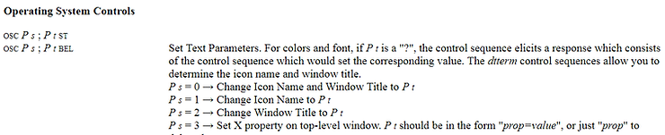

# Change the title of a terminal on Ubuntu 16.04


Hello wayward traveler. This post **actually** describes a way to change the title of a gnome terminal running bash that works. It also discusses why many other online recommendations don't work.

**Need help installing Ubuntu?**

See [[link](http://www.zachpfeffer.com/single-post/2017/02/17/Installing-the-64-bit-PC-AMD64-desktop-image-of-Ubuntu-16042-LTS-Xenial-Xerus-in-Oracle-VM-VirtualBox-5114-running-in-Windows-7-Professional-Service-Pack-1-CurrentBuild-7601-on-a-ThinkPad-T460-model-20FNCTO1WW-with-an-IntelR-CoreTM-i7-6600U-CPU)].

**Just the command**

Type:

```
PS1=$
PROMPT_COMMAND=
echo -en "\033]0;New title\a"
```

into a gnome-terminal running an interactive bash shell to change the title to **New title.** This will also set the prompt to $.

There's a discussion about why you need to reset PS1 on Ubuntu 16.04 below.

**Versions**

gnome-terminal 3.18.3

```
$gnome-terminal --version
GNOME Terminal 3.18.3
```

bash 4.3.48(1)-release (x86\_64-pc-linux-gnu)

```
$bash --version
GNU bash, version 4.3.48(1)-release (x86_64-pc-linux-gnu)
Copyright (C) 2013 Free Software Foundation, Inc.
License GPLv3+: GNU GPL version 3 or later 

This is free software; you are free to change and redistribute it.
There is NO WARRANTY, to the extent permitted by law.
```

Ubuntu 16.04.1

```
pfefferz@plc2:~$ uname -a
Linux plc2 4.13.0-43-generic #48~16.04.1-Ubuntu SMP Thu May 17 12:56:46 UTC 2018 x86_64 x86_64 x86_64 GNU/Linux
```

**Details**

Many, many, many online recommendations suggest you run:

```
echo -en "\033]0;New title\a"
```

...but this "doesn't work."

It doesn't work because Ubuntu 16.04 sets the PS1 variable to \_also\_ run this command. Since the PS1 variable is evaluated for each prompt, its setting overwrites the setting you set. This make you \_think\_ that its not working, but it is - its just getting overwritten.

The "PROMPT\_COMMAND" solution

Some online resources \[[link](http://unix.stackexchange.com/questions/177572/how-to-rename-terminal-tab-title-in-gnome-terminal)\] suggest you set PROMPT\_COMMAND to something like:

```
PROMPT_COMMAND='echo -ne "\033]0;YOUR TITLE GOES HERE\007"'
```

This also "doesn't work" because PS1 is still set; PROMPT\_COMMAND will run, then PS1 will run overriding what prompt command did.

This is especially insidious because as you debug, you may set PROMPT\_COMMAND. If you figure out that PS1 is overriding your echo -en, then PROMPT\_COMMAND will override it instead!

**Why is everyone Googling this?**

This is just speculation. Ubuntu 16.04 uses gnome-terminal 3.18.3. Support for **gnome-terminal --title** was not present in 3.18.3. Ubuntu 16.04 also ships with PS1 set to:

```
pfefferz@plc2:~$ echo $PS1
\[\e]0;\u@\h: \w\a\]${debian_chroot:+($debian_chroot)}\[\033[01;32m\]\u@\h\[\033[00m\]:\[\033[01;34m\]\w\[\033[00m\]\$
```

Notice the start (bolded here):

```
pfefferz@plc2:~$ echo $PS1
\[\e]0;\u@\h: \w\a\]${debian_chroot:+($debian_chroot)}\[\033[01;32m\]\u@\h\[\033[00m\]:\[\033[01;34m\]\w\[\033[00m\]\$
```

By default Ubuntu 16.04 runs the title set when PS1 is evaluated. As discussed above, this means that it will override any attempts to set the title with **echo** or **PROMPT\_COMMAND**.

People, having lost --title then looked for another way to set the title, but their efforts were frustrated by the setting of PS1!

**Why is this a big deal?**

Many people have a lot of terminal windows open on their desktop. They give each terminal a title so that they can easily find it again. Without a title, people have to resort to looking through their windows manually which takes a lot of time.

**The bigger issue**

In the bug reports, many users were very upset about --title being removed.

One new Linux user wrote:

_I've spent 15 years doing commercial development and minor admin in Windows, and the last year struggling with Linux, which is strangely obtuse and badly documented when it could be so simple and powerful for new users._

_Why on earth have you taken away a simple command like title - which still exists and is incredibly useful in Windows, by the way - and then advise \_your\_ \_users\_ to learn some obtuse escape character code?_

It would be good for Canonical to add a few test cases for this use case to make sure that people can easily set window titles from the command line.

**References**

-   bash(1) - Linux man page @ \[[link](http://linux.die.net/man/1/bash)\]
    
-   PROMPT\_COMMAND @ \[[link](http://tldp.org/HOWTO/Bash-Prompt-HOWTO/x264.html)\]
    
-   ASCII Characters for MPE Users @ \[[link](http://www.robelle.com/smugbook/ascii.html)\]
    
-   Xterm Control Sequences @ \[[link](http://www.xfree86.org/4.5.0/ctlseqs.html)\]
    
-   VT102 escape and control sequences @ \[[link](http://vt100.net/docs/vt102-ug/appendixc.html)\]
    
-   VT220 Programmer Reference Manual Chapters 2: Character Encoding \[[link](http://vt100.net/docs/vt220-rm/chapter2.html)\] Chapter 3 Transmitted Codes \[[link](http://vt100.net/docs/vt220-rm/chapter3.html)\] and Chapter 4 Received Codes \[[link](http://vt100.net/docs/vt220-rm/chapter4.html)\]
    
-   Summary of ANSI standards for ASCII terminals Joe Smith, 18-May-84, With additions by Dennis German @ \[[link](http://www.real-world-systems.com/docs/ANSIcode.html)\]
    
-   Everything You Need to Know About HTML’s ‘pre’ Element @ \[[link](http://www.sitepoint.com/everything-need-know-html-pre-element/)\]
    
-   The Gnome bugs about --title \[[724110](http://bugzilla.gnome.org/show_bug.cgi?id=724110)\] and \[[740188](http://bugzilla.gnome.org/show_bug.cgi?id=740188)\]
    
-   Ubuntu logo from \[[link](http://assets.ubuntu.com/v1/57a889f6-ubuntu-logo112.png)\]
    

**Notes**

To search for **\\\[** when you type **man bash** you use **/\\\\\\\[**.

Octal and hex escape values in bash

**\\033** is an example of specify an **octal backslash escape** in bash, **\\x1b** is how to specify the **backslash escape** in hex

Am I running an interactive shell?

You're running an interactive shell if **PS1** is **set** and **$- includes i**.

Test with:

```
pfefferz@plc2:~$ echo $PS1
\[\e]0;\u@\h: \w\a\]${debian_chroot:+($debian_chroot)}\[\033[01;32m\]\u@\h\[\033[00m\]:\[\033[01;34m\]\w\[\033[00m\]\$
pfefferz@plc2:~$ echo $-
himBH
```

ASCII escape sequences and bash

In bash:

-   **\\\[ starts a sequence of non-printing characters and \\\] ends it.**
    
-   **\\e is the ASCII escape character: \\033 or \\x1b or decimal 27 or Control key ^\[**
    
-   **\\e starts an ANSI escape sequence to perform in-band signaling to control "the cursor location, color, and other options on video text terminals." \[**[**Wikipedia**](http://en.wikipedia.org/wiki/ANSI_escape_code#Escape_sequences)**\]**
    
-   **\\e\]**
    
-   **The start of a ANSI OSC – Operating System Control**
    
-   **Starts a control string for the operating system to use that is terminated by an ST**
    
-   **Here is a screen shot of the relevant passage in a page on the Xterm Control Sequences**
    



**Excerpts**

From **man gnome-terminal**

_DESCRIPTION_

_GNOME Terminal is a terminal emulation application that you can use to perform the following actions:_

_Access a UNIX shell in the GNOME environment._

_A shell is a program that interprets and executes the commands that you type at a command line prompt. When you start GNOME Terminal, the application starts the default shell that is specified in your system account. You can switch to a different shell at any time._

_Run any application that is designed to run on VT102, VT220, and xterm terminals._

_GNOME Terminal emulates the xterm program developed by the X Consortium. In turn, the xterm program emulates the DEC VT102 terminal and also supports the DEC VT220 escape sequences. An escape sequence is a series of characters that starts with the Esc character._

_GNOME Terminal accepts all of the escape sequences that the VT102 and VT220 terminals use for functions such as positioning the cursor and clearing the screen._