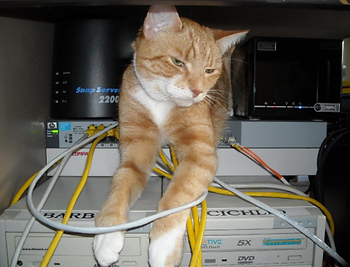

# Create a TCP Client and Server and Send Messages with Netcat



This post shows how to create a TCP client and server and send messages between them using netcat v1.12 on Windows

**Steps**

1\. Download netcat v1.12 for windows from http://eternallybored.org/misc/netcat/  (or click [here](http://eternallybored.org/misc/netcat/netcat-win32-1.12.zip) to get it)

2\. Open a CMD window

3\. Create the server by typing this into the CMD window

```
nc -l -p 12345
```

4\. Open another CMD window

5\. Create the client by typing this into the CMD window you just opened:

```
nc localhost 12345
```

6\. Type **Hello, World** in the client. You should see it in the server.

**Good links**

-   Netcat cheatsheet [here](http://www.sans.org/security-resources/sec560/netcat_cheat_sheet_v1.pdf)
    
-   [Establishing a connection and getting some data over HTTP from Jon Craton](http://joncraton.org/blog/46/netcat-for-windows/)
    
-   Download netcat v1.12 [here](http://eternallybored.org/misc/netcat/netcat-win32-1.12.zip)
    
-   [A Gentle Introduction to netcat](http://medium.com/@tzhenghao/a-gentle-introduction-to-netcat-3e0b105dfbd9) by Zheng Hao Tan
    
-   [netcat commands](http://jonlabelle.com/snippets/view/shell/netcat-commands) by Jon LaBelle
    
-   A cool [webserver](http://wiki.christophchamp.com/index.php?title=Netcat) in one line from Christoph Champ's Personal Wiki
    
-   { echo -ne "HTTP/1.0 200 OK\\r\\nContent-Length: $(wc -c <some.file)\\r\\n\\r\\n"; cat some.file; } | nc -l 8080
    

**Reference**

-   Cat pic from [link](http://andysworld.org.uk/blog/wp-content/uploads/2010/05/angusonswitch.jpg)