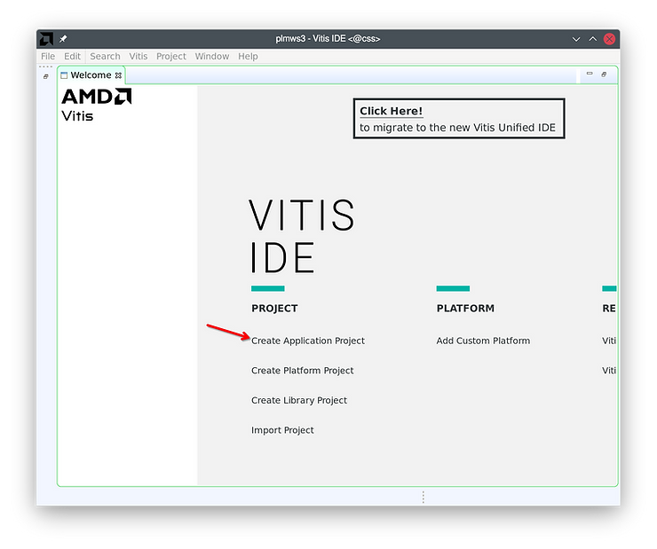
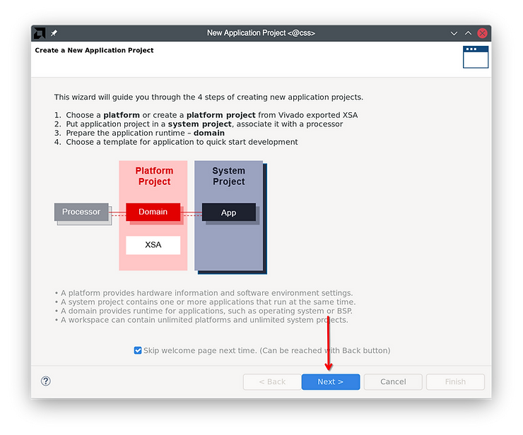
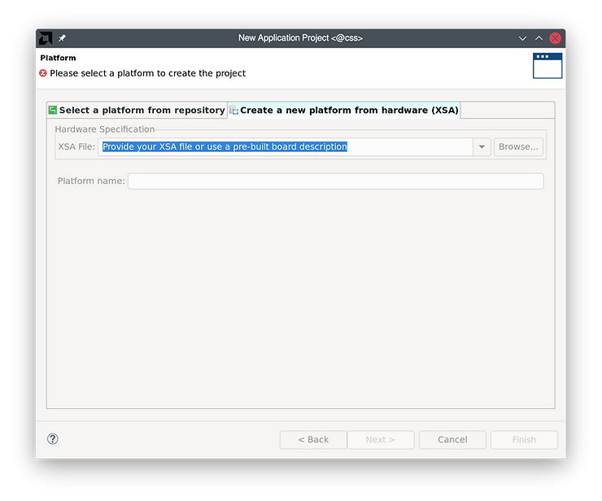
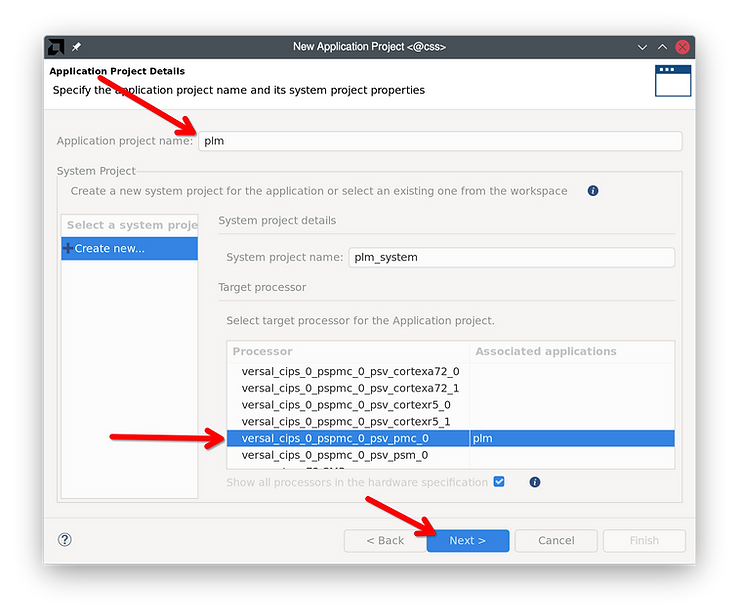
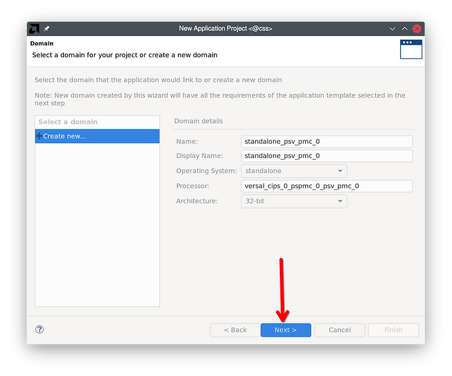
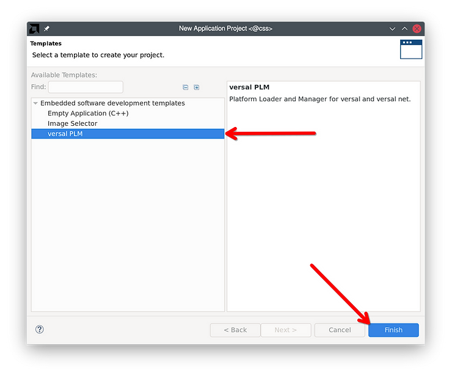
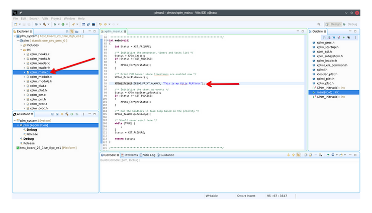
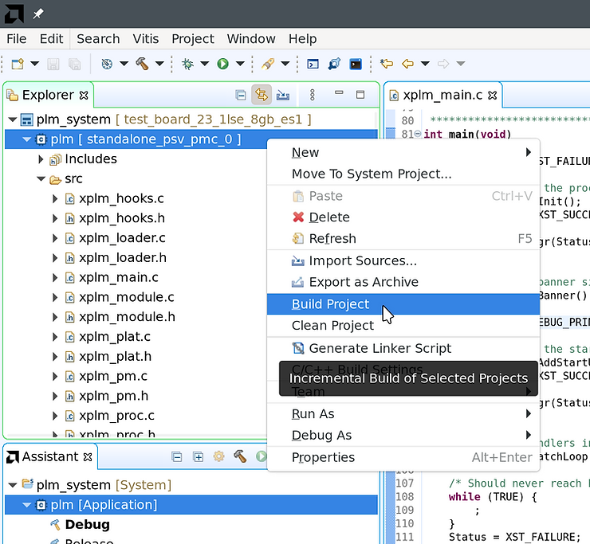
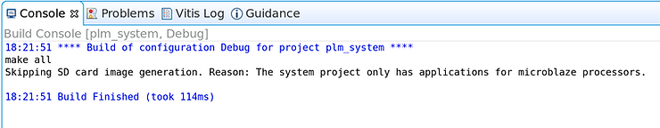
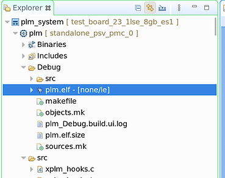

# Create a Versal PLM project and build it with Vitis Classic

This post shows how to create a Versal PLM with Vitis Classic (versions ≤2023.1, or 2023.2 when launched with the \`-classic\` command line argument). If you'd like to do this on the command line with XSCT, refer to [<u><span>this post</span></u>](https://www.centennialsoftwaresolutions.com/post/create-a-versal-plm-project-and-build-it) instead. After creating the PLM, follow the instructions in [<u><span>this next post</span></u>](https://www.centennialsoftwaresolutions.com/post/create-a-versal-boot-image-and-launch-plm-on-hardware) to create a bootable image from it and launch it on hardware.

## 1) Launch Vitis

```
$ source /tools/Xilinx/Vitis/2023.2/settings64.sh

$ vitis                  (versions 2023.1 and earlier)
$ vitis -classic         (versions 2023.2 and later)
```

## 2) Select your workspace directory and create a new application project

Click on Create Application Project and skip the welcome screen in the dialog that pops up.





Select the hardware platform. Use the dropdown box to select vck190 or other Xilinx dev kits; otherwise, use the ‘Browse’ button to pick the XSA file that you exported from Vitis or that your board’s manufacturer provided.

The Platform Name field will get filled in automatically; leave it at the default and click Next.



Enter an application project name – “plm” will work fine. The system project name will be automatically filled in.

Select versal\_cips\_0\_pspmc\_0\_psv\_pmc\_0 as the processor.

Leave other settings at the default and click next.



Click Next on the Domain page - no changes needed here.



Select “versal PLM” as the application template and click Finish.



## 1) Modify and build the PLM

Vitis will open the PLM project. Open xplm\_main.c from the left sidebar.

Add a new XPlmi\_Printf to distinguish this from the default PLM:

```
XPlmi_Printf(DEBUG_PRINT_ALWAYS, "This is my Vitis PLM!\n\r");
```



Right click the “plm” project (the first child of “plm\_system”) and build it.



The console will show this when the build is finished:



The built PLM ELF will be present in the Vitis workspace directory at plm/Debug/plm.elf.



Next, follow the steps in [<u><span>this post</span></u>](https://www.centennialsoftwaresolutions.com/post/create-a-versal-boot-image-and-launch-plm-on-hardware) to pack this PLM into a boot image and boot it on hardware.

## References

Header image from https://www.xilinx.com/products/silicon-devices/acap/versal-ai-core.html#video