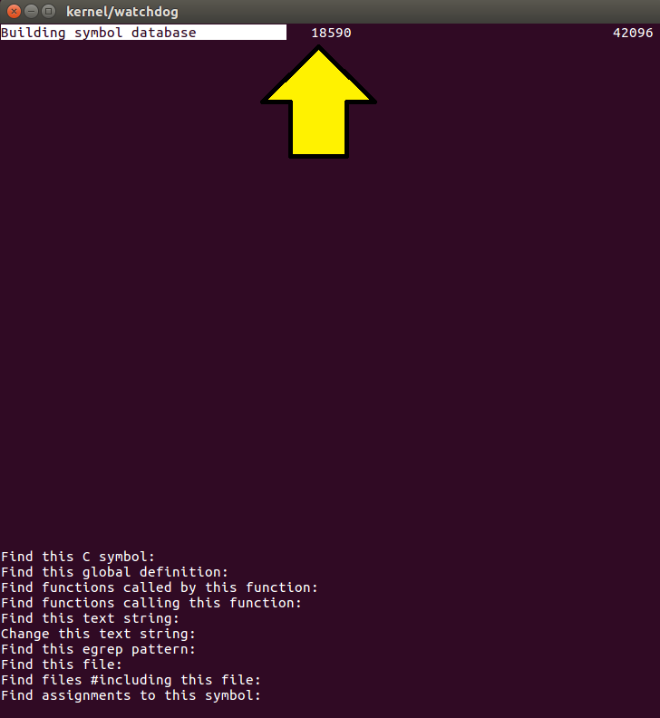
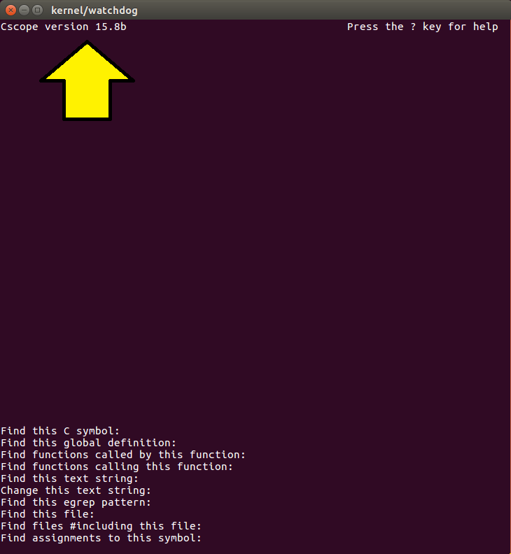

# Quickly Enable cscope in Vim


 This post list a set of steps to quickly start browsing code in vim. Its a short version of http://cscope.sourceforge.net/cscope_vim_tutorial.html. 

1\. Install cscope with:

```
sudo apt-get install cscope
```

2\. Make ~/.vim/plugin

```
mkdir -p ~/.vim/plugin/
```

3\. Copy this into a file called ~/.vim/plugin/cscope\_maps.vim:

```
""""""""""""""""""""""""""""""""""""""""""""""""""""""""""""""""""""""""""""""""
" CSCOPE settings for vim           
""""""""""""""""""""""""""""""""""""""""""""""""""""""""""""""""""""""""""""""""
"
" This file contains some boilerplate settings for vim's cscope interface,
" plus some keyboard mappings that I've found useful.
"
" USAGE: 
" -- vim 6:     Stick this file in your ~/.vim/plugin directory (or in a
"               'plugin' directory in some other directory that is in your
"               'runtimepath'.
"
" -- vim 5:     Stick this file somewhere and 'source cscope.vim' it from
"               your ~/.vimrc file (or cut and paste it into your .vimrc).
"
" NOTE: 
" These key maps use multiple keystrokes (2 or 3 keys).  If you find that vim
" keeps timing you out before you can complete them, try changing your timeout
" settings, as explained below.
"
" Happy cscoping,
"
" Jason Duell       jduell@alumni.princeton.edu     2002/3/7
""""""""""""""""""""""""""""""""""""""""""""""""""""""""""""""""""""""""""""""""


" This tests to see if vim was configured with the '--enable-cscope' option
" when it was compiled.  If it wasn't, time to recompile vim... 
if has("cscope")

    """"""""""""" Standard cscope/vim boilerplate

    " use both cscope and ctag for 'ctrl-]', ':ta', and 'vim -t'
    set cscopetag

    " check cscope for definition of a symbol before checking ctags: set to 1
    " if you want the reverse search order.
    set csto=0

    " add any cscope database in current directory
    if filereadable("cscope.out")
        cs add cscope.out  
    " else add the database pointed to by environment variable 
    elseif $CSCOPE_DB != ""
        cs add $CSCOPE_DB
    endif

    " show msg when any other cscope db added
    set cscopeverbose  


    """"""""""""" My cscope/vim key mappings
    "
    " The following maps all invoke one of the following cscope search types:
    "
    "   's'   symbol: find all references to the token under cursor
    "   'g'   global: find global definition(s) of the token under cursor
    "   'c'   calls:  find all calls to the function name under cursor
    "   't'   text:   find all instances of the text under cursor
    "   'e'   egrep:  egrep search for the word under cursor
    "   'f'   file:   open the filename under cursor
    "   'i'   includes: find files that include the filename under cursor
    "   'd'   called: find functions that function under cursor calls
    "
    " Below are three sets of the maps: one set that just jumps to your
    " search result, one that splits the existing vim window horizontally and
    " diplays your search result in the new window, and one that does the same
    " thing, but does a vertical split instead (vim 6 only).
    "
    " I've used CTRL-\ and CTRL-@ as the starting keys for these maps, as it's
    " unlikely that you need their default mappings (CTRL-\'s default use is
    " as part of CTRL-\ CTRL-N typemap, which basically just does the same
    " thing as hitting 'escape': CTRL-@ doesn't seem to have any default use).
    " If you don't like using 'CTRL-@' or CTRL-\, , you can change some or all
    " of these maps to use other keys.  One likely candidate is 'CTRL-_'
    " (which also maps to CTRL-/, which is easier to type).  By default it is
    " used to switch between Hebrew and English keyboard mode.
    "
    " All of the maps involving the <cfile> macro use '^<cfile>$': this is so
    " that searches over '#include <time.h>" return only references to
    " 'time.h', and not 'sys/time.h', etc. (by default cscope will return all
    " files that contain 'time.h' as part of their name).


    " To do the first type of search, hit 'CTRL-\', followed by one of the
    " cscope search types above (s,g,c,t,e,f,i,d).  The result of your cscope
    " search will be displayed in the current window.  You can use CTRL-T to
    " go back to where you were before the search.  
    "

    nmap <C-\>s :cs find s <C-R>=expand("<cword>")<CR><CR>	
    nmap <C-\>g :cs find g <C-R>=expand("<cword>")<CR><CR>	
    nmap <C-\>c :cs find c <C-R>=expand("<cword>")<CR><CR>	
    nmap <C-\>t :cs find t <C-R>=expand("<cword>")<CR><CR>	
    nmap <C-\>e :cs find e <C-R>=expand("<cword>")<CR><CR>	
    nmap <C-\>f :cs find f <C-R>=expand("<cfile>")<CR><CR>	
    nmap <C-\>i :cs find i ^<C-R>=expand("<cfile>")<CR>$<CR>
    nmap <C-\>d :cs find d <C-R>=expand("<cword>")<CR><CR>	


    " Using 'CTRL-spacebar' (intepreted as CTRL-@ by vim) then a search type
    " makes the vim window split horizontally, with search result displayed in
    " the new window.
    "
    " (Note: earlier versions of vim may not have the :scs command, but it
    " can be simulated roughly via:
    "    nmap <C-@>s <C-W><C-S> :cs find s <C-R>=expand("<cword>")<CR><CR>	

    nmap <C-@>s :scs find s <C-R>=expand("<cword>")<CR><CR>	
    nmap <C-@>g :scs find g <C-R>=expand("<cword>")<CR><CR>	
    nmap <C-@>c :scs find c <C-R>=expand("<cword>")<CR><CR>	
    nmap <C-@>t :scs find t <C-R>=expand("<cword>")<CR><CR>	
    nmap <C-@>e :scs find e <C-R>=expand("<cword>")<CR><CR>	
    nmap <C-@>f :scs find f <C-R>=expand("<cfile>")<CR><CR>	
    nmap <C-@>i :scs find i ^<C-R>=expand("<cfile>")<CR>$<CR>	
    nmap <C-@>d :scs find d <C-R>=expand("<cword>")<CR><CR>	


    " Hitting CTRL-space *twice* before the search type does a vertical 
    " split instead of a horizontal one (vim 6 and up only)
    "
    " (Note: you may wish to put a 'set splitright' in your .vimrc
    " if you prefer the new window on the right instead of the left

    nmap <C-@><C-@>s :vert scs find s <C-R>=expand("<cword>")<CR><CR>
    nmap <C-@><C-@>g :vert scs find g <C-R>=expand("<cword>")<CR><CR>
    nmap <C-@><C-@>c :vert scs find c <C-R>=expand("<cword>")<CR><CR>
    nmap <C-@><C-@>t :vert scs find t <C-R>=expand("<cword>")<CR><CR>
    nmap <C-@><C-@>e :vert scs find e <C-R>=expand("<cword>")<CR><CR>
    nmap <C-@><C-@>f :vert scs find f <C-R>=expand("<cfile>")<CR><CR>	
    nmap <C-@><C-@>i :vert scs find i ^<C-R>=expand("<cfile>")<CR>$<CR>	
    nmap <C-@><C-@>d :vert scs find d <C-R>=expand("<cword>")<CR><CR>


    """"""""""""" key map timeouts
    "
    " By default Vim will only wait 1 second for each keystroke in a mapping.
    " You may find that too short with the above typemaps.  If so, you should
    " either turn off mapping timeouts via 'notimeout'.
    "
    "set notimeout 
    "
    " Or, you can keep timeouts, by uncommenting the timeoutlen line below,
    " with your own personal favorite value (in milliseconds):
    "
    "set timeoutlen=4000
    "
    " Either way, since mapping timeout settings by default also set the
    " timeouts for multicharacter 'keys codes' (like <F1>), you should also
    " set ttimeout and ttimeoutlen: otherwise, you will experience strange
    " delays as vim waits for a keystroke after you hit ESC (it will be
    " waiting to see if the ESC is actually part of a key code like <F1>).
    "
    "set ttimeout 
    "
    " personally, I find a tenth of a second to work well for key code
    " timeouts. If you experience problems and have a slow terminal or network
    " connection, set it higher.  If you don't set ttimeoutlen, the value for
    " timeoutlent (default: 1000 = 1 second, which is sluggish) is used.
    "
    "set ttimeoutlen=100

endif
```

4\. Run this in your source tree:

```
cscope -R
```

The cscope status bar will grow:



Until it completes:



5\. Type Control+d to quit.

6\. Open a source file. Move the cursor over a symbol and type: **Control+\\ s**.

Note

A potentially more useful method is to present the result in a split window. With the cursor over the symbol of interest, type **Control+spacebar s**. Type **Control+w arrowkey** to enter the window. With the window selected, type **Control+w q** to close the window.

Note 2

In addition to **s** you can use these:

```
's'   symbol: find all references to the token under cursor
'g'   global: find global definition(s) of the token under cursor
'c'   calls:  find all calls to the function name under cursor
't'   text:   find all instances of the text under cursor
'e'   egrep:  egrep search for the word under cursor
'f'   file:   open the filename under cursor
'i'   includes: find files that include the filename under cursor
'd'   called: find functions that function under cursor calls
```

...from ~/.vim/plugin/cscope\_maps.vim

7\. Type the # of the result.

Example

Type **2** to jump to **cdns\_wdt\_probe**

```
Cscope tag: cdns_wdt_probe
   #   line  filename / context / line
   1    467  drivers/watchdog/cadence_wdt.c <<GLOBAL>>
             .probe = cdns_wdt_probe,
   2    287  drivers/watchdog/cadence_wdt.c <<cdns_wdt_probe>>
             static int cdns_wdt_probe(struct platform_device *pdev)
Type number and <Enter> (empty cancels): 
```

8\. Type Control+t to get back to where you were, i.e. "popping off the tag stack"

**Reference**

GNU image from [link](http://en.wikipedia.org/wiki/GNU_Project)