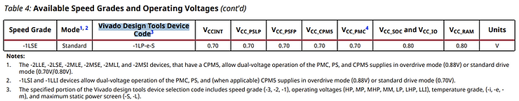
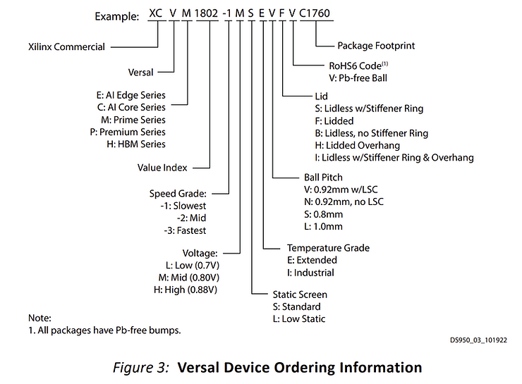

# Decoding Vivado Design Tools Device Codes and Device Ordering Information

This blog post lists pointers to help you understand **Vivado Design Tools Device Codes** and AMD Part Numbers, often called Vivado Part Numbers and Manufacturer Part Numbers. Specifically, we'll focus on one example from each category: the xcve2302-sfva784-1LP-e-S Vivado Design Tools Device Code and the XCVE2302-1LSESFVA784 Device Ordering Information.

## <u>Vivado Design Tools Device Code aka Vivado Part Number: xcve2302-sfva784-1LP-e-S</u>

The complete definition of this Vivado Part Number can be found at https://www.xilinx.com/support/documents/data_sheets/ds957-versal-ai-core.pdf#page=7

The document clarifies that the Vivado design tools device selection code contains:

-   Speed grade (-3, -2, -1)
    
-   Operating voltages (HP, MP, MHP, MM, LP, LHP, LLI)
    
-   Temperature grade (-i, -e, -m)
    
-   Maximum static power screen (-S, -L)
    

## <u>AMD Part Number: XCVE2302-1LSESFVA784</u>

This Device Ordering Information can be decoded using the https://docs.xilinx.com/v/u/en-US/ds950-versal-overview#page=35.

Here's a breakdown of the example given: **XCVE2302-1LSESFVA784-ES9780**

-   **XC**: Xilinx Commercial
    
-   **V**: Versal
    
-   **E**: AI Edge Series
    
-   **Value Index**: 2302
    
-   **1**: Slowest Speed Grade
    
-   **L**: Low (0.7V)
    
-   **S**: Standard Static Screen
    
-   **E**: Extended Temperature Grade
    
-   **S**: 0.8mm Ball Pitch
    
-   **F**: Lidded
    
-   **V**: Pb-free Ball
    
-   **A784**: Package Footprint
    

In conclusion, understanding these codes can help ensure you use the right part in your Vivado design. We hope this guide simplifies your decoding process!

## <u>References</u>

Logo from https://library.amd.com/media/ (requires a password)