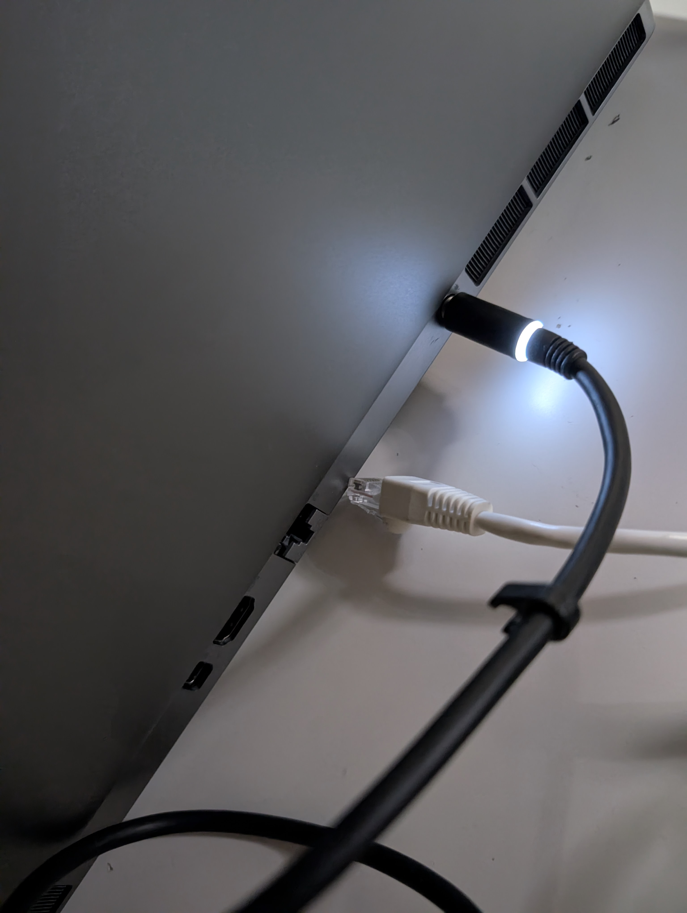
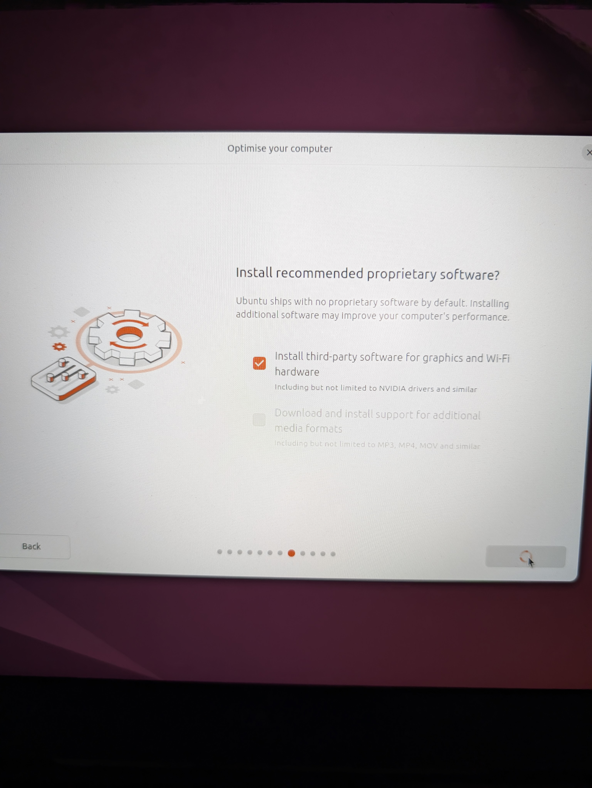
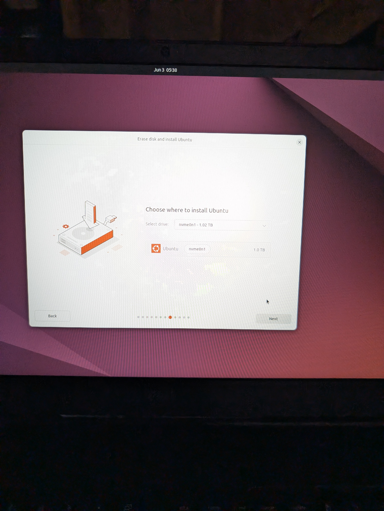
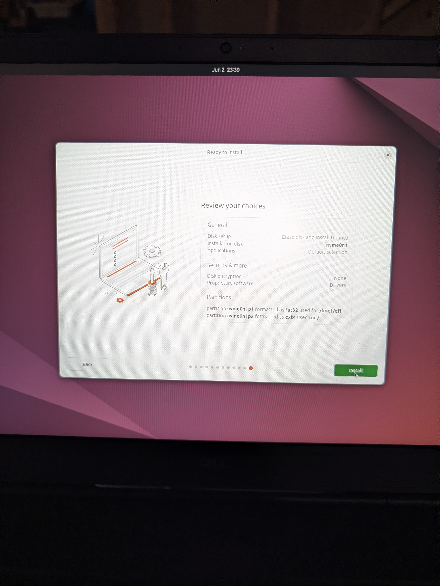
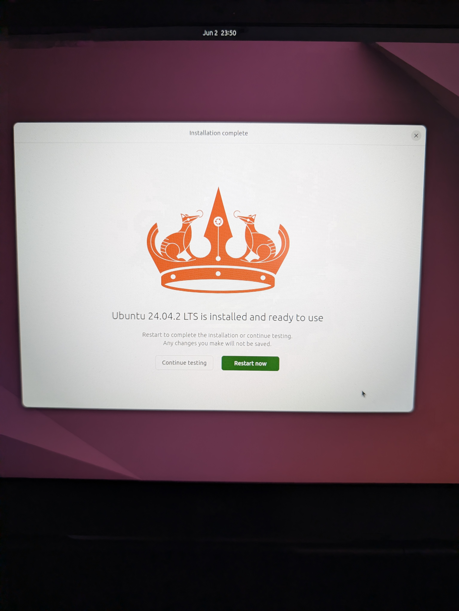
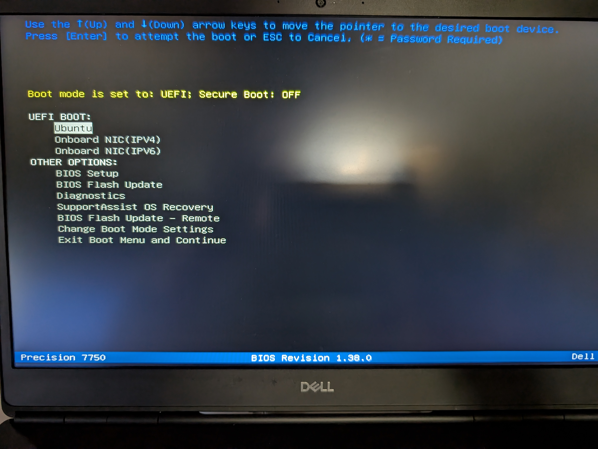
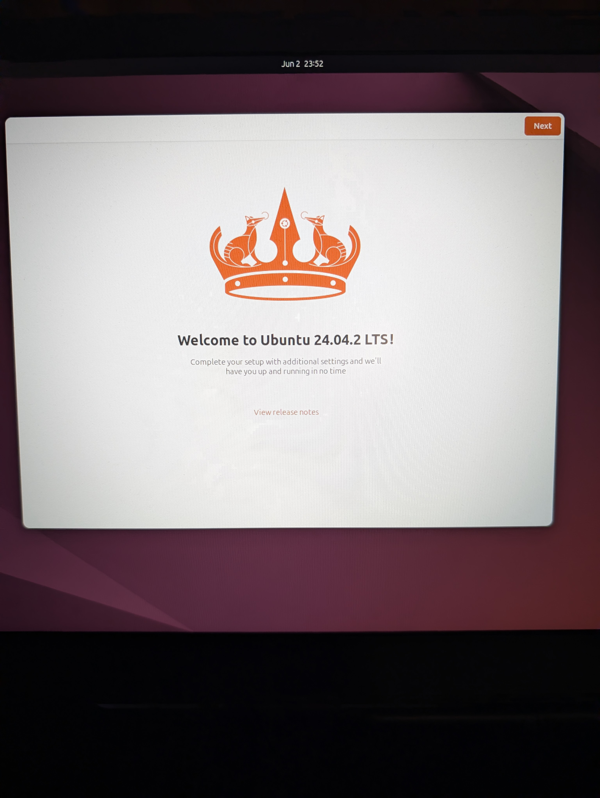

# Dell Precision 7750 Ubuntu 24.04.2 Install Log

Note: Not all steps were listed or photographed. The log was prepared as a record that we decided to share in case other people find it useful. 

1. Disconnected the network:

2. Inserted a USB key with the Ubuntu 24.04.2 installer from https://old-releases.ubuntu.com/releases/24.04.2/ubuntu-24.04.2-desktop-amd64.iso.

3. Cached installer: 

   [ubuntu-24.04.2-desktop-amd64.iso](https://drive.google.com/file/d/1ew3XFzzQKYzg0YDSA8R_t4qJkX5YyMSN/view?usp=drive_link)

4. Cached installer installer support files: 

   [ubuntu-24.04.2-desktop-amd64.iso.torrent](https://drive.google.com/file/d/1dNETiB010hsonRxiRwPlQRC8GrOMJgSi/view?usp=drive_link)
   [ubuntu-24.04.2-desktop-amd64.iso.zsync](https://drive.google.com/file/d/1dwphaAE0WIEHtNQtLvWJbxXnkxFZ-Ddv/view?usp=drive_link)
   [ubuntu-24.04.2-desktop-amd64.list](https://drive.google.com/file/d/1HH2wZIYVfAbReg91SKwovU8H3YgxGWQf/view?usp=drive_link)
   [ubuntu-24.04.2-desktop-amd64.manifest](https://drive.google.com/file/d/1shhjlFeD9hctb4fGeCF6_aXGvfmIaePV/view?usp=drive_link)

5. Booted and pressed `F12` to enter BIOS and boot from USB install key.

6. Selected third-party software install:

7. Choose where to install:

8. Reviewed choices:

9. Clicked through to the ready-to-use screen:

10. Rebooted with the USB installer key still in.

11. Selected Ubuntu:

12. Saw the boot screen:

Dell Precision 7750 Specs:

- Intel Core Processor i9-10885H (8 Core, 16MB Cache, 2.40 GHz to 5.30 GHz, 45W,vPro)
- 64GB, 2X32GB,DDR4 2933Mhz Non-ECC Memory
- NVIDIA Quadro RTX 5000 w/16GB GDDR6
- Intel(R) Wi-Fi 6 2x2 (Gig+) and Bluetooth 5.1
- Intel AX201 2x2 + Bluetooth 5.1 Driver
- M.2 1TB PCIe NVMe Class 40 Solid State Drive
- 17.3-inch, FHD, 1920 x 1080, 60 Hz, Anti-Glare, Non Touchscreen, 45% NTSC, 220 Nits, WVA
- 6 Cell 95Whr ExpressCharge Capable Battery

