# DevEUI, AppEUI (JoinEUI) and AppKey

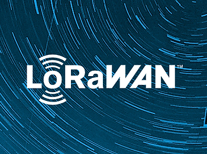

This post describes what DevEUI, AppEUI (JoinEUI) and AppKey are, using online sources and the relevant sections for the LoRaWAN™ Specification v1.1 and v1.0.3

**<u>Summary</u>**

_From LoRa Community Answers "DevEui vs AppEui":_

**(1) DevEUI** \- 64 bit number  

This is the unique ID of the end device. To make sure it is unique, the node manufacturer should contact the IEEE to obtain a range of unique addresses.

**(19) AppEUI** \- 64 bit number (in v1.1 "**AppEUI** is renamed **JoinEUI**"  

This is the unique ID of the Application server. The **(19) AppEUI** is also unique and should be obtained from the IEEE. This is the destination of the messages sent by the nodes. The **(19) AppEUI** is unique to the Application Server and each Application Server will have its own **(19) AppEUI**.

**(21) AppKey** \- 128 bit number  

The **(21) AppKey** is the encryption key between the source of the message (behind the DevEUI) and the destination of the message (behind the AppEUI). This key must be unique for each device.

<u>How to get them:</u>

**(1) DevEUI**: this key is linked to the end node, this means end node manufacturers should contact the IEEE to get a range of unique identifiers.

**(19) AppEUI**: this key is linked to the Application Server. It must be unique so that end node World Wide (we will have roaming soon) know where to send their messages. The AppEUI is usually provided to the end node manufacturers by the solution providers (who "own" the Application Server).

**(21) AppKey**: The AppKey is the data encryption key used to "encode" the messages between the end nodes and the Application Server. The AppKey is typically a random generated number who is programmed into the end nodes and also communicated to the Application server (so that it can decode the messages).

**<u>(1) DevEUI - Device Extended Unique Identifier</u>**

_From the LoRaWAN Spec v1.1 line_ **_1323_** _section_ **_6.1.1.2:_**

The **(1) DevEUI** is a global end-device ID in IEEE **(2) EUI64** address space that uniquely identifies the end-device.

**DevEUI** is the recommended unique device identifier by Network Server(s), whatever activation procedure is used, to identify a device roaming across networks.

For **(3) OTAA** devices, the DevEUI MUST be stored in the end-device before the Join procedure is executed. **(4) ABP** devices do not need the DevEUI to be stored in the device itself, but it is RECOMMENDED to do so.

Note: It is a recommended practice that the DevEUI should also be available on a device label, for device administration.

<u>More Info</u>

-   **_(1) EUI64_** _stands for_ **_64-bit Extended Unique Identifier_** _and is written_ **_EUI-64_** _by the_ **_IEEE_**
    
-   _To participate in a LoRaWAN network, each end-device has to be personalized and activated. There are two types of activation:_ **_(3) OTAA_**_, which_ _stands for_ **_Over-The-Air Activation_** _and_ **_(4) ABP_** _which stands for_ **_Activation By Personalization_**_._
    

**<u>Over-The-Air Activation</u>**

_From the LoRaWAN Spec v1.1 line_ **_1481_** _section_ **_6.2:_**

For over-the-air activation, end-devices must follow a **(5) join procedure** prior to participating in data exchanges with the **(6) Network Serve**r. An end-device has to go through a new **(5) join procedure** every time it has lost the **(7) session context** information.

<u>Acronyms and More Info</u>

-   **(5) join procedure** from an end-device’s point of view, the **(5) join procedure** consists of either a **(9) Join-request** or **(10) ReJoin-request** and a **(11) Join-accept** exchange.
    

**<u>(9) Join-request</u>**

_From the LoRaWAN Spec v1.1 line_ **_1501_** _section_ **_6.2.2:_**

The join procedure is always initiated from the end-device by sending a join-request message

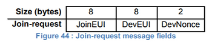

The join-request message contains the **(20) JoinEUI** and **(1) DevEUI** of the end-device followed by a nonce of 2 octets (**(21) DevNonce**).

**<u>(21) DevNonce</u>**

**(21) DevNonce** is a counter starting at 0 when the device is initially powered up and incremented with every **(9) Join-request**. A **(21) DevNonce** value SHALL NEVER be reused for a given **(20) JoinEUI** value. If the end-device can be power-cycled then **(21) DevNonce** SHALL be persistent (stored in a non-volatile memory). Resetting DevNonce without changing **(20) JoinEUI** will cause the **(6) Network Server** to discard the **(9) Join-requests** of the device. For each end-device, the **(6) Network Server** keeps track of the last **(21) DevNonce** value used by the end-device, and ignores Join-requests if **(21) DevNonce** is not incremented.

The message integrity code (MIC) value (see Chapter 4 for MAC message description) for a **(9) join-request** message is calculated as follows:

cmac = aes128\_cmac(NwkKey, MHDR | JoinEUI | DevEUI | DevNonce) MIC = cmac\[0..3\]

The **(9) join-request** message is not encrypted. **(9) The join-request** message can be transmitted using any data rate and following a random frequency hopping sequence across the specified join channels. It is RECOMMENDED to use a plurality of data rates. The intervals between transmissions of **(9) Join-Requests** SHALL respect the condition described in chapter 7 (a random retry). For each transmission of a Join-request, the end-device SHALL increment the **(21) DevNonce** value.

**<u>(10) ReJoin-request</u>**

**<u>(11) Join-accept</u>**

**<u>(6) Network Server</u>**

_From the LoRaWAN Spec v1.1 line_ **_285_** _section_ **_1:_**

LoRaWAN networks typically are laid out in a star-of-stars topology in which **(12) gateways** relay messages between **(13) end-devices** and a central **(6) Network Server**. The **(6) Network Server** routes the packets from each device of the network to the associated **(14) Application Server**.

<u>Acronyms and More Info</u>

-   **(12) gateways** are also known as **concentrators** or **base stations**
    
-   **(13) end-devices** are also known as motes
    

**<u>(7) Session Context</u>**

_From the LoRaWAN Spec v1.1 line_ **_1488_** _section_ **_6.1.2.6_**

**(7) Session Context** contains **(15) Network Session** and **(16) Application Session**.

The **(15) Network Session** consists of the following state:

-   F/SNwkSIntKey
    
-   NwkSEncKey
    
-   FCntUp
    
-   FCntDwn (LW 1.0) or NFCntDwn (LW 1.1)
    
-   DevAddr
    

The **(16) Application Session** consists of the following state:

-   AppSKey
    
-   FCntUp
    
-   FCntDown (LW 1.0) or AFCntDwn (LW 1.1)
    

**(15) Network Session** state is maintained by the **(17) NS** and the end-device. **(16) Application Session** state is maintained by the **(18) AS** and the end-device.

<u>Acronyms and More Info</u>

-   **(17) NS** stands for **Network Server** (defined in _LoRaWAN Backend Interfaces_)
    
-   **(18) AS** stands for **Application Server** (defined in _LoRaWAN Backend Interfaces_)
    

**<u>(19) AppEUI - Application identifier in v1.0.3 and (20) JoinEUI in v1.1</u>**

**Note**: In LoRaWAN 1.1, AppEUI was renamed JoinEUI. The AppEUI/JoinEUI signals the network-server which join-server to use to authenticate the **(9) Join-request**.

_From the LoRaWAN Spec v1.0.3 line 923 section 6.1.2:_

The **(19) AppEUI** is a global application ID in IEEE EUI64 address space that uniquely identifies the entity able to process the **JoinReq** frame.

The **(19) AppEUI** is stored in the end-device before the activation procedure is executed.

From _the LoRaWAN Spec v1.1 line 1317 section 6.1.1.1:_

The **(2) JoinEUI** is a global application ID in IEEE EUI64 address space that uniquely identifies the **Join Server** that is able to assist in the processing of the **Join procedure** and the **session keys derivation**.

For **OTAA** devices, the **JoinEUI** MUST be stored in the end-device before the **(5) Join procedure** is executed. The **(20) JoinEUI** is not required for **ABP** only end-devices

**<u>(21) AppKey - Application key</u>**

_From the LoRaWAN Spec v1.0.3 line 961 section 6.2.3:_

The **(21) AppKey** is an AES-128 root key specific to the end-device (since all end-devices end up with unrelated application keys specific for each end-device, extracting the **(21) AppKey** from an end-device only compromises this one end-device). Whenever an end-device joins a network via over-the-air activation, the **(21) AppKey** is used to derive the session keys **(22) NwkSKey** and **(23) AppSKey** specific for that end-device to encrypt and verify network communication and application data.

**<u>(22) NwkSKey - Network session key</u>**

_From the LoRaWAN Spec v1.0.3 line 927 section 6.1.3:_

_The_ **_(22) NwkSKey_** _is a network session key specific for the end-device. It is used by both the network server and the end-device to calculate and verify the_ **_(24) MIC_** _(message integrity code) of all data messages to ensure data integrity. It is further used to encrypt and decrypt the payload field of a_ **_(25) MAC-only data messages_**_._

**<u>(23) AppSKey - Network session key</u>**

_From the LoRaWAN Spec v1.0.3 line 932 section 6.1.4:_

The **(23) AppSKey** is an application session key specific for the end-device. It is used by both the application server and the end-device to encrypt and decrypt the payload field of application-specific data messages. Application payloads are end-to-end encrypted between the end-device and the application server, but they are not integrity protected. That means, a network server may be able to alter the content of the data messages in transit. Network servers are considered as trusted, but applications wishing to implement end-to-end confidentiality and integrity protection are recommended to use additional end-to-end security solutions, which are beyond the scope of this specification.

**<u>(24) MIC - Message integrity code</u>**

The message integrity code (MIC) is calculated over all the fields in the message.

msg = (26) MHDR | (27) FHDR | (28) FPort | (29) FRMPayload

whereby len(msg) denotes the length of the message in octets. The MIC is calculated as follows \[RFC4493 ([<u>link</u>](https://tools.ietf.org/html/rfc4493))\]: cmac = aes128\_cmac(NwkSKey, B0 | msg) MIC = cmac\[0..3\]

whereby the block B0 is defined as follows:

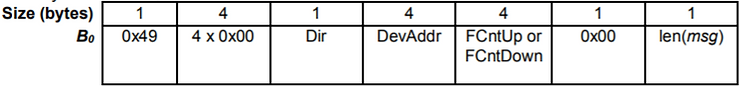

The direction field (Dir) is 0 for uplink frames and 1 for downlink frames.

**<u>(25) MAC-only data messages</u>**

**<u>(26) MHDR - MAC header</u>**

_From the LoRaWAN Spec v1.0.3 line 380 section 4.2:_

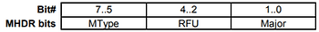

The **MAC header** specifies the message type ( **(30) MType** ) and according to which major version ( **(32) Major** ) of the frame format of the LoRaWAN layer specification the frame has been encoded.

**<u>(27) FHDR - Frame header</u>**

_From the LoRaWAN Spec v1.0.3 line 415 section 4.3.1:_

The **(27) FHDR** contains the short device address of the end-device (**(33) DevAddr**), a frame control octet (**(34) FCtrl**), a 2-octets frame counter (**(35) FCnt**), and up to 15 octets of frame options (**(36) FOpts**) used to transport MAC commands.

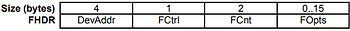

**<u>(33) DevAddr - End-device address</u>**

The **(33) DevAddr** consists of 32 bits identifies the end-device within the current network. Its format is as follows:

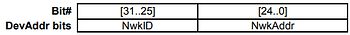

The most significant 7 bits are used as network identifier (**(44) NwkID**) to separate addresses of territorially overlapping networks of different network operators and to remedy roaming issues. The least significant 25 bits, the network address (**(45) NwkAddr**) of the end-device, can be arbitrarily assigned by the network manager.

**<u>(44) NwkID - network identifier</u>**

_From the LoRaWAN Spec v1.0.3 line 916 section 6.1.1:_

**<u>(45) NwkAddr - network address</u>**

_From the LoRaWAN Spec v1.0.3 line 916 section 6.1.1:_

**<u>(34) FCtrl - frame control pctet</u>**

For downlink frames the **(34) FCtrl** content of the frame header is:

For uplink frames the **(34) FCtrl** content of the frame header is:

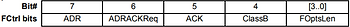

**<u>(35) FCnt, FCntUp, FCntDown</u>**

_From the LoRaWAN Spec v1.0.3 line 507 section 4.3.1.5:_

Each end-device has two frame counters to keep track of the number of data frames sent

uplink to the network server (**FCntUp**), incremented by the end-device and received by the

end-device downlink from the network server (**FCntDown**), which is incremented by the

network server. The network server tracks the uplink frame counter and generates the

downlink counter for each end-device. After a JoinReq – JoinAccept message exchange or a

reset for a personalized end-device, the frame counters on the end-device and the frame

counters on the network server for that end-device are reset to 0. Subsequently **FCntUp** and

**FCntDown** are incremented at the sender side by 1 for each new data frame sent in the

respective direction. At the receiver side, the corresponding counter is kept in sync with the

value received provided the value received has incremented compared to the current counter value and is less than the value specified by MAX\_FCNT\_GAP1 after considering counter rollovers. If this difference is greater than the value of MAX\_FCNT\_GAP then too many data frames have been lost then subsequent will be discarded. The **FCnt** is not incremented in case of multiple transmissions of an unconfirmed frame (see **NbTrans** parameter), or in the case of a confirmed frame that is not acknowledged.

The LoRaWAN allows the use of either 16-bits or 32-bits frame counters. The network side

needs to be informed out-of-band about the width of the frame counter implemented in a given end-device. If a 16-bits frame counter is used, the **FCnt** field can be used directly as the counter value, possibly extended by leading zero octets if required. If a 32-bits frame counter is used, the **FCnt** field corresponds to the least-significant 16 bits of the 32-bits frame counter (i.e., **FCntUp** for data frames sent uplink and **FCntDown** for data frames sent downlink). The end-device SHALL not reuse the same **FCntUp** value, except for retransmission, with the same application and network session keys

Note: Since the FCnt field carries only the least-significant 16 bits of the 32-bits frame counter, the server must infer the 16 most-significant bits of the frame counter from the observation of the traffic.

**<u>(36) FOpts, </u>** **FOptsLen**

_From the LoRaWAN Spec v1.0.3 line 534 section 4.3.1.6:_

The frame-options length field (**FOptsLen**) in FCtrl byte denotes the actual length of the frame options field (**FOpts**) included in the frame.

**FOpts** transport MAC commands of a maximum length of 15 octets that are piggybacked onto data frames; see Chapter 5 for a list of valid MAC commands

If **FOptsLen** is 0, the **FOpts** field is absent. If **FOptsLen** is different from 0, i.e. if MAC commands are present in the **FOpts** field, the port 0 cannot be used (**FPort** MUST be either not present or different from 0).

MAC commands cannot be simultaneously present in the payload field and the frame options field. Should this occur, the device SHALL ignore the frame.

**<u>(37) ADR - Adaptive Data Rate, ADRACKReq</u>**

_From the LoRaWAN Spec v1.0.3 line 422 section 4.3.1.1:_

LoRa network allows the end-devices to individually use any of the possible data rates. This feature is used by the LoRaWAN to adapt and optimize the data rate of static end-devices. This is referred to as Adaptive Data Rate (ADR) and when this is enabled the network will be optimized to use the fastest data rate possible.

Adaptive Data Rate control may not be possible when the radio channel attenuation changes fast and constantly. When the network is unable to control the data rate of a device, the device’s application layer should control it. It is recommended to use a variety of different data rates in this case. The application layer should always try to minimize the aggregated air time used given the network conditions.

If the ADR bit is set, the network will control the data rate of the end-device through the appropriate MAC commands. If the ADR bit is not set, the network will not attempt to control the data rate of the end-device regardless of the received signal quality. The ADR bit MAY be set and unset by the end-device or the Network on demand. However, whenever possible, the ADR scheme should be enabled to increase the battery life of the end-device and maximize the network capacity.

Note: Even mobile end-devices are actually immobile most of the time. So depending on its state of mobility, an end-device can request the network to optimize its data rate using ADR.

If an end-device whose data rate is optimized by the network to use a data rate higher than its lowest available data rate, it periodically needs to validate that the network still receives the uplink frames. Each time the uplink frame counter is incremented (for each new uplink, repeated transmissions do not increase the counter), the device increments an ADR\_ACK\_CNT counter. After ADR\_ACK\_LIMIT uplinks (ADR\_ACK\_CNT >= ADR\_ACK\_LIMIT) without any downlink response, it sets the ADR acknowledgment request bit (ADRACKReq). The network is required to respond with a downlink frame within the next ADR\_ACK\_DELAY frames, any received downlink frame following an uplink frame resets the ADR\_ACK\_CNT counter. The downlink ACK bit does not need to be set as any response during the receive slot of the end-device indicates that the gateway has still received the uplinks from this device. If no reply is received within the next ADR\_ACK\_DELAY uplinks (i.e., after a total of ADR\_ACK\_LIMIT + ADR\_ACK\_DELAY), the end-device MAY try to regain connectivity by switching to the next lower data rate that provides a longer radio range. The end-device will further lower its data rate step by step every time ADR\_ACK\_DELAY is reached. The ADRACKReq SHALL not be set if the device uses its lowest available data rate because in that case no action can be taken to improve the link range.

Note: Not requesting an immediate response to an ADR acknowledgement request provides flexibility to the network to optimally schedule its downlinks.

Note: In uplink transmissions the ADRACKReq bit is set if ADR\_ACK\_CNT >= ADR\_ACK\_LIMIT and the current data-rate is greater than the device defined minimum data rate, it is cleared in other conditions.

**<u>(39) ACK in FCtrl - acknowledgment bit</u>**

_From the LoRaWAN Spec v1.0.3 line 465 section 4.3.1.2:_

(ACK in FCtrl)

When receiving a confirmed data message, the receiver SHALL respond with a data frame that has the acknowledgment bit (ACK) set. If the sender is an end-device, the network will send the acknowledgement using one of the receive windows opened by the end-device after the send operation. If the sender is a gateway, the end-device transmits an acknowledgment at its own discretion.

Acknowledgements are only sent in response to the latest message received and are never retransmitted.

Note: To allow the end-devices to be as simple as possible and have as few states as possible it may transmit an explicit (possibly empty) acknowledgement data message immediately after the reception of a data message requiring a confirmation. Alternatively the end-device may defer the transmission of an acknowledgement to piggyback it with its next data message.

**<u>(40) FPending in FCtrl, downlink only - frame pending bit</u>**

_From the LoRaWAN Spec v1.0.3 line 502 section 4.3.1.4:_

The frame pending bit (**(40) FPending**) is only used in downlink communication, indicating that the gateway has more data pending to be sent and therefore asking the end-device to open another receive window as soon as possible by sending another uplink message.

The exact use of **(40) FPending** bit is described in Chapter 18.3.

**<u>(43) Class B</u>**

_From the LoRaWAN Spec v1.0.3 line 1092 section 8:_

Paraphrase: enables synchronous network initiated downlink, i.e. LoRaWAN Class B option adds a synchronized reception window on the end-device.

**<u>(28) FPort - Port field</u>**

_From the LoRaWAN Spec v1.0.3 line 544 section 4.3.2:_

If the frame payload field is not empty, the port field MUST be present. If present, an **(28) FPort** value of 0 indicates that the FRMPayload contains MAC commands only; see Chapter 4.4 for a list of valid MAC commands. **(28) FPort** values 1..223 (0x01..0xDF) are application-specific. **(28) FPort** value 224 is dedicated to LoRaWAN Mac layer test protocol.

**(28) FPort** values 225..255 (0xE1..0xFF) are reserved for future standardized application extensions.

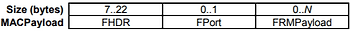

N is the number of octets of the application payload. The valid range for N is region specific and is defined in the “LoRaWAN regional physical layer specification” document.

N should be equal or smaller than:

N ≤ M - 1 - (length of FHDR in octets)

where M is the maximum MAC payload length.

**<u>(29) FRMPayload - MAC Frame Payload Encryption</u>**

_From the LoRaWAN Spec v1.0.3 line 574 section 4.3.3:_

If a data frame carries a payload, FRMPayload MUST be encrypted before the message integrity code (MIC) is calculated.

The encryption scheme used is based on the generic algorithm described in IEEE 802.15.4/2006 Annex B \[IEEE802154\] using AES with a key length of 128 bits.

The key K used depends on the FPort of the data message:

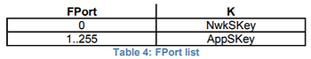

The fields encrypted are:

pld = FRMPayload

For each data message, the algorithm defines a sequence of Blocks Ai for i = 1..k with k = ceil(len(pld) / 16):

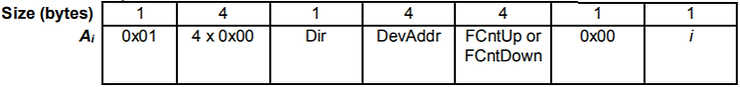

The direction field (Dir) is 0 for uplink frames and 1 for downlink frames.

The blocks Ai are encrypted to get a sequence S of blocks Si:

Si = aes128\_encrypt(K, Ai) for i = 1..k

S = S1 | S2 | .. | Sk

Encryption and decryption of the payload is done by truncating

(pld | pad16) xor S

to the first len(pld) octets.

**<u>(30) MType</u>**

_From the LoRaWAN Spec v1.0.3 line 385 section 4.2.1:_

The LoRaWAN distinguishes between six different MAC message types: **join request**, **join accept**, **unconfirmed data up/down**, and **confirmed data up/down**.

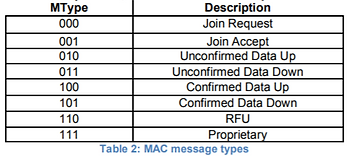

**<u>(32) Major - Major version of data message</u>**

_From the LoRaWAN Spec v1.0.3 line 401 section 4.2.2:_

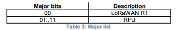

Note: The Major version specifies the format of the messages exchanged in the join procedure (see Chapter 6.2) and the first four bytes of the MAC Payload as described in Chapter 4. For each major version, end-devices may implement different minor versions of the frame format. The minor version used by an end-device must be made known to the network server beforehand using out of band messages (e.g., as part of the device personalization information).

**<u>References</u>**

-   LoRaWAN™ Sepcification v1.0.3 at \[[<u>link</u>](https://lora-alliance.org/sites/default/files/2018-07/lorawan1.0.3.pdf)\] from \[[<u>link</u>](https://lora-alliance.org/resource-hub/lorawantm-specification-v103)\]
    
-   LoRaWAN™ Specification v1.1 at \[[<u>link</u>](https://lora-alliance.org/sites/default/files/2018-04/lorawantm_specification_-v1.1.pdf)\] from \[[<u>link</u>](https://lora-alliance.org/resource-hub/lorawantm-specification-v11)\]
    
-   EUI - The IEEE Standards Association at \[[<u>link</u>](https://standards.ieee.org/content/dam/ieee-standards/standards/web/documents/tutorials/eui.pdf)\]
    
-   Acquire MAC Addresses and other Unique Identifiers @ IEEE-SA - Registration Authority at \[[<u>link</u>](https://standards.ieee.org/products-services/regauth/index.html)\]
    
-   Hosting the Network Server, Application Server, and Join Server across different servers is covered in the _LoRaWAN backend Interfaces specification v1.0, LoRa Alliance_ at \[[<u>link</u>](https://lora-alliance.org/sites/default/files/2018-04/lorawantm-backend-interfaces-v1.0.pdf)\] from \[[<u>link</u>](https://lora-alliance.org/resource-hub/lorawantm-back-end-interfaces-v10)\]
    
-   "DevEui vs AppEui" posted at the LoRa community forum at \[[<u>link</u>](http://semtech.force.com/lora/lc_answers_questions?id=90644000000Pm8IAAS)\]
    
-   LoRaWAN Keys and IDs Overview RM1xx Series at \[[<u>link</u>](https://assets.lairdtech.com/home/brandworld/files/LoRaWAN%20Keys%20and%20IDs%20Overview.pdf)\]
    
-   LoRaWAN Address Space of The Things Network at \[[<u>link</u>](https://www.thethingsnetwork.org/docs/lorawan/address-space.html)\]
    
-   LoRaWAN image clipped from \[[<u>link</u>](https://lora-alliance.org/about-lorawan)\]
    

## **<u>LoRaWAN Spec Glossary</u>**

**ADR** Adaptive Data Rate

**AES** Advanced Encryption Standard

**AFA** Adaptive Frequency Agility

**AR** Acknowledgement Request

**CBC** Cipher Block Chaining

**CMAC** Cipher-based Message Authentication Code

**CR** Coding Rate

**CRC** Cyclic Redundancy Check

**DR** Data Rate

**ECB** Electronic Code Book

**ETSI** European Telecommunications Standards Institute

**EIRP** Equivalent Isotropically Radiated Power

**FSK** Frequency Shift Keying modulation technique

**GPRS** General Packet Radio Service

**HAL** Hardware Abstraction Layer

**IP** Internet Protocol

**LBT** Listen Before Talk

**LoRa™** Long Range modulation technique

**LoRaWAN™** Long Range Network protocol

**MAC** Medium Access Control

**MIC** Message Integrity Code

**RF** Radio Frequency

**RFU** Reserved for Future Usage

**Rx** Receiver

**RSSI** Received Signal Strength Indicator

**SF** Spreading Factor

**SNR** Signal Noise Ratio

**SPI** Serial Peripheral Interface

**SSL** Secure Socket Layer

**Tx** Transmitter

**USB** Universal Serial Bus