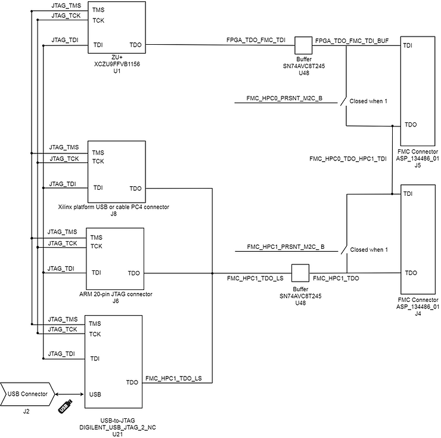
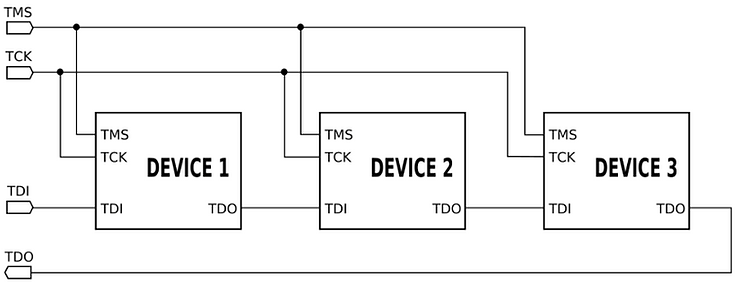

# Diagram of the ZCU102 JTAG Chain

This post shows a block diagram of the Xilinx ZCU102 Evaluation Board's JTAG chain.

Here is the JTAG chain on rev 1.0 and 1.1 of the ZCU102 as derived form the schematics:

Diagram available at \[[<u>link</u>](https://drive.google.com/open?id=1qhvHiXUlf03x5rUsxRKqzL9QNyOPYsuV)\]. A collection of just the JTAG connections available at \[[<u>link</u>](https://drive.google.com/file/d/1KY-nanmTuqQCGFneaJWeinVsSxKz8tPj/view?usp=sharing)\].

From the ZCU102 Evaluation Board User Guide:

_Vivado, SDK and or third-party tools (and PetaLinux Tools?) can establish a JTAG connection to the Zynq UltraScale+ MPSoC device through one of the three provided JTAG interfaces:_

_1\. Xilinx platform USB or cable PC4 connector (J8)_

_2\. ARM 20-pin JTAG connector (J6)_

_3\. Digilent SMT2.5 USB-to-JTAG module with off-module micro-USB connector (J2)_

**Note**: Only one of these connections can be used at a time.

If no FMC cards are installed, then the switches are closed and TDI can flow through to TDO as seen in this diagram from the JTAG Wiki:

TDI (Test Data In)

TDO (Test Data Out)

TCK (Test Clock)

TMS (Test Mode Select)

TRST (Test Reset) optional

**<u>References</u>**

-   <u>ZCU102 Evaluation Board User Guide</u> UG1182 (v1.3) August 2, 2017 at \[[<u>link</u>](https://www.xilinx.com/support/documentation/boards_and_kits/zcu102/ug1182-zcu102-eval-bd.pdf)\]
    
-   <u>ZCU102 Board Schematics</u> ([<u>zcu102-schematic-source-rdf0403.zip</u>](http://zcu102-schematic-source-rdf0403.zip/)) at \[[<u>link</u>](https://www.xilinx.com/member/forms/download/design-license.html?cid=473360&filename=zcu102-schematic-source-rdf0403.zip)\] (sign-in required)
    
-   <u>JTAG Wiki</u> at \[[<u>link</u>](https://en.wikipedia.org/wiki/JTAG)\]
    
-   Xilinx logo found via [<u>https://twitter.com/xilinxinc</u>](https://twitter.com/xilinxinc) at \[[<u>link</u>](https://pbs.twimg.com/profile_images/535545777020338176/pEWdIYq__400x400.png)\]