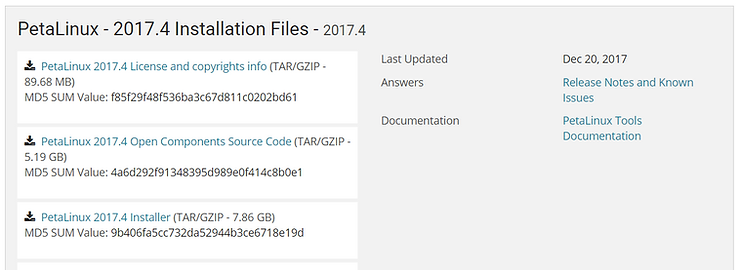

# Download and Install Xilinx's 2017.4 PetaLinux Tools


This post shows how to download and install Xilinx's 2017.4 PetaLinux Tools on Ubuntu 16.04.1 (available [here](http://old-releases.ubuntu.com/releases/16.04.1/), if you need help downloading and installing it click [here](http://www.zachpfeffer.com/single-post/2017/02/15/Installing-the-64-bit-PC-AMD64-desktop-image-of-Ubuntu-16041-LTS-Xenial-Xerus-in-Oracle-VM-VirtualBox-5114-running-in-Windows-7-Professional-Service-Pack-1-CurrentBuild-7601-on-a-ThinkPad-T460-model-20FNCTO1WW-with-an-IntelR-CoreTM-i7-6600U-CPU)). I wrote it because there is no document named **Installing PetaLinux Tools 2017.4** posted at Xilinx.com (the instructions are in the [UG1144 (v2017.4) PetaLinux Tools Reference Guide](http://www.xilinx.com/support/documentation/sw_manuals/xilinx2017_4/ug1144-petalinux-tools-reference-guide.pdf)).

Note: the whole process took me about 3 hours on a 40 Gbps download link. Most of the time is spent waiting for 7.8 GB's to download.


**Prerequisites**

1\. Get a Xilinx Account (update: you may be able to directly download PetaLinux Tools 2017.4 [here](http://xilinx.entitlenow.com/AXMetrics/retrieveProduct?token=Cb9Bt48v4akCo%2Bqp5zg%2BHjvPaLNAPWsKBOJpVTiIaajm6BWKgdT6qLsdO6qwZp4O09JPdA%2BU422C9MMyPNyRC7QYMBhEERcSaiIZgq%2BjfOE4d7nbpT9ydkWCrcf8EGPTIvrC8BRSs9a2HfOqHdYNeiP%2BAAovm2R6tt2RAoxQ7D4JcYIPcei%2Fa%2BgA5CjeO4i11nGCeJ9QU6xmZI%2FHPrOqKGwn%2FXhOoTd5rUenJ0NjHXzUtX2AEj1YT%2FUPrWxvpa8AF4Ge4VRRHrJk9svo4M53khg3aAkQ6HJY&akdm=1&archive=209898206&filename=petalinux-v2017.4-final-installer.run)).

Before starting, ensure you have a xilinx.com account. If you need one create it [here](http://www.xilinx.com/registration/create-account.html).

2\. Ensure you have the following packages by running:

```
sudo apt-get update
sudo apt-get install python3 dos2unix iproute2 gawk xvfb git make net-tools libncurses5-dev tftpd lib32z1 libssl-dev flex bison libselinux1 gnupg wget diffstat chrpath socat xterm autoconf libtool tar unzip texinfo zlib1g-dev gcc-multilib build-essential libsdl1.2-dev libglib2.0-dev libsdl-dev build-essential gcc-multilib glib2.0 automake screen pax gzip libtool-bin zlib1g:i386
```

PetaLinux Tools 2017.4 requires the following components:

| Tool / Library                                    | Ubuntu 16.04.1                             | Command to Check Version                    | Command to Get                       | Version pf Command or Package Tested in this Post            |
| ------------------------------------------------- | ------------------------------------------ | ------------------------------------------- | ------------------------------------ | ------------------------------------------------------------ |
| python                                            | python: 3.4.0                              | python3 --version                           | sudo apt-get install python3         | Python 3.5.2                                                 |
| dos2unix                                          | tofrodos_1.7.13+ds-2.debia n.tar.xz        | dos2unix --version                          | sudo apt-get install dos2unix        | dos2unix 6.0.4 (2013-12-30)                                  |
| ip                                                | iproute2 4.3.0-lubuntu3                    | ip -V                                       | sudo apt-get install iproute2        | ip utility, iproute2-ss151103                                |
| gawk                                              | gawk (1:4.1.3+dfsg-0.1)                    | gawk --version                              | sudo apt-get install gawk            | GNU Awk 4.1.3, API: 1.1 (GNU MPFR 3.1.4, GNU MP 6.1.0)       |
| xvfb                                              | xvfb (2:1.18.3-lubuntu2.3)                 | Type: man Xvfb and scroll to bottom of page | sudo apt-get install xvfb            | xorg-server 1.18.4                                           |
| git                                               | git 1.7.1 or above                         | git --version                               | sudo apt-get install git             | git version 2.7.4                                            |
| make                                              | make 3.81                                  | make --version                              | sudo apt-get install make            | GNU Make 3.81                                                |
| netstat                                           | net-tools                                  | net-tools --version                         | sudo apt-get install net-tools       | net-tools 1.60, netstat 1.42 (2001-04-15)                    |
| ncurses devel                                     | libncurses5 -dev                           | dpkg -s libncurses5-dev \| grep Version     | sudo apt-get install libncurses5-dev | 6.0+20160213-1ubuntu1                                        |
| tftp server                                       | tftpd                                      | dpkg -s tftpd \| grep Version               | sudo apt-get install tftpd           | 0.17-18ubuntu2                                               |
| zlib devel (also, install 32-bit of this version) | i386/zliblg-dev/1:1.2.8.dfsg -2ubuntu4-dev | dpkg -s lib32z1 \| grep Version             | sudo apt-get install lib32z1         | 1:1.2.8.dfsg-2ubuntu4.1                                      |
| openssl devel                                     | libssl-dev                                 | dpkg -s libssl-dev \| grep Version          | sudo apt-get install libssl-dev      | 1.0.2g-1ubuntu4.10                                           |
| flex                                              | flex                                       | flex --version                              | sudo apt-get install flex            | 2.6.0-11                                                     |
| bison                                             | bison                                      | bison --version                             | sudo apt-get install bison           | bison (GNU Bison) 3.0.4                                      |
| libselinux                                        | libselinuxl                                | dpkg -s libselinux1 \| grep Version         | sudo apt-get install libselinux1     | 2.4-3build2                                                  |
| gnupg                                             | gnupg                                      | dpkg -s gnupg \| grep Version               | sudo apt-get install gnupg           | 1.4.20-1ubuntu3.1                                            |
| wget                                              | wget                                       | wget --version                              | sudo apt-get install wget            | GNU Wget 1.17.1 built on linux-gnu.                          |
| diffstat                                          | diffstat                                   | diffstat --version                          | sudo apt-get install diffstat        | diffstat version 1.61                                        |
| chrpath                                           | chrpath                                    | chrpath --version                           | sudo apt-get install chrpath         | chrpath version 0.16                                         |
| socat                                             | socat                                      | socat -V                                    | sudo apt-get install socat           | socat version 1.7.3.1 on Feb 2 2016 21:25:06                 |
| xterm                                             | xterm                                      | xterm -version                              | sudo apt-get install xterm           | XTerm(322)                                                   |
| autoconf                                          | autoconf                                   | autoconf --version                          | sudo apt-get install autoconf        | autoconf (GNU Autoconf) 2.69                                 |
| libtool                                           | libtool                                    | dpkg -s libtool \| grep Version             | sudo apt-get install libtool         | 2.4.6-0.1                                                    |
| tar                                               | tar:1.24                                   | tar --version                               | sudo apt-get install tar             | tar (GNU tar) 1.28                                           |
| unzip                                             | unzip                                      | unzip -v                                    | sudo apt-get install unzip           | UnZip 6.00 of 20 April 2009, by Debian. Original by Info-ZIP. |
| texinfo                                           | texinfo                                    | dpkg -s texinfo \| grep Version             | sudo apt-get install texinfo         | 6.1.0.dfsg.1-5                                               |
| zliblg-dev                                        | zlib1g-dev                                 | dpkg -s zlib1g-dev \| grep Version          | sudo apt-get install zlib1g-dev      | 1:1.2.8.dfsg-2ubuntu4.1                                      |
| gcc-multilib                                      | gcc-multilib                               | dpkg -s gcc-multilib \| grep Version        | sudo apt-get install gcc-multilib    | 4:5.3.1-1ubuntu1                                             |
| build-essential                                   | build-essential                            | dpkg -s build-essential \| grep Version     | sudo apt-get install build-essential | 12.1ubuntu2                                                  |
| libsd11.2-dev                                     | libsd11.2-dev                              | dpkg -s libsdl1.2-dev \| grep Version       | sudo apt-get install libsdl1.2-dev   | 1.2.15+dfsg1-3                                               |
| libglib2.0-dev                                    | libglib2.0-dev                             | dpkg -s libglib2.0-dev \| grep Version      | sudo apt-get install libglib2.0-dev  | 2.48.2-0ubuntu1                                              |
| SDL-devel                                         |                                            | dpkg -s libsdl1.2-dev \| grep Version       | sudo apt-get install libsdl-dev      | 1.2.15+dfsg1-3                                               |
| glibc-devel                                       | Actually in build-essential                | dpkg -s build-essential \| grep Version     | sudo apt-get build-essential         | 12.1ubuntu2                                                  |
| 32-bit glibc                                      |                                            | dpkg -s gcc-multilib \| grep Version        | sudo apt-get install gcc-multilib    | 4:5.3.1-1ubuntu1                                             |
| glib2-devel                                       | Actually glib2.0                           | Just run sudo-apt-get                       | sudo apt-get install glib2.0         | 2.48.2-0ubuntu1                                              |
| automake                                          |                                            | automake --version \| grep Version          | sudo apt-get install automake        | automake (GNU automake) 1.15                                 |
| screen                                            | screen                                     | screen --version \| grep Version            | sudo apt-get install screen          | Screen version 4.03.01 (GNU) 28-Jun-15                       |
| pax                                               | pax                                        | dpkg -s pax \| grep Version                 | sudo apt-get install pax             | 1:20151013-1                                                 |
| gzip                                              | gzip                                       | gzip --version                              | sudo apt-get install gzip            | gzip 1.6                                                     |

A Google Sheet version of this table is at [link](http://docs.google.com/spreadsheets/d/1nY7Lo8e-sI7Epsaqmc2Cp4rVW06rk8gLufvELF-tN2E/edit?usp=sharing).

Additional:

You also need to install libtool-bin and zlib1g:i386

I used:

```
sudo apt-get install libtool-bin
dpkg -s libtool-bin
```

Version: 2.4.6-0.1

... and:

I used:

```
sudo apt-get install zlib1g:i386
dpkg -s zlib1g:i386
```

Version: 1:1.2.8.dfsg-2ubuntu4.1

3\. Install Make 3.81

Note: This was run after getting all of the packages listed above.

I'm fairly sure PetaLinux Tools relies on Make 3.81. To install a local copy do the following:

```
# Put a custom bin folder in place and update the path to check it first
LOCALTOOLS=$(pwd)/tools
echo $LOCALTOOLS
mkdir -p $LOCALTOOLS  
echo export PATH=$LOCALTOOLS/bin:\$PATH > set_petalinux_env.sh
. ./set_petalinux_env.sh
# Test it
mkdir -p $LOCALTOOLS/bin
echo echo Hello > $LOCALTOOLS/bin/test-set_petalinux_env.sh
chmod +x $LOCALTOOLS/bin/test-set_petalinux_env.sh
test-set_petalinux_env.sh

#Get and install make-3.81 locally
CURDIRBEFOREMAKE=$(pwd)
LOCALPACKAGE=$(pwd)/package
echo $LOCALPACKAGE
mkdir -p $LOCALPACKAGE
cd $LOCALPACKAGE
wget https://ftp.gnu.org/gnu/make/make-3.81.tar.gz
tar -xvzf $LOCALPACKAGE/make-3.81.tar.gz
cd make-3.81
./configure --prefix=$LOCALTOOLS
make
sudo make install
cd $CURDIRBEFOREMAKE

#Test make
which make # you should see $LOCALTOOLS/bin/make
make --version # should now show GNU Make 3.81
```

4\. Change your shell to bash with:

```
chsh -s /bin/bash
```

5\. Before you run any commands in petalinux run:

```
. ./set_petalinux_env.sh
```

**Download and Install**

1\. Go to: [https://www.xilinx.com/support/download/index.html/content/xilinx/en/downloadNav/embedded-design-tools.html](http://www.xilinx.com/support/download/index.html/content/xilinx/en/downloadNav/embedded-design-tools.html) 

2\. Scroll down and click on **PetaLinux 2017.4 Installer** or click this link: [https://www.xilinx.com/member/forms/download/xef.html?filename=petalinux-v2017.4-final-installer.run&akdm=1](http://www.xilinx.com/member/forms/download/xef.html?filename=petalinux-v2017.4-final-installer.run&akdm=1)



3\. After logging in to Xilinx.com, your 7.8 GB download will start.

4\. Once the download completes execute:

```
mv ~/Downloads/petalinux-v2017.4-final-installer.run $LOCALPACKAGE
mkdir -p $LOCALTOOLS/opt/pkg/petalinux
chmod +x $LOCALPACKAGE/petalinux-v2017.4-final-installer.run
$LOCALPACKAGE/petalinux-v2017.4-final-installer.run $LOCALTOOLS/opt/pkg/petalinux
```

You'll see this for a few minutes:

```
INFO: Checking installer checksum...
```

Then this for a little less time:

```
INFO: Extracting PetaLinux installer...
```

5\. At the following output:

```
LICENSE AGREEMENTS

PetaLinux SDK contains software from a number of sources.  Please review
the following licenses and indicate your acceptance of each to continue.

You do not have to accept the licenses, however if you do not then you may 
not use PetaLinux SDK.

Use PgUp/PgDn to navigate the license viewer, and press 'q' to close

Press Enter to display the license agreements
```

Press Enter to scroll through the license agreement. Press down to the end (or just press 'q'). Press q (if you haven't). Then press y:

```
Do you accept Xilinx End User License Agreement? [y/N] > y
```

6\. Again, press Enter to scroll through the license agreement. Press down to the end (or just press 'q'). Press q (if you haven't). Then press y:

```
Do you accept Webtalk Terms and Conditions? [y/N] > y
```

7\. Again, press Enter to scroll through the license agreement. Press down to the end (or just press 'q'). Press q (if you haven't). Then press y:

```
Do you accept Third Party End User License Agreement? [y/N] > y
```

You should see the following for a few minutes:\

```
INFO: Checking installation environment requirements...
INFO: Checking free disk space
INFO: Checking installed tools
INFO: Checking installed development libraries
INFO: Checking network and other services
WARNING: No tftp server found - please refer to "PetaLinux SDK Installation Guide" for its impact and solution
INFO: Installing PetaLinux...
```

Then

```
INFO: Checking PetaLinux installer integrity...
INFO: Installing PetaLinux SDK to "/home/pfefferz/tools/opt/pkg/petalinux/."
```

A full listing is available at [link](http://docs.google.com/document/d/1-RyJxLAYRG8xcFZL2G2svHZk3v0lPqX5U08yt1hjkYg/edit?usp=sharing) (and below).

Success

If you see the following output, the install succeeded:

```
INFO: PetaLinux SDK has been installed to /home/zach/tools/opt/pkg/petalinux/.
```

Possible Errors and Mitigation

If you see an error about a missing package, install the package and then rerun the command you used before (listed here again). Keep running through this loop until all packages have been installed.

```
$LOCALPACKAGE/petalinux-v2017.4-final-installer.run $LOCALTOOLS/opt/pkg/petalinux
```

8\. Make sure /bin/sh points to bash

If you see the following:

```
$ ls -l /bin/sh
lrwxrwxrwx 1 root root 4 Feb 23 22:18 /bin/sh -> dash
```

Run the following to ensure /bin/sh points to bash:

```
$ sudo ln -sf bash /bin/sh
```

Test it:

```
$ ls -l /bin/sh
lrwxrwxrwx 1 root root 4 Mar 12 19:38 /bin/sh -> bash
```

Note: to reverse this type:

```
sudo ln -sf dash /bin/sh
```

**Bugs I saw**

-   The [2017.4 PetaLinux Tools Reference Guide](http://www.xilinx.com/support/documentation/sw_manuals/xilinx2017_4/ug1144-petalinux-tools-reference-guide.pdf) references 2017.3 everywhere. For instance the installation instructions reference 2017.3:
    
-   This guide was tested with the 2017.4 version so everything should be okay.
    
-   You need to chmod +x the petalinux-v2017.4-final-installer.run file that was downloaded. This has been added to these instructions.
    
-   This note on page 6 is not accurate because the install doesn't take care of the package and command dependencies:
    
-   "Note: The reader of this document is assumed to have basic Linux knowledge, such as how to run Linux commands. The reader should also be aware of OS and Host system features such as OS bit version, Linux Distribution and Security Privileges."
    
-   The PetaLinux tools installer complains about **libtool** when it has been installed.
    
-   You need to install: **libtool-bin**
    

**Comments and Suggestions to Xilinx**

-   Because PetaLinux Tools requires a very specific set of components it would be good if it set it self up in a chroot.
    
-   If the install errors out, and the user has already accepted the licenses, don't make them accept them again.
    

**Reference**

-   The latest installation instructions I can find are in [ug1144-petalinux-tools-reference-guide.pdf](http://www.xilinx.com/support/documentation/sw_manuals/xilinx2017_4/ug1144-petalinux-tools-reference-guide.pdf).
    
-   I used [Free Online OCR](http://www.onlineocr.net/) to convert the Table 1-3: Packages and Linux Workstation Environments to an Excel spreadsheet which I then converted into an HTML table by using the [No-Cruft Excel to HTML Table Converter](http://pressbin.com/tools/excel_to_html_table/index.html) + a little styling [help](http://www.w3schools.com/css/css_table.asp).
    
-   Tux from [link](http://en.wikipedia.org/wiki/Tux) (found via Google image search).
    

**Note**

This install was actually done on a Linux Mint 18.2 Sonya (GNU/Linux 4.13.0-31-generic x86\_64) which is based on the Ubuntu 16.04 package base. See [link](http://www.linuxmint.com/rel_sonya_cinnamon_whatsnew.php).

**Full PetaLinux Install Log**

```
pfefferz@plc2:~$ $LOCALPACKAGE/petalinux-v2017.4-final-installer.run $LOCALTOOLS/opt/pkg/petalinux
INFO: Checking installer checksum...
INFO: Extracting PetaLinux installer...

LICENSE AGREEMENTS

PetaLinux SDK contains software from a number of sources.  Please review
the following licenses and indicate your acceptance of each to continue.

You do not have to accept the licenses, however if you do not then you may 
not use PetaLinux SDK.

Use PgUp/PgDn to navigate the license viewer, and press 'q' to close

Press Enter to display the license agreements
Do you accept Xilinx End User License Agreement? [y/N] > y
Do you accept Webtalk Terms and Conditions? [y/N] > y
Do you accept Third Party End User License Agreement? [y/N] > y
INFO: Checking installation environment requirements...
INFO: Checking free disk space
INFO: Checking installed tools
INFO: Checking installed development libraries
INFO: Checking network and other services
WARNING: No tftp server found - please refer to "PetaLinux SDK Installation Guide" for its impact and solution
INFO: Installing PetaLinux...
INFO: Checking PetaLinux installer integrity...
INFO: Installing PetaLinux SDK to "/home/pfefferz/tools/opt/pkg/petalinux/."
INFO: Installing PetaLinux zynqMP Yocto SDK to "/home/pfefferz/tools/opt/pkg/petalinux/./components/yocto/source/aarch64"...
PetaLinux Extensible SDK installer version 2017.4
=================================================
You are about to install the SDK to "/home/pfefferz/tools/opt/pkg/petalinux/components/yocto/source/aarch64". Proceed[Y/n]? Y
Extracting SDK.............................................done
Setting it up...
Extracting buildtools...
done
SDK has been successfully set up and is ready to be used.
Each time you wish to use the SDK in a new shell session, you need to source the environment setup script e.g.
 $ . /home/pfefferz/tools/opt/pkg/petalinux/components/yocto/source/aarch64/environment-setup-aarch64-xilinx-linux
INFO: PetaLinux Yocto SDK for zynqMP has been successfully installed.
INFO: Installing PetaLinux zynq Yocto SDK to "/home/pfefferz/tools/opt/pkg/petalinux/./components/yocto/source/arm"...
PetaLinux Extensible SDK installer version 2017.4
=================================================
You are about to install the SDK to "/home/pfefferz/tools/opt/pkg/petalinux/components/yocto/source/arm". Proceed[Y/n]? Y
Extracting SDK.........................................done
Setting it up...
Extracting buildtools...
done
SDK has been successfully set up and is ready to be used.
Each time you wish to use the SDK in a new shell session, you need to source the environment setup script e.g.
 $ . /home/pfefferz/tools/opt/pkg/petalinux/components/yocto/source/arm/environment-setup-cortexa9hf-neon-xilinx-linux-gnueabi
INFO: PetaLinux Yocto SDK for zynq has been successfully installed.
INFO: Installing PetaLinux microblaze (Full) Yocto SDK to "/home/pfefferz/tools/opt/pkg/petalinux/./components/yocto/source/microblaze_full"...
PetaLinux Extensible SDK installer version 2017.4
=================================================
You are about to install the SDK to "/home/pfefferz/tools/opt/pkg/petalinux/components/yocto/source/microblaze_full". Proceed[Y/n]? Y
Extracting SDK.............................done
Setting it up...
Extracting buildtools...
done
SDK has been successfully set up and is ready to be used.
Each time you wish to use the SDK in a new shell session, you need to source the environment setup script e.g.
 $ . /home/pfefferz/tools/opt/pkg/petalinux/components/yocto/source/microblaze_full/environment-setup-microblazeel-v10.0-bs-cmp-mh-div-xilinx-linux
INFO: Installing PetaLinux microblaze (Lite) Yocto SDK to "/home/pfefferz/tools/opt/pkg/petalinux/./components/yocto/source/microblaze_lite"...
PetaLinux Extensible SDK installer version 2017.4
=================================================
You are about to install the SDK to "/home/pfefferz/tools/opt/pkg/petalinux/components/yocto/source/microblaze_lite". Proceed[Y/n]? Y
Extracting SDK.............................done
Setting it up...
Extracting buildtools...
done
SDK has been successfully set up and is ready to be used.
Each time you wish to use the SDK in a new shell session, you need to source the environment setup script e.g.
 $ . /home/pfefferz/tools/opt/pkg/petalinux/components/yocto/source/microblaze_lite/environment-setup-microblazeel-v10.0-bs-cmp-ml-xilinx-linux
INFO: PetaLinux Yocto SDK for microblaze has been successfully installed.
INFO: PetaLinux SDK has been installed to /home/pfefferz/tools/opt/pkg/petalinux/.
pfefferz@plc2:~$ 
```