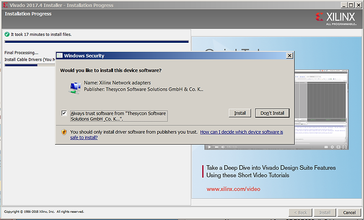

# Download, Install and License Vivado 2017.4 on Windows 7

This post lists the step-by-step instructions for downloading and installing Vivado 2017.4 on a Windows 7 machine and getting a 30-day evaluation license.

**Download Vivado**

1\. Go to [https://www.xilinx.com/products/design-tools/vivado.html](http://www.xilinx.com/products/design-tools/vivado.html)

and click on **Download Vivado Design Suite - HLX Editions**.

...and click on **Vivado HLx 2017.4: All OS installer Single-File Download**:

..and Sign in and click through the export acceptance.

[2. Go to ](http://www.7-zip.org/)http://www.7-zip.org/

Get 64-bit version: http://www.7-zip.org/a/7z1801-x64.exe

3\. Double click on it and install it.

4\. Right click on the tar.gz and select **Extract to Xilinx\_SDK\_2017.4\_1216\_1.tar**

5\. Open the resulting directory named **Xilinx\_SDK\_2017.4\_1216\_1.tar** and right click on **Xilinx\_Vivado\_SDK\_2017.4\_1216\_1.tar.** It took my T460 about a minute and and a half to extract the archive.

6\. Click on xsetup. Then Click Yes to allow Windows to install it.

xsetup will launch

7\. Click **Next>**. Check all the **Agree** boxes. Click **Next>**. Select **Vivado HL System Edition**. Click **Next>**.

8\. Ensure the **Software Development Kit (SDK)** and **Engineering Sample Devices** are checked.

9\. Click **Next>**.

10\. Install into **C:\\Xilinx** (the default). Click **Next>** and accept to have the installer create C:\\Xilinx. Note the installation take 43.41 GBs of diskspace.

11\. Now click install on the **Installation Summary** screen.

12\. Disconnect any JTAG cables and click okay.

13\. Click **Always trust software from "Jungo LTD"** and click **Install**.

14\. Click **Always trust software from "Xilinx".** and click **Install**.

15\. Click **Always trust software from "Thesycon Software".** and click **Install**.

16\. Ignore the MATLAB warning. Click **Ok** and **Ok** again**.**

If you miss any of these or accidentally select No (like I did when I accidentally clicked No on the Xilinx device software select **Add Design Tools or Devices 2017.4** after installation completes.

Select the **Install Cable Drivers (You MUST disconnect all Xilinx Platform Cable USB II cables before proceeding)** checkbox.

The click through to install the one you accidentally missed.

**Licensing**

1\. Click the **Get Vivado or IP Evaluation Licenses** radio button and click **Connect Now**.

2\. Accept the Name and Address Verification (again).

3\. Select the **Vivado HLS Evaluation License** and click **Generate Node Locked License**.

4\. Select your **Disk** (since it likely won't change in 30 days) and Click **Next** and **Next** again.

5\. You'll get something like this text:

6\. Check your email. The directions for Windows listed in the email appear wrong. Save the license to **C:\\licenses\\Xilinx.lic**. In the License Manager enter C:\\licenses\\Xilinx.lic into XILINXD\_LICENSE\_FILE and click Set.

7\. Close all Xilinx related programs (except the License Manager from Xilinx - a point missing from the Information Message) and click OK.

8\. Now launch Vivado.

**Notes**

Specific machine specs listed at [link](http://www.zachpfeffer.com/single-post/2017/01/28/New-T460-System-Information).