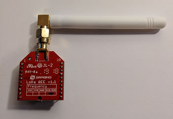
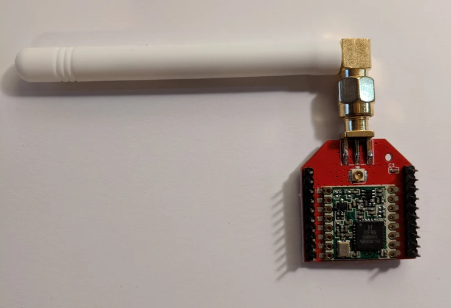
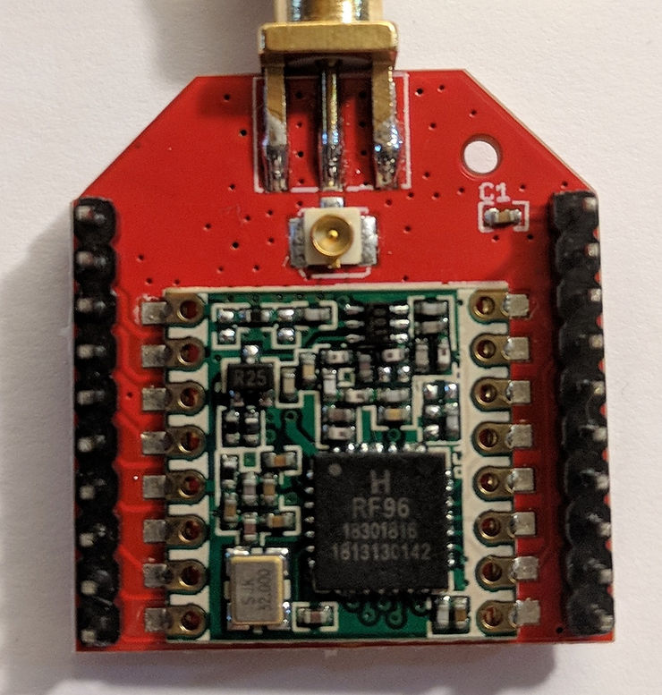
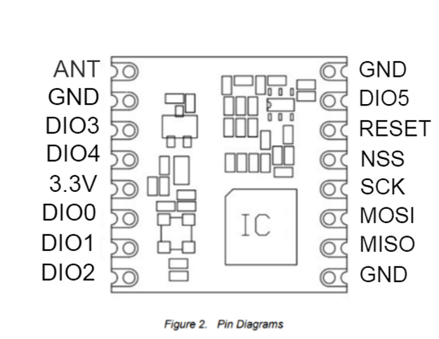
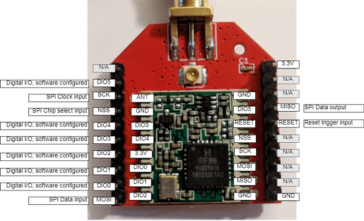

# Dragino LoRa BEE v1.1 + HopeRF RFM95-98(W) Pictures, Pinout and Doc Links

This post contains pictures, pinouts and documentation links for the Dragino LoRa BEE v1.1 and the HopeRF RFM95-98(W).

**<u>Both Sides</u>**

**<u>LoRa BEE v1.1 Pin Breakout</u>**

**<u>The RFM95</u>**

On the other side of the board is the RFM95W module from HopeRF.

**<u>RFM95 Pinout</u>**

**<u>RFM95 Pins + LoRa BEE v1.1 Pinout</u>**

Here is the RFM95 + LoRa BEE v1.1 Pinout:

**<u>References</u>**

Dragino LoRa BEE wiki at \[[link](http://wiki.dragino.com/index.php?title=Lora_BEE)\]

RF Solutions RFM95W-915S2 at \[[link](https://www.digikey.com/product-detail/en/rf-solutions/RFM95W-915S2/RFM95W-915S2-ND/6564923)\]

RFM95-98(W) from HopeRF Electronic Datasheet at \[[link](http://www.hoperf.com/upload/rf/RFM95_96_97_98W.pdf)\]

The SX1276 Modules Shootout – HopeRF’s RFM95W vs NiceRF’s LORA1276-C1 vs HPDTEK’s HPD13 at \[[link](http://www.rocketscream.com/blog/2017/08/21/the-sx1276-modules-shootout-hoperfs-rfm95w-vs-nicerfs-lora1276-c1-vs-hpdteks-hpd13/)\]

Semtech's SX1276/77/78/79 - 137 MHz to 1020 MHz Low Power Long Range Transceiver at \[[link](https://www.semtech.com/uploads/documents/DS_SX1276-7-8-9_W_APP_V5.pdf)\]