# Enable and Disable the Quick Launch Bar in Windows 7 Service Pack 1 (SP 1, CurrentBuild 7601)

## Enable the Quick Launch Bar

**1.** Right-click an empty area of the taskbar, point to Toolbars, and then right click New toolbar.

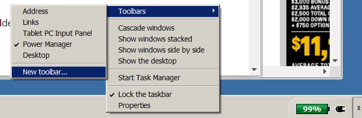

Step 1 quoted directly from Step 1 of \[1\].

**2.** In the dialog box, copy and then paste the following folder name to the Folder box, and then left-click Select Folder:

%AppData%\\Microsoft\\Internet Explorer\\Quick Launch

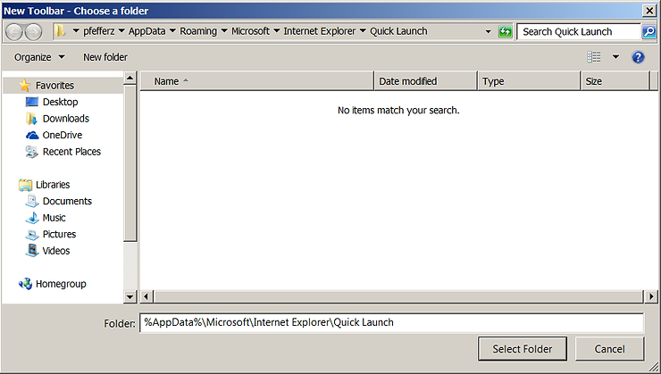

Step 2 quoted directly from Step 2 of \[1\].

**3.** Right-click an empty area of the taskbar, point to Lock the taskbar, and then left-click.

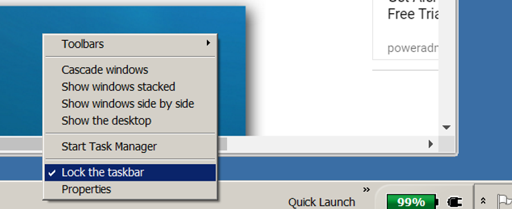

**4.** Now you see the Quick Launch bar with the text on the rightside of the task bar. To hide the Quick Launch text and program titles, right-click Quick Launch, clear Show Text and Show title.

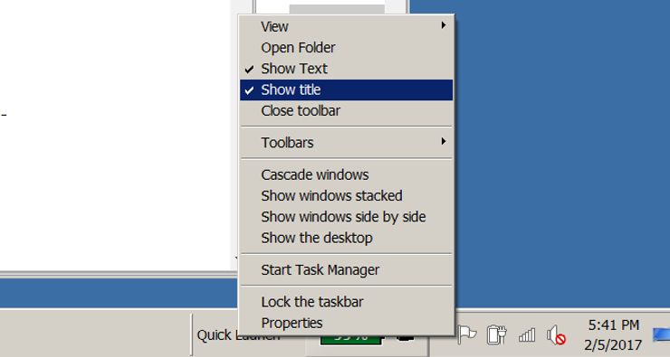

Step 4 quoted directly from Step 3 of \[1\].

**5.** Unpin each of the applications by left clicking on each and right clicking on Unpin this application from the taskbar.

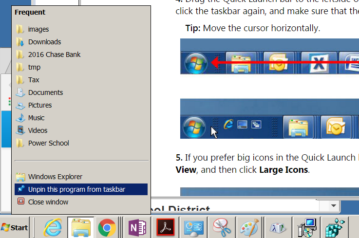

**6.** Drag the Quick Launch bar to the leftside of the task bar. **You must drag it all the way to the Start button** for this to work.

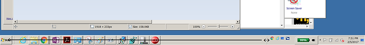

Step 6 was paraphrased from Step 4 of \[1\].

**7.** Now drag the other line over.

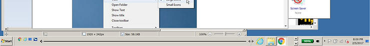

**8.** Done.

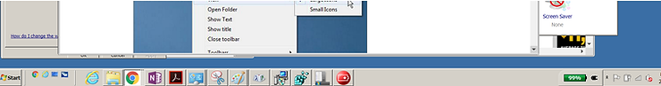

## Disable the Quick Launch Bar

Right-click an empty area of the taskbar, point to Toolbars, and then left-click Quick Launch.

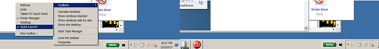

Paraphrased from Step 7 of \[2\].

## Reference

I used:

-   \[1\] [Guided Help: Enable the Quick Launch bar in Windows 7](http://support.microsoft.com/en-us/help/975784/guided-help-enable-the-quick-launch-bar-in-windows-7) from Microsoft
    
-   \[2\] [How to Enable or Disable Quick Launch Bar Toolbar in Windows 7](http://www.david-amador.com/2009/01/how-to-enable-or-disable-quick-launch-bar-toolbar-in-windows-7/) from David Amador's 2009 instructions
    
-   \[3\] [Add the Quick Launch Bar to the Taskbar in Windows 7](http://www.howtogeek.com/howto/windows-7/add-the-quick-launch-bar-to-the-taskbar-in-windows-7/) from Lowell Hedding's (How-To Geek)
    
-   \[4\] Google, "how to find which windows 7 build" instant search result at [ccm.net](http://www.google.com/url?sa=t&rct=j&q=&esrc=s&source=web&cd=2&cad=rja&uact=8&ved=0ahUKEwj7vfHp0vrRAhXpqFQKHa55ChEQFggcMAE&url=http%3A%2F%2Fccm.net%2Ffaq%2F15023-windows-7-check-the-current-build-version&usg=AFQjCNElrgMO5GYDBtauUP14XPpjqwybVA&sig2=Y5BO6B791vbB9UhrTsQmNg&bvm=bv.146094739,d.cGw)
    

## Notes

**1.** I started with Microsoft's write up and got stuck. I needed Lowell Hedding's tip about unlocking the task bar and David Amador's tip on un-pinning all the applications to move the Quick Launch bar to the left.

In Article ID: 975784 - Last Review: Sep 23, 2011 - Revision: 1

Before you do Step 3:

_3\. Now you see the Quick Launch bar with the text on the rightside of the task bar. To hide the Quick Launch text and program titles, right-click Quick Launch, clear Show Text and Show title._

...you need to unlock the taskbar. You also need to unpin the apps. The complete steps are detailed above.

Step 4 does note:

_4\. Drag the Quick Launch bar to the leftside of the task bar. If you cannot move the Quick Launch bar, right-click the taskbar again, and make sure that the Lock the taskbar option is cleared ._

...but you need to do this in Step 3 or before.

**3.** I used Character Map select and copy "arrows" to paste into Microsoft Paint:

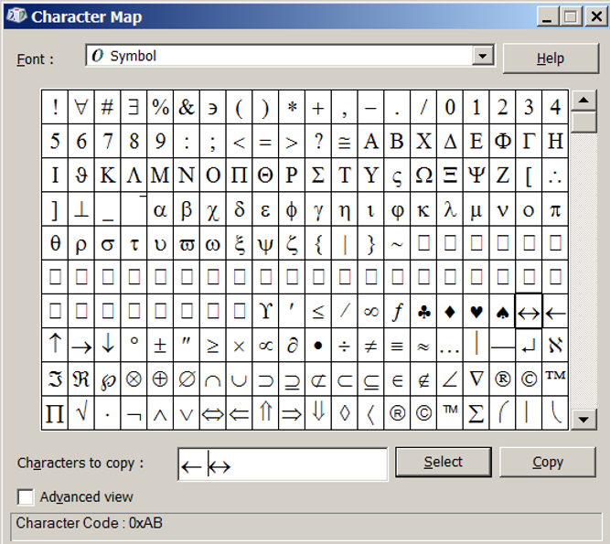

Type charmap into the Run command field to launch Character Map:

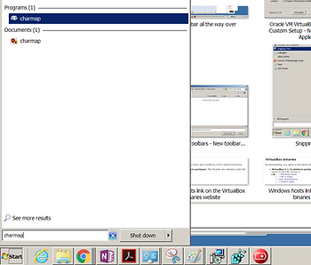

**4.** To find your Windows build number do this:

1.  Open the registry editor (Start > Run > regedit)
    
2.  Go to: HKEY\_LOCAL\_MACHINE>Software>Microsoft>Windows NT>CurrentVersion.
    
3.  Double click on the CurrentBuild key located in the right pane
    

Copied from \[4\].