# Enable copying and pasting text between an Ubuntu 16.04.2 guest running in Oracle VM VirtualBox 5.1.

These verified instructions show how to enable **Bidirectional copying and pasting** of text from an Ubuntu 16.04.2 guest running in VirtualBox 5.1.14 on a Windows 7 host to the Windows 7 host and from the Windows 7 host to the Ubuntu 16.04.2 guest running in VirtualBox 5.1.14.

Before starting, make sure the Ubuntu 16.04.2 image is running in VirtualBox 5.1.14. If you haven't done this, see this [link](http://www.zachpfeffer.com/single-post/2017/02/17/Installing-the-64-bit-PC-AMD64-desktop-image-of-Ubuntu-16042-LTS-Xenial-Xerus-in-Oracle-VM-VirtualBox-5114-running-in-Windows-7-Professional-Service-Pack-1-CurrentBuild-7601-on-a-ThinkPad-T460-model-20FNCTO1WW-with-an-IntelR-CoreTM-i7-6600U-CPU) on how to run Ubuntu 16.04.2 in VirtualBox 5.1.14.

Note: if you're running Oracle VM VirtualBox Version 5.2.12 r122591 (Qt5.6.2) click [[link](http://www.centennialsoftwaresolutions.com/blog/enable-copy-paste-between-windows-7-and-ubuntu-16-04-3-on-oracle-vm-virtualbox)] for new instructions.

## Step 1. Install guest additions

**1.** Click on ***[Optical Drive] Empty\***.  

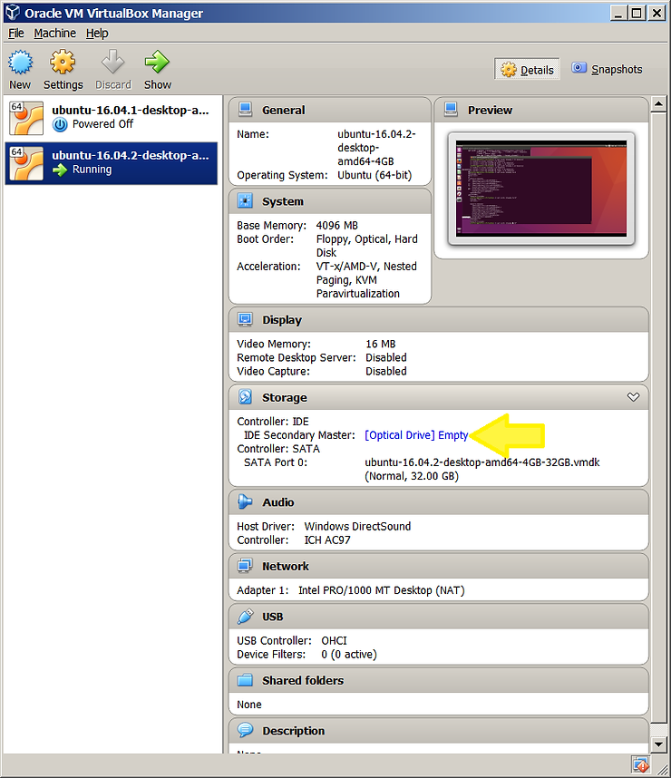

Note

To remove the disk, right click on the disc icon and click Eject in the Ubuntu 16.04.2 image running in VirtualBox 5.1.14.

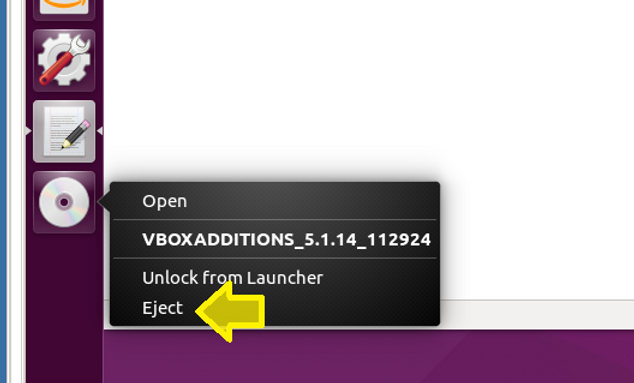

**2.** Select **_Choose disk image..._**

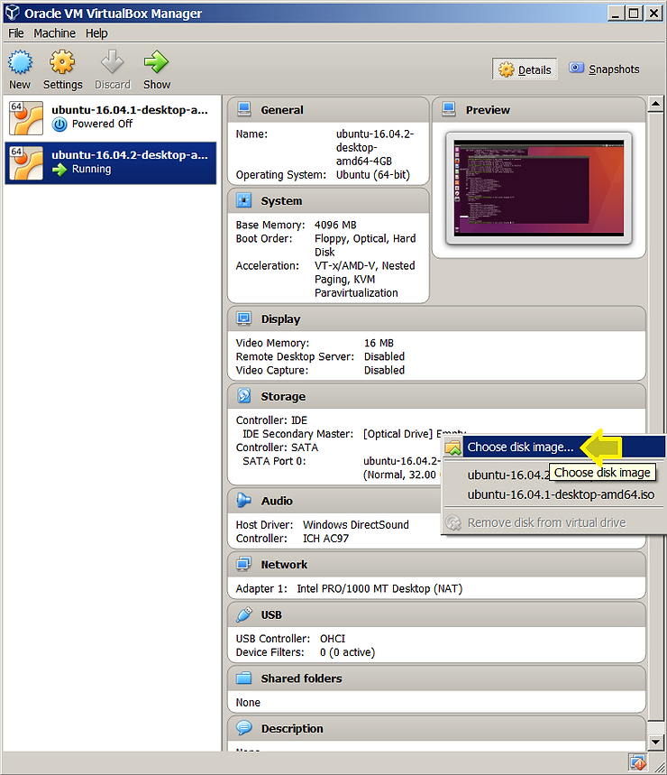

**3.** Browse to **_C:\\Program Files\\Oracle\\VirtualBox_** and double-click the **_VBoxGuestAdditions_** Disc Image File.

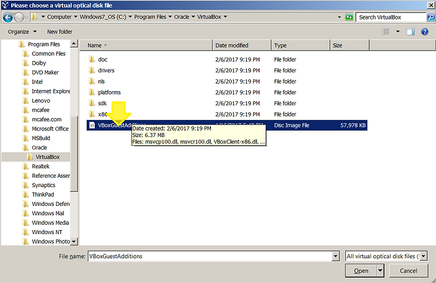

**4.** Go back into Ubuntu 16.04.2. You will see a box that says, **_"VBOXADDITIONS\_5.1.14\_112924" contains software intended to be automatically started. Would you like to run it?_** Click on **_Run_**.

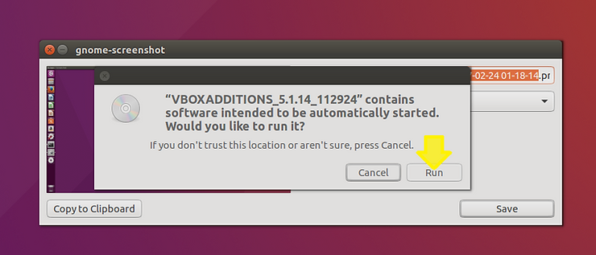

**5.** Enter in your super user password and click **_Authenticate_**.

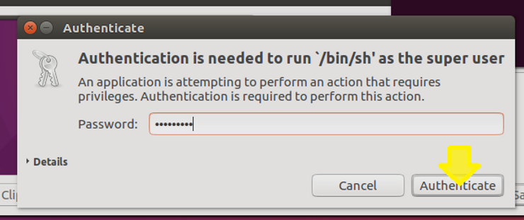

**6.** A terminal will pop up. Once you see **_Press Return to close this window..._** the VBoxGuestAdditions have been installed.

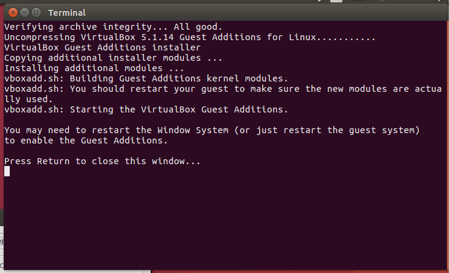

**7.** Click the **_gear icon_** in the upper right-hand corner then click **_Shut down..._**

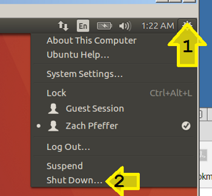

**8.** Click the **_Restart Button_**.

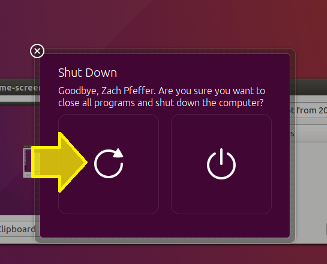

## Step 2. Enable bi-directional copy and paste between Windows 7 and Ubuntu 16.04.2 running in VirtualBox 5.1.14 and Ubuntu 16.04.2 running in VirtualBox 5.1.14 and Windows 7

In the VirtualBox 5.1.14 menu bar click on **_Devices_** then hover over **_Shared Clipboard_** to bring up the **_Shared Clipboard_** sub-menu, then click on **_Bidirectional_**.

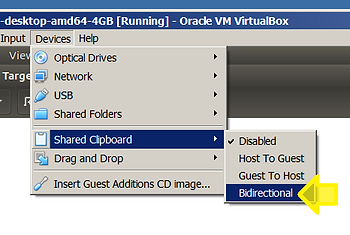

## Step 3. Test copy and paste between Windows 7 and Ubuntu 16.04.2 running in VirtualBox 5.1.14

**1.** Right-click on the Windows 7 desktop. Click **_New_** then click **_Text Document_**.

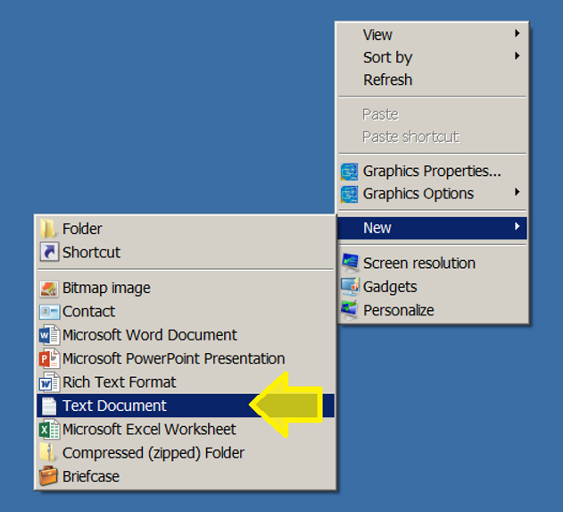

**2.** Name the file: **_This is a test_** and double click on it to open it.

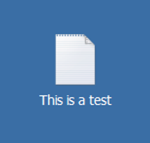

**3.** Type **_Hello, World!_**.

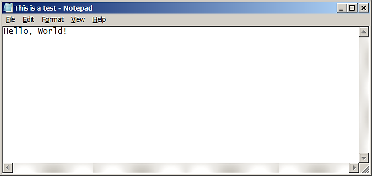

**4.** Click **_Edit_** then click **_Select All_**.

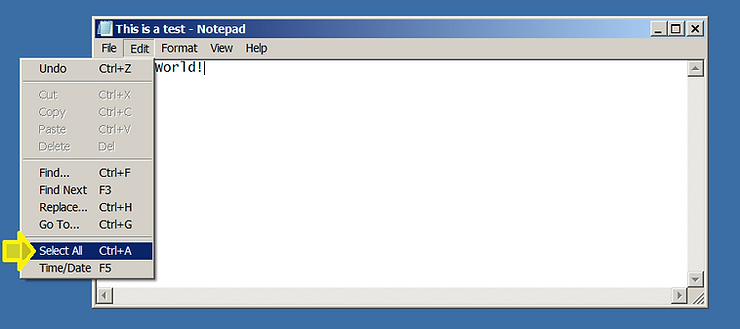

**5.** Click **_Copy_**.

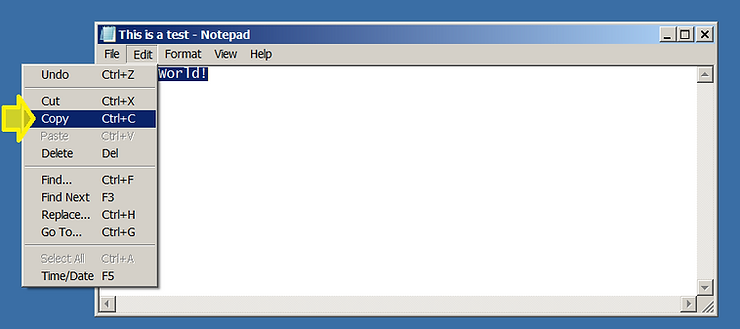

**6.** In Ubuntu 16.04.2, right-click on the desktop. Hover your mouse over **_New Document_** then click on the **_Empty Document_** pop-out.

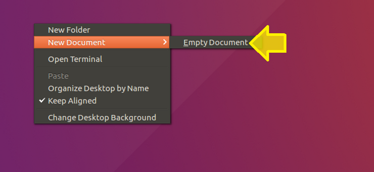

**7.** Name the file **_Target_** and double-click on it.

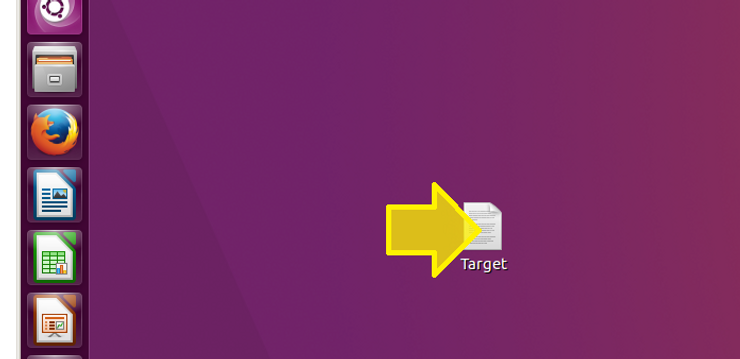

**8.** Right-click on **_text document_**. Click **_Paste_**.

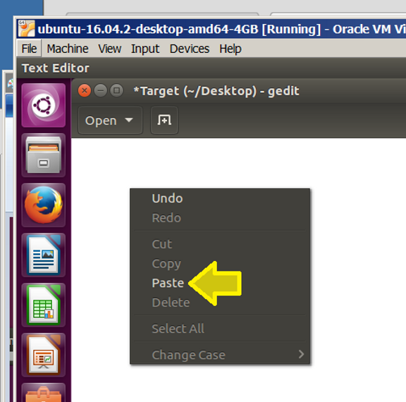

**9.** You should see **_Hello, World!_** in the text editor.

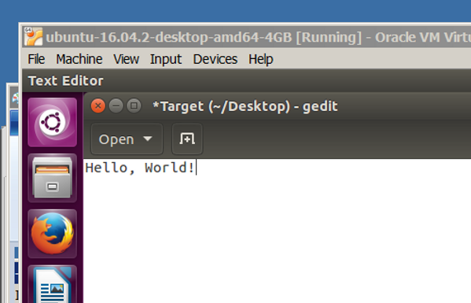

## Step 4. Test copy and paste between Ubuntu 16.04.2 running in VirtualBox 5.1.14 and Windows 7

**1.** Change the text to say: **_Goodbye, World!_**.

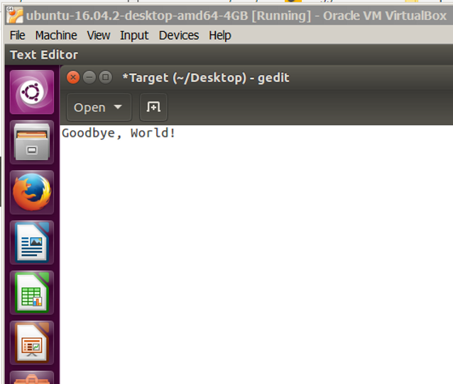

**2.** Right click on the text editor in Ubuntu and click on **_Select All_**.

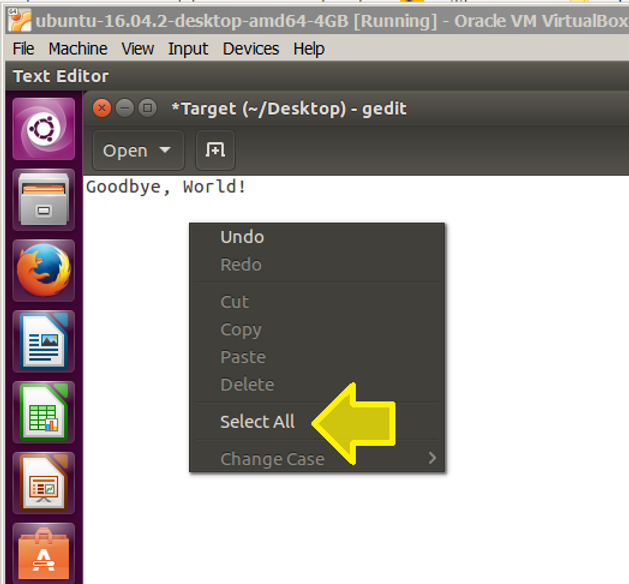

**3.** Right click on the text editor in Ubuntu 16.04.2 and click on **_Copy_**.

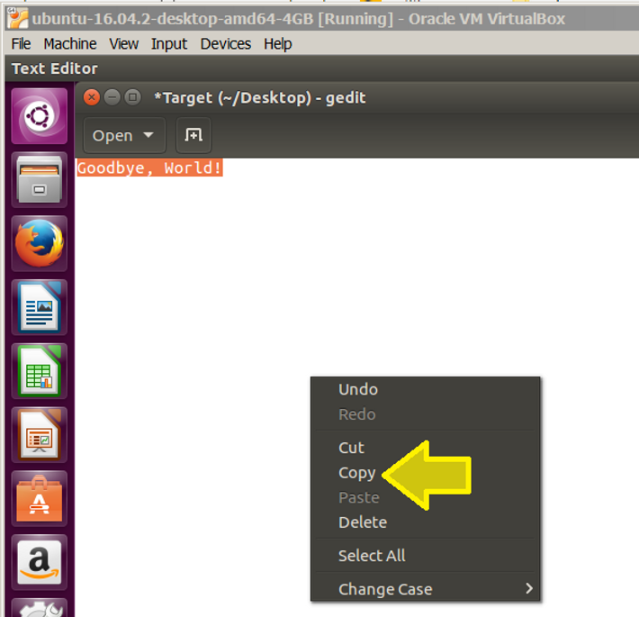

**4.** In the Windows text editor, delete: **_Hello, World!_** by using the Backspace key.

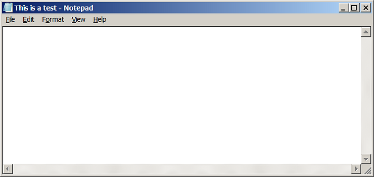

**5.** Click on the **_Edit_** Menu item then click on **_Paste_**.

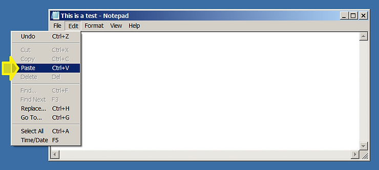

**6.** You should see **_Goodbye, World_** in the the Window's text editor (Notepad).

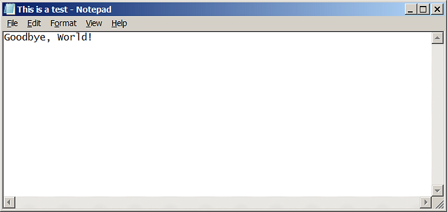

**Want More?**

Click [here](http://www.zachpfeffer.com/single-post/Add-a-disk-to-an-Ubuntu-VirtualBox-VM) to add a second disk to Ubuntu running in a VM.

Reference

[1] [https://www.virtualbox.org/manual/ch04.html#idm1948](http://www.virtualbox.org/manual/ch04.html#idm1948)

[2] [The description of the Menu bar from Microsoft ](http://msdn.microsoft.com/en-us/library/windows/desktop/dn742392(v=vs.85).aspx)

[3] The VirtualBox logo is from [https://www.virtualbox.org/](http://www.virtualbox.org/)