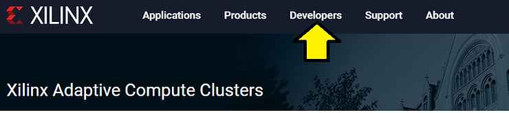
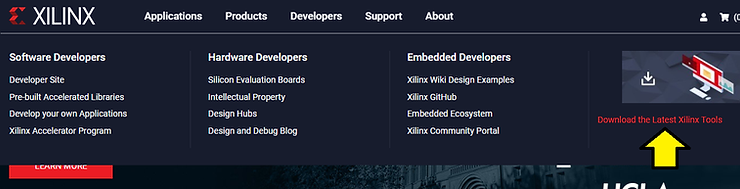
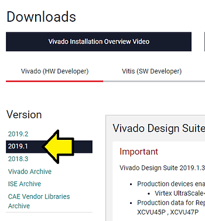
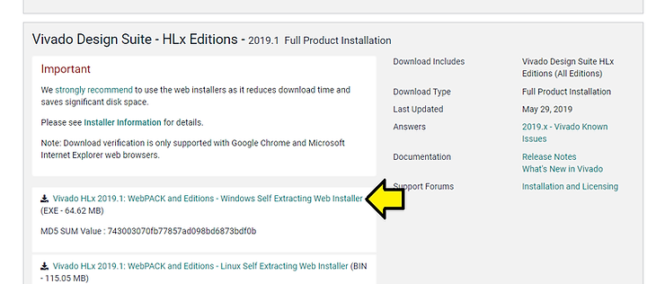
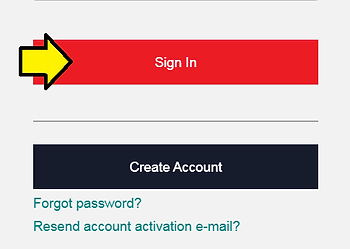

# Find and Download Xilinx's Vivado 2019.1 Windows Self Extracting Web Installer

This post walks through finding and downloading Vivado 2019.1 on Windows 7. It was written on May 6th, 2020.

**<u>Prerequisites</u>**

A Xilinx login. Get one at [https://login.xilinx.com/] (click the **Create Account** button).

**<u>Steps</u>**

Step 1: Go to [[https://www.xilinx.com](https://www.xilinx.com/)]

Step 2: Click **Developers**

Step 3: Click **Download the Latest Xilinx Tools**

Note: This takes you to [https://www.xilinx.com/support/download.html].

Step 4: Click **2019.1**

Step 5: Click **Vivado HLx 2019.1: WebPACK and Editions - Windows Self Extracting Web Installer** \[[<u>link</u>](https://www.xilinx.com/member/forms/download/xef-vivado.html?filename=Xilinx_Vivado_SDK_Web_2019.1_0524_1430_Win64.exe)\] (link requires login) 64.62 MB (this is just the downloader, the actual download is much bigger)

Note: Here's are the \[[<u>release notes</u>](https://www.xilinx.com/support/documentation/sw_manuals/xilinx2019_1/ug973-vivado-release-notes-install-license.pdf)\] for 2019.1 (the link on the web goes to 2019.2)

Step 6: Click **Sign In**

Step 7: Click **Download**

Note: Downloads **Xilinx\_Vivado\_SDK\_Web\_2019.1\_0524\_1430\_Win64.exe**

**<u>References</u>**

Xilinx logo from \[[<u>link</u>](https://twitter.com/xilinxinc)\]