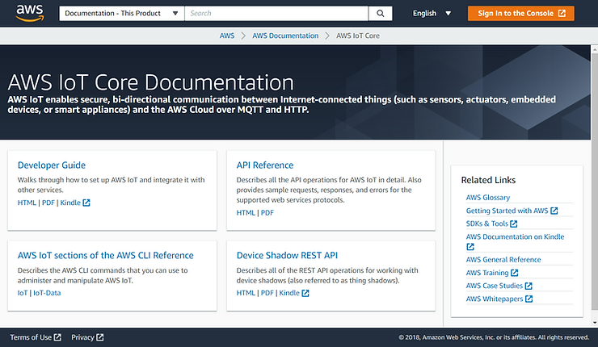

# Find AWS IoT Core Documentation

This post shows you how to find **AWS IoT Core Documentation** from https://aws.amazon.com.

**<u>Steps</u>**

**1**. Go to \[[https://aws.amazon.com/](https://aws.amazon.com/)\]

**2**. (A) Hover over **Documentation** and (B) click **Documentation**

**3**. At \[[link](https://docs.aws.amazon.com/index.html#lang/en_us)\] (A) scroll down and (B) click **AWS IoT Core**

**4**. You'll arrive at \[[link](https://docs.aws.amazon.com/iot/index.html?id=docs_gateway#lang/en_us)\]:

**<u>Reference</u>**

AWS icon from \[[link](https://goo.gl/images/4jUMSB)\]