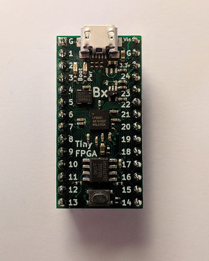

# Fix tinyprog error "serial.serialutil.SerialException: Cannot configure port"



This post shows a solution to "serial.serialutil.SerialException: Cannot configure port, something went wrong." when using tinyprog. The solution is: close other programs that are using the COM port.

**Note**

This problem may be seen in other Python programs.

**Symptom**

After typing **tinyprog --program design.bin** the program hangs and then after sometime you see:

```
C:\Users\pfefferz\Documents\tmp\prj>tinyprog --program top_level_bitmap.bin
   TinyProg CLI
   ------------
   Using device id 1d50:6130
   Only one board with active bootloader, using it.
Traceback (most recent call last):
 File "c:\users\pfefferz\appdata\local\programs\python\python36\lib\runpy.py",
line 193, in _run_module_as_main
   "__main__", mod_spec)
 File "c:\users\pfefferz\appdata\local\programs\python\python36\lib\runpy.py",
line 85, in _run_code
   exec(code, run_globals)
 File "C:\Users\pfefferz\AppData\Local\Programs\Python\Python36\Scripts\tinypro
g.exe\__main__.py", line 9, in 
 File "c:\users\pfefferz\appdata\local\programs\python\python36\lib\site-packag
es\tinyprog\__main__.py", line 323, in main
   with active_port:
 File "c:\users\pfefferz\appdata\local\programs\python\python36\lib\site-packag
es\tinyprog\__init__.py", line 60, in __enter__
   self.ser = serial.Serial(self.port_name, timeout=1.0, writeTimeout=1.0).__en
ter__()
 File "c:\users\pfefferz\appdata\local\programs\python\python36\lib\site-packag
es\serial\serialwin32.py", line 31, in __init__
   super(Serial, self).__init__(*args, **kwargs)
 File "c:\users\pfefferz\appdata\local\programs\python\python36\lib\site-packag
es\serial\serialutil.py", line 240, in __init__
   self.open()
 File "c:\users\pfefferz\appdata\local\programs\python\python36\lib\site-packag
es\serial\serialwin32.py", line 78, in open
   self._reconfigure_port()
 File "c:\users\pfefferz\appdata\local\programs\python\python36\lib\site-packag
es\serial\serialwin32.py", line 222, in _reconfigure_port
   'Original message: {!r}'.format(ctypes.WinError()))
serial.serialutil.SerialException: Cannot configure port, something went wrong.
Original message: OSError(22, 'The semaphore timeout period has expired.', None,
121)
```

**Solution**

There is something running on Windows that current owns the port. In my case, I had VirtualBox open. Once I closed VirtualBox, I was able to successfully download:

```
C:\Users\pfefferz\Documents\tmp\prj>tinyprog --program top_level_bitmap.bin

    TinyProg CLI
    ------------
    Using device id 1d50:6130
    Only one board with active bootloader, using it.
    Programming COM2 with top_level_bitmap.bin
    Programming at addr 028000
    Waking up SPI flash
    135179 bytes to program
    Erasing: 100%|███████████████████████████| 135k/135k [00:01<00:00, 123kB/s]
    Writing: 100%|██████████████████████████| 135k/135k [00:02<00:00, 64.6kB/s]
    Reading: 100%|███████████████████████████| 135k/135k [00:00<00:00, 250kB/s]
    Success!
```

**References**

-   TinyFPGA BX User Guide at \[[link](https://tinyfpga.com/bx/guide.html)\]