# GCP IoT Core Quickstart Run-Through

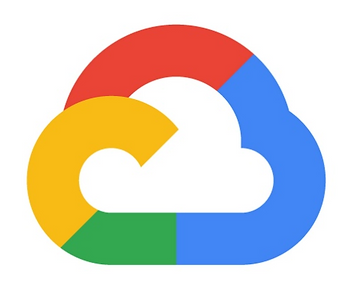

This post presents a run-through of the Google Cloud Platform (GCP) Internet of Things (IoT) Core Quickstart at \[[<u><span>link</span></u>](https://cloud.google.com/iot/docs/quickstart)\].

> **Before you begin**

> 1\. In the GCP Console, go to the Manage resources page and select or create a new project.

1\. Go to the Manage Resources page at \[[<u><span>link</span></u>](https://console.cloud.google.com/cloud-resource-manager)\]

2\. Log in with [google.cloud@centennialsoftwaresolutions.com](http://mqtt.googleapis.com:443/)

3\. Click **CREATE PROJECT**

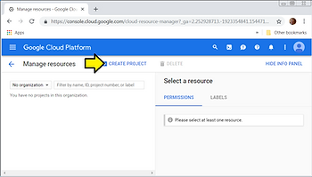

4\. (A) Name the project **Guppy 0001** and (B) click **CREATE**

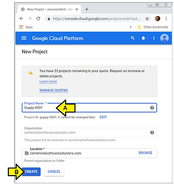

I see:

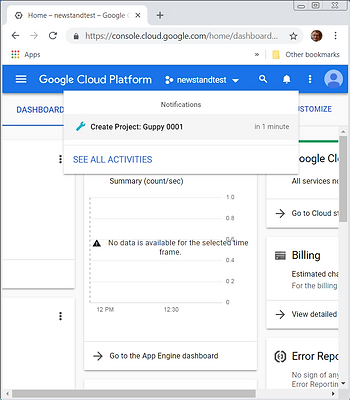

...(A) click the pull-down to (B) select my project: Guppy 0001.

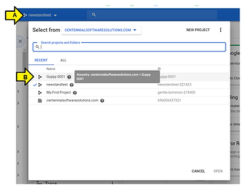

... to see the dashboard:

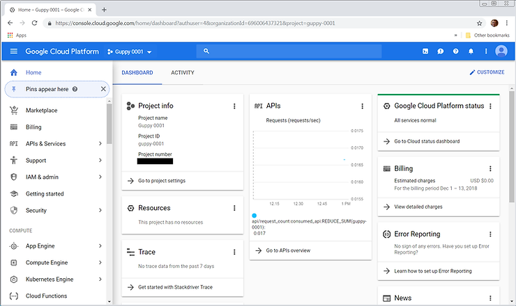

> 2\. Make sure that billing is enabled for your project.

1\. Read the steps posted at \[[<u><span>link</span></u>](https://cloud.google.com/billing/docs/how-to/modify-project)\]

2\. Select **Billing**

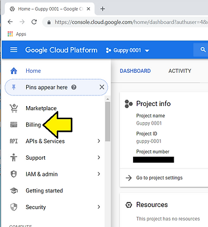

I see my billing dashboard:

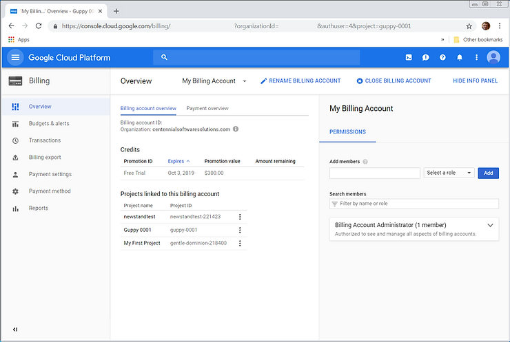

> 3\. Enable the Cloud IoT Core and Cloud Pub/Sub APIs.

1\. Make sure [google.cloud@centennialsoftwaresolutions.com](http://mqtt.googleapis.com:443/) is selected:

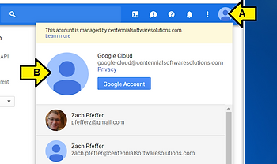

2\. (A) With **Guppy 0001** selected, scroll down and (B) click **IoT Core** under **BIG DATA**

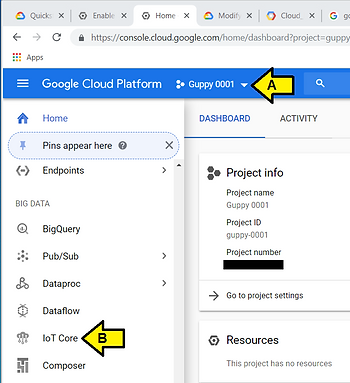

3\. Click **Enable API**

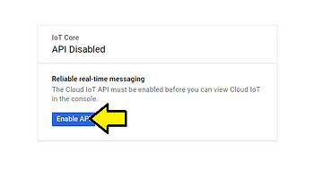

4\. Click **Create a device registry**

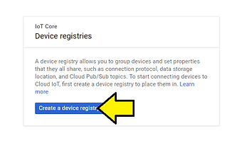

5\. After reviewing **Device registries** at \[[<u><span>link</span></u>](https://cloud.google.com/iot/docs/concepts/devices?hl=en_US&_ga=2.182174567.-1923354841.1544717667)\] and **Permitted characters and size requirements** at \[[<u><span>link</span></u>](https://cloud.google.com/iot/docs/requirements#permitted_characters_and_size_requirements)\]

Use:

Registry ID: **test-reg.0**

Region: **us-central1**

Both **MQTT** and **HTTP** protocols

Default telemetry topic: **test-topic.0**

And **Debug** level debugging

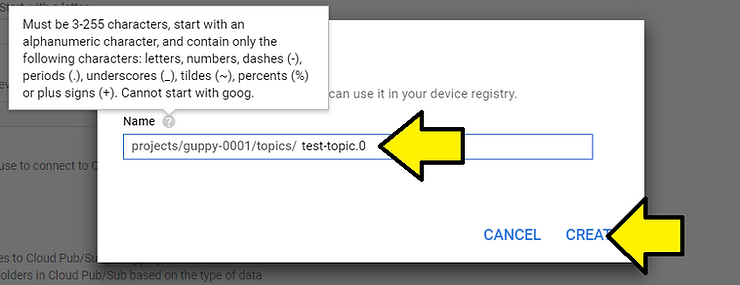

...and click **Create**


I see:

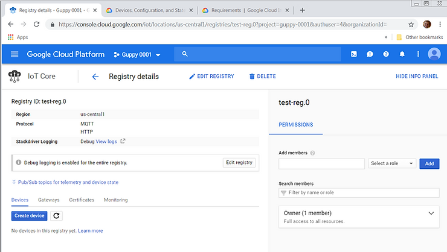

> **Generate a device key pair**

> Open a terminal window and run the following multi-line command to create an RS256 key:

```
openssl req -x509 -newkey rsa:2048 -keyout rsa_private.pem -nodes \
    -out rsa_cert.pem -subj "/CN=unused"
```

1\. (A) Click to launch a Google Cloud Shell Environment shell, (B) paste command above to create a key

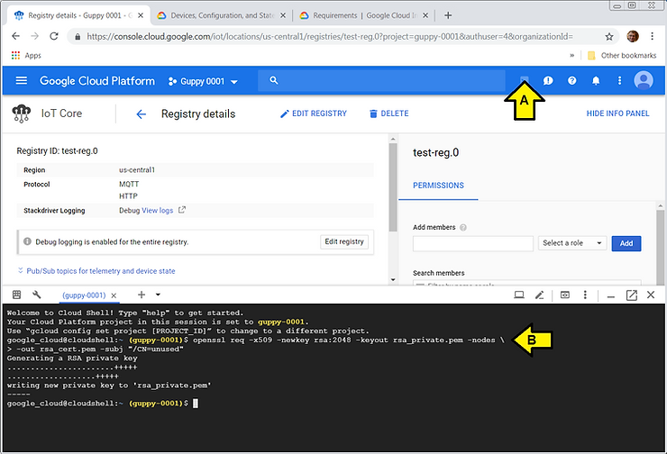

2\. Type **ls** in the shell to see the files with the keys:

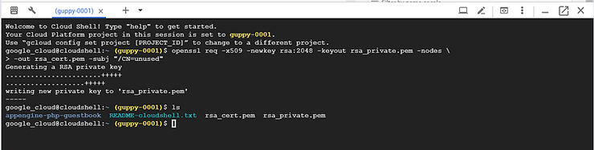

3\. Save the keys

(A) Click the **3 vertical dots** icon, the (B) click **Download file**

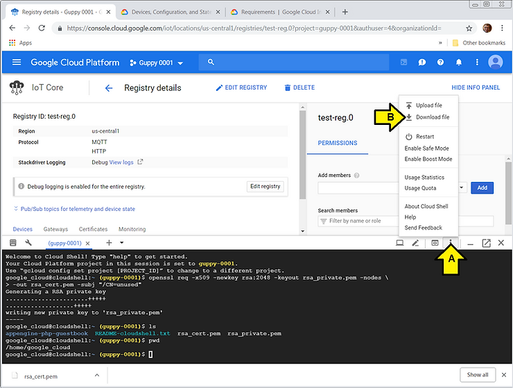

...enter: /home/google\_cloud/rsa\_cert.pem and click **DOWNLOAD**

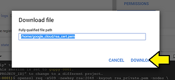

...click **Save**

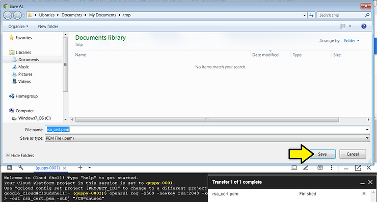

...do the same thing for: /home/google\_cloud/rsa\_private.pem

> **Add a device to the registry**

1\. Click **Create device**

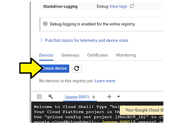

2\. Enter **my-device** for the **Device ID**

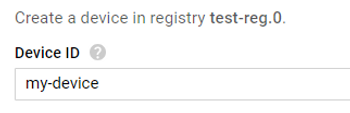

3\. Click the **Allow** radio button under **Device communication**

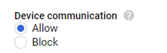

4\. Select the **RS256\_X509** radio button under **Public key format**

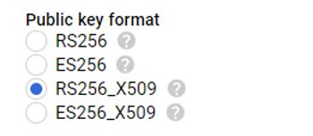

5\. Type **cat rsa\_cert.pem** in the Google Cloud Shell


6\. (A) Use you mouse to select the key (it will be copied), (B) then click the **Public key value** box and (C) press Ctrl-v (to paste).

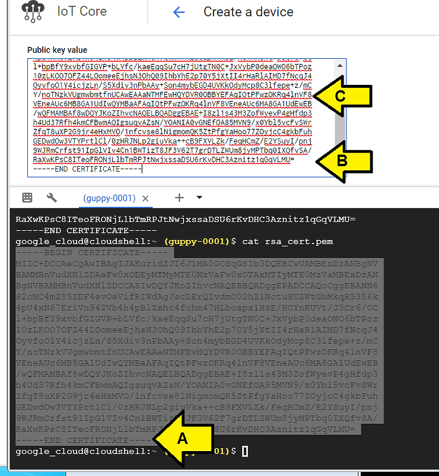

7\. Leave **Public key expiration data** unset

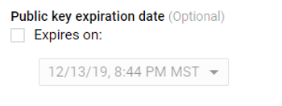

8\. Leave **Device metadata** blank

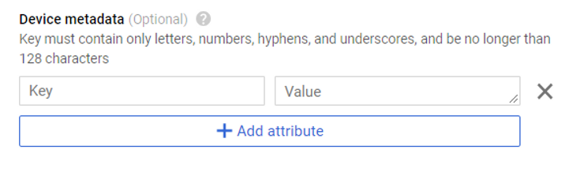

9\. Click **Debug** level **Stackdriver Logging**


10\. Click **Create**

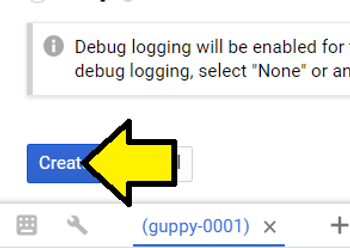

Continuing from **Google Cloud Internet of Things Core: Using the MQTT Bridge** at \[[<u><span>link</span></u>](https://cloud.google.com/iot/docs/how-tos/mqtt-bridge)\]

> **MQTT server**

> The Cloud IoT Core service supports the MQTT protocol by running a managed broker that listens to the port [<u><span>mqtt.googleapis.com:8883</span></u>](http://mqtt.googleapis.com:443/). Port 8883 is the standard TCP port reserved with IANA for secure MQTT connections. Connections to this port must use TLS transport, which is supported by open source clients like Eclipse Paho.

> If port 8883 is blocked by your firewall, you can also use port 443: mqtt.googleapis.com:443.

> **Device authentication**

> When the MQTT client connects, it must specify the device by setting the MQTT client ID to the full device path:

projects/{project-id}/locations/{cloud-region}/registries/{registry-id}/devices/{device-id}

In this case:

projects/{project-id}/locations/{cloud-region}/registries/{registry-id}/devices/{device-id}

project-id: **guppy-0001**

cloud-region: **us-central1**

registry-id: **test-reg.0**

device-id: **my-device**

projects/**guppy-0001**/locations/**us-central1**/registries/**test-reg.0**/devices/**my-device**

...and the device state topic is:

projects/**guppy-0001**/topics/**test-topic.0**

Continuing from Google Cloud Internet of Things Core: Using JSON Web Tokens (JWTs) \[[<u><span>link</span></u>](https://cloud.google.com/iot/docs/how-tos/credentials/jwts)\]

> When connecting over [<u><span>MQTT</span></u>](https://cloud.google.com/iot/docs/how-tos/mqtt-bridge), the JWT must be set in the password field of the CONNECT message. When connecting over [<u><span>HTTP</span></u>](https://cloud.google.com/iot/docs/how-tos/http-bridge), a JWT must be included in the header of each HTTP request.

**<u><span>References</span></u>**

Google Cloud logo found with a Google image search, image from \[[<u><span>link</span></u>](https://yt3.ggpht.com/a-/AN66SAx6Cwzxq2OQKvTWQH88cu20O_rfoMBhC3UqzQ=s900-mo-c-c0xffffffff-rj-k-no)\]