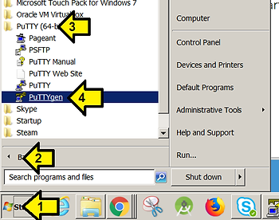
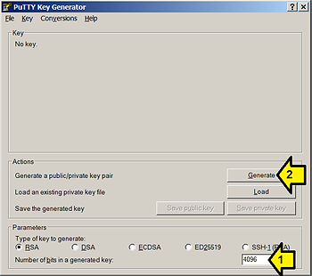
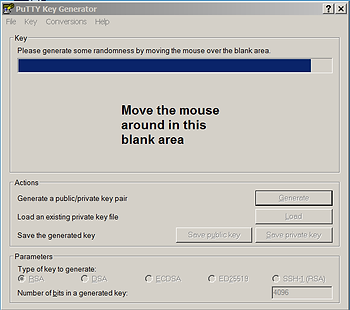
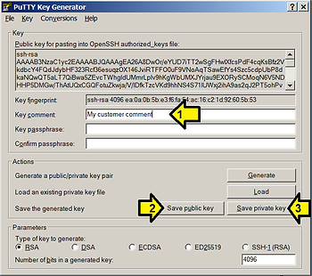

# Generate a 4096 RSA Key Pair w/ a Comment & Send Public Key

This post gives step-by-step instructions for generating a 4096 bit RSA public and private key with the comment field set using PuTTYgen on Windows. It also shows where the public key is kept so you can send the right one.

1\. Install PuTTY for Windows from [link](http://www.ssh.com/a/putty-0.70-installer.msi).

2\. Click (1) Start menu → (2) All Programs → (3) PuTTY→ (4)PuTTYgen.

3\. (1) Enter 4096 in the **Number of bits in a generated key** field

and (2) click **Generate**.

4\. Move the mouse around in the blank area to gen the key:

5\. (1) Add your comment and click (2) **Save public key.** Save as **key.pub** then click (3) **Save private key**. Save as key.priv. Don't share key.priv with anyone. Click Save without Key passphrase or enter a key passphrase to protect the actual private key. See details at [link](http://www.ssh.com/ssh/passphrase).

Note: the Key fingerprint is a short form for the public key. See details at [link](http://en.wikipedia.org/wiki/Public_key_fingerprint).

References

1. [PUTTY DOWNLOAD - FREE SSH & TELNET CLIENT](http://www.ssh.com/ssh/putty/download)
2. [PUTTYGEN - KEY GENERATOR FOR PUTTY ON WINDOWS](http://www.ssh.com/ssh/putty/windows/puttygen)