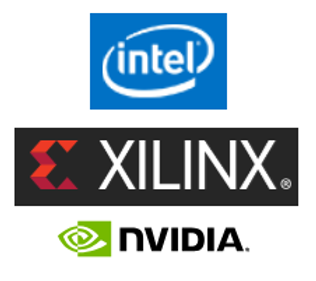
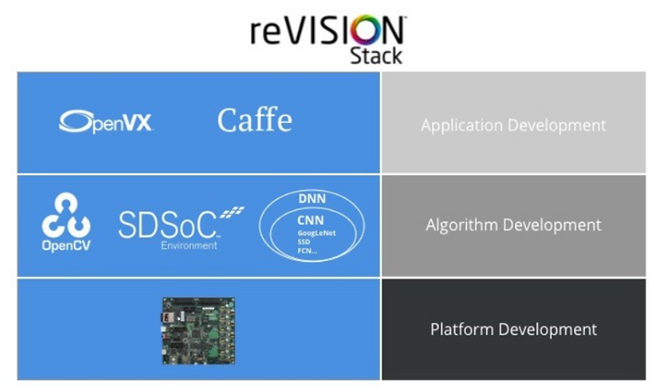
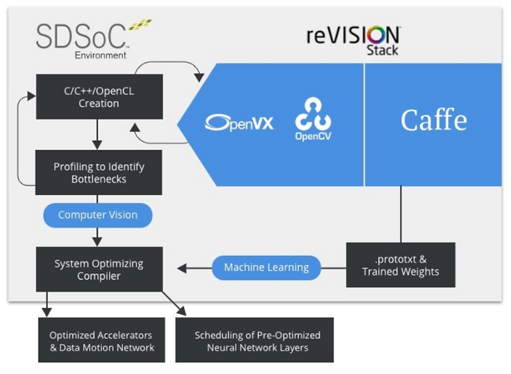
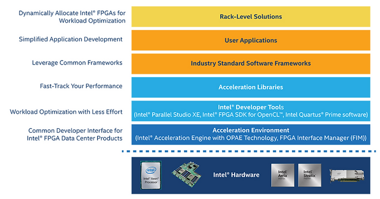
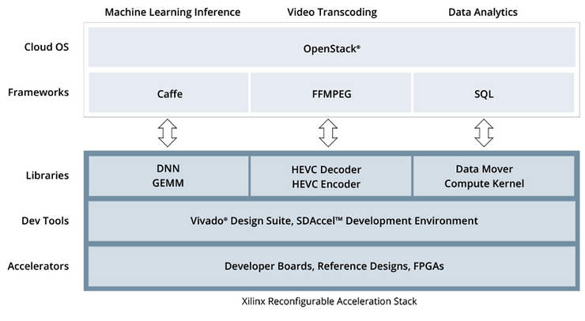
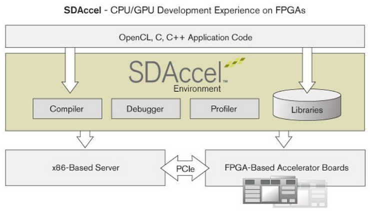
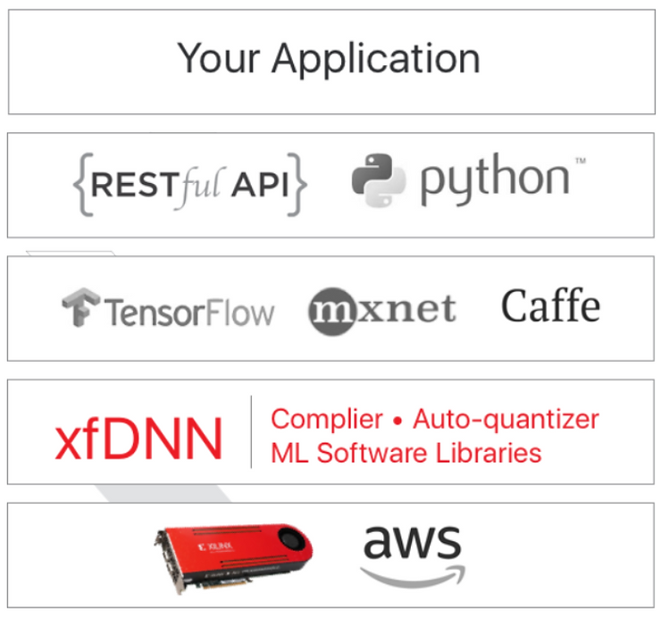

# Grab Bag of FPGA and GPU Software Tools from Intel, Xilinx & NVIDIA

The following is an "grab bag" of the development tools that Intel, Xilinx and Nvidia release to work with FPGAs and GPUs. 

**FPGA's as Accelerators**

From the Intel® FPGA SDK for OpenCL™ Product Brief available at [link](http://www.altera.com/content/dam/altera-www/global/en_US/pdfs/literature/po/ps-opencl.pdf).

"The FPGA effectively creates custom hardware for each instruction being accelerated providing a much more power efficient use of the hardware than that of the CPU or GPU architecture would allow."

**Hardware**

With Intel, developers can utilize an x86 with a built-in FPGA or connect a card with an Intel or Xilinx FPGA to an x86. This **Host + FPGA Acceleration** would typically be used in a "server."

With Intel and Xilinx, developers can also get a chip with an ARM core + FPGA. This **FPGA + ARM SoC Acceleration** is typically used in embedded systems.

Developers can also connect a GPU card from Nvidia to an x86 host. Developers can also get an integrated GPU from Intel. Nvidia also provides chips with ARM cores + GPUs.

**Tools**

Intel and Xilinx provide tools to help developers accelerate x86 code execution using an FPGA attached to the x86. They also provide tools to accelerate ARM code execution using an FPGA attached to the ARM.

Intel, Xilinx and Nvidia all provide OpenCL libraries to access their hardware. These libraries can not interoperate with one another. Intel also provides libraries to support OpenMP and Nvidia provides CUDA for programming their GPUS. Xilinx includes their OpenCL library in an SDK called SDAccel and an SDK called SDSoC. SDAccel is used for x86 + Xilinx FPGA systems, i.e. servers. SDSoC is used for Xilinx chips with ARM + FPGAs, i.e. embedded systems.

**Libraries**

To help developers building computer vision applications, Xilinx provides OpenVX, Caffe, OpenCV and various DNN and CNN libraries in an SDK called reVISION for software running on chips with an ARM+FPGA.

All of these libraries and many more are available for x86 systems.

Xilinx also provides neural network inference, HEVC decoders and encoders and SQL data-mover, function accelerator libraries.

**Tools for FPGA + ARM SoC Acceleration**

Intel

From [link](http://www.altera.com/products/soc/tools_and_software.html#soc_eds) developers can work with ARM SoCs from Intel using:

-   ARM DS-5 for debug
    
-   SoC FPGA Embedded Development Suite for embedded software development tools
    
-   Intel® Quartus® Prime Software for working with the programmable logic
    
-   Virtual Platform for simulating the ARM
    
-   SoC Linux for running Linux on the FPGA + ARM SoC
    
-   Higher Level
    
-   Intel® FPGA SDK for OpenCL™ is available for programming the ARM + FPGA chips using OpenCL.
    

Xilinx

Developers can work with ARM SoCs from Xilinx using:

-   An SDK for application development and debug
    
-   PetaLinux Tools for Linux development and ARM simulation and
    
-   Vivado for using the PL for working with its FPGA + ARM SoC chips
    

_Higher Level_

Xilinx provides SDSoC for accelerating ARM applications on the built-in FPGA. Users can program in C and/or C++ and SDSoC will automatically partition the algorithm between the ARM core and the FPGA. Developers can also program using OpenCL and SDSoC will link in an embedded OpenCL library and build the resulting ARM+FPGA system. SDSoC also supports debugging and profiling.

_Domain Specific_

Xilinx leverages SDSoC to create an embedded vision stack called reVISION.

From [link](http://www.xilinx.com/products/design-tools/embedded-vision-zone.html):

**Tools for Host + FPGA Acceleration**

OpenCL

Intel and Xilinx both allow developers to use OpenCL to write programs that can use FPGAs to accelerate computation.

As stated, Xilinx also provides tools that can compile C/C++ programs to FPGA gates without OpenCL through SDAccel using proprietary technology. SDAccel also supports compiling C/C++ programs directly to gates for a host connected to an FPGA.

Intel Developer Tools for Host + FPGA Acceleration

An overview of the Acceleration Stack for Intel Xeon CPU with FPGAs is located [here](http://www.altera.com/solutions/acceleration-hub/acceleration-stack.html).

_Intel FPGA SDK for OpenCL™_

From [link](http://www.altera.com/products/design-software/embedded-software-developers/opencl/developer-zone.html): 

"Intel FPGA SDK for OpenCL provides a vendor extension, an I/O, and a Host Channel API to stream data into a kernel directly from a streaming I/O interface such as 10 Gb Ethernet."

Key Features

-   Microsoft\* Visual Studio or Eclipse-based Intel Code Builder for OpenCL API now with FPGA support
    
-   Fast FPGA emulation based on Intel's compiler technology
    
-   Create OpenCL project jump-start wizard
    
-   Syntax highlighting and code auto-completion features
    
-   What-if kernel performance analysis
    
-   Quick static FPGA resource and performance analysis
    
-   Support for fast and incremental FPGA compile
    

_Intel Quartus® Prime software_

From [link](http://www.altera.com/products/design-software/fpga-design/quartus-prime/overview.html):

"includes everything you need to design for Intel® FPGAs, SoCs, and CPLDs from design entry and synthesis to optimization, verification, and simulation"

_Intel® Parallel Studio XE_

From [link](http://software.intel.com/en-us/parallel-studio-xe):

"Build and modernize code with the latest techniques in vectorization, multithreading, multinode parallelization, and memory optimization."

Includes

-   Expanded C++17 and Fortran 2018 support
    
-   Full OpenMP\* 4.5 and expanded partial support for OpenMP\* 5.0 (Preview 2) specification
    
-   Python\* 3.6 and 2.7
    

Upcoming

-   Intel® VTune™ Amplifier
    
-   Preview of CPU/FPGA Interaction analysis for systems with a discrete Intel® Arria® 10 FPGA.
    

_Open Programmable Acceleration Engine (OPAE) Technology_

From the OPAE white paper at [link](http://01.org/sites/default/files/downloads/opae/open-programmable-acceleration-engine-paper.pdf):

"The Open Programmable Acceleration Engine (OPAE) is an open community effort started by Intel to simplify and streamline the integration of various FPGA acceleration devices into software applications and environments."

From [link](http://www.altera.com/solutions/acceleration-hub/acceleration-stack.html): 

Intel has open sourced OPAE and is upstreaming all Linux kernel patches for it.

Xilinx Reconfigurable Acceleration Stack for Host + FPGA Acceleration

Xilinx's Reconfigurable Acceleration Stack is pictured here.

From [link](http://www.xilinx.com/products/design-tools/acceleration-zone.html#libraries):

The SDAccel™ development environment for OpenCL™, C, and C++ is shown here

Intel vs SDAccel OpenCL SDK Feature Comparison

_Take Away_

Intel's SDK can plug into your existing tools and workflow. Xilinx's SDK does not plug into your existing tools and workflow; it is a new set of tools and workflow.

_Detail_

Compare:

-   Intel FPGA SDK for OpenCL™
    
-   SDAccel™ development environment for OpenCL™, C, and C++
    

| Feature                                                      | Intel FPGA SDK for OpenCL™ | SDAccel™ development environment for OpenCL™, C, and C++ |
| ------------------------------------------------------------ | -------------------------- | -------------------------------------------------------- |
| Plug-In for Microsoft* Visual Studio                         | Yes                        | No                                                       |
| Plug-in for standard Eclipse                                 | Yes                        | No                                                       |
| Custom Eclipse Environment                                   | N/A (plug-in exists)       | Yes                                                      |
| FPGA emulation                                               | Yes                        | Yes                                                      |
| Create OpenCL project jump-start wizard                      | Yes                        | No                                                       |
| Automatically find and map parallelism in standard C/C++ (no OpenCL needed) | No                         | Yes                                                      |
| Syntax highlighting and code auto-completion features        | Yes                        | Yes                                                      |
| What-if kernel performance analysis                          | Yes                        | None found                                               |
| Quick static FPGA resource and performance analysis          | Yes                        | Yes (would need to measure Xilinx and Intel performance) |
| Support for fast and incremental FPGA compile                | Yes                        | Yes                                                      |

Intel FPGA SDK for OpenCL™ feature list from "Key Features" listed at [link](http://www.altera.com/products/design-software/embedded-software-developers/opencl/developer-zone.html).

Xilinx SDAccel™ development environment for OpenCL™, C, and C++ feature list derived from SDAccel Environment User Guide UG 1023 (v2018.1) April 4, 2018 listed at [link](http://www.xilinx.com/support/documentation/sw_manuals/xilinx2018_1/ug1023-sdaccel-user-guide.pdf).

**Machine Learning**

With Intel developers can develop and deploy ML solutions natively. Developers can also develop and deploy ML solutions using Nvidia. Xilinx only support ML deploy.

Nvidia and Xilinx present a few reasons why you'd want to consider GPUs or FPGAs to help solve your problem. Of the many reasons, Xilinx claims at [link](http://www.xilinx.com/applications/megatrends/machine-learning.html) that when they "measured inception V1 against c4.large instances on AWS EC2 it was 90% faster.

Nvidia

Nvidia offers solutions that can train and infer.

From [link](http://www.nvidia.com/en-us/deep-learning-ai/solutions/):

Xilinx

Xilinx offers the Xilinx ML Suite for ML inference, i.e. deployment. Developers are meant to build their application and then deploy it on their cloud or on their own hardware using Xilinx hardware.

The stack from [link](http://www.xilinx.com/applications/megatrends/machine-learning.html):

**References not Listed Above**

-   No-cruft Excel to HTML at [link](http://pressbin.com/tools/excel_to_html_table/index.html)
    
-   Intel logo from [link](http://www.intel.com/content/www/us/en/homepage.html)
    
-   Xilinx logo from [link](http://www.xilinx.com/)
    
-   NVIDIA logo from [link](http://www.nvidia.com/page/home.html)