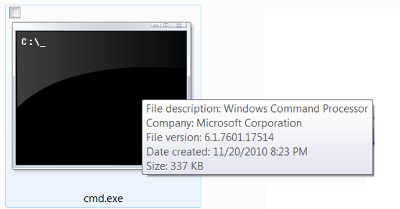

# help dir



This post lists the output of **help dir**.

**Output**

```
c:\Users\pfefferz>help dir
Displays a list of files and subdirectories in a directory.

DIR [drive:][path][filename] [/A[[:]attributes]] [/B] [/C] [/D] [/L] [/N]
  [/O[[:]sortorder]] [/P] [/Q] [/R] [/S] [/T[[:]timefield]] [/W] [/X] [/4]

  [drive:][path][filename]
              Specifies drive, directory, and/or files to list.

  /A          Displays files with specified attributes.
  attributes   D  Directories                R  Read-only files
               H  Hidden files               A  Files ready for archiving
               S  System files               I  Not content indexed files
               L  Reparse Points             -  Prefix meaning not
  /B          Uses bare format (no heading information or summary).
  /C          Display the thousand separator in file sizes.  This is the
              default.  Use /-C to disable display of separator.
  /D          Same as wide but files are list sorted by column.
  /L          Uses lowercase.
  /N          New long list format where filenames are on the far right.
  /O          List by files in sorted order.
  sortorder    N  By name (alphabetic)       S  By size (smallest first)
               E  By extension (alphabetic)  D  By date/time (oldest first)
               G  Group directories first    -  Prefix to reverse order
  /P          Pauses after each screenful of information.
  /Q          Display the owner of the file.
  /R          Display alternate data streams of the file.
  /S          Displays files in specified directory and all subdirectories.
  /T          Controls which time field displayed or used for sorting
  timefield   C  Creation
              A  Last Access
              W  Last Written
  /W          Uses wide list format.
  /X          This displays the short names generated for non-8dot3 file
              names.  The format is that of /N with the short name inserted
              before the long name. If no short name is present, blanks are
              displayed in its place.
  /4          Displays four-digit years

Switches may be preset in the DIRCMD environment variable.  Override
preset switches by prefixing any switch with - (hyphen)--for example, /-W.
```

**<u><span>Notes</span></u>**

**cmd.exe** @ C:\\Windows\\System32

File description: Windows Command Processor

File version: 6.1.7601.17514

Date created: 11/20/2010 8:23 PM

Size: 337 KB